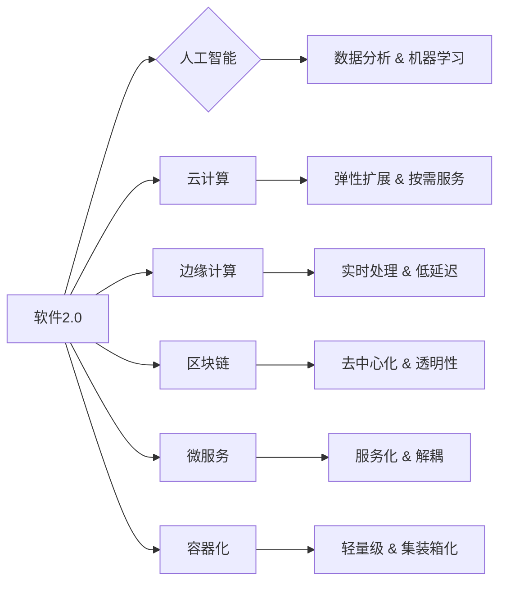

# 软件 2.0 的未来展望：更智能、更强大

> 关键词：软件2.0，人工智能，自动化，云计算，边缘计算，区块链，微服务，容器化，软件架构

## 1. 背景介绍

随着信息技术的飞速发展，软件产业已经经历了多个重大变革。从最初的软件1.0时代，到软件2.0时代的到来，软件正在从简单的代码集合向智能、高效、安全、可扩展的方向演进。本文将探讨软件2.0的核心概念、发展趋势、面临的挑战以及未来展望。

### 1.1 软件发展的四个时代

1. **软件1.0时代（1940s-1970s）**：以编程语言和汇编语言为主，软件主要用于数据处理和自动化。
2. **软件2.0时代（1970s-2000s）**：以图形用户界面(GUI)和数据库技术为代表，软件开始向用户友好的方向发展。
3. **软件3.0时代（2000s-至今）**：以互联网和移动技术为主，软件变得更加开放和互联。
4. **软件4.0时代（未来）**：以人工智能、云计算、边缘计算、区块链等新技术为驱动力，软件将变得更加智能、强大和灵活。

### 1.2 软件2.0的核心特征

软件2.0时代，软件的核心特征主要体现在以下几个方面：

- **智能化**：利用人工智能技术，软件能够自主学习、自我优化，提供更加智能化的服务。
- **自动化**：通过自动化工具和流程，提高软件开发、部署和维护的效率。
- **云化**：软件应用和服务向云平台迁移，实现弹性扩展和按需服务。
- **开放性**：软件生态系统更加开放，第三方开发者可以轻松接入和集成。
- **安全性和可靠性**：随着网络安全威胁的增加，软件的安全性成为重点关注。

## 2. 核心概念与联系

### 2.1 核心概念原理和架构的 Mermaid 流程图



### 2.2 核心概念与联系详解

- **人工智能（AI）**：通过机器学习、深度学习等技术，使软件具备感知、认知和决策能力。
- **云计算**：通过互联网提供动态易扩展且经常是虚拟化的资源。
- **边缘计算**：在数据产生的地方进行计算，降低延迟，提高实时性。
- **区块链**：一种分布式数据库技术，确保数据的安全性和不可篡改性。
- **微服务**：将大型应用程序分解为小型、独立的服务，提高灵活性和可扩展性。
- **容器化**：将应用程序及其依赖打包在容器中，实现快速部署和迁移。

## 3. 核心算法原理 & 具体操作步骤

### 3.1 算法原理概述

软件2.0时代的核心算法包括：

- **机器学习算法**：如线性回归、决策树、支持向量机、神经网络等，用于数据分析和预测。
- **深度学习算法**：如卷积神经网络(CNN)、循环神经网络(RNN)、Transformer等，用于图像识别、语音识别、自然语言处理等。
- **云计算算法**：如负载均衡、弹性伸缩、自动扩展等，用于提高云服务的可用性和性能。
- **区块链算法**：如共识算法、加密算法等，用于确保数据的安全性和不可篡改性。

### 3.2 算法步骤详解

以机器学习算法为例，其基本步骤如下：

1. **数据收集**：收集相关领域的样本数据。
2. **数据预处理**：对数据进行清洗、转换、归一化等操作。
3. **模型选择**：选择合适的机器学习算法和模型结构。
4. **模型训练**：使用训练数据对模型进行训练，调整模型参数。
5. **模型评估**：使用测试数据评估模型性能，调整模型参数。
6. **模型部署**：将模型部署到实际应用中。

### 3.3 算法优缺点

每种算法都有其优缺点，以下是一些常见算法的优缺点：

- **线性回归**：简单易用，但适用于线性关系，对于非线性关系效果较差。
- **决策树**：易于理解和解释，但可能存在过拟合问题。
- **支持向量机**：在分类任务中性能较好，但参数调优复杂。
- **神经网络**：适用于复杂非线性关系，但计算量较大，难以解释。

### 3.4 算法应用领域

各种算法在以下领域有广泛应用：

- **机器学习算法**：数据挖掘、推荐系统、金融风控等。
- **深度学习算法**：计算机视觉、语音识别、自然语言处理等。
- **云计算算法**：云服务、分布式计算等。
- **区块链算法**：数字货币、供应链管理等。

## 4. 数学模型和公式 & 详细讲解 & 举例说明

### 4.1 数学模型构建

以神经网络为例，其数学模型如下：

$$
f_{W,b}(x) = \sigma(W^T x + b)
$$

其中，$W$ 为权重矩阵，$b$ 为偏置，$x$ 为输入向量，$\sigma$ 为激活函数。

### 4.2 公式推导过程

神经网络的推导过程涉及矩阵运算、微分和链式法则等。

### 4.3 案例分析与讲解

以下是一个简单的神经网络示例：

输入层：$x_1, x_2, x_3$

隐藏层：$h_1, h_2$

输出层：$y$

$$
h_1 = \sigma(W_1^T x + b_1)
$$

$$
h_2 = \sigma(W_2^T h_1 + b_2)
$$

$$
y = \sigma(W_3^T h_2 + b_3)
$$

其中，$W_1, W_2, W_3$ 为权重矩阵，$b_1, b_2, b_3$ 为偏置，$\sigma$ 为激活函数。

## 5. 项目实践：代码实例和详细解释说明

### 5.1 开发环境搭建

以下是一个使用Python和TensorFlow构建神经网络的项目实践：

```python
import tensorflow as tf

# 定义模型结构
model = tf.keras.Sequential([
    tf.keras.layers.Dense(64, activation='relu', input_shape=(784,)),
    tf.keras.layers.Dense(64, activation='relu'),
    tf.keras.layers.Dense(10, activation='softmax')
])

# 编译模型
model.compile(optimizer='adam', loss='categorical_crossentropy', metrics=['accuracy'])

# 加载数据
mnist = tf.keras.datasets.mnist
(x_train, y_train), (x_test, y_test) = mnist.load_data()

# 数据预处理
x_train = x_train.reshape(-1, 784)
x_test = x_test.reshape(-1, 784)
x_train, x_test = x_train / 255.0, x_test / 255.0

# 训练模型
model.fit(x_train, y_train, epochs=5, batch_size=32, validation_data=(x_test, y_test))
```

### 5.2 源代码详细实现

以上代码展示了如何使用TensorFlow构建一个简单的神经网络模型，并进行训练和评估。

### 5.3 代码解读与分析

- `tf.keras.Sequential`：创建一个序列模型，依次添加层。
- `tf.keras.layers.Dense`：添加全连接层。
- `model.compile`：编译模型，指定优化器、损失函数和评价指标。
- `mnist.load_data`：加载MNIST手写数字数据集。
- `model.fit`：训练模型，指定训练数据、训练轮数、批大小和验证数据。

### 5.4 运行结果展示

运行上述代码后，模型将在MNIST数据集上进行训练和评估，并在终端打印出训练过程中的损失和准确率。

## 6. 实际应用场景

### 6.1 智能金融

人工智能在金融领域的应用主要包括：

- **风险管理**：通过机器学习模型识别欺诈交易、信用风险等。
- **投资顾问**：利用自然语言处理技术，为投资者提供个性化的投资建议。
- **智能客服**：通过语音识别和自然语言处理技术，提供24小时不间断的客服服务。

### 6.2 智能制造

人工智能在制造领域的应用主要包括：

- **智能工厂**：利用人工智能技术实现生产过程的自动化、智能化。
- **产品质量检测**：通过图像识别技术检测产品质量，提高生产效率。
- **供应链管理**：利用人工智能技术优化供应链管理，降低成本。

### 6.3 智能医疗

人工智能在医疗领域的应用主要包括：

- **疾病诊断**：通过图像识别技术辅助医生进行疾病诊断。
- **药物研发**：利用人工智能技术加速药物研发过程。
- **健康管理**：通过可穿戴设备收集用户健康数据，提供个性化的健康管理方案。

## 7. 工具和资源推荐

### 7.1 学习资源推荐

- **在线课程**：Coursera、Udemy、edX等平台上的机器学习、深度学习、云计算等课程。
- **书籍**：《深度学习》、《机器学习实战》、《Python机器学习》等。
- **论文**：arXiv、NeurIPS、ICML等学术会议的论文。

### 7.2 开发工具推荐

- **开发框架**：TensorFlow、PyTorch、Keras等。
- **云平台**：AWS、Azure、Google Cloud等。
- **容器化技术**：Docker、Kubernetes等。

### 7.3 相关论文推荐

- **《Deep Learning》**：Goodfellow等著作，全面介绍了深度学习的基本概念、技术原理和应用案例。
- **《Reinforcement Learning: An Introduction》**：Sutton和Barto著作，深入讲解了强化学习的基本原理和应用方法。
- **《Learning from Data》**：Bottou等著作，介绍了机器学习的理论基础和方法。

## 8. 总结：未来发展趋势与挑战

### 8.1 研究成果总结

软件2.0时代，人工智能、云计算、边缘计算、区块链等新技术为软件产业带来了前所未有的变革。软件变得更加智能、高效、安全、可扩展，为各行各业带来了巨大的价值。

### 8.2 未来发展趋势

- **智能化**：软件将更加智能化，能够自主学习、自我优化，提供更加个性化的服务。
- **云原生**：软件将更加云原生，能够在云平台无缝部署和扩展。
- **自动化**：软件开发、部署和维护将更加自动化，提高效率。
- **安全性和可靠性**：软件的安全性将得到进一步提升，确保数据和系统的可靠性。

### 8.3 面临的挑战

- **数据安全和隐私**：随着数据规模的不断扩大，数据安全和隐私保护将成为重要挑战。
- **算法偏见和歧视**：人工智能算法可能存在偏见和歧视，需要采取措施消除。
- **技术更新迭代**：新技术层出不穷，需要不断学习和适应。

### 8.4 研究展望

软件2.0时代，软件技术将朝着更加智能、高效、安全、可扩展的方向发展。未来的研究将重点关注以下方向：

- **可解释人工智能**：提高人工智能算法的可解释性，增强用户信任。
- **联邦学习**：保护用户隐私的同时，实现机器学习模型的训练。
- **跨领域知识融合**：将不同领域的知识融合到软件系统中，提高系统的智能程度。

## 9. 附录：常见问题与解答

**Q1：软件2.0与软件1.0有什么区别？**

A：软件2.0时代，软件变得更加智能、高效、安全、可扩展，与软件1.0时代的传统软件相比，具有以下特点：

- 智能化：利用人工智能技术，软件能够自主学习、自我优化。
- 自动化：通过自动化工具和流程，提高软件开发、部署和维护的效率。
- 云化：软件应用和服务向云平台迁移，实现弹性扩展和按需服务。
- 开放性：软件生态系统更加开放，第三方开发者可以轻松接入和集成。
- 安全性和可靠性：随着网络安全威胁的增加，软件的安全性成为重点关注。

**Q2：软件2.0有哪些应用场景？**

A：软件2.0在以下领域有广泛的应用场景：

- 金融：风险管理、投资顾问、智能客服等。
- 制造：智能工厂、产品质量检测、供应链管理等。
- 医疗：疾病诊断、药物研发、健康管理等。

**Q3：如何应对软件2.0时代面临的挑战？**

A：应对软件2.0时代面临的挑战，需要从以下几个方面入手：

- 加强数据安全和隐私保护。
- 消除算法偏见和歧视。
- 持续学习和适应新技术。
- 加强国际合作和交流。

**Q4：软件2.0的未来发展趋势是什么？**

A：软件2.0的未来发展趋势包括：

- 智能化：软件将更加智能化，能够自主学习、自我优化。
- 云原生：软件将更加云原生，能够在云平台无缝部署和扩展。
- 自动化：软件开发、部署和维护将更加自动化，提高效率。
- 安全性和可靠性：软件的安全性将得到进一步提升，确保数据和系统的可靠性。

作者：禅与计算机程序设计艺术 / Zen and the Art of Computer Programming