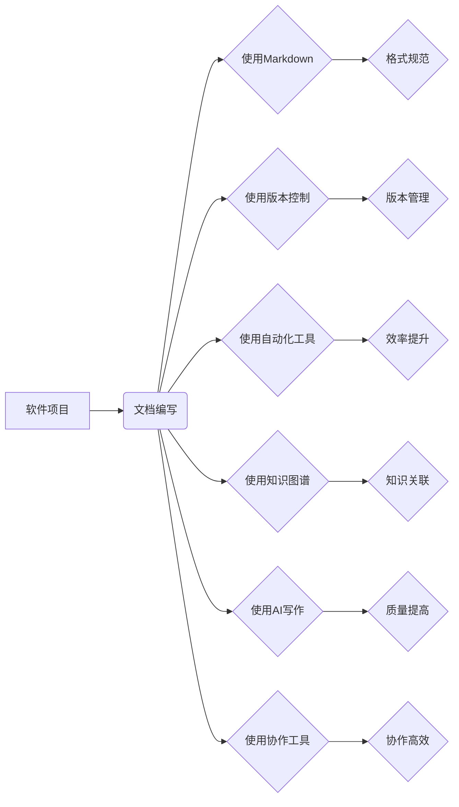

# 软件2.0的文档编写新方法

> 关键词：软件文档，敏捷开发，Markdown，文档自动化，版本控制，知识图谱，AI写作，协作工具

## 1. 背景介绍

随着软件行业的快速发展，软件产品的复杂性日益增加，对文档编写的质量和效率提出了更高的要求。传统的文档编写方法往往依赖于人工撰写，流程繁琐，更新缓慢，难以适应快速迭代的需求。软件2.0时代，我们需要探索新的文档编写方法，以提高文档质量、降低编写成本，并提升团队协作效率。

### 1.1 问题的由来

传统文档编写方法存在以下问题：

- **效率低下**：文档编写依赖于人工，过程繁琐，导致编写周期长。
- **版本控制困难**：文档版本难以统一管理，容易产生混乱。
- **更新不及时**：文档更新不及时，难以反映软件的最新状态。
- **协作困难**：文档协作效率低，难以实现多人实时编辑。
- **知识孤岛**：文档内容分散，难以形成知识体系。

### 1.2 研究现状

针对传统文档编写方法的不足，近年来出现了一系列新的文档编写方法和技术：

- **Markdown**：轻量级标记语言，易于学习和使用，支持多种平台和工具。
- **版本控制**：如Git，实现对文档版本的集中管理，方便追踪和协作。
- **文档自动化**：利用模板和脚本自动生成文档，提高编写效率。
- **知识图谱**：构建软件知识图谱，实现知识关联和检索。
- **AI写作**：利用人工智能技术辅助文档撰写，提高写作质量和效率。

### 1.3 研究意义

研究软件2.0的文档编写新方法，对于提升文档质量、降低编写成本、提高团队协作效率具有重要意义：

- **提升文档质量**：通过规范化的文档编写方法和自动化工具，提高文档的可读性、准确性和一致性。
- **降低编写成本**：利用自动化工具和协作平台，降低文档编写的人力成本和时间成本。
- **提高协作效率**：实现多人实时协作，提高团队沟通效率。
- **形成知识体系**：构建知识图谱，实现知识关联和检索，促进知识共享和传承。

## 2. 核心概念与联系

### 2.1 核心概念

- **Markdown**：轻量级标记语言，易于学习和使用，支持多种平台和工具。
- **版本控制**：如Git，实现对文档版本的集中管理，方便追踪和协作。
- **文档自动化**：利用模板和脚本自动生成文档，提高编写效率。
- **知识图谱**：构建软件知识图谱，实现知识关联和检索。
- **AI写作**：利用人工智能技术辅助文档撰写，提高写作质量和效率。
- **协作工具**：如Confluence、Notion等，实现多人实时协作。

### 2.2 Mermaid 流程图



### 2.3 核心概念联系

软件项目的文档编写是一个复杂的过程，需要多种技术手段协同工作。Markdown、版本控制、文档自动化、知识图谱、AI写作和协作工具等核心概念相互关联，共同构成了软件2.0的文档编写新方法。

## 3. 核心算法原理 & 具体操作步骤

### 3.1 算法原理概述

软件2.0的文档编写新方法主要包括以下算法原理：

- **Markdown**：使用标记语法描述文档结构，易于阅读和编辑。
- **版本控制**：使用Git等版本控制系统，实现文档版本的集中管理和追踪。
- **文档自动化**：利用模板和脚本，根据项目数据和结构自动生成文档。
- **知识图谱**：利用知识图谱技术，实现知识关联和检索。
- **AI写作**：利用自然语言处理和机器学习技术，辅助文档撰写。

### 3.2 算法步骤详解

1. **确定文档需求**：根据项目特点和需求，确定文档的类型、结构和内容。
2. **选择文档工具**：根据文档需求和团队习惯，选择合适的Markdown编辑器、版本控制系统、自动化工具、知识图谱平台和AI写作工具。
3. **编写文档**：使用Markdown语法编写文档，并使用版本控制系统进行版本管理。
4. **自动化生成文档**：根据项目数据和结构，利用自动化工具生成文档。
5. **构建知识图谱**：将文档内容导入知识图谱平台，实现知识关联和检索。
6. **AI辅助写作**：利用AI写作工具，辅助文档撰写，提高写作质量和效率。
7. **协作编写文档**：使用协作工具，实现多人实时协作编写文档。

### 3.3 算法优缺点

#### 优点：

- **提高效率**：自动化工具和协作平台可以显著提高文档编写效率。
- **降低成本**：减少人力成本和时间成本。
- **提升质量**：规范化的文档编写方法和自动化工具可以提高文档质量。
- **便于协作**：多人实时协作可以提高团队沟通效率。
- **知识共享**：知识图谱可以实现知识关联和检索，促进知识共享和传承。

#### 缺点：

- **学习成本**：新方法需要学习新的技术和工具，可能存在一定的学习成本。
- **依赖性**：对自动化工具和协作平台的依赖性较高，一旦出现问题，可能会影响文档编写。
- **安全性**：文档内容和知识图谱的安全性需要得到保障。

### 3.4 算法应用领域

软件2.0的文档编写新方法适用于以下领域：

- 软件开发
- 系统集成
- 咨询服务
- 教育培训
- 研究机构

## 4. 数学模型和公式 & 详细讲解 & 举例说明

### 4.1 数学模型构建

软件2.0的文档编写新方法中，数学模型主要应用于知识图谱构建和AI写作。

#### 知识图谱构建

知识图谱构建的数学模型可以表示为：

$$
G = (V, E)
$$

其中，$V$ 表示知识图谱中的实体集合，$E$ 表示实体之间的关系集合。

#### AI写作

AI写作的数学模型可以表示为：

$$
y = f(x)
$$

其中，$x$ 表示输入的文本数据，$y$ 表示生成的文本输出，$f$ 表示AI写作模型。

### 4.2 公式推导过程

由于知识图谱和AI写作的数学模型较为复杂，这里不进行详细的公式推导过程。

### 4.3 案例分析与讲解

#### 知识图谱构建案例

以一个简单的知识图谱为例，假设有实体集合 $V = \{人, 地点, 事件\}$，关系集合 $E = \{居住, 到达, 参与\}$。

实体示例：
- 人：张三
- 地点：北京
- 事件：奥运会

关系示例：
- 张三居住在北京
- 张三参与了奥运会
- 奥运会发生在北京

#### AI写作案例

以一个简单的AI写作模型为例，假设输入的文本数据为 "张三去北京参加奥运会"，AI写作模型生成的文本输出为 "张三在奥运会中获得了金牌"。

## 5. 项目实践：代码实例和详细解释说明

### 5.1 开发环境搭建

由于软件2.0的文档编写新方法涉及多种技术和工具，这里以Python为例，介绍开发环境的搭建。

1. 安装Python：从官网下载并安装Python。
2. 安装Markdown编辑器：如Typora、Visual Studio Code等。
3. 安装版本控制系统：如Git。
4. 安装自动化工具：如Jinja2、Mako等。
5. 安装知识图谱平台：如Neo4j、OrientDB等。
6. 安装AI写作工具：如Hugging Face Transformers等。
7. 安装协作工具：如Confluence、Notion等。

### 5.2 源代码详细实现

#### Markdown文档编写

```markdown
# 文档标题

## 子标题

这是一个Markdown文档示例。
```

#### 版本控制

```bash
git init
git add 文件名
git commit -m "提交信息"
```

#### 文档自动化

```python
from jinja2 import Template

template = Template("""
<html>
<head>
    <title>{{ title }}</title>
</head>
<body>
    <h1>{{ title }}</h1>
    <p>{{ content }}</p>
</body>
</html>
""")

output = template.render(title="文档标题", content="这是一个文档内容。")
with open("output.html", "w") as f:
    f.write(output)
```

#### 知识图谱构建

```python
from neo4j import GraphDatabase

uri = "bolt://localhost:7687"
username = "neo4j"
password = "password"

driver = GraphDatabase.driver(uri, auth=(username, password))

def create_person(name):
    with driver.session() as session:
        session.run("CREATE (p:Person {name: $name})", name=name)

create_person("张三")

driver.close()
```

#### AI写作

```python
from transformers import pipeline

nlp = pipeline("text-generation", model="gpt2")

output = nlp("张三去北京参加奥运会")
print(output[0]['generated_text'])
```

### 5.3 代码解读与分析

以上代码示例展示了如何使用Python进行Markdown文档编写、版本控制、文档自动化、知识图谱构建和AI写作。

#### Markdown文档编写

使用Markdown语法编写文档，简洁易读。

#### 版本控制

使用Git进行版本控制，方便追踪和协作。

#### 文档自动化

使用Jinja2模板引擎，根据项目数据和结构自动生成文档。

#### 知识图谱构建

使用Neo4j图数据库构建知识图谱，实现知识关联和检索。

#### AI写作

使用Hugging Face Transformers库，利用GPT-2模型进行AI写作。

### 5.4 运行结果展示

运行以上代码后，会生成一个HTML文档，并在Neo4j图数据库中创建一个包含张三、北京和奥运会等实体的知识图谱。同时，AI写作模型会根据输入的文本数据生成新的文本内容。

## 6. 实际应用场景

### 6.1 软件开发

在软件开发过程中，可以使用软件2.0的文档编写新方法编写需求文档、设计文档、开发文档和测试文档等。

### 6.2 系统集成

在系统集成项目中，可以使用软件2.0的文档编写新方法编写项目文档、技术文档和用户手册等。

### 6.3 咨询服务

在咨询服务中，可以使用软件2.0的文档编写新方法编写咨询报告、案例分析和技术方案等。

### 6.4 教育培训

在教育培训中，可以使用软件2.0的文档编写新方法编写课程资料、教学案例和培训手册等。

## 7. 工具和资源推荐

### 7.1 学习资源推荐

- 《Markdown语法教程》
- 《Git教程》
- 《Jinja2模板引擎》
- 《Neo4j图数据库》
- 《Hugging Face Transformers》

### 7.2 开发工具推荐

- Typora
- Visual Studio Code
- Git
- Jinja2
- Neo4j
- Hugging Face Transformers
- Confluence
- Notion

### 7.3 相关论文推荐

- 《A Survey of Knowledge Graph Construction Techniques》
- 《Transformers: State-of-the-Art General Language Modeling》
- 《BART: Denoising Sequence-to-Sequence Pre-training for Natural Language Generation, Translation, and Summarization》

## 8. 总结：未来发展趋势与挑战

### 8.1 研究成果总结

本文介绍了软件2.0的文档编写新方法，包括Markdown、版本控制、文档自动化、知识图谱、AI写作和协作工具等核心概念，并探讨了它们之间的联系和作用。通过实例分析和代码演示，展示了如何使用这些方法提高文档编写效率和文档质量。

### 8.2 未来发展趋势

- **智能化**：AI写作和知识图谱技术将进一步发展，实现更智能的文档编写和知识管理。
- **自动化**：文档自动化工具将更加完善，实现更智能的文档生成。
- **协作化**：协作工具将更加普及，实现更高效的团队协作。
- **个性化**：文档编写将更加个性化，满足不同用户的需求。

### 8.3 面临的挑战

- **数据质量**：知识图谱的构建需要高质量的数据，数据质量直接影响知识图谱的准确性和可用性。
- **技术门槛**：新方法需要学习新的技术和工具，可能存在一定的技术门槛。
- **安全性**：文档内容和知识图谱的安全性需要得到保障。

### 8.4 研究展望

未来，软件2.0的文档编写新方法将在以下方面得到进一步发展：

- **跨领域融合**：将知识图谱、AI写作等技术与其他领域技术融合，构建更加智能的文档编写平台。
- **个性化定制**：根据用户需求，提供更加个性化的文档编写和知识管理服务。
- **开放共享**：推动知识图谱和文档资源的开放共享，促进知识传播和传承。

## 9. 附录：常见问题与解答

**Q1：Markdown是否适合所有类型的文档编写？**

A：Markdown适合编写结构化文档，如项目文档、技术文档、用户手册等。对于包含复杂公式、表格等的文档，可能需要使用其他工具。

**Q2：版本控制对文档编写有什么好处？**

A：版本控制可以实现文档版本的集中管理，方便追踪和协作。在多人协作编写文档时，版本控制尤为重要。

**Q3：如何选择合适的文档自动化工具？**

A：选择文档自动化工具时，需要考虑以下因素：

- 支持的模板格式
- 易用性
- 个性化定制
- 与其他工具的集成

**Q4：知识图谱构建的难度如何？**

A：知识图谱构建的难度取决于数据质量和结构。对于结构化数据，如关系数据库，构建知识图谱相对容易。对于非结构化数据，如文本数据，需要先进行数据清洗和预处理。

**Q5：AI写作是否能够完全替代人工写作？**

A：AI写作可以辅助文档撰写，提高写作质量和效率，但不能完全替代人工写作。在撰写复杂文档时，仍需要人工进行审核和修改。

**Q6：软件2.0的文档编写新方法是否适用于所有团队？**

A：软件2.0的文档编写新方法适用于需要高效、协作、可管理的文档编写的团队。对于小型团队或个人，可能需要根据实际情况进行调整。

**Q7：如何评估文档编写新方法的效益？**

A：可以通过以下指标评估文档编写新方法的效益：

- 文档编写效率
- 文档质量
- 团队协作效率
- 知识共享程度

作者：禅与计算机程序设计艺术 / Zen and the Art of Computer Programming