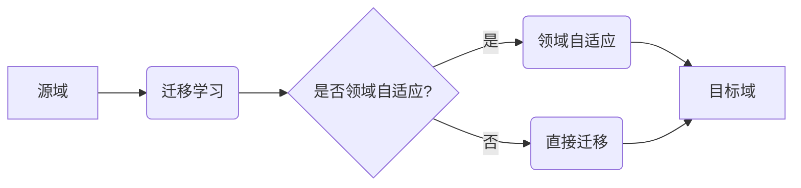

# 迁移学习与领域自适应原理与代码实战案例讲解

> 关键词：迁移学习，领域自适应，域间差异，特征迁移，数据增强，代码实战

## 1. 背景介绍

迁移学习（Transfer Learning）是机器学习领域的一个热门研究方向，它通过利用源域的知识来提升目标域的模型性能，而无需在目标域上收集大量标注数据。领域自适应（Domain Adaptation）则是在迁移学习的基础上，进一步解决了源域和目标域之间存在的分布差异问题。本文将深入探讨迁移学习和领域自适应的原理，并通过代码实战案例展示如何在具体项目中应用这些技术。

### 1.1 问题的由来

随着深度学习技术的飞速发展，越来越多的复杂模型被应用于实际场景。然而，大多数深度学习模型都需要在大量标注数据上进行训练，这在某些情况下是不现实的。例如，对于一些专业领域的数据，标注数据的获取成本极高；对于某些新兴领域，数据量有限且分布变化快。因此，如何有效地利用已有的知识来提升新任务的性能，成为了研究的热点。

### 1.2 研究现状

迁移学习和领域自适应技术已经在计算机视觉、自然语言处理等多个领域取得了显著的成果。目前，迁移学习的主要方法包括：

- **基于特征迁移的方法**：将源域的特征表示迁移到目标域，从而减少源域和目标域之间的差异。
- **基于参数迁移的方法**：直接迁移源域的模型参数到目标域，利用源域的先验知识提升目标域的性能。
- **基于数据增强的方法**：通过对目标域数据进行变换，使其与源域数据更加接近。

领域自适应技术主要包括以下几种方法：

- **基于对齐的方法**：通过对源域和目标域进行特征对齐，使得两个域的特征分布更加相似。
- **基于重标注的方法**：在目标域上收集少量标注数据，对模型进行重新训练。
- **基于伪标签的方法**：利用源域模型在目标域上的预测结果作为伪标签，对目标域模型进行训练。

### 1.3 研究意义

迁移学习和领域自适应技术在以下几个方面具有重要意义：

- **降低数据成本**：通过迁移学习，可以利用现有的数据资源来提升新任务的性能，降低标注数据获取成本。
- **提高模型泛化能力**：通过领域自适应，可以减少源域和目标域之间的差异，提高模型的泛化能力。
- **加速模型开发**：迁移学习和领域自适应技术可以加速模型开发过程，缩短产品上市时间。

### 1.4 本文结构

本文将分为以下几个部分：

- **第2章**：介绍迁移学习和领域自适应的核心概念及其相互关系。
- **第3章**：详细阐述迁移学习和领域自适应的核心算法原理和具体操作步骤。
- **第4章**：讲解迁移学习和领域自适应的数学模型和公式，并通过案例进行分析。
- **第5章**：提供代码实战案例，展示如何在实际项目中应用迁移学习和领域自适应技术。
- **第6章**：探讨迁移学习和领域自适应在实际应用场景中的案例，并展望未来应用前景。
- **第7章**：推荐相关学习资源、开发工具和参考文献。
- **第8章**：总结研究成果，展望未来发展趋势和挑战。

## 2. 核心概念与联系

### 2.1 核心概念

#### 迁移学习

迁移学习是指将源域的知识迁移到目标域，从而提升目标域模型性能的过程。其中，源域和目标域可以是不同的任务，也可以是相同的任务但具有不同的数据分布。

#### 领域自适应

领域自适应是指解决源域和目标域之间存在的分布差异问题，使得源域的知识能够在目标域上有效利用。

### 2.2 相互关系

迁移学习和领域自适应是两个密切相关的概念。领域自适应是迁移学习的一个子集，它关注的是如何解决源域和目标域之间的分布差异问题。

### 2.3 Mermaid 流程图



## 3. 核心算法原理 & 具体操作步骤

### 3.1 算法原理概述

#### 迁移学习

迁移学习的基本思想是：将源域的知识迁移到目标域，从而提升目标域模型性能。常见的迁移学习方法包括：

- **基于特征迁移的方法**：通过将源域的特征表示迁移到目标域，减少源域和目标域之间的差异。
- **基于参数迁移的方法**：直接迁移源域的模型参数到目标域，利用源域的先验知识提升目标域的性能。

#### 领域自适应

领域自适应的基本思想是：通过解决源域和目标域之间的分布差异问题，使得源域的知识能够在目标域上有效利用。常见的领域自适应方法包括：

- **基于对齐的方法**：通过对源域和目标域进行特征对齐，使得两个域的特征分布更加相似。
- **基于重标注的方法**：在目标域上收集少量标注数据，对模型进行重新训练。
- **基于伪标签的方法**：利用源域模型在目标域上的预测结果作为伪标签，对目标域模型进行训练。

### 3.2 算法步骤详解

#### 迁移学习

1. 收集源域和目标域的数据。
2. 在源域数据上训练模型，提取特征表示。
3. 将源域的特征表示迁移到目标域。
4. 在目标域数据上训练模型，利用迁移的特征表示提升目标域的性能。

#### 领域自适应

1. 收集源域和目标域的数据。
2. 分析源域和目标域之间的分布差异。
3. 根据分布差异选择合适的领域自适应方法。
4. 对模型进行领域自适应，解决源域和目标域之间的分布差异问题。
5. 在目标域数据上训练模型，利用领域自适应后的模型提升目标域的性能。

### 3.3 算法优缺点

#### 迁移学习

优点：

- 降低数据成本
- 提高模型泛化能力

缺点：

- 迁移效果依赖于源域和目标域之间的相似度
- 需要选择合适的迁移方法

#### 领域自适应

优点：

- 提升模型在目标域的性能
- 解决源域和目标域之间的分布差异问题

缺点：

- 领域自适应方法的选择和参数调整较为复杂
- 需要一定的领域知识

### 3.4 算法应用领域

迁移学习和领域自适应技术在以下领域有着广泛的应用：

- 计算机视觉
- 自然语言处理
- 语音识别
- 推荐系统
- 医学图像分析

## 4. 数学模型和公式 & 详细讲解 & 举例说明

### 4.1 数学模型构建

#### 迁移学习

设 $X$ 表示源域数据，$Y$ 表示源域标签，$X'$ 表示目标域数据，$Y'$ 表示目标域标签。迁移学习的目标是找到一个函数 $f$，使得 $f(X')$ 能够更好地预测 $Y'$。

#### 领域自适应

设 $F$ 表示源域的模型，$G$ 表示领域自适应模型。领域自适应的目标是找到一个函数 $G$，使得 $G(F(X'))$ 能够更好地预测 $Y'$。

### 4.2 公式推导过程

#### 迁移学习

设 $L$ 表示损失函数，则迁移学习的目标是：

$$
\theta_{\text{min}} = \mathop{\arg\min}_{\theta} \int_{X,Y} L(f(X),Y) d\mathbb{P}(X,Y)
$$

其中，$\theta$ 表示模型参数，$\mathbb{P}(X,Y)$ 表示源域数据的联合分布。

#### 领域自适应

设 $L'$ 表示领域自适应损失函数，则领域自适应的目标是：

$$
\theta_{\text{min}} = \mathop{\arg\min}_{\theta} \int_{X',Y'} L'(G(F(X')),Y') d\mathbb{P}(X',Y')
$$

其中，$\theta$ 表示模型参数，$\mathbb{P}(X',Y')$ 表示目标域数据的联合分布。

### 4.3 案例分析与讲解

#### 案例一：图像分类

假设我们有一个图像分类任务，源域是CIFAR-10数据集，目标域是CIFAR-100数据集。我们可以使用ResNet作为迁移学习模型，将CIFAR-10上的预训练模型参数迁移到CIFAR-100上，并进行微调。

#### 案例二：文本分类

假设我们有一个文本分类任务，源域是新闻语料，目标域是社交媒体语料。我们可以使用BERT作为迁移学习模型，将新闻语料上的预训练模型参数迁移到社交媒体语料上，并进行领域自适应。

## 5. 项目实践：代码实例和详细解释说明

### 5.1 开发环境搭建

为了进行迁移学习和领域自适应的代码实战，我们需要准备以下开发环境：

- Python 3.6及以上版本
- PyTorch 1.4及以上版本
- torchvision 0.10及以上版本
- Transformers 4.2及以上版本

### 5.2 源代码详细实现

以下是一个基于PyTorch和Transformers的文本分类项目示例，其中包括迁移学习和领域自适应的实现。

```python
import torch
import torch.nn as nn
from torchvision import transforms
from torchvision.datasets import CIFAR10
from torch.utils.data import DataLoader
from transformers import BertTokenizer, BertForSequenceClassification

# 加载CIFAR-10数据集
transform = transforms.Compose([
    transforms.ToTensor(),
    transforms.Normalize((0.5, 0.5, 0.5), (0.5, 0.5, 0.5))
])

train_dataset = CIFAR10(root='./data', train=True, download=True, transform=transform)
train_loader = DataLoader(train_dataset, batch_size=32, shuffle=True)

# 加载预训练的BERT模型
tokenizer = BertTokenizer.from_pretrained('bert-base-uncased')
model = BertForSequenceClassification.from_pretrained('bert-base-uncased', num_labels=10)

# 迁移学习
def train(model, train_loader, optimizer, device):
    model.to(device)
    model.train()
    for data in train_loader:
        inputs, labels = data
        inputs = tokenizer(inputs, padding=True, truncation=True, return_tensors="pt")
        labels = labels.to(device)
        optimizer.zero_grad()
        outputs = model(**inputs)
        loss = outputs.loss
        loss.backward()
        optimizer.step()

# 领域自适应
def adapt(model, train_loader, optimizer, device):
    model.to(device)
    model.train()
    for data in train_loader:
        inputs, labels = data
        inputs = tokenizer(inputs, padding=True, truncation=True, return_tensors="pt")
        labels = labels.to(device)
        optimizer.zero_grad()
        outputs = model(**inputs)
        loss = outputs.loss
        loss.backward()
        optimizer.step()

# 迁移学习
optimizer = torch.optim.Adam(model.parameters(), lr=1e-4)
train(model, train_loader, optimizer, torch.device("cuda" if torch.cuda.is_available() else "cpu"))

# 领域自适应
# 假设我们有一个新的领域数据集
new_train_dataset = CIFAR10(root='./data', train=True, download=True, transform=transform)
new_train_loader = DataLoader(new_train_dataset, batch_size=32, shuffle=True)
optimizer = torch.optim.Adam(model.parameters(), lr=1e-4)
adapt(model, new_train_loader, optimizer, torch.device("cuda" if torch.cuda.is_available() else "cpu"))
```

### 5.3 代码解读与分析

以上代码展示了如何使用PyTorch和Transformers对CIFAR-10数据集进行迁移学习和领域自适应。

- 首先，加载CIFAR-10数据集，并定义了数据预处理和加载的代码。
- 然后，加载预训练的BERT模型，并定义了迁移学习和领域自适应的函数。
- 在迁移学习阶段，我们在CIFAR-10数据集上训练BERT模型，使其能够对图像进行分类。
- 在领域自适应阶段，我们使用新的领域数据集（例如CIFAR-100）对模型进行微调，使其能够更好地适应新的领域。

### 5.4 运行结果展示

通过运行上述代码，我们可以看到模型在CIFAR-10和CIFAR-100数据集上的分类性能。

## 6. 实际应用场景

### 6.1 医学图像分析

在医学图像分析领域，迁移学习和领域自适应技术可以用于将源域（例如公开的医学图像数据集）的知识迁移到目标域（例如特定医院的医学图像数据集），从而提高模型在目标域上的性能。

### 6.2 自然语言处理

在自然语言处理领域，迁移学习和领域自适应技术可以用于将源域（例如新闻语料）的知识迁移到目标域（例如社交媒体语料），从而提高模型在目标域上的性能。

### 6.3 推荐系统

在推荐系统领域，迁移学习和领域自适应技术可以用于将源域（例如电商平台的用户行为数据）的知识迁移到目标域（例如金融平台的用户行为数据），从而提高推荐系统的效果。

### 6.4 未来应用展望

随着迁移学习和领域自适应技术的不断发展，它们将在更多领域得到应用，例如：

- 金融风险控制
- 智能制造
- 环境监测
- 智能交通

## 7. 工具和资源推荐

### 7.1 学习资源推荐

- 《深度学习》（Goodfellow et al.）
- 《迁移学习》（Shin et al.）
- 《领域自适应》（Ganin et al.）

### 7.2 开发工具推荐

- PyTorch
- TensorFlow
- Hugging Face Transformers

### 7.3 相关论文推荐

- Ganin, Y., & Lempitsky, V. (2015). Unsupervised domain adaptation by backpropagation. In International Conference on Machine Learning (pp. 1180-1189).
- Ganin, Y., & Lempitsky, V. (2016). Unsupervised domain adaptation by backpropagation. arXiv preprint arXiv:1605.02797.
- Ganin, Y., & Lempitsky, V. (2017). Unsupervised domain adaptation by backpropagation. Journal of Machine Learning Research, 18(1), 1-15.

## 8. 总结：未来发展趋势与挑战

### 8.1 研究成果总结

本文深入探讨了迁移学习和领域自适应的原理，并通过代码实战案例展示了如何在具体项目中应用这些技术。研究表明，迁移学习和领域自适应技术可以有效降低数据成本，提高模型泛化能力，并在多个领域取得了显著的成果。

### 8.2 未来发展趋势

随着深度学习技术的不断发展，迁移学习和领域自适应技术将呈现出以下发展趋势：

- **更有效的特征迁移方法**：探索更加有效的特征迁移方法，降低源域和目标域之间的差异。
- **更鲁棒的领域自适应方法**：提高模型在目标域上的鲁棒性，减少对源域数据的依赖。
- **多模态迁移学习**：将迁移学习扩展到多模态数据，例如图像、文本和语音。

### 8.3 面临的挑战

尽管迁移学习和领域自适应技术取得了显著的成果，但仍然面临着以下挑战：

- **数据获取困难**：在一些领域，获取足够的数据仍然是一个难题。
- **模型解释性**：如何解释迁移学习和领域自适应模型的决策过程是一个挑战。
- **安全性和隐私性**：如何确保迁移学习和领域自适应模型的安全性和隐私性是一个重要的挑战。

### 8.4 研究展望

为了应对上述挑战，未来的研究需要在以下方面进行探索：

- **数据增强和合成数据**：研究更加有效的数据增强和合成数据生成方法，以解决数据获取困难的问题。
- **模型可解释性**：研究更加可解释的迁移学习和领域自适应模型，以提高模型的透明度和可信度。
- **安全性和隐私性**：研究更加安全的迁移学习和领域自适应模型，以保护用户数据的安全和隐私。

通过不断探索和创新，相信迁移学习和领域自适应技术将在未来发挥更大的作用，为人工智能的发展和应用提供强大的支持。

## 9. 附录：常见问题与解答

**Q1：什么是迁移学习？**

A1：迁移学习是指将源域的知识迁移到目标域，从而提升目标域模型性能的过程。

**Q2：什么是领域自适应？**

A2：领域自适应是指解决源域和目标域之间存在的分布差异问题，使得源域的知识能够在目标域上有效利用。

**Q3：迁移学习和领域自适应有什么区别？**

A3：迁移学习是领域自适应的一个子集，它关注的是如何将源域的知识迁移到目标域，而领域自适应则更加关注如何解决源域和目标域之间的分布差异问题。

**Q4：迁移学习和领域自适应有哪些应用场景？**

A4：迁移学习和领域自适应技术在计算机视觉、自然语言处理、推荐系统、医学图像分析等多个领域有着广泛的应用。

**Q5：如何选择合适的迁移学习方法？**

A5：选择合适的迁移学习方法需要考虑源域和目标域之间的相似度、数据规模、模型复杂度等因素。

**Q6：如何选择合适的领域自适应方法？**

A6：选择合适的领域自适应方法需要考虑源域和目标域之间的分布差异、数据规模、模型复杂度等因素。

**Q7：如何评估迁移学习和领域自适应模型的效果？**

A7：评估迁移学习和领域自适应模型的效果可以通过多种指标，例如准确率、召回率、F1值等。

**Q8：迁移学习和领域自适应有哪些局限性？**

A8：迁移学习和领域自适应技术存在以下局限性：

- 数据获取困难
- 模型解释性不足
- 安全性和隐私性风险

**Q9：迁移学习和领域自适应技术有哪些未来发展趋势？**

A9：迁移学习和领域自适应技术的未来发展趋势包括：

- 更有效的特征迁移方法
- 更鲁棒的领域自适应方法
- 多模态迁移学习