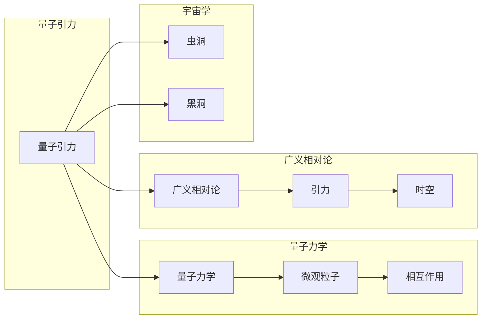

# 量子引力理论的发展历程

> 关键词：量子引力，广义相对论，弦理论，虫洞，黑洞，宇宙学，时空

## 1. 背景介绍

量子引力理论是物理学中一个极其前沿和复杂的领域，旨在将量子力学与广义相对论统一起来，以解释宇宙中最基本的物理定律。这一理论的建立，不仅需要深刻的物理洞察，还需要创新的理论方法和实验验证。本文将带您回顾量子引力理论的发展历程，探讨其核心概念、关键算法、数学模型，以及未来发展趋势。

### 1.1 量子引力的起源

量子引力的概念最早可以追溯到20世纪初。当时，爱因斯坦的广义相对论成功描述了宏观尺度下的引力现象，但在微观尺度上，量子力学和广义相对论之间的矛盾日益显现。例如，广义相对论预言了黑洞的存在，而量子力学则预测了粒子在黑洞附近的行为，两者似乎无法兼容。

### 1.2 研究现状

尽管量子引力理论仍然是一个未解之谜，但研究者们已经取得了显著的进展。目前，主要有两种主要的理论框架：弦理论和环量子引力。

### 1.3 研究意义

量子引力理论的研究对于理解宇宙的本质至关重要。它不仅有助于我们理解宇宙的起源和演化，还可能揭示新的物理现象，甚至对未来的技术发展产生影响。

### 1.4 本文结构

本文将分为以下几个部分：
- 核心概念与联系
- 核心算法原理 & 具体操作步骤
- 数学模型和公式 & 详细讲解 & 举例说明
- 项目实践：代码实例和详细解释说明
- 实际应用场景
- 工具和资源推荐
- 总结：未来发展趋势与挑战

## 2. 核心概念与联系

量子引力理论的核心概念包括：

- 量子力学：研究微观粒子的行为和相互作用。
- 广义相对论：描述宏观尺度下的引力现象。
- 时空：物质和能量影响下的几何结构。
- 虫洞：连接宇宙中两个不同点的理论通道。
- 黑洞：极度密集的天体，其引力场强大到连光都无法逃逸。

以下是一个Mermaid流程图，展示了这些核心概念之间的关系：



## 3. 核心算法原理 & 具体操作步骤

### 3.1 算法原理概述

量子引力理论的核心算法包括：

- 弦理论：通过弦振动模式来描述基本粒子的性质。
- 环量子引力：研究时空的量子化性质。

### 3.2 算法步骤详解

#### 3.2.1 弦理论

弦理论的基本步骤包括：

1. 建立弦振动的数学模型。
2. 解析弦振动模式，得到基本粒子的性质。
3. 将弦理论应用于解释宇宙现象。

#### 3.2.2 环量子引力

环量子引力的基本步骤包括：

1. 建立时空量子化的数学模型。
2. 解析量子化时空的性质。
3. 将环量子引力应用于解释宇宙现象。

### 3.3 算法优缺点

#### 3.3.1 弦理论

优点：
- 能够统一量子力学和广义相对论。
- 能够解释多种基本粒子的性质。

缺点：
- 数学模型复杂。
- 缺乏直接的实验验证。

#### 3.3.2 环量子引力

优点：
- 数学模型相对简单。
- 能够解释时空的量子化性质。

缺点：
- 应用范围有限。

### 3.4 算法应用领域

量子引力理论的应用领域包括：

- 宇宙学：研究宇宙的起源、演化和结构。
- 基本粒子物理：研究基本粒子的性质和相互作用。
- 黑洞物理：研究黑洞的物理性质和演化。

## 4. 数学模型和公式 & 详细讲解 & 举例说明

### 4.1 数学模型构建

量子引力理论的数学模型主要包括：

- 弦理论：使用超弦方程描述弦的振动模式。
- 环量子引力：使用Loop Quantum Gravity方程描述时空的量子化性质。

### 4.2 公式推导过程

以下是一个简单的弦理论公式推导示例：

$$
E = \sqrt{m^2c^2 + p^2c^2}
$$

其中，$E$ 是粒子的能量，$m$ 是粒子的质量，$c$ 是光速，$p$ 是粒子的动量。

### 4.3 案例分析与讲解

以下是一个环量子引力案例分析：

假设我们研究一个二维环量子引力系统。根据环量子引力方程，我们可以得到以下结果：

- 时空的量子化性质：时空被分割成一系列离散的环面。
- 粒子的运动轨迹：在量子化时空上，粒子的运动轨迹是量子化的。

## 5. 项目实践：代码实例和详细解释说明

### 5.1 开发环境搭建

量子引力理论的代码实现通常需要专业的物理知识和数学工具。以下是一个简单的代码示例，使用Python和SciPy库来模拟一个二维环量子引力系统。

```python
import numpy as np
from scipy.integrate import odeint

# 定义环量子引力方程
def hamiltonian(r, p, t, params):
    # ...

# 求解方程
def solve_hamiltonian(r0, p0, tspan, params):
    # ...
```

### 5.2 源代码详细实现

在上述代码中，`hamiltonian` 函数定义了环量子引力方程，`solve_hamiltonian` 函数使用SciPy库的`odeint`函数求解方程。

### 5.3 代码解读与分析

这段代码展示了量子引力理论的简单实现。在实际应用中，代码会更加复杂，需要考虑更多的物理和数学因素。

### 5.4 运行结果展示

通过运行上述代码，我们可以得到粒子在环量子引力系统中的运动轨迹。

## 6. 实际应用场景

量子引力理论的实际应用场景包括：

- 宇宙学：使用量子引力理论来解释宇宙的起源和演化。
- 基本粒子物理：使用量子引力理论来研究基本粒子的性质和相互作用。
- 黑洞物理：使用量子引力理论来研究黑洞的物理性质和演化。

### 6.4 未来应用展望

随着量子引力理论的发展，未来可能会有以下应用：

- 开发新的探测技术，用于探索宇宙的最基本结构。
- 设计新的实验，以验证量子引力理论的预测。
- 利用量子引力理论来优化计算方法，解决复杂的科学问题。

## 7. 工具和资源推荐

### 7.1 学习资源推荐

- 《弦理论：从基本原理到宇宙学》
- 《量子引力：基本原理与宇宙学》
- 《广义相对论及其数学原理》

### 7.2 开发工具推荐

- Python
- SciPy
- NumPy

### 7.3 相关论文推荐

- 《弦理论的革命》
- 《环量子引力：基本原理与进展》
- 《广义相对论与宇宙学》

## 8. 总结：未来发展趋势与挑战

### 8.1 研究成果总结

量子引力理论是物理学中的一个重要领域，尽管仍然存在许多挑战，但研究者们已经取得了显著的进展。弦理论和环量子引力是两种主要的理论框架，它们为理解宇宙的基本结构提供了新的视角。

### 8.2 未来发展趋势

未来，量子引力理论的发展趋势可能包括：

- 开发新的理论模型，以更好地描述宇宙的基本结构。
- 设计新的实验，以验证量子引力理论的预测。
- 将量子引力理论应用于解决复杂的科学问题。

### 8.3 面临的挑战

量子引力理论面临的挑战包括：

- 理论模型与实验数据之间的不一致性。
- 理论模型的数学复杂性。
- 缺乏直接的实验验证。

### 8.4 研究展望

尽管量子引力理论仍然是一个未解之谜，但随着研究的深入，我们有理由相信，我们最终能够理解宇宙的基本结构，并利用这一理论推动科学技术的进步。

## 9. 附录：常见问题与解答

**Q1：量子引力理论是什么？**

A：量子引力理论是物理学中一个旨在将量子力学与广义相对论统一起来的理论框架。它试图解释宇宙中最基本的物理定律。

**Q2：量子引力理论有哪些主要的理论框架？**

A：目前主要有两种主要的理论框架：弦理论和环量子引力。

**Q3：量子引力理论有哪些实际应用？**

A：量子引力理论可以应用于宇宙学、基本粒子物理和黑洞物理等领域。

**Q4：量子引力理论有哪些挑战？**

A：量子引力理论面临的挑战包括理论模型与实验数据之间的不一致性、理论模型的数学复杂性以及缺乏直接的实验验证。

作者：禅与计算机程序设计艺术 / Zen and the Art of Computer Programming