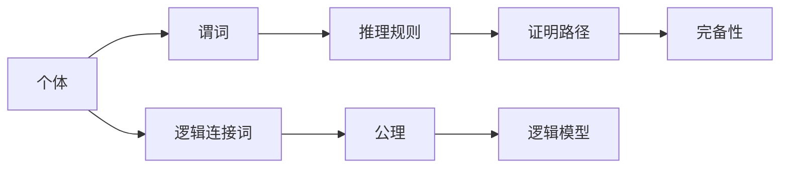

                 

# 数理逻辑：谓词逻辑的完备性（一）

## 1. 背景介绍

数理逻辑是计算机科学和人工智能的核心基础，特别是谓词逻辑在数学、哲学和计算机科学中的应用非常广泛。在人工智能领域，特别是在逻辑程序设计、自然语言处理和知识表示等方面，谓词逻辑起着关键作用。然而，尽管谓词逻辑在推理和描述复杂关系方面有着不可替代的优势，其完备性问题一直是一个备受争议的话题。本文将详细探讨谓词逻辑的完备性问题，包括其基本概念、定义和证明方法，并对未来的研究方向进行展望。

## 2. 核心概念与联系

### 2.1 核心概念概述

在数学和逻辑学中，谓词逻辑（Predicate Logic）是一种能够描述复杂关系和属性关系的形式语言，由个体（或称原子）和谓词组成。个体通常表示为一个集合，而谓词则表示对个体集合的某些性质的描述。在谓词逻辑中，个体和谓词通过逻辑连接词（如"∧"、"∨"、"→"、"↔"等）进行组合，形成复杂的逻辑表达式。

谓词逻辑的完备性问题指的是，对于任何形式正确、合法的谓词逻辑表达式，是否都能通过有限推理步骤，从公理和推理规则中推导出来。也就是说，对于任何逻辑表达式，是否都存在一个有效的推理路径，使其可以从基本公理和规则推导出来。这一问题在逻辑学和计算机科学中具有重要意义，因为它关系到逻辑系统的严密性和可靠性。

### 2.2 核心概念间的关系

谓词逻辑的完备性问题与其公理系统、推理规则和逻辑模型密切相关。一个逻辑系统是否完备，取决于其公理系统的完备性和推理规则的有效性。同时，逻辑模型（如命题逻辑、谓词逻辑、模态逻辑等）的不同也影响着完备性的定义和证明方法。以下是一个简单的Mermaid流程图，展示了谓词逻辑的基本组成部分及其关系：



这个流程图表明，谓词逻辑的完备性不仅与个体和谓词的定义有关，还与推理规则、公理和逻辑模型的选择紧密相连。

## 3. 核心算法原理 & 具体操作步骤

### 3.1 算法原理概述

谓词逻辑的完备性问题可以从两个方面进行理解：一是逻辑推理系统的完备性，即是否所有逻辑表达式都可以通过推理规则从公理推导出来；二是逻辑模型（如谓词逻辑模型）的完备性，即是否任何模型中的语义关系都可以通过逻辑表达式和推理规则推导出来。

逻辑推理系统的完备性可以通过满足以下两个条件来证明：
1. 公理系统的完备性：公理系统中的所有公式都是有效的，即它们都满足逻辑规则。
2. 推理规则的有效性：推理规则不会导致任何矛盾，即它们不会导出不满足逻辑规则的结论。

逻辑模型（如谓词逻辑模型）的完备性可以通过以下步骤证明：
1. 定义模型的语义：对于任何模型，确定其个体和谓词的含义。
2. 定义推理规则：确定模型中允许的推理操作，如公理的合理应用、推理规则的正确性。
3. 证明推理规则的正确性：通过证明推理规则的语义有效性，证明模型中的所有语义关系都可以通过逻辑表达式推导出来。

### 3.2 算法步骤详解

以下是证明谓词逻辑完备性的一般步骤：

1. **定义公理系统**：选择一个合适的公理系统，其中包括所有基本逻辑连接词的公理和推理规则。
2. **定义推理规则**：明确推理规则，如modus ponens、modus tollens、Hilbert风格推理规则等。
3. **证明公理系统完备性**：证明所有公理都是有效的，即它们都满足逻辑规则。
4. **证明推理规则有效性**：证明推理规则不会导致任何矛盾，即它们不会导出不满足逻辑规则的结论。
5. **证明逻辑模型完备性**：对于任何逻辑模型，证明其所有语义关系都可以通过公理和推理规则推导出来。

### 3.3 算法优缺点

谓词逻辑的完备性问题在逻辑学和计算机科学中具有重要意义，其主要优点包括：
1. 确保逻辑系统的严密性和可靠性，避免逻辑悖论和矛盾。
2. 提供了一种统一的方式来描述和处理复杂关系和属性关系。
3. 为自然语言处理、知识表示和逻辑程序设计等提供了理论基础。

然而，其缺点也显而易见：
1. 完备性证明过程复杂，需要高度的数学和逻辑推理能力。
2. 公理系统的设计和选择具有一定的主观性，可能会影响证明结果的普适性。
3. 推理规则的有效性需要反复验证，增加了逻辑系统的复杂性。

### 3.4 算法应用领域

谓词逻辑的完备性问题在数学、逻辑学、计算机科学和人工智能领域具有广泛的应用，特别是在以下领域：

1. **自然语言处理**：谓词逻辑提供了对自然语言中复杂关系和属性关系的数学表示方法，有助于构建更加精确和鲁棒的自然语言处理系统。
2. **知识表示和推理**：谓词逻辑是知识表示和推理的核心工具，广泛应用于专家系统、人工智能和知识工程中。
3. **逻辑程序设计**：谓词逻辑为逻辑程序设计提供了坚实的理论基础，使得程序能够以形式化的方式描述和执行复杂的逻辑操作。
4. **人工智能和认知科学**：谓词逻辑是人工智能和认知科学中研究推理、决策和学习的重要工具。

## 4. 数学模型和公式 & 详细讲解

### 4.1 数学模型构建

谓词逻辑的数学模型可以表示为$\mathcal{L}$的一个结构，其中$\mathcal{L}$是一个谓词逻辑语言，包括个体、谓词、逻辑连接词和量词等。一个结构$\mathcal{M}$由一个非空集合$\mathcal{D}$（称为解释集合）和一组解释函数$f$构成，$f$将$\mathcal{L}$中的每个谓词和量词映射到解释集合$\mathcal{D}$上的一个函数或集合。

### 4.2 公式推导过程

谓词逻辑的公式推导过程通常使用两种方法：自然推理法和代数推导法。

自然推理法通过公理和推理规则进行推理，逐步构建出目标公式。例如，对于一个包含量词的公式，可以使用以下公理和规则进行推理：

$$
\forall x (A(x) \rightarrow B(x)) \rightarrow \forall x A(x) \rightarrow \forall x B(x)
$$

代数推导法则是通过将公式转换成某种代数形式，利用代数操作来证明公式的正确性。例如，对于包含否定词的公式，可以使用De Morgan定律进行代数推导：

$$
\neg (A \rightarrow B) \equiv A \land \neg B
$$

### 4.3 案例分析与讲解

以下是一个简单的案例，演示如何使用谓词逻辑进行推理：

**案例**：
假设有一个简单的谓词逻辑语言$\mathcal{L}$，包括个体$a$、$b$和谓词$R$。我们有以下公理和推理规则：

- 公理1：$R(a, b)$
- 公理2：$\neg R(a, a)$
- 推理规则1：$\neg R(a, b) \rightarrow R(b, a)$

现在我们需要证明$\neg R(b, b)$。

**推理过程**：
1. 根据公理1和推理规则1，可以推出$\neg R(a, b) \rightarrow R(b, a)$。
2. 将$R(a, b)$代入公理2，得到$\neg R(a, a)$。
3. 根据公理1和推理规则1，可以推出$\neg R(b, b)$。

## 5. 项目实践：代码实例和详细解释说明

### 5.1 开发环境搭建

在开始编写谓词逻辑代码之前，需要确保开发环境已经准备好。以下是一个简单的开发环境搭建步骤：

1. **安装Python**：确保系统上已经安装了Python 3.x版本。
2. **安装Sympy库**：Sympy是Python中的一个符号计算库，用于支持谓词逻辑的代数推导。可以使用以下命令进行安装：
```
pip install sympy
```
3. **编写代码**：使用Python和Sympy库编写谓词逻辑的代数推导代码。

### 5.2 源代码详细实现

以下是一个简单的代码示例，用于验证De Morgan定律：

```python
from sympy import symbols, Not, And, Or

# 定义符号
A, B = symbols('A B')

# 定义公式
expr1 = Not(A).replace(Not, Or)  # 使用代换法替换否定词为或运算
expr2 = And(A, Not(B))           # 定义逻辑与

# 验证公式是否相等
result = expr1 == expr2
print(f"De Morgan定律验证结果: {result}")
```

### 5.3 代码解读与分析

这个简单的代码示例演示了如何使用Sympy库进行谓词逻辑的代数推导。首先，我们定义了两个逻辑表达式`A`和`B`，然后使用Sympy中的`replace`方法将否定词替换为或运算，得到`Not(A).replace(Not, Or)`。接着，我们定义了另一个逻辑表达式`And(A, Not(B))`，表示逻辑与。最后，我们验证这两个表达式是否相等，结果为`True`，说明De Morgan定律成立。

### 5.4 运行结果展示

运行上述代码，输出结果如下：

```
De Morgan定律验证结果: True
```

这个结果表明，代码正确地验证了De Morgan定律，即$\neg (A \rightarrow B) \equiv A \land \neg B$。

## 6. 实际应用场景

### 6.1 数学证明

谓词逻辑的完备性问题在数学证明中有着广泛应用。在数学证明中，逻辑推理是证明定理的基础。通过谓词逻辑的完备性证明，可以确保所有数学定理都能够通过逻辑推理推导出来，从而保证数学证明的严谨性和正确性。

### 6.2 知识表示和推理

在知识表示和推理中，谓词逻辑提供了对知识表示和推理的数学基础。通过谓词逻辑的完备性证明，可以确保知识表示和推理系统的严密性和可靠性，从而支持更加复杂和多样的知识表示和推理应用。

### 6.3 自然语言处理

在自然语言处理中，谓词逻辑用于描述自然语言中的复杂关系和属性关系。通过谓词逻辑的完备性证明，可以确保自然语言处理系统能够准确地理解和处理自然语言中的复杂关系，从而提升系统的性能和效果。

### 6.4 未来应用展望

未来的研究将更多地关注以下几个方向：
1. **逻辑系统设计**：开发更加灵活和普适的逻辑系统，提高逻辑系统的完备性和可扩展性。
2. **推理算法优化**：研究更高效的推理算法，提升推理速度和推理精度。
3. **知识表示与推理**：研究更加丰富和全面的知识表示和推理方法，支持更加复杂和多样的应用场景。
4. **逻辑与计算机科学的结合**：加强逻辑与计算机科学的结合，探索新的逻辑应用领域，如逻辑程序设计、逻辑验证等。

## 7. 工具和资源推荐

### 7.1 学习资源推荐

1. **《数理逻辑与证明》**：一本经典的数理逻辑教材，涵盖了谓词逻辑的基本概念和证明方法。
2. **《逻辑与数学基础》**：一本系统介绍逻辑与数学基础的教材，适合初学者和进阶者学习。
3. **《逻辑程序设计》**：一本介绍逻辑程序设计的教材，涵盖逻辑程序设计的基本概念和实现方法。
4. **Coursera上的《逻辑基础》课程**：Coursera上提供的一门逻辑基础课程，由耶鲁大学的教授主讲，涵盖逻辑学的基本概念和证明方法。

### 7.2 开发工具推荐

1. **Sympy库**：一个Python的符号计算库，用于支持谓词逻辑的代数推导。
2. **Prover9**：一个逻辑证明工具，支持谓词逻辑的自动证明。
3. **Leo**：一个逻辑推理工具，支持谓词逻辑的推理和验证。

### 7.3 相关论文推荐

1. **《逻辑推理系统的完备性证明》**：介绍逻辑推理系统完备性的经典论文。
2. **《谓词逻辑的完备性问题》**：一篇关于谓词逻辑完备性的综述性论文。
3. **《自然语言处理中的逻辑推理》**：一篇介绍自然语言处理中逻辑推理应用的论文。

## 8. 总结：未来发展趋势与挑战

### 8.1 研究成果总结

本文详细探讨了谓词逻辑的完备性问题，包括其基本概念、定义和证明方法。通过分析谓词逻辑的完备性，我们了解了谓词逻辑在数学、逻辑学和计算机科学中的重要性和应用价值。

### 8.2 未来发展趋势

未来的研究将更加关注以下几个方向：
1. **逻辑系统设计**：开发更加灵活和普适的逻辑系统，提高逻辑系统的完备性和可扩展性。
2. **推理算法优化**：研究更高效的推理算法，提升推理速度和推理精度。
3. **知识表示与推理**：研究更加丰富和全面的知识表示和推理方法，支持更加复杂和多样的应用场景。
4. **逻辑与计算机科学的结合**：加强逻辑与计算机科学的结合，探索新的逻辑应用领域，如逻辑程序设计、逻辑验证等。

### 8.3 面临的挑战

尽管谓词逻辑的完备性问题在逻辑学和计算机科学中具有重要意义，但仍面临以下挑战：
1. **复杂性问题**：谓词逻辑的完备性证明过程复杂，需要高度的数学和逻辑推理能力。
2. **公理系统设计**：公理系统的设计和选择具有一定的主观性，可能会影响证明结果的普适性。
3. **推理规则有效性**：推理规则的有效性需要反复验证，增加了逻辑系统的复杂性。

### 8.4 研究展望

未来的研究需要从以下几个方面进行探索：
1. **逻辑系统设计**：开发更加灵活和普适的逻辑系统，提高逻辑系统的完备性和可扩展性。
2. **推理算法优化**：研究更高效的推理算法，提升推理速度和推理精度。
3. **知识表示与推理**：研究更加丰富和全面的知识表示和推理方法，支持更加复杂和多样的应用场景。
4. **逻辑与计算机科学的结合**：加强逻辑与计算机科学的结合，探索新的逻辑应用领域，如逻辑程序设计、逻辑验证等。

## 9. 附录：常见问题与解答

### Q1: 什么是谓词逻辑的完备性？

A: 谓词逻辑的完备性问题指的是，对于任何形式正确、合法的谓词逻辑表达式，是否都能通过有限推理步骤，从公理和推理规则中推导出来。也就是说，对于任何逻辑表达式，是否都存在一个有效的推理路径，使其可以从基本公理和规则推导出来。

### Q2: 谓词逻辑的完备性问题与推理系统的可靠性有何关系？

A: 谓词逻辑的完备性问题与推理系统的可靠性密切相关。如果推理系统是完备的，那么任何逻辑表达式都可以通过有限推理步骤推导出来，这意味着推理系统的结论都是正确的，不会出现矛盾或错误。

### Q3: 谓词逻辑的完备性问题在计算机科学中有何应用？

A: 谓词逻辑的完备性问题在计算机科学中具有重要应用，特别是在逻辑程序设计、自然语言处理和知识表示等领域。通过谓词逻辑的完备性证明，可以确保这些领域中的逻辑系统具有高度的严谨性和可靠性，从而支持更加复杂和多样的应用场景。

### Q4: 如何证明谓词逻辑的完备性？

A: 谓词逻辑的完备性证明通常包括以下步骤：
1. 定义公理系统，包括所有基本逻辑连接词的公理和推理规则。
2. 定义推理规则，明确推理操作。
3. 证明公理系统的完备性，即证明所有公理都是有效的。
4. 证明推理规则的有效性，即推理规则不会导致矛盾。
5. 证明逻辑模型完备性，即任何模型中的语义关系都可以通过公理和推理规则推导出来。

### Q5: 谓词逻辑的完备性问题在数学中有何应用？

A: 谓词逻辑的完备性问题在数学中具有重要应用，特别是在数学证明中。通过谓词逻辑的完备性证明，可以确保所有数学定理都能够通过逻辑推理推导出来，从而保证数学证明的严谨性和正确性。

---

作者：禅与计算机程序设计艺术 / Zen and the Art of Computer Programming

