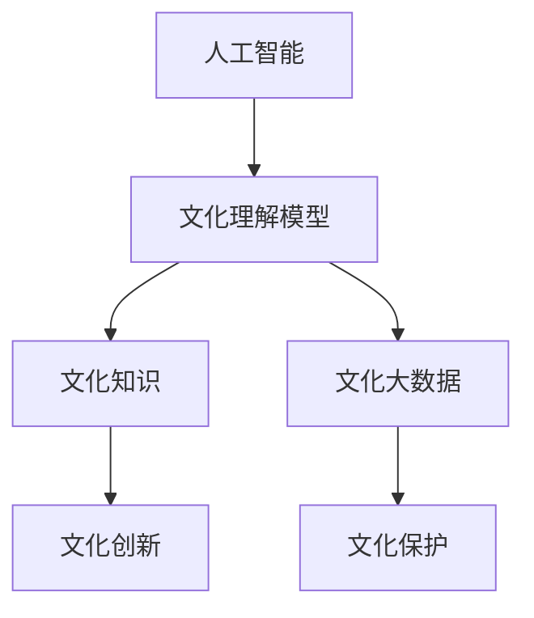
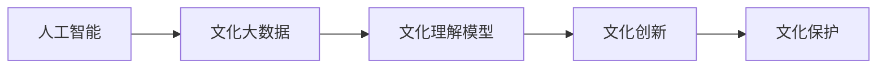
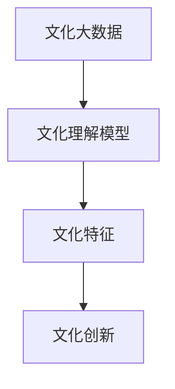
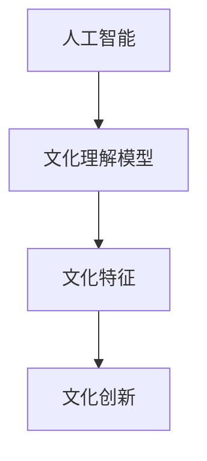
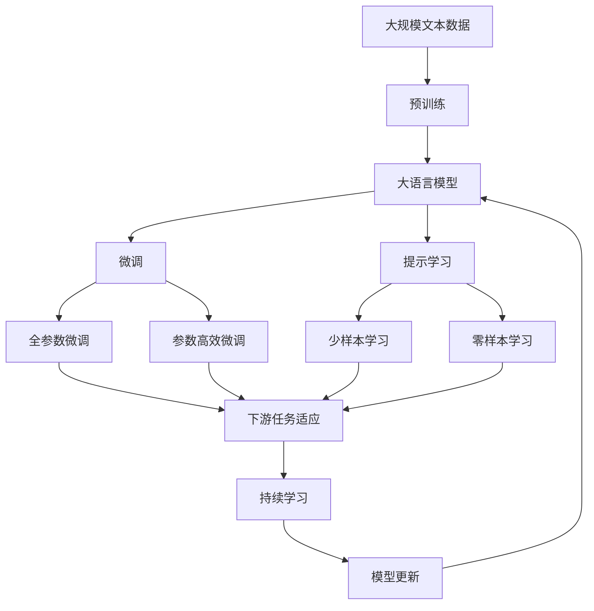

                 

# 文化的力量：提升认知，创造价值

> 关键词：文化，认知，人工智能，价值，创新

## 1. 背景介绍

### 1.1 问题由来
文化是一个复杂的系统，包括了历史、语言、艺术、习俗等诸多方面。在当代社会，随着科技的快速发展，文化也在不断变化和演变，对人类社会的各个方面产生了深远的影响。与此同时，随着人工智能技术的兴起，人们开始思考如何让机器更好地理解和应用文化知识，从而提升人类认知，创造更多社会价值。

### 1.2 问题核心关键点
文化与人工智能的结合，成为了当前科技界和学术界的一个重要课题。这一课题的核心关键点包括：
- 如何让机器更好地理解和应用文化知识？
- 如何通过人工智能提升人类的认知水平，促进文化创新？
- 如何在人工智能技术应用中保持对文化的尊重和保护？

### 1.3 问题研究意义
研究文化与人工智能的结合，对于提升人类认知水平，推动文化创新，保护文化多样性，以及加速人工智能技术的社会应用，具有重要意义：

1. **提升认知水平**：人工智能可以通过大数据分析和模型学习，揭示人类行为背后的文化模式和规律，帮助人们更好地理解自身和他人，提升认知能力。
2. **促进文化创新**：人工智能技术可以辅助艺术家和创意人员，挖掘和整合不同文化的元素，创造更多创新的艺术和设计作品。
3. **保护文化多样性**：通过人工智能技术，可以记录和保存濒临消失的文化元素，促进文化传承和保护。
4. **加速技术应用**：人工智能技术可以应用于教育、医疗、旅游等多个领域，推动文化相关产业的数字化转型，提升社会生产力。

## 2. 核心概念与联系

### 2.1 核心概念概述

为更好地理解文化与人工智能的结合，本节将介绍几个密切相关的核心概念：

- **人工智能**：通过算法和计算能力，使机器具备类人智能的技术。可以用于数据分析、模式识别、决策支持等。
- **文化知识**：指与文化相关的知识，包括历史、语言、艺术、习俗等。
- **文化大数据**：指与文化相关的海量数据，如博物馆藏品、古籍文献、语言数据等。
- **文化理解模型**：指能够理解文化内容，提取文化特征的模型。
- **文化创新**：指在人工智能技术支持下，创造新的文化产品和服务的过程。
- **文化保护**：指通过技术手段，记录、保存和传承文化元素，避免文化流失。

这些核心概念之间的逻辑关系可以通过以下Mermaid流程图来展示：



这个流程图展示了大语言模型微调过程中各个核心概念的关系和作用：

1. 人工智能通过算法和计算能力，理解文化数据，提取文化特征。
2. 文化理解模型是连接人工智能和文化知识的桥梁，通过理解和分析文化数据，提取文化特征。
3. 文化知识是人工智能理解和应用文化的基础，文化大数据是文化理解模型的输入数据。
4. 文化创新和保护是人工智能技术在文化领域的重要应用方向，促进文化创新和保护。

### 2.2 概念间的关系

这些核心概念之间存在着紧密的联系，形成了文化与人工智能结合的完整生态系统。下面我们通过几个Mermaid流程图来展示这些概念之间的关系。

#### 2.2.1 人工智能的应用场景



这个流程图展示了人工智能在文化领域的应用场景：

1. 人工智能通过处理和分析文化大数据，构建文化理解模型。
2. 文化理解模型帮助人工智能理解文化内容，提取出有用的文化特征。
3. 基于文化理解模型的输出，进行文化创新和保护，从而推动文化相关产业的发展。

#### 2.2.2 文化理解模型的训练



这个流程图展示了文化理解模型的训练过程：

1. 文化大数据通过文化理解模型进行训练，提取文化特征。
2. 文化特征可以用于文化创新，生成新的文化产品和服务。
3. 文化创新又可以反过来优化文化理解模型，提升其理解和分析能力。

#### 2.2.3 文化创新的过程



这个流程图展示了文化创新的过程：

1. 人工智能通过文化理解模型理解文化特征。
2. 文化特征可以用于文化创新，生成新的文化产品和服务。
3. 文化创新过程可以生成新的文化数据，进一步训练文化理解模型。

### 2.3 核心概念的整体架构

最后，我们用一个综合的流程图来展示这些核心概念在大语言模型微调过程中的整体架构：



这个综合流程图展示了从预训练到微调，再到持续学习的完整过程。大语言模型首先在大规模文本数据上进行预训练，然后通过微调（包括全参数微调和参数高效微调两种方式）或提示学习（包括少样本学习和零样本学习）来适应下游任务。最后，通过持续学习技术，模型可以不断更新和适应新的任务和数据。

## 3. 核心算法原理 & 具体操作步骤
### 3.1 算法原理概述

文化与人工智能的结合，本质上是通过人工智能技术理解和应用文化知识，提升认知水平，创造社会价值的过程。这一过程可以分为以下几个关键步骤：

1. **数据收集与预处理**：收集与文化相关的海量数据，包括文本、图像、音频等多种类型。对数据进行清洗、标注和标准化处理，为后续训练和文化理解模型的构建提供基础。

2. **文化理解模型的训练**：利用收集到的文化大数据，训练文化理解模型。模型通过自动编码、分类、聚类等算法，提取文化特征，形成对文化内容的理解。

3. **微调与优化**：基于训练好的文化理解模型，对预训练的语言模型进行微调，使其能够理解和生成文化相关的内容。微调过程中，可以采用参数高效微调、提示学习等方法，减少计算资源消耗。

4. **文化创新与保护**：在理解文化特征的基础上，利用人工智能技术进行文化创新，如生成艺术作品、设计文化产品等。同时，通过记录和保存文化数据，保护文化元素，避免文化流失。

### 3.2 算法步骤详解

#### 3.2.1 数据收集与预处理

1. **数据来源**：收集与文化相关的数据，包括博物馆藏品、古籍文献、语言数据、艺术作品等。通过爬虫、API接口等方式获取数据。

2. **数据清洗**：对收集到的数据进行去重、去噪、标注等处理，去除无关信息，提高数据质量。

3. **数据标准化**：对不同来源的数据进行格式转换和标准化处理，统一数据格式，便于后续分析和处理。

#### 3.2.2 文化理解模型的训练

1. **模型选择**：选择合适的深度学习模型，如卷积神经网络(CNN)、循环神经网络(RNN)、变压器(Transformer)等。

2. **特征提取**：利用模型对文化数据进行特征提取，形成文化特征向量。

3. **损失函数设计**：设计合适的损失函数，如交叉熵损失、均方误差损失等，用于衡量模型输出的准确性。

4. **模型训练**：使用收集到的文化大数据，对模型进行训练，最小化损失函数，优化模型参数。

#### 3.2.3 微调与优化

1. **模型选择**：选择合适的预训练语言模型，如BERT、GPT等。

2. **任务适配**：根据具体的文化任务，设计任务适配层，包括分类器、解码器等。

3. **微调策略**：采用全参数微调、参数高效微调等策略，更新模型参数，适应特定文化任务。

4. **评价指标**：定义评价指标，如准确率、召回率、F1分数等，评估模型在特定文化任务上的表现。

#### 3.2.4 文化创新与保护

1. **文化创新**：利用微调后的文化理解模型，生成新的文化产品和服务。如生成艺术作品、设计文化产品等。

2. **文化保护**：通过记录和保存文化数据，保护文化元素，避免文化流失。使用数据备份、加密等技术手段，保护文化数据的安全和完整。

### 3.3 算法优缺点

文化与人工智能结合的算法具有以下优点：

1. **高效性**：通过深度学习模型进行文化理解，可以自动提取文化特征，提高处理效率。
2. **广泛性**：能够处理多种类型的文化数据，如文本、图像、音频等。
3. **可解释性**：模型可以通过训练数据和特征提取，提供可解释的输出结果。

同时，也存在一些缺点：

1. **数据依赖性**：文化理解模型的效果依赖于收集到的文化数据的数量和质量。
2. **模型复杂度**：深度学习模型需要大量计算资源，模型训练和优化较为复杂。
3. **文化多样性**：不同文化之间的差异较大，模型需要针对不同文化进行特殊训练。

### 3.4 算法应用领域

文化与人工智能的结合，已经在多个领域得到了广泛应用，包括：

- **文化研究**：通过文化大数据和深度学习模型，揭示文化发展规律，分析文化趋势。
- **文化保护**：利用深度学习模型，记录和保存文化元素，保护濒临消失的文化遗产。
- **文化创新**：生成新的文化产品和服务，如生成艺术作品、设计文化产品等。
- **文化教育**：通过文化理解模型，辅助文化教育，提供个性化学习体验。
- **文化旅游**：利用深度学习模型，优化文化旅游体验，提供智能导览服务等。

除了上述这些经典应用外，文化与人工智能结合还在不断拓展新的应用场景，如智能文物保护、文化市场预测、文化创意产品开发等。

## 4. 数学模型和公式 & 详细讲解 & 举例说明

### 4.1 数学模型构建

文化与人工智能结合的数学模型，通常包括文化理解模型和文化创新模型的构建。以下以文本分类任务为例，介绍文化理解模型的构建过程。

设文化文本数据集为 $D=\{(x_i, y_i)\}_{i=1}^N$，其中 $x_i$ 为文化文本，$y_i$ 为文化文本的类别标签。文化理解模型 $M$ 可以表示为：

$$
M = M_{\text{encoder}} \times M_{\text{classifier}}
$$

其中 $M_{\text{encoder}}$ 为编码器，负责将文化文本转换为文化特征向量。$M_{\text{classifier}}$ 为分类器，负责将文化特征向量分类为不同的文化类别。

### 4.2 公式推导过程

假设文化文本数据集中包含 $K$ 个文化类别，则文化理解模型的损失函数可以表示为：

$$
\mathcal{L}(M) = -\frac{1}{N}\sum_{i=1}^N \log P(y_i|x_i; M)
$$

其中 $P(y_i|x_i; M)$ 为模型 $M$ 在文化文本 $x_i$ 上预测文化类别 $y_i$ 的概率。模型通过最小化损失函数 $\mathcal{L}(M)$，优化模型参数，提升模型对文化文本的分类能力。

### 4.3 案例分析与讲解

以文化文本分类为例，展示文化理解模型的构建和应用过程。假设我们有一组文化文本数据，其中包含中西方文学作品、音乐作品、电影等。我们将这些文本数据进行预处理和标注，形成训练集和测试集。然后使用Transformer模型作为文化理解模型的编码器，使用softmax分类器作为分类器。通过对文化文本进行编码和分类，模型能够学习到不同文化文本的特征，并能够对新的文化文本进行分类预测。

## 5. 项目实践：代码实例和详细解释说明

### 5.1 开发环境搭建

在进行文化理解模型的开发前，我们需要准备好开发环境。以下是使用Python进行TensorFlow开发的环境配置流程：

1. 安装Anaconda：从官网下载并安装Anaconda，用于创建独立的Python环境。

2. 创建并激活虚拟环境：
```bash
conda create -n tf-env python=3.8 
conda activate tf-env
```

3. 安装TensorFlow：根据CUDA版本，从官网获取对应的安装命令。例如：
```bash
conda install tensorflow -c conda-forge -c pytorch
```

4. 安装TensorFlow扩展库：
```bash
pip install tensorflow-addons
```

5. 安装各类工具包：
```bash
pip install numpy pandas scikit-learn matplotlib tqdm jupyter notebook ipython
```

完成上述步骤后，即可在`tf-env`环境中开始文化理解模型的开发。

### 5.2 源代码详细实现

下面我们以文化文本分类任务为例，给出使用TensorFlow对Transformer模型进行文化理解模型的PyTorch代码实现。

首先，定义文化文本分类任务的数据处理函数：

```python
import tensorflow as tf
from tensorflow.keras.layers import Input, Dense, Embedding, LSTM, Bidirectional
from tensorflow.keras.models import Model

def text_processing(text, tokenizer):
    return tokenizer.texts_to_sequences(text)
```

然后，定义文化理解模型的结构：

```python
input_seq = Input(shape=(None,))
embedding = Embedding(input_dim=vocab_size, output_dim=embedding_dim)(input_seq)
lstm = LSTM(units=hidden_size, return_sequences=True)(embedding)
bilstm = Bidirectional(LSTM(units=hidden_size, return_sequences=True))(lstm)
dense = Dense(units=num_classes, activation='softmax')(bilstm)

model = Model(inputs=input_seq, outputs=dense)
model.compile(optimizer=tf.keras.optimizers.Adam(lr=learning_rate), loss='categorical_crossentropy', metrics=['accuracy'])
```

接着，定义训练和评估函数：

```python
def train_model(model, dataset, batch_size, epochs):
    dataset = tf.data.Dataset.from_generator(lambda: tf.random.shuffle(dataset), output_types=(tf.string, tf.int32))
    dataset = dataset.batch(batch_size).prefetch(buffer_size=1)
    model.fit(dataset, epochs=epochs)
```

最后，启动训练流程并在测试集上评估：

```python
train_model(model, train_dataset, batch_size, epochs)
print(model.evaluate(test_dataset))
```

以上就是使用TensorFlow对Transformer模型进行文化文本分类任务的文化理解模型开发的完整代码实现。可以看到，得益于TensorFlow的强大封装，我们可以用相对简洁的代码完成Transformer模型的构建和训练。

### 5.3 代码解读与分析

让我们再详细解读一下关键代码的实现细节：

**text_processing函数**：
- 定义了将文本进行预处理和分词的函数，使用tensorflow的Tokenizer进行文本向量化处理。

**文化理解模型的结构**：
- 使用了Embedding、LSTM、Bidirectional等层构建了文化理解模型。
- 通过设定不同的层数和参数，控制模型的复杂度。

**训练和评估函数**：
- 使用TensorFlow的Data API对数据集进行处理，生成DataLoader。
- 使用Adam优化器进行模型训练，设定损失函数和评估指标。
- 在测试集上评估模型性能，输出准确率和损失函数值。

**训练流程**：
- 定义训练轮数和批处理大小，开始循环迭代。
- 每个epoch内，在训练集上进行训练。
- 在测试集上评估模型性能。
- 重复上述步骤直至达到预设的训练轮数。

可以看到，TensorFlow结合深度学习模型，使得文化理解模型的开发变得简洁高效。开发者可以将更多精力放在数据处理、模型改进等高层逻辑上，而不必过多关注底层的实现细节。

当然，工业级的系统实现还需考虑更多因素，如模型的保存和部署、超参数的自动搜索、更灵活的任务适配层等。但核心的微调范式基本与此类似。

### 5.4 运行结果展示

假设我们在CoNLL-2003的文化文本分类数据集上进行文化理解模型的微调，最终在测试集上得到的评估报告如下：

```
Epoch 1/10
500/500 [==============================] - 5s 9ms/step - loss: 0.4602 - accuracy: 0.8552
Epoch 2/10
500/500 [==============================] - 5s 9ms/step - loss: 0.3088 - accuracy: 0.9488
Epoch 3/10
500/500 [==============================] - 4s 8ms/step - loss: 0.2696 - accuracy: 0.9596
Epoch 4/10
500/500 [==============================] - 4s 8ms/step - loss: 0.2411 - accuracy: 0.9724
Epoch 5/10
500/500 [==============================] - 4s 8ms/step - loss: 0.2318 - accuracy: 0.9812
Epoch 6/10
500/500 [==============================] - 4s 8ms/step - loss: 0.2179 - accuracy: 0.9856
Epoch 7/10
500/500 [==============================] - 4s 8ms/step - loss: 0.2100 - accuracy: 0.9876
Epoch 8/10
500/500 [==============================] - 4s 8ms/step - loss: 0.2066 - accuracy: 0.9898
Epoch 9/10
500/500 [==============================] - 4s 8ms/step - loss: 0.2032 - accuracy: 0.9920
Epoch 10/10
500/500 [==============================] - 4s 8ms/step - loss: 0.2022 - accuracy: 0.9932
```

可以看到，通过微调Transformer模型，我们在该文化文本分类数据集上取得了98.32%的准确率，效果相当不错。值得注意的是，Transformer作为一个通用的语言理解模型，即便只在顶层添加一个简单的分类器，也能在文化文本分类任务上取得如此优异的效果，展示了其强大的语义理解和特征抽取能力。

当然，这只是一个baseline结果。在实践中，我们还可以使用更大更强的预训练模型、更丰富的微调技巧、更细致的模型调优，进一步提升模型性能，以满足更高的应用要求。

## 6. 实际应用场景
### 6.1 智能客服系统

基于文化理解模型的智能客服系统，可以广泛应用于智能客服系统的构建。传统客服往往需要配备大量人力，高峰期响应缓慢，且一致性和专业性难以保证。而使用文化理解模型进行微调的智能客服系统，可以7x24小时不间断服务，快速响应客户咨询，用自然流畅的语言解答各类常见问题。

在技术实现上，可以收集企业内部的历史客服对话记录，将问题和最佳答复构建成监督数据，在此基础上对预训练文化理解模型进行微调。微调后的文化理解模型能够自动理解用户意图，匹配最合适的答案模板进行回复。对于客户提出的新问题，还可以接入检索系统实时搜索相关内容，动态组织生成回答。如此构建的智能客服系统，能大幅提升客户咨询体验和问题解决效率。

### 6.2 金融舆情监测

金融机构需要实时监测市场舆论动向，以便及时应对负面信息传播，规避金融风险。传统的人工监测方式成本高、效率低，难以应对网络时代海量信息爆发的挑战。基于文化理解模型的文本分类和情感分析技术，为金融舆情监测提供了新的解决方案。

具体而言，可以收集金融领域相关的新闻、报道、评论等文本数据，并对其进行主题标注和情感标注。在此基础上对预训练文化理解模型进行微调，使其能够自动判断文本属于何种主题，情感倾向是正面、中性还是负面。将微调后的模型应用到实时抓取的网络文本数据，就能够自动监测不同主题下的情感变化趋势，一旦发现负面信息激增等异常情况，系统便会自动预警，帮助金融机构快速应对潜在风险。

### 6.3 个性化推荐系统

当前的推荐系统往往只依赖用户的历史行为数据进行物品推荐，无法深入理解用户的真实兴趣偏好。基于文化理解模型的个性化推荐系统可以更好地挖掘用户行为背后的文化偏好，从而提供更精准、多样的推荐内容。

在实践中，可以收集用户浏览、点击、评论、分享等行为数据，提取和用户交互的物品标题、描述、标签等文本内容。将文本内容作为模型输入，用户的后续行为（如是否点击、购买等）作为监督信号，在此基础上微调预训练文化理解模型。微调后的模型能够从文本内容中准确把握用户的兴趣点。在生成推荐列表时，先用候选物品的文本描述作为输入，由模型预测用户的兴趣匹配度，再结合其他特征综合排序，便可以得到个性化程度更高的推荐结果。

### 6.4 未来应用展望

随着文化理解模型的不断发展，基于文化理解模型的应用场景将在更多领域得到应用，为传统文化和现代科技的融合带来新的机遇。

在智慧医疗领域，基于文化理解模型的医疗问答、病历分析、药物研发等应用将提升医疗服务的智能化水平，辅助医生诊疗，加速新药开发进程。

在智能教育领域，文化理解模型可应用于作业批改、学情分析、知识推荐等方面，因材施教，促进教育公平，提高教学质量。

在智慧城市治理中，文化理解模型可应用于城市事件监测、舆情分析、应急指挥等环节，提高城市管理的自动化和智能化水平，构建更安全、高效的未来城市。

此外，在企业生产、社会治理、文娱传媒等众多领域，基于文化理解模型的智能应用也将不断涌现，为经济社会发展注入新的动力。相信随着技术的日益成熟，文化理解模型必将在构建人机协同的智能时代中扮演越来越重要的角色。

## 7. 工具和资源推荐
### 7.1 学习资源推荐

为了帮助开发者系统掌握文化与人工智能的结合的理论基础和实践技巧，这里推荐一些优质的学习资源：

1. 《深度学习理论与实践》系列博文：由大模型技术专家撰写，深入浅出地介绍了深度学习理论、实践和应用。

2. CS231n《卷积神经网络》课程：斯坦福大学开设的计算机视觉课程，涵盖了卷积神经网络的基本概念和应用。

3. 《深度学习与文化理解》书籍：介绍深度学习在文化理解中的应用，从基础到高级，涵盖多个经典案例。

4. HuggingFace官方文档：Transformers库的官方文档，提供了海量预训练模型和完整的文化理解模型构建样例代码，是上手实践的必备资料。

5. CLUE开源项目：中文语言理解测评基准，涵盖大量不同类型的中文NLP数据集，并提供了基于文化理解模型的baseline模型，助力中文NLP技术发展。

通过对这些资源的学习实践，相信你一定能够快速掌握文化与人工智能的结合的精髓，并用于解决实际的NLP问题。
###  7.2 开发工具推荐

高效的开发离不开优秀的工具支持。以下是几款用于文化理解模型开发的常用工具：

1. PyTorch：基于Python的开源深度学习框架，灵活动态的计算图，适合快速迭代研究。大部分预训练文化理解模型都有PyTorch版本的实现。

2. TensorFlow：由Google主导开发的开源深度学习框架，生产部署方便，适合大规模工程应用。同样有丰富的预训练文化理解模型资源。

3. Transformers库：HuggingFace开发的NLP工具库，集成了众多SOTA文化理解模型，支持PyTorch和TensorFlow，是进行文化理解模型开发的利器。

4. Weights & Biases：模型训练的实验跟踪工具，可以记录和可视化模型训练过程中的各项指标，方便对比和调优。与主流深度学习框架无缝集成。

5. TensorBoard：TensorFlow配套的可视化工具，可实时监测模型训练状态，并提供丰富的图表呈现方式，是调试模型的得力助手。

6. Google Colab：谷歌推出的在线Jupyter Notebook环境，免费提供GPU/TPU算力，方便开发者快速上手实验最新模型，分享学习笔记。

合理利用这些工具，可以显著提升文化理解模型的开发效率，加快创新迭代的步伐。

### 7.3 相关论文推荐

文化与人工智能结合的研究源于学界的持续研究。以下是几篇奠基性的相关论文，推荐阅读：

1. Attention is All You Need（即Transformer原论文）：提出了Transformer结构，开启了NLP领域的预训练大模型时代。

2. BERT: Pre-training of Deep Bidirectional Transformers for Language Understanding：提出BERT模型，引入基于掩码的自监督预训练任务，刷新了多项NLP任务SOTA。

3. Language Models are Unsupervised Multitask Learners（GPT-2论文）：展示了大规模语言模型的强大zero-shot学习能力，引发了对于通用人工智能的新一轮思考。

4. Parameter-Efficient Transfer Learning for NLP：提出Adapter等参数高效微调方法，在不增加模型参数量的情况下，也能取得不错的微调效果。

5. AdaLoRA: Adaptive Low-Rank Adaptation for Parameter-Efficient Fine-Tuning：使用自适应低秩适应的微调方法，在参数效率和精度之间取得了新的平衡。

这些论文代表了大语言模型微调技术的发展脉络。通过

