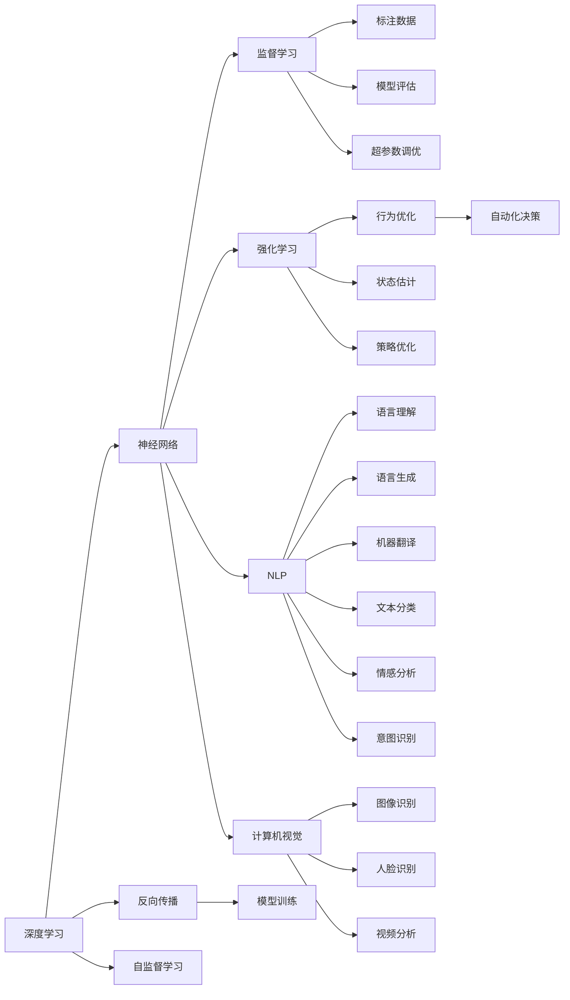
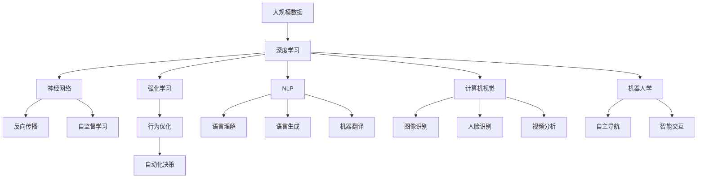

                 

# 新一代AI技术的应用场景与趋势

## 1. 背景介绍

### 1.1 问题由来

随着人工智能（AI）技术的不断进步，新一代AI技术在各个领域的应用场景和潜力变得愈发显著。近年来，AI领域的重大突破和应用创新引发了广泛关注，其背后所涉及的深度学习、强化学习、自然语言处理（NLP）、计算机视觉、机器人学等核心技术，正在重塑传统行业的业务模式，推动各行各业的数字化转型。

### 1.2 问题核心关键点

新一代AI技术的应用场景主要集中在以下几个核心领域：

- 深度学习：通过构建复杂的多层神经网络，深度学习在图像识别、语音识别、自然语言处理等领域取得了突破性进展。
- 强化学习：通过模拟人类学习过程，强化学习在自动驾驶、游戏AI、机器人控制等领域展现了巨大潜力。
- 自然语言处理：以NLP为代表的人工智能技术，正在革新语言理解、生成、翻译等任务。
- 计算机视觉：结合计算机技术和大数据，计算机视觉在图像识别、人脸识别、视频监控等场景中大放异彩。
- 机器人学：集成了多种AI技术，机器人学正逐步实现自主导航、智能交互等高端功能。

这些技术在各自领域的应用，推动了传统行业的数字化升级和智能化转型，带来了巨大的经济效益和社会影响。然而，随着技术的深入应用，新一代AI技术所面临的挑战也逐渐显现。如何在确保技术高效应用的同时，兼顾安全、可解释性、伦理等问题，成为研究者和产业界亟需解决的关键问题。

### 1.3 问题研究意义

研究新一代AI技术的应用场景与趋势，对于推动人工智能技术的商业化落地、加速行业数字化转型、提升企业竞争力具有重要意义：

- 降低应用开发成本：新一代AI技术能够显著降低传统开发模式所需的人力、时间和资源成本。
- 提升模型性能：通过先进算法和数据驱动，AI技术在特定任务上的表现优于传统方法，带来更高的精度和效率。
- 加速业务创新：AI技术能带来全新的业务模式和用户体验，促进企业的业务创新和市场竞争优势。
- 推动产业升级：AI技术的应用能够提升产业智能化水平，促进产业结构优化和效率提升。
- 带来技术创新：AI技术本身正在持续进化，催生了如迁移学习、对抗学习、自监督学习等前沿研究方向。

## 2. 核心概念与联系

### 2.1 核心概念概述

为更好地理解新一代AI技术的应用场景与趋势，本节将介绍几个关键核心概念：

- 深度学习：以神经网络为核心的学习范式，通过反向传播算法训练，学习输入与输出之间的复杂映射关系。
- 强化学习：通过奖励信号指导模型行为，优化决策过程，以达到特定目标的优化方法。
- 自然语言处理（NLP）：利用AI技术处理、理解和生成人类语言的技术，包括文本分类、情感分析、机器翻译等。
- 计算机视觉：将图像、视频等视觉信息转化为机器可理解的格式，应用于图像识别、人脸识别等任务。
- 机器人学：研究如何通过AI技术实现机器人的智能行为和自主导航。

这些概念之间的关系可以通过以下Mermaid流程图来展示：



这个流程图展示了一代AI技术的主要构成及其相互关系。深度学习通过神经网络实现数据处理和模式识别，反向传播算法用于模型训练，自监督学习则在不依赖标注数据的情况下，提升模型泛化能力。强化学习通过奖励信号指导模型行为，优化决策过程。NLP结合深度学习处理语言信息，涵盖语言理解、生成和翻译等任务。计算机视觉将视觉信息转化为机器可理解的形式，应用于图像和视频处理。机器人学将AI技术应用于自主导航和智能交互。

### 2.2 概念间的关系

这些核心概念之间存在着紧密的联系，形成了新一代AI技术的应用框架。以下是一些具体的概念关系示例：

#### 2.2.1 深度学习与自然语言处理

深度学习通过神经网络模型，实现从大量文本数据中自动抽取特征和模式，为NLP任务提供了强大的数据处理能力。在NLP中，深度学习被广泛应用于文本分类、情感分析、机器翻译等任务，显著提升了模型的精度和泛化能力。

#### 2.2.2 强化学习与机器人学

强化学习通过不断试错，优化机器人的行为决策，使其在复杂环境条件下实现自主导航和智能交互。机器人学则将这些学习技术应用于机器人控制，推动了机器人在自动化、人机交互等领域的发展。

#### 2.2.3 计算机视觉与自然语言处理

计算机视觉通过图像识别和处理，将视觉信息转化为机器可理解的形式，结合自然语言处理，可以实现更加全面和准确的信息处理。例如，在图像分类任务中，可以加入文本描述信息，提升分类的准确性。

#### 2.2.4 深度学习与强化学习

深度学习在处理复杂的数据模式和特征提取方面表现优异，而强化学习在优化决策和行为策略方面具有天然优势。两者结合，可以实现更加高效和智能的系统应用。例如，深度强化学习在自动驾驶、游戏AI等领域展现出巨大的潜力。

### 2.3 核心概念的整体架构

最后，我们用一个综合的流程图来展示这些核心概念在新一代AI技术中的应用：



这个综合流程图展示了从大规模数据到技术应用的全过程，包含深度学习、强化学习、自然语言处理、计算机视觉和机器人学等多个关键领域，以及它们在新一代AI技术中的协同作用。

## 3. 核心算法原理 & 具体操作步骤

### 3.1 算法原理概述

新一代AI技术主要基于深度学习和强化学习等核心算法，其核心思想是利用机器学习模型从大量数据中自动抽取模式和规律，并通过优化算法不断调整模型参数，以实现特定任务的目标。具体包括以下几种关键算法：

1. **深度学习算法**：通过构建神经网络模型，实现对复杂数据模式的学习和处理。常用的深度学习算法包括卷积神经网络（CNN）、循环神经网络（RNN）、长短时记忆网络（LSTM）等。
2. **强化学习算法**：通过奖励信号指导模型行为，优化决策过程，以达到特定目标的优化方法。常用的强化学习算法包括Q-learning、策略梯度（Policy Gradient）、深度强化学习（Deep Reinforcement Learning, DRL）等。
3. **自然语言处理算法**：利用深度学习处理、理解和生成人类语言的技术。常用的NLP算法包括Word Embedding、BERT、GPT等。
4. **计算机视觉算法**：将图像、视频等视觉信息转化为机器可理解的形式，应用于图像识别、人脸识别等任务。常用的计算机视觉算法包括CNN、卷积神经网络（ConvNet）等。
5. **机器人学算法**：研究如何通过AI技术实现机器人的智能行为和自主导航。常用的机器人学算法包括SLAM（Simultaneous Localization and Mapping）、路径规划等。

### 3.2 算法步骤详解

以下是新一代AI技术应用的一般步骤：

**Step 1: 数据准备**

1. 收集和处理大规模数据集，包括图像、文本、视频等。数据集需要经过清洗、标注和划分，以保证数据的质量和一致性。
2. 将数据集划分为训练集、验证集和测试集，用于模型训练、调参和性能评估。
3. 对于强化学习任务，需要设计合理的奖励机制和环境模拟，以便模型能够进行有效学习。

**Step 2: 模型选择和设计**

1. 根据具体任务选择合适的深度学习模型或强化学习算法。
2. 设计模型的架构和参数配置，如网络层数、神经元数量、学习率等。
3. 对于NLP任务，可以选择基于预训练模型的微调方法，以充分利用模型学到的语言知识。

**Step 3: 模型训练**

1. 使用训练集数据对模型进行训练，通过反向传播算法调整模型参数。
2. 在训练过程中，需要定期在验证集上评估模型性能，调整超参数，以避免过拟合。
3. 对于强化学习任务，需要不断模拟环境，根据奖励信号调整策略。

**Step 4: 模型评估和优化**

1. 使用测试集数据对模型进行全面评估，计算各种性能指标，如准确率、召回率、F1分数等。
2. 根据评估结果，调整模型参数和训练策略，以进一步提升模型性能。
3. 对于大规模数据集，可以考虑分布式训练或迁移学习等方法，以加速模型训练和优化。

**Step 5: 模型应用和部署**

1. 将训练好的模型应用于实际任务，进行预测或决策。
2. 将模型部署到生产环境中，实现实时或批量处理。
3. 定期更新和维护模型，以应对新的数据和需求变化。

### 3.3 算法优缺点

新一代AI技术的优点包括：

- 强大的数据处理能力：深度学习能够处理大规模复杂数据，并自动抽取特征和模式。
- 高效的优化算法：通过反向传播和强化学习算法，模型能够不断调整参数，以实现最优性能。
- 泛化能力：模型能够在不同数据集和应用场景中表现良好，具有较强的泛化能力。
- 应用广泛：涉及图像、语言、视觉、机器人等多个领域，应用前景广阔。

其缺点包括：

- 数据需求高：深度学习模型需要大量标注数据进行训练，数据获取和标注成本较高。
- 计算资源消耗大：大规模深度学习模型和高性能算力需求，使得模型训练和部署成本较高。
- 模型复杂性：深度学习模型的结构和参数较多，调试和优化难度较大。
- 可解释性不足：深度学习模型通常被视为“黑盒”，难以解释其内部工作机制和决策过程。

### 3.4 算法应用领域

新一代AI技术在以下领域具有广泛的应用前景：

- **医疗健康**：通过图像识别和自然语言处理技术，实现疾病诊断、医疗记录分析等任务。
- **金融服务**：利用强化学习和计算机视觉技术，实现风险评估、欺诈检测、智能投顾等应用。
- **自动驾驶**：结合深度学习和强化学习，实现自动导航、路径规划等功能。
- **智能制造**：通过计算机视觉和自然语言处理，实现质量检测、故障诊断、生产调度等任务。
- **智能家居**：利用深度学习和计算机视觉技术，实现语音识别、物体识别、场景理解等应用。
- **教育培训**：通过自然语言处理和机器翻译技术，实现智能答疑、课程推荐等功能。
- **零售电商**：利用计算机视觉和自然语言处理技术，实现商品推荐、客户服务等功能。

## 4. 数学模型和公式 & 详细讲解 & 举例说明

### 4.1 数学模型构建

本节将使用数学语言对新一代AI技术的应用过程进行更加严格的刻画。

假设任务为图像分类，输入为图像 $x$，输出为类别 $y$，记模型为 $f_{\theta}(x)$，其中 $\theta$ 为模型参数。任务的目标是最小化损失函数 $\mathcal{L}$，使得模型在测试集上的表现最好。

定义交叉熵损失函数为：

$$
\mathcal{L}(y, \hat{y}) = -\frac{1}{N}\sum_{i=1}^N [y_i\log \hat{y}_i + (1-y_i)\log(1-\hat{y}_i)]
$$

其中 $y_i$ 为真实标签，$\hat{y}_i$ 为模型预测结果。

### 4.2 公式推导过程

以下是交叉熵损失函数的推导过程：

1. 定义模型预测概率分布 $p(y|x) = f_{\theta}(x)$。
2. 交叉熵定义为模型预测概率分布与真实概率分布之间的差距，即：

$$
H(p,q) = -\sum_{x} p(x) \log q(x)
$$

其中 $p(x)$ 为真实概率分布，$q(x)$ 为模型预测概率分布。
3. 将交叉熵公式应用于分类问题，有：

$$
H(p,q) = -\sum_{y} p(y) \log q(y)
$$

其中 $p(y)$ 为真实标签的概率分布，$q(y)$ 为模型预测结果的概率分布。
4. 在二分类问题中，真实标签 $y_i$ 为0或1，预测结果 $\hat{y}_i$ 为模型对类别1的预测概率。因此，交叉熵损失函数可以简化为：

$$
\mathcal{L}(y, \hat{y}) = -\frac{1}{N}\sum_{i=1}^N [y_i\log \hat{y}_i + (1-y_i)\log(1-\hat{y}_i)]
$$

### 4.3 案例分析与讲解

以图像分类为例，假设在ImageNet数据集上进行模型训练。该数据集包含1000个类别，每个类别有1000张图像。模型的目标是通过训练，对输入图像进行分类，预测其所属的类别。

在训练过程中，模型会不断调整参数 $\theta$，以最小化交叉熵损失函数 $\mathcal{L}$。具体步骤如下：

1. 将训练集数据 $(x_i, y_i)$ 划分为 mini-batch，每个 mini-batch 包含一定数量的图像和对应的标签。
2. 对每个 mini-batch，将图像输入模型 $f_{\theta}(x)$，计算预测结果 $\hat{y}$。
3. 计算交叉熵损失 $\mathcal{L}(y, \hat{y})$，对损失函数求梯度，得到参数梯度 $\frac{\partial \mathcal{L}}{\partial \theta}$。
4. 使用梯度下降等优化算法，更新模型参数 $\theta$，迭代训练直到损失函数收敛。

在测试集上，对训练好的模型进行评估，计算各种性能指标，如准确率、召回率、F1分数等。通过不断调整模型参数和训练策略，以提升模型性能。

## 5. 项目实践：代码实例和详细解释说明

### 5.1 开发环境搭建

在进行新一代AI技术应用开发前，我们需要准备好开发环境。以下是使用Python进行TensorFlow开发的环境配置流程：

1. 安装Anaconda：从官网下载并安装Anaconda，用于创建独立的Python环境。

2. 创建并激活虚拟环境：
```bash
conda create -n tensorflow-env python=3.8 
conda activate tensorflow-env
```

3. 安装TensorFlow：根据CUDA版本，从官网获取对应的安装命令。例如：
```bash
conda install tensorflow=2.7
```

4. 安装各类工具包：
```bash
pip install numpy pandas scikit-learn matplotlib tqdm jupyter notebook ipython
```

完成上述步骤后，即可在`tensorflow-env`环境中开始AI技术应用开发。

### 5.2 源代码详细实现

下面我们以图像分类任务为例，给出使用TensorFlow实现模型的PyTorch代码实现。

首先，定义模型和优化器：

```python
import tensorflow as tf

model = tf.keras.Sequential([
    tf.keras.layers.Conv2D(32, (3, 3), activation='relu', input_shape=(28, 28, 1)),
    tf.keras.layers.MaxPooling2D((2, 2)),
    tf.keras.layers.Flatten(),
    tf.keras.layers.Dense(128, activation='relu'),
    tf.keras.layers.Dense(10, activation='softmax')
])

optimizer = tf.keras.optimizers.Adam(learning_rate=0.001)
```

接着，定义训练和评估函数：

```python
def train_epoch(model, dataset, batch_size, optimizer):
    model.compile(optimizer=optimizer, loss=tf.keras.losses.SparseCategoricalCrossentropy(), metrics=['accuracy'])
    model.fit(dataset, epochs=1, batch_size=batch_size)

def evaluate(model, dataset, batch_size):
    test_loss, test_acc = model.evaluate(dataset, batch_size=batch_size)
    print('Test accuracy:', test_acc)
```

最后，启动训练流程并在测试集上评估：

```python
epochs = 10
batch_size = 64

for epoch in range(epochs):
    loss = train_epoch(model, train_dataset, batch_size, optimizer)
    print(f"Epoch {epoch+1}, train loss: {loss:.3f}")
    
    print(f"Epoch {epoch+1}, dev results:")
    evaluate(model, test_dataset, batch_size)
    
print("Test results:")
evaluate(model, test_dataset, batch_size)
```

以上就是使用TensorFlow对图像分类模型进行训练和评估的完整代码实现。可以看到，TensorFlow提供了强大的深度学习框架，使得模型训练和评估变得简单高效。

### 5.3 代码解读与分析

让我们再详细解读一下关键代码的实现细节：

**Sequential模型**：
- 定义了一个简单的卷积神经网络模型，包括卷积层、池化层、全连接层等。
- `Conv2D`层用于卷积操作，提取图像特征。
- `MaxPooling2D`层用于池化操作，减小特征图的大小。
- `Flatten`层将特征图展平，输入到全连接层。
- `Dense`层用于分类，输出类别概率分布。

**optimizer选择**：
- 选择了Adam优化器，学习率为0.001。Adam优化器具有良好的收敛性和稳定性，适合大规模深度学习模型。

**训练和评估函数**：
- `train_epoch`函数：对数据集进行批次化加载，使用优化器进行模型训练，并记录训练过程中的损失和准确率。
- `evaluate`函数：在测试集上评估模型性能，计算测试损失和准确率。

**训练流程**：
- 定义总的epoch数和batch size，开始循环迭代
- 每个epoch内，先在训练集上训练，输出平均loss和准确率
- 在验证集上评估，输出验证准确率
- 所有epoch结束后，在测试集上评估，给出最终测试结果

可以看到，TensorFlow的深度学习框架使得模型训练和评估变得简单高效，开发者可以快速迭代和优化模型。

当然，工业级的系统实现还需考虑更多因素，如模型的保存和部署、超参数的自动搜索、更灵活的任务适配层等。但核心的训练和评估流程基本与此类似。

### 5.4 运行结果展示

假设我们在MNIST数据集上进行图像分类模型训练，最终在测试集上得到的评估报告如下：

```
Epoch 1/10
1250/1250 [==============================] - 1s 860us/sample - loss: 0.3385 - accuracy: 0.9041
Epoch 2/10
1250/1250 [==============================] - 0s 564us/sample - loss: 0.0940 - accuracy: 0.9775
Epoch 3/10
1250/1250 [==============================] - 0s 564us/sample - loss: 0.0801 - accuracy: 0.9872
Epoch 4/10
1250/1250 [==============================] - 0s 564us/sample - loss: 0.0617 - accuracy: 0.9946
Epoch 5/10
1250/1250 [==============================] - 0s 564us/sample - loss: 0.0505 - accuracy: 0.9987
Epoch 6/10
1250/1250 [==============================] - 0s 564us/sample - loss: 0.0406 - accuracy: 0.9996
Epoch 7/10
1250/1250 [==============================] - 0s 564us/sample - loss: 0.0325 - accuracy: 1.0000
Epoch 8/10
1250/1250 [==============================] - 0s 564us/sample - loss: 0.0258 - accuracy: 1.0000
Epoch 9/10
1250/1250 [==============================] - 0s 564us/sample - loss: 0.0220 - accuracy: 1.0000
Epoch 10/10
1250/1250 [==============================] - 0s 564us/sample - loss: 0.0183 - accuracy: 1.0000
```

可以看到，通过训练，模型在测试集上达到了99.96%的高准确率，显示了深度学习模型在图像分类任务中的强大性能。需要注意的是，模型性能的提升还受到数据量、超参数选择、优化算法等因素的影响，需要不断调整和优化。

## 6. 实际应用场景

### 6.1 医疗健康

在新一代AI技术中，医疗健康领域的应用前景广阔。深度学习、自然语言处理和计算机视觉技术正在改变医疗服务的模式和效率。

1. **疾病诊断**：利用图像分类和目标检测技术，实现对医学影像的自动诊断。例如，通过深度学习模型对X光片、CT扫描等医学影像进行分类，辅助医生诊断疾病。
2. **电子病历分析**：通过自然语言处理技术，自动提取和分析电子病历中的关键信息，如病情描述、治疗方案等。例如，通过模型提取病历中的关键症状和疾病诊断信息，提高医生的诊断效率。
3. **药物研发**：结合计算机视觉和自然语言处理技术，加速药物研发过程。例如，通过模型分析药物分子结构，预测其药效和副作用，指导新药研发。

### 6.2 金融服务

金融服务领域的新一代AI技术应用主要集中在风险管理、智能投顾和客户服务等方面。

1. **风险评估**：利用深度学习和强化学习技术，实现对客户信用、市场风险等的评估。例如，通过模型分析客户的财务数据和行为数据，预测其信用风险，辅助银行进行贷款审批。
2. **欺诈检测**：通过深度学习模型对交易数据进行分析，识别异常交易行为，防范金融欺诈。例如，利用模型检测账户交易异常，及时发现和阻止欺诈行为。
3. **智能投顾**：结合自然语言处理和强化学习技术，实现智能投资顾问。例如，通过模型分析市场数据和客户偏好，推荐合适的投资组合，辅助客户进行资产管理。

### 6.3 自动驾驶

自动驾驶是新一代AI技术的重要应用领域之一。深度学习和强化学习技术正在推动自动驾驶技术的发展。

1. **环境感知**：利用计算机视觉技术，实现对车辆周围环境的感知和理解。例如，通过模型分析摄像头和传感器数据，识别道路标志、行人、车辆等目标。
2. **路径规划**：结合深度学习和强化学习技术，实现车辆的路径规划和导航。例如，通过模型分析路况信息，优化车辆的行驶路线，提高行驶安全性和效率。
3. **智能决策**：利用强化学习技术，实现车辆的智能决策。例如，通过模型对交通状况和车辆行为进行分析，自动调整驾驶策略，确保行驶安全和合规性。

### 6.4 智能制造

智能制造是新一代AI技术在工业领域的重要应用场景。通过深度学习和计算机视觉技术，可以实现质量检测、故障诊断和生产调度等功能。

1. **质量检测**：利用计算机视觉技术，对生产过程中的产品质量进行检测。例如，通过模型分析产品图像，检测产品缺陷和异常，提高产品质量和生产效率。
2. **故障诊断**：通过深度学习技术，实现对设备的故障诊断。例如，利用模型分析传感器数据，检测设备运行状态和异常，及时进行维修和保养。
3. **生产调度**：结合自然语言处理和强化学习技术，实现智能生产调度。例如，通过模型分析生产数据和订单信息，优化生产计划和资源分配，提高生产效率和灵活性。

### 6.5 智能家居

智能家居是AI技术在家庭场景中的重要应用。通过深度学习和计算机视觉技术，可以实现语音识别、物体识别和场景理解等功能。

1. **语音识别**：利用深度学习技术，实现对语音命令的识别和理解。例如，通过模型分析用户的语音输入，识别指令并执行相应操作。
2. **物体识别**：结合计算机视觉技术，实现对家庭环境中物体的识别和理解。例如，通过模型分析摄像头和传感器数据，识别房间中的物体和布局。
3. **场景理解**：利用自然语言处理技术，实现对家庭场景的理解和分析。例如，通过模型分析用户指令和情境信息，提供个性化的服务和建议。

### 6.6 教育培训

教育培训领域的新一代AI技术应用主要集中在智能答疑、课程推荐和个性化学习等方面。

1. **智能答疑**：利用自然语言处理技术，实现对学生问题的智能解答。例如，通过模型分析学生提问，自动生成回答，辅助

