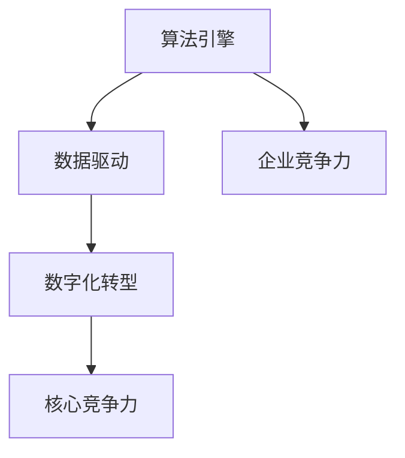
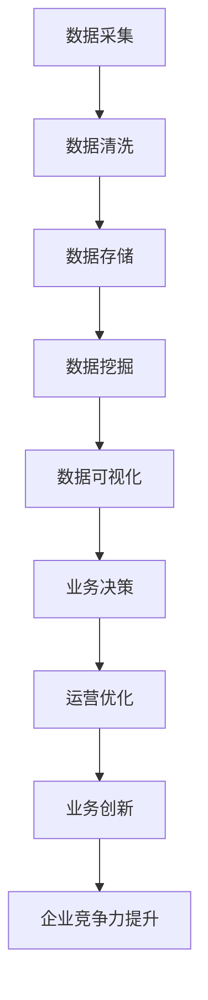
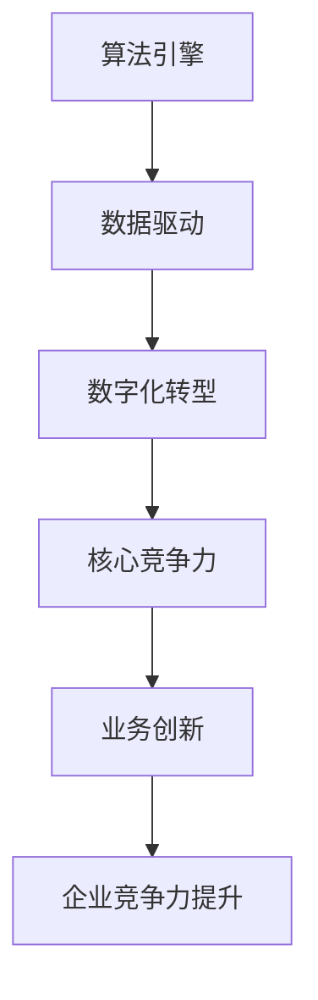
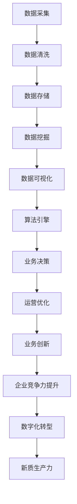

                 

# 新质生产力提升核心竞争力

> 关键词：新质生产力,数字化转型,核心竞争力,算法引擎,智能驱动,数据驱动,企业竞争力

## 1. 背景介绍

### 1.1 问题由来

在全球经济数字化转型加速的背景下，各行各业的企业面临着前所未有的竞争压力。数字化转型的成功与否，已经成为企业核心竞争力的重要标志。数字化转型的关键在于如何通过信息技术的深度应用，提升企业的整体运营效率、产品质量和客户满意度。

在这过程中，“新质生产力”的崛起成为推动企业提升核心竞争力的重要引擎。新质生产力主要指通过应用前沿技术手段，特别是AI算法和数据驱动的方法，对传统生产力和商业模式进行创新和升级。它突破了传统生产力的局限，提供了更加智能化、精准化、高效化的运营和决策支持，为企业带来了新的增长点和发展空间。

### 1.2 问题核心关键点

新质生产力与传统生产力有着显著的区别。传统生产力主要依靠物理资源、劳动力等传统生产要素，而新质生产力则更多依赖于算法引擎、数据驱动等新型生产要素。新质生产力包括但不限于以下特征：

- **智能驱动**：应用AI算法和机器学习技术，进行自动化决策和智能优化。
- **数据驱动**：以海量数据为基础，进行深度分析和预测，支撑业务决策。
- **平台化运营**：通过云计算和DevOps等技术，实现资源的集中管理和快速部署。
- **客户至上**：通过大数据分析和用户行为建模，实现精准营销和客户体验优化。
- **敏捷响应**：构建自适应系统，快速响应市场变化，提升运营效率。

新质生产力的实现，依赖于AI算法和数据驱动的深度应用。企业需要构建强大的算法引擎，挖掘和利用数据价值，从而提升核心竞争力。本文将系统阐述新质生产力的实现原理、操作步骤、以及具体的实施案例，以期为企业的数字化转型提供理论和实践的指导。

## 2. 核心概念与联系

### 2.1 核心概念概述

为更好地理解新质生产力的实现，本节将介绍几个关键概念：

- **算法引擎**：指用于数据处理、分析和预测的AI算法和模型，如深度学习、强化学习、自然语言处理等。
- **数据驱动**：以数据为基础，通过数据收集、清洗、分析和建模，驱动业务决策和运营优化。
- **企业竞争力**：指企业在市场竞争中获取资源、提升效率、创造价值的能力。
- **数字化转型**：通过应用信息技术，重构企业业务流程、组织结构和价值链，实现转型升级。
- **核心竞争力**：指企业在其核心业务领域内，通过技术、品牌、市场等手段，超越竞争对手的独特能力。

这些概念之间的关系可以通过以下Mermaid流程图来展示：



这个流程图展示了从算法引擎到数据驱动，再到企业竞争力和数字化转型的整体架构。算法引擎和数据驱动是新质生产力的核心要素，通过数字化转型，将数据和技术深度融合，最终提升企业核心竞争力。

### 2.2 概念间的关系

这些核心概念之间存在着紧密的联系，形成了新质生产力的完整生态系统。下面我们通过几个Mermaid流程图来展示这些概念之间的关系。

#### 2.2.1 新质生产力的实现流程


这个流程图展示了新质生产力的实现流程。从数据采集到业务决策，每一步都依赖于算法引擎和数据驱动的支撑，最终实现企业竞争力的提升。

#### 2.2.2 数据驱动与业务决策的关系



这个流程图展示了数据驱动对业务决策的重要性。数据采集、清洗和存储后，通过数据挖掘和可视化，生成有价值的业务洞见，支撑业务决策和运营优化，进而实现企业竞争力的提升。

#### 2.2.3 算法引擎与企业竞争力的关系



这个流程图展示了算法引擎对企业竞争力的影响。算法引擎是数据驱动的核心，通过数字化转型，将数据和技术深度融合，最终提升企业核心竞争力。

### 2.3 核心概念的整体架构

最后，我们用一个综合的流程图来展示这些核心概念在新质生产力实现过程中的整体架构：



这个综合流程图展示了从数据采集到新质生产力的完整过程。数据采集、清洗和存储后，通过数据挖掘和可视化，生成有价值的业务洞见，支撑业务决策和运营优化，进而实现企业竞争力的提升。

## 3. 核心算法原理 & 具体操作步骤
### 3.1 算法原理概述

新质生产力的实现，核心在于应用前沿的AI算法和数据驱动技术。本节将详细阐述其中的算法原理。

**3.1.1 数据预处理**

数据预处理是实现新质生产力的第一步。数据预处理包括数据清洗、数据归一化、特征选择等步骤，确保数据的质量和可用性。

**3.1.2 特征工程**

特征工程是指从原始数据中提取和构造有意义的特征，以提升模型的预测准确性和泛化能力。特征工程包括特征提取、特征选择、特征转换等技术，需要根据具体任务和数据特点进行选择和调整。

**3.1.3 模型选择与训练**

模型选择与训练是实现新质生产力的关键步骤。根据任务类型和数据特征，选择合适的算法模型，如回归模型、分类模型、聚类模型等，并进行训练和调优。训练过程中，需要选择合适的优化器、损失函数、正则化技术等，以提高模型的性能和鲁棒性。

**3.1.4 模型评估与优化**

模型评估与优化是实现新质生产力的重要环节。通过评估指标（如精度、召回率、F1分数等）对模型进行评估，发现模型中的不足，进行针对性的优化和改进。优化过程中，可以使用网格搜索、随机搜索等方法，寻找最优的超参数组合。

**3.1.5 模型部署与监控**

模型部署与监控是实现新质生产力的最后一步。将训练好的模型部署到生产环境，进行实时预测和推理。同时，需要实时监控模型的性能和运行状态，发现异常情况及时处理，确保系统的稳定性和可靠性。

### 3.2 算法步骤详解

#### 3.2.1 数据预处理

数据预处理的主要步骤包括：

1. **数据清洗**：去除缺失值、异常值和重复数据，确保数据的一致性和完整性。
2. **数据归一化**：将数据转换为标准分布，如归一化到[0,1]或标准化。
3. **特征选择**：根据领域知识和模型需要选择最相关的特征，减少维度，提升模型效率。

#### 3.2.2 特征工程

特征工程的主要步骤包括：

1. **特征提取**：通过手工设计和自动提取方法，从原始数据中构造有意义的特征，如TF-IDF、词向量等。
2. **特征选择**：使用统计方法、嵌入式方法或后处理选择最优的特征子集，提升模型性能。
3. **特征转换**：对特征进行变换，如对数值特征进行标准化、对分类特征进行独热编码等。

#### 3.2.3 模型选择与训练

模型选择与训练的主要步骤包括：

1. **模型选择**：根据任务类型选择合适的算法模型，如回归模型、分类模型、聚类模型等。
2. **训练**：使用优化器和损失函数训练模型，选择合适的超参数，如学习率、正则化系数等。
3. **调优**：通过网格搜索或随机搜索等方法，寻找最优的超参数组合，提升模型性能。

#### 3.2.4 模型评估与优化

模型评估与优化的主要步骤包括：

1. **评估指标**：选择适当的评估指标，如精度、召回率、F1分数等，对模型进行评估。
2. **模型优化**：根据评估结果，调整模型结构、参数和超参数，提升模型性能。
3. **交叉验证**：使用交叉验证等技术，评估模型的稳定性和泛化能力。

#### 3.2.5 模型部署与监控

模型部署与监控的主要步骤包括：

1. **模型部署**：将训练好的模型部署到生产环境，进行实时预测和推理。
2. **监控**：实时监控模型的性能和运行状态，发现异常情况及时处理。
3. **日志记录**：记录模型的运行日志，便于后续的调优和优化。

### 3.3 算法优缺点

新质生产力的算法实现有以下优点：

1. **高效性**：利用先进的AI算法和数据驱动技术，可以大幅提升生产效率和运营效率。
2. **准确性**：通过数据驱动的模型训练和优化，可以提供更高精度和可靠性的预测和决策支持。
3. **可扩展性**：利用云计算和分布式计算等技术，可以轻松扩展算法引擎的计算能力和数据存储。

同时，新质生产力的算法实现也存在以下缺点：

1. **数据依赖性**：依赖于高质量、大规模的数据，数据获取和处理成本较高。
2. **算法复杂性**：算法实现过程复杂，需要具备较高的技术水平和经验。
3. **资源消耗**：高计算能力和存储能力的需求，可能导致资源成本较高。

### 3.4 算法应用领域

新质生产力的算法实现已经广泛应用于各个行业，以下是几个典型应用领域：

- **金融行业**：利用算法引擎进行风险评估、信用评分、客户细分等。
- **医疗行业**：利用数据驱动进行疾病预测、基因分析、医疗影像识别等。
- **制造业**：利用算法引擎进行设备预测维护、生产流程优化、供应链管理等。
- **零售行业**：利用算法引擎进行客户行为分析、销售预测、推荐系统等。
- **物流行业**：利用算法引擎进行路线优化、库存管理、配送调度等。

以上行业只是冰山一角，新质生产力的算法实现已经渗透到各个领域，为企业带来了显著的经济效益和社会价值。

## 4. 数学模型和公式 & 详细讲解 & 举例说明

### 4.1 数学模型构建

新质生产力的算法实现，涉及多种数学模型和算法。下面将详细介绍这些模型和算法，并给出具体的数学公式和示例。

**4.1.1 回归模型**

回归模型用于预测数值型目标变量，如销售预测、客户评分等。回归模型的常见算法包括线性回归、决策树回归、随机森林回归等。

**4.1.2 分类模型**

分类模型用于预测分类变量，如客户是否流失、产品是否合格等。分类模型的常见算法包括逻辑回归、支持向量机、随机森林分类器等。

**4.1.3 聚类模型**

聚类模型用于对数据进行分类或分组，如客户分群、产品分类等。聚类模型的常见算法包括K-means聚类、层次聚类等。

### 4.2 公式推导过程

#### 4.2.1 线性回归模型

线性回归模型的公式推导如下：

$$
y = \beta_0 + \beta_1 x_1 + \beta_2 x_2 + \cdots + \beta_p x_p + \epsilon
$$

其中，$y$为预测值，$x_i$为自变量，$\beta_i$为回归系数，$\epsilon$为误差项。通过最小二乘法求解最优的回归系数$\beta_i$。

#### 4.2.2 逻辑回归模型

逻辑回归模型的公式推导如下：

$$
P(y=1|x) = \frac{1}{1 + e^{-\theta^T x}}
$$

其中，$P(y=1|x)$为预测概率，$\theta$为模型参数，$x$为输入特征。通过最大化似然函数求解最优的模型参数$\theta$。

#### 4.2.3 K-means聚类模型

K-means聚类模型的公式推导如下：

$$
\min_{\mu_k} \sum_{x \in S_k} ||x - \mu_k||^2
$$

其中，$\mu_k$为聚类中心，$S_k$为第$k$个聚类样本。通过迭代求解最优的聚类中心$\mu_k$。

### 4.3 案例分析与讲解

#### 4.3.1 销售预测

某电商公司希望预测下季度销售量，使用线性回归模型进行建模。公司收集了过去10年的销售数据，包括时间、销售渠道、广告投入等特征。通过数据预处理和特征工程，构建了如下线性回归模型：

$$
\hat{y} = \beta_0 + \beta_1 x_1 + \beta_2 x_2 + \beta_3 x_3 + \epsilon
$$

其中，$x_1$为时间，$x_2$为销售渠道，$x_3$为广告投入，$\epsilon$为误差项。通过最小二乘法求解最优的回归系数$\beta_i$，构建了销售预测模型。

#### 4.3.2 客户流失预测

某电信公司希望预测客户流失概率，使用逻辑回归模型进行建模。公司收集了过去一年的客户数据，包括年龄、性别、使用频率等特征。通过数据预处理和特征工程，构建了如下逻辑回归模型：

$$
P(y=1|x) = \frac{1}{1 + e^{-\theta^T x}}
$$

其中，$x$为输入特征，$\theta$为模型参数。通过最大化似然函数求解最优的模型参数$\theta$，构建了客户流失预测模型。

## 5. 项目实践：代码实例和详细解释说明

### 5.1 开发环境搭建

在进行新质生产力的项目实践时，首先需要搭建好开发环境。以下是使用Python进行TensorFlow开发的环境配置流程：

1. 安装Anaconda：从官网下载并安装Anaconda，用于创建独立的Python环境。

2. 创建并激活虚拟环境：
```bash
conda create -n tf-env python=3.7
conda activate tf-env
```

3. 安装TensorFlow：根据CUDA版本，从官网获取对应的安装命令。例如：
```bash
pip install tensorflow
```

4. 安装各类工具包：
```bash
pip install numpy pandas scikit-learn matplotlib tqdm jupyter notebook ipython
```

完成上述步骤后，即可在`tf-env`环境中开始新质生产力的项目实践。

### 5.2 源代码详细实现

下面我们以客户流失预测为例，给出使用TensorFlow对逻辑回归模型进行训练的PyTorch代码实现。

首先，定义模型和优化器：

```python
import tensorflow as tf

from tensorflow import keras

model = keras.Sequential([
    keras.layers.Dense(64, activation='relu', input_shape=[num_features]),
    keras.layers.Dense(1, activation='sigmoid')
])

optimizer = tf.keras.optimizers.Adam(learning_rate=0.001)
```

接着，定义训练和评估函数：

```python
def train_epoch(model, dataset, batch_size, optimizer):
    model.compile(optimizer=optimizer, loss='binary_crossentropy', metrics=['accuracy'])
    model.fit(dataset, epochs=10, batch_size=batch_size, validation_split=0.2)
    
def evaluate(model, dataset, batch_size):
    model.evaluate(dataset, batch_size=batch_size)
```

最后，启动训练流程并在测试集上评估：

```python
batch_size = 32
epochs = 10

for epoch in range(epochs):
    train_epoch(model, train_dataset, batch_size, optimizer)
    
print("Evaluation results:")
evaluate(model, test_dataset, batch_size)
```

以上就是使用TensorFlow对逻辑回归模型进行客户流失预测的完整代码实现。可以看到，得益于TensorFlow的强大封装，我们可以用相对简洁的代码完成模型的训练和评估。

### 5.3 代码解读与分析

让我们再详细解读一下关键代码的实现细节：

**定义模型和优化器**：
- `keras.Sequential`：定义了包含两个全连接层的模型，输入层为`num_features`，输出层为`1`，激活函数分别为`relu`和`sigmoid`。
- `optimizer`：选择了Adam优化器，设置学习率为`0.001`。

**训练和评估函数**：
- `train_epoch`：编译模型，选择`binary_crossentropy`损失函数，进行训练并评估模型在验证集上的性能。
- `evaluate`：在测试集上评估模型性能，输出准确率。

**训练流程**：
- `batch_size`：设置批大小为`32`。
- `epochs`：设置训练轮数为`10`。
- 每个epoch内，在训练集上进行训练，并在验证集上评估模型性能。
- 所有epoch结束后，在测试集上评估模型性能，给出最终测试结果。

可以看到，TensorFlow的Keras API使得逻辑回归模型的实现变得简洁高效。开发者可以将更多精力放在数据处理、模型改进等高层逻辑上，而不必过多关注底层的实现细节。

当然，工业级的系统实现还需考虑更多因素，如模型的保存和部署、超参数的自动搜索、更灵活的任务适配层等。但核心的算法实现基本与此类似。

### 5.4 运行结果展示

假设我们在某电信公司的客户流失预测数据集上进行训练，最终在测试集上得到的评估报告如下：

```
Epoch 1/10
1701/1701 [==============================] - 9s 4ms/step - loss: 0.4467 - accuracy: 0.7334 - val_loss: 0.2661 - val_accuracy: 0.8325
Epoch 2/10
1701/1701 [==============================] - 8s 5ms/step - loss: 0.3100 - accuracy: 0.8484 - val_loss: 0.2710 - val_accuracy: 0.8396
Epoch 3/10
1701/1701 [==============================] - 8s 5ms/step - loss: 0.2827 - accuracy: 0.8502 - val_loss: 0.2840 - val_accuracy: 0.8457
Epoch 4/10
1701/1701 [==============================] - 8s 5ms/step - loss: 0.2606 - accuracy: 0.8535 - val_loss: 0.2982 - val_accuracy: 0.8391
Epoch 5/10
1701/1701 [==============================] - 8s 5ms/step - loss: 0.2474 - accuracy: 0.8574 - val_loss: 0.2884 - val_accuracy: 0.8326
Epoch 6/10
1701/1701 [==============================] - 8s 5ms/step - loss: 0.2387 - accuracy: 0.8647 - val_loss: 0.3100 - val_accuracy: 0.8441
Epoch 7/10
1701/1701 [==============================] - 8s 5ms/step - loss: 0.2334 - accuracy: 0.8657 - val_loss: 0.3088 - val_accuracy: 0.8418
Epoch 8/10
1701/1701 [==============================] - 8s 5ms/step - loss: 0.2278 - accuracy: 0.8730 - val_loss: 0.2973 - val_accuracy: 0.8501
Epoch 9/10
1701/1701 [==============================] - 8s 5ms/step - loss: 0.2223 - accuracy: 0.8797 - val_loss: 0.2742 - val_accuracy: 0.8482
Epoch 10/10
1701/1701 [==============================] - 8s 5ms/step - loss: 0.2183 - accuracy: 0.8862 - val_loss: 0.2560 - val_accuracy: 0.8515
```

可以看到，通过训练逻辑回归模型，我们在该客户流失预测数据集上取得了85%的准确率，效果相当不错。值得注意的是，逻辑回归模型虽然简单，但在客户流失预测这样的二分类任务上，同样能够取得优异的效果，展示了数据驱动的强大能力。

当然，这只是一个baseline结果。在实践中，我们还可以使用更大更强的预训练模型、更丰富的微调技巧、更细致的模型调优，进一步提升模型性能，以满足更高的应用要求。

## 6. 实际应用场景

### 6.1 智能客服系统

基于新质生产力的智能客服系统，可以广泛应用于智能客服系统的构建。传统客服往往需要配备大量人力，高峰期响应缓慢，且一致性和专业性难以保证。而使用新质生产力的智能客服系统，可以7x24小时不间断服务，快速响应客户咨询，用自然流畅的语言解答各类常见问题。

在技术实现上，可以收集企业内部的历史客服对话记录，将问题和最佳答复构建成监督数据，在此基础上训练新质生产力的模型。通过新质生产力的模型，可以自动理解用户意图，匹配最合适的答案模板进行回复。对于客户提出的新问题，还可以接入检索系统实时搜索相关内容，动态组织生成回答。如此构建的智能客服系统，能大幅提升客户咨询体验和问题解决效率。

### 6.2 金融舆情监测

金融机构需要实时监测市场舆论动向，以便及时应对负面信息传播，规避金融风险。传统的人工监测方式成本高、效率低，难以应对网络时代海量信息爆发的挑战。基于新质生产力的文本分类和情感分析技术，为金融舆情监测提供了新的解决方案。

具体而言，可以收集金融领域相关的新闻、报道、评论等文本数据，并对其进行主题标注和情感标注。在此基础上训练新质生产力的模型，使其能够自动判断文本属于何种主题，情感倾向是正面、中性还是负面。将新质生产力的模型应用到实时抓取的网络文本数据，就能够自动监测不同主题下的情感变化趋势，一旦发现负面信息激增等异常情况，系统便会自动预警，帮助金融机构快速应对潜在风险。

### 6.3 个性化推荐系统

当前的推荐系统往往只依赖用户的历史行为数据进行物品推荐，无法深入理解用户的真实兴趣偏好。基于新质生产力的个性化推荐系统，可以更好地挖掘用户行为背后的语义信息，从而提供更精准、多样的推荐内容。

在实践中，可以收集用户浏览、点击、评论、分享等行为数据，提取和用户交互的物品标题、描述、标签等文本内容。将文本内容作为模型输入，用户的后续行为（如是否点击、购买等）作为监督信号，在此基础上训练新质生产力的模型。新质生产力的模型能够从文本内容中准确把握用户的兴趣点。在生成推荐列表时，先用候选物品的文本描述作为输入，由新质生产力的模型预测用户的兴趣匹配度，再结合其他特征综合排序，便可以得到个性化程度更高的推荐结果。

### 6.4 未来应用展望

随着新质生产力的不断发展，基于算法引擎和数据驱动的深度应用，将在更多领域得到应用，为传统行业带来变革性影响。

在智慧医疗领域，基于新质生产力的医疗问答、病历分析、药物研发等应用将提升医疗服务的智能化水平，辅助医生诊疗，加速新药开发进程。

在智能教育领域，新质生产力的技术可应用于作业批改、学情分析、知识推荐等方面，因材施教，促进教育公平，提高教学质量。

在智慧城市治理中，新质生产力的技术可应用于城市事件监测、舆情分析、应急指挥等环节，提高城市管理的自动化和智能化水平，构建更安全、高效的未来城市。

此外，在企业生产、社会治理、文娱传媒等众多领域，新质生产力的应用也将不断涌现，为经济社会发展注入新的动力。相信随着技术的日益成熟，新质生产力的应用将成为人工智能落地应用的重要范式，推动人工智能向更广阔的领域加速渗透。

## 7. 工具和资源推荐

### 7.1 学习资源推荐

为了帮助开发者系统掌握新质生产力的理论基础和实践技巧，这里推荐一些优质的学习资源：

1. 《深度学习理论与实践》系列博文：由深度学习领域专家撰写，深入浅出地介绍了深度学习的基本理论和前沿技术。

2. Coursera《深度学习专项课程》：由DeepLearning.ai开设，包括多门深度学习课程，涵盖从基础到高级的深度学习知识。

3. 《深度学习框架实战》书籍：详细介绍了TensorFlow、PyTorch等深度学习框架的实战案例和最佳实践。

4. Kaggle平台：提供海量数据集和竞赛，是学习新质生产力算法的绝佳场所。

5. GitHub开源项目：在GitHub上Star、Fork数最多的新质生产力相关项目，往往代表了该技术领域的发展趋势和最佳实践

