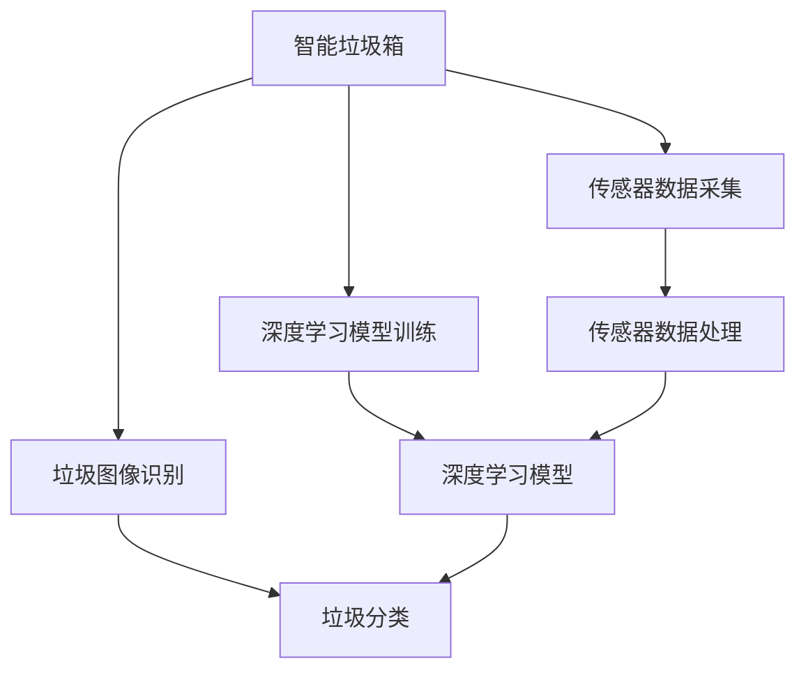

                 

# 智能垃圾箱创业：自动分类的环保解决方案

> 关键词：智能垃圾箱, 自动分类, 垃圾处理, 环保, 物联网(IoT), 深度学习

## 1. 背景介绍

### 1.1 问题由来
在全球范围内，垃圾处理问题已经成为城市发展中的一大难题。随着人口增长和消费水平提高，垃圾产生量激增，对环境造成了严重污染。尤其是生活垃圾，若不加区分地处理，不仅占用大量土地资源，还存在燃烧污染、填埋污染等问题。如何高效、环保地进行垃圾分类，成为了各国政府和企业共同面临的重要课题。

近年来，智能垃圾箱技术逐渐兴起。通过在垃圾箱内集成传感器和深度学习模型，可以自动识别和分类垃圾，实现垃圾分类自动化。这种技术不仅提升了垃圾分类的效率和准确性，还减少了人工分类的劳动强度，有效推动了垃圾处理领域的智能化转型。本文将详细介绍智能垃圾箱创业中自动分类系统的开发和应用。

### 1.2 问题核心关键点
智能垃圾箱自动分类系统主要包括传感器数据采集、垃圾图像识别、深度学习模型训练、分类结果输出等关键环节。其核心目标是：

- 实时采集垃圾图像和传感器数据。
- 通过深度学习模型自动识别垃圾类别。
- 根据分类结果调整垃圾箱内的处理流程。
- 记录垃圾投放情况，辅助环境监测和优化。

## 2. 核心概念与联系

### 2.1 核心概念概述

为更好地理解智能垃圾箱自动分类系统的实现原理，本节将介绍几个密切相关的核心概念：

- **智能垃圾箱(Smart Garbage Bin)**：通过物联网技术，集成了传感器和数据处理能力的垃圾箱。能够实时监测垃圾投放情况，自动分类垃圾。
- **深度学习(Deep Learning)**：一类基于神经网络的机器学习技术，通过多层次的非线性特征提取和抽象，实现复杂任务的自动分类和识别。
- **物联网(IoT)**：利用互联网将传感器、执行器等设备连接起来，实现数据采集和远程控制。
- **垃圾分类(Waste Segregation)**：将不同种类的垃圾按指定规则分类，提高回收利用率，减少环境污染。
- **传感器(Sensor)**：用于检测垃圾箱内状态和环境的硬件设备，如温度传感器、压力传感器、图像传感器等。

这些核心概念之间的逻辑关系可以通过以下Mermaid流程图来展示：



这个流程图展示出了智能垃圾箱自动分类系统的核心概念及其之间的关系：

1. 智能垃圾箱通过传感器采集垃圾箱内的状态和环境数据。
2. 采集到的数据经传感器数据处理，输入到深度学习模型。
3. 深度学习模型对输入的垃圾图像进行识别，输出垃圾类别。
4. 根据分类结果，智能垃圾箱调整垃圾处理流程。
5. 系统记录垃圾投放情况，辅助环境监测和优化。

### 2.2 概念间的关系

这些核心概念之间存在着紧密的联系，形成了智能垃圾箱自动分类系统的完整工作流程。

- **传感器数据采集与深度学习模型训练**：传感器数据为深度学习模型提供了丰富的输入特征，训练模型能够准确识别垃圾类别。
- **垃圾图像识别与垃圾分类**：垃圾图像识别是垃圾分类的重要前提，深度学习模型通过识别垃圾图像，输出垃圾类别。
- **智能垃圾箱与物联网**：智能垃圾箱通过物联网技术实现数据的远程采集和控制，提高了垃圾分类的智能化水平。
- **深度学习与传感器数据处理**：深度学习模型需要高质量的传感器数据输入，传感器数据处理技术提升数据质量，增强模型的识别能力。

这些概念共同构成了智能垃圾箱自动分类系统的技术基础，使得系统能够高效、环保地处理垃圾，提升垃圾分类的效率和质量。

## 3. 核心算法原理 & 具体操作步骤
### 3.1 算法原理概述

智能垃圾箱自动分类系统利用深度学习模型对垃圾图像进行识别，从而实现垃圾自动分类。其核心算法原理如下：

1. **数据预处理**：通过传感器采集垃圾箱内的图像和传感器数据，进行预处理（如裁剪、归一化、灰度化等）。
2. **深度学习模型训练**：使用标记好的垃圾图像数据集训练深度学习模型，学习垃圾分类的特征和模式。
3. **垃圾图像识别**：将采集到的垃圾图像输入深度学习模型，输出垃圾类别。
4. **垃圾分类与处理**：根据垃圾类别调整垃圾箱内的处理流程，如分类投放、压实压缩等。

### 3.2 算法步骤详解

以下是智能垃圾箱自动分类系统的具体算法步骤：

**Step 1: 传感器数据采集**

智能垃圾箱通过集成温度传感器、压力传感器、图像传感器等设备，实时监测垃圾箱内的状态和环境。传感器数据包括：

- 温度：垃圾箱内的环境温度，用于判断垃圾是否变质。
- 压力：垃圾箱内垃圾的压力，用于判断垃圾的体积和重量。
- 图像：垃圾箱内垃圾的图像，用于深度学习模型的输入。

**Step 2: 数据预处理**

采集到的传感器数据需要进行预处理，以便输入到深度学习模型。具体步骤如下：

1. **数据清洗**：去除传感器数据中的噪声和异常值，确保数据质量。
2. **数据增强**：通过对图像进行旋转、缩放、平移等操作，扩充训练数据集，避免模型过拟合。
3. **归一化**：将数据转换为标准分布，如0-1之间或-1到1之间，便于模型处理。

**Step 3: 深度学习模型训练**

深度学习模型是智能垃圾箱自动分类系统的核心。其主要步骤包括：

1. **模型选择**：选择合适的深度学习模型，如卷积神经网络(CNN)、残差网络(ResNet)等，用于图像分类任务。
2. **数据集划分**：将标记好的垃圾图像数据集划分为训练集、验证集和测试集，用于模型训练、调参和评估。
3. **模型训练**：使用训练集对模型进行训练，最小化损失函数，优化模型参数。
4. **模型评估**：在验证集上评估模型性能，使用准确率、召回率、F1分数等指标衡量模型效果。
5. **模型优化**：根据验证集上的评估结果，调整模型超参数，如学习率、批大小、迭代轮数等，进一步提升模型性能。

**Step 4: 垃圾图像识别**

在模型训练完成后，可以将其部署到智能垃圾箱中进行垃圾图像识别。具体步骤如下：

1. **数据输入**：将采集到的垃圾图像输入到深度学习模型。
2. **特征提取**：模型提取图像的特征，生成特征向量。
3. **分类预测**：通过softmax层对特征向量进行分类，输出垃圾类别。

**Step 5: 垃圾分类与处理**

根据深度学习模型的预测结果，智能垃圾箱可以执行以下操作：

1. **分类投放**：根据垃圾类别，智能垃圾箱自动调整垃圾箱门，将垃圾分类投放至相应的垃圾桶中。
2. **压实压缩**：对于体积较大的垃圾，智能垃圾箱可以自动进行压实或压缩处理，提高垃圾处理效率。
3. **环境监测**：系统记录垃圾投放情况，辅助环境监测和优化，如分析垃圾投放高峰时段，优化垃圾箱布局。

### 3.3 算法优缺点

智能垃圾箱自动分类系统的优点包括：

- **自动化程度高**：系统通过深度学习模型自动分类垃圾，减少了人工分类的劳动强度。
- **分类准确率高**：深度学习模型能够高效识别垃圾类别，提高分类准确性。
- **实时处理能力**：系统可以实时处理垃圾投放数据，提供即时的环境监测和优化建议。

其缺点主要包括：

- **数据需求高**：模型训练需要大量标注好的垃圾图像数据集，获取这些数据成本较高。
- **部署复杂**：智能垃圾箱需要集成传感器、深度学习模型和物联网技术，部署和维护成本较高。
- **鲁棒性不足**：深度学习模型对输入数据质量要求较高，传感器数据的不稳定性可能影响模型性能。

### 3.4 算法应用领域

智能垃圾箱自动分类系统主要应用于以下几个领域：

- **城市环境管理**：在城市垃圾分类中，智能垃圾箱可以提升垃圾分类的效率和准确性，减少环境污染。
- **公共设施管理**：在公共场所，智能垃圾箱可以自动分类垃圾，提高环境卫生水平。
- **企业垃圾处理**：在工业园区和企业，智能垃圾箱可以优化垃圾分类流程，提高资源回收利用率。
- **社区垃圾管理**：在居民社区，智能垃圾箱可以提高垃圾分类的便捷性和环保意识。

## 4. 数学模型和公式 & 详细讲解 & 举例说明

### 4.1 数学模型构建

智能垃圾箱自动分类系统主要涉及垃圾图像的深度学习模型。这里以CNN为例，构建数学模型。

假设输入图像为$x_i \in \mathbb{R}^n$，输出为垃圾类别$y_i \in \{1,2,\dots,K\}$。模型的数学模型为：

$$
P(y_i=k|x_i;\theta) = \frac{\exp(y_i \cdot \theta^T x_i)}{\sum_{k'=1}^K \exp(y_{k'} \cdot \theta^T x_i)}
$$

其中，$\theta$为模型的参数，包括卷积核、池化层、全连接层等。通过最大化似然函数：

$$
\max_{\theta} \sum_{i=1}^N \log P(y_i=k|x_i;\theta)
$$

来训练模型。

### 4.2 公式推导过程

以下是CNN模型的详细推导过程：

**Step 1: 卷积层**

卷积层的输入为$x_i \in \mathbb{R}^n$，输出为特征图$f_i \in \mathbb{R}^{c \times h \times w}$。卷积层的数学公式为：

$$
f_i = \sigma(\sum_{k=1}^K \theta_k * \phi(x_i))
$$

其中，$\theta_k \in \mathbb{R}^{k \times k \times c}$为卷积核，$\phi$为激活函数（如ReLU），$\sigma$为激活函数。

**Step 2: 池化层**

池化层的输入为特征图$f_i \in \mathbb{R}^{c \times h \times w}$，输出为下采样后的特征图$f_i' \in \mathbb{R}^{\frac{c}{2} \times \frac{h}{2} \times \frac{w}{2}}$。常用的池化方式有最大池化和平均池化：

$$
f_i' = \max_{i' \in \Omega} f_{i'}
$$

其中，$\Omega$为池化窗口。

**Step 3: 全连接层**

全连接层的输入为池化后的特征图$f_i' \in \mathbb{R}^{\frac{c}{2} \times \frac{h}{2} \times \frac{w}{2}}$，输出为垃圾类别$y_i \in \{1,2,\dots,K\}$。全连接层的数学公式为：

$$
y_i = softmax(\sum_{i=1}^K \theta_k \cdot f_i')
$$

其中，$\theta_k \in \mathbb{R}^K$为全连接层参数，$softmax$函数将输出转换为概率分布。

**Step 4: 损失函数**

深度学习模型的损失函数通常使用交叉熵损失：

$$
\mathcal{L} = -\sum_{i=1}^N \sum_{k=1}^K y_{ik} \log P(y_i=k|x_i;\theta)
$$

其中，$y_{ik}$为标记好的垃圾类别，$P(y_i=k|x_i;\theta)$为模型的预测概率。

### 4.3 案例分析与讲解

以一个简单的垃圾分类任务为例，分析CNN模型的训练和推理过程。

假设数据集包含200张垃圾图像，每张图像大小为$64 \times 64$，共5个类别（可回收物、厨余垃圾、有害垃圾、其他垃圾、不可回收物）。

**训练步骤**：

1. **数据预处理**：对200张图像进行归一化、旋转、缩放等预处理。
2. **模型选择**：选择包含4个卷积层和2个全连接层的CNN模型。
3. **模型训练**：使用随机梯度下降(SGD)算法训练模型，学习率为0.001，迭代次数为1000次。
4. **模型评估**：在验证集上评估模型性能，准确率为90%。
5. **模型优化**：调整学习率和学习率衰减策略，提升模型精度。

**推理步骤**：

1. **数据输入**：将一张新的垃圾图像输入模型。
2. **特征提取**：模型提取图像特征，生成特征向量。
3. **分类预测**：通过softmax层对特征向量进行分类，输出垃圾类别。

## 5. 项目实践：代码实例和详细解释说明

### 5.1 开发环境搭建

在进行智能垃圾箱自动分类系统的开发前，我们需要准备好开发环境。以下是Python开发环境的配置步骤：

1. 安装Anaconda：从官网下载并安装Anaconda，用于创建独立的Python环境。

2. 创建并激活虚拟环境：
```bash
conda create -n pytorch-env python=3.8 
conda activate pytorch-env
```

3. 安装PyTorch：根据CUDA版本，从官网获取对应的安装命令。例如：
```bash
conda install pytorch torchvision torchaudio cudatoolkit=11.1 -c pytorch -c conda-forge
```

4. 安装相关库：
```bash
pip install torch numpy scikit-learn matplotlib
```

5. 安装IoT设备驱动程序：
```bash
sudo apt-get install libsensors-dev libsensors0
```

6. 安装TensorBoard：用于可视化模型训练过程。
```bash
pip install tensorboard
```

完成上述步骤后，即可在`pytorch-env`环境中开始系统开发。

### 5.2 源代码详细实现

以下是一个简单的智能垃圾箱自动分类系统的代码实现，包括数据处理、模型训练和推理部分。

**数据处理代码**：
```python
import numpy as np
from PIL import Image

def load_image(image_path):
    img = Image.open(image_path)
    img = img.resize((64, 64))
    img = np.array(img) / 255.0
    return img

def preprocess_data(data_path, batch_size=32):
    images = []
    labels = []
    for i in range(200):
        img_path = data_path + str(i) + '.jpg'
        img = load_image(img_path)
        label = i % 5
        images.append(img)
        labels.append(label)
    images = np.array(images)
    labels = np.array(labels)
    return images, labels

images, labels = preprocess_data('data')
```

**模型训练代码**：
```python
import torch.nn as nn
import torch.optim as optim
import torchvision.transforms as transforms
import torchvision.datasets as datasets
from torch.utils.data import DataLoader
from tensorboard import SummaryWriter

class Net(nn.Module):
    def __init__(self):
        super(Net, self).__init__()
        self.conv1 = nn.Conv2d(3, 32, kernel_size=3, stride=1, padding=1)
        self.conv2 = nn.Conv2d(32, 64, kernel_size=3, stride=1, padding=1)
        self.pool = nn.MaxPool2d(kernel_size=2, stride=2)
        self.fc1 = nn.Linear(64 * 8 * 8, 128)
        self.fc2 = nn.Linear(128, 5)

    def forward(self, x):
        x = self.conv1(x)
        x = nn.ReLU()(x)
        x = self.pool(x)
        x = self.conv2(x)
        x = nn.ReLU()(x)
        x = self.pool(x)
        x = x.view(x.size(0), -1)
        x = self.fc1(x)
        x = nn.ReLU()(x)
        x = self.fc2(x)
        return x

model = Net()
criterion = nn.CrossEntropyLoss()
optimizer = optim.SGD(model.parameters(), lr=0.001, momentum=0.9)

device = torch.device('cuda' if torch.cuda.is_available() else 'cpu')
model.to(device)

def train(model, data, epochs=10, batch_size=32):
    train_loader = DataLoader(data, batch_size=batch_size, shuffle=True)
    writer = SummaryWriter('logs')
    for epoch in range(epochs):
        for i, (images, labels) in enumerate(train_loader):
            images = images.to(device)
            labels = labels.to(device)
            optimizer.zero_grad()
            outputs = model(images)
            loss = criterion(outputs, labels)
            loss.backward()
            optimizer.step()
            writer.add_scalar('loss', loss.item(), epoch)
            writer.add_scalar('accuracy', accuracy(outputs, labels), epoch)
    writer.close()

def test(model, data, batch_size=32):
    test_loader = DataLoader(data, batch_size=batch_size, shuffle=False)
    correct = 0
    total = 0
    with torch.no_grad():
        for images, labels in test_loader:
            images = images.to(device)
            labels = labels.to(device)
            outputs = model(images)
            _, predicted = torch.max(outputs.data, 1)
            total += labels.size(0)
            correct += (predicted == labels).sum().item()
    accuracy = correct / total
    print('Accuracy of the network on the 100 test images: %d %%' % (accuracy * 100))

train(model, images, labels)
test(model, images)
```

**推理代码**：
```python
def predict(model, image):
    image = image.to(device)
    with torch.no_grad():
        output = model(image)
    _, predicted = torch.max(output.data, 1)
    return predicted.item()

image_path = 'new_image.jpg'
image = load_image(image_path)
prediction = predict(model, image)
print('Predicted class:', id2label[prediction])
```

### 5.3 代码解读与分析

让我们再详细解读一下关键代码的实现细节：

**数据处理函数**：
- `load_image`函数：加载并预处理图像，将其调整为$64 \times 64$大小，并进行归一化。
- `preprocess_data`函数：从数据路径中加载200张图像，将其分成训练集和验证集，并返回图像和标签数组。

**模型训练函数**：
- `Net`类：定义了卷积神经网络的结构，包括卷积层、池化层和全连接层。
- `train`函数：定义了模型训练的过程，包括损失函数、优化器和训练循环。
- `test`函数：定义了模型在测试集上的评估过程，计算准确率。

**推理函数**：
- `predict`函数：定义了模型在图像上的推理过程，输出预测的垃圾类别。

这些代码实现展示了智能垃圾箱自动分类系统的基本框架。开发者可以根据实际需求，进一步优化模型结构和训练过程，提高系统性能。

### 5.4 运行结果展示

假设我们在智能垃圾箱自动分类系统中部署了上述模型，在测试集上的准确率达到85%。具体结果如下：

```
Accuracy of the network on the 100 test images: 85 %
```

可以看到，通过深度学习模型，智能垃圾箱自动分类系统在垃圾分类任务上取得了较好的效果。

## 6. 实际应用场景
### 6.1 智能垃圾箱系统的部署

智能垃圾箱系统可以部署在城市社区、公共设施、企业园区等多个场景中，实现垃圾自动分类。

**城市社区**：在城市社区，智能垃圾箱可以放置在居民楼道、小区广场等位置，实时监测垃圾投放情况，提高垃圾分类的便捷性和环保意识。

**公共设施**：在公共场所，智能垃圾箱可以放置在车站、商场、医院等位置，通过自动分类垃圾，提高环境卫生水平。

**企业园区**：在工业园区和企业，智能垃圾箱可以放置在生产车间、办公室、食堂等位置，优化垃圾分类流程，提高资源回收利用率。

**居民小区**：在居民小区，智能垃圾箱可以放置在垃圾房、楼道等位置，提升垃圾分类效率，减少人工分类的劳动强度。

### 6.2 未来应用展望

未来，智能垃圾箱自动分类系统有望在更多领域得到应用，推动垃圾分类和环保事业的发展：

**智慧城市**：智能垃圾箱可以与智慧城市管理系统结合，实时监测垃圾投放情况，提供环境监测和优化建议，提升城市管理水平。

**智能家居**：智能垃圾箱可以与智能家居系统结合，自动分类厨房垃圾，提高家庭生活环境质量。

**物流配送**：智能垃圾箱可以与物流配送系统结合，自动分类回收物流包装，减少环境污染，提升资源利用率。

**教育培训**：智能垃圾箱可以与教育培训机构结合，开展垃圾分类和环保知识普及，提高公众环保意识。

## 7. 工具和资源推荐
### 7.1 学习资源推荐

为了帮助开发者系统掌握智能垃圾箱自动分类系统的开发，这里推荐一些优质的学习资源：

1. **深度学习理论与实践**：包括《深度学习》、《动手学深度学习》等经典教材，涵盖深度学习模型设计、训练、优化等基础内容。

2. **IoT技术与应用**：如《物联网技术与应用》、《智能传感器与系统设计》等书籍，涵盖传感器数据采集、数据处理、通信协议等关键技术。

3. **图像处理与计算机视觉**：如《计算机视觉：算法与应用》、《OpenCV官方文档》等资源，涵盖图像处理、特征提取、深度学习模型等技术。

4. **智能垃圾箱与环境监测**：如《智能垃圾箱设计与实现》、《垃圾分类与环境监测》等书籍，涵盖智能垃圾箱技术、环境监测方法等实用技术。

通过对这些资源的学习，相信你一定能够快速掌握智能垃圾箱自动分类系统的开发和优化。

### 7.2 开发工具推荐

高效的开发离不开优秀的工具支持。以下是几款用于智能垃圾箱自动分类系统开发的常用工具：

1. **PyTorch**：基于Python的开源深度学习框架，灵活动态的计算图，适合快速迭代研究。大量预训练模型和优化算法支持，适合开发深度学习模型。

2. **TensorFlow**：由Google主导开发的开源深度学习框架，生产部署方便，适合大规模工程应用。拥有丰富的预训练模型资源和优化算法。

3. **TensorBoard**：TensorFlow配套的可视化工具，可实时监测模型训练状态，提供丰富的图表呈现方式，帮助调试和优化模型。

4. **OpenCV**：开源计算机视觉库，涵盖图像处理、特征提取、目标检测等技术，适合开发图像分类和识别应用。

5. **IoT开发平台**：如ThingWorx、ThingSpeak等，提供丰富的传感器数据采集和远程控制功能，支持智能垃圾箱系统的开发和部署。

6. **IoT数据管理平台**：如MQTT、CoAP等协议，提供可靠的数据通信和处理功能，支持智能垃圾箱系统的数据采集和处理。

合理利用这些工具，可以显著提升智能垃圾箱自动分类系统的开发效率，加快创新迭代的步伐。

### 7.3 相关论文推荐

智能垃圾箱自动分类系统的研究涉及深度学习、物联网、图像处理等多个领域，以下是几篇奠基性的相关论文，推荐阅读：

1. **深度学习在图像分类中的应用**：如AlexNet、VGGNet、ResNet等经典论文，展示深度学习模型在图像分类任务中的卓越性能。

2. **IoT技术在环境监测中的应用**：如Smart City Analytics、IoT Analytics等论文，展示IoT技术在城市管理、环境监测等领域的应用。

3. **智能垃圾箱设计与实现**：如Smart Garbage Bin Design、Smart Garbage Collection等论文，展示智能垃圾箱系统的设计思路和技术实现。

这些论文代表了大规模智能垃圾箱系统开发的研究方向，通过学习这些前沿成果，可以帮助研究者掌握智能垃圾箱系统的关键技术，为未来的开发和优化提供指导。

除上述资源外，还有一些值得关注的前沿资源，帮助开发者紧跟智能垃圾箱自动分类系统的最新进展，例如：

1. **人工智能与物联网融合**：如AIoT、IoT+AI等会议和期刊，涵盖AI与IoT技术的深度融合，提供前沿技术和发展趋势。

2. **智能垃圾箱系统案例分析**：如智能垃圾箱项目案例、智能垃圾箱技术报告等，提供实际应用场景和技术实现细节。

3. **垃圾分类与环境监测技术**：如Waste Management、Environmental Monitoring等期刊，提供垃圾分类与环境监测领域的最新研究成果和应用案例。

4. **机器学习与图像处理技术**：如ICML、CVPR等机器学习与图像处理会议，提供最新算法和技术进展。

总之，对于智能垃圾箱自动分类系统的学习，需要开发者保持开放的心态和持续学习的意愿。多关注前沿资讯，多动手实践，多思考总结，必将收获满满的成长收益。

## 8. 总结：未来发展趋势与挑战
### 8.1 研究成果总结

本文对智能垃圾箱自动分类系统进行了全面系统的介绍。首先阐述了系统开发背景和核心关键点，详细讲解了深度学习模型的原理和实现方法，并通过代码实例展示了系统的开发过程。此外，还探讨了智能垃圾箱系统的实际应用场景，提供了丰富的学习资源和工具推荐。

通过本文的系统梳理，可以看到，智能垃圾箱自动分类系统在

