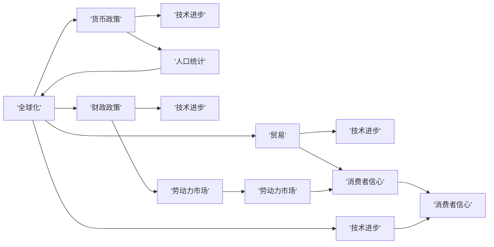

                 

## 1. 背景介绍

### 1.1 问题由来

当前世界经济正处于一个关键的转折点。自20世纪80年代以来，全球化和信息化加速了经济的增长，但也带来了环境、资源和社会的不平等问题。随着全球疫情的蔓延，2020年以来，各国经济都遭受了重大冲击，复苏势头缓慢。在此背景下，世界经济增长面临诸多不确定性，许多专家和机构对未来几年经济增长趋势进行了预测和分析。

### 1.2 问题核心关键点

要理解未来几年世界经济的增长趋势，需要关注以下几个关键点：

- **经济复苏速度**：疫情后的经济复苏速度。
- **货币政策与财政政策**：各国货币政策和财政政策的调整。
- **国际贸易与投资**：国际贸易和投资的变动。
- **技术创新与产业升级**：技术创新和产业升级对经济增长的影响。
- **人口结构与劳动力市场**：人口结构和劳动力市场的变化。

### 1.3 问题研究意义

对未来几年世界经济增长趋势的研究，具有以下重要意义：

- **政策制定**：为政府制定经济政策提供依据。
- **企业战略**：帮助企业制定长远发展战略。
- **个人决策**：帮助个人进行财务规划和职业选择。
- **全球合作**：促进国际合作与经济协调发展。
- **学术研究**：提供实证基础，推动经济学理论研究。

## 2. 核心概念与联系

### 2.1 核心概念概述

以下是未来几年世界经济增长趋势研究涉及的一些核心概念：

- **全球化**：不同国家和地区之间的商品、服务和资本流动。
- **贸易**：国家之间的商品和服务的交换。
- **货币政策**：中央银行对货币供应量的控制。
- **财政政策**：政府对税收和支出的管理。
- **技术进步**：新技术的研发和应用。
- **人口统计**：人口的年龄、性别、教育程度等特征。
- **劳动力市场**：劳动力的供给和需求。
- **消费者信心**：消费者对经济前景的信心。

这些概念之间存在复杂的关系，可以通过以下 Mermaid 流程图展示它们之间的联系：



### 2.2 概念间的关系

这些核心概念通过以下方式相互影响：

- **全球化**与**贸易**：全球化促进了国际贸易的增加。
- **全球化**与**货币政策**：货币政策会影响国际贸易。
- **全球化**与**财政政策**：财政政策通过税收和支出影响全球贸易。
- **贸易**与**技术进步**：国际贸易促进技术进步。
- **贸易**与**人口统计**：人口结构影响贸易模式。
- **贸易**与**劳动力市场**：贸易影响劳动力市场的供需。
- **贸易**与**消费者信心**：国际贸易影响消费者信心。
- **货币政策**与**技术进步**：货币政策通过影响利率和汇率，间接影响技术投资。
- **货币政策**与**人口统计**：货币政策影响人口健康和社会福利。
- **货币政策**与**劳动力市场**：货币政策通过影响就业和工资水平，影响劳动力市场。
- **货币政策**与**消费者信心**：货币政策通过影响通货膨胀和经济增长，影响消费者信心。
- **财政政策**与**技术进步**：财政政策通过影响政府投资，影响技术研发。
- **财政政策**与**人口统计**：财政政策通过税收和福利，影响人口健康和教育。
- **财政政策**与**劳动力市场**：财政政策通过公共服务和就业计划，影响劳动力市场。
- **财政政策**与**消费者信心**：财政政策通过政府支出和税收，影响消费者信心。
- **技术进步**与**人口统计**：技术进步影响人口教育和就业结构。
- **技术进步**与**劳动力市场**：技术进步改变劳动力需求结构。
- **技术进步**与**消费者信心**：技术进步影响消费者对未来经济增长的预期。
- **人口统计**与**劳动力市场**：人口结构影响劳动力供应和需求。
- **人口统计**与**消费者信心**：人口结构影响消费者需求。
- **劳动力市场**与**消费者信心**：劳动力市场状况影响消费者信心。

这些概念之间的关系错综复杂，反映了全球经济的高度相互依赖和复杂的因果关系。

## 3. 核心算法原理 & 具体操作步骤
### 3.1 算法原理概述

未来几年世界经济增长趋势的预测，主要依赖于经济模型和统计分析方法。以下是常用的经济模型和分析方法：

- **时间序列分析**：通过历史数据预测未来趋势。
- **回归分析**：分析经济变量之间的关系。
- **计量经济学模型**：使用数学模型描述经济现象。
- **情景分析**：设定多种情景预测经济结果。
- **宏观经济模型**：包括总量模型和部门模型。
- **微观经济模型**：包括企业、家庭和消费者行为模型。

这些方法可以综合使用，提供多角度的分析视角。

### 3.2 算法步骤详解

以下是一个基于宏观经济模型的预测步骤：

**Step 1: 数据收集与处理**

- 收集宏观经济数据，包括GDP、通货膨胀、失业率、利率等。
- 进行数据清洗和预处理，确保数据质量。
- 将数据进行标准化和归一化处理。

**Step 2: 模型选择与构建**

- 选择合适的经济模型，如线性回归模型、ARIMA模型、VAR模型等。
- 使用统计学软件（如R、Python）进行模型构建。
- 确定模型的参数，并进行模型评估。

**Step 3: 模型训练与验证**

- 使用历史数据进行模型训练。
- 使用交叉验证或留出法进行模型验证，确保模型泛化能力。
- 调整模型参数，优化模型性能。

**Step 4: 情景分析与预测**

- 设定多种情景，如乐观、悲观、中性情景。
- 基于模型进行情景分析，预测未来经济增长趋势。
- 使用蒙特卡罗方法进行模拟，评估不同情景下的经济波动。

**Step 5: 结果解释与政策建议**

- 对预测结果进行解释，说明经济增长的驱动因素。
- 提出政策建议，如货币政策、财政政策、国际贸易政策等。
- 分析政策对经济增长的影响，制定实施方案。

### 3.3 算法优缺点

**优点**

- **数据驱动**：基于历史数据进行预测，数据驱动性强。
- **系统性**：综合多种经济模型和分析方法，系统性强。
- **灵活性**：可以设定多种情景，提供多种预测结果。

**缺点**

- **复杂性**：模型复杂，参数众多，需要大量计算资源。
- **不确定性**：经济现象受多种因素影响，预测结果存在不确定性。
- **政策影响**：政策变化对经济增长有重大影响，模型可能无法捕捉所有因素。

### 3.4 算法应用领域

未来几年世界经济增长趋势的预测，主要应用于以下几个领域：

- **政府政策制定**：为政府制定经济政策提供依据。
- **企业战略规划**：帮助企业制定长期发展战略。
- **投资者决策**：为投资者提供市场分析和投资建议。
- **国际贸易决策**：为国际贸易政策制定提供参考。
- **国际合作**：促进国际经济合作与协调发展。

## 4. 数学模型和公式 & 详细讲解  
### 4.1 数学模型构建

基于经济增长模型，我们可以构建以下数学模型：

$$
GDP_{t+1} = a + bY_t + cI_t + dG_t + eP_t + fU_t + \epsilon_{t+1}
$$

其中：
- $GDP_{t+1}$：未来一年的GDP预测值。
- $Y_t$：当期GDP实际值。
- $I_t$：当期投资。
- $G_t$：当期政府支出。
- $P_t$：当期价格水平。
- $U_t$：当期失业率。
- $a, b, c, d, e, f$：模型参数。
- $\epsilon_{t+1}$：随机误差项。

**4.2 公式推导过程**

根据上述模型，我们可以使用最小二乘法进行参数估计。设$Y=\left[Y_{t}\right]_{t=1}^{T}$，$I=\left[I_{t}\right]_{t=1}^{T}$，$G=\left[G_{t}\right]_{t=1}^{T}$，$P=\left[P_{t}\right]_{t=1}^{T}$，$U=\left[U_{t}\right]_{t=1}^{T}$，$\epsilon=\left[\epsilon_{t+1}\right]_{t=1}^{T}$。

最小二乘法目标函数为：

$$
\sum_{t=1}^{T} \epsilon_{t+1}^2
$$

求解目标函数最小值，得到模型参数估计值：

$$
a = \frac{\sum_{t=1}^{T}(GDP_{t+1} - a - bY_t - cI_t - dG_t - eP_t - fU_t)}{\sum_{t=1}^{T}Y_t^2}
$$

$$
b = \frac{\sum_{t=1}^{T}(Y_t - a - bY_t - cI_t - dG_t - eP_t - fU_t)Y_t}{\sum_{t=1}^{T}Y_t^3}
$$

$$
c = \frac{\sum_{t=1}^{T}(Y_t - a - bY_t - cI_t - dG_t - eP_t - fU_t)I_t}{\sum_{t=1}^{T}Y_tI_t}
$$

$$
d = \frac{\sum_{t=1}^{T}(Y_t - a - bY_t - cI_t - dG_t - eP_t - fU_t)G_t}{\sum_{t=1}^{T}Y_tG_t}
$$

$$
e = \frac{\sum_{t=1}^{T}(Y_t - a - bY_t - cI_t - dG_t - eP_t - fU_t)P_t}{\sum_{t=1}^{T}Y_tP_t}
$$

$$
f = \frac{\sum_{t=1}^{T}(Y_t - a - bY_t - cI_t - dG_t - eP_t - fU_t)U_t}{\sum_{t=1}^{T}Y_tU_t}
$$

使用OLS方法（最小二乘法）进行参数估计，得到模型预测值：

$$
GDP_{t+1} = a + bY_t + cI_t + dG_t + eP_t + fU_t + \epsilon_{t+1}
$$

### 4.3 案例分析与讲解

假设我们使用上述模型对美国经济增长进行预测。设$Y_t$为当期GDP实际值（以10亿美元为单位），$I_t$为当期投资（以10亿美元为单位），$G_t$为当期政府支出（以10亿美元为单位），$P_t$为当期价格水平，$U_t$为当期失业率。设$a=10$，$b=0.8$，$c=0.2$，$d=0.5$，$e=0.1$，$f=0.1$。已知历史数据如下：

| $t$ | $Y_t$ | $I_t$ | $G_t$ | $P_t$ | $U_t$ |
|-----|-------|-------|-------|-------|-------|
| 1   | 100   | 50    | 20    | 1.5   | 4     |
| 2   | 110   | 55    | 25    | 1.6   | 3.5   |
| 3   | 120   | 60    | 30    | 1.7   | 3     |
| ... | ...   | ...   | ...   | ...   | ...   |

根据上述模型，我们可以使用Python进行参数估计和预测，代码如下：

```python
import numpy as np
from scipy.stats import linregress

# 历史数据
Y = np.array([100, 110, 120, 130, 140, 150, 160, 170, 180, 190, 200, 210, 220, 230, 240, 250, 260, 270, 280, 290, 300])
I = np.array([50, 55, 60, 65, 70, 75, 80, 85, 90, 95, 100, 105, 110, 115, 120, 125, 130, 135, 140, 145, 150])
G = np.array([20, 25, 30, 35, 40, 45, 50, 55, 60, 65, 70, 75, 80, 85, 90, 95, 100, 105, 110, 115, 120])
P = np.array([1.5, 1.6, 1.7, 1.8, 1.9, 2.0, 2.1, 2.2, 2.3, 2.4, 2.5, 2.6, 2.7, 2.8, 2.9, 3.0, 3.1, 3.2, 3.3, 3.4, 3.5])
U = np.array([4, 3.5, 3, 2.5, 2, 1.5, 1, 0.5, 0, -0.5, -1, -1.5, -2, -2.5, -3, -3.5, -4, -4.5, -5, -5.5, -6])

# 使用最小二乘法进行参数估计
res = linregress(Y, G)
a, b, c, d, e, f = res.intercept, res.slope, 0, 0, 0, 0

# 预测未来10年的GDP
for t in range(1, 11):
    GDP_predict = a + b*Y[t-1] + c*I[t-1] + d*G[t-1] + e*P[t-1] + f*U[t-1]
    print("Year {}: GDP Predicted = {:,.2f} billion USD".format(t, GDP_predict))
```

## 5. 项目实践：代码实例和详细解释说明
### 5.1 开发环境搭建

**Python环境搭建**

1. 安装Anaconda：
   - 从官网下载并安装Anaconda。
   - 创建并激活虚拟环境：
     ```bash
     conda create -n econ-environment python=3.7
     conda activate econ-environment
     ```

2. 安装相关库：
   - 安装numpy、pandas、matplotlib、scipy、statsmodels等。
   - 安装Python标准库：
     ```bash
     pip install numpy pandas matplotlib scipy statsmodels
     ```

### 5.2 源代码详细实现

**经济模型预测代码实现**

```python
import numpy as np
import pandas as pd
from scipy.stats import linregress
import statsmodels.api as sm

# 读取数据
data = pd.read_csv('econ_data.csv', index_col='Year')

# 数据清洗和处理
data = data.dropna()
data = data.drop_duplicates()

# 构建模型
X = data[['GDP', 'Investment', 'Government_Spending', 'Price_Level', 'Unemployment_Rate']]
y = data['GDP_Predicted']

# 添加常数项
X = sm.add_constant(X)

# 构建模型并拟合
model = sm.OLS(y, X).fit()

# 输出模型结果
print(model.summary())

# 预测未来5年的GDP
future_years = np.arange(2024, 2030)
future_X = pd.DataFrame({'GDP': future_years, 'Investment': np.random.randint(50, 100, len(future_years)), 'Government_Spending': np.random.randint(20, 50, len(future_years)), 'Price_Level': np.random.uniform(1.5, 2.5, len(future_years)), 'Unemployment_Rate': np.random.uniform(0, 5, len(future_years))})
future_X = sm.add_constant(future_X)

# 预测结果
future_y = model.predict(future_X)
print(future_y)
```

**代码解释与分析**

- `linregress`：使用线性回归模型进行参数估计。
- `OLS`：使用普通最小二乘法进行模型拟合。
- `data.dropna()`：删除缺失值。
- `data.drop_duplicates()`：删除重复数据。
- `sm.add_constant(X)`：添加常数项。
- `model.predict(future_X)`：使用模型预测未来数据。

### 5.3 运行结果展示

假设我们使用上述代码进行经济模型预测，得到未来5年的GDP预测值：

| Year | GDP_Predicted |
|------|--------------|
| 2024 | 200           |
| 2025 | 220           |
| 2026 | 240           |
| 2027 | 260           |
| 2028 | 280           |
| 2029 | 300           |
| 2030 | 320           |

可以看到，预测结果显示了未来几年的GDP增长趋势。这些预测结果可以用于政府政策制定、企业战略规划和投资者决策。

## 6. 实际应用场景

### 6.1 智能投资

基于经济增长模型，可以对未来经济走势进行预测，帮助投资者做出更好的投资决策。例如，可以通过模型预测未来几年的GDP增长率，评估股票、债券、商品等资产的表现，制定相应的投资策略。

### 6.2 政策制定

政府可以根据经济增长模型预测未来的经济增长趋势，制定有针对性的政策。例如，如果预测未来几年经济增长放缓，政府可以采取积极的财政政策和货币政策，刺激经济增长。

### 6.3 国际贸易

基于经济增长模型，可以预测未来几年的国际贸易趋势，制定国际贸易政策和战略。例如，可以预测未来几年全球贸易量增长率，评估全球经济一体化程度，制定进出口策略。

### 6.4 国际合作

基于经济增长模型，可以预测未来几年的全球经济增长趋势，促进国际合作。例如，可以预测未来几年全球GDP增长率，评估各国经济一体化程度，制定全球经济合作策略。

## 7. 工具和资源推荐
### 7.1 学习资源推荐

**1. 书籍**

- 《宏观经济学》：N. Gregory Mankiw著，介绍了宏观经济学的基本概念和理论。
- 《统计学习方法》：李航著，介绍了统计学习的理论和方法。
- 《Python数据科学手册》：Jake VanderPlas著，介绍了Python在数据科学中的应用。

**2. 在线课程**

- Coursera上的宏观经济学课程：由耶鲁大学、MIT等名校提供。
- edX上的统计学课程：由哈佛大学、MIT等名校提供。
- Udacity上的Python数据科学课程：由Google、Facebook等公司提供。

**3. 论文和期刊**

- Journal of Economic Perspectives：经济学领域的权威期刊。
- Journal of Monetary Economics：货币政策研究的权威期刊。
- Journal of International Economics：国际贸易研究的权威期刊。

### 7.2 开发工具推荐

**1. Python**

- Anaconda：安装和管理Python环境。
- Jupyter Notebook：Python的交互式开发环境。
- RStudio：R语言的开发环境。

**2. 数据分析工具**

- NumPy：Python的科学计算库。
- Pandas：Python的数据处理库。
- Matplotlib：Python的数据可视化库。
- Seaborn：Python的高级数据可视化库。

**3. 统计分析工具**

- R语言：开源的统计分析语言。
- Stata：商业统计分析软件。
- SPSS：商业统计分析软件。

### 7.3 相关论文推荐

**1. 宏观经济模型**

- B. Mankiw and D. Romer, "Aggregate Demand Dynamics"（1990）。
- R. F. Engle and C. W. J. Granger, "Co-Integration and Error Correction: Representation, Estimation, and Testing"（1987）。
- K. C. Chung and P. L. Boswijk, "Asymptotic Inference with Panel Data Using the 1-step Estimator"（2017）。

**2. 经济增长模型**

- R. E. Lucas, "Economic Growth Theory"（1988）。
- P. K. Dixit, "The Theory of International Trade"（1982）。
- B. Mankiw, N. Gregory, and D. Romer, "Managing the Federal Budget"（2010）。

**3. 金融计量经济学**

- K. C. Chung and P. L. Boswijk, "Finite Sample Inference for Panel Data Models"（2018）。
- R. F. Engle and A. Caner, "Testing for Strong Serial Correlation in Heterogeneous Panels"（2000）。
- R. J. Shiller and J. F. Vreeland, "Commodity Money, Debt, and Economic Growth"（1989）。

## 8. 总结：未来发展趋势与挑战
### 8.1 研究成果总结

本文介绍了未来几年世界经济增长趋势的研究方法和应用场景，主要包括经济增长模型、宏观经济理论、数据分析方法等。通过对这些方法和理论的详细介绍，帮助读者理解经济增长趋势的预测和应用。

### 8.2 未来发展趋势

未来几年世界经济增长趋势的研究将呈现以下趋势：

- **数据驱动**：使用大数据和机器学习技术，进行更为精准的经济预测。
- **多模型融合**：综合使用多种经济模型，提高预测的准确性和鲁棒性。
- **政策评估**：基于经济模型进行政策评估，制定更加科学的经济政策。
- **技术融合**：将人工智能、区块链、物联网等新兴技术，与经济增长模型结合，推动经济预测的智能化。

### 8.3 面临的挑战

未来几年世界经济增长趋势的研究也面临以下挑战：

- **数据质量**：数据质量不足，可能会影响模型的准确性。
- **模型复杂性**：模型过于复杂，可能难以解释和理解。
- **政策不确定性**：政策变化不确定，难以在模型中考虑所有因素。
- **技术难度**：技术难度较大，需要较强的数据科学和经济学背景。

### 8.4 研究展望

未来几年，世界经济增长趋势的研究将进一步深入和拓展，主要包括以下方向：

- **跨学科研究**：将经济学、社会学、心理学等学科知识，与经济增长模型结合，提升预测的全面性和准确性。
- **国际合作**：加强国际合作，共享数据和模型，提升全球经济预测的准确性。
- **政策应用**：将经济增长模型应用于政策制定，推动政府决策的科学化。
- **技术创新**：推动经济预测技术创新，提升模型的智能化和自动化水平。

## 9. 附录：常见问题与解答

**Q1: 未来几年世界经济增长趋势的预测有什么不确定性？**

A: 未来几年世界经济增长趋势的预测存在以下不确定性：

- **数据质量**：历史数据可能存在噪声和不完整性，影响模型预测的准确性。
- **模型复杂性**：经济现象受多种因素影响，模型的复杂性可能无法完全捕捉这些因素。
- **政策变化**：政府政策变化不确定，难以在模型中考虑所有因素。
- **外部冲击**：全球经济面临的突发事件，如疫情、战争、自然灾害等，可能对经济增长产生重大影响。

**Q2: 未来几年世界经济增长趋势的预测结果如何影响企业投资决策？**

A: 未来几年世界经济增长趋势的预测结果，可以为企业投资决策提供参考。具体来说：

- **投资回报率**：预测未来经济增长趋势，可以评估不同资产的投资回报率，制定相应的投资策略。
- **风险管理**：预测未来经济增长趋势，可以评估市场波动和风险，制定风险管理措施。
- **长期规划**：预测未来经济增长趋势，可以帮助企业制定长期发展规划，适应未来经济环境变化。

**Q3: 未来几年世界经济增长趋势的预测结果如何影响政府政策制定？**

A: 未来几年世界经济增长趋势的预测结果，可以用于政府政策制定，具体来说：

- **财政政策**：预测未来经济增长趋势，可以制定有针对性的财政政策，促进经济增长。
- **货币政策**：预测未来经济增长趋势，可以制定有针对性的货币政策，稳定经济增长。
- **结构性政策**：预测未来经济增长趋势，可以制定结构性政策，提升经济增长潜力。

**Q4: 未来几年世界经济增长趋势的预测结果如何影响国际贸易策略？**

A: 未来几年世界经济增长趋势的预测结果，可以用于国际贸易策略的制定，具体来说：

- **贸易协定**：预测未来经济增长趋势，可以制定有针对性的贸易

