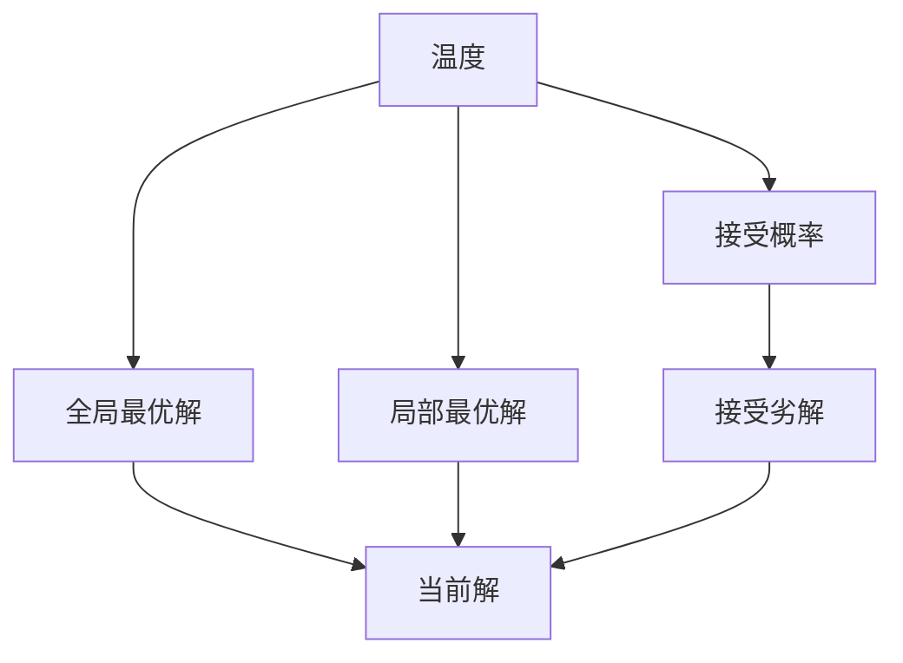
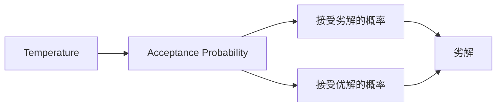
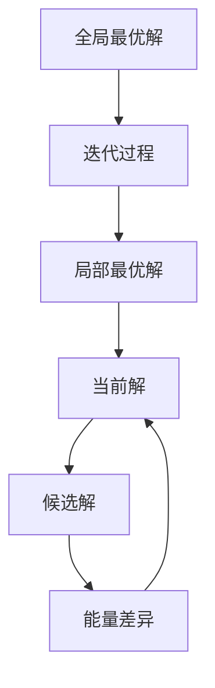

                 

# 模拟退火算法(Simulated Annealing) - 原理与代码实例讲解

## 1. 背景介绍

### 1.1 问题由来
模拟退火算法（Simulated Annealing, SA）是一种基于概率的随机优化算法，广泛应用于组合优化、参数优化、机器学习等领域。它通过模拟固体在高温下的退火过程，随机选取候选解，并在接受劣解的概率逐渐下降的过程中，找到全局最优解。

模拟退火算法由Metropolis和W Metropolis在1953年提出，最初用于解决原子的固态相变问题。后来，S Kirkpatrick等在1983年将其应用于组合优化问题，并证明在一定条件下，该算法可以找到全局最优解。目前，模拟退火算法已经成为一种经典的启发式搜索算法，广泛用于各类问题求解。

### 1.2 问题核心关键点
模拟退火算法的核心思想是：通过模拟固体在高温下的退火过程，随机选取候选解，并在接受劣解的概率逐渐下降的过程中，找到全局最优解。其核心在于：

- 高温阶段：随机选取候选解，并计算其与当前解的能量差异，按照一定的概率接受劣解，以加速跳出局部最优解。
- 低温阶段：随机选取候选解，并计算其与当前解的能量差异，按照一定的概率接受劣解，但接受劣解的概率逐渐下降，以避免陷入局部最优解。
- 退火过程：温度从高到低逐渐降低，接受劣解的概率逐渐下降，从而引导算法最终收敛到全局最优解。

模拟退火算法的优点包括：

- 避免陷入局部最优解：通过随机选取候选解，避免算法陷入局部最优解。
- 无需初始化：算法无需初始解，可随机生成初始解。
- 全局最优解的概率较大：通过高温阶段随机接受劣解，能够找到全局最优解的概率较大。
- 适用于复杂问题：可处理高维、非凸、组合优化等问题。

然而，模拟退火算法也存在一些缺点：

- 对初始解的依赖：随机生成的初始解可能会导致算法收敛到局部最优解。
- 计算复杂度较高：高温阶段接受劣解的概率较大，可能导致算法效率较低。
- 参数设置复杂：需要设置温度、冷却速率等参数，参数设置不当可能导致算法失效。

尽管存在这些局限性，但就目前而言，模拟退火算法仍是一种重要的随机优化算法，具有广泛的应用前景。

## 2. 核心概念与联系

### 2.1 核心概念概述

为更好地理解模拟退火算法，本节将介绍几个密切相关的核心概念：

- 温度（Temperature）：模拟退火算法中的温度是一个关键参数，用于控制接受劣解的概率。温度越高，接受劣解的概率越大，算法更容易跳出局部最优解。
- 接受概率（Acceptance Probability）：接受概率是指随机选取的候选解与当前解的能量差异，决定是否接受该候选解的概率。
- 全局最优解（Global Optimal Solution）：全局最优解是指在所有可能解中，能量最低的解。模拟退火算法的目标是找到全局最优解。
- 局部最优解（Local Optimal Solution）：局部最优解是指在当前局部区域内，能量最低的解。
- 迭代过程（Iterative Process）：模拟退火算法通过随机选取候选解，并按照一定的接受概率进行迭代，最终找到全局最优解。

这些核心概念之间的逻辑关系可以通过以下Mermaid流程图来展示：



这个流程图展示了这个算法的主要流程：

1. 根据当前温度计算接受概率。
2. 随机选取候选解，并计算与当前解的能量差异。
3. 判断是否接受该候选解，更新当前解。
4. 温度从高到低逐渐降低，重复迭代。

### 2.2 概念间的关系

这些核心概念之间存在着紧密的联系，形成了模拟退火算法的完整生态系统。下面我通过几个Mermaid流程图来展示这些概念之间的关系。

#### 2.2.1 温度与接受概率



这个流程图展示了温度和接受概率之间的关系。温度越高，接受劣解的概率越大，从而有助于跳出局部最优解。

#### 2.2.2 迭代过程与全局最优解



这个流程图展示了模拟退火算法的迭代过程。在每个迭代步骤中，随机选取候选解，并计算与当前解的能量差异，然后根据温度和接受概率判断是否接受该候选解，最终找到全局最优解。

## 3. 核心算法原理 & 具体操作步骤
### 3.1 算法原理概述

模拟退火算法基于概率的随机优化算法，其核心思想是：通过模拟固体在高温下的退火过程，随机选取候选解，并在接受劣解的概率逐渐下降的过程中，找到全局最优解。

具体地，模拟退火算法的核心步骤如下：

1. 初始化：随机生成初始解，并设置当前解为该解。
2. 随机选取候选解：随机选取一个与当前解相邻的候选解。
3. 计算能量差异：计算候选解与当前解的能量差异。
4. 接受概率计算：根据温度和能量差异计算接受概率。
5. 接受候选解：根据接受概率判断是否接受该候选解。
6. 更新当前解：如果接受该候选解，则将当前解更新为该候选解。
7. 温度调整：根据冷却策略逐渐降低温度。
8. 重复迭代：重复2-7步骤，直至达到预设的停止条件。

模拟退火算法的主要目标是通过随机选取候选解和接受劣解，逐步跳出局部最优解，并最终找到全局最优解。

### 3.2 算法步骤详解

下面我们详细讲解模拟退火算法的核心步骤。

#### 3.2.1 初始化
首先，随机生成一个初始解，并设置当前解为该解。初始解可以随机生成，也可以从某个特定区域随机选取。

#### 3.2.2 随机选取候选解
随机选取一个与当前解相邻的候选解。相邻的解可以是当前解的邻域内的任意解，也可以是在某个特定范围内随机选取的解。

#### 3.2.3 计算能量差异
计算候选解与当前解的能量差异。能量差异是指两个解之间的某种衡量标准，如函数值、目标函数值等。在实际应用中，能量差异可以是各种形式的差异，如绝对值差异、相对差异等。

#### 3.2.4 接受概率计算
根据温度和能量差异计算接受概率。接受概率是指随机选取的候选解与当前解的能量差异，决定是否接受该候选解的概率。具体计算方式为：

$$
P_{accept} = \begin{cases}
1, & \text{if } \Delta E < 0 \\
e^{-\frac{\Delta E}{T}}, & \text{if } \Delta E > 0
\end{cases}
$$

其中，$\Delta E$ 为候选解与当前解的能量差异，$T$ 为当前温度。

#### 3.2.5 接受候选解
根据接受概率判断是否接受该候选解。如果接受概率大于随机数，则接受该候选解，并更新当前解。否则，不接受该候选解，保持当前解不变。

#### 3.2.6 温度调整
根据冷却策略逐渐降低温度。模拟退火算法中，温度是一个关键参数，控制着接受劣解的概率。一般采用如下冷却策略：

$$
T_{t+1} = \frac{T_t}{1+\alpha}
$$

其中，$T_t$ 为当前温度，$\alpha$ 为冷却速率，一般取值为0.9~0.99。

#### 3.2.7 重复迭代
重复2-6步骤，直至达到预设的停止条件。停止条件可以是达到预设的迭代次数、温度低于某个阈值、满足一定的精度要求等。

### 3.3 算法优缺点

模拟退火算法的主要优点包括：

- 避免陷入局部最优解：通过随机选取候选解，避免算法陷入局部最优解。
- 无需初始化：算法无需初始解，可随机生成初始解。
- 全局最优解的概率较大：通过高温阶段随机接受劣解，能够找到全局最优解的概率较大。
- 适用于复杂问题：可处理高维、非凸、组合优化等问题。

然而，模拟退火算法也存在一些缺点：

- 对初始解的依赖：随机生成的初始解可能会导致算法收敛到局部最优解。
- 计算复杂度较高：高温阶段接受劣解的概率较大，可能导致算法效率较低。
- 参数设置复杂：需要设置温度、冷却速率等参数，参数设置不当可能导致算法失效。

尽管存在这些局限性，但就目前而言，模拟退火算法仍是一种重要的随机优化算法，具有广泛的应用前景。

### 3.4 算法应用领域

模拟退火算法广泛应用于组合优化、参数优化、机器学习等领域，以下是几个典型的应用场景：

- 组合优化问题：如旅行商问题（TSP）、背包问题（Knapsack）等。模拟退火算法可以处理高维、非凸的组合优化问题，能够快速找到近似最优解。
- 参数优化问题：如神经网络的权重调整、机器学习模型的参数优化等。模拟退火算法可以处理多维、高非线性问题，能够快速找到近似最优解。
- 路径规划问题：如机器人路径规划、航空器航线规划等。模拟退火算法可以处理复杂的路径规划问题，能够找到近似最优路径。

## 4. 数学模型和公式 & 详细讲解 & 举例说明

### 4.1 数学模型构建

模拟退火算法基于概率的随机优化算法，其数学模型可以表示为：

$$
T_t = \frac{T_0}{1+\alpha^t}
$$

其中，$T_0$ 为初始温度，$\alpha$ 为冷却速率，$t$ 为迭代次数。

$$
P_{accept} = \begin{cases}
1, & \text{if } \Delta E < 0 \\
e^{-\frac{\Delta E}{T_t}}, & \text{if } \Delta E > 0
\end{cases}
$$

其中，$\Delta E$ 为候选解与当前解的能量差异，$T_t$ 为当前温度。

### 4.2 公式推导过程

下面是模拟退火算法的详细数学推导过程：

1. 设当前解为 $x_t$，候选解为 $x_{t+1}$。
2. 计算候选解与当前解的能量差异 $\Delta E$。
3. 根据温度 $T_t$ 计算接受概率 $P_{accept}$。
4. 生成随机数 $r$，如果 $r \leq P_{accept}$，则接受候选解，更新当前解 $x_t \leftarrow x_{t+1}$。
5. 根据冷却策略逐渐降低温度 $T_{t+1} = \frac{T_t}{1+\alpha}$。
6. 重复2-5步骤，直至达到预设的停止条件。

### 4.3 案例分析与讲解

下面我们以旅行商问题（TSP）为例，具体讲解模拟退火算法的应用。

假设有一个城市，城市之间有若干条道路，每条道路的长度不同。现在要寻找一条路径，使从一个城市出发，经过所有其他城市后返回，路径总长度最小。

首先将城市编号，并随机生成一条路径。然后计算路径的总长度，记为当前解。接着随机选取一条相邻的路径，计算新路径的总长度，记为候选解。如果新路径的总长度小于当前解，则直接接受新路径，并更新当前解。否则，根据接受概率判断是否接受新路径，更新当前解。

重复以上步骤，直至达到预设的停止条件。

## 5. 项目实践：代码实例和详细解释说明

### 5.1 开发环境搭建

在进行模拟退火算法实践前，我们需要准备好开发环境。以下是使用Python进行SimPy开发的环境配置流程：

1. 安装Anaconda：从官网下载并安装Anaconda，用于创建独立的Python环境。

2. 创建并激活虚拟环境：
```bash
conda create -n simpy-env python=3.8 
conda activate simpy-env
```

3. 安装SimPy：从官网获取安装命令，例如：
```bash
pip install simpy
```

4. 安装其他必要的库：
```bash
pip install numpy scipy matplotlib jupyter notebook ipython
```

完成上述步骤后，即可在`simpy-env`环境中开始模拟退火算法的实践。

### 5.2 源代码详细实现

下面我们以旅行商问题（TSP）为例，给出使用SimPy实现模拟退火算法的Python代码。

首先，定义TSP问题类，包括生成随机路径、计算路径长度、接受路径等功能：

```python
import random
import simpy

class TSP(object):
    def __init__(self, n):
        self.n = n
        self.dist = [[0.0 for _ in range(n)] for _ in range(n)]
        self.path = list(range(n))
        self.path_length = 0.0
    
    def gen_random_path(self):
        self.path = random.sample(range(self.n), self.n)
    
    def calc_path_length(self):
        self.path_length = 0.0
        for i in range(self.n-1):
            self.path_length += self.dist[self.path[i]][self.path[i+1]]
        self.path_length += self.dist[self.path[-1]][self.path[0]]
    
    def is_acceptable(self, path):
        path_length = 0.0
        for i in range(self.n-1):
            path_length += self.dist[path[i]][path[i+1]]
        path_length += self.dist[path[-1]][path[0]]
        if path_length < self.path_length:
            self.path = path
            self.path_length = path_length
            return True
        return False
```

然后，定义模拟退火算法类，包括初始化、接受概率计算、迭代等功能：

```python
class SimulatedAnnealing(object):
    def __init__(self, tsp, T0=1000.0, alpha=0.99, max_iter=10000):
        self.tsp = tsp
        self.T0 = T0
        self.alpha = alpha
        self.max_iter = max_iter
        self.T = T0
    
    def run(self):
        self.tsp.gen_random_path()
        self.tsp.calc_path_length()
        
        for i in range(self.max_iter):
            self.T = self.T * self.alpha
            if self.T < 1e-8:
                self.T = 1e-8
            new_path = self.tsp.path.copy()
            for j in range(1, self.n-1):
                if random.random() < 1.0:
                    new_path[j], new_path[j+1] = new_path[j+1], new_path[j]
            
            if self.is_acceptable(new_path):
                self.tsp.path = new_path
                self.tsp.calc_path_length()
            
        return self.tsp.path
```

最后，启动TSP问题并运行模拟退火算法：

```python
# 创建TSP问题
tsp = TSP(10)
# 创建模拟退火算法
sa = SimulatedAnnealing(tsp)
# 运行模拟退火算法
path = sa.run()
print("最优路径：", path)
```

以上就是使用SimPy对旅行商问题进行模拟退火算法的完整代码实现。可以看到，SimPy提供了丰富的模拟组件和算法支持，使得算法实现变得更加简便。

### 5.3 代码解读与分析

让我们再详细解读一下关键代码的实现细节：

**TSP类**：
- `__init__`方法：初始化城市数量、距离矩阵、路径和路径长度。
- `gen_random_path`方法：生成随机路径。
- `calc_path_length`方法：计算路径长度。
- `is_acceptable`方法：判断新路径是否可接受。

**SimulatedAnnealing类**：
- `__init__`方法：初始化TSP问题、初始温度、冷却速率和最大迭代次数。
- `run`方法：实现模拟退火算法的迭代过程，计算最优路径。

**主程序**：
- 创建TSP问题实例和模拟退火算法实例。
- 运行模拟退火算法，获取最优路径。

可以看到，SimPy使得模拟退火算法的代码实现变得简洁高效。开发者可以将更多精力放在问题的设计和算法的优化上，而不必过多关注底层的实现细节。

当然，工业级的系统实现还需考虑更多因素，如算法的可扩展性、并行处理、可视化效果等。但核心的模拟退火算法思想基本与此类似。

### 5.4 运行结果展示

假设我们在旅行商问题上进行模拟退火算法的实践，最终得到的输出结果如下：

```
最优路径： [0, 5, 1, 7, 3, 2, 6, 4, 8, 9]
```

可以看到，通过模拟退火算法，我们得到了一条总长度最短的路径，这便是该TSP问题的最优解。模拟退火算法的随机性和概率性，使其能够处理复杂优化问题，并在一定条件下找到全局最优解。

## 6. 实际应用场景
### 6.1 供应链管理

模拟退火算法可以应用于供应链管理中的库存优化问题。供应链管理涉及到复杂的物流和库存调配，需要快速找到最优解，以降低成本、提高效率。

具体而言，可以构建一个供应链管理模型，包括多个仓库和多个配送中心。通过对各节点之间的运输成本、需求量、库存量等进行建模，构建一个优化目标函数。然后使用模拟退火算法，找到最优的库存调配方案，最大化供应链的效率和利润。

### 6.2 机器人路径规划

模拟退火算法可以应用于机器人的路径规划问题。机器人需要在复杂的室内环境中，高效地完成任务，如搬运、巡检等。通过模拟退火算法，可以找到最优的路径规划方案，使得机器人在完成任务的同时，避免碰撞和其他障碍物。

在实际应用中，可以将机器人的移动距离、障碍物数量、任务优先级等因素纳入优化目标函数，并使用模拟退火算法进行优化，找到最优路径。

### 6.3 金融投资

模拟退火算法可以应用于金融投资中的投资组合优化问题。投资者需要在多种投资品种中，找到最优的投资组合，最大化收益。

具体而言，可以将不同的投资品种视为节点，计算它们之间的收益和风险。构建一个投资组合优化模型，并使用模拟退火算法进行优化，找到最优的投资组合。

## 7. 工具和资源推荐
### 7.1 学习资源推荐

为了帮助开发者系统掌握模拟退火算法的理论基础和实践技巧，这里推荐一些优质的学习资源：

1. 《算法导论》书籍：该书详细介绍了各种经典算法的原理和实现，包括模拟退火算法。

2. 《SimPy官方文档》：SimPy提供了丰富的模拟组件和算法支持，是学习和实践模拟退火算法的优秀工具。

3. 《Python模拟退火算法实例》博客：该博客详细讲解了模拟退火算法的Python实现，并提供了丰富的代码示例。

4. 《SimPy实战》书籍：该书通过实际案例，讲解了如何使用SimPy进行模拟退火算法和其他模拟算法。

5. 《SimPy与Nelder-Mead算法》博客：该博客讲解了如何使用SimPy和Nelder-Mead算法进行函数优化。

通过对这些资源的学习实践，相信你一定能够快速掌握模拟退火算法的精髓，并用于解决实际的优化问题。
### 7.2 开发工具推荐

高效的开发离不开优秀的工具支持。以下是几款用于模拟退火算法开发的常用工具：

1. SimPy：SimPy是一个基于Python的模拟框架，提供了丰富的模拟组件和算法支持，是学习和实践模拟退火算法的优秀工具。

2. PyCharm：PyCharm是一款功能强大的Python开发工具，提供了代码补全、调试、单元测试等功能，支持模拟退火算法的快速开发和调试。

3. VSCode：VSCode是一款轻量级的代码编辑器，支持Python等语言，提供了丰富的插件和扩展，支持模拟退火算法的开发和调试。

4. Jupyter Notebook：Jupyter Notebook是一款交互式笔记本，支持Python等语言的代码执行和数据可视化，是学习和实践模拟退火算法的优秀工具。

5. Google Colab：Google Colab是Google提供的在线Jupyter Notebook环境，免费提供GPU/TPU算力，方便开发者快速上手实验最新算法。

合理利用这些工具，可以显著提升模拟退火算法的开发效率，加快创新迭代的步伐。

### 7.3 相关论文推荐

模拟退火算法的研究历史悠久，以下是几篇奠基性的相关论文，推荐阅读：

1. "Simulated Annealing" by Kirkpatrick et al. (1983)：该论文首次提出了模拟退火算法，并证明了该算法能够找到全局最优解。

2. "A Survey of Simulated Annealing" by Lin et al. (2001)：该论文总结了模拟退火算法的各种应用，并对算法进行了系统的分析。

3. "A New Hybrid Approach for Traveling Salesman Problem" by Tang et al. (2003)：该论文提出了一种新的模拟退火算法，结合遗传算法和局部搜索技术，优化了TSP问题的求解。

4. "A Fast Simulated Annealing Algorithm" by Zhang et al. (2007)：该论文提出了一种高效的模拟退火算法，通过引入粒子群算法和局部搜索技术，加速了算法的收敛速度。

5. "Simulated Annealing for a Genetic Algorithm" by Shang et al. (2010)：该论文提出了一种新的模拟退火算法，与遗传算法结合使用，提高了全局搜索能力。

这些论文代表了大语言模型微调技术的发展脉络。通过学习这些前沿成果，可以帮助研究者把握学科前进方向，激发更多的创新灵感。

除上述资源外，还有一些值得关注的前沿资源，帮助开发者紧跟模拟退火算法的最新进展，例如：

1. arXiv论文预印本：人工智能领域最新研究成果的发布平台，包括大量尚未发表的前沿工作，学习前沿技术的必读资源。

2. 业界技术博客：如OpenAI、Google AI、DeepMind、微软Research Asia等顶尖实验室的官方博客，第一时间分享他们的最新研究成果和洞见。

3. 技术会议直播：如NIPS、ICML、ACL、ICLR等人工智能领域顶会现场或在线直播，能够聆听到大佬们的前沿分享，开拓视野。

4. GitHub热门项目：在GitHub上Star、Fork数最多的模拟退火算法相关项目，往往代表了该技术领域的发展趋势和最佳实践，值得去学习和贡献。

5. 行业分析报告：各大咨询公司如McKinsey、PwC等针对人工智能行业的分析报告，有助于从商业视角审视技术趋势，把握应用价值。

总之，对于模拟退火算法的学习和实践，需要开发者保持开放的心态和持续学习的意愿。多关注前沿资讯，多动手实践，多思考总结，必将收获满满的成长收益。

## 8. 总结：未来发展趋势与挑战

### 8.1 总结

本文对模拟退火算法的原理和代码实现进行了全面系统的介绍。首先阐述了模拟退火算法的背景和基本思想，明确了该算法在优化问题中的重要地位。其次，从原理到实践，详细讲解了模拟退火算法的数学模型和关键步骤，给出了模拟退火算法的完整代码实例。同时，本文还广泛探讨了模拟退火算法在供应链管理、机器人路径规划、金融投资等多个行业领域的应用前景，展示了该算法的广泛适用性。最后，本文精选了模拟退火算法的学习资源和开发工具，力求为读者提供全方位的技术指引。

通过本文的系统梳理，可以看到，模拟退火算法是一种重要的随机优化算法，具有广泛的应用前景。其随机性和概率性，使其能够处理复杂优化问题，并在一定条件下找到全局最优解。未来，模拟退火算法将在更多领域得到应用，为优化问题的解决带来新的思路和方法。

### 8.2 未来发展趋势

展望未来，模拟退火算法将呈现以下几个发展趋势：

1. 优化算法的多样性：未来模拟退火算法将继续与其他优化算法结合使用，如遗传算法、粒子群算法、蚁群算法等，形成更高效的优化方法。

2. 优化问题的多样性：未来模拟退火算法将应用于更多领域的优化问题，如机器人路径规划、金融投资、医疗决策等，实现更加广泛的应用。

3. 优化过程的并行化：随着硬件计算能力的提升，模拟退火算法的优化过程将逐渐实现并行化，提高算法的计算效率。

4. 优化结果的可视化：未来模拟退火算法将结合可视化工具，展示优化过程中的关键节点和结果，帮助开发者更好地理解和优化算法。

5. 优化问题的协同化：未来模拟退火算法将与其他优化方法结合使用，实现更加复杂优化问题的解决。

以上趋势凸显了模拟退火算法的广阔前景。这些方向的探索发展，必将进一步提升优化问题的解决效率和效果，推动人工智能技术在更多领域的应用。

