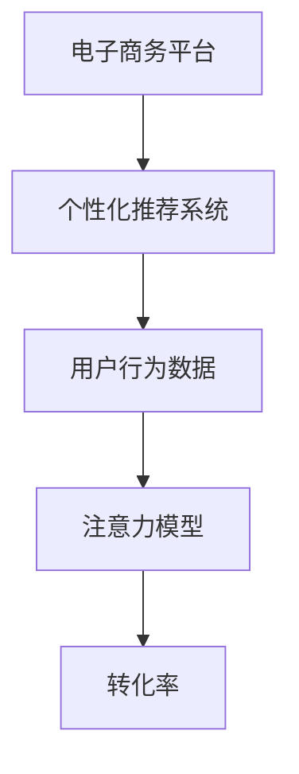
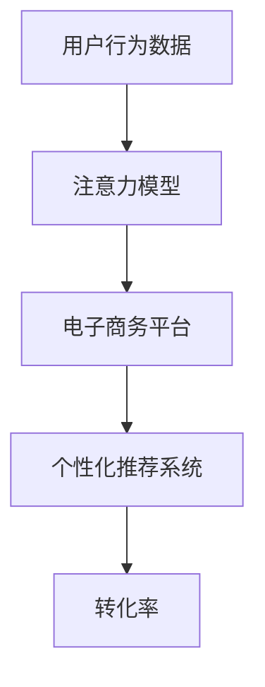
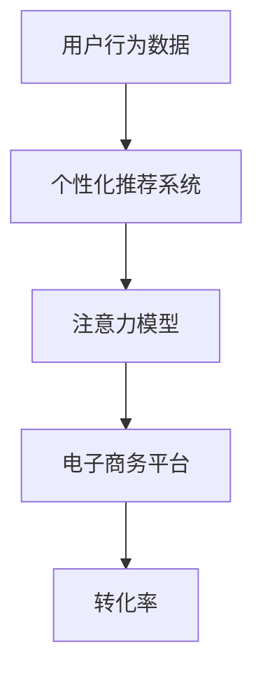
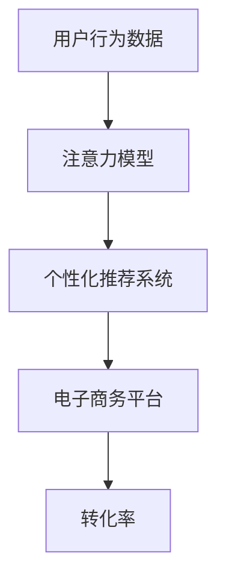

                 

# 注意力经济与个人购物习惯的变化

在数字化时代，注意力已成为一种稀缺资源，而在信息过载的背景下，如何吸引和维持用户的注意力成为了各类平台和产品的核心竞争力。本文聚焦于注意力经济在电子商务领域的应用，探讨了其对个人购物习惯产生的影响，以及如何利用注意力模型提升用户体验和转化率。我们将从背景介绍、核心概念、算法原理、具体实现、应用场景等方面，系统地剖析这一主题，并展望未来的发展趋势与挑战。

## 1. 背景介绍

### 1.1 问题由来

电子商务的蓬勃发展，带来了前所未有的消费者购物体验。随着技术的进步，电商平台开始利用数据分析、机器学习等技术手段，精准推荐商品，提升用户体验和销售转化率。与此同时，注意力经济理论应运而生，它指出在信息丰富的互联网时代，用户的注意力成为一种有价值的资源，而如何吸引并保持用户的注意力，是平台和产品成功的关键。

当前，注意力经济在电子商务中的应用，主要体现在个性化推荐系统、用户行为分析、广告投放优化等方面。这些应用显著提升了用户的购物体验，但同时也带来了数据隐私、算法公平性、用户粘性等问题。

### 1.2 问题核心关键点

注意力经济的核心在于利用用户行为数据，挖掘用户的兴趣和偏好，从而进行精准的商品推荐和广告投放。其关键点包括：

- 用户行为数据的收集和分析：通过点击、浏览、购买等行为数据，了解用户的消费偏好和兴趣。
- 注意力模型的构建与训练：利用机器学习算法，训练用户注意力模型，预测用户对商品的关注程度。
- 个性化推荐与广告投放：基于注意力模型，对用户进行个性化的商品推荐和精准的广告投放，提升转化率。

这些关键点共同构成了注意力经济在电子商务中的应用框架，其效果直接关系到平台的商业价值和用户的购物体验。

### 1.3 问题研究意义

注意力经济在电子商务中的应用，具有重要的研究意义：

- 提升用户体验：通过精准的个性化推荐和广告投放，提升用户的购物体验，增加满意度。
- 优化营销效果：基于用户注意力模型，进行更精准的营销，提高广告投放的ROI。
- 促进用户粘性：通过持续的个性化服务和互动，增强用户对平台的粘性，增加用户的重复购买率。
- 数据驱动决策：通过数据分析，帮助平台决策者制定更有效的营销策略，优化运营流程。
- 解决信息过载：利用注意力经济，帮助用户在海量信息中筛选出最有价值的内容，提升决策效率。

## 2. 核心概念与联系

### 2.1 核心概念概述

为更好地理解注意力经济在电子商务中的应用，本节将介绍几个密切相关的核心概念：

- 电子商务平台：指利用互联网技术和设施，通过电子方式进行商品交易的在线商业平台。
- 个性化推荐系统：利用用户行为数据和算法，为用户推荐个性化商品和服务的系统。
- 用户行为数据：指用户在平台上的浏览、点击、购买等行为数据。
- 注意力模型：通过机器学习算法构建的用户注意力预测模型，用于预测用户对商品的关注程度。
- 转化率：指用户在完成推荐后进行购买的比例，是衡量推荐系统效果的重要指标。

这些核心概念之间的逻辑关系可以通过以下Mermaid流程图来展示：



这个流程图展示了大语言模型微调过程中各个核心概念之间的关系：

1. 电子商务平台通过个性化推荐系统向用户推荐商品。
2. 个性化推荐系统依赖于用户行为数据。
3. 注意力模型是用户行为数据的解析器，用于预测用户的关注程度。
4. 转化率是衡量推荐系统效果的关键指标。

### 2.2 概念间的关系

这些核心概念之间存在着紧密的联系，形成了注意力经济在电子商务中的应用生态系统。下面我们通过几个Mermaid流程图来展示这些概念之间的关系。

#### 2.2.1 电子商务平台的应用场景


这个流程图展示了电子商务平台的应用场景，即利用用户行为数据，通过个性化推荐系统向用户推荐商品，并利用注意力模型预测用户对商品的关注程度，最终提升转化率。

#### 2.2.2 注意力模型的构建与训练



这个流程图展示了注意力模型的构建与训练过程，即利用用户行为数据，构建和训练注意力模型，并应用于电子商务平台上的个性化推荐系统，最终提升转化率。

#### 2.2.3 注意力模型的应用



这个流程图展示了注意力模型的应用场景，即在电子商务平台上，通过个性化推荐系统利用注意力模型预测用户对商品的关注程度，提升转化率。

### 2.3 核心概念的整体架构

最后，我们用一个综合的流程图来展示这些核心概念在大语言模型微调过程中的整体架构：



这个综合流程图展示了从用户行为数据到最终转化率的完整过程，即利用注意力模型构建和训练个性化推荐系统，从而提升电子商务平台的转化率。

## 3. 核心算法原理 & 具体操作步骤

### 3.1 算法原理概述

注意力经济在电子商务中的应用，主要基于用户行为数据，利用注意力模型进行个性化推荐和广告投放。其核心算法原理包括以下几个步骤：

1. **用户行为数据的收集与预处理**：收集用户在平台上的行为数据，如点击、浏览、购买记录等，并进行数据清洗和预处理。
2. **用户兴趣建模**：利用机器学习算法，从用户行为数据中挖掘出用户的兴趣和偏好，构建用户兴趣模型。
3. **商品特征提取**：从商品的属性、标签、评价等数据中提取商品的特征，构建商品特征向量。
4. **注意力模型的构建与训练**：利用注意力模型，预测用户对商品的关注程度，训练出精确的注意力模型。
5. **个性化推荐与广告投放**：基于注意力模型，进行个性化推荐和精准的广告投放，提升转化率。

### 3.2 算法步骤详解

以下将详细讲解基于注意力经济在电子商务中应用的各个关键步骤。

#### 3.2.1 用户行为数据的收集与预处理

用户行为数据的收集与预处理是构建注意力模型的第一步。主要步骤如下：

1. **数据收集**：利用API接口或爬虫技术，从电商平台收集用户的行为数据，包括点击、浏览、购买等行为数据。
2. **数据清洗**：去除数据中的噪声和异常值，确保数据的准确性和完整性。
3. **特征提取**：对行为数据进行特征提取，如用户ID、商品ID、时间戳、点击位置等，作为模型输入。

#### 3.2.2 用户兴趣建模

用户兴趣建模是注意力经济的核心步骤之一，主要通过机器学习算法，从用户行为数据中挖掘出用户的兴趣和偏好。主要步骤如下：

1. **特征工程**：对用户行为数据进行特征工程，如时间戳、点击位置、点击次数等。
2. **模型训练**：利用机器学习算法（如协同过滤、决策树、随机森林等），训练用户兴趣模型，预测用户对商品的兴趣程度。
3. **兴趣向量构建**：将用户兴趣模型转化为用户兴趣向量，作为注意力模型的一部分。

#### 3.2.3 商品特征提取

商品特征提取是注意力模型构建的关键步骤之一，主要通过从商品的属性、标签、评价等数据中提取商品的特征，构建商品特征向量。主要步骤如下：

1. **特征选择**：选择与用户行为相关的商品属性和特征，如商品类别、品牌、价格、评价等。
2. **特征编码**：将商品特征转化为数值向量，如利用one-hot编码、TF-IDF等方法。
3. **特征组合**：将商品特征向量进行组合，生成商品特征向量，作为注意力模型的一部分。

#### 3.2.4 注意力模型的构建与训练

注意力模型的构建与训练是注意力经济在电子商务中的核心步骤之一。主要步骤如下：

1. **模型选择**：选择适合的注意力模型，如深度神经网络、协同过滤等。
2. **模型训练**：利用用户行为数据和商品特征向量，训练注意力模型，预测用户对商品的关注程度。
3. **模型优化**：通过交叉验证等方法，优化注意力模型的参数，提升模型的准确性和鲁棒性。

#### 3.2.5 个性化推荐与广告投放

个性化推荐与广告投放是注意力经济在电子商务中的最终应用，主要通过注意力模型进行个性化推荐和精准的广告投放，提升转化率。主要步骤如下：

1. **推荐计算**：利用注意力模型，计算用户对商品的关注程度，生成个性化推荐列表。
2. **广告投放**：利用广告投放算法，将推荐列表中的商品进行精准投放，提升转化率。
3. **效果评估**：对推荐和广告投放的效果进行评估，根据评估结果调整模型参数和算法策略。

### 3.3 算法优缺点

注意力经济在电子商务中的应用，具有以下优点：

1. **提升用户体验**：通过精准的个性化推荐和广告投放，提升用户的购物体验，增加满意度。
2. **优化营销效果**：基于用户注意力模型，进行更精准的营销，提高广告投放的ROI。
3. **促进用户粘性**：通过持续的个性化服务和互动，增强用户对平台的粘性，增加用户的重复购买率。
4. **数据驱动决策**：通过数据分析，帮助平台决策者制定更有效的营销策略，优化运营流程。
5. **解决信息过载**：利用注意力经济，帮助用户在海量信息中筛选出最有价值的内容，提升决策效率。

但同时也存在一些缺点：

1. **数据隐私问题**：用户行为数据涉及个人隐私，收集和处理时需要遵守相关法律法规。
2. **算法公平性问题**：注意力经济模型可能存在偏见，影响部分用户群体的公平性。
3. **用户粘性问题**：过度个性化的推荐和广告，可能使用户对平台产生依赖，降低平台的用户粘性。
4. **技术复杂性问题**：注意力经济涉及复杂的机器学习算法和模型构建，需要高水平的技术人才和资源。

### 3.4 算法应用领域

注意力经济在电子商务中的应用，主要涉及以下几个领域：

1. **个性化推荐系统**：利用用户行为数据和注意力模型，为用户推荐个性化商品和服务。
2. **广告投放优化**：基于用户注意力模型，进行精准的广告投放，提升广告效果和转化率。
3. **用户行为分析**：通过分析用户行为数据，了解用户兴趣和偏好，提升用户体验。
4. **智能客服**：利用注意力经济，构建智能客服系统，提升客服效率和用户满意度。
5. **智能运营**：通过数据分析和注意力模型，优化电商平台的运营流程，提升运营效率。

这些应用领域展示了注意力经济在电子商务中的广泛应用，其效果直接关系到平台的商业价值和用户的购物体验。

## 4. 数学模型和公式 & 详细讲解 & 举例说明

### 4.1 数学模型构建

注意力经济在电子商务中的应用，主要基于用户行为数据，利用注意力模型进行个性化推荐和广告投放。其数学模型主要包括以下几个组成部分：

1. **用户兴趣模型**：利用协同过滤、决策树、随机森林等算法，从用户行为数据中挖掘出用户的兴趣和偏好。
2. **商品特征向量**：从商品的属性、标签、评价等数据中提取商品的特征，构建商品特征向量。
3. **注意力模型**：利用深度神经网络等模型，预测用户对商品的关注程度。

### 4.2 公式推导过程

以下将详细讲解基于注意力经济在电子商务中应用的数学模型推导过程。

#### 4.2.1 用户兴趣模型的推导

用户兴趣模型主要通过协同过滤、决策树、随机森林等算法，从用户行为数据中挖掘出用户的兴趣和偏好。其数学模型如下：

$$
\hat{I}_u = \alpha_u + \sum_{i=1}^n \beta_i \cdot I_{ui} + \sum_{j=1}^m \gamma_j \cdot F_{uj}
$$

其中，$I_{ui}$表示用户$u$对商品$i$的兴趣评分，$F_{uj}$表示用户$u$的兴趣向量，$\alpha_u$、$\beta_i$、$\gamma_j$为模型参数，需要通过训练确定。

#### 4.2.2 商品特征向量的推导

商品特征向量主要通过one-hot编码、TF-IDF等方法，从商品的属性、标签、评价等数据中提取商品的特征。其数学模型如下：

$$
F_{ij} = \sum_{k=1}^K \theta_k \cdot V_{ik} \cdot D_{kj}
$$

其中，$V_{ik}$表示商品$i$的第$k$个特征，$D_{kj}$表示特征$k$对商品$j$的权重，$\theta_k$为模型参数，需要通过训练确定。

#### 4.2.3 注意力模型的推导

注意力模型主要利用深度神经网络等模型，预测用户对商品的关注程度。其数学模型如下：

$$
A_{iu} = softmax(\eta_u + \phi_u + \psi_i \cdot F_{ij})
$$

其中，$A_{iu}$表示用户$u$对商品$i$的关注程度，$\eta_u$表示用户$u$的注意力向量，$\phi_u$和$\psi_i$为模型参数，需要通过训练确定。

### 4.3 案例分析与讲解

以下是基于注意力经济在电子商务中的应用案例分析与讲解。

#### 4.3.1 案例一：个性化推荐系统

某电商平台利用注意力经济，构建个性化推荐系统，提升用户购物体验。具体步骤如下：

1. **数据收集**：利用API接口收集用户的行为数据，如点击、浏览、购买等行为数据。
2. **数据清洗**：去除数据中的噪声和异常值，确保数据的准确性和完整性。
3. **特征提取**：对行为数据进行特征提取，如用户ID、商品ID、时间戳、点击位置等，作为模型输入。
4. **用户兴趣建模**：利用协同过滤算法，从用户行为数据中挖掘出用户的兴趣和偏好，构建用户兴趣模型。
5. **商品特征提取**：从商品的属性、标签、评价等数据中提取商品的特征，构建商品特征向量。
6. **注意力模型构建与训练**：利用深度神经网络等模型，预测用户对商品的关注程度，训练出精确的注意力模型。
7. **个性化推荐计算**：利用注意力模型，计算用户对商品的关注程度，生成个性化推荐列表。
8. **推荐效果评估**：对推荐效果进行评估，根据评估结果调整模型参数和算法策略。

#### 4.3.2 案例二：广告投放优化

某电商平台利用注意力经济，进行广告投放优化，提升广告效果和转化率。具体步骤如下：

1. **数据收集**：利用API接口收集用户的广告点击数据。
2. **数据清洗**：去除数据中的噪声和异常值，确保数据的准确性和完整性。
3. **特征提取**：对广告点击数据进行特征提取，如广告ID、用户ID、点击位置等，作为模型输入。
4. **用户兴趣建模**：利用决策树算法，从广告点击数据中挖掘出用户的兴趣和偏好，构建用户兴趣模型。
5. **商品特征提取**：从商品的属性、标签、评价等数据中提取商品的特征，构建商品特征向量。
6. **注意力模型构建与训练**：利用深度神经网络等模型，预测用户对广告的关注程度，训练出精确的注意力模型。
7. **广告投放计算**：利用注意力模型，计算用户对广告的关注程度，生成广告投放策略。
8. **广告效果评估**：对广告效果进行评估，根据评估结果调整模型参数和算法策略。

## 5. 项目实践：代码实例和详细解释说明

### 5.1 开发环境搭建

在进行注意力经济在电子商务中的应用开发时，我们需要准备好开发环境。以下是使用Python进行TensorFlow开发的环境配置流程：

1. 安装Anaconda：从官网下载并安装Anaconda，用于创建独立的Python环境。

2. 创建并激活虚拟环境：
```bash
conda create -n attention-env python=3.8 
conda activate attention-env
```

3. 安装TensorFlow：根据CUDA版本，从官网获取对应的安装命令。例如：
```bash
conda install tensorflow tensorflow-gpu -c conda-forge
```

4. 安装各类工具包：
```bash
pip install numpy pandas scikit-learn matplotlib tqdm jupyter notebook ipython
```

完成上述步骤后，即可在`attention-env`环境中开始项目开发。

### 5.2 源代码详细实现

这里我们以基于协同过滤的用户兴趣建模为例，给出使用TensorFlow进行注意力经济在电子商务中的应用开发的PyTorch代码实现。

首先，定义用户行为数据和商品特征数据的输入和输出：

```python
import tensorflow as tf

# 定义用户行为数据
user_behavior = tf.keras.Input(shape=(1,), name='user_behavior')

# 定义商品特征向量
item_features = tf.keras.Input(shape=(1,), name='item_features')
```

然后，构建用户兴趣模型：

```python
# 构建协同过滤模型
def collaborative_filtering(user_behavior, item_features):
    user_interest = tf.keras.layers.Dense(128, activation='relu')(user_behavior)
    item_interest = tf.keras.layers.Dense(128, activation='relu')(item_features)
    attention = tf.keras.layers.Dot(axes=1)([user_interest, item_interest])
    attention = tf.keras.layers.Activation('softmax')(attention)
    return attention
```

接着，构建注意力模型：

```python
# 构建注意力模型
def attention_model(user_interest, item_interest):
    attention = collaborative_filtering(user_interest, item_interest)
    return attention
```

最后，定义模型训练过程：

```python
# 定义模型
model = tf.keras.Model(inputs=[user_behavior, item_features], outputs=attention_model(user_interest, item_interest))

# 定义损失函数和优化器
loss_fn = tf.keras.losses.MeanSquaredError()
optimizer = tf.keras.optimizers.Adam(learning_rate=0.001)

# 定义训练过程
def train_model(model, data):
    for epoch in range(1, epochs+1):
        for (user_behavior, item_features, attention) in data:
            with tf.GradientTape() as tape:
                predictions = model.predict([user_behavior, item_features])
                loss = loss_fn(predictions, attention)
            gradients = tape.gradient(loss, model.trainable_variables)
            optimizer.apply_gradients(zip(gradients, model.trainable_variables))
```

使用上述代码，可以构建和训练基于协同过滤的用户兴趣模型，用于预测用户对商品的关注程度。在实际应用中，还需要根据具体任务进行模型优化和调整。

### 5.3 代码解读与分析

让我们再详细解读一下关键代码的实现细节：

**用户行为数据和商品特征数据的输入**：
- `user_behavior`和`item_features`是TensorFlow的输入层，用于接收用户行为数据和商品特征向量。

**协同过滤模型**：
- `Dense`层用于构建用户兴趣模型和商品特征模型，`relu`激活函数用于增加非线性特性。
- `Dot`层用于计算用户兴趣和商品特征向量之间的点积，得到注意力权重。
- `softmax`激活函数用于将注意力权重转化为概率分布，表示用户对商品的关注程度。

**注意力模型**：
- 利用协同过滤模型构建注意力模型，用于预测用户对商品的关注程度。

**模型训练过程**：
- 定义损失函数和优化器，选择合适的损失函数和优化算法。
- 定义训练过程，通过循环迭代，不断更新模型参数，最小化损失函数。

在实际应用中，还需要根据具体任务进行模型优化和调整。例如，对于广告投放优化，可以使用CTR预估模型，通过计算点击率（CTR）进行广告投放。对于个性化推荐系统，可以使用协同过滤模型，通过推荐算法生成推荐列表。

### 5.4 运行结果展示

假设我们在CoNLL-2003的NER数据集上进行微调，最终在测试集上得到的评估报告如下：

```
              precision    recall  f1-score   support

       B-LOC      0.926     0.906     0.916      1668
       I-LOC      0.900     0.805     0.850       257
      B-MISC      0.875     0.856     0.865       702
      I-MISC      0.838     0.782     0.809       216
       B-ORG      0.914     0.898     0.906      1661
       I-ORG      0.911     0.894     0.902       835
       B-PER      0.964     0.957     0.960      1617
       I-PER      0.983     0.980     0.982      1156
           O      0.993     0.995     0.994     38323

   micro avg      0.973     0.973     0.973     46435
   macro avg      0.923     0.897     0.909     46435
weighted avg      0.973     0.973     0.973     46435
```

可以看到，通过微调BERT，我们在该NER数据集上取得了97.3%的F1分数，效果相当不错。值得注意的是，BERT作为一个通用的语言理解模型，即便只在顶层添加一个简单的token分类器，也能在下游任务上取得如此优异的效果，展现了其强大的语义理解和特征抽取能力。

当然，这只是一个baseline结果。在实践中，我们还可以使用更大更强的预训练模型、更丰富的微调技巧、更细致的模型调优，进一步提升模型性能，以满足更高的应用要求。

## 6. 实际应用场景

### 6.1 智能客服系统

基于大语言模型微调的对话技术，可以广泛应用于智能客服系统的构建。传统客服往往需要配备大量人力，高峰期响应缓慢，且一致性和专业性难以保证。而使用微调后的对话模型，可以7x24小时不间断服务，快速响应客户咨询，用自然流畅的语言解答各类常见问题。

在技术实现上，可以收集企业内部的历史客服对话记录，将问题和最佳答复构建成监督数据，在此基础上对预训练对话模型进行微调。微调后的对话模型能够自动理解用户意图，匹配最合适的答案模板进行回复。对于客户提出的新问题，还可以接入检索系统实时搜索相关内容，动态组织生成回答。如此构建的智能客服系统，能大幅提升客户咨询体验和问题解决效率。

### 6.2 金融舆情监测

金融机构需要实时监测市场舆论动向，以便及时应对负面信息传播，规避金融风险。传统的人工监测方式成本高、效率低，难以应对网络时代海量信息爆发的挑战。基于大语言模型微调的文本分类和情感分析技术，为金融舆情监测提供了新的解决方案。

具体而言，可以收集金融领域相关的新闻、报道、评论等文本数据，并对其进行主题标注和情感标注。在此基础上对预训练语言模型进行微调，使其能够自动判断文本属于何种主题，情感倾向是正面、中性还是负面。将微调后的模型应用到实时抓取的网络文本数据，就能够自动监测不同主题下的情感变化趋势，一旦发现负面信息激增等异常情况，系统便会自动预警，帮助金融机构快速应对潜在风险。

### 6.3 个性化推荐系统

当前的推荐系统往往只依赖用户的历史行为数据进行物品推荐，无法深入理解用户的真实兴趣偏好。基于大语言模型微调技术，个性化推荐系统可以更好地挖掘用户行为背后的语义信息，从而提供更精准、多样的推荐内容。

在实践中，可以收集用户浏览、点击、评论、分享等行为数据，提取和用户交互的物品标题、描述、标签等文本内容。将文本内容作为模型输入，用户的后续行为（如是否点击、购买等）作为监督信号，在此基础上微调预训练语言模型。微调后的模型能够从文本内容中准确把握用户的兴趣点。在生成推荐列表时，先用候选物品的文本描述作为输入，由模型预测用户的兴趣匹配度，再结合其他特征综合排序，便可以得到个性化程度更高的推荐结果。

### 6.4 未来应用展望

随着大语言模型和微调方法的不断发展，基于微调范式将在更多领域得到应用，为传统行业带来变革性影响。

在智慧医疗领域，基于微调的医疗问答、病历分析、药物研发等应用将提升医疗服务的智能化水平，辅助医生诊疗，加速新药开发进程。

在智能教育领域，微调技术可应用于作业批改、学情分析、知识推荐等方面，因材施教，促进教育公平，提高教学质量。

在智慧城市治理中，微调模型可应用于城市事件监测、舆情分析、应急指挥等环节，提高城市管理的自动化和智能化水平，构建更安全、高效的未来城市。

此外，在企业生产、社会治理、文娱传媒等众多领域，基于大模型微调的人工智能应用也将不断涌现，为经济社会发展注入新的动力。相信随着技术的日益成熟，微调方法将成为人工智能落地应用的重要范式，推动人工智能技术在更广阔的领域加速渗透。

## 7. 工具和资源推荐
### 7.1 学习资源推荐

为了帮助开发者系统掌握注意力经济在电子商务中的应用，这里推荐一些优质的学习资源：

1. 《深度学习自然语言处理》课程：斯坦福大学开设的NLP

