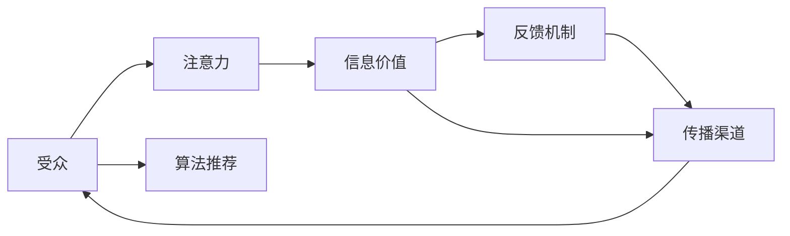
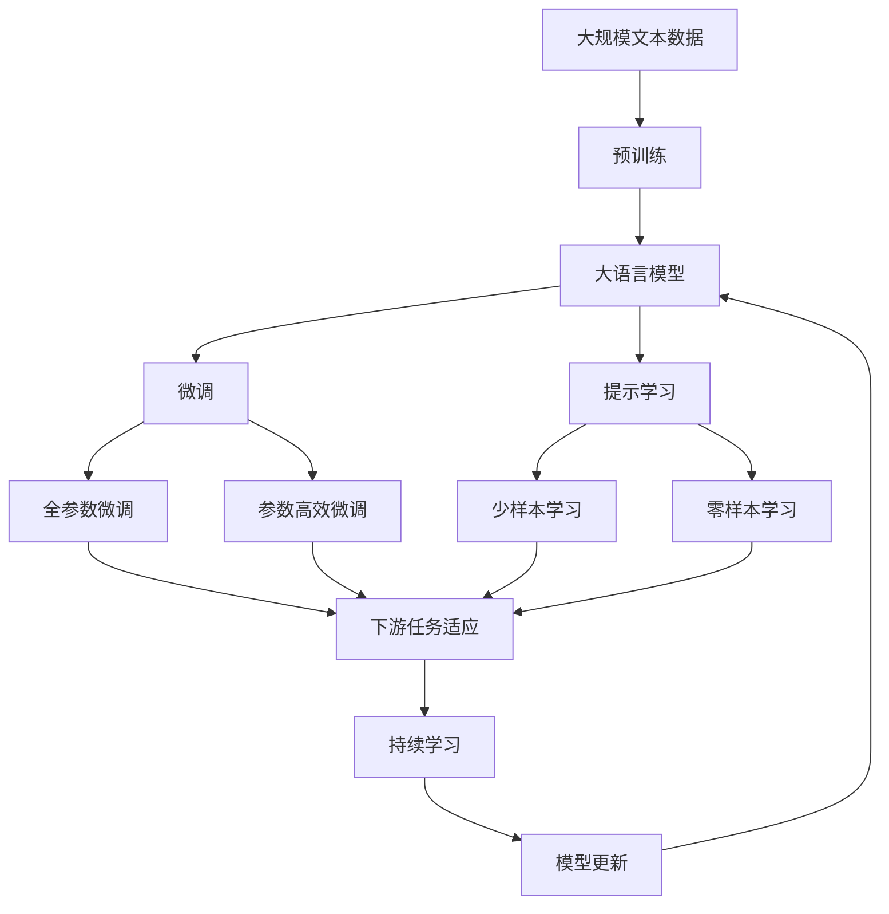

                 

# 注意力经济对政治传播的影响

## 1. 背景介绍

### 1.1 问题由来
在现代社会，信息的爆炸性增长伴随着用户注意力的日益稀缺。注意力经济（Economies of Attention）这一概念由经济学家James G. March和José L. Torres于1995年首次提出，它强调在信息过载的时代，如何吸引并保持用户的注意力，成为商业竞争的关键。政治传播作为一种特殊的媒体形式，同样面临着注意力经济的挑战。政治候选人、政党和政治机构需要通过各种渠道和方式，争夺公众的注意力，从而获得更多的政治影响力。

政治传播不仅仅关乎信息的传递，更关乎如何吸引和保持受众的注意力。随着数字媒体和社交网络的发展，政治传播的方式、渠道和受众发生了深刻变化。从传统的电视广告到社交媒体上的网络直播，从印刷媒体到数字媒体，政治传播的形态在不断演进。这种变化不仅改变了政治传播的生态，也对其效果和影响产生了深远的影响。

### 1.2 问题核心关键点
注意力经济对政治传播的影响主要体现在以下几个方面：
- **受众行为的改变**：信息消费从被动的接受转向主动的选择，受众更倾向于选择与自身兴趣和价值观相符的信息源。
- **传播渠道的多样化**：传统媒体逐渐失宠，数字媒体和社交网络成为主要的信息传播渠道。
- **信息的碎片化**：信息消费的碎片化导致受众难以形成对某一主题的深度认知。
- **传播的实时性**：即时消息、短视频等形式的信息传播速度和频率的提升，对政治事件的迅速反应提出了更高的要求。

这些变化要求政治传播的策略和手段必须做出适应，以更好地吸引和保持受众的注意力。

### 1.3 问题研究意义
研究注意力经济对政治传播的影响，对于理解政治传播的新格局、提升政治传播的效果具有重要意义：
- **优化传播策略**：通过深入分析受众的行为和偏好，制定更加精准有效的传播策略，提高信息传播的覆盖率和影响力。
- **提高信息质量**：在注意力稀缺的时代，高质量、高价值的内容更容易获得关注，研究注意力经济可以帮助优化内容创作和传播。
- **增强互动性**：利用社交网络和即时通讯工具，增强与受众的互动，提升传播效果。
- **应对新挑战**：面对数字媒体和社交网络带来的新挑战，研究注意力经济可以提供应对策略，保持政治传播的活力和竞争力。
- **推动技术创新**：技术的发展为政治传播提供了新的工具和方法，研究注意力经济可以推动这些技术的创新和应用。

## 2. 核心概念与联系

### 2.1 核心概念概述

注意力经济涉及的核心概念包括：

- **注意力**：用户对信息内容的关注度，是信息价值的重要体现。
- **受众**：信息内容的接收者，具有特定兴趣和需求的群体。
- **传播渠道**：信息传递的途径，包括传统媒体和数字媒体等。
- **信息价值**：信息内容的有用性和吸引力，是吸引受众注意力的关键因素。
- **反馈机制**：受众对信息内容的反馈，包括点赞、评论、分享等，可以指导信息的优化。
- **算法推荐**：利用算法分析用户行为，推荐个性化的信息内容。

这些概念之间存在密切联系，通过数据和技术手段，可以系统地分析和优化信息传播的效果。

### 2.2 概念间的关系

注意力经济中的关键概念关系可以通过以下Mermaid流程图来展示：



这个流程图展示了注意力经济中各概念之间的相互关系和作用。受众的行为和需求决定了信息的价值，而信息的价值又直接影响受众的注意力。传播渠道的作用是将信息传递给受众，反馈机制则通过用户互动和算法推荐来优化信息的传播效果。

### 2.3 核心概念的整体架构

最后，我们用一个综合的流程图来展示注意力经济在大语言模型微调过程中的整体架构：



这个综合流程图展示了从预训练到微调，再到持续学习的完整过程。注意力经济在大语言模型微调中的应用，使得模型能够根据受众的偏好和行为，进行更加个性化的信息传播，提升传播效果。

## 3. 核心算法原理 & 具体操作步骤
### 3.1 算法原理概述

注意力经济对政治传播的影响主要通过以下几个算法原理来实现：

1. **个性化推荐算法**：利用用户的历史行为数据和兴趣偏好，推荐个性化的政治信息内容。
2. **情感分析算法**：分析受众对政治信息的情感反应，指导信息的优化。
3. **数据挖掘算法**：通过数据分析挖掘受众的兴趣点，优化信息传播的策略。
4. **反馈调节算法**：根据受众的反馈和互动，实时调整信息的传播策略。

这些算法原理通过数学模型和计算技术，帮助优化政治信息的传播效果，提升受众的注意力和参与度。

### 3.2 算法步骤详解

以个性化推荐算法为例，其详细步骤包括：

1. **数据收集**：收集受众的历史行为数据，包括浏览记录、点击行为、评论内容等。
2. **特征提取**：将收集到的行为数据转化为特征向量，反映受众的兴趣和偏好。
3. **模型训练**：使用机器学习算法，如协同过滤、内容基推荐等，训练推荐模型。
4. **推荐实现**：根据模型预测，向受众推荐个性化的政治信息内容。
5. **反馈调整**：根据受众的反馈和互动，调整推荐模型和策略，优化信息传播效果。

这些步骤通过数据处理、模型训练和算法实现，构成了一个闭环的推荐系统，能够动态调整信息的传播策略。

### 3.3 算法优缺点

个性化推荐算法具有以下优点：
- **精准性高**：能够根据受众的兴趣和偏好，推荐个性化的信息内容，提高信息的吸引力。
- **实时性强**：能够实时调整推荐策略，适应受众的实时变化。
- **可扩展性好**：可以通过增加数据量和模型复杂度，不断提升推荐效果。

然而，个性化推荐算法也存在一些缺点：
- **隐私问题**：需要收集和分析大量的个人数据，存在隐私泄露的风险。
- **算法偏见**：推荐模型可能基于历史数据存在偏见，影响信息的公平性和多样性。
- **过度依赖数据**：依赖于高质量的原始数据，数据缺失或偏差可能导致推荐效果下降。

### 3.4 算法应用领域

个性化推荐算法在大规模政治传播中有着广泛的应用，具体包括：

- **政治广告投放**：通过个性化推荐算法，精准投放政治广告，提高广告的点击率和转化率。
- **政策解读传播**：利用算法分析受众对政策的关注点，推荐相关解读内容，帮助受众更好地理解政策。
- **政治事件报道**：根据受众的历史行为和兴趣，推荐相关的政治事件报道，增强信息的覆盖率和影响力。
- **政治活动策划**：通过分析受众的偏好，优化政治活动的策划和宣传策略，提高活动的参与度和效果。

这些应用场景展示了个性化推荐算法在大规模政治传播中的巨大潜力。

## 4. 数学模型和公式 & 详细讲解  
### 4.1 数学模型构建

个性化推荐算法通过以下数学模型进行构建：

$$
\text{推荐系统} = \text{用户行为数据} \rightarrow \text{特征提取} \rightarrow \text{推荐模型} \rightarrow \text{推荐结果}
$$

其中，用户行为数据通常表示为矩阵形式，$X \in \mathbb{R}^{n \times d}$，其中$n$表示用户数量，$d$表示特征维度。

推荐模型的目标是最大化用户对推荐的满意度，通常使用如下目标函数：

$$
\max_{W} \sum_{i=1}^n \sum_{j=1}^m X_{ij} \log \sigma(WX_{ij})
$$

其中，$W$为推荐模型的权重矩阵，$\sigma$为激活函数，$\log$为对数函数。

### 4.2 公式推导过程

以协同过滤算法为例，推导推荐模型的计算公式：

1. **用户行为矩阵**：
   - 假设用户$u$对$n$个物品$v$的评分矩阵为$R \in \mathbb{R}^{n \times m}$，其中$m$表示物品数量。
   - 用户行为矩阵$X \in \mathbb{R}^{n \times d}$，其中$d$表示用户的特征维度。

2. **协同过滤算法**：
   - 协同过滤算法分为基于用户的协同过滤和基于物品的协同过滤两种方法。这里主要介绍基于用户的协同过滤。
   - 基于用户的协同过滤算法通过计算用户$u$和$v$的相似度，推荐用户$u$可能感兴趣的物品$v$。

3. **推荐结果**：
   - 根据用户$u$和物品$v$的相似度，计算物品$v$的评分$\hat{r}_{uv}$，公式为：
     $$
     \hat{r}_{uv} = \frac{\sum_{k=1}^{d} X_{uk} \cdot X_{vk}}{\sqrt{\sum_{k=1}^{d} (X_{uk})^2} \cdot \sqrt{\sum_{k=1}^{d} (X_{vk})^2}}
     $$
   - 根据评分$\hat{r}_{uv}$，推荐物品$v$给用户$u$。

### 4.3 案例分析与讲解

以政治广告投放为例，分析个性化推荐算法的具体应用：

1. **数据收集**：收集用户的浏览记录、点击行为、评论内容等，构建用户行为矩阵$X$。
2. **特征提取**：将用户行为矩阵转化为特征向量，反映用户的兴趣和偏好。
3. **模型训练**：使用协同过滤算法，训练推荐模型，预测用户对不同政治广告的评分。
4. **推荐实现**：根据推荐模型，向用户推荐评分高的政治广告，提高广告的点击率和转化率。
5. **反馈调整**：根据用户的反馈和互动，调整推荐模型和策略，优化广告投放效果。

## 5. 项目实践：代码实例和详细解释说明
### 5.1 开发环境搭建

在进行个性化推荐系统开发前，我们需要准备好开发环境。以下是使用Python进行Scikit-learn开发的环境配置流程：

1. 安装Anaconda：从官网下载并安装Anaconda，用于创建独立的Python环境。

2. 创建并激活虚拟环境：
```bash
conda create -n recommender-env python=3.8 
conda activate recommender-env
```

3. 安装Scikit-learn：
```bash
conda install scikit-learn
```

4. 安装Pandas、NumPy、Matplotlib等工具包：
```bash
pip install pandas numpy matplotlib seaborn
```

5. 安装Jupyter Notebook：
```bash
pip install jupyter notebook
```

完成上述步骤后，即可在`recommender-env`环境中开始个性化推荐系统的开发。

### 5.2 源代码详细实现

下面以协同过滤算法为例，给出使用Scikit-learn库进行政治广告个性化推荐的PyTorch代码实现。

首先，定义数据处理函数：

```python
import pandas as pd
import numpy as np
from sklearn.feature_extraction.text import CountVectorizer
from sklearn.metrics.pairwise import cosine_similarity

# 读取用户行为数据
user_behavior_data = pd.read_csv('user_behavior.csv')

# 构建用户行为矩阵
X = user_behavior_data['behavior'].apply(lambda x: 1 if x == '点击' else 0).values
m, n = X.shape

# 特征提取
X = CountVectorizer().fit_transform(user_behavior_data['behavior']).toarray()
```

然后，定义推荐函数：

```python
from sklearn.neighbors import NearestNeighbors
from sklearn.metrics.pairwise import cosine_similarity

def recommend(user_index, X, n_recommend=5):
    # 计算用户之间的相似度
    similarity_matrix = cosine_similarity(X[user_index], X)
    # 找到与用户最相似的k个用户
    k = 10
    similar_user_indices = np.argsort(similarity_matrix)[1:k+1]
    # 对被推荐物品进行评分
    scores = np.zeros(n)
    for user_index in similar_user_indices:
        scores += cosine_similarity(X[user_index], X)[:n] * X[user_index]
    # 排序并返回推荐结果
    sorted_indices = np.argsort(scores)[::-1]
    return sorted_indices[:n_recommend]
```

最后，启动推荐流程：

```python
# 计算用户对不同广告的评分
R = user_behavior_data.groupby('user')['ad'].sum().values.reshape(n, m)

# 定义推荐模型
model = NearestNeighbors(n_neighbors=10, algorithm='brute')

# 训练模型
model.fit(X)

# 获取用户对广告的评分
scores = np.zeros(n)
for user_index in range(n):
    recommendations = recommend(user_index, X, n_recommend=5)
    scores[user_index] = R[user_index, recommendations]

# 根据评分推荐广告
top_ads = np.argsort(scores)[::-1]
```

以上就是使用Scikit-learn进行政治广告个性化推荐的完整代码实现。可以看到，利用Scikit-learn的简单工具包，我们可以快速实现协同过滤算法，并根据用户行为矩阵推荐个性化的广告。

### 5.3 代码解读与分析

让我们再详细解读一下关键代码的实现细节：

**数据处理函数**：
- 读取用户行为数据，构建用户行为矩阵$X$。
- 利用CountVectorizer进行特征提取，将文本行为转化为特征向量。

**推荐函数**：
- 使用NearestNeighbors计算用户之间的相似度，找到与用户最相似的k个用户。
- 对被推荐物品进行评分，计算用户的综合评分。
- 根据评分排序，返回推荐结果。

**推荐流程**：
- 计算用户对不同广告的评分，构建评分矩阵$R$。
- 训练推荐模型，找到与用户最相似的k个用户。
- 计算用户的综合评分，根据评分排序，返回推荐结果。

可以看到，Scikit-learn提供了一整套简单易用的工具包，使得个性化推荐系统的开发变得非常容易。开发者只需要根据具体任务，选择合适的算法和工具，即可快速实现个性化的推荐功能。

## 6. 实际应用场景
### 6.1 政治广告投放

个性化推荐算法在政治广告投放中具有广泛的应用前景。传统的政治广告往往缺乏针对性和精准性，导致广告投放效果不佳，浪费了大量的时间和资源。利用个性化推荐算法，可以针对不同受众的兴趣和行为，推荐个性化的政治广告，提高广告的点击率和转化率。

具体而言，可以通过收集用户的历史行为数据，如浏览记录、点击行为等，构建用户行为矩阵$X$。利用协同过滤算法，计算用户之间的相似度，找到与目标用户最相似的k个用户。根据这k个用户的广告评分，预测目标用户的广告评分，从而推荐个性化的政治广告。

### 6.2 政策解读传播

在政策解读传播中，个性化推荐算法可以帮助用户快速找到感兴趣的政策解读内容。传统的政策解读传播方式往往缺乏针对性，导致用户难以找到与自己相关的政策解读内容。通过个性化推荐算法，可以根据用户的兴趣和行为，推荐相关的政策解读内容，提高政策传播的效果。

具体而言，可以通过收集用户的历史行为数据，如评论内容、点赞行为等，构建用户行为矩阵$X$。利用协同过滤算法，计算用户之间的相似度，找到与目标用户最相似的k个用户。根据这k个用户对不同政策解读的评分，推荐个性化的政策解读内容，满足用户的需求。

### 6.3 政治事件报道

在政治事件报道中，个性化推荐算法可以帮助用户及时获取相关的新闻报道。传统的政治事件报道方式往往缺乏针对性和及时性，导致用户难以获取与自己相关的政治事件报道。通过个性化推荐算法，可以根据用户的兴趣和行为，推荐相关的政治事件报道，提高事件的传播效果。

具体而言，可以通过收集用户的历史行为数据，如浏览记录、评论内容等，构建用户行为矩阵$X$。利用协同过滤算法，计算用户之间的相似度，找到与目标用户最相似的k个用户。根据这k个用户对不同政治事件的报道评分，推荐个性化的政治事件报道，满足用户的需求。

### 6.4 未来应用展望

随着个性化推荐算法的发展，其应用场景将不断扩展，为政治传播带来更多新的可能性。未来，个性化的推荐算法可能与大数据分析、人工智能技术等更加紧密结合，提供更加精准和个性化的推荐服务。

例如，通过大数据分析，可以更全面地了解用户的行为和偏好，优化推荐模型，提升推荐的精准度。通过人工智能技术，可以实现更加智能化的推荐，如基于深度学习的协同过滤算法，提升推荐的效率和效果。

## 7. 工具和资源推荐
### 7.1 学习资源推荐

为了帮助开发者系统掌握个性化推荐算法的理论基础和实践技巧，这里推荐一些优质的学习资源：

1. 《推荐系统实践》（第三版）：清华大学教授俞士峰主编，系统介绍了推荐系统的发展历程、基本原理和常见算法。
2. 《Python推荐系统》：周志华、李航、梁亚栋等编著，介绍了基于Python的推荐系统开发，包含协同过滤、内容基推荐等算法。
3. 《Machine Learning Yearning》：谷歌工程师Andrew Ng撰写的机器学习实践指南，包括推荐系统的设计与实现。
4. 《Recommender Systems: Text Mining and Statistical Learning》：详细介绍推荐系统的理论基础和算法实现，适合深入研究。
5. Kaggle推荐系统竞赛：通过实际数据集和竞赛，帮助开发者练习和优化推荐模型。

通过对这些资源的学习实践，相信你一定能够快速掌握个性化推荐算法的精髓，并用于解决实际的政治传播问题。
###  7.2 开发工具推荐

高效的开发离不开优秀的工具支持。以下是几款用于个性化推荐系统开发的常用工具：

1. Scikit-learn：基于Python的机器学习库，提供了简单易用的推荐算法实现。
2. TensorFlow和PyTorch：基于Python的深度学习框架，适合实现基于深度学习的推荐系统。
3. Apache Spark：分布式计算框架，适合大规模推荐系统的开发。
4. Apache Mahout：基于Hadoop的推荐系统框架，适合分布式推荐系统的开发。
5. Elasticsearch：分布式搜索引擎，适合推荐系统中用户行为数据的存储和查询。

合理利用这些工具，可以显著提升个性化推荐系统的开发效率，加快创新迭代的步伐。

### 7.3 相关论文推荐

个性化推荐算法的研究源于学界的持续研究。以下是几篇奠基性的相关论文，推荐阅读：

1. "Collaborative Filtering for Recommender Systems"：由Adams、Adams等提出，是协同过滤算法的经典论文。
2. "Trustworthy Recommendations"：由Adams等提出，介绍了信任度算法在推荐系统中的应用。
3. "Deep Collaborative Filtering"：由He、Chen等提出，介绍了基于深度学习的推荐算法。
4. "Latent Feature Prediction Using Matrix Factorization"：由Cortes、Arthur等提出，介绍了矩阵分解算法在推荐系统中的应用。
5. "Hybrid Recommendation System"：由Brazdil、Mao等提出，介绍了混合推荐算法的设计与实现。

这些论文代表了个性化推荐算法的发展脉络。通过学习这些前沿成果，可以帮助研究者把握学科前进方向，激发更多的创新灵感。

除上述资源外，还有一些值得关注的前沿资源，帮助开发者紧跟个性化推荐算法的最新进展，例如：

1. arXiv论文预印本：人工智能领域最新研究成果的发布平台，包括大量尚未发表的前沿工作，学习前沿技术的必读资源。
2. 业界技术博客：如谷歌、Facebook、Amazon等顶尖实验室的官方博客，第一时间分享他们的最新研究成果和洞见。
3. 技术会议直播：如SIGKDD、ICML、ACL、ICLR等人工智能领域顶会现场或在线直播，能够聆听到大佬们的前沿分享，开拓视野。
4. GitHub热门项目：在GitHub上Star、Fork数最多的推荐相关项目，往往代表了该技术领域的发展趋势和最佳实践，值得去学习和贡献。
5. 行业分析报告：各大咨询公司如McKinsey、PwC等针对推荐系统的分析报告，有助于从商业视角审视技术趋势，把握应用价值。

总之，对于个性化推荐算法的学习和实践，需要开发者保持开放的心态和持续学习的意愿。多关注前沿资讯，多动手实践，多思考总结，必将收获满满的成长收益。

## 8. 总结：未来发展趋势与挑战
### 8.1 研究成果总结
个性化推荐算法在政治传播中的应用取得了显著的成效，通过提高广告投放和政策传播的精准性，提升了信息传播的效果和受众的参与度。未来，随着技术的不断进步，个性化推荐算法将在更多领域得到应用，推动信息传播的智能化、个性化发展。

### 8.2 未来发展趋势
个性化推荐算法的发展趋势如下：

1. **深度学习的应用**：未来推荐算法将更加依赖深度学习模型，提高推荐的精准度和效率。
2. **多模态数据的融合**：推荐系统将结合多模态数据（如文本、图像、音频等），提供更加全面和个性化的推荐。
3. **实时推荐系统**：推荐系统将实现实时化，根据用户的行为和反馈动态调整推荐策略。
4. **用户隐私保护**：随着数据隐私保护意识的增强，推荐算法将更加注重用户隐私保护，如差分隐私、联邦学习等。
5. **跨领域应用的推广**：个性化推荐算法将在更多领域得到应用，如医疗、教育、金融等，提升这些领域的智能化水平。

### 8.3 面临的挑战
尽管个性化推荐算法在政治传播中取得了显著成效，但在其发展过程中也面临着诸多挑战：

1. **数据质量问题**：数据的质量和数量直接影响推荐效果，数据缺失、噪声等问题需要有效处理。
2. **模型复杂度**：深度学习模型的复杂度和计算成本较高，需要高效的算法和硬件支持。
3. **算法偏见**：推荐算法可能存在算法偏见，影响推荐公平性和多样性。
4. **隐私问题**：推荐系统需要收集和处理大量用户数据，数据隐私和安全性问题需要重视。
5. **用户满意度**：推荐系统需要满足用户的多样化需求，避免推荐过度同质化，提高用户满意度。

### 8.4 研究展望
未来推荐算法的研究方向包括：

1. **多任务学习**：结合多个任务进行联合优化，提升推荐效果和模型泛化能力。
2. **自适应推荐**：根据用户的行为和反馈，动态调整推荐策略，提高推荐的实时性和精准性。
3. **对抗性推荐**：通过对抗性学习，提高推荐的鲁棒性和安全性。
4. **跨领域推荐**：结合不同领域的知识，进行跨领域的推荐，提升推荐的多样性和创新性。
5. **混合推荐**：结合协同过滤和基于内容的推荐，实现混合推荐，提高推荐的覆盖面和质量。

这些研究方向的探索，将引领个性化推荐算法走向更高的台阶，为信息传播带来更多的创新和发展。

## 9. 附录：常见问题与解答

**Q1：个性化推荐算法是否适用于所有政治传播场景？**

A: 个性化推荐算法在政治传播中具有广泛的应用前景，但对于一些特殊场景，如极端边缘化的政治观点和敏感话题，推荐算法需要更加谨慎，避免推荐不当信息。

**Q2：个性化推荐算法如何避免算法偏见？**

A: 避免算法偏见的方法包括：
1. 数据预处理：对数据进行去重、去噪等预处理，减少数据偏差。
2. 多样性约束：在推荐策略中加入多样性约束，避免过度同质化。
3. 透明可解释性：使用可解释性较高的算法，如协同过滤、矩阵分解等，便于用户理解推荐过程。
4. 用户反馈：根据用户的反馈和互动，动态调整推荐策略，提升推荐的公平性和多样性。

**Q3：个性化推荐算法如何保护用户隐私？**

A: 保护用户隐私的方法包括：
1. 数据匿名化：对用户数据进行匿名化处理，避免个人信息泄露。
2. 差分隐私：在推荐算法中加入差分隐私机制，保护用户数据的安全性。
3. 联邦学习：使用联邦学习技术，在分布式环境中保护用户隐私。
4. 用户控制：允许用户控制其数据的共享和使用，增强用户隐私保护。

**Q4：个性化推荐算法如何提升用户满意度？**

A: 提升用户满意度的方法包括：
1. 个性化推荐：根据用户的行为和兴趣，提供个性化的推荐内容。
2. 多模态推荐：结合多模态数据，提供更加全面和个性化的推荐内容。
3. 实时推荐：根据用户的行为和反馈，动态调整推荐策略，提高推荐的实时性和精准性。
4. 用户反馈：根据用户的反馈和互动，动态调整推荐策略，提升推荐的公平性和多样性。

**Q5：个性化推荐算法如何应对大规模数据处理？**

A: 应对大规模数据处理的方法包括：
1. 分布式计算：使用分布式计算框架，如Apache Spark，处理大规模数据。
2. 数据压缩：对数据进行压缩，减少存储和传输的开销。
3. 模型压缩：对模型进行压缩，减少内存和计算资源的需求。
4. 增量学习：根据新

