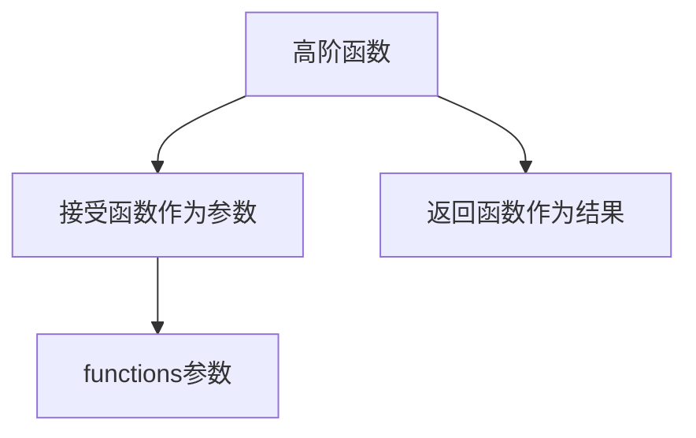
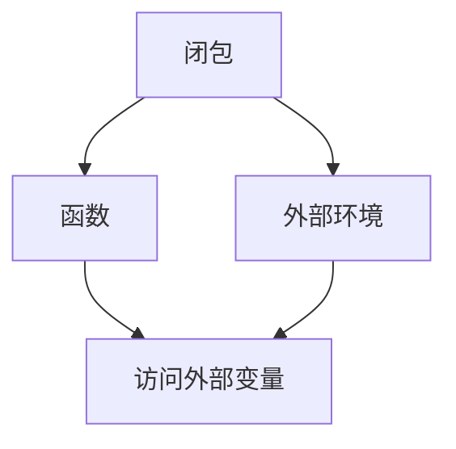
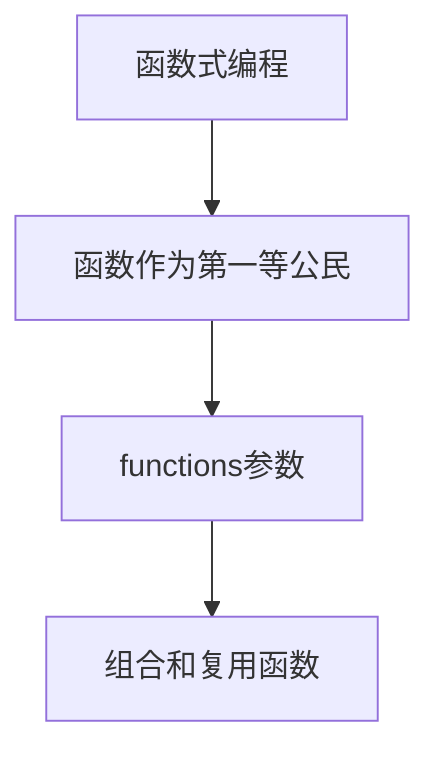

# 如何使用 functions 参数

## 1. 背景介绍

### 1.1 问题的由来

在编程领域中,函数是一种非常重要的代码结构,它允许我们将一组语句封装成一个可重用的单元。然而,有时我们需要在函数内部执行一些特定的操作,而这些操作可能会根据不同的场景而有所不同。这种情况下,我们就需要一种机制来动态地传递这些操作,使得函数能够根据传入的操作来执行不同的行为。这就是 functions 参数发挥作用的地方。

### 1.2 研究现状

目前,functions 参数在许多编程语言中都有所支持,例如 JavaScript、Python、C#等。它们提供了不同的语法和用法,但核心思想是相似的。在函数式编程范式中,functions 参数也扮演着重要的角色,它们被广泛应用于高阶函数、闭包等概念中。

### 1.3 研究意义

掌握 functions 参数的使用不仅可以提高代码的灵活性和可重用性,还能帮助我们更好地理解函数式编程的思想。通过将函数作为参数传递,我们可以实现更高层次的抽象,从而编写出更加模块化、可维护的代码。此外,functions 参数在函数式编程中扮演着关键角色,深入理解它们有助于我们掌握函数式编程的核心概念。

### 1.4 本文结构

本文将从以下几个方面深入探讨 functions 参数的使用:

1. 核心概念与联系
2. 核心算法原理与具体操作步骤
3. 数学模型和公式详细讲解与举例说明
4. 项目实践:代码实例和详细解释说明
5. 实际应用场景
6. 工具和资源推荐
7. 总结:未来发展趋势与挑战
8. 附录:常见问题与解答

## 2. 核心概念与联系

在讨论 functions 参数之前,我们需要先了解一些核心概念,它们与 functions 参数密切相关。

### 2.1 高阶函数

高阶函数是指可以接受函数作为参数或者返回值的函数。functions 参数正是高阶函数的一种体现。通过将函数作为参数传递,我们可以动态地改变函数的行为,从而实现更高层次的抽象。



### 2.2 闭包

闭包是指一个函数及其引用的外部环境的组合。当一个函数被作为参数传递时,它会携带着自己的闭包环境,这使得它可以访问外部变量,从而实现更加灵活的功能。



### 2.3 函数式编程

函数式编程是一种编程范式,它将计算过程视为一系列函数的组合。在这种范式中,函数被视为"第一等公民",可以像普通变量一样被传递和操作。functions 参数正是函数式编程中的一个重要概念,它使得我们可以更好地组合和复用函数。



## 3. 核心算法原理与具体操作步骤

### 3.1 算法原理概述

functions 参数的核心原理是将函数作为值传递给另一个函数。这种做法允许我们在运行时动态地决定要执行哪些操作,从而提高了代码的灵活性和可重用性。

在大多数编程语言中,函数都是一等公民,这意味着它们可以像普通值一样被赋值、传递和返回。当我们将一个函数作为参数传递给另一个函数时,实际上是在传递一个引用,而不是函数本身的代码。接收函数可以在适当的时候调用这个传入的函数,并传递所需的参数。

### 3.2 算法步骤详解

使用 functions 参数通常包括以下几个步骤:

1. **定义接收函数作为参数的函数**

   首先,我们需要定义一个函数,它接受另一个函数作为参数。这个接收函数通常会在内部调用传入的函数,并传递所需的参数。

   ```javascript
   function higherOrderFunction(callback) {
     // 在适当的时候调用 callback 函数
     // ...
   }
   ```

2. **定义要传递的函数**

   接下来,我们需要定义一个函数,它将作为参数传递给上一步中的接收函数。这个函数可以是一个命名函数或匿名函数(lambda 函数)。

   ```javascript
   function myCallback(arg1, arg2) {
     // 执行一些操作
     // ...
   }
   ```

3. **调用接收函数,并传递函数作为参数**

   最后,我们调用接收函数,并将上一步中定义的函数作为参数传递给它。

   ```javascript
   higherOrderFunction(myCallback);
   ```

在接收函数内部,它可以根据需要调用传入的函数,并传递所需的参数。这种做法使得我们可以在运行时动态地决定要执行哪些操作,从而提高了代码的灵活性和可重用性。

### 3.3 算法优缺点

使用 functions 参数有以下优点:

- **提高代码的灵活性和可重用性**:通过将函数作为参数传递,我们可以动态地改变函数的行为,从而实现更高层次的抽象和复用。
- **支持函数式编程范式**:functions 参数是函数式编程中的一个核心概念,它使得我们可以更好地组合和复用函数。
- **简化代码逻辑**:将特定的操作封装在函数中,并将这些函数作为参数传递,可以使代码逻辑更加清晰和易于维护。

然而,使用 functions 参数也存在一些缺点:

- **增加了代码复杂性**:使用 functions 参数可能会增加代码的复杂性,特别是对于初学者来说,理解高阶函数和闭包的概念可能会有一定的挑战。
- **性能开销**:将函数作为参数传递可能会带来一定的性能开销,特别是在需要频繁调用这些函数的情况下。
- **可读性问题**:过度使用 functions 参数可能会导致代码的可读性下降,尤其是当函数嵌套层级过深时。

### 3.4 算法应用领域

functions 参数在许多领域都有广泛的应用,例如:

- **函数式编程**:functions 参数是函数式编程中的一个核心概念,它被广泛应用于高阶函数、闭包等场景。
- **事件驱动编程**:在事件驱动编程中,我们经常需要将事件处理函数作为参数传递给事件监听器。
- **异步编程**:在异步编程中,回调函数是一种常见的模式,它们通常作为参数传递给异步操作。
- **算法设计**:在一些算法设计中,我们可能需要将特定的操作作为函数传递给更高级别的算法,以实现更好的抽象和灵活性。
- **数据处理**:在处理大量数据时,我们可以将数据转换或过滤操作封装在函数中,并将这些函数作为参数传递给更高级别的数据处理函数。

## 4. 数学模型和公式详细讲解与举例说明

虽然 functions 参数主要是一种编程概念和技术,但我们仍然可以使用数学模型和公式来更好地理解和描述它。

### 4.1 数学模型构建

我们可以将函数视为一种映射,它将输入映射到输出。在这种情况下,functions 参数可以被看作是一种高阶映射,它接受另一个映射作为输入,并返回一个新的映射作为输出。

让我们定义以下符号:

- $X$: 输入域
- $Y$: 输出域
- $f: X \rightarrow Y$: 一个函数,将输入映射到输出
- $g: (X \rightarrow Y) \rightarrow (X \rightarrow Y)$: 一个高阶函数,接受一个函数作为输入,并返回一个新的函数作为输出

我们可以将 $g$ 视为一个函数转换器,它接受一个函数 $f$ 作为输入,并返回一个新的函数 $g(f)$。这个新函数可以是对原始函数 $f$ 的修改、组合或包装。

### 4.2 公式推导过程

现在,让我们通过一个具体的例子来推导相关的公式。假设我们有一个函数 $f(x) = x^2$,它计算一个数的平方。我们希望创建一个新的函数 $g(f)$,它接受一个函数作为参数,并返回一个新的函数,该函数在执行原始函数之前对输入进行预处理。

我们可以定义一个预处理函数 $h(x)$,它对输入进行一些转换。在这个例子中,假设 $h(x) = x + 1$,它将输入加 1。

现在,我们可以定义 $g$ 如下:

$$
g(f)(x) = f(h(x))
$$

将具体的函数代入,我们得到:

$$
\begin{align*}
g(f)(x) &= f(h(x)) \
        &= (x + 1)^2 \
        &= x^2 + 2x + 1
\end{align*}
$$

因此,我们得到了一个新的函数 $g(f)$,它首先对输入执行预处理函数 $h(x)$,然后将结果传递给原始函数 $f(x)$。

### 4.3 案例分析与讲解

让我们通过一个实际的编程示例来进一步理解 functions 参数的使用。

假设我们有一个需求,需要实现一个函数 `processData`,它接受一个数据集合和一个处理函数作为参数。该函数应该对数据集合中的每个元素执行处理函数,并返回处理后的结果集合。

```javascript
function processData(data, processFunction) {
  const result = [];
  for (const item of data) {
    result.push(processFunction(item));
  }
  return result;
}
```

在这个例子中,`processData` 函数接受一个数据集合 `data` 和一个处理函数 `processFunction` 作为参数。它遍历数据集合中的每个元素,并对每个元素执行 `processFunction`。处理后的结果被存储在 `result` 数组中,最终返回整个结果集合。

现在,我们可以定义不同的处理函数,并将它们传递给 `processData` 函数,以实现不同的数据处理逻辑。

```javascript
// 将数字加 1
const incrementFunction = (x) => x + 1;

// 计算数字的平方
const squareFunction = (x) => x * x;

const data = [1, 2, 3, 4, 5];

const incrementedData = processData(data, incrementFunction);
console.log(incrementedData); // [2, 3, 4, 5, 6]

const squaredData = processData(data, squareFunction);
console.log(squaredData); // [1, 4, 9, 16, 25]
```

在这个示例中,我们定义了两个处理函数 `incrementFunction` 和 `squareFunction`。然后,我们将它们分别传递给 `processData` 函数,得到了不同的处理结果。

通过这个例子,我们可以看到 functions 参数如何提高了代码的灵活性和可重用性。`processData` 函数本身不关心具体的处理逻辑,它只需要执行传入的处理函数即可。这种设计使得我们可以轻松地扩展和修改处理逻辑,而无需修改 `processData` 函数的实现。

### 4.4 常见问题解答

**问题 1: 为什么要使用 functions 参数?**

使用 functions 参数的主要原因是提高代码的灵活性和可重用性。通过将函数作为参数传递,我们可以动态地改变函数的行为,从而实现更高层次的抽象和复用。这种做法还支持函数式编程范式,使得我们可以更好地组合和复用函数。

**问题 2: functions 参数和回调函数有什么区别?**

回调函数是一种特殊的 functions 参数。当我们将一个函数作为参数传递给另一个函数时,这个传递的函数就被称为回调函数