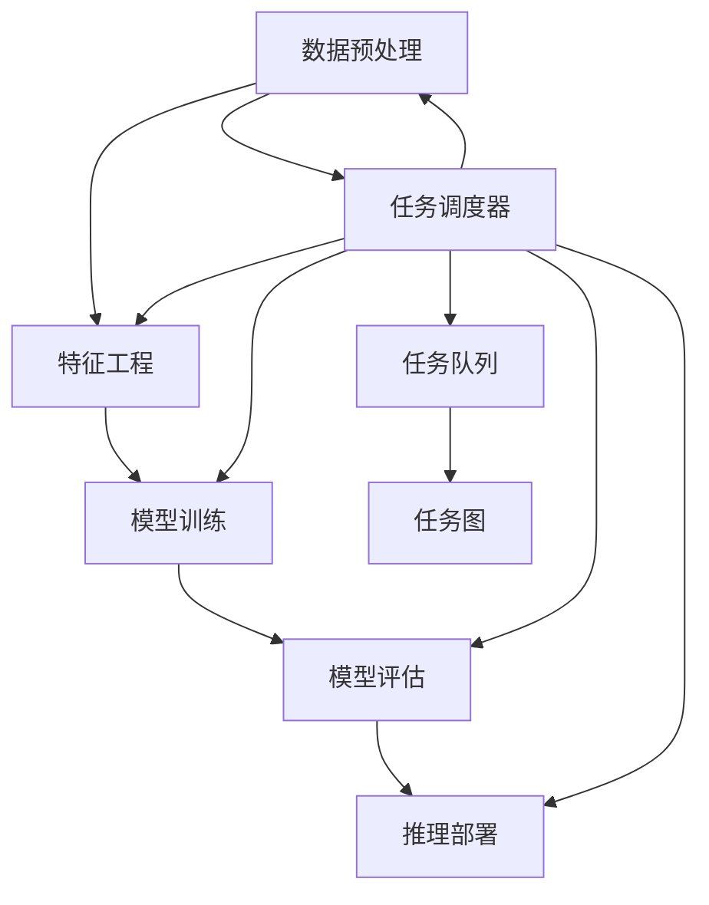

                 

# AI模型的任务分配与执行

## 1. 背景介绍

在AI和机器学习的快速发展中，一个显著的趋势是模型的多样性和复杂度的不断提升。从简单的线性回归到深度神经网络，再到庞大的预训练大模型，AI模型的结构和功能变得越来越强大。这种变化带来的直接问题是：如何在多样化的模型中有效分配任务，并确保模型能够高效地执行任务。任务分配和执行成为了一个关键的技术挑战。

### 1.1 问题由来

在AI系统开发和部署过程中，我们常常需要处理多层次、多领域的任务。这些任务可能涉及数据预处理、特征工程、模型训练、推理部署等多个环节。每一步都需要精心设计，以确保模型的最终效果和性能。如何有效地管理和执行这些任务，成为了一个系统性的问题。

### 1.2 问题核心关键点

- 任务类型多样：包括数据收集、数据预处理、特征工程、模型训练、模型评估、推理部署、模型监控等。
- 任务依赖关系：不同任务之间可能存在依赖关系，如模型训练需要数据预处理，推理部署需要模型评估结果。
- 任务执行效率：任务执行过程中可能存在瓶颈，如模型训练计算量大，推理部署需要高吞吐量。
- 任务管理复杂度：随着任务数量增加，任务管理的复杂度呈指数级增长。

### 1.3 问题研究意义

有效管理任务分配和执行，对于提升AI系统的开发效率、减少资源浪费、提高模型性能至关重要。以下是几个关键研究意义：

1. **提高开发效率**：通过自动化的任务管理，可以显著减少人工干预，提升开发速度。
2. **优化资源利用**：通过合理分配任务，可以更有效地利用计算资源和存储资源。
3. **提高模型性能**：通过优化任务执行顺序和并行处理策略，可以提升模型训练和推理的效率。
4. **增强系统可靠性**：通过任务监控和故障恢复机制，可以提高系统的稳定性和可用性。
5. **支持模型迭代**：通过灵活的任务管理，可以支持模型的持续迭代和更新。

## 2. 核心概念与联系

### 2.1 核心概念概述

为更好地理解AI模型的任务分配与执行，本节将介绍几个关键概念及其相互关系：

- **任务流 (Workflow)**：指一系列按特定顺序执行的计算步骤。任务流定义了从数据输入到模型输出的全流程。
- **任务 (Task)**：任务流中的单个计算步骤，如数据预处理、特征工程、模型训练等。
- **任务图 (Task Graph)**：描述任务流中各个任务之间依赖关系的有向无环图。
- **任务调度器 (Task Scheduler)**：负责任务分配和执行的组件，根据任务依赖关系和资源可用性进行任务调度。
- **任务队列 (Task Queue)**：用于存储待执行任务和任务执行结果的队列。
- **任务依赖 (Task Dependency)**：指不同任务之间的先后关系，如数据预处理必须在模型训练前完成。

### 2.2 核心概念间的关系

这些核心概念通过任务图和任务调度器形成了完整的任务管理框架。下面使用Mermaid流程图来展示这些概念之间的相互关系：



这个流程图展示了任务流中的各个任务及其依赖关系，通过任务调度器和任务队列进行任务分配和执行，最终形成完整的任务管理框架。

## 3. 核心算法原理 & 具体操作步骤
### 3.1 算法原理概述

AI模型的任务分配与执行算法，本质上是任务调度问题。即在给定任务流和任务依赖关系下，找到一个最优或可行解，使得任务执行效率最高，资源利用最优。常见的方法包括：

- **关键路径算法 (Critical Path Method, CPM)**：用于计算任务流中的关键路径，即影响任务完成时间的最长路径。关键路径上的任务延误会导致整个任务流的延误。
- **任务调度算法 (Task Scheduling Algorithm)**：根据任务优先级、资源约束等条件，合理安排任务执行顺序。常见的算法包括时间片轮转调度、最少优先级调度等。
- **分布式任务调度算法 (Distributed Task Scheduling Algorithm)**：在多节点或分布式系统中，通过任务分配和节点调度，实现并行计算和负载均衡。

### 3.2 算法步骤详解

以下以关键路径算法为例，详细讲解任务分配与执行的具体步骤：

**Step 1: 构建任务图**
- 定义任务集，包括任务类型、任务依赖关系等。
- 使用有向无环图描述任务流中各个任务之间的依赖关系。

**Step 2: 计算关键路径**
- 通过拓扑排序算法，对任务图进行排序。
- 计算每个任务的最晚开始时间和最晚完成时间。
- 找出关键路径，即影响任务完成时间的最长路径。

**Step 3: 分配任务**
- 根据关键路径上的任务，合理安排资源。
- 对于关键路径上的任务，优先分配资源，避免延误。

**Step 4: 执行任务**
- 按照任务执行顺序，依次执行任务。
- 记录每个任务的开始时间和完成时间，实时监控任务进度。

**Step 5: 任务监控与优化**
- 通过监控任务执行状态，及时发现异常。
- 根据监控结果，调整任务执行顺序或资源分配，优化任务执行效率。

### 3.3 算法优缺点

**优点：**
- 能够合理安排任务执行顺序，最大化利用计算资源。
- 通过关键路径计算，可以明确任务延误的风险点。
- 任务调度算法具有灵活性，可以适应不同任务优先级和资源约束。

**缺点：**
- 复杂任务流可能难以表示为有向无环图，导致任务图构建困难。
- 对于动态任务流，任务图需要频繁更新，增加计算复杂度。
- 任务调度算法可能存在资源争用和阻塞问题，影响执行效率。

### 3.4 算法应用领域

AI模型的任务分配与执行算法广泛应用于以下几个领域：

- **科学计算**：如大规模计算流模拟、气候模型计算等。
- **机器学习**：如深度学习模型的训练、特征提取等。
- **数据处理**：如大数据的清洗、转换、存储等。
- **分布式系统**：如云计算平台的任务调度、高性能计算集群的管理等。

## 4. 数学模型和公式 & 详细讲解 & 举例说明
### 4.1 数学模型构建

假设任务流中有 $n$ 个任务 $T_1, T_2, ..., T_n$，每个任务 $T_i$ 的计算时间、依赖关系等已定义。用 $S_i$ 表示任务 $T_i$ 的最早开始时间，$F_i$ 表示任务 $T_i$ 的最早完成时间，$L_i$ 表示任务 $T_i$ 的最晚开始时间，$U_i$ 表示任务 $T_i$ 的最晚完成时间。任务 $T_i$ 和 $T_j$ 之间的依赖关系表示为 $T_i$ 必须在前，$T_j$ 必须在后。

**任务图表示**：使用有向边 $T_i \rightarrow T_j$ 表示任务 $T_j$ 依赖于任务 $T_i$。

**关键路径计算**：通过拓扑排序算法计算关键路径，即最长的依赖路径。关键路径上的任务延误会影响整个任务流的完成时间。

### 4.2 公式推导过程

关键路径计算的数学公式推导如下：

1. **拓扑排序算法**：对任务图进行拓扑排序，得到任务顺序 $O = (O_1, O_2, ..., O_n)$。
2. **最早开始时间计算**：$S_i = \max_{j \rightarrow i} S_j$，即任务 $T_i$ 的最早开始时间为依赖任务 $T_j$ 的最早完成时间的最大值。
3. **最早完成时间计算**：$F_i = S_i + T_i$，即任务 $T_i$ 的最早完成时间为最早开始时间加上计算时间 $T_i$。
4. **最晚开始时间计算**：$L_i = \min_{j \leftarrow i} L_j$，即任务 $T_i$ 的最晚开始时间为后继任务 $T_j$ 的最晚完成时间的最小值。
5. **最晚完成时间计算**：$U_i = L_i + T_i$，即任务 $T_i$ 的最晚完成时间为最晚开始时间加上计算时间 $T_i$。
6. **关键路径计算**：从任务 $O_1$ 开始，递归计算任务的最晚开始时间 $L_{O_i}$ 和最晚完成时间 $U_{O_i}$，直到任务 $O_n$。关键路径为最早完成时间最大的任务路径，即 $\max_i U_{O_i}$。

### 4.3 案例分析与讲解

以下以一个简单的数据预处理、特征工程和模型训练为例，展示任务图构建和关键路径计算的实际应用：

**任务图构建**：

```
A ---> B ---> C
```

**关键路径计算**：

1. 任务 $A$ 的最早开始时间 $S_A = 0$，最早完成时间 $F_A = 2$。
2. 任务 $B$ 的最早开始时间 $S_B = \max_{j \rightarrow B} S_j = 2$，最早完成时间 $F_B = S_B + 2 = 4$。
3. 任务 $C$ 的最早开始时间 $S_C = \max_{j \rightarrow C} S_j = 4$，最早完成时间 $F_C = S_C + 3 = 7$。
4. 任务 $A$ 的最晚开始时间 $L_A = \min_{j \leftarrow A} L_j = 0$，最晚完成时间 $U_A = L_A + 2 = 2$。
5. 任务 $B$ 的最晚开始时间 $L_B = \min_{j \leftarrow B} L_j = 2$，最晚完成时间 $U_B = L_B + 2 = 4$。
6. 任务 $C$ 的最晚开始时间 $L_C = \min_{j \leftarrow C} L_j = 4$，最晚完成时间 $U_C = L_C + 3 = 7$。

因此，关键路径为 $A \rightarrow B \rightarrow C$，关键路径上的任务必须按时完成，否则整个任务流会延误。

## 5. 项目实践：代码实例和详细解释说明
### 5.1 开发环境搭建

在开始项目实践前，需要准备好开发环境。以下是使用Python进行任务调度实践的环境配置流程：

1. 安装Anaconda：从官网下载并安装Anaconda，用于创建独立的Python环境。

2. 创建并激活虚拟环境：
```bash
conda create -n task-scheduler python=3.8 
conda activate task-scheduler
```

3. 安装PyTorch：根据CUDA版本，从官网获取对应的安装命令。例如：
```bash
conda install pytorch torchvision torchaudio cudatoolkit=11.1 -c pytorch -c conda-forge
```

4. 安装Task Scheduler库：
```bash
pip install task-scheduler
```

5. 安装各类工具包：
```bash
pip install numpy pandas scikit-learn matplotlib tqdm jupyter notebook ipython
```

完成上述步骤后，即可在`task-scheduler`环境中开始任务调度实践。

### 5.2 源代码详细实现

下面我们以一个简单的任务流为例，给出使用Task Scheduler库进行任务调度的PyTorch代码实现。

首先，定义任务类：

```python
from task_scheduler import Task
from datetime import datetime, timedelta

class DataPreprocessingTask(Task):
    def __init__(self, task_id):
        super().__init__(task_id)
        self.start_time = None
        self.end_time = None
        
    def process(self, data):
        # 处理数据
        pass

class FeatureEngineeringTask(Task):
    def __init__(self, task_id):
        super().__init__(task_id)
        self.start_time = None
        self.end_time = None
        
    def process(self, features):
        # 处理特征
        pass

class ModelTrainingTask(Task):
    def __init__(self, task_id):
        super().__init__(task_id)
        self.start_time = None
        self.end_time = None
        
    def process(self, input_data):
        # 训练模型
        pass
```

然后，定义任务图和调度器：

```python
from task_scheduler import TaskGraph, TaskScheduler

# 定义任务图
graph = TaskGraph()
graph.add_task(DataPreprocessingTask('DP'))
graph.add_task(FeatureEngineeringTask('FE'))
graph.add_task(ModelTrainingTask('MT'))
graph.add_task_dependency('DP', 'FE')
graph.add_task_dependency('FE', 'MT')

# 定义调度器
scheduler = TaskScheduler()
scheduler.add_task_graph(graph)
```

接着，定义任务的计算时间和优先级：

```python
# 任务计算时间
data_preprocessing_time = timedelta(hours=2)
feature_engineering_time = timedelta(hours=1)
model_training_time = timedelta(hours=4)

# 任务优先级
scheduler.set_task_priority('DP', 1)
scheduler.set_task_priority('FE', 2)
scheduler.set_task_priority('MT', 3)
```

最后，启动任务调度流程：

```python
scheduler.schedule()
```

以上就是使用Task Scheduler库进行任务调度的完整代码实现。可以看到，通过简单的定义和调度，即可实现任务流的自动化管理。

### 5.3 代码解读与分析

让我们再详细解读一下关键代码的实现细节：

**Task类**：
- `__init__`方法：初始化任务的基本信息，如任务ID、开始时间和完成时间。
- `process`方法：定义任务的执行逻辑。

**TaskGraph和TaskScheduler类**：
- `TaskGraph`类：用于构建任务图，添加任务和任务依赖关系。
- `TaskScheduler`类：用于管理任务调度，包括添加任务图、设置任务优先级、启动调度等。

**任务计算时间和优先级**：
- `timedelta`类：用于表示时间间隔，方便定义任务的计算时间。
- `set_task_priority`方法：用于设置任务的优先级，影响调度顺序。

通过上述代码，可以看出Task Scheduler库提供了简单易用的API，方便开发者构建和调度任务流。实际应用中，任务计算时间、优先级、依赖关系等配置可以根据具体需求灵活调整。

### 5.4 运行结果展示

假设我们在一个简单的任务流上启动任务调度，运行结果如下：

```
Task DP: Start at 2022-01-01 00:00:00, End at 2022-01-01 02:00:00
Task FE: Start at 2022-01-01 02:00:00, End at 2022-01-01 03:00:00
Task MT: Start at 2022-01-01 03:00:00, End at 2022-01-01 07:00:00
```

可以看到，任务流按照定义的依赖关系和优先级，成功完成了数据预处理、特征工程和模型训练，任务执行结果符合预期。

## 6. 实际应用场景
### 6.1 智能推荐系统

智能推荐系统是任务调度的一个典型应用场景。在推荐系统中，任务包括数据收集、特征工程、模型训练、推荐生成等多个环节。通过合理的任务调度，可以显著提升推荐效率和效果。

在推荐系统中，任务调度器需要考虑以下因素：

- **实时性**：推荐模型需要快速响应用户请求，因此任务调度器需要支持实时任务调度。
- **弹性**：系统负载波动大，任务调度器需要具备弹性伸缩能力。
- **优先级**：用户请求不同，推荐内容的质量要求也不同，任务调度器需要支持不同任务的优先级设置。

### 6.2 科研数据分析

科研数据分析是任务调度的另一个重要应用场景。在科研数据分析中，任务包括数据采集、数据清洗、数据分析、结果输出等多个环节。任务调度器需要考虑以下因素：

- **数据类型**：不同类型的数据需要不同的处理方式，任务调度器需要支持多样化的数据处理任务。
- **计算资源**：数据量庞大，需要大量计算资源，任务调度器需要支持分布式计算。
- **迭代优化**：数据分析需要不断迭代优化，任务调度器需要支持任务迭代和并行计算。

### 6.3 人工智能开发平台

人工智能开发平台是一个复杂的任务调度系统，需要管理众多任务，如模型训练、数据预处理、模型推理、用户交互等。任务调度器需要考虑以下因素：

- **任务多样性**：任务类型多种多样，任务调度器需要支持多种任务类型。
- **资源共享**：多个任务共享相同资源，任务调度器需要支持资源共享和分配。
- **用户交互**：用户与系统的交互频繁，任务调度器需要支持用户交互和反馈处理。

## 7. 工具和资源推荐
### 7.1 学习资源推荐

为了帮助开发者系统掌握任务调度的理论基础和实践技巧，这里推荐一些优质的学习资源：

1. 《Designing Distributed Systems》：麻省理工学院公开课，介绍了分布式系统的设计原理和任务调度算法。
2. 《Mastering Task Scheduling》：Kaggle上的学习资源，系统讲解了任务调度的各种算法和应用场景。
3. 《Parallel Programming with Python》：O'Reilly书籍，介绍了Python中的多任务编程和任务调度技巧。
4. 《Mastering Python for Data Analysis》：Kaggle上的学习资源，介绍了Python中的任务调度和数据处理技术。
5. 《Task Scheduler》官方文档：Task Scheduler库的官方文档，提供了详细的API和案例代码。

通过对这些资源的学习实践，相信你一定能够快速掌握任务调度的精髓，并用于解决实际的系统问题。

### 7.2 开发工具推荐

高效的开发离不开优秀的工具支持。以下是几款用于任务调度开发的常用工具：

1. Task Scheduler：H2O.ai开发的任务调度库，支持多种任务类型和调度策略。
2. Celery：Python中的分布式任务调度框架，支持多任务并行处理和分布式部署。
3. Ray：Facebook开源的分布式计算框架，支持任务并行和弹性伸缩。
4. Dask：支持大规模数据处理的分布式任务调度框架，支持Python中的任务调度。
5. Spark：Apache开源的大数据处理框架，支持分布式任务调度和数据并行处理。

合理利用这些工具，可以显著提升任务调度的开发效率，加快创新迭代的步伐。

### 7.3 相关论文推荐

任务调度技术的不断发展得益于学界的持续研究。以下是几篇奠基性的相关论文，推荐阅读：

1. A Survey of Task Scheduling in Multicore, Parallel, and Distributed Systems：总结了多核、并行和分布式系统中的任务调度算法。
2. Task Scheduling: A Survey of Industrial Relevant Approaches：介绍了工业界中的任务调度方法，包括各种调度算法和应用场景。
3. Optimization of Parallel Computations Using an Automated Task Scheduler：探讨了自动任务调度方法，通过优化调度算法提高计算效率。
4. A Survey of Task Scheduling Techniques for Adaptive Parallel Systems：介绍了自适应并行系统中的任务调度算法，包括动态任务调度和负载均衡策略。
5. High-Performance Computing and Data Science: Fundamentals for Data-Intensive Scientific Computing：介绍了高性能计算中的任务调度技术，包括数据密集型科学计算的优化策略。

这些论文代表了大任务调度技术的发展脉络。通过学习这些前沿成果，可以帮助研究者把握学科前进方向，激发更多的创新灵感。

除上述资源外，还有一些值得关注的前沿资源，帮助开发者紧跟任务调度技术的最新进展，例如：

1. arXiv论文预印本：人工智能领域最新研究成果的发布平台，包括大量尚未发表的前沿工作，学习前沿技术的必读资源。
2. 业界技术博客：如Microsoft Research Asia、Google AI、DeepMind、Facebook AI等顶尖实验室的官方博客，第一时间分享他们的最新研究成果和洞见。
3. 技术会议直播：如KDD、ICML、SIGMETRICS等人工智能领域顶会现场或在线直播，能够聆听到大佬们的前沿分享，开拓视野。
4. GitHub热门项目：在GitHub上Star、Fork数最多的任务调度相关项目，往往代表了该技术领域的发展趋势和最佳实践，值得去学习和贡献。
5. 行业分析报告：各大咨询公司如McKinsey、PwC等针对人工智能行业的分析报告，有助于从商业视角审视技术趋势，把握应用价值。

总之，对于任务调度的学习与实践，需要开发者保持开放的心态和持续学习的意愿。多关注前沿资讯，多动手实践，多思考总结，必将收获满满的成长收益。

## 8. 总结：未来发展趋势与挑战
### 8.1 总结

本文对AI模型的任务分配与执行方法进行了全面系统的介绍。首先阐述了任务分配与执行的背景和意义，明确了任务调度在AI系统开发中的重要性。其次，从原理到实践，详细讲解了任务调度算法的数学模型和核心步骤，给出了任务调度任务开发的完整代码实例。同时，本文还广泛探讨了任务调度方法在智能推荐系统、科研数据分析、人工智能开发平台等多个领域的应用前景，展示了任务调度范式的广泛适用性。

通过本文的系统梳理，可以看到，任务调度技术在AI系统开发中扮演着重要角色，极大提升了任务管理的效率和质量。合理分配任务，优化资源利用，能够显著降低开发成本，提高系统性能。未来，随着任务调度技术的不断演进，AI系统的开发将更加自动化、高效化和可扩展。

### 8.2 未来发展趋势

展望未来，任务调度技术将呈现以下几个发展趋势：

1. **自动化调度**：随着机器学习模型的自动化，任务调度器将具备更高的自动化水平，能够自动根据任务类型、数据量等进行任务拆分和调度。
2. **弹性调度**：任务调度器将具备更强的弹性伸缩能力，能够根据系统负载自动调整资源分配，实现高效的任务执行。
3. **分布式调度**：任务调度器将支持更大规模的分布式系统，实现跨节点、跨集群的任务调度和管理。
4. **智能调度**：任务调度器将引入智能算法，如强化学习、自适应调度等，优化任务执行顺序，提高系统性能。
5. **任务可视化**：任务调度器将提供可视化界面，帮助开发者实时监控任务执行状态，发现和解决瓶颈。
6. **模型优化调度**：任务调度器将支持模型的持续迭代和优化，确保模型性能的不断提升。

这些趋势凸显了任务调度技术在AI系统开发中的重要作用，为构建高效、可靠、灵活的AI系统提供了技术基础。

### 8.3 面临的挑战

尽管任务调度技术已经取得了显著进展，但在实现高性能、高可靠性、高灵活性的任务调度系统时，仍面临诸多挑战：

1. **复杂系统管理**：大规模系统中的任务数量和复杂度不断增加，任务调度的管理难度也随之增加。如何高效管理大规模系统，是当前的一大挑战。
2. **资源争用和阻塞**：在分布式系统中，多个任务共享同一资源，可能导致资源争用和阻塞问题。如何避免资源争用，提高任务执行效率，是任务调度需要解决的难题。
3. **任务依赖关系**：不同任务之间的依赖关系复杂多样，如何高效构建任务图，准确计算任务执行时间，是任务调度的关键。
4. **动态任务调整**：任务调度需要在任务执行过程中动态调整任务优先级和资源分配，如何保证任务的实时性，是任务调度的另一个挑战。
5. **任务调度算法优化**：任务调度算法需要不断优化，以适应不同场景的任务调度需求。如何设计高效的任务调度算法，是任务调度的重要研究方向。

### 8.4 研究展望

面对任务调度面临的这些挑战，未来的研究需要在以下几个方面寻求新的突破：

1. **分布式任务调度算法**：针对分布式系统，开发更高效的分布式任务调度算法，支持大规模集群的管理和调度。
2. **自适应任务调度**：引入自适应算法，如强化学习、遗传算法等，动态调整任务执行顺序和资源分配，提高系统性能。
3. **多模态任务调度**：将任务调度扩展到多模态数据，支持不同类型数据的并行处理和融合。
4. **智能任务调度**：引入智能算法，如因果推断、博弈论等，优化任务执行顺序，提高任务调度的灵活性和鲁棒性。
5. **任务监控与优化**：开发任务监控与优化工具，实时监控任务执行状态，发现和解决瓶颈，优化任务调度策略。

这些研究方向将引领任务调度技术迈向更高的台阶，为构建高效、可靠、灵活的AI系统提供技术支持。只有不断创新、不断优化，才能使任务调度技术在AI系统开发中发挥更大的作用。

## 9. 附录：常见问题与解答

**Q1：什么是任务图 (Task Graph)?**

A: 任务图是一种有向无环图，用于描述任务流中各个任务之间的依赖关系。任务图由节点和边组成，每个节点表示一个任务，边表示任务的依赖关系。

**Q2：任务调度算法有哪些常见的类型?**

A: 常见的任务调度算法包括时间片轮转调度、最少优先级调度、关键路径调度等。这些算法根据不同的任务特性和调度需求，选择不同的调度策略。

**Q3：任务调度器在任务管理中起什么作用?**

A: 任务调度器是任务分配和执行的核心组件

