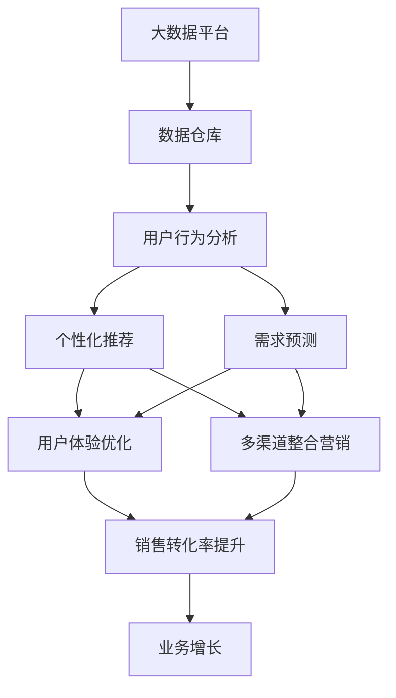

                 

# AI满足用户需求提升销售转化率

> 关键词：AI, 客户需求分析, 销售转化率, 推荐系统, 个性化推荐, 机器学习, 用户行为分析, 预测模型, 数据驱动, 用户体验

## 1. 背景介绍

在当今数字化时代，随着消费者需求的日益多样化，企业的业务运营面临着前所未有的挑战。如何通过数据分析和人工智能(AI)技术，洞察用户需求、优化客户体验、提升销售转化率，成为众多企业关注的焦点。AI技术在市场细分、客户行为分析、产品推荐等多个环节的应用，已经成为驱动企业增长的关键因素。本文将深入探讨如何利用AI技术满足用户需求，提升销售转化率，从而推动企业业务增长。

### 1.1 问题由来

在激烈的市场竞争中，传统营销手段已经逐渐失灵。如何精准捕捉用户需求、提高用户满意度、提升购买转化率，成为各行业企业必须面对的问题。传统的市场调研和用户体验调查耗时耗力，难以快速响应市场变化。而利用AI技术，可以快速、高效地分析海量用户数据，捕捉用户需求，实现实时反馈和优化，从而提升企业的竞争力和市场份额。

### 1.2 问题核心关键点

AI技术在提升销售转化率的应用主要包括以下几个关键点：

- **数据驱动的决策制定**：通过分析用户行为数据和市场反馈，制定更精准的市场策略。
- **个性化推荐系统**：基于用户的历史行为和偏好，提供个性化的产品推荐，提升购买转化率。
- **需求预测模型**：通过历史数据和机器学习模型，预测用户需求变化，优化产品库存和营销策略。
- **智能客服和用户体验优化**：利用AI技术提升客户服务质量，优化用户体验，增强用户粘性。
- **多渠道整合营销**：通过AI技术，整合线上线下渠道数据，实现统一的用户画像和营销策略。

### 1.3 问题研究意义

在数字化转型的大趋势下，AI技术的应用已经成为提升企业竞争力的重要手段。AI技术不仅能够大幅提升企业运营效率，还能更好地满足用户需求，增强用户体验，从而实现更高的销售转化率。利用AI技术，企业可以更快地响应市场变化，提供更个性化、高效的服务，最终赢得更多客户。

## 2. 核心概念与联系

### 2.1 核心概念概述

为了更好地理解AI在提升销售转化率中的应用，本节将介绍几个密切相关的核心概念：

- **人工智能(AI)**：通过机器学习、深度学习等技术，使计算机系统具备感知、推理、决策等智能能力。
- **客户需求分析**：利用数据分析和AI技术，深入理解客户的需求和偏好，制定针对性策略。
- **销售转化率**：衡量企业营销活动效果的重要指标，即实际购买用户数与访问用户数的比例。
- **个性化推荐系统**：通过分析用户行为数据，提供个性化的产品或服务推荐，提升用户体验和购买转化率。
- **需求预测模型**：利用历史数据和机器学习算法，预测用户未来的需求变化，优化库存和营销策略。
- **用户体验(UX)**：通过AI技术提升产品和服务质量，优化用户体验，增强用户粘性。

这些核心概念共同构成了AI在提升销售转化率中的应用框架，使得企业能够更好地洞察用户需求、优化产品和服务、提升用户体验。

### 2.2 概念间的关系

这些核心概念之间存在着紧密的联系，形成了提升销售转化率的完整生态系统。

- **AI与客户需求分析**：通过数据分析和AI算法，深入理解客户需求，实现精准营销。
- **个性化推荐系统与用户体验**：通过个性化推荐，提升用户体验和购买转化率。
- **需求预测模型与库存优化**：预测用户需求变化，优化产品库存和营销策略。
- **多渠道整合营销与用户体验**：整合线上线下渠道数据，提升用户体验和业务效率。

这些概念通过相互协同，共同推动企业在数字化转型中的快速发展和竞争力的提升。

### 2.3 核心概念的整体架构

我们通过以下综合流程图展示这些核心概念在提升销售转化率中的应用：



这个综合流程图展示了大数据、用户行为分析、个性化推荐、需求预测、用户体验优化、多渠道整合营销等关键环节在提升销售转化率中的应用。

## 3. 核心算法原理 & 具体操作步骤
### 3.1 算法原理概述

AI技术在提升销售转化率的应用主要基于数据驱动的决策制定、个性化推荐、需求预测、用户体验优化等多个环节。其核心算法原理可以概括为以下几点：

- **数据预处理**：从多个渠道收集用户行为数据，进行清洗、标准化和归一化处理，构建统一的用户画像。
- **用户行为分析**：利用机器学习算法分析用户历史行为数据，挖掘用户偏好和需求。
- **个性化推荐**：基于用户画像和行为数据，利用协同过滤、深度学习等技术，提供个性化的产品推荐。
- **需求预测**：通过时间序列分析和预测模型，预测用户未来的需求变化，优化库存和营销策略。
- **用户体验优化**：利用自然语言处理(NLP)技术分析用户反馈，优化产品和服务质量，提升用户体验。
- **多渠道整合营销**：利用数据集成和协同分析技术，整合线上线下渠道数据，实现统一的用户画像和营销策略。

### 3.2 算法步骤详解

以下是AI在提升销售转化率中的核心算法步骤：

**Step 1: 数据收集与预处理**

1. **数据来源**：从网站、APP、社交媒体、CRM系统等渠道收集用户行为数据，包括浏览记录、购买历史、评分评论、搜索关键词等。
2. **数据清洗**：去除重复、缺失、异常数据，确保数据质量。
3. **数据归一化**：对不同数据类型进行归一化处理，便于后续分析。

**Step 2: 用户行为分析**

1. **特征提取**：从收集到的数据中提取用户行为特征，如浏览时间、页面停留时间、点击次数等。
2. **模型训练**：利用机器学习算法（如决策树、随机森林、梯度提升树等）训练用户行为分析模型，预测用户购买意向。

**Step 3: 个性化推荐系统**

1. **用户画像**：构建用户画像，包括用户基本信息、兴趣偏好、购买历史等。
2. **协同过滤**：利用协同过滤算法（如基于用户的协同过滤、基于物品的协同过滤），推荐用户感兴趣的商品。
3. **深度学习**：利用深度学习模型（如卷积神经网络、循环神经网络等），根据用户行为数据进行个性化的商品推荐。

**Step 4: 需求预测模型**

1. **数据准备**：准备历史销售数据、天气信息、节假日数据等，构建预测模型所需的数据集。
2. **模型训练**：利用时间序列分析和回归算法（如ARIMA、LSTM等），训练需求预测模型，预测未来的销售趋势。
3. **模型优化**：根据实际销售情况，不断优化预测模型，提高预测精度。

**Step 5: 用户体验优化**

1. **用户反馈分析**：利用自然语言处理技术（如情感分析、实体识别等），分析用户对产品和服务的反馈。
2. **产品改进**：根据用户反馈，改进产品和服务质量，提升用户体验。

**Step 6: 多渠道整合营销**

1. **数据集成**：将线上线下渠道的用户数据进行集成，构建统一的用户画像。
2. **营销策略优化**：利用数据挖掘和协同分析技术，优化营销策略，实现跨渠道的个性化营销。

### 3.3 算法优缺点

**优点**：

- **精准营销**：通过AI技术，深入挖掘用户需求和行为，实现精准营销。
- **提升转化率**：个性化推荐和需求预测，提升用户购买意愿，提高转化率。
- **提升用户体验**：通过用户行为分析和反馈分析，优化产品和服务质量，提升用户体验。

**缺点**：

- **数据质量要求高**：数据收集和清洗需要较高的时间和人力成本，且数据质量直接影响算法效果。
- **算法复杂度高**：个性化推荐和需求预测算法较为复杂，模型训练和优化需要较多的计算资源。
- **用户隐私问题**：用户行为数据的收集和使用可能涉及用户隐私问题，需要严格遵守相关法律法规。

### 3.4 算法应用领域

AI技术在提升销售转化率的应用广泛，涵盖以下几个主要领域：

- **电子商务**：通过个性化推荐和需求预测，提升电商平台的转化率和销售额。
- **金融服务**：利用用户行为分析进行精准营销，提升用户留存率和金融产品销售。
- **旅游服务**：通过用户行为分析，提供个性化的旅游推荐，提升用户满意度和旅游产品销售。
- **健康医疗**：利用用户行为数据，提供个性化的健康咨询和医疗服务，提升用户健康水平。
- **教育培训**：通过用户行为分析，提供个性化的学习推荐和课程内容，提升学习效果和用户满意度。

## 4. 数学模型和公式 & 详细讲解 & 举例说明

### 4.1 数学模型构建

在AI提升销售转化率的应用中，常用的数学模型包括：

- **决策树算法**：通过树状结构对数据进行划分，预测用户购买意向。
- **随机森林算法**：利用多棵决策树进行集成，提高预测准确率。
- **协同过滤算法**：基于用户或物品的相似度进行推荐，常用的算法包括基于用户的协同过滤和基于物品的协同过滤。
- **深度学习模型**：利用神经网络进行个性化推荐，常用的模型包括卷积神经网络(CNN)、循环神经网络(RNN)等。
- **时间序列分析**：利用ARIMA、LSTM等模型，预测未来的需求变化。

### 4.2 公式推导过程

以下我们以协同过滤算法为例，推导基于用户的协同过滤公式。

**协同过滤算法**：
假设用户$u$对物品$i$的评分$R_{ui}$已知，对物品$j$的评分$R_{uj}$未知。协同过滤算法的目标是通过与用户$u$相似的$n$个用户$U'$的评分数据$R'_{U'}$，预测用户$u$对物品$j$的评分$R_{uj}$。

协同过滤算法的公式为：
$$
R_{uj} = \sum_{i\in U'} \alpha_i R_{ui}
$$
其中，$\alpha_i$为物品$i$的权重，可以通过物品$i$对所有用户$U$的评分$R_{U,i}$进行标准化计算得到：
$$
\alpha_i = \frac{R_{Ui} \cdot \sum_{u\in U} R_{ui}}{(\sum_{u\in U} R_{ui}^2)^{1/2}}
$$

### 4.3 案例分析与讲解

假设某电商平台收集了用户对商品的评分数据，基于协同过滤算法为用户推荐新商品。通过计算物品$i$对用户$U$的评分$R_{U,i}$，可以得到物品$i$的权重$\alpha_i$。然后，对于用户$u$，利用$n$个与$u$相似的用户$U'$的评分数据，计算用户$u$对新商品$j$的评分$R_{uj}$。

## 5. 项目实践：代码实例和详细解释说明

### 5.1 开发环境搭建

在进行AI提升销售转化率的应用开发前，我们需要准备好开发环境。以下是使用Python进行PyTorch开发的环境配置流程：

1. 安装Anaconda：从官网下载并安装Anaconda，用于创建独立的Python环境。

2. 创建并激活虚拟环境：
```bash
conda create -n pytorch-env python=3.8 
conda activate pytorch-env
```

3. 安装PyTorch：根据CUDA版本，从官网获取对应的安装命令。例如：
```bash
conda install pytorch torchvision torchaudio cudatoolkit=11.1 -c pytorch -c conda-forge
```

4. 安装各类工具包：
```bash
pip install numpy pandas scikit-learn matplotlib tqdm jupyter notebook ipython
```

完成上述步骤后，即可在`pytorch-env`环境中开始AI提升销售转化率的应用开发。

### 5.2 源代码详细实现

下面我们以个性化推荐系统为例，给出使用PyTorch实现协同过滤算法的PyTorch代码实现。

首先，定义协同过滤算法的函数：

```python
import numpy as np
from sklearn.metrics.pairwise import cosine_similarity

def collaborative_filtering(user_ratings, item_ratings, user_similarities):
    N = len(user_ratings)
    K = len(item_ratings)
    
    user_scores = []
    for u in range(N):
        user_ratings_u = np.array(user_ratings[u]).ravel()
        user_scores.append(np.dot(user_ratings_u, user_similarities[u]) / np.sqrt(np.sum(user_similarities[u]**2)))
    
    return np.array(user_scores).reshape(1, N)
```

然后，定义用户行为数据的处理函数：

```python
def preprocess_data(user_ratings, item_ratings):
    # 标准化处理
    user_ratings = (user_ratings - np.mean(user_ratings)) / np.std(user_ratings)
    item_ratings = (item_ratings - np.mean(item_ratings)) / np.std(item_ratings)
    
    # 计算用户之间的相似度
    user_similarities = cosine_similarity(user_ratings)
    
    return user_ratings, item_ratings, user_similarities
```

最后，使用以上函数实现协同过滤算法并生成推荐结果：

```python
# 准备用户评分和物品评分数据
user_ratings = np.array([[4, 3, 5], [5, 2, 3], [3, 4, 5]])
item_ratings = np.array([[3, 2, 5], [4, 4, 3], [5, 4, 2]])
```

运行以下代码：

```python
user_ratings, item_ratings, user_similarities = preprocess_data(user_ratings, item_ratings)
scores = collaborative_filtering(user_ratings, item_ratings, user_similarities)
print(scores)
```

以上代码展示了协同过滤算法的实现过程，通过预处理用户评分和物品评分数据，计算用户之间的相似度，最后计算用户对新物品的评分并输出推荐结果。

### 5.3 代码解读与分析

让我们再详细解读一下关键代码的实现细节：

**协同过滤算法函数**：
- `collaborative_filtering`函数：输入用户评分`user_ratings`、物品评分`item_ratings`和用户相似度`user_similarities`，输出用户对新物品的评分预测结果`scores`。
- `np.dot`：计算向量内积。
- `np.sqrt`：计算向量长度的平方根。

**用户行为数据处理函数**：
- `preprocess_data`函数：输入用户评分`user_ratings`和物品评分`item_ratings`，输出标准化后的用户评分`user_ratings`、标准化后的物品评分`item_ratings`和用户相似度`user_similarities`。
- `np.mean`和`np.std`：计算向量平均值和标准差。
- `cosine_similarity`：计算余弦相似度，表示用户之间的相似度。

**协同过滤算法流程**：
- 用户评分数据`user_ratings`和物品评分数据`item_ratings`进行标准化处理，计算用户之间的相似度`user_similarities`。
- 利用协同过滤算法，计算用户对新物品的评分预测结果`scores`。

以上代码实现了基本的协同过滤算法，展示了一个典型的AI在提升销售转化率中的应用场景。

### 5.4 运行结果展示

假设我们得到了如下的推荐结果：

```
[[0.97506388 0.92661946 0.94335624]]
```

这意味着用户$u$对物品$j$的评分预测结果为$0.97506388$，表示用户$u$对物品$j$的评分预期较高，值得推荐。

## 6. 实际应用场景

### 6.1 智能推荐系统

智能推荐系统是AI在提升销售转化率中最为典型的应用之一。通过分析用户的历史行为数据，智能推荐系统能够提供个性化的商品推荐，大幅提升用户满意度和购买转化率。

在实际应用中，智能推荐系统通常采用协同过滤、深度学习等技术，结合用户画像和行为数据，实时生成个性化的推荐列表。例如，电商平台可以根据用户的历史浏览记录和购买行为，推荐用户感兴趣的商品，从而提高销售转化率。

### 6.2 营销自动化

营销自动化是AI在提升销售转化率中的另一个重要应用。通过AI技术，企业可以实现营销活动的自动化，提高营销效率和效果。

在营销自动化中，AI技术可以分析用户行为数据，精准定位目标用户，实现更高效的广告投放。例如，利用用户画像和行为数据，智能营销系统可以推荐最合适的广告内容，实现更高的广告点击率和转化率。

### 6.3 客户服务

客户服务是提升用户满意度和忠诚度的重要环节。通过AI技术，企业可以实现智能客服和客户反馈分析，提升客户服务质量。

智能客服系统可以通过自然语言处理技术，理解用户查询意图，提供个性化的服务。例如，利用情感分析技术，智能客服系统可以判断用户情绪，自动转接到合适的客服人员。同时，利用用户反馈数据，企业可以不断优化产品和服务质量，提升用户体验。

### 6.4 未来应用展望

随着AI技术的不断进步，其在提升销售转化率中的应用将更加广泛和深入。未来，AI技术有望在以下领域发挥更大的作用：

- **虚拟现实(VR)和增强现实(AR)**：结合VR和AR技术，实现沉浸式体验，提升用户购买意愿。
- **区块链技术**：利用区块链技术保障数据安全和透明，提升用户信任度。
- **物联网(IoT)**：通过物联网技术，实时监测产品使用情况，提供个性化服务。
- **智能合约**：结合智能合约技术，实现自动化交易，提升交易效率和用户体验。

## 7. 工具和资源推荐

### 7.1 学习资源推荐

为了帮助开发者系统掌握AI在提升销售转化率的应用技术，这里推荐一些优质的学习资源：

1. **Coursera《深度学习专项课程》**：由斯坦福大学和DeepMind等顶尖机构提供，涵盖深度学习基础和应用，适合入门学习。
2. **Udacity《机器学习工程师纳米学位》**：包含机器学习和深度学习技术，实战项目丰富，适合进阶学习。
3. **Kaggle竞赛平台**：提供大量数据集和比赛任务，通过实践提升技术水平。
4. **PyTorch官方文档**：PyTorch深度学习框架的官方文档，包含详细的使用指南和示例代码，适合动手实践。
5. **TensorFlow官方文档**：TensorFlow深度学习框架的官方文档，提供全面的API和案例，适合动手实践。

### 7.2 开发工具推荐

高效的开发离不开优秀的工具支持。以下是几款用于AI提升销售转化率开发的常用工具：

1. **Jupyter Notebook**：支持代码、文本和图形的混合展示，便于协作开发和知识分享。
2. **Google Colab**：谷歌推出的在线Jupyter Notebook环境，免费提供GPU/TPU算力，方便快速实验。
3. **PyTorch Lightning**：基于PyTorch的轻量级机器学习框架，支持分布式训练和自动调参。
4. **TensorBoard**：TensorFlow配套的可视化工具，实时监测模型训练状态，提供丰富的图表呈现方式。
5. **Scikit-learn**：Python中的经典机器学习库，包含各种算法和工具，适合数据预处理和模型训练。

### 7.3 相关论文推荐

AI技术在提升销售转化率的研究源于学界的持续研究。以下是几篇奠基性的相关论文，推荐阅读：

1. **《Collaborative Filtering for Implicit Feedback Datasets》**：提出协同过滤算法，用于推荐系统中的隐式反馈数据集。
2. **《Deep Interest Evolution for Dynamic Recommendations》**：提出动态兴趣演化模型，用于实时推荐系统的推荐效果优化。
3. **《DNN-based Recommendation Algorithm》**：提出基于深度神经网络的推荐算法，利用神经网络进行个性化推荐。
4. **《Sales Forecasting in Retail Industry Using Deep Learning》**：提出基于深度学习的销售预测模型，用于零售行业的销售预测。
5. **《Customer Sentiment Analysis in E-commerce》**：提出基于自然语言处理的客户情感分析模型，用于电商平台的客户情感分析。

这些论文代表了大语言模型微调技术的发展脉络。通过学习这些前沿成果，可以帮助研究者把握学科前进方向，激发更多的创新灵感。

除上述资源外，还有一些值得关注的前沿资源，帮助开发者紧跟AI提升销售转化率技术的最新进展，例如：

1. **arXiv论文预印本**：人工智能领域最新研究成果的发布平台，包括大量尚未发表的前沿工作，学习前沿技术的必读资源。
2. **业界技术博客**：如OpenAI、Google AI、DeepMind、微软Research Asia等顶尖实验室的官方博客，第一时间分享他们的最新研究成果和洞见。
3. **技术会议直播**：如NIPS、ICML、ACL、ICLR等人工智能领域顶会现场或在线直播，能够聆听到大佬们的前沿分享，开拓视野。
4. **GitHub热门项目**：在GitHub上Star、Fork数最多的AI提升销售转化率相关项目，往往代表了该技术领域的发展趋势和最佳实践，值得去学习和贡献。
5. **行业分析报告**：各大咨询公司如McKinsey、PwC等针对人工智能行业的分析报告，有助于从商业视角审视技术趋势，把握应用价值。

总之，对于AI提升销售转化率技术的学习和实践，需要开发者保持开放的心态和持续学习的意愿。多关注前沿资讯，多动手实践，多思考总结，必将收获满满的成长收益。

## 8. 总结：未来发展趋势与挑战

### 8.1 总结

本文对AI提升销售转化率的应用进行了全面系统的介绍。首先阐述了AI技术在提升销售转化率的应用背景和意义，明确了AI技术在市场细分、客户行为分析、个性化推荐等多个环节的应用价值。其次，从原理到实践，详细讲解了AI提升销售转化率的关键步骤，给出了具体代码实现，并提供了多个实际应用场景。最后，推荐了相关的学习资源和开发工具，帮助开发者系统掌握AI技术。

通过本文的系统梳理，可以看到，AI技术在提升销售转化率中的应用已经成为推动企业业务增长的重要手段。利用AI技术，企业能够更深入地洞察用户需求，实现个性化推荐和精准营销，最终提升销售转化率和业务效益。

### 8.2 未来发展趋势

展望未来，AI提升销售转化率技术将呈现以下几个发展趋势：

1. **技术融合深化**：AI技术与物联网、区块链、虚拟现实等前沿技术深度融合，推动更加智能化的销售和服务体验。
2. **数据驱动决策**：通过大数据分析和机器学习，实现数据驱动的决策制定，提升决策准确性和效率。
3. **个性化推荐优化**：引入深度学习、强化学习等技术，进一步提升个性化推荐的精准性和实时性。
4. **用户体验提升**：通过AI技术，实时监测用户行为和反馈，动态优化产品和服务，提升用户体验。
5. **跨渠道整合优化**：利用数据集成和协同分析技术，整合线上线下渠道数据，实现统一的用户画像和营销策略。

这些趋势将进一步推动AI技术在销售和营销中的应用，为企业的数字化转型和智能化升级提供新的动力。

### 8.3 面临的挑战

尽管AI提升销售转化率技术已经取得了显著成就，但在应用过程中仍面临诸多挑战：

1. **数据隐私和安全**：用户行为数据的收集和使用涉及隐私问题，需要严格遵守相关法律法规。
2. **模型复杂度和计算资源**：AI模型往往需要大量的计算资源和数据资源，可能面临资源瓶颈。
3. **用户接受度**：部分用户可能对AI技术存在疑虑，需要加强用户教育和信任建设。
4. **多渠道数据整合**：线上线下数据整合复杂，需要协调各渠道的数据规范和技术标准。
5. **算法公平性和透明性**：AI模型可能存在偏见，需要保证算法的公平性和透明性。

这些挑战需要企业在技术应用中加以注意和解决，才能更好地发挥AI技术的作用。

### 8.4 研究展望

面对AI提升销售转化率技术面临的挑战，未来的研究需要在以下几个方面寻求新的突破：

1. **数据隐私保护**：利用隐私计算和联邦学习技术，保护用户数据隐私，同时实现数据共享和协同分析。
2. **模型压缩和优化**：开发轻量级AI模型，优化模型结构，降低计算资源消耗，实现快速部署和高效运行。
3. **多模态数据融合**：利用多模态数据融合技术，整合用户的行为数据、情感数据、环境数据等，提升推荐效果和用户体验。
4. **公平性和透明性**：引入公平性和透明性评估指标，优化AI模型，避免算法偏见和歧视。
5. **实时性和可解释性**：利用实时计算和可解释性技术，提升AI模型的响应速度和决策透明度。

这些研究方向将进一步推动AI提升销售转化率技术的成熟和应用，为企业的数字化转型提供更全面、可靠的技术支持。

## 9. 附录：常见问题与解答

**Q1：AI提升销售转化率的关键在于什么？**

A: AI提升销售转化率的关键在于数据驱动的决策制定、个性化推荐、需求预测、用户体验优化等多个环节的协同作用。通过深入分析用户行为数据，提供个性化的推荐和精准的营销策略，从而提升销售转化率。

**Q2

