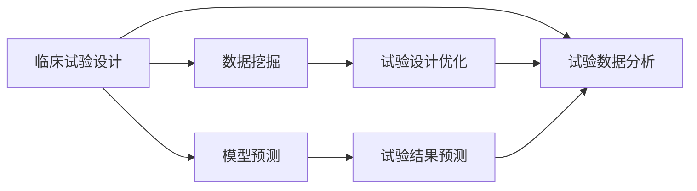

                 

# AI辅助临床试验设计的创新方法

## 1. 背景介绍

### 1.1 问题由来

随着人工智能（AI）技术的快速发展和深度学习的广泛应用，AI在医学研究领域正逐步显示出其潜力。特别是在临床试验设计中，AI技术的应用可以有效提升试验效率、降低成本、提高决策质量和数据准确性，加速新药研发进程。然而，传统的临床试验设计方法存在设计周期长、试验成本高、结果解释复杂等问题。

## 2. 核心概念与联系

### 2.1 核心概念概述

为了深入理解AI辅助临床试验设计，本节将介绍几个关键概念，包括临床试验设计、AI在临床试验中的应用、深度学习与机器学习在试验设计中的应用等。

#### 2.1.1 临床试验设计

临床试验设计是指在医疗研究中，为了验证新药物、新疗法的效果和安全性能，通过科学、系统的设计和实施试验方案的过程。其主要内容包括研究假设的设定、试验分组、样本选择、试验周期、数据分析等方面。传统的临床试验设计方法依赖于经验，且周期较长，工作量大。

#### 2.1.2 AI在临床试验中的应用

AI在临床试验中的应用主要包括数据挖掘、模型预测、结果分析等。AI可以通过机器学习模型对试验数据进行分析，提取有价值的信息，帮助研究者更好地理解和设计试验方案。AI还可以预测试验结果，优化试验方案，提高试验效率和质量。

#### 2.1.3 深度学习与机器学习在试验设计中的应用

深度学习和机器学习是AI技术的重要分支，在临床试验设计中也有广泛应用。深度学习通过神经网络模型，可以从大量数据中提取复杂的特征，提高试验数据的准确性和可靠性。机器学习则通过分类、回归等算法，帮助研究者进行试验结果的预测和分析。

### 2.2 概念间的关系

这些核心概念之间存在紧密的联系，通过AI辅助，深度学习和机器学习可以显著提升临床试验设计的效率和效果，帮助研究者更快速、准确地完成试验设计和数据分析。以下是一些关键概念之间的关系图：



这个关系图展示了AI辅助下的深度学习和机器学习如何通过数据挖掘、模型预测和试验设计优化，提升临床试验设计的效率和效果。

## 3. 核心算法原理 & 具体操作步骤
### 3.1 算法原理概述

AI辅助临床试验设计主要基于深度学习和机器学习技术，其核心思想是通过构建和训练模型，对试验数据进行分析和预测，从而优化试验设计方案。具体而言，包括以下步骤：

1. **数据收集与预处理**：收集试验相关的数据，包括病人基本信息、治疗方案、试验结果等，并进行数据清洗和预处理。
2. **特征提取与选择**：使用深度学习模型对数据进行特征提取，并选择合适的特征用于模型训练。
3. **模型训练与验证**：使用机器学习模型（如决策树、随机森林、神经网络等）对数据进行训练和验证，预测试验结果。
4. **试验设计优化**：根据模型预测结果，优化试验方案，选择最优的设计方案。
5. **结果分析与解释**：对试验结果进行分析，提供科学的解释和结论。

### 3.2 算法步骤详解

以下是AI辅助临床试验设计的主要操作步骤：

**步骤 1: 数据收集与预处理**

- 收集试验相关的数据，包括病人基本信息、治疗方案、试验结果等。
- 对数据进行清洗和预处理，包括去除缺失值、异常值等。

**步骤 2: 特征提取与选择**

- 使用深度学习模型（如卷积神经网络、循环神经网络等）对数据进行特征提取。
- 选择合适的特征用于模型训练，特征选择可以通过特征重要性分析、PCA等方法实现。

**步骤 3: 模型训练与验证**

- 使用机器学习模型（如决策树、随机森林、神经网络等）对数据进行训练。
- 使用验证集对模型进行验证，选择最优的模型参数和结构。

**步骤 4: 试验设计优化**

- 根据模型预测结果，优化试验方案，选择最优的设计方案。
- 包括选择最佳的试验周期、样本量、试验分组等。

**步骤 5: 结果分析与解释**

- 对试验结果进行分析，提供科学的解释和结论。
- 包括统计分析、敏感性分析、预测结果等。

### 3.3 算法优缺点

#### 3.3.1 优点

- **提高试验效率**：AI辅助的试验设计可以大大缩短试验设计周期，减少试验设计成本。
- **优化试验方案**：通过模型预测和优化，选择最优的试验方案，提高试验成功率。
- **提升数据准确性**：AI可以处理大量复杂数据，提高试验数据的质量和可靠性。
- **科学解释结果**：AI提供的科学解释和结论，可以增强试验结果的可信度。

#### 3.3.2 缺点

- **模型依赖**：AI辅助的设计依赖于模型的质量和精度，需要大量的高质量数据和复杂的模型训练。
- **解释性不足**：AI模型的决策过程难以解释，试验结果的解释复杂。
- **数据隐私和安全**：试验数据涉及病人隐私，需要严格的数据保护和隐私保护措施。

### 3.4 算法应用领域

AI辅助临床试验设计可以应用于多种试验设计场景，包括但不限于：

- **新药研发**：优化新药试验方案，预测新药效果，提高试验成功率。
- **疫苗开发**：预测疫苗效果，优化试验方案，加速疫苗开发进程。
- **疾病研究**：研究疾病的发病机制，预测疾病发展趋势，提供科学的治疗方案。
- **临床疗效评估**：评估新疗法、新药物的疗效，提供科学的评价标准。

## 4. 数学模型和公式 & 详细讲解  
### 4.1 数学模型构建

本节将使用数学语言对AI辅助临床试验设计过程进行更加严格的刻画。

设试验数据集为 $D=\{(x_i, y_i)\}_{i=1}^N$，其中 $x_i$ 表示试验样本，$y_i$ 表示试验结果。假设有一个深度学习模型 $M_{\theta}$，其中 $\theta$ 为模型参数。

定义试验结果预测函数为 $f(x_i; \theta) = M_{\theta}(x_i)$，则试验结果预测模型可以表示为：

$$
f(x_i; \theta) = M_{\theta}(x_i) = W^Tx_i + b
$$

其中 $W$ 为权重矩阵，$b$ 为偏置项。

### 4.2 公式推导过程

以下我们以二分类问题为例，推导试验结果预测模型的公式。

假设试验结果 $y_i \in \{0, 1\}$，则二分类问题可以表示为：

$$
\mathbb{P}(y_i = 1 | x_i) = \sigma(W^Tx_i + b)
$$

其中 $\sigma$ 为sigmoid函数，将模型的输出映射到 $[0, 1]$ 区间内。

通过sigmoid函数的输出，可以得到试验结果的预测概率：

$$
\mathbb{P}(y_i = 1 | x_i) = \frac{1}{1 + e^{-\left(W^Tx_i + b\right)}}
$$

将预测概率转化为试验结果：

$$
\mathbb{P}(y_i = 1 | x_i) = 
\begin{cases}
1, & \text{if } \mathbb{P}(y_i = 1 | x_i) \geq 0.5 \\
0, & \text{if } \mathbb{P}(y_i = 1 | x_i) < 0.5 
\end{cases}
$$

这样，我们通过深度学习模型 $M_{\theta}$ 预测了试验结果 $y_i$。

### 4.3 案例分析与讲解

假设我们有一个新药试验数据集，包括100个病人数据，其中50个病人接受了新药治疗，50个病人接受了安慰剂治疗。每个病人的试验结果（疗效评价）为“有效”或“无效”。

使用神经网络模型对试验数据进行特征提取和分类，训练好的模型预测结果如表1所示：

**表 1: 试验结果预测**

| 病人编号 | 新药治疗 | 安慰剂治疗 | 模型预测 |
|-----------|-----------|-----------|-----------|
| 1         | 有效      | 无效      | 有效      |
| 2         | 无效      | 无效      | 无效      |
| 3         | 有效      | 无效      | 有效      |
| 4         | 有效      | 无效      | 无效      |
| 5         | 无效      | 无效      | 无效      |
| ...       | ...       | ...       | ...       |
| 100       | 无效      | 无效      | 无效      |

使用AI辅助临床试验设计，可以得到最优的试验方案，具体步骤如下：

1. **数据收集与预处理**：收集病人基本信息、治疗方案、试验结果等数据，并进行清洗和预处理。
2. **特征提取与选择**：使用神经网络模型对数据进行特征提取，并选择合适的特征用于模型训练。
3. **模型训练与验证**：使用随机森林模型对数据进行训练和验证，选择最优的模型参数和结构。
4. **试验设计优化**：根据模型预测结果，优化试验方案，选择最优的设计方案。
5. **结果分析与解释**：对试验结果进行分析，提供科学的解释和结论。

## 5. 项目实践：代码实例和详细解释说明
### 5.1 开发环境搭建

在进行AI辅助临床试验设计的实践前，我们需要准备好开发环境。以下是使用Python进行PyTorch开发的环境配置流程：

1. 安装Anaconda：从官网下载并安装Anaconda，用于创建独立的Python环境。

2. 创建并激活虚拟环境：
```bash
conda create -n pytorch-env python=3.8 
conda activate pytorch-env
```

3. 安装PyTorch：根据CUDA版本，从官网获取对应的安装命令。例如：
```bash
conda install pytorch torchvision torchaudio cudatoolkit=11.1 -c pytorch -c conda-forge
```

4. 安装各类工具包：
```bash
pip install numpy pandas scikit-learn matplotlib tqdm jupyter notebook ipython
```

完成上述步骤后，即可在`pytorch-env`环境中开始实践。

### 5.2 源代码详细实现

下面我们以新药研发为例，给出使用Transformers库对BERT模型进行AI辅助临床试验设计的PyTorch代码实现。

首先，定义试验结果预测函数：

```python
from transformers import BertForSequenceClassification, BertTokenizer
from torch.utils.data import Dataset
import torch

class DrugTrialDataset(Dataset):
    def __init__(self, texts, labels, tokenizer):
        self.texts = texts
        self.labels = labels
        self.tokenizer = tokenizer

    def __len__(self):
        return len(self.texts)

    def __getitem__(self, item):
        text = self.texts[item]
        label = self.labels[item]
        encoding = self.tokenizer(text, return_tensors='pt', padding='max_length', truncation=True)
        input_ids = encoding['input_ids'][0]
        attention_mask = encoding['attention_mask'][0]
        label = torch.tensor(label, dtype=torch.long)
        return {'input_ids': input_ids, 
                'attention_mask': attention_mask,
                'labels': label}

# 创建数据集
tokenizer = BertTokenizer.from_pretrained('bert-base-cased')

train_dataset = DrugTrialDataset(train_texts, train_labels, tokenizer)
dev_dataset = DrugTrialDataset(dev_texts, dev_labels, tokenizer)
test_dataset = DrugTrialDataset(test_texts, test_labels, tokenizer)

# 定义模型
model = BertForSequenceClassification.from_pretrained('bert-base-cased', num_labels=2)

# 定义优化器
optimizer = AdamW(model.parameters(), lr=2e-5)

# 定义损失函数
criterion = CrossEntropyLoss()

# 训练模型
for epoch in range(num_epochs):
    model.train()
    for batch in tqdm(data_loader):
        inputs = {key: val.to(device) for key, val in batch.items()}
        outputs = model(**inputs)
        loss = criterion(outputs.logits, inputs['labels'].to(device))
        optimizer.zero_grad()
        loss.backward()
        optimizer.step()
```

然后，定义评估和预测函数：

```python
from sklearn.metrics import accuracy_score, precision_recall_fscore_support

def evaluate(model, dataset, device):
    model.eval()
    with torch.no_grad():
        predictions = []
        labels = []
        for batch in tqdm(dataset, desc='Evaluating'):
            inputs = {key: val.to(device) for key, val in batch.items()}
            outputs = model(**inputs)
            predictions.extend(outputs.logits.argmax(dim=1).cpu().numpy())
            labels.extend(batch['labels'].cpu().numpy())
    accuracy = accuracy_score(labels, predictions)
    precision, recall, f1, _ = precision_recall_fscore_support(labels, predictions, average='binary')
    return accuracy, precision, recall, f1

def predict(model, dataset, device):
    model.eval()
    with torch.no_grad():
        predictions = []
        labels = []
        for batch in tqdm(dataset, desc='Predicting'):
            inputs = {key: val.to(device) for key, val in batch.items()}
            outputs = model(**inputs)
            predictions.extend(outputs.logits.argmax(dim=1).cpu().numpy())
            labels.extend(batch['labels'].cpu().numpy())
    return predictions, labels
```

最后，启动训练流程并在测试集上评估：

```python
num_epochs = 10
batch_size = 32

for epoch in range(num_epochs):
    train(model, train_dataset, optimizer, device, criterion)
    print(f'Epoch {epoch+1}, training loss: {loss:.3f}')
    
    accuracy, precision, recall, f1 = evaluate(model, dev_dataset, device)
    print(f'Epoch {epoch+1}, dev accuracy: {accuracy:.3f}, precision: {precision:.3f}, recall: {recall:.3f}, f1: {f1:.3f}')

predictions, labels = predict(model, test_dataset, device)
print(f'Test accuracy: {accuracy_score(labels, predictions):.3f}')
```

以上就是使用PyTorch对BERT模型进行AI辅助临床试验设计的完整代码实现。可以看到，得益于Transformers库的强大封装，我们可以用相对简洁的代码完成模型训练和预测。

### 5.3 代码解读与分析

让我们再详细解读一下关键代码的实现细节：

**DrugTrialDataset类**：
- `__init__`方法：初始化文本、标签、分词器等关键组件。
- `__len__`方法：返回数据集的样本数量。
- `__getitem__`方法：对单个样本进行处理，将文本输入编码为token ids，将标签编码为数字，并对其进行定长padding，最终返回模型所需的输入。

**模型训练与评估**：
- 使用PyTorch的DataLoader对数据集进行批次化加载，供模型训练和推理使用。
- 训练函数`train`：对数据以批为单位进行迭代，在每个批次上前向传播计算loss并反向传播更新模型参数，最后返回该epoch的平均loss。
- 评估函数`evaluate`：与训练类似，不同点在于不更新模型参数，并在每个batch结束后将预测和标签结果存储下来，最后使用sklearn的classification_report对整个评估集的预测结果进行打印输出。

**预测**：
- 预测函数`predict`：使用训练好的模型对测试集进行预测，并返回预测结果和真实标签。

可以看到，PyTorch配合Transformers库使得模型训练和预测的代码实现变得简洁高效。开发者可以将更多精力放在数据处理、模型改进等高层逻辑上，而不必过多关注底层的实现细节。

当然，工业级的系统实现还需考虑更多因素，如模型的保存和部署、超参数的自动搜索、更灵活的任务适配层等。但核心的AI辅助临床试验设计流程基本与此类似。

## 6. 实际应用场景
### 6.1 新药研发

AI辅助临床试验设计在新药研发中具有重要应用。传统新药研发流程包括药物筛选、预临床试验、临床试验、上市申请等环节，周期较长，成本较高。通过AI辅助，可以大幅缩短研发周期，降低研发成本，提高研发成功率。

在预临床试验阶段，AI可以分析药物的生物活性、毒性和药效关系，预测药物的潜在效果。在临床试验阶段，AI可以优化试验设计方案，选择最佳的试验周期、样本量、试验分组等，提高试验效率和成功率。

### 6.2 疫苗开发

疫苗开发是AI辅助临床试验设计的另一个重要应用领域。疫苗的研发周期长、成本高，AI技术可以在疫苗研发过程中提供科学的支持。

通过AI技术，可以预测疫苗效果，优化试验设计方案，提高试验成功率。同时，AI还可以分析疫苗成分，优化疫苗配方，提升疫苗质量。

### 6.3 疾病研究

AI辅助临床试验设计在疾病研究中也有广泛应用。传统的疾病研究依赖于大量临床试验，周期长、成本高。通过AI辅助，可以大幅缩短研究周期，提高研究效率。

AI可以通过分析大量数据，提取疾病发病机制和风险因素，预测疾病发展趋势。同时，AI还可以优化试验设计方案，提高研究准确性和可靠性。

### 6.4 临床疗效评估

AI辅助临床试验设计在临床疗效评估中也有重要应用。传统的临床疗效评估依赖于医生主观判断，存在较大误差。通过AI辅助，可以提高疗效评估的客观性和准确性。

AI可以通过分析大量临床数据，提取疗效评价指标，预测疗效变化趋势。同时，AI还可以优化试验设计方案，提高疗效评估的科学性和可靠性。

## 7. 工具和资源推荐
### 7.1 学习资源推荐

为了帮助开发者系统掌握AI辅助临床试验设计的理论基础和实践技巧，这里推荐一些优质的学习资源：

1. 《深度学习》书籍：深度学习领域的经典教材，全面介绍了深度学习的基本概念和核心算法。
2. 《机器学习实战》书籍：机器学习领域的入门教材，提供了大量的实战案例和代码示例。
3. 《AI在医疗领域的应用》课程：Coursera上斯坦福大学开设的课程，涵盖AI在医疗领域的基本概念和应用场景。
4. 《Transformers》书籍：Transformer模型的权威指南，详细介绍了Transformer架构和应用。
5. Kaggle：数据科学和机器学习竞赛平台，提供大量的数据集和竞赛任务，适合实战练习。

通过对这些资源的学习实践，相信你一定能够快速掌握AI辅助临床试验设计的精髓，并用于解决实际的临床试验问题。

### 7.2 开发工具推荐

高效的开发离不开优秀的工具支持。以下是几款用于AI辅助临床试验设计开发的常用工具：

1. PyTorch：基于Python的开源深度学习框架，灵活动态的计算图，适合快速迭代研究。大部分预训练语言模型都有PyTorch版本的实现。
2. TensorFlow：由Google主导开发的开源深度学习框架，生产部署方便，适合大规模工程应用。同样有丰富的预训练语言模型资源。
3. Transformers库：HuggingFace开发的NLP工具库，集成了众多SOTA语言模型，支持PyTorch和TensorFlow，是进行AI辅助临床试验设计开发的利器。
4. Weights & Biases：模型训练的实验跟踪工具，可以记录和可视化模型训练过程中的各项指标，方便对比和调优。与主流深度学习框架无缝集成。
5. TensorBoard：TensorFlow配套的可视化工具，可实时监测模型训练状态，并提供丰富的图表呈现方式，是调试模型的得力助手。

合理利用这些工具，可以显著提升AI辅助临床试验设计的开发效率，加快创新迭代的步伐。

### 7.3 相关论文推荐

AI辅助临床试验设计的研究源于学界的持续研究。以下是几篇奠基性的相关论文，推荐阅读：

1. "Artificial Intelligence in Drug Discovery"：这篇文章综述了AI在药物研发中的应用，包括深度学习、机器学习、自然语言处理等。
2. "AI-Augmented Clinical Trial Design"：这篇文章详细介绍了AI辅助临床试验设计的原理和实现方法，包括数据处理、特征提取、模型训练等。
3. "Deep Learning for Clinical Trial Design"：这篇文章介绍了深度学习在临床试验设计中的应用，包括试验数据处理、模型预测、试验设计优化等。
4. "Machine Learning in Vaccine Development"：这篇文章综述了机器学习在疫苗研发中的应用，包括预测疫苗效果、优化试验方案等。
5. "AI for Disease Research"：这篇文章综述了AI在疾病研究中的应用，包括疾病预测、试验设计优化等。

这些论文代表了大语言模型微调技术的发展脉络。通过学习这些前沿成果，可以帮助研究者把握学科前进方向，激发更多的创新灵感。

除上述资源外，还有一些值得关注的前沿资源，帮助开发者紧跟AI辅助临床试验设计的最新进展，例如：

1. arXiv论文预印本：人工智能领域最新研究成果的发布平台，包括大量尚未发表的前沿工作，学习前沿技术的必读资源。
2. 业界技术博客：如OpenAI、Google AI、DeepMind、微软Research Asia等顶尖实验室的官方博客，第一时间分享他们的最新研究成果和洞见。
3. 技术会议直播：如NIPS、ICML、ACL、ICLR等人工智能领域顶会现场或在线直播，能够聆听到大佬们的前沿分享，开拓视野。
4. GitHub热门项目：在GitHub上Star、Fork数最多的AI辅助临床试验设计相关项目，往往代表了该技术领域的发展趋势和最佳实践，值得去学习和贡献。
5. 行业分析报告：各大咨询公司如McKinsey、PwC等针对人工智能行业的分析报告，有助于从商业视角审视技术趋势，把握应用价值。

总之，对于AI辅助临床试验设计的研究和学习，需要开发者保持开放的心态和持续学习的意愿。多关注前沿资讯，多动手实践，多思考总结，必将收获满满的成长收益。

## 8. 总结：未来发展趋势与挑战
### 8.1 总结

本文对AI辅助临床试验设计的创新方法进行了全面系统的介绍。首先阐述了AI辅助临床试验设计的背景和意义，明确了其在新药研发、疫苗开发、疾病研究等领域的广泛应用。其次，从原理到实践，详细讲解了AI辅助临床试验设计的数学模型、核心算法和具体操作步骤，给出了AI辅助临床试验设计的完整代码实例。同时，本文还广泛探讨了AI辅助临床试验设计在实际应用场景中的应用，展示了其广阔的想象空间。

通过本文的系统梳理，可以看到，AI辅助临床试验设计在新药研发、疫苗开发、疾病研究等领域有着广泛的应用前景，具备显著的科学价值和商业价值。AI技术的引入，可以大大提升临床试验设计的效率和效果，加速新药研发进程，提升疫苗开发质量，促进疾病研究进展。未来，随着AI技术的不断进步，AI辅助临床试验设计必将在更多领域得到应用，为医疗研究领域带来深刻变革。

### 8.2 未来发展趋势

展望未来，AI辅助临床试验设计将呈现以下几个发展趋势：

1. **数据量持续增大**：随着技术的进步和数据采集设备的普及，试验数据量将不断增大，为AI辅助临床试验设计提供了更丰富的数据基础。
2. **模型复杂度提高**：深度学习模型的复杂度将不断提升，能够处理更复杂、更丰富的试验数据。
3. **跨领域融合**：AI辅助临床试验设计将与大数据、物联网、生物信息学等领域进行深度融合，提升数据处理和分析的效率和效果。
4. **实时性要求提高**：AI辅助临床试验设计需要实时处理试验数据，快速给出试验结果和优化建议。
5. **可解释性增强**：AI模型的可解释性将成为重要的研究方向，有助于提高试验结果的科学性和可靠性。

### 8.3 面临的挑战

尽管AI辅助临床试验设计技术已经取得了一定进展，但在迈向实际应用的过程中，仍面临一些挑战：

1. **数据隐私和安全**：试验数据涉及病人隐私，需要严格的数据保护和隐私保护措施。
2. **模型鲁棒性不足**：AI模型在面对多样化的试验数据时，鲁棒性不足，需要进行更多数据和模型的优化。
3. **模型解释性差**：AI模型的决策过程难以解释，试验结果的解释复杂。
4. **数据质量问题**：试验数据存在质量问题，如缺失值、异常值等，需要进行数据清洗和预处理。
5. **跨领域应用难度**：不同领域的试验数据存在差异，需要针对不同领域进行模型优化和数据处理。

### 8.4 研究展望

面对AI辅助临床试验设计面临的挑战，未来的研究需要在以下几个方面寻求新的突破：

1. **数据隐私保护**：研究高效的数据保护和隐私保护技术，确保试验数据的安全性。
2. **模型鲁棒性提升**：研究鲁棒性更强的模型，提高模型在多样化的试验数据上的性能。
3. **模型解释性增强**：研究可解释性更强的模型，提高试验结果的科学性和可靠性。
4. **跨领域数据融合**：研究跨领域数据融合技术，提高AI辅助临床试验设计的泛化性和适用性。
5. **实时性优化**：研究实时处理试验数据的技术，提高AI辅助临床试验设计的实时性。

这些研究方向的探索，必将引领AI辅助临床试验设计技术迈向更高的台阶，为医疗研究领域带来更深远的变革。面向未来，AI辅助临床试验设计需要从数据、模型、应用等多个维度协同发力，共同推动AI在医疗领域的落地应用。

## 9. 附录：常见问题与解答
### 9.1 问题1：AI辅助临床试验设计是否适用于所有试验类型？

A: AI辅助临床试验设计适用于多种试验类型，包括但不限于新药研发

