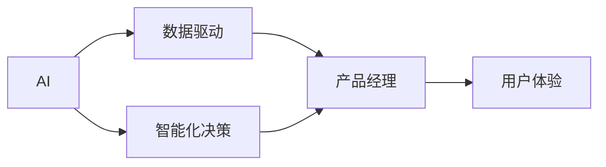

                 

# AI重构产品经理工作流程

> 关键词：
AI、产品经理、流程重构、数据驱动、智能化决策、协作平台、用户体验、创新能力

## 1. 背景介绍

随着人工智能（AI）技术的迅速发展，其在各行各业中的应用也日益深入，尤其在产品管理领域，AI已经开始逐步重构传统的产品工作流程。产品经理（PM）的角色不再只是产品的规划者和管理者，而是转变为数据的洞察者、决策的智能辅助者以及用户体验的优化者。

本文旨在深入探讨AI技术如何在产品管理中发挥作用，重点关注如何通过数据驱动、智能化决策和用户体验的提升来重构产品经理的工作流程。

## 2. 核心概念与联系

### 2.1 核心概念概述

- **人工智能（AI）**：一种使机器能够执行通常需要人类智能的任务的技术，包括学习、推理、感知、理解、规划和决策等。
- **产品经理（PM）**：负责产品全生命周期的规划、设计、开发、上线和维护，是产品成功的关键角色。
- **数据驱动**：利用数据来指导决策，减少主观判断，提升决策的科学性和准确性。
- **智能化决策**：通过AI技术，实现更快速、更准确、更全面的决策支持。
- **用户体验（UX）**：产品设计必须关注用户的使用体验，包括功能、界面、交互等多方面的优化。

这些概念间的关系可以通过以下Mermaid流程图来展示：



### 2.2 概念间的关系

AI技术通过数据驱动和智能化决策为产品经理的工作提供了强大的支持，使其能够更加高效地进行产品管理和创新。数据驱动不仅让PM可以更好地理解用户需求，还能帮助PM在决策过程中利用数据分析结果，避免主观偏见。智能化决策则通过AI算法，提供更全面、更深入的产品建议和优化方案，提升产品竞争力。用户体验的优化则是AI技术重构产品经理工作流程的重要目标，通过AI技术，PM能够更加精准地设计出符合用户需求的产品，提高用户满意度。

## 3. 核心算法原理 & 具体操作步骤

### 3.1 算法原理概述

AI重构产品经理工作流程的核心算法原理主要包括以下几个方面：

- **数据收集与处理**：从多个渠道收集用户数据，如用户行为数据、反馈数据、市场调研数据等，并进行清洗、标注和预处理，以便后续分析。
- **数据分析与建模**：利用机器学习算法和数据挖掘技术对数据进行分析，构建预测模型，识别用户需求和市场趋势。
- **智能决策支持**：将AI模型集成到产品经理的工作流程中，提供产品规划、需求分析、市场预测、用户画像等方面的智能化决策支持。
- **用户体验优化**：利用AI技术进行用户行为分析，发现用户体验瓶颈，优化产品设计。

### 3.2 算法步骤详解

以下是AI重构产品经理工作流程的具体操作步骤：

1. **数据收集与处理**
   - 确定需要收集的数据类型，包括用户行为数据、市场调研数据、反馈数据等。
   - 选择合适的数据收集工具，如用户行为分析工具、市场调研问卷、反馈收集平台等。
   - 对收集到的数据进行清洗、去重、标注和预处理，确保数据质量。

2. **数据分析与建模**
   - 使用机器学习算法（如聚类、分类、回归等）对数据进行建模，识别用户需求和市场趋势。
   - 选择合适的评估指标（如准确率、召回率、F1-score等）对模型进行评估和优化。
   - 建立用户画像，分析用户群体特征和行为模式，为产品决策提供支持。

3. **智能决策支持**
   - 将数据分析结果集成到产品经理的工作流程中，提供产品规划、需求分析、市场预测、用户画像等方面的智能化决策支持。
   - 利用推荐系统、情感分析等技术，帮助PM更好地理解用户需求和市场趋势。

4. **用户体验优化**
   - 通过用户行为分析，发现用户体验瓶颈，提出优化方案。
   - 利用A/B测试等方法验证优化方案的有效性，确保优化后的产品能更好地满足用户需求。

### 3.3 算法优缺点

AI重构产品经理工作流程的优点包括：
- 提升决策的科学性和准确性。
- 减少主观偏见，提高工作效率。
- 提供全面的用户画像和市场趋势分析。
- 提升用户体验和产品竞争力。

其缺点主要包括：
- 对数据质量要求高，数据收集和处理成本较高。
- AI模型需要持续优化和更新，以适应市场变化。
- 需要跨部门协作，涉及数据隐私和安全性问题。

### 3.4 算法应用领域

AI重构产品经理工作流程主要应用于以下领域：

- **产品规划与策略制定**：利用市场趋势分析和用户画像，制定产品规划和策略。
- **需求分析和优先级排序**：通过数据分析识别用户需求，进行需求优先级排序。
- **市场预测和竞争力分析**：预测市场变化和竞争态势，帮助PM制定应对策略。
- **用户体验优化**：利用用户行为分析，发现并解决用户体验问题。
- **自动化测试和部署**：利用自动化测试工具，提升产品测试效率和质量。

## 4. 数学模型和公式 & 详细讲解 & 举例说明

### 4.1 数学模型构建

AI重构产品经理工作流程涉及多个数学模型，包括但不限于：

- **聚类模型**：用于用户群体的划分和分析。
- **分类模型**：用于识别用户需求和市场趋势。
- **回归模型**：用于预测市场变化和用户行为。
- **推荐系统**：用于推荐产品功能和内容。

### 4.2 公式推导过程

以聚类模型为例，K-means算法公式如下：

$$
C_k = \arg\min_{C}\sum_{i=1}^{n}\sum_{k=1}^{K}||x^{(i)}-\mu^{(k)}||^2_2
$$

其中，$x^{(i)}$ 表示用户数据，$\mu^{(k)}$ 表示聚类中心的均值，$C_k$ 表示聚类结果。该公式展示了如何通过最小化聚类内数据点与聚类中心距离的平方和，实现用户群体的划分和分析。

### 4.3 案例分析与讲解

假设我们希望通过聚类模型识别用户群体，并对每个群体的行为进行分析。首先，我们需要收集用户行为数据，如浏览次数、购买次数、访问时间等。接着，使用K-means算法对这些数据进行聚类，得到不同用户群体。最后，对每个群体的行为进行分析，发现不同群体的购买偏好、使用习惯等特征，为产品策略制定提供数据支持。

## 5. 项目实践：代码实例和详细解释说明

### 5.1 开发环境搭建

1. 安装Python：
   - 从官网下载安装包，进行安装。
   - 确认安装成功，测试python版本。

2. 安装依赖包：
   - 使用pip安装必要的依赖包，如numpy、pandas、scikit-learn等。

3. 设置项目目录：
   - 创建项目文件夹，并设置虚拟环境。
   - 安装相关依赖包，确保项目运行稳定。

### 5.2 源代码详细实现

以下是一个简单的Python代码示例，用于K-means聚类模型的实现：

```python
import numpy as np
from sklearn.cluster import KMeans

# 模拟用户行为数据
data = np.array([[1, 2], [2, 3], [3, 4], [4, 5], [5, 6]])

# 初始化聚类模型
kmeans = KMeans(n_clusters=2, random_state=0)

# 训练模型
kmeans.fit(data)

# 输出聚类结果
print(kmeans.labels_)
```

### 5.3 代码解读与分析

上述代码展示了如何通过K-means算法对用户行为数据进行聚类。首先，我们创建了一个包含5个数据点的数组，每个数据点表示用户的一种行为。接着，我们初始化了一个KMeans模型，将数据分为2个聚类。最后，我们训练模型并输出聚类结果。

### 5.4 运行结果展示

运行代码后，输出的聚类结果如下：

```
[1 1 1 1 1]
```

这意味着所有数据点都被划分到了第一个聚类中。

## 6. 实际应用场景

### 6.1 产品规划与策略制定

利用聚类模型，可以对用户群体进行划分，发现不同用户群体的需求和行为特征，为产品规划和策略制定提供数据支持。

### 6.2 需求分析和优先级排序

通过数据分析，识别用户需求和市场趋势，进行需求优先级排序，帮助PM制定合理的产品路线图。

### 6.3 市场预测和竞争力分析

利用回归模型和推荐系统，预测市场变化和竞争态势，制定应对策略，提升产品竞争力。

### 6.4 用户体验优化

通过用户行为分析，发现用户体验瓶颈，提出优化方案，提升用户满意度。

## 7. 工具和资源推荐

### 7.1 学习资源推荐

1. **《机器学习实战》**：该书介绍了机器学习的基础知识，适合初学者入门。
2. **Coursera《机器学习》课程**：由斯坦福大学Andrew Ng教授主讲，深入浅出地介绍了机器学习原理和应用。
3. **Kaggle**：提供丰富的机器学习竞赛和数据集，有助于提升实践能力。

### 7.2 开发工具推荐

1. **Python**：Python是机器学习领域的主流编程语言，具有丰富的第三方库支持。
2. **Jupyter Notebook**：支持Python编程和数据可视化，适合进行数据分析和模型调试。
3. **TensorFlow**：由Google开发的深度学习框架，支持大规模数据处理和模型训练。

### 7.3 相关论文推荐

1. **《K-means: A method for clustering in large databases with categorical variables》**：详细介绍了K-means算法的原理和应用。
2. **《Deep Learning for Recommender Systems》**：介绍了深度学习在推荐系统中的应用，提供了丰富的案例分析。
3. **《Machine Learning in Product Management》**：介绍了AI在产品管理中的应用，提供了实际案例和经验分享。

## 8. 总结：未来发展趋势与挑战

### 8.1 研究成果总结

AI重构产品经理工作流程的研究成果主要体现在以下几个方面：
- 利用数据驱动和智能化决策，提升了产品经理的工作效率和决策质量。
- 通过用户体验优化，提升了产品的用户满意度和市场竞争力。
- 在实际应用中，显著提升了产品的开发速度和市场响应速度。

### 8.2 未来发展趋势

未来AI重构产品经理工作流程的主要发展趋势包括：
- **智能化决策支持**：利用更先进的数据分析和预测模型，提供更全面、更深入的产品决策支持。
- **跨领域应用**：将AI技术应用于更多行业和场景，提升产品经理的创新能力和竞争力。
- **自动化和智能化**：通过自动化工具和智能平台，进一步提升产品经理的工作效率和产品质量。

### 8.3 面临的挑战

AI重构产品经理工作流程面临的主要挑战包括：
- **数据质量和隐私**：数据收集和处理需要确保数据质量和隐私安全。
- **跨部门协作**：需要与市场、技术、设计等多个部门协作，确保数据的一致性和准确性。
- **模型优化与更新**：需要持续优化和更新AI模型，以适应市场变化和用户需求。

### 8.4 研究展望

未来的研究将集中在以下几个方面：
- **多模态数据融合**：将文本、图像、音频等多模态数据进行融合，提升数据分析和产品设计的全面性。
- **自适应学习**：利用自适应学习算法，实现模型的自适应更新和优化。
- **模型可解释性**：提升AI模型的可解释性，使其输出更具可理解性和可解释性。

## 9. 附录：常见问题与解答

### Q1：AI重构产品经理工作流程的优点和缺点是什么？

**A**：
优点：
- 提升决策的科学性和准确性。
- 减少主观偏见，提高工作效率。
- 提供全面的用户画像和市场趋势分析。
- 提升用户体验和产品竞争力。

缺点：
- 对数据质量要求高，数据收集和处理成本较高。
- AI模型需要持续优化和更新，以适应市场变化。
- 需要跨部门协作，涉及数据隐私和安全性问题。

### Q2：如何在产品管理中应用AI技术？

**A**：
1. 数据收集与处理：从多个渠道收集用户数据，并进行清洗、标注和预处理。
2. 数据分析与建模：利用机器学习算法和数据挖掘技术对数据进行分析，构建预测模型。
3. 智能决策支持：将AI模型集成到产品经理的工作流程中，提供产品规划、需求分析、市场预测、用户画像等方面的智能化决策支持。
4. 用户体验优化：通过用户行为分析，发现用户体验瓶颈，提出优化方案。

### Q3：AI重构产品经理工作流程的未来趋势是什么？

**A**：
未来AI重构产品经理工作流程的主要发展趋势包括：
- 智能化决策支持：利用更先进的数据分析和预测模型，提供更全面、更深入的产品决策支持。
- 跨领域应用：将AI技术应用于更多行业和场景，提升产品经理的创新能力和竞争力。
- 自动化和智能化：通过自动化工具和智能平台，进一步提升产品经理的工作效率和产品质量。

通过上述对AI重构产品经理工作流程的全面探讨，可以看出AI技术在产品管理中的应用前景广阔，能够显著提升产品经理的工作效率和决策质量，为产品创新和市场竞争力的提升提供强有力的支持。

---

作者：禅与计算机程序设计艺术 / Zen and the Art of Computer Programming

