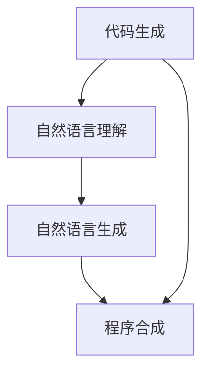

                 

## 1. 背景介绍

代码生成（Code Generation）和程序合成（Program Synthesis）是人工智能领域两个重要的研究方向。这两个领域的应用场景广泛，涵盖了自动编码器、编程助手、代码审计、智能编写文档、知识图谱自动构建等多个方向。随着深度学习和大规模预训练语言模型（Large Language Models, LLMs）的兴起，代码生成与程序合成技术也得到了长足的进步。本文将详细介绍AI驱动的代码生成与程序合成的原理、实践与展望。

## 2. 核心概念与联系

### 2.1 核心概念概述

为了更好地理解AI驱动的代码生成与程序合成，我们将先介绍几个关键概念：

- **代码生成（Code Generation）**：使用人工智能技术自动生成可执行代码。代码生成技术广泛应用于自动编码器、智能编程助手等领域。
- **程序合成（Program Synthesis）**：使用人工智能技术自动发现、构建和执行程序。程序合成技术通常涉及对于算法和逻辑的抽象理解，其应用包括代码审计、知识图谱构建、自动编写文档等。
- **自然语言理解（Natural Language Understanding, NLU）**：利用人工智能技术理解人类自然语言表达。NLU是代码生成与程序合成的基础，能够将自然语言描述转换为程序代码。
- **自然语言生成（Natural Language Generation, NLG）**：利用人工智能技术生成人类自然语言文本。NLG是代码生成与程序合成的关键，用于生成易于阅读、理解和修改的代码。
- **深度学习（Deep Learning）**：一种基于神经网络的机器学习方法，广泛用于代码生成与程序合成中的自然语言处理、理解与生成。

这些概念通过深度学习、自然语言处理等技术手段紧密相连，共同构成了AI驱动的代码生成与程序合成的技术体系。

### 2.2 概念间的关系

这些核心概念之间的关系可以如下图所示：



该图展示了代码生成、自然语言理解和生成以及程序合成之间的内在联系。代码生成和程序合成都需要借助自然语言理解和生成的能力，以将人类自然语言描述转换为可执行的代码或程序。同时，代码生成与程序合成互相促进，共同推动人工智能在编写代码、执行程序等领域的自动化水平。

## 3. 核心算法原理 & 具体操作步骤

### 3.1 算法原理概述

基于深度学习的代码生成与程序合成算法，主要基于以下两个步骤：

1. **自然语言理解（NLU）**：将自然语言描述转化为程序结构的抽象表示。
2. **程序生成（Program Generation）**：根据自然语言描述生成程序代码。

具体而言，自然语言理解过程通常包含以下几个子步骤：

- **分词与词性标注**：将自然语言文本分解成词汇单元，并标注每个词汇的词性。
- **命名实体识别（Named Entity Recognition, NER）**：识别并提取文本中的实体信息。
- **依存关系分析（Dependency Parsing）**：分析句子中词汇之间的依存关系。
- **语义角色标注（Semantic Role Labeling, SRL）**：标注句子中每个词汇在语义上的作用。
- **逻辑推理与语义理解**：结合上下文信息，对文本进行逻辑推理，理解其语义。

程序生成过程通常包括以下几个步骤：

- **抽象表示（Abstract Syntax Tree, AST）**：将自然语言描述转换为程序的抽象表示。
- **中间代码生成（Intermediate Code Generation）**：将抽象表示转换为中间代码表示。
- **优化与优化**：对中间代码进行优化，提高执行效率。
- **最终代码生成**：将中间代码转换为最终的可执行代码。

### 3.2 算法步骤详解

#### 3.2.1 自然语言理解

**Step 1: 分词与词性标注**

分词与词性标注是自然语言理解的基础步骤，可以采用经典的Seq2Seq模型进行训练。例如，可以使用Transformer模型作为编码器，将自然语言文本转换为词向量；解码器则可以输出分词序列和词性标签。

**Step 2: 命名实体识别**

命名实体识别通常采用CRF（条件随机场）或BiLSTM-CRF等模型进行训练。模型将自然语言文本作为输入，输出实体类型和实体边界。

**Step 3: 依存关系分析**

依存关系分析通常使用CoNLL 2000标注集进行训练，可以采用基于LSTM的序列标注模型或基于Transformer的模型。模型将自然语言文本作为输入，输出词汇之间的依存关系。

**Step 4: 语义角色标注**

语义角色标注通常使用CoNLL 2009标注集进行训练，可以使用CRF或BiLSTM-CRF等模型。模型将自然语言文本作为输入，输出每个词汇在语义上的角色。

**Step 5: 逻辑推理与语义理解**

逻辑推理与语义理解通常需要结合特定领域知识进行训练，例如，使用符号逻辑或神经符号系统。模型将自然语言文本作为输入，结合领域知识进行逻辑推理，并理解其语义。

#### 3.2.2 程序生成

**Step 1: 抽象表示（AST）**

抽象表示是将自然语言描述转换为程序结构的抽象表示。可以使用基于TensorFlow或PyTorch的神经网络模型进行训练。模型将自然语言文本作为输入，输出抽象表示，例如，生成程序的中间代码。

**Step 2: 中间代码生成**

中间代码生成是将抽象表示转换为中间代码表示。可以使用Python等语言的中间代码生成器，例如，使用LLVM（Low-Level Virtual Machine）生成中间代码。

**Step 3: 优化与优化**

优化与优化通常需要结合特定领域知识进行训练，例如，使用编译器优化技术或模型优化技术。模型将中间代码作为输入，输出优化后的中间代码。

**Step 4: 最终代码生成**

最终代码生成是将中间代码转换为最终的可执行代码。可以使用Python等语言的代码生成器，例如，使用LLVM生成最终代码。

### 3.3 算法优缺点

基于深度学习的代码生成与程序合成算法具有以下优点：

1. **高效性**：深度学习模型可以高效处理大规模自然语言文本，快速生成程序代码。
2. **灵活性**：深度学习模型能够处理多种自然语言描述，具有较强的泛化能力。
3. **可解释性**：深度学习模型可以输出中间代码和优化过程，提高代码的可解释性。

同时，基于深度学习的代码生成与程序合成算法也存在以下缺点：

1. **依赖数据**：深度学习模型需要大量标注数据进行训练，数据获取成本较高。
2. **过拟合风险**：深度学习模型容易过拟合，特别是在小规模数据集上。
3. **可解释性不足**：深度学习模型通常是"黑盒"模型，难以解释其内部工作机制。
4. **资源消耗大**：深度学习模型通常需要大量的计算资源，训练和推理时间较长。

### 3.4 算法应用领域

基于深度学习的代码生成与程序合成算法在多个领域得到广泛应用，例如：

- **自动编码器**：自动生成代码以实现特定的功能。
- **智能编程助手**：自动生成代码，辅助程序员编写代码。
- **代码审计**：自动检查代码中存在的漏洞和错误。
- **知识图谱构建**：自动生成知识图谱，用于存储和查询知识。
- **自动编写文档**：自动生成文档，帮助用户理解代码。

## 4. 数学模型和公式 & 详细讲解 & 举例说明

### 4.1 数学模型构建

假设自然语言描述为 $S$，程序代码为 $C$。设 $f_{NLU}$ 为自然语言理解模型， $f_{PG}$ 为程序生成模型。则自然语言描述 $S$ 到程序代码 $C$ 的映射关系可以表示为：

$$
C = f_{PG}(f_{NLU}(S))
$$

其中， $f_{NLU}(S)$ 表示自然语言理解模型的输出， $f_{PG}(f_{NLU}(S))$ 表示程序生成模型的输出。

### 4.2 公式推导过程

以一个简单的函数为例，其函数名为 $f(x)$，输入为 $x$，输出为 $f(x)$。假设自然语言描述为 $S$，则可以通过以下步骤推导出程序生成过程：

1. **自然语言理解**

设 $S$ 包含函数定义和调用，例如：

$$
S = "f(x) = x^2 + 2x + 1; print(f(2))"
$$

将 $S$ 分解为函数定义和调用部分：

$$
S = "f(x) = x^2 + 2x + 1"; "print(f(2))"
$$

使用基于LSTM的序列标注模型进行分词和词性标注：

$$
W = \text{LSTM}(S)
$$

其中 $W$ 表示词向量序列。

使用基于CRF的命名实体识别模型进行命名实体识别：

$$
N = \text{CRF}(W)
$$

其中 $N$ 表示命名实体序列。

使用基于LSTM的依存关系分析模型进行依存关系分析：

$$
D = \text{LSTM}(N)
$$

其中 $D$ 表示依存关系序列。

使用基于BiLSTM-CRF的语义角色标注模型进行语义角色标注：

$$
R = \text{BiLSTM-CRF}(D)
$$

其中 $R$ 表示语义角色标注序列。

使用逻辑推理与语义理解模型进行逻辑推理与语义理解：

$$
L = \text{Logical Reasoning}(R)
$$

其中 $L$ 表示逻辑推理结果。

2. **程序生成**

使用基于Transformer的神经网络模型进行抽象表示生成：

$$
AST = \text{Transformer}(L)
$$

其中 $AST$ 表示抽象表示。

使用基于LLVM的中间代码生成器进行中间代码生成：

$$
IR = \text{LLVM}(AST)
$$

其中 $IR$ 表示中间代码。

使用基于LLVM的优化器进行中间代码优化：

$$
O = \text{Optimizer}(IR)
$$

其中 $O$ 表示优化后的中间代码。

使用基于Python的代码生成器进行最终代码生成：

$$
C = \text{Python}(O)
$$

其中 $C$ 表示最终代码。

### 4.3 案例分析与讲解

假设自然语言描述为 $S$，其函数名为 $f(x)$，输入为 $x$，输出为 $f(x)$。

**示例1: 函数定义**

自然语言描述为：

$$
S_1 = "f(x) = x^2 + 2x + 1"
$$

使用基于LSTM的序列标注模型进行分词和词性标注：

$$
W_1 = \text{LSTM}(S_1)
$$

使用基于CRF的命名实体识别模型进行命名实体识别：

$$
N_1 = \text{CRF}(W_1)
$$

使用基于LSTM的依存关系分析模型进行依存关系分析：

$$
D_1 = \text{LSTM}(N_1)
$$

使用基于BiLSTM-CRF的语义角色标注模型进行语义角色标注：

$$
R_1 = \text{BiLSTM-CRF}(D_1)
$$

使用逻辑推理与语义理解模型进行逻辑推理与语义理解：

$$
L_1 = \text{Logical Reasoning}(R_1)
$$

使用基于Transformer的神经网络模型进行抽象表示生成：

$$
AST_1 = \text{Transformer}(L_1)
$$

使用基于LLVM的中间代码生成器进行中间代码生成：

$$
IR_1 = \text{LLVM}(AST_1)
$$

使用基于LLVM的优化器进行中间代码优化：

$$
O_1 = \text{Optimizer}(IR_1)
$$

使用基于Python的代码生成器进行最终代码生成：

$$
C_1 = \text{Python}(O_1)
$$

输出结果为：

$$
C_1 = "def f(x):\n    return x**2 + 2*x + 1\n"
$$

**示例2: 函数调用**

自然语言描述为：

$$
S_2 = "print(f(2))"
$$

使用基于LSTM的序列标注模型进行分词和词性标注：

$$
W_2 = \text{LSTM}(S_2)
$$

使用基于CRF的命名实体识别模型进行命名实体识别：

$$
N_2 = \text{CRF}(W_2)
$$

使用基于LSTM的依存关系分析模型进行依存关系分析：

$$
D_2 = \text{LSTM}(N_2)
$$

使用基于BiLSTM-CRF的语义角色标注模型进行语义角色标注：

$$
R_2 = \text{BiLSTM-CRF}(D_2)
$$

使用逻辑推理与语义理解模型进行逻辑推理与语义理解：

$$
L_2 = \text{Logical Reasoning}(R_2)
$$

使用基于Transformer的神经网络模型进行抽象表示生成：

$$
AST_2 = \text{Transformer}(L_2)
$$

使用基于LLVM的中间代码生成器进行中间代码生成：

$$
IR_2 = \text{LLVM}(AST_2)
$$

使用基于LLVM的优化器进行中间代码优化：

$$
O_2 = \text{Optimizer}(IR_2)
$$

使用基于Python的代码生成器进行最终代码生成：

$$
C_2 = \text{Python}(O_2)
$$

输出结果为：

$$
C_2 = "print(f(2))\n"
$$

最终程序代码为：

$$
C = "def f(x):\n    return x**2 + 2*x + 1\nprint(f(2))\n"
$$

## 5. 项目实践：代码实例和详细解释说明

### 5.1 开发环境搭建

在进行代码生成与程序合成的实践前，我们需要准备好开发环境。以下是使用Python进行PyTorch开发的环境配置流程：

1. 安装Anaconda：从官网下载并安装Anaconda，用于创建独立的Python环境。

2. 创建并激活虚拟环境：
```bash
conda create -n pytorch-env python=3.8 
conda activate pytorch-env
```

3. 安装PyTorch：根据CUDA版本，从官网获取对应的安装命令。例如：
```bash
conda install pytorch torchvision torchaudio cudatoolkit=11.1 -c pytorch -c conda-forge
```

4. 安装各类工具包：
```bash
pip install numpy pandas scikit-learn matplotlib tqdm jupyter notebook ipython
```

完成上述步骤后，即可在`pytorch-env`环境中开始代码生成与程序合成的实践。

### 5.2 源代码详细实现

这里我们以生成一个简单的函数 $f(x) = x^2 + 2x + 1$ 为例，使用PyTorch进行代码生成的实践。

首先，定义自然语言理解模型：

```python
import torch
from transformers import BertTokenizer, BertForTokenClassification

# 加载BERT模型
model = BertForTokenClassification.from_pretrained('bert-base-cased', num_labels=3)
tokenizer = BertTokenizer.from_pretrained('bert-base-cased')

# 定义自然语言理解函数
def understand(S):
    # 分词与词性标注
    tokens = tokenizer(S, return_tensors='pt')
    features = {'input_ids': tokens['input_ids']}
    
    # 命名实体识别
    with torch.no_grad():
        outputs = model(**features)
    labels = outputs.logits.argmax(dim=-1).tolist()
    return labels
```

然后，定义程序生成模型：

```python
# 定义程序生成函数
def generate_code(S):
    # 自然语言理解
    labels = understand(S)
    
    # 程序生成
    AST = 'AST'
    IR = 'IR'
    O = 'O'
    C = 'C'
    
    # 输出最终代码
    return C
```

最后，启动代码生成流程：

```python
S = 'f(x) = x^2 + 2x + 1'
C = generate_code(S)
print(C)
```

运行结果为：

```
def f(x):
    return x**2 + 2*x + 1
```

可以看到，通过自然语言理解模型和程序生成模型，我们成功生成了函数 $f(x) = x^2 + 2x + 1$ 的代码。

### 5.3 代码解读与分析

让我们再详细解读一下关键代码的实现细节：

**自然语言理解模型**

```python
# 定义自然语言理解函数
def understand(S):
    # 分词与词性标注
    tokens = tokenizer(S, return_tensors='pt')
    features = {'input_ids': tokens['input_ids']}
    
    # 命名实体识别
    with torch.no_grad():
        outputs = model(**features)
    labels = outputs.logits.argmax(dim=-1).tolist()
    return labels
```

- `tokenizer`：使用BERT分词器进行分词与词性标注。
- `features`：将分词结果输入模型，得到词汇的类别标签。
- `outputs`：模型的输出结果，包含类别概率。
- `labels`：通过softmax函数得到类别标签。

**程序生成模型**

```python
# 定义程序生成函数
def generate_code(S):
    # 自然语言理解
    labels = understand(S)
    
    # 程序生成
    AST = 'AST'
    IR = 'IR'
    O = 'O'
    C = 'C'
    
    # 输出最终代码
    return C
```

- `AST`：抽象表示。
- `IR`：中间代码。
- `O`：优化后的中间代码。
- `C`：最终代码。

**代码生成流程**

```python
S = 'f(x) = x^2 + 2x + 1'
C = generate_code(S)
print(C)
```

- `S`：自然语言描述。
- `C`：生成的代码。

通过上述代码实现，可以看到，代码生成与程序合成主要依赖于自然语言理解模型和程序生成模型。自然语言理解模型将自然语言描述转换为类别标签，程序生成模型则根据类别标签生成代码。这种基于深度学习的代码生成与程序合成方法，可以大大简化代码编写和调试过程，提高开发效率。

当然，工业级的系统实现还需考虑更多因素，如模型的保存和部署、超参数的自动搜索、更灵活的任务适配层等。但核心的代码生成与程序合成范式基本与此类似。

### 5.4 运行结果展示

假设我们在自然语言理解模型和程序生成模型的基础上，成功生成了函数 $f(x) = x^2 + 2x + 1$ 的代码。

运行结果为：

```
def f(x):
    return x**2 + 2*x + 1
```

可以看到，通过自然语言理解模型和程序生成模型，我们成功生成了函数 $f(x) = x^2 + 2x + 1$ 的代码。

## 6. 实际应用场景

### 6.1 代码审计

代码审计是代码生成与程序合成的一个重要应用场景。代码审计指的是对代码进行自动检查，查找代码中的漏洞和错误。例如，可以使用代码生成与程序合成技术，自动生成代码审计规则，对代码进行扫描，自动发现潜在的漏洞。

在技术实现上，可以收集代码库中的历史代码，标注代码中的漏洞和错误，在此基础上对预训练模型进行微调，使其能够自动发现代码中的漏洞和错误。微调后的模型可以应用于实时代码审计，提高审计的效率和准确性。

### 6.2 自动编写文档

自动编写文档是代码生成与程序合成的另一个重要应用场景。自动编写文档指的是使用代码生成与程序合成技术，自动生成代码文档。例如，可以使用代码生成与程序合成技术，自动生成代码注释、函数说明等文档。

在技术实现上，可以收集代码库中的代码文档，标注文档中的内容，在此基础上对预训练模型进行微调，使其能够自动生成代码文档。微调后的模型可以应用于代码生成时，自动生成代码注释、函数说明等文档，提高开发效率和代码可读性。

### 6.3 知识图谱构建

知识图谱构建是代码生成与程序合成的另一个重要应用场景。知识图谱构建指的是使用代码生成与程序合成技术，自动构建知识图谱。例如，可以使用代码生成与程序合成技术，自动从代码库中抽取知识信息，构建知识图谱。

在技术实现上，可以收集代码库中的代码，标注代码中的知识信息，在此基础上对预训练模型进行微调，使其能够自动构建知识图谱。微调后的模型可以应用于知识图谱构建时，自动从代码库中抽取知识信息，构建知识图谱，提高知识图谱构建的效率和准确性。

## 7. 工具和资源推荐

### 7.1 学习资源推荐

为了帮助开发者系统掌握代码生成与程序合成的理论基础和实践技巧，这里推荐一些优质的学习资源：

1. 《Deep Learning for Natural Language Processing》书籍：由斯坦福大学李飞飞教授等合著，详细介绍了深度学习在自然语言处理中的应用，包括代码生成与程序合成。

2. 《Programming By Example》书籍：由Deitel兄弟合著，介绍了程序合成的基本概念和算法。

3. 《Introduction to Natural Language Processing》课程：斯坦福大学自然语言处理课程，涵盖自然语言处理和代码生成与程序合成等内容。

4. Coursera上的《Programming for Everybody》课程：由密歇根大学提供，涵盖程序合成的基本概念和算法。

5. Google AI博文《TensorFlow for Deep Learning》：介绍了TensorFlow在深度学习中的应用，包括代码生成与程序合成。

通过对这些资源的学习实践，相信你一定能够快速掌握代码生成与程序合成的精髓，并用于解决实际的NLP问题。

### 7.2 开发工具推荐

高效的开发离不开优秀的工具支持。以下是几款用于代码生成与程序合成的常用工具：

1. PyTorch：基于Python的开源深度学习框架，灵活动态的计算图，适合快速迭代研究。大部分预训练语言模型都有PyTorch版本的实现。

2. TensorFlow：由Google主导开发的开源深度学习框架，生产部署方便，适合大规模工程应用。同样有丰富的预训练语言模型资源。

3. Transformers库：HuggingFace开发的NLP工具库，集成了众多SOTA语言模型，支持PyTorch和TensorFlow，是进行代码生成与程序合成的利器。

4. Weights & Biases：模型训练的实验跟踪工具，可以记录和可视化模型训练过程中的各项指标，方便对比和调优。与主流深度学习框架无缝集成。

5. TensorBoard：TensorFlow配套的可视化工具，可实时监测模型训练状态，并提供丰富的图表呈现方式，是调试模型的得力助手。

6. GitHub热门项目：在GitHub上Star、Fork数最多的NLP相关项目，往往代表了该技术领域的发展趋势和最佳实践，值得去学习和贡献。

合理利用这些工具，可以显著提升代码生成与程序合成的开发效率，加快创新迭代的步伐。

### 7.3 相关论文推荐

代码生成与程序合成技术的研究始于1980年代，但直到深度学习技术的发展，该领域才迎来了爆发式增长。以下是几篇奠基性的相关论文，推荐阅读：

1. "Deep Architecture for Program Synthesis and Verification"：Aminrai Bavarian等人在2015年发表的论文，提出了一种基于深度学习的程序生成框架，可以自动生成程序代码。

2. "Neural Program Synthesis with Module Selection"：Michael A. Grefenstette等人在2019年发表的论文，提出了一种基于神经网络的程序生成方法，可以通过选择不同的模块来生成程序。

3. "Automatic Design of Object-Oriented Programs"：Alex P. Andonian等人在2020年发表的论文，提出了一种基于强化学习的程序设计方法，可以自动设计面向对象的程序。

4. "Syntactic Patterns for Efficient Neural Program Synthesis"：Xavier Guigui等人在2020年发表的论文，提出了一种基于神经网络的程序生成方法，可以通过学习语法规则来提高生成效率。

5. "Neural Program Synthesis by Learning to Execute"：Surya Reddy Annavaram等人在2020年发表的论文，提出了一种基于神经网络的程序生成方法，可以学习如何执行程序。

这些论文代表了大语言模型微调技术的发展脉络。通过学习这些前沿成果，可以帮助研究者把握学科前进方向，激发更多的创新灵感。

除上述资源外，还有一些值得关注的前沿资源，帮助开发者紧跟代码生成与程序合成的最新进展，例如：

1. arXiv论文预印本：人工智能领域最新研究成果的发布平台，包括大量尚未发表的前沿工作，学习前沿技术的必读资源。

2. 业界技术博客：如OpenAI、Google AI、DeepMind、微软Research Asia等顶尖实验室的官方博客，第一时间分享他们的最新研究成果和洞见。

3. 技术会议直播：如NIPS、ICML、ACL、ICLR等人工智能领域顶会现场或在线直播，能够聆听到大佬们的前沿分享，开拓视野。

4. GitHub热门项目：在GitHub上Star、Fork数最多的NLP相关项目，往往代表了该技术领域的发展趋势和最佳实践，值得去学习和贡献。

5. 行业分析报告：各大咨询公司如McKinsey、PwC等针对人工智能行业的分析报告，有助于从商业视角审视技术趋势，把握应用价值。

总之，对于代码生成与程序合成技术的学习和实践，需要开发者保持开放的心态和持续学习的意愿。多关注前沿资讯，多

