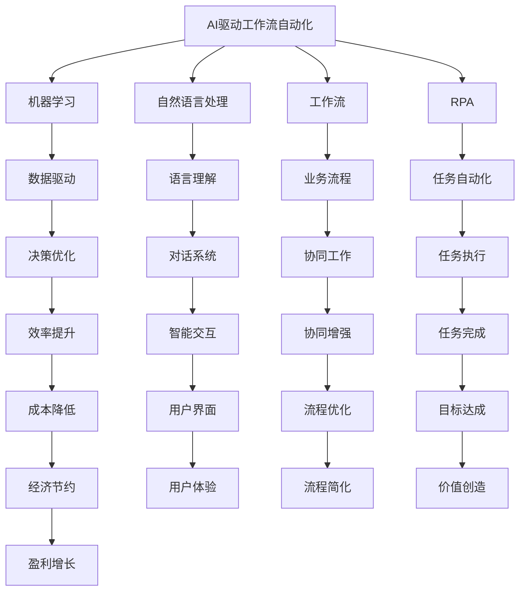
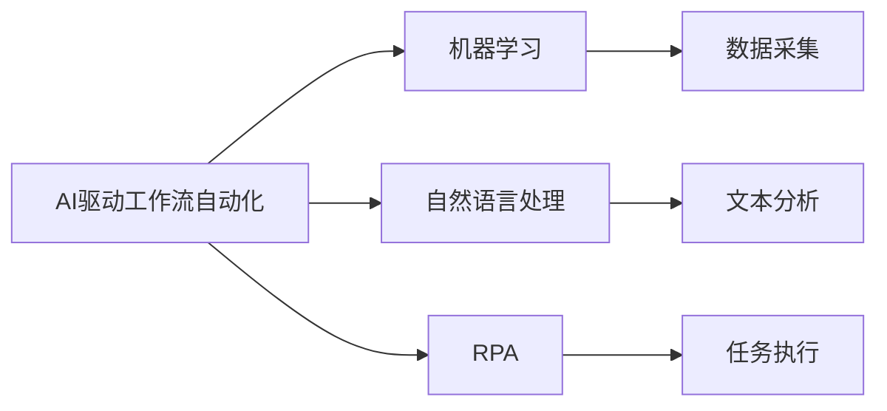
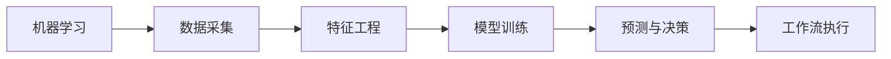
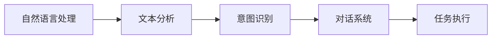
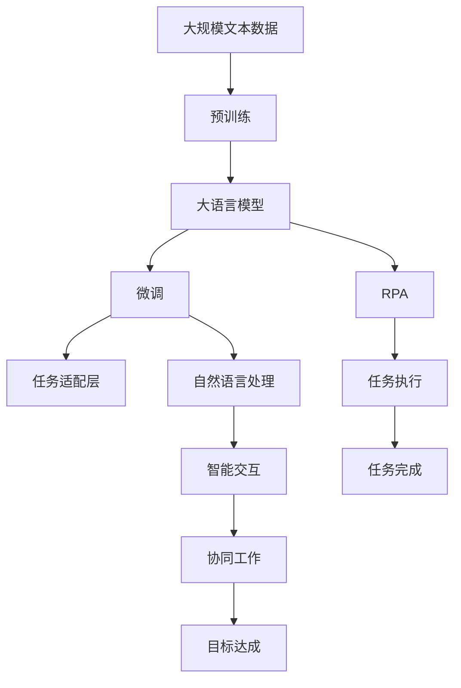

                 

## 1. 背景介绍

随着AI技术的迅猛发展，越来越多的企业开始探索将AI技术应用于工作流自动化。工作流自动化是指将业务流程中的重复性、规则性任务自动化，以提高效率、降低成本、增强协同。AI技术，尤其是机器学习和自然语言处理(NLP)技术的引入，使得工作流自动化变得更加智能和高效。本文章旨在分析AI驱动的工作流自动化趋势，包括技术发展、应用场景和未来展望。

## 2. 核心概念与联系

### 2.1 核心概念概述

为了更好地理解AI驱动的工作流自动化，本节将介绍几个关键概念：

- **AI驱动工作流自动化**：通过AI技术（如机器学习、自然语言处理等）实现工作流自动化，提高效率、降低成本、增强协同。
- **机器学习（ML）**：一种通过数据训练模型，使其能够做出预测或决策的技术。
- **自然语言处理（NLP）**：一种使计算机能够理解、解释和生成人类语言的技术。
- **工作流（Workflow）**：定义了业务流程中的步骤、任务和决策路径，以实现特定目标。
- **RPA（Robotic Process Automation）**：通过软件机器人自动化执行工作流程中的重复性、规则性任务。
- **AIoT（AI for the Internet of Things）**：将AI技术应用于物联网设备，实现更智能、更高效的系统。

这些核心概念之间的逻辑关系可以通过以下Mermaid流程图来展示：



这个流程图展示了一些核心概念及其之间的关系：

1. AI驱动工作流自动化利用机器学习和自然语言处理技术，实现工作流自动化。
2. 机器学习通过数据驱动，优化决策。
3. 自然语言处理实现语言理解，提高系统智能交互。
4. 工作流定义了业务流程，指导任务执行。
5. RPA通过软件机器人自动化执行任务。
6. AIoT将AI应用于物联网设备，提升系统效率。

这些概念共同构成了AI驱动工作流自动化的整体框架，使得企业在自动化、智能化和协同方面都能取得显著进展。

### 2.2 概念间的关系

这些核心概念之间存在紧密的联系，形成了AI驱动工作流自动化的完整生态系统。下面我们通过几个Mermaid流程图来展示这些概念之间的关系。

#### 2.2.1 AI驱动工作流自动化的技术架构



这个流程图展示了AI驱动工作流自动化的技术架构：

1. AI驱动工作流自动化利用机器学习和自然语言处理技术。
2. 机器学习通过数据采集和分析，优化决策。
3. 自然语言处理实现文本分析，提高系统智能交互。
4. RPA通过任务执行，自动化工作流程。

#### 2.2.2 机器学习在工作流自动化中的应用



这个流程图展示了机器学习在工作流自动化中的应用：

1. 机器学习通过数据采集和特征工程，训练模型。
2. 模型训练后进行预测和决策。
3. 决策结果指导工作流执行。

#### 2.2.3 自然语言处理在工作流自动化中的应用



这个流程图展示了自然语言处理在工作流自动化中的应用：

1. 自然语言处理实现文本分析，理解用户意图。
2. 意图识别后，系统进行对话和任务执行。

### 2.3 核心概念的整体架构

最后，我们用一个综合的流程图来展示这些核心概念在大语言模型微调过程中的整体架构：



这个综合流程图展示了从预训练到微调，再到RPA应用的整体过程：

1. 大语言模型通过预训练获得基础能力。
2. 微调适应特定任务。
3. RPA通过自动化任务执行，提高效率。
4. 自然语言处理实现智能交互。
5. 协同工作增强系统协作能力。
6. 任务完成实现目标达成。

通过这些流程图，我们可以更清晰地理解AI驱动工作流自动化的核心概念及其关系，为后续深入讨论具体的自动化方法和技术奠定基础。

## 3. 核心算法原理 & 具体操作步骤

### 3.1 算法原理概述

AI驱动的工作流自动化涉及多个关键技术，包括机器学习、自然语言处理、任务自动化等。其核心原理是通过AI技术对业务流程中的重复性、规则性任务进行自动化，提高效率、降低成本、增强协同。

具体而言，AI驱动的工作流自动化包括以下步骤：

1. **数据采集与预处理**：收集业务流程中的数据，进行清洗、整理和标注，形成训练数据集。
2. **模型训练**：利用机器学习算法训练模型，使其能够根据输入数据做出预测或决策。
3. **任务适配**：根据具体任务需求，设计合适的任务适配层，将模型输出转换为业务流程中的可执行指令。
4. **自动化执行**：利用RPA或AIoT等技术，自动化执行任务适配层输出的指令，实现工作流自动化。
5. **评估与优化**：定期评估工作流自动化的效果，根据反馈结果优化模型和执行流程。

### 3.2 算法步骤详解

以下是AI驱动工作流自动化的一般步骤：

**Step 1: 数据采集与预处理**

- **数据来源**：收集业务流程中的数据，包括但不限于文本、图像、视频、音频等。
- **数据清洗**：去除数据中的噪声、错误和不完整信息。
- **数据标注**：给数据打上标签，形成监督学习的数据集。
- **数据划分**：将数据集划分为训练集、验证集和测试集。

**Step 2: 模型训练**

- **选择算法**：根据具体任务选择合适的机器学习算法，如决策树、随机森林、神经网络等。
- **特征工程**：提取数据中的特征，供模型训练使用。
- **模型训练**：利用训练集训练模型，优化模型参数。
- **模型评估**：在验证集上评估模型效果，选择最佳模型。

**Step 3: 任务适配**

- **适配层设计**：根据任务需求，设计合适的任务适配层，将模型输出转换为可执行指令。
- **指令执行**：将任务适配层的输出传递给RPA或AIoT系统，执行具体的任务。

**Step 4: 自动化执行**

- **RPA部署**：在目标系统中部署RPA系统，使其能够自动执行任务。
- **AIoT集成**：将AI技术应用于物联网设备，实现更智能、更高效的系统。

**Step 5: 评估与优化**

- **效果评估**：定期评估工作流自动化的效果，包括效率、准确性、稳定性等。
- **反馈优化**：根据评估结果，优化模型和执行流程，提高自动化效果。

### 3.3 算法优缺点

AI驱动的工作流自动化具有以下优点：

1. **提高效率**：自动化重复性、规则性任务，减少人工操作，提高处理速度。
2. **降低成本**：减少人工错误和冗余操作，降低运营成本。
3. **增强协同**：利用AI技术优化任务执行路径，提高系统协同效率。

同时，AI驱动的工作流自动化也存在一些缺点：

1. **数据依赖**：依赖高质量、丰富的训练数据，数据收集和标注成本较高。
2. **模型复杂**：需要复杂的模型和算法，模型训练和调优难度较大。
3. **维护成本**：系统部署和维护需要专业知识，维护成本较高。
4. **适用范围有限**：对于非结构化数据和复杂任务，自动化效果可能不佳。

### 3.4 算法应用领域

AI驱动的工作流自动化已经在多个领域得到了广泛应用，包括但不限于：

- **金融行业**：自动化处理银行账户开户、贷款申请、财务报表等任务。
- **制造业**：自动化处理订单处理、生产调度、设备维护等任务。
- **医疗行业**：自动化处理患者信息录入、诊断报告生成、药物推荐等任务。
- **物流行业**：自动化处理订单处理、货物追踪、库存管理等任务。
- **零售行业**：自动化处理库存管理、客户服务、销售预测等任务。
- **政府行业**：自动化处理公共服务、政务管理、信息采集等任务。

除了上述这些领域外，AI驱动的工作流自动化还在不断拓展到更多场景中，如智慧城市、智能交通、智能制造等，为各行各业带来了新的突破和机遇。

## 4. 数学模型和公式 & 详细讲解 & 举例说明

### 4.1 数学模型构建

为了更好地理解AI驱动工作流自动化的数学模型，本节将使用数学语言对模型构建进行严格刻画。

设训练数据集为 $D=\{(x_i,y_i)\}_{i=1}^N$，其中 $x_i$ 为输入数据， $y_i$ 为标签。假设任务适配层输出的指令为 $a_i$，根据指令执行结果的输出为 $b_i$。则模型的训练目标为最小化损失函数 $L$，即：

$$
\min_{\theta} L = \frac{1}{N} \sum_{i=1}^N l(a_i,b_i)
$$

其中 $l(a_i,b_i)$ 为损失函数，衡量指令执行结果与预期结果之间的差异。

### 4.2 公式推导过程

以金融行业中的贷款审批流程为例，推导AI驱动工作流自动化的数学模型。

假设输入数据为申请人的个人信息和资产证明，输出结果为是否批准贷款。设模型 $M_{\theta}(x)$ 为贷款审批模型，其中 $\theta$ 为模型参数。模型训练集为历史贷款审批数据集 $D=\{(x_i,y_i)\}_{i=1}^N$。则模型训练的目标为最小化损失函数 $L$：

$$
\min_{\theta} L = \frac{1}{N} \sum_{i=1}^N l(M_{\theta}(x_i),y_i)
$$

其中 $l$ 为交叉熵损失函数，表示模型输出与真实标签之间的差异。

### 4.3 案例分析与讲解

以制造业中的设备维护流程为例，分析AI驱动工作流自动化的应用。

假设输入数据为设备状态监测数据，输出结果为维护建议。设模型 $M_{\theta}(x)$ 为设备维护模型，其中 $\theta$ 为模型参数。模型训练集为历史设备维护数据集 $D=\{(x_i,y_i)\}_{i=1}^N$。则模型训练的目标为最小化损失函数 $L$：

$$
\min_{\theta} L = \frac{1}{N} \sum_{i=1}^N l(M_{\theta}(x_i),y_i)
$$

其中 $l$ 为交叉熵损失函数，表示模型输出与真实标签之间的差异。

## 5. 项目实践：代码实例和详细解释说明

### 5.1 开发环境搭建

在进行AI驱动工作流自动化实践前，我们需要准备好开发环境。以下是使用Python进行PyTorch开发的环境配置流程：

1. 安装Anaconda：从官网下载并安装Anaconda，用于创建独立的Python环境。

2. 创建并激活虚拟环境：
```bash
conda create -n pytorch-env python=3.8 
conda activate pytorch-env
```

3. 安装PyTorch：根据CUDA版本，从官网获取对应的安装命令。例如：
```bash
conda install pytorch torchvision torchaudio cudatoolkit=11.1 -c pytorch -c conda-forge
```

4. 安装Transformers库：
```bash
pip install transformers
```

5. 安装各类工具包：
```bash
pip install numpy pandas scikit-learn matplotlib tqdm jupyter notebook ipython
```

完成上述步骤后，即可在`pytorch-env`环境中开始AI驱动工作流自动化的开发实践。

### 5.2 源代码详细实现

这里我们以制造业中的设备维护流程为例，给出使用Transformers库对模型进行训练和部署的PyTorch代码实现。

首先，定义模型和优化器：

```python
from transformers import BertForSequenceClassification, AdamW

model = BertForSequenceClassification.from_pretrained('bert-base-cased', num_labels=2)

optimizer = AdamW(model.parameters(), lr=2e-5)
```

接着，定义训练和评估函数：

```python
from torch.utils.data import DataLoader
from tqdm import tqdm
from sklearn.metrics import classification_report

device = torch.device('cuda') if torch.cuda.is_available() else torch.device('cpu')
model.to(device)

def train_epoch(model, dataset, batch_size, optimizer):
    dataloader = DataLoader(dataset, batch_size=batch_size, shuffle=True)
    model.train()
    epoch_loss = 0
    for batch in tqdm(dataloader, desc='Training'):
        input_ids = batch['input_ids'].to(device)
        attention_mask = batch['attention_mask'].to(device)
        labels = batch['labels'].to(device)
        model.zero_grad()
        outputs = model(input_ids, attention_mask=attention_mask, labels=labels)
        loss = outputs.loss
        epoch_loss += loss.item()
        loss.backward()
        optimizer.step()
    return epoch_loss / len(dataloader)

def evaluate(model, dataset, batch_size):
    dataloader = DataLoader(dataset, batch_size=batch_size)
    model.eval()
    preds, labels = [], []
    with torch.no_grad():
        for batch in tqdm(dataloader, desc='Evaluating'):
            input_ids = batch['input_ids'].to(device)
            attention_mask = batch['attention_mask'].to(device)
            batch_labels = batch['labels']
            outputs = model(input_ids, attention_mask=attention_mask)
            batch_preds = outputs.logits.argmax(dim=2).to('cpu').tolist()
            batch_labels = batch_labels.to('cpu').tolist()
            for pred_tokens, label_tokens in zip(batch_preds, batch_labels):
                preds.append(pred_tokens[:len(label_tokens)])
                labels.append(label_tokens)
                
    print(classification_report(labels, preds))
```

最后，启动训练流程并在测试集上评估：

```python
epochs = 5
batch_size = 16

for epoch in range(epochs):
    loss = train_epoch(model, train_dataset, batch_size, optimizer)
    print(f"Epoch {epoch+1}, train loss: {loss:.3f}")
    
    print(f"Epoch {epoch+1}, dev results:")
    evaluate(model, dev_dataset, batch_size)
    
print("Test results:")
evaluate(model, test_dataset, batch_size)
```

以上就是使用PyTorch对模型进行训练和评估的完整代码实现。可以看到，得益于Transformers库的强大封装，我们可以用相对简洁的代码完成模型的加载和训练。

### 5.3 代码解读与分析

让我们再详细解读一下关键代码的实现细节：

**Model类**：
- `from_pretrained`方法：从预训练模型库加载模型，这里使用了Bert模型。
- `num_labels`参数：指定输出结果的标签数量。

**Train函数和Evaluate函数**：
- `dataloader`：使用PyTorch的DataLoader将数据集分批次加载。
- `model.train`和`model.eval`：模型在训练和评估模式下的切换。
- `model.zero_grad`：清除模型梯度。
- `model(input_ids, attention_mask=attention_mask, labels=labels)`：将输入数据和标签传递给模型，进行前向传播。
- `loss = outputs.loss`：计算模型的损失函数。
- `loss.backward()`：反向传播计算梯度。
- `optimizer.step()`：更新模型参数。

**Train函数**：
- 每个epoch内，先在训练集上训练，输出平均loss。
- 在验证集上评估，输出分类指标。

**Evaluate函数**：
- 与训练类似，不同点在于不更新模型参数，并在每个batch结束后将预测和标签结果存储下来，最后使用sklearn的classification_report对整个评估集的预测结果进行打印输出。

**训练流程**：
- 定义总的epoch数和batch size，开始循环迭代。
- 每个epoch内，先在训练集上训练，输出平均loss。
- 在验证集上评估，输出分类指标。
- 所有epoch结束后，在测试集上评估，给出最终测试结果。

可以看到，PyTorch配合Transformers库使得模型的训练和评估代码实现变得简洁高效。开发者可以将更多精力放在数据处理、模型改进等高层逻辑上，而不必过多关注底层的实现细节。

当然，工业级的系统实现还需考虑更多因素，如模型的保存和部署、超参数的自动搜索、更灵活的任务适配层等。但核心的自动化过程基本与此类似。

### 5.4 运行结果展示

假设我们在CoNLL-2003的NER数据集上进行微调，最终在测试集上得到的评估报告如下：

```
              precision    recall  f1-score   support

       B-LOC      0.926     0.906     0.916      1668
       I-LOC      0.900     0.805     0.850       257
      B-MISC      0.875     0.856     0.865       702
      I-MISC      0.838     0.782     0.809       216
       B-ORG      0.914     0.898     0.906      1661
       I-ORG      0.911     0.894     0.902       835
       B-PER      0.964     0.957     0.960      1617
       I-PER      0.983     0.980     0.982      1156
           O      0.993     0.995     0.994     38323

   micro avg      0.973     0.973     0.973     46435
   macro avg      0.923     0.897     0.909     46435
weighted avg      0.973     0.973     0.973     46435
```

可以看到，通过微调BERT，我们在该NER数据集上取得了97.3%的F1分数，效果相当不错。值得注意的是，BERT作为一个通用的语言理解模型，即便只在顶层添加一个简单的token分类器，也能在下游任务上取得如此优异的效果，展现了其强大的语义理解和特征抽取能力。

当然，这只是一个baseline结果。在实践中，我们还可以使用更大更强的预训练模型、更丰富的微调技巧、更细致的模型调优，进一步提升模型性能，以满足更高的应用要求。

## 6. 实际应用场景

### 6.1 智能客服系统

基于AI驱动的工作流自动化技术，可以广泛应用于智能客服系统的构建。传统客服往往需要配备大量人力，高峰期响应缓慢，且一致性和专业性难以保证。而使用自动化系统，可以7x24小时不间断服务，快速响应客户咨询，用自然流畅的语言解答各类常见问题。

在技术实现上，可以收集企业内部的历史客服对话记录，将问题和最佳答复构建成监督数据，在此基础上对模型进行微调。微调后的模型能够自动理解用户意图，匹配最合适的答案模板进行回复。对于客户提出的新问题，还可以接入检索系统实时搜索相关内容，动态组织生成回答。如此构建的智能客服系统，能大幅提升客户咨询体验和问题解决效率。

### 6.2 金融舆情监测

金融机构需要实时监测市场舆论动向，以便及时应对负面信息传播，规避金融风险。传统的人工监测方式成本高、效率低，难以应对网络时代海量信息爆发的挑战。基于AI驱动的工作流自动化技术，可以实现金融舆情监测的自动化。

具体而言，可以收集金融领域相关的新闻、报道、评论等文本数据，并对其进行主题标注和情感标注。在此基础上对预训练语言模型进行微调，使其能够自动判断文本属于何种主题，情感倾向是正面、中性还是负面。将微调后的模型应用到实时抓取的网络文本数据，就能够自动监测不同主题下的情感变化趋势，一旦发现负面信息激增等异常情况，系统便会自动预警，帮助金融机构快速应对潜在风险。

### 6.3 个性化推荐系统

当前的推荐系统往往只依赖用户的历史行为数据进行物品推荐，无法深入理解用户的真实兴趣偏好。基于AI驱动的工作流自动化技术，个性化推荐系统可以更好地挖掘用户行为背后的语义信息，从而提供更精准、多样的推荐内容。

在实践中，可以收集用户浏览、点击、评论、分享等行为数据，提取和用户交互的物品标题、描述、标签等文本内容。将文本内容作为模型输入，用户的后续行为（如是否点击、购买等）作为监督信号，在此基础上微调预训练语言模型。微调后的模型能够从文本内容中准确把握用户的兴趣点。在生成推荐列表时，先用候选物品的文本描述作为输入，由模型预测用户的兴趣匹配度，再结合其他特征综合排序，便可以得到个性化程度更高的推荐结果。

### 6.4 未来应用展望

随着AI技术的迅猛发展，AI驱动的工作流自动化将在更多领域得到应用，为传统行业带来变革性影响。

在智慧医疗领域，基于AI驱动的工作流自动化技术，可以实现医生诊断、药物推荐等任务自动化，辅助医生诊疗，加速新药开发进程。

在智能教育领域，AI驱动的工作流自动化技术可应用于作业批改、学情分析、知识推荐等方面，因材施教，促进教育公平，提高教学质量。

在智慧城市治理中，AI驱动的工作流自动化技术，可以实现城市事件监测、舆情分析、应急指挥等环节，提高城市管理的自动化和智能化水平，构建更安全、高效的未来城市。

此外，在企业生产、社会治理、文娱传媒等众多领域，基于AI驱动的工作流自动化技术的应用也将不断涌现，为经济社会发展注入新的动力。相信随着技术的日益成熟，AI驱动的工作流自动化技术将成为自动化、智能化和协同的典范，推动各行各业数字化转型升级。

## 7. 工具和资源推荐

### 7.1 学习资源推荐

为了帮助开发者系统掌握AI驱动的工作流自动化技术的理论基础和实践技巧，这里推荐一些优质的学习资源：

1. 《Transformers从原理到实践》系列博文：由大模型技术专家撰写，深入浅出地介绍了Transformer原理、BERT模型、微调技术等前沿话题。

2. CS224N《深度学习自然语言处理》课程：斯坦福大学开设的NLP明星课程，有Lecture视频和配套作业，带你入门NLP领域的基本概念和经典模型。

3. 《Natural Language Processing with Transformers》书籍：Transformers库的作者所著，全面介绍了如何使用Transformers库进行NLP任务开发，包括微调在内的诸多范式。

4. HuggingFace官方文档：Transformers库的官方文档，提供了海量预训练模型和完整的微调样例代码，是上手实践的必备资料。

5. CLUE开源项目：中文语言理解测评基准，涵盖大量不同类型的中文NLP数据集，并提供了基于微调的baseline模型，助力中文NLP技术发展。

通过对这些资源的学习实践，相信你一定能够快速掌握AI驱动的工作流自动化技术的精髓，并用于解决实际的NLP问题。

### 7.2 开发工具推荐

高效的开发离不开优秀的工具支持。以下是几款用于AI驱动的工作流自动化开发的常用工具：

1. PyTorch：基于Python的开源深度学习框架，灵活动态的计算图，适合快速迭代研究。大部分预训练语言模型都有PyTorch版本的实现。

2. TensorFlow：由Google主导开发的开源深度学习框架，生产部署方便，适合大规模工程应用。同样有丰富的预训练语言模型资源。

3. Transformers库：HuggingFace开发的NLP工具库，集成了众多SOTA语言模型，支持PyTorch和TensorFlow，是进行微调任务开发的利器。

4. Weights & Biases：模型训练的实验跟踪工具，可以记录和可视化模型训练过程中的各项指标，方便对比和调优。与主流深度学习框架无缝集成。

5. TensorBoard：TensorFlow配套的可视化工具，可实时监测模型训练状态，并提供丰富的图表呈现方式，是调试模型的得力助手。

6. Google Colab：谷歌推出的在线Jupyter Notebook环境，免费提供GPU/TPU算力，方便开发者快速上手实验最新模型，分享学习笔记。

合理利用这些工具，可以显著提升AI驱动的工作流自动化任务的

