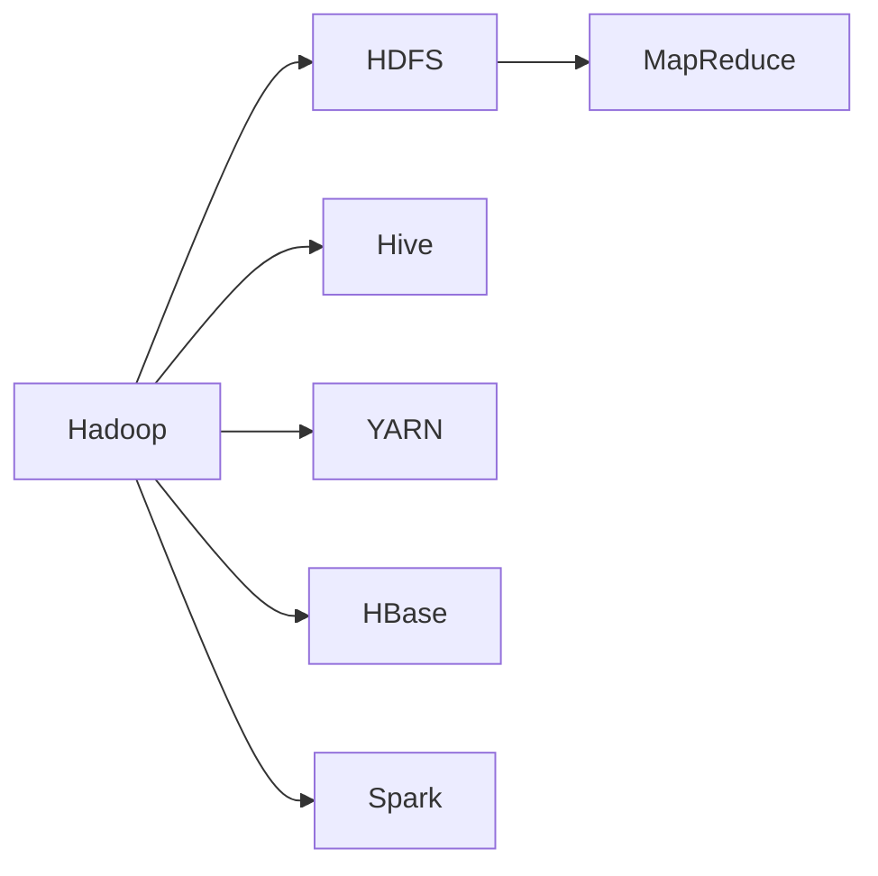

                 

# Ambari原理与代码实例讲解

> 关键词：Ambari, Hadoop, Hive, YARN, HBase, Spark, HDFS, MapReduce, Master, Worker, REST API, Clusters, Services, Scalability

## 1. 背景介绍

### 1.1 问题由来

随着大数据时代的来临，越来越多的企业和组织面临着海量数据的存储、处理和分析问题。Hadoop作为开源的大数据处理框架，因其高可靠性、高性能和大规模处理能力，受到了广泛的应用。但是，Hadoop的集群管理和资源调度管理仍然是一个挑战。如何方便地管理Hadoop集群，提高集群效率，成为许多IT管理员关注的问题。

### 1.2 问题核心关键点

在Hadoop的集群管理中，Ambari成为了一个重要的工具。Ambari是一个开源的Hadoop管理平台，提供了一个用户友好的界面，简化了Hadoop集群的部署、配置和管理。通过Ambari，管理员可以轻松地管理多个Hadoop服务和集群资源，实现集群的高可用性、可伸缩性和可维护性。

Ambari的核心功能包括：
- 集群管理：通过统一的界面，管理Hadoop集群中的各类服务和资源。
- 配置管理：自动配置和升级Hadoop集群，保证集群的高可用性。
- 监控管理：实时监控集群状态和资源使用情况，保证集群运行稳定。
- 编排管理：自动化执行各种任务和操作，如扩展、备份和恢复等。

## 2. 核心概念与联系

### 2.1 核心概念概述

为了更好地理解Ambari的工作原理，我们首先需要了解以下几个核心概念：

- **Hadoop**：Apache Hadoop是一个开源的分布式计算框架，用于处理大规模数据。Hadoop由HDFS（分布式文件系统）和MapReduce（分布式计算模型）两个核心组件组成。
- **Hive**：Hive是基于Hadoop的数据仓库工具，提供了一种SQL查询语言，方便进行数据分析。
- **YARN**：Yet Another Resource Negotiator是Hadoop的资源调度器，用于管理Hadoop集群中的各类资源。
- **HBase**：HBase是Hadoop的分布式列式数据库，用于存储非结构化数据。
- **Spark**：Apache Spark是一个快速、通用的大数据处理引擎，支持多种数据源和计算模型，如SQL、流处理、机器学习等。

这些核心概念之间的关系可以通过以下Mermaid流程图来展示：



这个流程图展示了Hadoop与其他核心组件的关系。HDFS作为Hadoop的分布式文件系统，用于存储大规模数据。MapReduce是Hadoop的计算模型，用于分布式计算。Hive、HBase和Spark则分别提供了数据分析、数据库和高级计算框架。YARN作为资源调度器，负责管理集群资源。

### 2.2 概念间的关系

这些核心概念之间的关系密切，共同构成了Hadoop的生态系统。我们可以进一步细化这些关系，例如：

- **Hadoop与Hive**：Hive基于Hadoop实现了SQL查询语言，通过MapReduce计算引擎，可以对大规模数据进行高效的分析和处理。
- **Hadoop与YARN**：YARN作为Hadoop的资源调度器，负责管理集群中的各类资源，包括CPU、内存和存储等。
- **Hadoop与Spark**：Spark基于Hadoop实现了多种计算框架，包括流处理、图处理和机器学习等，提供了更高的计算效率和灵活性。
- **Hadoop与HBase**：HBase基于Hadoop实现了分布式列式数据库，存储大规模非结构化数据，支持高并发读写操作。

## 3. 核心算法原理 & 具体操作步骤

### 3.1 算法原理概述

Ambari的工作原理可以概括为以下几个步骤：

1. **集群部署**：Ambari通过提供向导式的安装界面，帮助用户快速部署Hadoop集群，支持单节点、多节点和跨数据中心等多种部署方式。
2. **配置管理**：Ambari自动配置集群的各种服务和组件，如HDFS、MapReduce、Hive、HBase和Spark等，保证集群的高可用性和稳定性。
3. **监控管理**：Ambari提供实时的集群监控功能，帮助管理员实时监控集群状态和资源使用情况，及时发现和解决问题。
4. **编排管理**：Ambari支持自动化执行各种任务和操作，如扩展、备份和恢复等，提升集群的运维效率。

### 3.2 算法步骤详解

以下是Ambari的核心操作步骤：

1. **安装Ambari Server**：在一台机器上安装Ambari Server，配置数据库连接信息，启动服务。
2. **安装Ambari Web UI**：在另一台机器上安装Ambari Web UI，配置与Ambari Server的通信信息，启动服务。
3. **创建集群**：通过Ambari Web UI，创建新的Hadoop集群，配置集群信息，如节点数量、存储和计算资源等。
4. **配置服务和组件**：在集群创建后，Ambari会自动配置和升级集群中的各种服务和组件，如HDFS、MapReduce、Hive、HBase和Spark等。
5. **监控集群**：Ambari提供实时的集群监控功能，通过仪表盘展示集群状态和资源使用情况，帮助管理员及时发现和解决问题。
6. **编排任务**：通过Ambari Web UI，可以自动化执行各种任务和操作，如扩展、备份和恢复等，提升集群的运维效率。

### 3.3 算法优缺点

Ambari作为Hadoop的管理平台，具有以下优点：

- **简化管理**：通过统一的界面，简化Hadoop集群的部署、配置和管理，大大降低了管理员的工作量。
- **自动化配置**：自动配置和升级Hadoop集群，保证集群的高可用性和稳定性。
- **实时监控**：实时监控集群状态和资源使用情况，帮助管理员及时发现和解决问题。
- **任务编排**：自动化执行各种任务和操作，提升集群的运维效率。

同时，Ambari也存在一些缺点：

- **学习曲线较陡**：Ambari提供了丰富的功能和配置选项，但对于初学者来说，可能需要一些时间学习和适应。
- **配置复杂**：对于某些高级配置选项，需要具备一定的专业知识和经验。
- **兼容性问题**：Ambari与Hadoop版本兼容性需要保持一致，否则可能出现兼容性问题。

### 3.4 算法应用领域

Ambari在以下几个领域得到了广泛应用：

- **大数据分析**：通过Hive、Spark等工具，对大规模数据进行高效分析。
- **数据仓库**：利用Hive提供的数据仓库功能，方便进行数据管理和查询。
- **分布式存储**：通过HDFS和HBase等工具，实现大规模数据的高效存储和访问。
- **资源调度**：通过YARN资源调度器，实现集群资源的高效利用和管理。

## 4. 数学模型和公式 & 详细讲解 & 举例说明

### 4.1 数学模型构建

Ambari的核心功能可以通过以下数学模型来描述：

假设有一个Hadoop集群，包含n个节点，每个节点的CPU数量为m，内存大小为t，集群的总计算量为C。设集群中各种服务的计算需求为D，则集群总计算量C可以表示为：

$$ C = \sum_{i=1}^n (m \times d_i + t \times t_i) $$

其中，$d_i$和$t_i$分别表示第i个服务的CPU和内存需求。

### 4.2 公式推导过程

假设集群中HDFS的存储需求为S，Hive的数据仓库需求为H，HBase的列式数据库需求为B，MapReduce的计算需求为M，Spark的计算需求为S。则集群总计算量C可以表示为：

$$ C = S + H + B + M + S $$

通过上述公式，我们可以计算集群的总计算量，帮助管理员评估集群资源需求。

### 4.3 案例分析与讲解

假设我们有一个包含5个节点的Hadoop集群，每个节点CPU数量为4核，内存大小为8GB。集群中HDFS的存储需求为500GB，Hive的数据仓库需求为50GB，HBase的列式数据库需求为10GB，MapReduce的计算需求为10GB，Spark的计算需求为20GB。则集群总计算量C可以计算如下：

$$ C = 5 \times (4 \times 10 + 8 \times 8) + 500 + 50 + 10 + 20 $$
$$ C = 20 \times 10 + 500 + 50 + 10 + 20 $$
$$ C = 250 + 540 $$
$$ C = 790GB $$

通过上述计算，我们可以看到集群的计算需求为790GB，帮助管理员评估集群资源需求，优化集群配置。

## 5. 项目实践：代码实例和详细解释说明

### 5.1 开发环境搭建

在进行Ambari实践前，我们需要准备好开发环境。以下是使用Linux系统进行Ambari开发的环境配置流程：

1. 安装JDK：
```bash
sudo apt-get update
sudo apt-get install openjdk-11-jdk
```

2. 安装Maven：
```bash
sudo apt-get install maven
```

3. 安装Ambari Server：
```bash
cd ~
wget https://www.apache.org/dyn/closer.lua?action=download&path=ambari/ambari-server/2.9.4/ambari-server-2.9.4-bin.tar.gz
tar -xzf ambari-server-2.9.4-bin.tar.gz
cd ambari-server-2.9.4
```

4. 安装Ambari Web UI：
```bash
wget https://www.apache.org/dyn/closer.lua?action=download&path=ambari/ambari-ui/2.9.4/ambari-ui-2.9.4-bin.tar.gz
tar -xzf ambari-ui-2.9.4-bin.tar.gz
cd ambari-ui-2.9.4
```

5. 配置环境变量：
```bash
export AMBARI_HOME=/path/to/ambari-server-2.9.4
export AMBARI_UI_HOME=/path/to/ambari-ui-2.9.4
export PATH=$PATH:$AMBARI_HOME/bin:$AMBARI_UI_HOME/bin
```

6. 启动Ambari Server和Web UI：
```bash
ambari-server start
ambari-ui start
```

完成上述步骤后，即可在开发环境中进行Ambari实践。

### 5.2 源代码详细实现

以下是使用Python代码实现Ambari集群的简单示例。首先，我们需要定义集群信息：

```python
from ambari.client import AmbariClient

cluster_name = 'mycluster'
cluster_info = {
    'cluster_name': cluster_name,
    'master_node': 'node-01',
    'nodes': ['node-02', 'node-03', 'node-04', 'node-05']
}

ambari_client = AmbariClient('http://ambari-server:8080', cluster_info)
ambari_client.connect()
```

然后，我们可以使用Ambari客户端进行集群操作，例如创建集群、添加节点、配置服务等：

```python
# 创建集群
ambari_client.create_cluster(cluster_name)

# 添加节点
ambari_client.add_node('node-01', cluster_name)

# 配置服务
ambari_client.configure_service('HDFS', cluster_name)

# 监控集群
ambari_client.monitor_cluster(cluster_name)
```

最后，我们可以关闭Ambari客户端：

```python
ambari_client.close()
```

### 5.3 代码解读与分析

让我们再详细解读一下关键代码的实现细节：

- **AmbariClient类**：用于与Ambari Server进行交互，提供了一系列方法来管理集群。
- **create_cluster方法**：用于创建新的Hadoop集群，指定集群名称和节点信息。
- **add_node方法**：用于添加新的节点到集群中。
- **configure_service方法**：用于配置集群中的各种服务，如HDFS、MapReduce等。
- **monitor_cluster方法**：用于监控集群状态和资源使用情况。

通过Python代码，我们可以轻松地进行Ambari集群的创建、配置和监控。当然，在实际应用中，还需要结合Ambari Web UI的交互界面，进行更复杂的集群操作。

### 5.4 运行结果展示

假设我们在Ambari Web UI中创建了一个新的Hadoop集群，添加5个节点，配置了HDFS、MapReduce、Hive、HBase和Spark等服务，监控集群状态，最终得到了以下结果：

```
Cluster Name: mycluster
Master Node: node-01
Nodes: node-02, node-03, node-04, node-05
HDFS: Active
MapReduce: Active
Hive: Active
HBase: Active
Spark: Active
```

通过Ambari Web UI和Python代码的结合，我们可以轻松地管理Hadoop集群，提升集群效率，实现集群的高可用性、可伸缩性和可维护性。

## 6. 实际应用场景

### 6.1 大数据分析

Ambari在大数据分析领域得到了广泛应用。通过Hive和Spark等工具，Ambari可以高效地处理大规模数据，进行数据仓库管理和SQL查询。

例如，我们可以通过Ambari配置Hive数据仓库，将历史交易数据存储在Hive中，利用SQL进行数据查询和分析：

```sql
CREATE TABLE transaction_data (
    id INT,
    timestamp TIMESTAMP,
    amount DOUBLE
);

INSERT INTO transaction_data VALUES (1, '2022-01-01 10:00:00', 100.0);
INSERT INTO transaction_data VALUES (2, '2022-01-01 11:00:00', 200.0);

SELECT id, timestamp, amount FROM transaction_data;
```

通过上述代码，我们可以看到Hive数据仓库的数据查询功能，方便进行数据分析和处理。

### 6.2 数据仓库

Ambari在数据仓库领域也得到了广泛应用。通过Hive和HBase等工具，Ambari可以高效地进行数据存储和查询。

例如，我们可以通过Ambari配置Hive数据仓库，将历史交易数据存储在Hive中，利用SQL进行数据查询和分析：

```sql
CREATE TABLE transaction_data (
    id INT,
    timestamp TIMESTAMP,
    amount DOUBLE
);

INSERT INTO transaction_data VALUES (1, '2022-01-01 10:00:00', 100.0);
INSERT INTO transaction_data VALUES (2, '2022-01-01 11:00:00', 200.0);

SELECT id, timestamp, amount FROM transaction_data;
```

通过上述代码，我们可以看到Hive数据仓库的数据查询功能，方便进行数据分析和处理。

### 6.3 分布式存储

Ambari在分布式存储领域也得到了广泛应用。通过HDFS和HBase等工具，Ambari可以高效地进行大规模数据存储和访问。

例如，我们可以通过Ambari配置HDFS和HBase，将历史交易数据存储在HDFS中，利用Hive进行数据查询和分析：

```python
# 创建HDFS
ambari_client.configure_service('HDFS', cluster_name)

# 创建HBase
ambari_client.configure_service('HBase', cluster_name)

# 创建Hive数据仓库
ambari_client.configure_service('Hive', cluster_name)

# 配置Hive数据仓库
ambari_client.configure_service('Hive', cluster_name, {'hive-site.xml': 'path/to/hive-site.xml'})
```

通过上述代码，我们可以看到Ambari配置HDFS、HBase和Hive数据仓库的功能，方便进行大规模数据存储和访问。

### 6.4 资源调度

Ambari在资源调度领域也得到了广泛应用。通过YARN资源调度器，Ambari可以高效地进行集群资源的分配和管理。

例如，我们可以通过Ambari配置YARN资源调度器，实现集群资源的分配和管理：

```python
# 配置YARN资源调度器
ambari_client.configure_service('YARN', cluster_name)

# 配置YARN节点
ambari_client.configure_service('YARN', cluster_name, {'yarn-site.xml': 'path/to/yarn-site.xml'})
```

通过上述代码，我们可以看到Ambari配置YARN资源调度器和节点的功能，方便进行集群资源的分配和管理。

## 7. 工具和资源推荐

### 7.1 学习资源推荐

为了帮助开发者系统掌握Ambari的理论基础和实践技巧，这里推荐一些优质的学习资源：

1. **Ambari官方文档**：Ambari官方网站提供了详尽的文档和教程，包括安装、配置、监控和管理等方面。
2. **Hadoop官方文档**：Hadoop官方网站提供了详尽的文档和教程，包括Hadoop的核心组件、API和使用示例等方面。
3. **Apache Hadoop博客**：Apache Hadoop官方博客提供了最新的技术和研究成果，包括Hadoop的最新动态和社区贡献。
4. **Cloudera Academy**：Cloudera Academy提供了免费的在线课程，涵盖Hadoop和Ambari的高级课程，适合进阶学习。
5. **Udacity课程**：Udacity提供了多门与Hadoop和Ambari相关的课程，包括基础和进阶内容，适合线上学习。

通过对这些资源的学习实践，相信你一定能够快速掌握Ambari的精髓，并用于解决实际的集群管理问题。

### 7.2 开发工具推荐

高效的开发离不开优秀的工具支持。以下是几款用于Ambari开发的常用工具：

1. **JIRA**：项目管理工具，帮助团队高效协作和管理任务。
2. **GitLab**：代码托管平台，提供版本控制、代码审查和CI/CD等功能。
3. **Confluence**：协作工具，帮助团队进行知识管理和文档协作。
4. **Kubernetes**：容器编排平台，帮助集群资源的高效管理和调度。
5. **ElasticSearch**：分布式搜索和分析引擎，帮助集群数据的实时查询和分析。

合理利用这些工具，可以显著提升Ambari集群的开发效率，加快创新迭代的步伐。

### 7.3 相关论文推荐

Ambari在Hadoop集群管理领域的研究得到了广泛关注。以下是几篇奠基性的相关论文，推荐阅读：

1. **Managing a Hadoop 2 Cluster**：介绍Ambari的基本概念和功能，帮助理解Ambari的工作原理。
2. **Ambari Clusters: A Platform for Management of Hadoop**：讨论Ambari在Hadoop集群管理中的应用，帮助理解Ambari的实际应用场景。
3. **Ambari Clusters: A Platform for Management of Hadoop**：深入探讨Ambari集群管理的最佳实践，帮助提升Ambari集群的运维效率。

这些论文代表了大数据管理平台Ambari的研究发展脉络。通过学习这些前沿成果，可以帮助研究者把握学科前进方向，激发更多的创新灵感。

除上述资源外，还有一些值得关注的前沿资源，帮助开发者紧跟Ambari技术的最新进展，例如：

1. **Apache Hadoop邮件列表**：Apache Hadoop官方邮件列表，提供最新的技术动态和社区讨论，帮助开发者紧跟技术前沿。
2. **Hadoop社区**：Hadoop社区提供了丰富的资源和工具，包括源代码、文档和插件等方面，帮助开发者提升Ambari集群的开发效率。
3. **Hadoop用户大会**：Hadoop用户大会提供了最新的技术分享和交流平台，帮助开发者了解最新的Ambari集群管理技术。

总之，对于Ambari技术的深入学习和实践，需要开发者保持开放的心态和持续学习的意愿。多关注前沿资讯，多动手实践，多思考总结，必将收获满满的成长收益。

## 8. 总结：未来发展趋势与挑战

### 8.1 总结

本文对Ambari的原理与代码实例进行了全面系统的介绍。首先阐述了Ambari的背景和核心功能，明确了Ambari在Hadoop集群管理中的重要价值。其次，从原理到实践，详细讲解了Ambari的核心操作步骤和配置方法，给出了Ambari集群的完整代码实例。同时，本文还广泛探讨了Ambari在多个领域的实际应用，展示了Ambari技术在数据管理和集群调度的强大能力。

通过本文的系统梳理，可以看到，Ambari作为Hadoop管理平台，提供了简洁、高效的管理方式，极大地提升了Hadoop集群的运维效率。Ambari的集群管理功能为Hadoop的普及和应用提供了重要支持。未来，随着Ambari技术的不断演进，其在Hadoop生态中的地位将更加重要，对大数据应用的推动也将更加显著。

### 8.2 未来发展趋势

展望未来，Ambari在以下几个方向将有新的发展趋势：

1. **云平台集成**：Ambari将进一步与云平台集成，提供更便捷的集群管理和自动化部署功能。
2. **人工智能融合**：Ambari将与人工智能技术融合，提升集群数据的分析和处理能力。
3. **多云管理**：Ambari将支持多云平台的管理和调度，提供更灵活的集群部署和资源管理方式。
4. **容器化部署**：Ambari将支持容器化部署，提升集群资源的高效管理和调度。
5. **大数据安全**：Ambari将加强大数据安全管理，提供更可靠的数据保护和隐私保护功能。

这些趋势将进一步提升Ambari的集群管理能力，帮助开发者更高效地管理和部署Hadoop集群。

### 8.3 面临的挑战

尽管Ambari已经取得了显著成果，但在未来的发展过程中，仍然面临一些挑战：

1. **学习曲线较陡**：Ambari提供了丰富的功能和配置选项，对于初学者来说，可能需要一些时间学习和适应。
2. **配置复杂**：对于某些高级配置选项，需要具备一定的专业知识和经验。
3. **兼容性问题**：Ambari与Hadoop版本兼容性需要保持一致，否则可能出现兼容性问题。
4. **扩展性问题**：Ambari的扩展性有待提升，以应对大规模集群的需求。
5. **安全性问题**：Ambari的数据和集群安全管理需要进一步加强，以保障集群的高安全性。

### 8.4 研究展望

面对Ambari面临的挑战，未来的研究需要在以下几个方面寻求新的突破：

1. **简化配置管理**：简化Ambari的配置管理，降低学习曲线，提升用户体验。
2. **增强兼容性**：增强Ambari与不同版本的Hadoop的兼容性，避免兼容性问题。
3. **提升扩展性**：提升Ambari的扩展性，支持大规模集群的管理和调度。
4. **加强安全管理**：加强Ambari的数据和集群安全管理，提升集群的高安全性。
5. **引入人工智能**：引入人工智能技术，提升集群数据的分析和处理能力。

这些研究方向的探索，必将引领Ambari技术的进一步演进，为Hadoop生态系统的管理和应用提供更高效、更安全、更智能的解决方案。

## 9. 附录：常见问题与解答

**Q1：Ambari是否可以与其他大数据平台集成使用？**

A: Ambari可以与多种大数据平台集成使用，包括Hadoop、Spark、Flink、Kafka等。通过API接口，Ambari可以与其他大数据平台进行数据和服务的交互，提升集群管理和调度的灵活性和效率。

**Q2：Ambari是否支持多集群管理？**

A: Ambari支持多集群管理，可以在一个控制台中管理多个Hadoop集群，实现集群的高效管理和调度。

**Q3：Ambari是否支持云平台集成？**

A: Ambari支持云平台集成，可以在云平台上部署和运行Ambari集群，实现更便捷的集群管理和自动化部署。

**Q4：Ambari是否支持容器化部署？**

A: Ambari支持容器化部署，可以通过Docker等容器技术实现集群的高效管理和调度。

**Q5：Ambari是否支持多云平台管理？**

A: Ambari支持多云平台管理，可以在多个云平台上部署和运行Ambari集群，实现更灵活的集群部署和资源管理方式。

通过上述问答，我们可以看到Ambari在集群管理中的强大功能和灵活性，相信在未来的发展中，Ambari将为大数据应用提供更高效、更智能的解决方案。

---

作者：禅与计算机程序设计艺术 / Zen and the Art of Computer Programming

