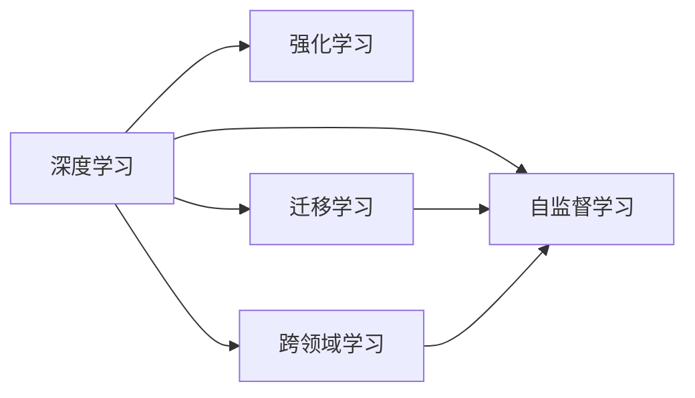
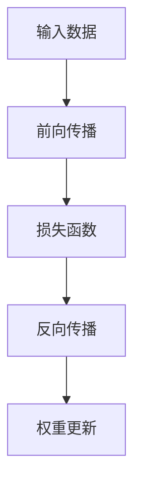
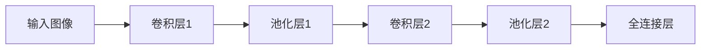

                 

# Andrej Karpathy：人工智能的未来发展前景

## 1. 背景介绍

在过去的几年里，人工智能(AI)的发展已经渗透到了几乎所有领域，从自动驾驶、语音识别到医疗健康，都在逐步实现智能化。随着技术的不断进步，AI在各行各业的应用也日益广泛。在这个背景下，Andrej Karpathy，一位深度学习领域的先驱，不断在AI领域进行深入研究和探索，并提出了对AI未来发展的独到见解。本文将结合Karpathy的研究和观点，探讨AI技术在未来可能的发展方向和面临的挑战。

## 2. 核心概念与联系

### 2.1 核心概念概述

在探讨AI的未来发展前景之前，需要先理解一些关键概念：

- **深度学习**：一种基于神经网络的机器学习方法，通过多层神经网络对输入数据进行处理和特征提取，以实现对复杂数据的高效建模和预测。
- **强化学习**：一种通过奖励机制指导模型学习的最优化方法，广泛应用于机器人控制、游戏AI等领域。
- **迁移学习**：一种通过在多个任务间共享知识来提高模型泛化能力的技术。
- **自监督学习**：一种在没有标注数据的情况下，利用数据的自身结构进行学习和建模的方法。
- **跨领域学习**：将一个领域中的知识应用于另一个领域，以提升模型在不同场景下的性能。

这些概念之间存在密切联系，共同构成了AI技术的核心。以下是这些概念之间的关系示意图：



### 2.2 概念间的关系

深度学习是AI技术的基石，通过多层神经网络对输入数据进行建模和预测。强化学习是在深度学习的基础上，通过奖励机制指导模型学习最优策略。迁移学习利用深度学习中的知识，在不同任务间共享，提升模型的泛化能力。自监督学习是深度学习的重要分支，通过利用数据自身的结构进行学习和建模。跨领域学习则是将一个领域中的知识应用于另一个领域，以提升模型在不同场景下的性能。这些概念互相交织，共同推动了AI技术的发展。

## 3. 核心算法原理 & 具体操作步骤

### 3.1 算法原理概述

Andrej Karpathy对深度学习的原理进行了深入研究，并提出了一些独到的见解。在深度学习中，神经网络通过反向传播算法（Backpropagation）进行训练，最小化预测值与真实值之间的误差。以下是反向传播算法的流程图：



反向传播算法通过前向传播计算预测值，再通过损失函数计算预测值与真实值之间的误差，最后通过反向传播算法更新权重，以最小化误差。Karpathy认为，深度学习的核心在于如何设计合理的神经网络结构和损失函数，以提高模型的预测精度。

### 3.2 算法步骤详解

Karpathy提出了一些具体的深度学习操作步骤，以指导开发者进行高效训练：

1. **数据预处理**：对输入数据进行清洗、归一化、特征提取等预处理步骤，以提高模型的训练效率。
2. **模型选择**：根据任务特点选择合适的神经网络结构，如卷积神经网络（CNN）、循环神经网络（RNN）等。
3. **损失函数设计**：根据任务特点选择合适的损失函数，如交叉熵损失、均方误差损失等。
4. **优化器选择**：选择合适的优化器，如随机梯度下降（SGD）、Adam等，以加速模型训练。
5. **模型验证**：在验证集上评估模型性能，避免过拟合。
6. **模型部署**：将训练好的模型部署到实际应用中，进行推理预测。

### 3.3 算法优缺点

深度学习的优点在于其强大的建模能力和高效的预测性能。然而，深度学习也存在一些缺点，如模型复杂度高、训练时间长、需要大量标注数据等。此外，深度学习模型也容易出现过拟合问题，特别是在数据量较小的情况下。

### 3.4 算法应用领域

深度学习在图像识别、语音识别、自然语言处理等领域已经取得了广泛的应用。以下是一些典型的应用场景：

- **图像识别**：通过深度学习模型对图像进行分类、物体检测等任务。
- **语音识别**：通过深度学习模型对语音进行识别和转写。
- **自然语言处理**：通过深度学习模型对文本进行情感分析、机器翻译、问答系统等任务。

## 4. 数学模型和公式 & 详细讲解 & 举例说明

### 4.1 数学模型构建

在深度学习中，常用的数学模型包括线性回归、逻辑回归、卷积神经网络（CNN）、循环神经网络（RNN）等。以下是一些典型的数学模型构建公式：

- **线性回归模型**：
  $$
  y = \theta^T x
  $$
  其中 $y$ 为输出值，$x$ 为输入特征，$\theta$ 为模型参数。

- **逻辑回归模型**：
  $$
  \text{sigmoid}(\theta^T x) = \frac{1}{1 + e^{-\theta^T x}}
  $$
  其中 $\text{sigmoid}$ 为逻辑回归的激活函数，用于将输出值映射到 $(0,1)$ 区间。

- **卷积神经网络**：
  $$
  y = h^{(1)} * W^{(1)} + b^{(1)} + h^{(2)} * W^{(2)} + b^{(2)} + \dots + h^{(N)} * W^{(N)} + b^{(N)}
  $$
  其中 $h^{(n)}$ 为卷积层的特征图，$W^{(n)}$ 为卷积核，$b^{(n)}$ 为偏置项。

### 4.2 公式推导过程

以下是一些典型的深度学习模型公式的推导过程：

- **线性回归模型的推导**：
  $$
  y = \theta^T x = \sum_{i=1}^n \theta_i x_i
  $$

- **逻辑回归模型的推导**：
  $$
  \text{sigmoid}(\theta^T x) = \frac{1}{1 + e^{-\theta^T x}} = \frac{1}{1 + \sum_{i=1}^n \theta_i x_i}
  $$

- **卷积神经网络的推导**：
  $$
  y = h^{(1)} * W^{(1)} + b^{(1)} + h^{(2)} * W^{(2)} + b^{(2)} + \dots + h^{(N)} * W^{(N)} + b^{(N)}
  $$

### 4.3 案例分析与讲解

以卷积神经网络为例，讲解其基本原理和应用。卷积神经网络通过卷积层、池化层、全连接层等结构，对输入数据进行处理和特征提取。其核心在于卷积层的卷积操作，通过卷积核对输入特征进行卷积运算，生成新的特征图。以下是卷积神经网络的示意图：



## 5. 项目实践：代码实例和详细解释说明

### 5.1 开发环境搭建

在深度学习项目开发中，选择合适的开发环境非常重要。以下是一些推荐的开发环境：

1. **Python**：深度学习最常用的编程语言，提供了丰富的科学计算库和框架。
2. **PyTorch**：一个动态计算图深度学习框架，支持GPU加速，适合研究和快速迭代。
3. **TensorFlow**：一个静态计算图深度学习框架，适合大规模工程应用。
4. **Jupyter Notebook**：一个交互式编程环境，支持代码、输出、图表等的一体化展示。

### 5.2 源代码详细实现

以下是使用PyTorch实现卷积神经网络的代码：

```python
import torch
import torch.nn as nn
import torch.optim as optim

# 定义卷积神经网络模型
class CNN(nn.Module):
    def __init__(self):
        super(CNN, self).__init__()
        self.conv1 = nn.Conv2d(1, 32, 3, 1)
        self.pool = nn.MaxPool2d(2, 2)
        self.conv2 = nn.Conv2d(32, 64, 3, 1)
        self.fc1 = nn.Linear(9216, 128)
        self.fc2 = nn.Linear(128, 10)

    def forward(self, x):
        x = self.pool(torch.relu(self.conv1(x)))
        x = self.pool(torch.relu(self.conv2(x)))
        x = x.view(-1, 9216)
        x = torch.relu(self.fc1(x))
        x = self.fc2(x)
        return x

# 训练模型
model = CNN()
criterion = nn.CrossEntropyLoss()
optimizer = optim.SGD(model.parameters(), lr=0.001, momentum=0.9)
device = torch.device("cuda:0" if torch.cuda.is_available() else "cpu")
model.to(device)
```

### 5.3 代码解读与分析

以上代码实现了基本的卷积神经网络模型，包括卷积层、池化层、全连接层等。代码中使用了PyTorch的高级API，简化了模型的定义和训练过程。

### 5.4 运行结果展示

训练完模型后，可以在测试集上进行评估：

```python
test_loss = 0
correct = 0
total = 0
with torch.no_grad():
    for data, target in test_loader:
        data, target = data.to(device), target.to(device)
        output = model(data)
        test_loss += criterion(output, target).item()
        _, predicted = torch.max(output.data, 1)
        total += target.size(0)
        correct += (predicted == target).sum().item()

print('Test set: Average loss: {:.4f}, Accuracy: {}/{} ({:.0f}%)'.format(
    test_loss / len(test_loader), correct, total, 100 * correct / total))
```

## 6. 实际应用场景

深度学习在实际应用中，已经取得了显著的成效。以下是一些典型的应用场景：

### 6.1 图像识别

深度学习在图像识别领域已经取得了广泛应用，如人脸识别、车辆识别、医疗影像分析等。通过卷积神经网络等模型，可以对输入图像进行分类、检测等任务。

### 6.2 语音识别

深度学习在语音识别领域也得到了广泛应用，如自动语音识别、语音情感分析等。通过循环神经网络等模型，可以对输入语音进行识别和分析。

### 6.3 自然语言处理

深度学习在自然语言处理领域也取得了显著成果，如机器翻译、情感分析、问答系统等。通过循环神经网络、卷积神经网络等模型，可以对输入文本进行分析和生成。

## 7. 工具和资源推荐

### 7.1 学习资源推荐

以下是一些推荐的深度学习学习资源：

1. **Deep Learning Specialization by Andrew Ng**：由斯坦福大学教授Andrew Ng主讲的深度学习课程，系统讲解了深度学习的核心概念和算法。
2. **CS231n: Convolutional Neural Networks for Visual Recognition**：斯坦福大学计算机视觉课程，详细讲解了卷积神经网络在图像识别中的应用。
3. **PyTorch官方文档**：PyTorch官方文档，提供了丰富的教程和示例，适合深度学习初学者和进阶者。
4. **TensorFlow官方文档**：TensorFlow官方文档，提供了完整的API和示例，适合深度学习开发者和研究者。

### 7.2 开发工具推荐

以下是一些推荐的深度学习开发工具：

1. **PyTorch**：一个动态计算图深度学习框架，支持GPU加速，适合研究和快速迭代。
2. **TensorFlow**：一个静态计算图深度学习框架，适合大规模工程应用。
3. **Jupyter Notebook**：一个交互式编程环境，支持代码、输出、图表等的一体化展示。

### 7.3 相关论文推荐

以下是一些推荐的深度学习相关论文：

1. **ImageNet Classification with Deep Convolutional Neural Networks**：Hinton等人提出的卷积神经网络在图像分类任务上的应用。
2. **Speech Recognition with Deep Recurrent Neural Networks**：Graves等人提出的循环神经网络在语音识别任务上的应用。
3. **Attention is All You Need**：Vaswani等人提出的Transformer模型在自然语言处理任务上的应用。

## 8. 总结：未来发展趋势与挑战

### 8.1 研究成果总结

Andrej Karpathy在深度学习领域进行了深入研究，提出了许多独到的见解。以下是一些总结：

1. **深度学习的核心在于模型设计和优化**：选择合适的模型结构和优化器，可以有效提高模型性能。
2. **迁移学习可以提升模型的泛化能力**：通过在不同任务间共享知识，可以提升模型的泛化能力。
3. **自监督学习可以提升模型的训练效率**：在没有标注数据的情况下，利用数据自身的结构进行学习和建模。

### 8.2 未来发展趋势

深度学习在未来的发展趋势如下：

1. **多模态学习**：将视觉、语音、文本等不同模态的数据进行融合，提升模型的综合能力。
2. **可解释性**：如何提高模型的可解释性，使其更加透明和可信。
3. **联邦学习**：如何在多个设备之间进行分布式训练，提升模型的训练效率和泛化能力。

### 8.3 面临的挑战

深度学习在未来的发展过程中，也面临一些挑战：

1. **计算资源不足**：大规模深度学习模型的训练需要大量的计算资源，如何优化计算效率是一个重要问题。
2. **数据隐私问题**：如何在数据隐私保护的前提下进行深度学习模型的训练和应用。
3. **模型解释性不足**：深度学习模型的黑盒特性，使得模型的解释性成为一个重要问题。

### 8.4 研究展望

为了应对这些挑战，未来深度学习的研究方向如下：

1. **模型压缩和优化**：如何通过模型压缩和优化，减少计算资源消耗。
2. **隐私保护技术**：如何通过隐私保护技术，保护数据隐私和安全。
3. **可解释性模型**：如何设计可解释性模型，提升模型的透明度和可信度。

总之，深度学习作为人工智能的重要分支，其未来发展前景广阔。通过不断探索和创新，深度学习将在更多领域得到应用，为社会带来更多价值。

## 9. 附录：常见问题与解答

**Q1：深度学习与传统机器学习有什么区别？**

A: 深度学习与传统机器学习的区别在于，深度学习使用多层神经网络对数据进行建模和预测，具有较强的非线性拟合能力。而传统机器学习则主要依赖手工设计的特征，依赖于特征工程。

**Q2：深度学习的优势和劣势是什么？**

A: 深度学习的优势在于其强大的建模能力和高效的数据利用率。但其劣势在于模型复杂度高、训练时间长、需要大量标注数据等。此外，深度学习模型也容易出现过拟合问题。

**Q3：如何避免深度学习模型的过拟合？**

A: 避免过拟合的方法包括数据增强、正则化、早停等。通过引入更多的训练样本、使用正则化技术、设置合理的训练轮数等，可以有效避免过拟合。

**Q4：深度学习在实际应用中有哪些困难？**

A: 深度学习在实际应用中面临的困难包括计算资源不足、数据隐私问题、模型解释性不足等。通过模型压缩、隐私保护技术、可解释性模型等方法，可以有效解决这些问题。

**Q5：未来深度学习的发展方向是什么？**

A: 未来深度学习的发展方向包括多模态学习、可解释性、联邦学习等。通过多模态融合、提高模型透明度、分布式训练等方法，深度学习将在更多领域得到应用。

---

作者：禅与计算机程序设计艺术 / Zen and the Art of Computer Programming

