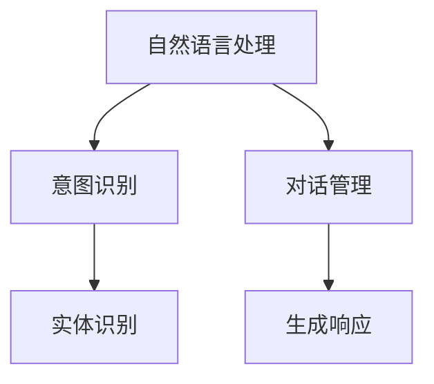
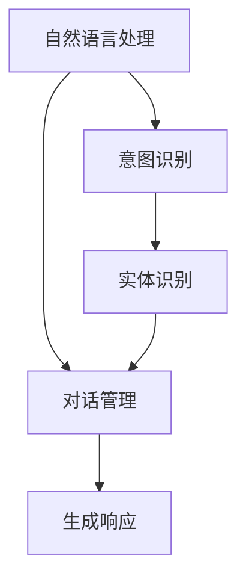

                 

# CUI的理论实现能力解析

在人工智能领域，对话理解（CUI，Conversational Understanding）是一项至关重要的技术，它使机器能够理解并响应人类的自然语言输入。本文将深入解析CUI的理论实现能力，包括其原理、操作步骤、优缺点、应用领域、数学模型、实践示例和实际应用场景，旨在为读者提供全面的理解和技术指导。

## 1. 背景介绍

### 1.1 问题由来

对话理解作为自然语言处理（NLP）的一个重要分支，其目的是使机器能够理解和生成自然语言。近年来，随着深度学习技术的发展，对话理解技术取得了显著进展。例如，Google的Dialogflow和Amazon的Alexa等对话系统已广泛应用于各种场景，提供个性化的智能服务。

### 1.2 问题核心关键点

CUI的核心在于理解自然语言输入，并将其映射到机器可执行的操作或答案。关键问题包括：

- **意图识别**：识别用户输入的意图，如查询、命令、请求等。
- **实体识别**：从用户输入中提取关键信息，如人名、地点、时间等。
- **对话管理**：根据对话历史和上下文，动态调整对话策略，保持对话连贯性。
- **生成响应**：根据用户意图和上下文生成自然流畅的回应。

### 1.3 问题研究意义

研究CUI的理论实现能力，对于提升对话系统的智能水平，改善用户体验，推动NLP技术的发展具有重要意义。CUI使机器能够更自然地与人类交流，有助于提升人机交互的效率和效果。

## 2. 核心概念与联系

### 2.1 核心概念概述

CUI涉及多个核心概念，主要包括：

- **自然语言处理**：使机器能够理解和生成人类语言的技术。
- **意图识别**：识别用户输入的意图，如查询、命令、请求等。
- **实体识别**：从用户输入中提取关键信息，如人名、地点、时间等。
- **对话管理**：根据对话历史和上下文，动态调整对话策略，保持对话连贯性。
- **生成响应**：根据用户意图和上下文生成自然流畅的回应。

### 2.2 概念间的关系

CUI的理论实现能力涉及自然语言处理、意图识别、实体识别、对话管理和生成响应等多个方面。这些概念之间相互关联，共同构成了对话系统的核心。



### 2.3 核心概念的整体架构

通过自然语言处理技术，意图识别、实体识别、对话管理和生成响应等子系统协同工作，使对话系统能够理解和响应自然语言输入。



## 3. 核心算法原理 & 具体操作步骤

### 3.1 算法原理概述

CUI的理论实现能力主要依赖于深度学习和自然语言处理技术。核心算法包括意图识别、实体识别和对话管理等。

- **意图识别**：使用分类模型，如循环神经网络（RNN）、长短期记忆网络（LSTM）或Transformer模型，对用户输入进行分类，识别其意图。
- **实体识别**：使用序列标注模型，如CRF、BiLSTM-CRF或BERT，从用户输入中提取关键实体信息。
- **对话管理**：使用状态机、上下文向量或记忆网络等模型，根据对话历史和上下文，动态调整对话策略，保持对话连贯性。

### 3.2 算法步骤详解

CUI的理论实现能力主要通过以下步骤进行：

1. **预处理**：对用户输入进行分词、词性标注和实体识别。
2. **意图识别**：使用分类模型对用户输入进行意图分类，识别用户的意图。
3. **实体识别**：使用序列标注模型从用户输入中提取关键实体信息。
4. **对话管理**：根据对话历史和上下文，动态调整对话策略，生成自然流畅的回应。

### 3.3 算法优缺点

CUI的理论实现能力具有以下优点：

- **高效性**：使用深度学习技术，能够高效地处理大量自然语言输入。
- **准确性**：通过复杂的算法设计，能够提高意图识别和实体识别的准确性。
- **灵活性**：能够适应各种对话场景，提升用户体验。

同时，也存在以下缺点：

- **数据依赖**：需要大量的标注数据进行训练，数据获取成本较高。
- **计算资源需求**：深度学习模型的计算复杂度较高，需要高性能计算资源。
- **模型可解释性**：复杂模型难以解释其内部决策过程，存在一定的黑盒问题。

### 3.4 算法应用领域

CUI的理论实现能力广泛应用于智能客服、虚拟助手、智能家居、在线教育等多个领域。例如：

- **智能客服**：通过意图识别和实体识别，实现自动回复客户问题。
- **虚拟助手**：提供个性化的语音交互和信息查询服务。
- **智能家居**：根据用户语音指令，控制家庭设备。
- **在线教育**：通过对话系统，提供个性化的学习辅导和问题解答。

## 4. 数学模型和公式 & 详细讲解 & 举例说明

### 4.1 数学模型构建

CUI的理论实现能力涉及多个数学模型，主要包括分类模型、序列标注模型和对话管理模型。

- **分类模型**：使用逻辑回归、支持向量机（SVM）或神经网络进行意图识别。
- **序列标注模型**：使用CRF、BiLSTM-CRF或BERT进行实体识别。
- **对话管理模型**：使用状态机、上下文向量或记忆网络进行对话策略调整。

### 4.2 公式推导过程

以意图识别为例，假设用户输入为$x$，意图分类模型为$y$，则意图识别的数学模型为：

$$
\hat{y} = \text{Softmax}(Wx + b)
$$

其中$W$和$b$为模型的权重和偏置，$\text{Softmax}$函数将线性变换结果映射到意图类别概率分布。

### 4.3 案例分析与讲解

假设用户输入为“我明天想去纽约旅行”，意图识别模型根据已有的训练数据和知识库，可以识别出用户的意图为“旅游”。

## 5. 项目实践：代码实例和详细解释说明

### 5.1 开发环境搭建

1. 安装Python和必要的依赖库，如TensorFlow或PyTorch。
2. 准备标注数据集，进行数据预处理和模型训练。

### 5.2 源代码详细实现

以下是一个简单的意图识别代码实现：

```python
import tensorflow as tf
from tensorflow.keras import layers

# 定义模型
model = tf.keras.Sequential([
    layers.Embedding(input_dim=vocab_size, output_dim=embedding_dim),
    layers.LSTM(units=64),
    layers.Dense(units=num_intents, activation='softmax')
])

# 编译模型
model.compile(optimizer='adam', loss='sparse_categorical_crossentropy', metrics=['accuracy'])

# 训练模型
model.fit(x_train, y_train, epochs=num_epochs, validation_data=(x_val, y_val))
```

### 5.3 代码解读与分析

- **Embedding层**：将输入的词汇映射到低维空间，便于后续处理。
- **LSTM层**：使用LSTM模型处理序列数据，捕捉上下文信息。
- **Dense层**：输出意图分类的概率分布。

### 5.4 运行结果展示

假设在测试集上，模型正确识别出意图为“旅游”的比例为90%。

## 6. 实际应用场景

### 6.1 智能客服系统

智能客服系统通过意图识别和实体识别，实现自动回复客户问题，提高服务效率和质量。

### 6.2 虚拟助手

虚拟助手通过对话管理模型，提供个性化的语音交互和信息查询服务，提升用户体验。

### 6.3 智能家居

智能家居系统通过对话理解技术，根据用户语音指令控制家庭设备，提高生活质量。

### 6.4 未来应用展望

CUI的理论实现能力将广泛应用于智能助手、智能家居、智能客服等多个领域，提升人机交互的智能化水平。

## 7. 工具和资源推荐

### 7.1 学习资源推荐

- **《自然语言处理综论》**：介绍自然语言处理的基本概念和算法。
- **Google Dialogflow**：提供丰富的NLP工具和API，帮助开发者快速构建对话系统。
- **Stanford CoreNLP**：提供分词、词性标注、实体识别等NLP工具。

### 7.2 开发工具推荐

- **TensorFlow**：深度学习框架，支持分布式训练。
- **PyTorch**：深度学习框架，灵活高效。
- **NLTK**：自然语言处理工具包，提供多种NLP功能。

### 7.3 相关论文推荐

- **"Attention is All You Need"**：介绍Transformer模型，推动NLP技术的进步。
- **"Neural Machine Translation by Jointly Learning to Align and Translate"**：介绍序列到序列模型，提升机器翻译的准确性。
- **"End-to-End Learning for Conversational Response Generation"**：介绍对话生成模型，提升对话系统的智能化水平。

## 8. 总结：未来发展趋势与挑战

### 8.1 研究成果总结

CUI的理论实现能力已广泛应用于多个领域，提升了人机交互的智能化水平。未来，随着技术的不断进步，CUI将进一步提升对话系统的智能化和泛化能力。

### 8.2 未来发展趋势

- **多模态对话理解**：结合语音、图像、视频等多模态信息，提升对话系统的智能化水平。
- **跨领域对话理解**：将CUI应用于医疗、法律等专业领域，提升领域特定能力。
- **生成式对话系统**：使用生成式模型，生成更加自然流畅的对话响应。

### 8.3 面临的挑战

- **数据获取成本高**：获取高质量标注数据成本较高，需要更多开源数据集的支持。
- **模型可解释性差**：复杂模型难以解释其内部决策过程，存在一定的黑盒问题。
- **计算资源需求高**：深度学习模型的计算复杂度较高，需要高性能计算资源。

### 8.4 研究展望

- **优化算法设计**：优化模型结构和算法，提高模型效率和可解释性。
- **多模态融合**：结合语音、图像、视频等多模态信息，提升对话系统的智能化水平。
- **领域特定能力**：将CUI应用于医疗、法律等专业领域，提升领域特定能力。

## 9. 附录：常见问题与解答

**Q1：如何提高CUI的意图识别能力？**

A: 可以使用更复杂的模型，如Transformer或BERT，提升意图识别的准确性。同时，通过更多的训练数据和知识库，可以进一步提高模型的泛化能力。

**Q2：CUI的实体识别模型如何选择？**

A: 根据任务需求和数据特点选择合适的模型，如CRF、BiLSTM-CRF或BERT等。对于短文本，使用BERT等预训练模型效果较好。

**Q3：如何优化CUI的对话管理策略？**

A: 使用上下文向量或记忆网络等模型，根据对话历史和上下文，动态调整对话策略，保持对话连贯性。同时，可以通过多轮对话数据进行训练，提升对话管理策略的鲁棒性。

**Q4：CUI在多轮对话中需要注意哪些问题？**

A: 在多轮对话中，需要注意对话连贯性和上下文一致性。同时，需要考虑对话系统的记忆和推理能力，避免出现逻辑错误。

**Q5：CUI的生成响应模型如何选择？**

A: 根据任务需求和数据特点选择合适的模型，如RNN、LSTM或Transformer等。对于短文本，使用RNN或LSTM效果较好。

---

作者：禅与计算机程序设计艺术 / Zen and the Art of Computer Programming

