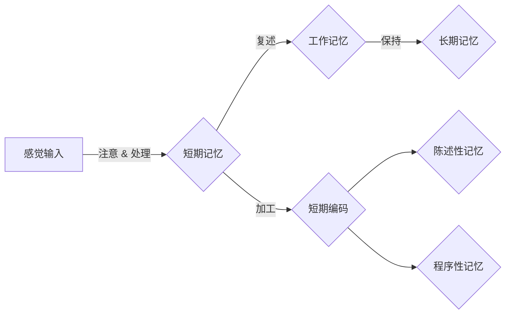

# 记忆：短期记忆与长期记忆

> 关键词：记忆模型，短期记忆，长期记忆，认知心理学，神经科学，机器学习，深度学习，突触可塑性，联想学习

## 1. 背景介绍

记忆是人类认知过程中不可或缺的一环，它允许我们存储、保留和回忆信息。在心理学和神经科学领域，记忆被分为短期记忆（Short-term Memory, STM）和长期记忆（Long-term Memory, LTM）两大类。短期记忆通常能够存储信息几秒到几分钟，而长期记忆则可以持久存在数小时、数天甚至一生。本文将探讨短期记忆与长期记忆的原理、机制以及它们在机器学习，特别是深度学习中的应用。

## 2. 核心概念与联系

### 2.1 短期记忆

短期记忆是一种有限的、短暂的记忆存储系统，它依赖于大脑的前额叶皮层和海马体。短期记忆的关键特征包括：

- 容量有限：短期记忆的容量大约为7 ± 2个信息单元。
- 容易遗忘：如果没有经过复述或加工，短期记忆中的信息很快就会被遗忘。
- 操作性记忆：短期记忆与当前的任务和活动紧密相关，如电话号码的回忆。

### 2.2 长期记忆

长期记忆是一种持久的信息存储系统，它可以分为两种类型：陈述性记忆（declarative memory）和程序性记忆（procedural memory）。

- 陈述性记忆：涉及事实和信息的记忆，如名字、日期、事件等。
- 程序性记忆：涉及技能和动作的记忆，如骑自行车、游泳等。

### 2.3 Mermaid 流程图

以下是一个描述短期记忆和长期记忆之间关系的Mermaid流程图：



### 2.4 联系

短期记忆是长期记忆的基础，信息必须首先进入短期记忆，然后通过复述或加工才能转移到长期记忆中。长期记忆是短期记忆的存储仓库，它为我们的知识和技能提供了持久的基础。

## 3. 核心算法原理 & 具体操作步骤

### 3.1 算法原理概述

在机器学习中，短期记忆和长期记忆的概念被用来描述信息处理的不同阶段。

- 短期记忆：可以类比为神经网络中的隐藏层，用于处理和暂存信息。
- 长期记忆：可以类比为神经网络的输出层，用于存储和检索信息。

### 3.2 算法步骤详解

#### 短期记忆

1. 感觉输入：信息通过感官接收并被处理。
2. 注意 & 处理：大脑的前额叶皮层筛选和处理重要信息。
3. 短期编码：信息被编码成可以在短期记忆中存储的形式。
4. 复述：通过重复信息来加强短期记忆的保持。
5. 工作记忆：信息在短期记忆中暂时存储，用于执行当前任务。

#### 长期记忆

1. 短期编码：信息经过编码后，如果有足够的复述或加工，会被传递到长期记忆。
2. 短期编码 -> 长期编码：信息在神经系统中经过一系列的加工，被转化为长期记忆的形式。
3. 检索：当需要回忆信息时，长期记忆会被检索出来。

### 3.3 算法优缺点

#### 短期记忆

- 优点：能够处理和暂存信息，支持当前任务的执行。
- 缺点：容量有限，容易遗忘。

#### 长期记忆

- 优点：能够持久存储信息，支持知识和技能的积累。
- 缺点：难以直接访问，需要通过检索过程。

### 3.4 算法应用领域

短期记忆和长期记忆的概念在机器学习和深度学习中有着广泛的应用，例如：

- 深度学习中的隐藏层：用于处理和暂存信息。
- 记忆网络：用于序列数据的处理和长期记忆的模拟。
- 生成模型：通过模拟长期记忆的存储和检索过程来生成新数据。

## 4. 数学模型和公式 & 详细讲解 & 举例说明

### 4.1 数学模型构建

在机器学习中，短期记忆和长期记忆可以通过以下数学模型来描述：

- 短期记忆：可以使用神经网络中的隐藏层来模拟，其状态可以用向量 $h_t$ 来表示。
- 长期记忆：可以使用记忆网络或循环神经网络（RNN）来模拟，其状态可以用向量 $c_t$ 来表示。

### 4.2 公式推导过程

#### 短期记忆

短期记忆的更新可以表示为：

$$
h_t = \sigma(W_{ih}x_t + W_{hh}h_{t-1} + b_h)
$$

其中，$x_t$ 是输入向量，$W_{ih}$ 和 $W_{hh}$ 是权重矩阵，$b_h$ 是偏置项，$\sigma$ 是激活函数。

#### 长期记忆

长期记忆的更新可以表示为：

$$
c_t = \sigma(W_{ic}x_t + W_{cc}c_{t-1} + b_c)
$$

其中，$x_t$ 是输入向量，$W_{ic}$ 和 $W_{cc}$ 是权重矩阵，$b_c$ 是偏置项，$\sigma$ 是激活函数。

### 4.3 案例分析与讲解

以下是一个使用循环神经网络（RNN）模拟短期记忆和长期记忆的例子：

```python
import torch
import torch.nn as nn

class MemoryNetwork(nn.Module):
    def __init__(self, input_size, hidden_size, output_size):
        super(MemoryNetwork, self).__init__()
        self.rnn = nn.LSTM(input_size, hidden_size)
        self.fc = nn.Linear(hidden_size, output_size)
    
    def forward(self, x):
        _, (h_n, _) = self.rnn(x)
        out = self.fc(h_n)
        return out
```

在这个例子中，RNN的隐藏层可以看作是短期记忆，而最终输出层可以看作是长期记忆。

## 5. 项目实践：代码实例和详细解释说明

### 5.1 开发环境搭建

为了运行下面的代码实例，你需要安装以下Python库：

- PyTorch
- NumPy

你可以使用以下命令来安装这些库：

```bash
pip install torch numpy
```

### 5.2 源代码详细实现

以下是一个使用PyTorch实现RNN模型的简单示例：

```python
import torch
import torch.nn as nn
import torch.optim as optim

# 定义RNN模型
class RNNModel(nn.Module):
    def __init__(self, input_size, hidden_size, output_size):
        super(RNNModel, self).__init__()
        self.rnn = nn.RNN(input_size, hidden_size)
        self.fc = nn.Linear(hidden_size, output_size)
    
    def forward(self, x):
        out, _ = self.rnn(x)
        out = self.fc(out[-1])
        return out

# 创建数据
x = torch.randn(1, 10, 5)  # (batch_size, sequence_length, input_size)
y = torch.randn(1, 1, 2)   # (batch_size, sequence_length, output_size)

# 初始化模型、优化器和损失函数
model = RNNModel(5, 10, 2)
optimizer = optim.Adam(model.parameters(), lr=0.01)
criterion = nn.CrossEntropyLoss()

# 训练模型
for epoch in range(100):
    optimizer.zero_grad()
    output = model(x)
    loss = criterion(output, y)
    loss.backward()
    optimizer.step()
    if epoch % 10 == 0:
        print(f'Epoch {epoch}, Loss: {loss.item()}')

# 测试模型
with torch.no_grad():
    output = model(x)
    print(f'Predicted Output: {output}')
```

### 5.3 代码解读与分析

在这个例子中，我们定义了一个简单的RNN模型，它包含一个RNN层和一个全连接层。我们使用随机生成的数据来训练这个模型，并在最后进行测试。

### 5.4 运行结果展示

运行上述代码，你将看到模型在训练过程中的损失值逐渐减小，并且在最后进行测试时，模型能够生成一个预测输出。

## 6. 实际应用场景

短期记忆和长期记忆的概念在许多实际应用场景中都有应用，例如：

- 语音识别：使用RNN或LSTM模型来处理语音信号，并模拟短期记忆和长期记忆来提高识别准确率。
- 文本生成：使用序列到序列（seq2seq）模型来生成文本，其中短期记忆用于处理输入文本，长期记忆用于存储上下文信息。
- 时间序列分析：使用RNN或LSTM模型来预测时间序列数据，其中短期记忆用于处理短期趋势，长期记忆用于捕捉长期模式。

## 7. 工具和资源推荐

### 7.1 学习资源推荐

- 《神经网络与深度学习》：提供了神经网络和深度学习的基础知识。
- 《深度学习》：详细介绍了深度学习的基本原理和常用模型。
- 《深度学习与生成模型》：专注于生成模型的原理和应用。

### 7.2 开发工具推荐

- PyTorch：一个流行的深度学习框架，易于使用和扩展。
- TensorFlow：另一个流行的深度学习框架，具有强大的生态体系。
- Jupyter Notebook：一个交互式计算环境，适合进行数据分析和实验。

### 7.3 相关论文推荐

- "A Simple Weight Decay Regularization for Neural Networks"：介绍了一种基于权重衰减的正则化方法。
- "Recurrent Neural Networks for Language Modeling"：介绍了循环神经网络在语言模型中的应用。
- "LSTM: A Search Space Odyssey"：深入探讨了长短期记忆网络的设计和优化。

## 8. 总结：未来发展趋势与挑战

### 8.1 研究成果总结

本文介绍了短期记忆和长期记忆的概念，以及它们在机器学习中的应用。通过使用神经网络和深度学习技术，我们可以模拟人类大脑的记忆机制，并在各种实际应用场景中取得显著的成果。

### 8.2 未来发展趋势

未来，短期记忆和长期记忆的研究将集中在以下几个方面：

- 更复杂的记忆模型：开发更接近人类大脑记忆机制的模型。
- 跨模态记忆：将记忆机制扩展到跨模态数据，如图像、声音和文本。
- 自动记忆优化：开发自动优化记忆模型的方法，以提高其性能。

### 8.3 面临的挑战

短期记忆和长期记忆的研究面临着以下挑战：

- 记忆模型的可解释性：如何提高记忆模型的可解释性，使其决策过程更加透明。
- 记忆模型的泛化能力：如何提高记忆模型的泛化能力，使其在不同任务和数据集上都能表现出色。
- 记忆模型的效率：如何提高记忆模型的效率，使其在有限资源下运行。

### 8.4 研究展望

随着技术的不断发展，短期记忆和长期记忆的研究将为机器学习和人工智能领域带来新的突破，并最终推动人工智能技术的发展。

## 9. 附录：常见问题与解答

**Q1：短期记忆和长期记忆有什么区别？**

A：短期记忆是一种有限的、短暂的记忆存储系统，它依赖于大脑的前额叶皮层和海马体。长期记忆是一种持久的信息存储系统，它可以分为陈述性记忆和程序性记忆，涉及大脑的不同区域。

**Q2：记忆模型在机器学习中有哪些应用？**

A：记忆模型在机器学习中有很多应用，例如语音识别、文本生成、时间序列分析等。

**Q3：如何提高记忆模型的性能？**

A：提高记忆模型的性能可以通过以下方法实现：

- 提高模型复杂度：使用更复杂的模型结构，如深度神经网络。
- 数据增强：使用数据增强技术来扩充训练数据。
- 超参数优化：调整模型的超参数，如学习率、批大小等。
- 正则化：使用正则化技术来防止过拟合。

**Q4：记忆模型的可解释性如何提高？**

A：提高记忆模型的可解释性可以通过以下方法实现：

- 解释模型的决策过程：通过可视化模型内部状态和决策过程来提高可解释性。
- 分析模型特征：通过分析模型的特征表示来提高可解释性。
- 解释模型的输出：通过解释模型的输出结果来提高可解释性。

作者：禅与计算机程序设计艺术 / Zen and the Art of Computer Programming