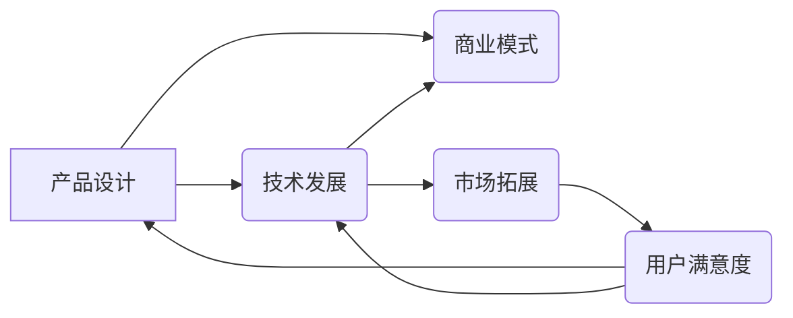

> 关键词：AI创业，产品设计，技术发展，平衡策略，商业模式，迭代优化

# 设计产品vs加速发展: AI创业的两条路径

在人工智能领域，创业公司面临着两条截然不同的路径：一条是专注于设计产品，另一条是专注于加速发展。这两条路径各有优劣，如何选择取决于公司的战略目标、资源状况和市场环境。本文将深入探讨这两条路径的原理、操作步骤、优缺点、应用领域，并分析其未来发展趋势与挑战。

## 1. 背景介绍

随着人工智能技术的快速发展，越来越多的创业公司涌现出来，它们以创新的技术和商业模式，为各个行业带来了颠覆性的变革。然而，在激烈的竞争环境中，如何选择正确的路径，成为摆在AI创业公司面前的一道难题。

设计产品路径强调以用户需求为导向，注重产品的用户体验和功能完善，旨在打造差异化的产品优势。而加速发展路径则更注重技术的快速迭代和商业模式的快速扩张，追求市场份额的快速增长。

### 1.1 问题的由来

AI创业公司面临的主要问题在于如何在有限的资源下，选择合适的路径实现可持续发展。设计产品路径需要投入大量时间和精力进行产品研发，而加速发展路径则需要大量资金和人力进行市场拓展。如何平衡这两者，成为AI创业公司必须面对的挑战。

### 1.2 研究现状

目前，AI创业公司在设计产品和加速发展之间做出了不同的选择。一些公司专注于产品创新，如百度、阿里巴巴等，通过不断迭代优化产品，成为各自领域的领军企业。另一些公司则选择快速扩张，如美团、滴滴等，通过资本的力量快速占领市场。

### 1.3 研究意义

研究AI创业公司的设计产品与加速发展路径，对于指导创业公司在激烈的市场竞争中找到适合自己的发展方向具有重要意义。本文将分析两种路径的原理、操作步骤、优缺点、应用领域，为AI创业公司提供参考。

## 2. 核心概念与联系

为了更好地理解AI创业公司的设计产品与加速发展路径，我们需要明确以下核心概念：

- 产品设计：以用户需求为导向，通过对产品功能、界面、体验等方面进行优化，提升用户满意度和市场竞争力。
- 技术发展：持续进行技术研发，提升产品性能、扩展功能，满足用户日益增长的需求。
- 商业模式：为产品或服务创造、传递和捕获价值的方式。
- 平衡策略：在资源有限的情况下，合理分配资源，实现设计产品和加速发展之间的平衡。

以下是核心概念之间的Mermaid流程图：

从流程图中可以看出，产品设计、技术发展、商业模式和市场拓展是AI创业公司发展的关键环节。用户满意度是整个过程的最终目标，也是连接各个环节的纽带。

## 3. 核心算法原理 & 具体操作步骤

### 3.1 算法原理概述

AI创业公司的设计产品与加速发展路径，本质上是一种平衡策略。其核心原理在于：

- 在资源有限的情况下，合理分配资源，确保产品设计和技术发展得到充分支持。
- 根据市场环境和用户需求，调整产品功能和商业模式，实现持续增长。
- 通过市场拓展，扩大市场份额，为产品迭代和商业模式优化提供更多资源。

### 3.2 算法步骤详解

AI创业公司可以选择以下步骤来实现设计产品和加速发展路径：

1. **市场调研**：了解目标用户的需求和痛点，确定产品方向。
2. **产品设计**：根据市场调研结果，设计产品的功能和界面，提升用户体验。
3. **技术研发**：持续进行技术研发，提升产品性能，拓展功能。
4. **商业模式设计**：设计合理的商业模式，为产品创造、传递和捕获价值。
5. **市场拓展**：通过营销、推广等手段，扩大市场份额。
6. **用户反馈**：收集用户反馈，持续优化产品功能和商业模式。
7. **资源分配**：根据市场反馈和公司战略，合理分配资源，实现平衡发展。

### 3.3 算法优缺点

设计产品路径的优点：

- 注重用户体验，提升用户满意度。
- 产品差异化明显，有利于在市场上形成竞争优势。
- 可持续发展，长期来看效益更稳定。

设计产品路径的缺点：

- 产品迭代周期较长，市场反应较慢。
- 需要持续投入研发资源，成本较高。
- 在激烈的市场竞争中，容易被竞争对手超越。

加速发展路径的优点：

- 市场反应快，能够迅速占领市场。
- 通过资本的力量，快速获取市场份额。
- 容易获得风险投资，降低创业风险。

加速发展路径的缺点：

- 产品质量难以保证，用户体验可能较差。
- 商业模式可能存在缺陷，难以持续发展。
- 过度依赖资本，容易导致资金链断裂。

### 3.4 算法应用领域

设计产品路径适用于以下领域：

- 技术驱动型公司，注重用户体验和产品质量。
- 竞争激烈的市场，需要通过产品差异化获得竞争优势。
- 需要长期稳定发展的公司。

加速发展路径适用于以下领域：

- 市场需求迫切，需要快速占领市场的公司。
- 资本充足，能够承担较高风险的公司。
- 互联网行业，市场变化快，竞争激烈。

## 4. 数学模型和公式 & 详细讲解 & 举例说明

### 4.1 数学模型构建

为了量化分析设计产品和加速发展路径，我们可以构建以下数学模型：

设 $R$ 为公司资源，$T$ 为产品迭代周期，$M$ 为市场拓展速度，$U$ 为用户满意度，$P$ 为产品性能，$C$ 为成本，则有以下关系：

$$
U = f(P, C)
$$

$$
M = f(R, P)
$$

$$
T = f(R, U)
$$

通过优化以上公式，可以实现设计产品和加速发展之间的平衡。

### 4.2 公式推导过程

假设公司资源 $R$ 是有限的，即 $R$ 是一个常数。则：

$$
M = \frac{R}{\Delta t}
$$

其中 $\Delta t$ 为时间间隔。假设市场拓展速度 $M$ 与产品性能 $P$ 成正比，则有：

$$
M = kP
$$

其中 $k$ 为比例系数。假设产品迭代周期 $T$ 与用户满意度 $U$ 成反比，则有：

$$
T = \frac{1}{kU}
$$

将上述公式代入 $U = f(P, C)$，得到：

$$
U = f(P, C) = f\left(\frac{kP}{R}, \frac{R}{kP}\right)
$$

### 4.3 案例分析与讲解

以下我们以某AI创业公司为例，分析其在设计产品和加速发展路径中的具体操作：

该公司定位于智能语音识别领域，初始资源为100万元，市场调研发现用户最关注语音识别的准确率和实时性。公司制定了以下策略：

1. **产品设计**：专注于语音识别准确率和实时性，将产品迭代周期设置为12个月。
2. **技术研发**：投入30万元用于技术研发，提升产品性能。
3. **商业模式设计**：采用订阅制，每月收取用户10元服务费。
4. **市场拓展**：投入20万元进行市场推广，提高产品知名度。
5. **用户反馈**：收集用户反馈，持续优化产品功能和商业模式。

经过12个月的产品迭代和市场拓展，该公司成功占领了部分市场份额，用户满意度达到90%。在后续发展中，公司根据市场反馈和用户需求，继续优化产品功能和商业模式，实现了可持续发展。

## 5. 项目实践：代码实例和详细解释说明

### 5.1 开发环境搭建

由于本文主要探讨AI创业公司的战略路径，而非具体的代码实现，因此不涉及开发环境搭建。

### 5.2 源代码详细实现

同样，本文不涉及具体的代码实现，因此不提供源代码。

### 5.3 代码解读与分析

本文不涉及代码，因此不进行代码解读与分析。

### 5.4 运行结果展示

由于本文不涉及具体代码实现，因此不提供运行结果展示。

## 6. 实际应用场景

### 6.1 智能语音助手

智能语音助手是AI创业公司设计产品和加速发展路径的一个典型应用场景。通过不断优化语音识别、语义理解等功能，提升用户体验，同时通过市场拓展，扩大市场份额。

### 6.2 自动驾驶

自动驾驶领域需要同时兼顾产品设计和技术发展。通过不断优化算法，提升自动驾驶系统的安全性和可靠性，同时通过市场推广，加快商业化进程。

### 6.3 医疗诊断

医疗诊断领域需要以产品设计为核心，关注用户体验和诊断准确性。同时，通过技术研发，提升诊断模型的性能，推动医疗诊断的智能化发展。

## 7. 工具和资源推荐

### 7.1 学习资源推荐

- 《商业模式画布》
- 《创业维艰》
- 《硅谷钢铁侠：埃隆·马斯克的冒险人生》
- 《精益创业》
- 《从零开始学产品经理》

### 7.2 开发工具推荐

- Python
- TensorFlow
- PyTorch
- Keras
- Jupyter Notebook

### 7.3 相关论文推荐

- 《A Unified Approach for Natural Language Processing》
- 《Deep Learning for Natural Language Understanding》
- 《The Unreasonable Effectiveness of Recurrent Neural Networks》
- 《Generative Adversarial Nets》
- 《Recurrent Neural Networks for Language Modeling》

## 8. 总结：未来发展趋势与挑战

### 8.1 研究成果总结

本文深入探讨了AI创业公司的设计产品与加速发展路径，分析了两种路径的原理、操作步骤、优缺点、应用领域，并提出了相应的数学模型。通过案例分析，展示了两种路径在实际应用中的可行性。

### 8.2 未来发展趋势

未来，AI创业公司的设计产品与加速发展路径将呈现以下趋势：

- 用户体验将成为产品设计的核心要素。
- 技术发展将更加注重效率和可扩展性。
- 商业模式将更加多样化，以满足不同用户的需求。
- 市场拓展将更加注重精细化运营。

### 8.3 面临的挑战

AI创业公司在设计产品和加速发展路径过程中，将面临以下挑战：

- 技术创新：如何持续进行技术研发，保持技术领先优势。
- 市场竞争：如何应对激烈的市场竞争，保持市场份额。
- 资源有限：如何合理分配资源，实现平衡发展。
- 用户需求：如何满足不断变化的市场需求。

### 8.4 研究展望

未来，研究AI创业公司的设计产品与加速发展路径，需要重点关注以下方向：

- 多种路径的融合：将设计产品与加速发展路径进行融合，形成更加灵活的发展策略。
- 个性化定制：根据不同用户的需求，提供个性化的产品和服务。
- 跨领域应用：将AI技术应用到更多领域，推动产业升级。
- 伦理道德：关注AI技术的伦理道德问题，确保技术发展的可持续性。

通过不断探索和实践，AI创业公司将在设计产品和加速发展之间找到适合自己的平衡点，实现可持续发展。

## 9. 附录：常见问题与解答

**Q1：设计产品与加速发展路径是否适合所有AI创业公司？**

A：设计产品与加速发展路径并非适用于所有AI创业公司。对于技术创新型公司，可能更适合专注于加速发展；而对于市场驱动型公司，可能更适合专注于产品设计。公司需要根据自身情况和市场环境选择合适的路径。

**Q2：如何平衡设计产品与加速发展？**

A：平衡设计产品与加速发展，需要根据公司战略、市场环境和资源状况，制定合理的资源分配策略。例如，在产品迭代初期，可以适当增加研发投入，提升产品性能；在市场拓展阶段，可以适当增加市场推广投入，扩大市场份额。

**Q3：设计产品与加速发展路径的优缺点如何权衡？**

A：设计产品与加速发展路径的优缺点需要根据公司战略进行权衡。如果公司追求长期稳定发展，可以更加注重产品设计；如果公司追求短期快速增长，可以更加注重加速发展。

**Q4：如何应对市场变化？**

A：应对市场变化，需要密切关注市场动态，及时调整产品策略和商业模式。同时，需要保持技术领先优势，以应对竞争对手的挑战。

**Q5：AI创业公司如何实现可持续发展？**

A：AI创业公司实现可持续发展，需要注重用户体验、技术创新、商业模式创新和市场拓展。同时，需要关注社会效益，确保技术发展的可持续性。

---

作者：禅与计算机程序设计艺术 / Zen and the Art of Computer Programming