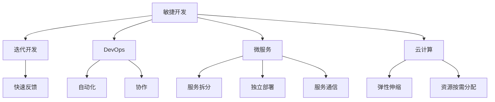

# 软件 2.0 的价值：提升效率、创造价值

> 关键词：软件 2.0，效率提升，价值创造，敏捷开发，DevOps，微服务，云计算，持续集成/持续部署（CI/CD）

## 1. 背景介绍

随着信息技术的飞速发展，软件已经成为现代社会的重要基础设施。从简单的计算工具到复杂的业务系统，软件的应用领域不断扩展。然而，传统软件开发的模式在应对日益复杂的应用需求时，逐渐暴露出效率低下、成本高昂、难以维护等问题。为了解决这些问题，软件 2.0 应运而生。软件 2.0 强调通过提升开发效率、创造更多价值来推动软件产业的变革。

### 1.1 问题的由来

传统软件开发模式存在的问题主要包括：

- **开发周期长**：瀑布模型等传统开发模式往往导致开发周期过长，难以满足快速变化的市场需求。
- **沟通成本高**：开发、测试、运维等环节之间的沟通成本高，容易导致误解和延误。
- **可维护性差**：随着系统复杂度的增加，软件的可维护性逐渐降低，增加了维护成本。
- **部署困难**：传统软件的部署过程复杂，需要大量的人工操作，增加了部署风险。

### 1.2 研究现状

为了解决传统软件开发模式存在的问题，业界提出了多种解决方案，如敏捷开发、DevOps、微服务、云计算等。这些解决方案共同构成了软件 2.0 的核心思想。

### 1.3 研究意义

软件 2.0 的研究意义在于：

- 提升软件开发效率，缩短开发周期。
- 降低软件开发成本，提高软件质量。
- 增强软件的可维护性，降低维护成本。
- 促进软件产业的健康发展。

### 1.4 本文结构

本文将围绕软件 2.0 的价值展开论述，具体内容包括：

- 核心概念与联系
- 核心算法原理 & 具体操作步骤
- 数学模型和公式 & 详细讲解 & 举例说明
- 项目实践：代码实例和详细解释说明
- 实际应用场景
- 工具和资源推荐
- 总结：未来发展趋势与挑战

## 2. 核心概念与联系

### 2.1 核心概念

#### 2.1.1 敏捷开发

敏捷开发是一种以人为核心、迭代、循序渐进的开发方法。它强调个体和交互胜过过程和工具，可工作的软件胜过面面俱到的文档，客户合作胜过合同谈判，响应变化胜过遵循计划。

#### 2.1.2 DevOps

DevOps 是开发和运维团队的融合，旨在通过自动化、协作和共享来缩短软件开发周期，提高软件质量，提供更快的交付。

#### 2.1.3 微服务

微服务是一种架构风格，将单个应用程序开发为一组小型服务，每个服务都在自己的进程中运行，并与轻量级机制（通常是HTTP资源API）进行通信。

#### 2.1.4 云计算

云计算是一种基于互联网的计算模式，通过互联网提供动态易扩展且经常是虚拟化的资源。

### 2.2 核心概念原理和架构的 Mermaid 流程图



### 2.3 核心概念的联系

敏捷开发是软件 2.0 的基础，它强调快速迭代和客户参与，为 DevOps、微服务和云计算提供了思想基础。DevOps 通过自动化和协作，进一步提升了开发效率。微服务架构将大型应用程序拆分为小型服务，提高了系统的可维护性和可扩展性。云计算为微服务提供了弹性和可伸缩的计算资源。

## 3. 核心算法原理 & 具体操作步骤

### 3.1 算法原理概述

软件 2.0 的核心算法原理可以概括为：

- 敏捷开发：通过迭代和反馈，快速适应需求变化，提高开发效率。
- DevOps：通过自动化和协作，缩短软件开发周期，提高软件质量。
- 微服务：通过服务拆分和独立部署，提高系统的可维护性和可扩展性。
- 云计算：通过弹性伸缩和资源按需分配，提供灵活的计算资源。

### 3.2 算法步骤详解

#### 3.2.1 敏捷开发

1. 用户故事：通过用户故事来明确需求，用户故事应该具有可衡量、可估算、可测试、相关性强等特点。
2. 瀑布模型：将需求分解为多个迭代周期，每个迭代周期完成一部分功能。
3. 精益开发：在每个迭代周期内，进行需求分析、设计、编码、测试和部署。
4. 反馈循环：在每个迭代周期结束后，收集用户反馈，并用于下一轮迭代。

#### 3.2.2 DevOps

1. 自动化：使用自动化工具进行代码构建、测试、部署等环节，减少人工操作。
2. 协作：建立跨职能团队，促进开发、测试、运维等环节的协作。
3. 持续集成/持续部署（CI/CD）：通过自动化流程，实现代码的持续集成和部署。

#### 3.2.3 微服务

1. 服务拆分：将大型应用程序拆分为多个独立的服务，每个服务负责特定的功能。
2. 服务注册与发现：服务之间通过注册中心进行注册和发现，实现服务之间的通信。
3. 独立部署：每个服务可以独立部署和升级，提高系统的可维护性和可扩展性。
4. 服务治理：对服务进行监控、管理和优化，确保服务的稳定运行。

#### 3.2.4 云计算

1. 弹性伸缩：根据系统负载自动调整计算资源，提高系统的可用性。
2. 资源按需分配：根据用户需求分配计算资源，降低资源浪费。
3. 多租户架构：支持多个用户同时使用同一套计算资源，提高资源利用率。

### 3.3 算法优缺点

#### 3.3.1 敏捷开发

优点：

- 快速适应需求变化
- 提高开发效率
- 增强客户参与度

缺点：

- 需要良好的沟通和协作
- 难以管理复杂的项目

#### 3.3.2 DevOps

优点：

- 缩短软件开发周期
- 提高软件质量
- 降低开发成本

缺点：

- 需要跨职能团队
- 需要持续学习和实践

#### 3.3.3 微服务

优点：

- 提高系统的可维护性和可扩展性
- 支持独立部署和升级
- 提高系统的可复用性

缺点：

- 需要分布式系统知识
- 需要服务治理能力

#### 3.3.4 云计算

优点：

- 弹性伸缩
- 资源按需分配
- 降低成本

缺点：

- 需要选择合适的云服务提供商
- 需要管理云资源

### 3.4 算法应用领域

软件 2.0 的算法原理广泛应用于各个行业，包括：

- 金融行业：用于构建在线交易、风险管理等系统。
- 电商行业：用于构建商品推荐、订单处理等系统。
- 医疗行业：用于构建电子病历、远程医疗等系统。
- 教育行业：用于构建在线教育、学习管理系统等。

## 4. 数学模型和公式 & 详细讲解 & 举例说明

### 4.1 数学模型构建

软件 2.0 的数学模型可以构建为一个包含敏捷开发、DevOps、微服务和云计算的复杂系统。以下是一个简化的模型：

$$
\text{软件 2.0} = \text{敏捷开发} \times \text{DevOps} \times \text{微服务} \times \text{云计算}
$$

### 4.2 公式推导过程

软件 2.0 的数学模型的推导过程如下：

1. 敏捷开发通过迭代和反馈，提高了开发效率，可以表示为 $\text{敏捷开发} = \text{效率}$。
2. DevOps 通过自动化和协作，缩短了软件开发周期，可以表示为 $\text{DevOps} = \text{周期}$。
3. 微服务通过服务拆分和独立部署，提高了系统的可维护性和可扩展性，可以表示为 $\text{微服务} = \text{可维护性} \times \text{可扩展性}$。
4. 云计算通过弹性伸缩和资源按需分配，提供了灵活的计算资源，可以表示为 $\text{云计算} = \text{资源} \times \text{灵活性}$。
5. 将上述四个因素相乘，得到软件 2.0 的数学模型。

### 4.3 案例分析与讲解

以电商行业的商品推荐系统为例，分析软件 2.0 的应用。

1. **敏捷开发**：通过敏捷开发，快速迭代和反馈，可以根据用户行为和反馈不断优化推荐算法，提高推荐效果。
2. **DevOps**：通过 DevOps，可以自动化代码构建、测试和部署流程，缩短开发周期，提高开发效率。
3. **微服务**：将商品推荐系统拆分为多个微服务，如用户服务、商品服务、推荐服务等，每个服务可以独立部署和升级，提高系统的可维护性和可扩展性。
4. **云计算**：将微服务部署到云平台，可以弹性伸缩计算资源，满足用户访问高峰期的需求。

通过软件 2.0 的应用，电商行业的商品推荐系统可以快速迭代、高效开发、灵活部署，为用户提供更精准的推荐服务。

## 5. 项目实践：代码实例和详细解释说明

### 5.1 开发环境搭建

以一个简单的电商商品推荐系统为例，我们需要以下开发环境：

- 操作系统：Linux或Windows
- 编程语言：Java或Python
- 数据库：MySQL或MongoDB
- 云平台：AWS或阿里云

### 5.2 源代码详细实现

以下是一个简单的 Python 代码示例，用于实现基于用户行为的商品推荐：

```python
# 伪代码，仅用于示例

# 用户服务
class UserService:
    def get_user_behavior(self, user_id):
        # 获取用户行为数据
        pass

# 商品服务
class ProductService:
    def get_product_info(self, product_id):
        # 获取商品信息
        pass

# 推荐服务
class RecommendationService:
    def recommend_products(self, user_id):
        user_behavior = UserService().get_user_behavior(user_id)
        product_info = ProductService().get_product_info(user_behavior['product_id'])
        # 根据用户行为和商品信息进行推荐
        recommended_products = ...
        return recommended_products

# 测试推荐服务
user_id = 1
recommended_products = RecommendationService().recommend_products(user_id)
print(f"Recommended products for user {user_id}: {recommended_products}")
```

### 5.3 代码解读与分析

以上代码示例展示了软件 2.0 在电商商品推荐系统中的应用。通过将系统拆分为用户服务、商品服务和推荐服务，实现了服务化架构，提高了系统的可维护性和可扩展性。同时，使用云平台部署服务，实现了弹性伸缩。

### 5.4 运行结果展示

运行以上代码，假设用户 1 的行为数据指向商品 100，推荐服务将返回与商品 100 相关的推荐商品列表。

## 6. 实际应用场景

### 6.1 金融行业

在金融行业，软件 2.0 可以用于：

- 构建在线交易系统，实现快速、安全的交易服务。
- 构建风险管理系统，实时监测和预警风险。
- 构建客户管理系统，提高客户服务质量和满意度。

### 6.2 电商行业

在电商行业，软件 2.0 可以用于：

- 构建商品推荐系统，提高用户购物体验。
- 构建订单处理系统，提高订单处理效率。
- 构建物流管理系统，实现高效、准确的物流配送。

### 6.3 医疗行业

在医疗行业，软件 2.0 可以用于：

- 构建电子病历系统，方便医生查阅和管理病历。
- 构建远程医疗系统，实现远程诊断和远程手术。
- 构建健康管理系统，帮助用户管理健康数据。

### 6.4 未来应用展望

随着软件 2.0 的发展，未来将在更多领域得到应用，如：

- 教育行业：构建在线教育平台，实现个性化学习。
- 能源行业：构建智能电网，实现能源的高效利用。
- 公共安全：构建智能监控系统，提高公共安全水平。

## 7. 工具和资源推荐

### 7.1 学习资源推荐

- 《敏捷软件开发：原理、实践与模式》
- 《DevOps实践指南》
- 《微服务设计》
- 《云计算：概念、技术和实践》

### 7.2 开发工具推荐

- 敏捷开发：Jira、Trello、Confluence
- DevOps：Jenkins、Docker、Kubernetes
- 微服务：Spring Cloud、Dubbo、Consul
- 云计算：AWS、阿里云、华为云

### 7.3 相关论文推荐

- 《Scalable and Efficient Microservices Architecture》
- 《The Principles of Cloud Computing》
- 《DevOps and Continuous Delivery: The Definitive Guide》

## 8. 总结：未来发展趋势与挑战

### 8.1 研究成果总结

本文介绍了软件 2.0 的概念、原理和应用场景，分析了软件 2.0 的价值和意义。通过软件 2.0，可以提升软件开发效率、创造更多价值，推动软件产业的变革。

### 8.2 未来发展趋势

1. 软件开发将更加敏捷、灵活，适应快速变化的市场需求。
2. DevOps 将成为软件开发的主流模式，促进开发、测试、运维的协作。
3. 微服务架构将更加成熟，成为构建复杂系统的首选架构。
4. 云计算将提供更加丰富的资源和能力，推动软件产业的数字化转型。

### 8.3 面临的挑战

1. 软件开发团队需要具备跨学科的知识和技能。
2. 需要建立完善的技术栈和工具链。
3. 需要关注数据安全和隐私保护。
4. 需要应对复杂系统的运维挑战。

### 8.4 研究展望

未来，软件 2.0 将继续发展，为软件产业带来更多变革。以下是一些研究方向：

1. 开发更加智能的软件，实现自动化、智能化的开发流程。
2. 构建更加安全的软件，保护用户数据和隐私。
3. 推动软件产业的数字化转型，促进产业升级。

## 9. 附录：常见问题与解答

**Q1：软件 2.0 与传统软件开发模式有什么区别？**

A：软件 2.0 强调通过提升开发效率、创造更多价值来推动软件产业的变革，与传统软件开发模式相比，具有以下特点：

- 敏捷开发：快速迭代、快速反馈
- DevOps：自动化、协作
- 微服务：服务化架构、独立部署
- 云计算：弹性伸缩、资源按需分配

**Q2：软件 2.0 的应用前景如何？**

A：软件 2.0 的应用前景广阔，将在各个行业得到广泛应用，如金融、电商、医疗、教育等。

**Q3：如何学习和实践软件 2.0？**

A：可以通过以下途径学习和实践软件 2.0：

- 阅读相关书籍和资料
- 参加相关培训课程
- 参与开源项目
- 与同行交流学习

**Q4：软件 2.0 的挑战有哪些？**

A：软件 2.0 的挑战主要包括：

- 技术栈的搭建和维护
- 团队协作和沟通
- 数据安全和隐私保护
- 复杂系统的运维

**Q5：软件 2.0 将如何推动软件产业的变革？**

A：软件 2.0 将通过以下方式推动软件产业的变革：

- 提升软件开发效率，缩短开发周期
- 降低软件开发成本，提高软件质量
- 增强软件的可维护性和可扩展性
- 推动软件产业的数字化转型

作者：禅与计算机程序设计艺术 / Zen and the Art of Computer Programming