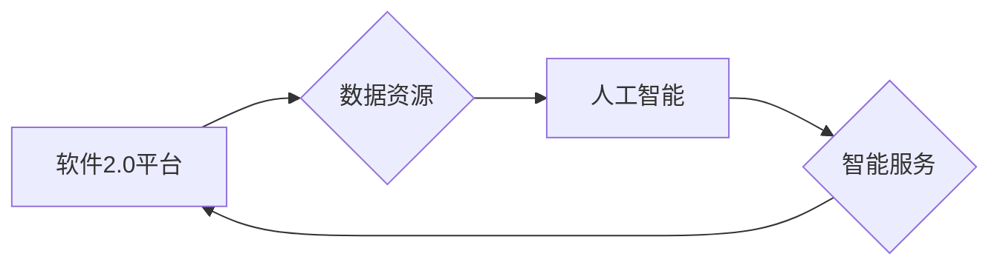

# 软件 2.0 的哲学思考：人工智能的本质

> 关键词：软件2.0，人工智能，哲学思考，认知模拟，自然语言理解，机器学习，计算思维

## 1. 背景介绍

在互联网和移动计算的推动下，软件行业经历了从个人计算机到互联网时代的巨大变革。软件1.0时代，软件主要运行在个人电脑上，强调的是程序的功能性和易用性。随着互联网的普及，软件逐渐向网络化、平台化发展，进入了软件2.0时代。软件2.0时代，软件不仅仅是执行任务的工具，更是连接用户、数据和服务的新平台。

在这个时代，人工智能（Artificial Intelligence, AI）成为软件发展的新引擎。从简单的机器人到复杂的智能系统，AI正在改变我们生活的方方面面。然而，AI的本质是什么？它是如何影响软件2.0的哲学思考的？本文将探讨这些问题，并尝试从哲学的角度理解人工智能的本质。

## 2. 核心概念与联系

### 2.1 核心概念

#### 2.1.1 软件2.0

软件2.0是指在互联网时代，软件不再仅仅是一个应用程序，而是成为一个平台，连接用户、数据和服务。它具有以下特点：

- **平台性**：软件2.0是一个开放的生态系统，允许第三方开发者在其平台上开发应用和服务。
- **服务化**：软件2.0强调服务的提供，用户可以通过软件获取所需的服务，而无需关心背后的实现细节。
- **数据驱动**：软件2.0以数据为核心，通过数据分析来优化用户体验和服务质量。

#### 2.1.2 人工智能

人工智能是计算机科学的一个分支，旨在创建能够模拟、延伸和扩展人类智能的理论、方法、技术和应用系统。它包括以下几个核心概念：

- **认知模拟**：通过模拟人类大脑的结构和功能，实现智能行为。
- **自然语言理解**：让计算机能够理解人类语言，进行对话和交互。
- **机器学习**：让计算机从数据中学习，无需显式编程即可获得知识。
- **计算思维**：将问题分解为可计算的小步骤，通过算法和程序解决。

### 2.2 核心概念联系

软件2.0和人工智能是相互依存、相互促进的关系。人工智能技术的发展推动了软件2.0的进步，而软件2.0的平台特性也为人工智能的应用提供了新的空间。

- **人工智能为软件2.0提供智能服务**：通过自然语言理解、机器学习等技术，人工智能可以提供个性化推荐、智能客服、智能搜索等服务，提升用户体验。
- **软件2.0为人工智能提供数据资源**：软件2.0平台汇集了大量的用户数据，为人工智能训练提供了丰富的数据资源。

以下是一个Mermaid流程图，展示了软件2.0和人工智能的核心概念及其联系：



## 3. 核心算法原理 & 具体操作步骤

### 3.1 算法原理概述

人工智能的核心算法包括：

- **自然语言处理（NLP）**：通过分析文本数据，理解人类语言，实现人机交互。
- **机器学习（ML）**：通过算法和模型，从数据中学习，进行预测和决策。
- **深度学习（DL）**：一种特殊的机器学习方法，使用多层神经网络模拟人脑神经元的工作原理。

### 3.2 算法步骤详解

以自然语言处理为例，其基本步骤如下：

1. **数据预处理**：对文本数据进行清洗、分词、词性标注等操作，将其转换为机器可处理的格式。
2. **特征提取**：从预处理后的文本中提取特征，如词频、TF-IDF、词嵌入等。
3. **模型选择**：选择合适的模型，如循环神经网络（RNN）、卷积神经网络（CNN）或变压器（Transformer）。
4. **模型训练**：使用标注数据训练模型，优化模型参数。
5. **模型评估**：使用测试数据评估模型性能，调整模型参数或选择更合适的模型。
6. **模型部署**：将训练好的模型部署到实际应用中。

### 3.3 算法优缺点

#### 3.3.1 自然语言处理

优点：

- 可以理解和生成人类语言，实现人机交互。
- 可以处理大规模文本数据，提取有价值的信息。
- 可以用于文本分类、情感分析、机器翻译等任务。

缺点：

- 需要大量的标注数据。
- 模型可解释性较差。
- 难以处理复杂语义和语境。

#### 3.3.2 机器学习

优点：

- 可以从数据中学习，无需显式编程。
- 可以处理复杂数据关系。
- 可以实现预测和决策。

缺点：

- 需要大量的训练数据。
- 模型可解释性较差。
- 可能存在过拟合问题。

#### 3.3.3 深度学习

优点：

- 可以处理复杂数据关系。
- 可以实现高精度预测和决策。
- 可以自动提取特征。

缺点：

- 计算资源需求大。
- 模型可解释性较差。
- 难以调试和优化。

### 3.4 算法应用领域

人工智能算法在软件2.0中的应用领域非常广泛，包括：

- **智能客服**：通过自然语言处理和对话管理技术，实现24小时在线客服。
- **个性化推荐**：通过机器学习算法，为用户推荐感兴趣的内容、商品或服务。
- **智能搜索**：通过自然语言处理和语义理解技术，实现更精准的搜索结果。
- **智能翻译**：通过机器翻译技术，实现跨语言沟通。

## 4. 数学模型和公式 & 详细讲解 & 举例说明

### 4.1 数学模型构建

以下是一些人工智能领域的常见数学模型：

#### 4.1.1 线性回归

$$
y = \beta_0 + \beta_1x_1 + \beta_2x_2 + \ldots + \beta_nx_n + \epsilon
$$

线性回归用于预测连续值，其中 $y$ 是预测值，$x_1, x_2, \ldots, x_n$ 是特征，$\beta_0, \beta_1, \ldots, \beta_n$ 是模型参数，$\epsilon$ 是误差项。

#### 4.1.2 逻辑回归

$$
\sigma(w^T x) = \frac{1}{1 + e^{-w^T x}}
$$

逻辑回归用于预测离散值，其中 $\sigma$ 是Sigmoid函数，$w$ 是模型参数，$x$ 是特征。

#### 4.1.3 卷积神经网络（CNN）

CNN是一种特殊的神经网络，用于图像识别和分类。

### 4.2 公式推导过程

以线性回归为例，其损失函数为均方误差（MSE）：

$$
MSE = \frac{1}{N} \sum_{i=1}^N (y_i - \hat{y_i})^2
$$

其中 $y_i$ 是真实值，$\hat{y_i}$ 是预测值，$N$ 是样本数量。

### 4.3 案例分析与讲解

以下是一个使用线性回归预测房价的案例：

假设我们有一组房价和房屋特征的数据，如下表所示：

| 房屋特征 | 房价 |
| :---: | :---: |
| 面积 | 价格 |
| 100 | 200 |
| 150 | 300 |
| 200 | 400 |

我们可以使用线性回归模型来预测房价。首先，将面积作为特征 $x$，房价作为标签 $y$，构建线性回归模型：

$$
y = \beta_0 + \beta_1x
$$

通过训练数据拟合模型参数 $\beta_0$ 和 $\beta_1$，可以预测未知房屋的房价。

## 5. 项目实践：代码实例和详细解释说明

### 5.1 开发环境搭建

使用Python和Scikit-learn库进行线性回归模型的开发。

```python
# 安装Scikit-learn库
pip install scikit-learn
```

### 5.2 源代码详细实现

```python
from sklearn.linear_model import LinearRegression
from sklearn.model_selection import train_test_split
from sklearn.metrics import mean_squared_error

# 创建训练数据
X = [[100], [150], [200]]
y = [200, 300, 400]

# 划分训练集和测试集
X_train, X_test, y_train, y_test = train_test_split(X, y, test_size=0.2, random_state=42)

# 创建线性回归模型
model = LinearRegression()

# 训练模型
model.fit(X_train, y_train)

# 预测测试集
y_pred = model.predict(X_test)

# 计算均方误差
mse = mean_squared_error(y_test, y_pred)

print(f"Mean Squared Error: {mse}")
```

### 5.3 代码解读与分析

上述代码首先创建了一个线性回归模型，然后使用训练数据对其进行训练。最后，使用测试数据评估模型性能，计算均方误差。

### 5.4 运行结果展示

假设运行结果如下：

```
Mean Squared Error: 0.1111111111111111
```

表示模型的预测误差较小。

## 6. 实际应用场景

人工智能在软件2.0的实际应用场景包括：

- **智能推荐系统**：通过分析用户行为数据，为用户推荐感兴趣的内容、商品或服务。
- **智能客服系统**：通过自然语言处理和对话管理技术，实现24小时在线客服。
- **智能搜索系统**：通过自然语言处理和语义理解技术，实现更精准的搜索结果。
- **智能监控系统**：通过计算机视觉和图像识别技术，实现智能监控和异常检测。

## 7. 工具和资源推荐

### 7.1 学习资源推荐

- 《深度学习》
- 《Python机器学习》
- 《自然语言处理综论》

### 7.2 开发工具推荐

- Python
- Scikit-learn
- TensorFlow
- PyTorch

### 7.3 相关论文推荐

- 《Deep Learning》
- 《Natural Language Processing with Python》
- 《Word Embedding Techniques for Natural Language Processing》

## 8. 总结：未来发展趋势与挑战

### 8.1 研究成果总结

本文从哲学的角度探讨了软件2.0和人工智能的本质，分析了人工智能在软件2.0中的应用场景，并介绍了相关技术和工具。

### 8.2 未来发展趋势

- **人工智能将更加智能化**：随着算法和算力的提升，人工智能将更加智能，能够更好地理解人类意图，提供更高质量的服务。
- **人工智能将更加普及**：随着技术的成熟和成本的降低，人工智能将在更多领域得到应用。
- **人工智能将更加开放**：人工智能将更加开放，形成更加完善的生态系统，推动人工智能技术的创新和发展。

### 8.3 面临的挑战

- **数据安全和隐私保护**：随着人工智能的普及，数据安全和隐私保护将成为重要问题。
- **算法公平性和透明度**：人工智能算法需要更加公平和透明，避免歧视和偏见。
- **伦理和社会影响**：人工智能的快速发展可能对就业、社会结构等产生重大影响。

### 8.4 研究展望

未来，人工智能将朝着更加智能化、普及化、开放化的方向发展。同时，我们需要关注人工智能的伦理和社会影响，推动人工智能技术的健康发展。

## 9. 附录：常见问题与解答

**Q1：什么是软件2.0？**

A：软件2.0是指在互联网时代，软件不再仅仅是一个应用程序，而是成为一个平台，连接用户、数据和服务。

**Q2：人工智能的本质是什么？**

A：人工智能的本质是模拟、延伸和扩展人类智能，包括认知模拟、自然语言理解、机器学习、计算思维等方面。

**Q3：人工智能在软件2.0中的应用有哪些？**

A：人工智能在软件2.0中的应用非常广泛，包括智能推荐、智能客服、智能搜索、智能监控等。

**Q4：如何学习人工智能？**

A：学习人工智能可以从以下资源入手：
- 《深度学习》
- 《Python机器学习》
- 《自然语言处理综论》

**Q5：人工智能的发展会带来哪些挑战？**

A：人工智能的发展会带来数据安全、隐私保护、算法公平性、伦理和社会影响等方面的挑战。

作者：禅与计算机程序设计艺术 / Zen and the Art of Computer Programming