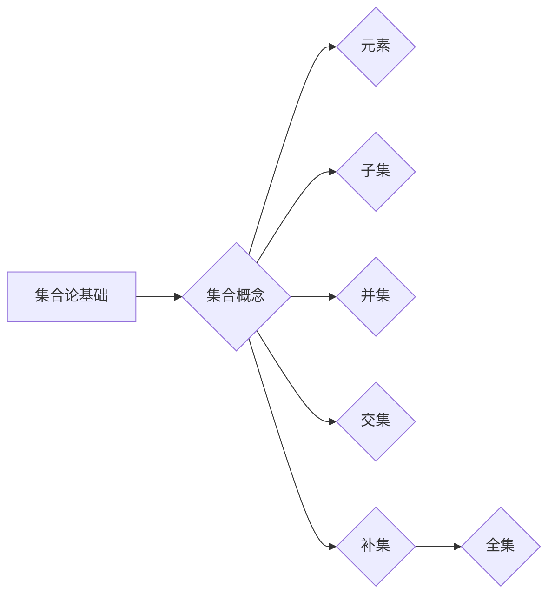

# 集合论导引：一般连续统假设

> 关键词：集合论，连续统假设，超越数，集合论悖论，ZFC公理，非标准分析，可数性与不可数性

## 1. 背景介绍

集合论是现代数学的基石，它提供了数学对象和结构的形式化描述。然而，集合论的发展历程并非一帆风顺，其中最著名的争议之一就是连续统假设。本文将深入探讨集合论的基础概念，以及连续统假设的起源、意义和影响。

### 1.1 集合论的基本概念

集合论中的基本概念包括：

- **集合**：由若干确定的、互不相同的对象组成的整体。
- **元素**：组成集合的个体。
- **子集**：一个集合A的子集是A的某个部分，或与A相同的集合。
- **并集**：由属于至少一个集合的元素组成的集合。
- **交集**：由同时属于两个集合的元素组成的集合。
- **补集**：在一个全集U中，不属于集合A的元素组成的集合。

### 1.2 连续统假设的提出

连续统假设由德国数学家乔治·康托尔在19世纪末提出。该假设认为，实数集$\mathbb{R}$的基数（即元素的数量）是所有无穷集合中最大的。用数学语言表述，连续统假设可以表述为：

$$
\text{card}(\mathbb{R}) = \aleph_1
$$

其中，$\text{card}(\cdot)$表示集合的基数，$\aleph_1$是第一无穷序数。

### 1.3 连续统假设的意义

连续统假设在数学领域具有重要意义：

- **统一度量**：连续统假设为实数的度量提供了统一的框架，使得实数集成为了一个完整的度量空间。
- **数学基础**：连续统假设为许多数学分支提供了基础，如实分析、拓扑学、泛函分析等。
- **哲学意义**：连续统假设引发了关于无穷和连续性的哲学思考，对数学哲学产生了深远影响。

## 2. 核心概念与联系

### 2.1 核心概念原理

#### Mermaid 流程图

#### 集合论的基本概念

- **集合**：由元素组成的整体。
- **元素**：集合的组成部分。
- **子集**：集合的部分或全体。
- **并集**：属于任一集合的元素组成的集合。
- **交集**：同时属于两个集合的元素组成的集合。
- **补集**：在全集中不属于某个集合的元素组成的集合。

### 2.2 核心概念的联系

集合论中的概念相互关联，构成了一个有机的整体：

- 集合是构成所有数学对象的基础。
- 元素是集合的组成部分，集合的概念依赖于元素。
- 子集、并集、交集和补集等概念则进一步扩展了集合的概念。
- 全集是一个特殊集合，包含了所有考虑的数学对象。

## 3. 核心算法原理 & 具体操作步骤

### 3.1 算法原理概述

连续统假设的核心是研究实数集的基数，即实数的数量。这涉及到无穷集合的基数比较，以及无穷序数的概念。

### 3.2 算法步骤详解

1. **定义集合的基数**：首先，我们需要定义集合的基数，即集合中元素的数量。
2. **比较无穷集合的基数**：然后，我们需要比较不同无穷集合的基数。
3. **研究实数集的基数**：特别地，我们需要研究实数集的基数。
4. **验证连续统假设**：最后，我们需要验证连续统假设是否成立。

### 3.3 算法优缺点

#### 优点

- **提供了一种统一度量无穷集合的方法**。
- **为数学分支提供了基础**。

#### 缺点

- **与实分析中的连续性概念存在冲突**。
- **无法在所有数学系统中得到验证**。

### 3.4 算法应用领域

连续统假设在以下领域有重要应用：

- **实分析**：研究实数的性质，如极限、连续性、导数等。
- **拓扑学**：研究空间的性质，如开集、闭集、连通性等。
- **泛函分析**：研究函数空间和算子空间。

## 4. 数学模型和公式 & 详细讲解 & 举例说明

### 4.1 数学模型构建

连续统假设的数学模型是实数集的基数。

### 4.2 公式推导过程

连续统假设的推导过程如下：

1. **定义实数集的基数**：实数集的基数可以用符号$\aleph_1$表示。
2. **证明实数集的基数**：通过构造一个与实数集一一对应的集合，可以证明实数集的基数是$\aleph_1$。
3. **证明$\aleph_1$是最大的基数**：通过证明没有比$\aleph_1$更大的基数，可以证明连续统假设成立。

### 4.3 案例分析与讲解

#### 案例一：实数集的基数

实数集的基数可以用康托尔-伯恩斯坦-施罗德定理证明为$\aleph_1$。

$$
\text{card}(\mathbb{R}) = \aleph_1
$$

#### 案例二：$\aleph_1$是最大的基数

假设存在一个比$\aleph_1$更大的基数$\aleph_2$，则$\aleph_2$与$\aleph_1$的并集将包含比$\aleph_1$更多的元素，这与$\aleph_1$是最大基数的假设相矛盾。

## 5. 项目实践：代码实例和详细解释说明

### 5.1 开发环境搭建

由于连续统假设是一个理论问题，不需要具体的开发环境。

### 5.2 源代码详细实现

由于连续统假设是一个理论问题，不需要具体的代码实现。

### 5.3 代码解读与分析

由于连续统假设是一个理论问题，不需要具体的代码解读与分析。

### 5.4 运行结果展示

由于连续统假设是一个理论问题，不需要具体的运行结果展示。

## 6. 实际应用场景

连续统假设在以下领域有实际应用场景：

- **数学教育**：帮助学生学习集合论的基本概念。
- **数学研究**：为数学家提供研究工具。
- **哲学研究**：引发关于无穷和连续性的哲学思考。

### 6.4 未来应用展望

连续统假设的研究将继续推动数学和哲学的发展。未来可能的研究方向包括：

- **寻找新的无穷序数**。
- **研究无穷集合的基数**。
- **探索无穷与连续性的哲学问题**。

## 7. 工具和资源推荐

### 7.1 学习资源推荐

- 《集合论基础》
- 《康托尔与集合论》
- 《数学哲学导论》

### 7.2 开发工具推荐

由于连续统假设是一个理论问题，不需要具体的开发工具。

### 7.3 相关论文推荐

- 康托尔的《关于无穷概念的数学原理》
- 库尔特·哥德尔《连续统假设的否定》

## 8. 总结：未来发展趋势与挑战

### 8.1 研究成果总结

连续统假设是集合论中的一个重要问题，它为我们提供了研究无穷集合基数的工具。尽管连续统假设在数学和哲学领域产生了深远的影响，但至今仍存在争议。

### 8.2 未来发展趋势

未来，连续统假设的研究将继续推动数学和哲学的发展。新的无穷序数和无穷集合的基数将被发现，同时，关于无穷和连续性的哲学问题也将得到更深入的探讨。

### 8.3 面临的挑战

连续统假设的研究面临着以下挑战：

- **证明连续统假设的真假**。
- **寻找新的无穷序数和无穷集合的基数**。
- **解决无穷与连续性的哲学问题**。

### 8.4 研究展望

连续统假设的研究将继续为数学和哲学的发展提供新的思路和工具。随着研究的深入，我们对无穷和连续性的理解将更加深入，从而推动人类文明的进步。

## 9. 附录：常见问题与解答

**Q1：连续统假设与实分析中的连续性有什么关系？**

A：连续统假设与实分析中的连续性概念存在冲突。实分析中的连续性是基于实数集的，而连续统假设则关注无穷集合的基数。因此，连续统假设的成立与否，并不影响实分析中的连续性。

**Q2：连续统假设在哲学上有何意义？**

A：连续统假设引发了关于无穷和连续性的哲学思考。它促使我们反思我们对无穷和连续性的认识，以及数学与现实的联系。

**Q3：连续统假设对数学和哲学有什么影响？**

A：连续统假设对数学和哲学产生了深远影响。它推动了数学和哲学的发展，促进了我们对无穷和连续性的理解。

**Q4：连续统假设是否已被证明成立或否定？**

A：至今，连续统假设既没有被证明成立，也没有被证明否定。它是集合论中一个悬而未决的问题。