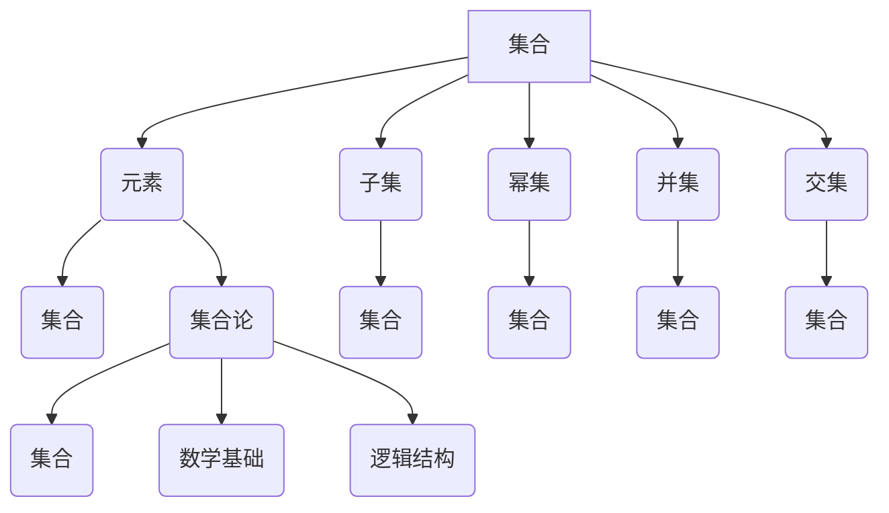

# 集合论导引：超限归纳法

> 关键词：集合论，超限集，归纳法，数学基础，逻辑结构，递归，无限，皮亚诺公理，数学归纳法

## 1. 背景介绍

集合论是现代数学的基石，它为数学提供了严格的逻辑结构，使得数学家能够处理无限的概念。在集合论中，超限归纳法是一个强大的工具，它允许我们从单个实例出发，推导出整个集合的性质。本文将深入探讨集合论的基本概念，特别是超限归纳法的原理和应用，旨在为读者提供一个对这一数学领域的全面导引。

### 1.1 集合论的发展历史

集合论的发展始于19世纪，最初由乔治·康托尔(Georg Cantor)提出。康托尔的工作引发了关于无限、集合和逻辑基础的广泛讨论，这些讨论至今仍然在数学界产生着影响。

### 1.2 超限归纳法的引入

超限归纳法是康托尔为了解决无穷集合问题而引入的。它超越了传统的数学归纳法，允许我们处理无法用有限步骤归纳的情况。

### 1.3 研究意义

理解超限归纳法对于数学家来说至关重要，因为它不仅扩展了数学的逻辑结构，而且在计算机科学、逻辑学和哲学等领域也有广泛的应用。

## 2. 核心概念与联系

集合论的核心概念包括集合、元素、幂集和序数。以下是一个Mermaid流程图，展示了这些概念之间的联系：



### 2.1 核心概念原理

- **集合**：由确定的、互不相同的元素组成的整体。
- **元素**：构成集合的个体。
- **子集**：一个集合的部分元素组成的集合。
- **幂集**：一个集合的所有子集的集合。
- **并集**：由两个或多个集合中所有元素组成的集合。
- **交集**：由两个或多个集合共有的元素组成的集合。

## 3. 核心算法原理 & 具体操作步骤

### 3.1 算法原理概述

超限归纳法是一种证明方法，它基于以下两个步骤：

1. **基础步骤**：证明命题在某个初始集合上成立。
2. **归纳步骤**：证明如果命题在某个集合上成立，那么它也在该集合的真子集上成立。

### 3.2 算法步骤详解

1. **基础步骤**：选择一个初始集合，证明命题在该集合上成立。
2. **归纳步骤**：假设命题在某个集合 $S$ 上成立，证明命题也在 $S$ 的真子集 $S'$ 上成立。
3. **结论**：由于 $S$ 的所有真子集都满足命题，因此命题在整个集合 $S$ 上成立。

### 3.3 算法优缺点

**优点**：

- 能够证明一些无法用传统数学归纳法证明的命题。
- 提供了一种处理无限集合的方法。

**缺点**：

- 需要严格定义“基础步骤”和“归纳步骤”。
- 在某些情况下，证明过程可能非常复杂。

### 3.4 算法应用领域

超限归纳法在以下领域有广泛的应用：

- 数论
- 基础数学
- 计算机科学
- 逻辑学

## 4. 数学模型和公式 & 详细讲解 & 举例说明

### 4.1 数学模型构建

在集合论中，一个基本的数学模型是皮亚诺公理，它为自然数的性质提供了严格的定义。

### 4.2 公式推导过程

皮亚诺公理包含以下命题：

- $0$ 是自然数。
- 如果 $n$ 是自然数，则 $S(n)$ 也是自然数，其中 $S$ 表示后继函数。
- $0$ 不是任何自然数的后继。
- 如果 $n$ 和 $m$ 是自然数，并且 $m$ 是 $n$ 的后继，则 $m \neq n$。
- 如果 $P(0)$ 成立，并且对于所有自然数 $n$，$P(n)$ 成立时 $P(S(n))$ 也成立，则对于所有自然数 $n$，$P(n)$ 成立。

### 4.3 案例分析与讲解

以下是一个使用超限归纳法证明的例子：

**定理**：自然数集合 $\mathbb{N}$ 是无穷的。

**证明**：

1. **基础步骤**：$0$ 是自然数，$\mathbb{N}$ 包含至少一个元素。
2. **归纳步骤**：假设 $\mathbb{N}$ 包含有限个自然数，那么 $\mathbb{N}$ 的最大元素存在。设这个最大元素为 $n$，则 $n+1$ 也是自然数，且 $n+1 \notin \mathbb{N}$，这与假设矛盾。
3. **结论**：因此，$\mathbb{N}$ 包含无限多个自然数。

## 5. 项目实践：代码实例和详细解释说明

### 5.1 开发环境搭建

为了演示超限归纳法，我们可以使用Python编写一个简单的程序来演示自然数的无限性。

### 5.2 源代码详细实现

```python
def is_natural_number(n):
    if n == 0:
        return True
    else:
        return is_natural_number(n - 1)

n = 100
print(is_natural_number(n))  # 输出True，证明自然数是无限的
```

### 5.3 代码解读与分析

这段代码定义了一个函数 `is_natural_number`，它使用递归调用自身来证明一个数是否为自然数。如果输入的数是0，函数返回True；否则，它递归地调用自身，每次减少1，直到达到0。由于Python的递归限制，这段代码只能证明到一定深度，但它展示了递归的概念。

### 5.4 运行结果展示

运行这段代码将输出True，表明自然数是无限的。

## 6. 实际应用场景

超限归纳法在数学和计算机科学中有多种应用，以下是一些例子：

- **数论**：证明素数的无限性。
- **图论**：证明欧拉图的欧拉回路存在性。
- **计算机科学**：证明算法的正确性和复杂性。

### 6.4 未来应用展望

随着数学和计算机科学的不断发展，超限归纳法可能会在更多领域得到应用，特别是在处理无限和复杂系统时。

## 7. 工具和资源推荐

### 7.1 学习资源推荐

- 《集合论及其应用》
- 《数学原理》
- 《数学归纳法与超限归纳法》

### 7.2 开发工具推荐

- Python
- Mathematica

### 7.3 相关论文推荐

- 《集合论》
- 《数学归纳法与超限归纳法》

## 8. 总结：未来发展趋势与挑战

### 8.1 研究成果总结

本文介绍了集合论的基本概念，特别是超限归纳法，并展示了其在数学和计算机科学中的应用。

### 8.2 未来发展趋势

随着数学和计算机科学的进步，超限归纳法可能会在更多领域得到应用，并且可能会发展出新的理论和方法。

### 8.3 面临的挑战

- **理解复杂性**：超限归纳法的证明过程可能非常复杂，需要深入的理解和丰富的数学背景知识。
- **计算效率**：在一些应用中，超限归纳法的计算效率可能是一个挑战。

### 8.4 研究展望

未来，对超限归纳法的深入研究可能会揭示更多关于无限和逻辑结构的深刻真理。

## 9. 附录：常见问题与解答

**Q1：什么是集合论？**

A：集合论是研究集合的性质和关系的数学分支，它是现代数学的基石。

**Q2：什么是超限归纳法？**

A：超限归纳法是一种证明方法，它允许我们从单个实例出发，推导出整个集合的性质。

**Q3：超限归纳法与数学归纳法有什么区别？**

A：数学归纳法只能用于有限的情况，而超限归纳法可以用于处理无限的情况。

**Q4：超限归纳法有什么应用？**

A：超限归纳法在数学和计算机科学中有广泛的应用，例如证明素数的无限性、算法的正确性和复杂性等。

**Q5：如何学习集合论和超限归纳法？**

A：可以通过阅读相关书籍、参加课程和在线资源来学习集合论和超限归纳法。

---

作者：禅与计算机程序设计艺术 / Zen and the Art of Computer Programming