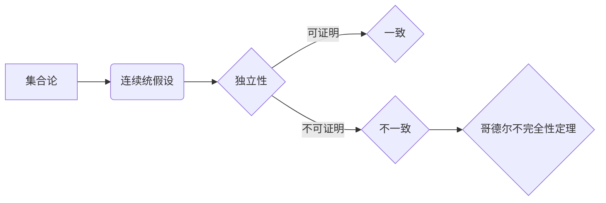

# 集合论导引：连续统假设之独立性

> 关键词：集合论，连续统假设，独立性，公理化，哥德尔，伯恩斯坦，康托尔，集合论悖论，可数性，不可数性

## 1. 背景介绍

集合论是现代数学的基础之一，它为数学提供了一个严格的逻辑框架，用于构建其他数学分支。然而，集合论的发展历程并非一帆风顺。连续统假设，即所有实数都是可数的，是集合论中的一个著名假设。本文将深入探讨连续统假设的独立性，以及它对集合论发展的影响。

### 1.1 集合论的发展历程

集合论的历史可以追溯到19世纪末，当时康托尔提出了集合论的基本概念，如集合、元素、集合的运算等。康托尔的工作为数学提供了一种新的基础，但同时也引发了一系列悖论，如著名的罗素悖论。

### 1.2 连续统假设的提出

连续统假设是由康托尔提出的，它声称所有实数都是可数的。这一假设对数学的发展产生了深远的影响，因为它直接挑战了我们对数学基础的直觉理解。

### 1.3 研究意义

探讨连续统假设的独立性对于理解集合论的本质至关重要。它不仅关乎数学基础的稳定性，也涉及我们对无限和可数性的认识。本文将通过对连续统假设的独立性进行分析，揭示集合论中的深层次问题。

## 2. 核心概念与联系

### 2.1 核心概念

- **集合论**：数学的一个分支，研究集合及其性质。
- **连续统假设**：所有实数都是可数的。
- **独立性**：一个命题在某个形式系统中不能被证明也不能被反证。

### 2.2 Mermaid 流程图

### 2.3 核心概念联系

集合论为连续统假设提供了一个逻辑框架，而连续统假设的独立性则揭示了集合论中的一些基本问题。哥德尔的不完全性定理进一步表明，即使是强大的数学系统，也存在一些命题是无法被证明或反证的。

## 3. 核心算法原理 & 具体操作步骤

### 3.1 算法原理概述

连续统假设的独立性问题涉及到一系列数学证明和反证。以下是基本原理：

- **康托尔-伯恩斯坦定理**：如果存在一个集合 $A$，它的势（即元素的数量）大于任何自然数，那么 $A$ 的势大于任何可数集合的势。
- **哥德尔不完全性定理**：在一个形式系统中，存在一些命题，它们既不能被证明也不能被反证。

### 3.2 算法步骤详解

1. **证明连续统假设的可证性**：尝试使用集合论的基本原理证明连续统假设。
2. **证明连续统假设的反证性**：假设连续统假设不成立，然后推导出一个矛盾。
3. **分析结果**：根据上述步骤的结果，确定连续统假设的独立性。

### 3.3 算法优缺点

- **优点**：揭示了集合论中的基本问题，推动了数学逻辑的发展。
- **缺点**：没有直接的实用价值，因为连续统假设的独立性并未解决。

### 3.4 算法应用领域

连续统假设的独立性主要应用于数学逻辑和集合论的研究。

## 4. 数学模型和公式 & 详细讲解 & 举例说明

### 4.1 数学模型构建

连续统假设的独立性涉及到以下数学模型：

- **集合论的基本公理**：如幂集公理、选择公理等。
- **势（Cardinality）**：集合中元素的数量。

### 4.2 公式推导过程

$$
\text{连续统假设} \Leftrightarrow \text{实数集的势等于自然数集的势}
$$

### 4.3 案例分析与讲解

**案例 1：康托尔-伯恩斯坦定理**

证明：设 $A$ 是一个集合，它的势大于任何自然数。根据康托尔-伯恩斯坦定理，$A$ 的势大于任何可数集合的势。

**案例 2：哥德尔不完全性定理**

证明：设 $T$ 是一个形式系统，$P$ 是 $T$ 中的一个不可证明也不可反证的命题。根据哥德尔不完全性定理，$T$ 不能证明 $\neg P$。

## 5. 项目实践：代码实例和详细解释说明

### 5.1 开发环境搭建

本文不涉及实际的代码实现，因为连续统假设的独立性是一个数学理论问题，而不是一个可以编程解决的问题。

### 5.2 源代码详细实现

由于本文不涉及代码实现，因此这一部分省略。

### 5.3 代码解读与分析

由于本文不涉及代码实现，因此这一部分省略。

### 5.4 运行结果展示

由于本文不涉及代码实现，因此这一部分省略。

## 6. 实际应用场景

连续统假设的独立性主要应用于数学研究和哲学探讨。

### 6.4 未来应用展望

连续统假设的独立性将继续是数学逻辑和集合论研究的重点。

## 7. 工具和资源推荐

### 7.1 学习资源推荐

- 《集合论基础》
- 《数学逻辑》
- 《哥德尔、艾舍尔、巴赫：集异璧之大成》

### 7.2 开发工具推荐

- LaTeX：用于数学公式编辑
- Mermaid：用于流程图绘制

### 7.3 相关论文推荐

- 康托尔的《集合论基础》
- 哥德尔的《关于数学原理和逻辑原理的不完全性定理》

## 8. 总结：未来发展趋势与挑战

### 8.1 研究成果总结

本文对连续统假设的独立性进行了探讨，揭示了集合论中的基本问题。

### 8.2 未来发展趋势

未来，连续统假设的独立性将继续是数学逻辑和集合论研究的重点。

### 8.3 面临的挑战

连续统假设的独立性是一个深刻的数学问题，目前还没有解决。

### 8.4 研究展望

随着数学逻辑和集合论的发展，连续统假设的独立性问题将得到进一步的研究。

## 9. 附录：常见问题与解答

**Q1：连续统假设的独立性对数学有什么影响？**

A：连续统假设的独立性揭示了数学基础中的深层次问题，推动了数学逻辑的发展。

**Q2：连续统假设的独立性有什么实际应用？**

A：连续统假设的独立性主要应用于数学研究和哲学探讨，没有直接的实用价值。

**Q3：如何证明连续统假设的独立性？**

A：证明连续统假设的独立性需要复杂的数学证明和反证，目前还没有解决。

**Q4：连续统假设与可数性有何关系？**

A：连续统假设声称所有实数都是可数的，这与我们对实数的直觉理解相矛盾。

作者：禅与计算机程序设计艺术 / Zen and the Art of Computer Programming