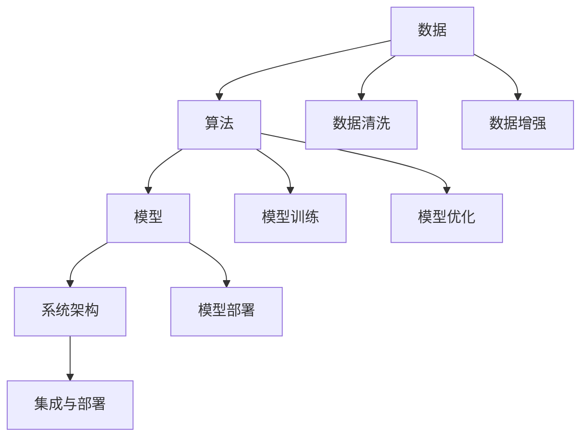

                 

# 数据驱动的软件2.0需要数学家还是炼丹师?

在软件开发领域，数据驱动的软件2.0（Data-Driven Software 2.0）已经成为一种趋势，强调使用数据和统计方法来驱动软件设计和开发。这一趋势带来的不仅是技术的革新，也引发了对人才需求的深刻讨论：数据驱动的软件2.0究竟需要的是数学家，还是炼丹师（即数据科学家，而非纯粹的数学家）？

本文将探讨这一问题，从数据驱动软件的定义、核心概念、算法原理、数学模型等多个角度进行分析，并结合具体案例和实践经验，给出详细的见解和建议。

## 1. 背景介绍

### 1.1 问题由来

随着大数据和人工智能技术的发展，越来越多的企业开始利用数据来驱动软件的设计和开发。数据驱动的软件2.0强调使用数据和统计方法来指导软件需求分析、架构设计、功能实现和性能优化等各个环节，使得软件系统更加精准、可靠和高效。

这种趋势的出现，源于以下几个方面：

1. **数据的重要性**：随着互联网和物联网的发展，数据已成为企业的核心资产，合理利用数据可以提升业务决策的科学性和准确性。
2. **技术的进步**：机器学习、深度学习等人工智能技术的发展，使得从海量数据中提取知识和洞察成为可能。
3. **市场的需求**：企业需要快速响应市场变化，数据驱动的软件可以帮助企业更快地迭代产品，提升竞争力。

### 1.2 问题核心关键点

数据驱动的软件2.0涉及的核心概念包括数据、算法、模型和系统架构等。关键点包括：

1. **数据的质量和多样性**：高质量、多源异构的数据是数据驱动的基础，如何清洗和处理数据至关重要。
2. **算法的合理性和有效性**：选择或设计合适的算法模型，确保其能够从数据中提取有价值的洞察。
3. **模型的训练和优化**：通过机器学习模型对数据进行训练，优化模型的性能和泛化能力。
4. **系统的集成与部署**：将数据驱动的算法和模型集成到现有系统中，确保其高效稳定运行。

## 2. 核心概念与联系

### 2.1 核心概念概述

数据驱动的软件2.0涉及的核心概念可以总结如下：

- **数据（Data）**：企业运营过程中产生的大量数据，包括结构化数据、半结构化数据和无结构化数据。
- **算法（Algorithm）**：用于处理和分析数据的算法，如机器学习、深度学习等。
- **模型（Model）**：通过算法训练得到的模型，用于预测、分类、聚类等任务。
- **系统架构（System Architecture）**：如何将数据、算法和模型集成到现有系统中的架构设计。

### 2.2 核心概念的联系

数据驱动的软件2.0涉及的数据、算法、模型和系统架构之间存在紧密的联系，可以通过以下Mermaid流程图来展示：



这个流程图展示了数据驱动的软件2.0的主要流程：

1. 数据清洗和增强，确保数据的质量和多样性。
2. 选择合适的算法，对数据进行处理和分析。
3. 训练和优化模型，使其能够从数据中提取有用的洞察。
4. 将模型集成到现有系统中，进行部署和应用。

## 3. 核心算法原理 & 具体操作步骤

### 3.1 算法原理概述

数据驱动的软件2.0中，核心算法主要是机器学习、深度学习等数据处理方法。这些算法通过分析数据，提取出有用的模式和特征，用于指导软件设计和开发。

机器学习和深度学习的核心思想是通过大量的数据训练模型，使其能够泛化到新的数据上，从而实现预测、分类、聚类等任务。常见的机器学习算法包括线性回归、逻辑回归、支持向量机等；常见的深度学习算法包括神经网络、卷积神经网络、循环神经网络等。

### 3.2 算法步骤详解

数据驱动的软件2.0中，算法步骤可以分为数据预处理、模型训练、模型评估和模型部署等几个阶段：

1. **数据预处理**：包括数据清洗、特征提取、数据增强等步骤，确保数据的质量和多样性。
2. **模型训练**：选择合适的算法，通过大量的数据训练模型，优化模型的参数。
3. **模型评估**：使用测试集对模型进行评估，确保其泛化能力。
4. **模型部署**：将模型集成到现有系统中，进行部署和应用。

以一个简单的回归问题为例，展示数据驱动的软件2.0的算法步骤：

```python
import pandas as pd
from sklearn.model_selection import train_test_split
from sklearn.linear_model import LinearRegression

# 读取数据
data = pd.read_csv('data.csv')

# 数据清洗和特征提取
# ...

# 数据增强
# ...

# 分割数据集
X_train, X_test, y_train, y_test = train_test_split(X, y, test_size=0.2, random_state=42)

# 模型训练
model = LinearRegression()
model.fit(X_train, y_train)

# 模型评估
score = model.score(X_test, y_test)
print(f"Model score: {score:.2f}")

# 模型部署
# ...
```

### 3.3 算法优缺点

数据驱动的软件2.0中的算法具有以下优点：

- **高效性**：通过机器学习和深度学习算法，可以快速从大量数据中提取有用的洞察，指导软件设计和开发。
- **灵活性**：算法可以根据不同的任务和数据特点进行调整，适应性强。
- **可解释性**：许多机器学习和深度学习算法具有可解释性，能够帮助开发者理解模型的决策过程。

同时，这些算法也存在一些缺点：

- **数据依赖性**：算法的性能很大程度上依赖于数据的质量和多样性，数据不足或质量差可能导致算法失效。
- **模型复杂性**：深度学习等算法的模型复杂度较高，训练和推理需要较大的计算资源。
- **易过拟合**：算法容易过拟合，需要采用正则化等方法进行缓解。

### 3.4 算法应用领域

数据驱动的软件2.0在各个领域都有广泛应用，包括但不限于：

- **金融领域**：通过数据分析，实现风险评估、信用评分、投资预测等。
- **医疗领域**：通过医学影像、电子病历等数据，实现疾病预测、治疗方案推荐等。
- **电子商务**：通过用户行为数据，实现推荐系统、广告投放优化等。
- **智能交通**：通过交通数据，实现流量预测、路径优化等。

## 4. 数学模型和公式 & 详细讲解 & 举例说明

### 4.1 数学模型构建

在数据驱动的软件2.0中，常见的数学模型包括线性回归模型、逻辑回归模型、支持向量机模型、决策树模型等。以线性回归模型为例，其数学模型可以表示为：

$$ y = \beta_0 + \beta_1 x_1 + \beta_2 x_2 + \cdots + \beta_n x_n + \epsilon $$

其中，$y$ 表示目标变量，$\beta_0, \beta_1, \cdots, \beta_n$ 表示模型参数，$x_1, x_2, \cdots, x_n$ 表示自变量，$\epsilon$ 表示误差项。

### 4.2 公式推导过程

线性回归模型的参数估计通常使用最小二乘法（Least Squares Method），其公式推导如下：

$$ \hat{\beta} = (X^T X)^{-1} X^T y $$

其中，$\hat{\beta}$ 表示模型参数的估计值，$X$ 表示自变量矩阵，$y$ 表示目标变量向量。

### 4.3 案例分析与讲解

以房价预测为例，展示如何使用线性回归模型进行数据分析：

假设我们有一组房价数据，包括自变量（如房屋面积、地理位置、房龄等）和目标变量（房价），可以使用线性回归模型进行房价预测。首先，将数据分为训练集和测试集，然后使用最小二乘法对训练集进行模型训练，得到模型参数的估计值。最后，使用测试集对模型进行评估，得出模型预测的房价与实际房价的误差。

## 5. 项目实践：代码实例和详细解释说明

### 5.1 开发环境搭建

要进行数据驱动的软件2.0开发，需要准备以下开发环境：

1. 安装Python：从官网下载并安装Python。
2. 安装必要的库：如Pandas、NumPy、Scikit-learn等。
3. 配置开发工具：如Jupyter Notebook、PyCharm等。

### 5.2 源代码详细实现

以下是一个使用Scikit-learn库进行线性回归模型训练的Python代码实现：

```python
from sklearn.model_selection import train_test_split
from sklearn.linear_model import LinearRegression
from sklearn.metrics import mean_squared_error

# 读取数据
data = pd.read_csv('data.csv')

# 数据清洗和特征提取
# ...

# 数据增强
# ...

# 分割数据集
X_train, X_test, y_train, y_test = train_test_split(X, y, test_size=0.2, random_state=42)

# 模型训练
model = LinearRegression()
model.fit(X_train, y_train)

# 模型评估
y_pred = model.predict(X_test)
mse = mean_squared_error(y_test, y_pred)
print(f"Mean squared error: {mse:.2f}")
```

### 5.3 代码解读与分析

- `train_test_split`：用于将数据集分为训练集和测试集。
- `LinearRegression`：用于训练线性回归模型。
- `mean_squared_error`：用于计算模型预测与实际值之间的均方误差。

### 5.4 运行结果展示

假设在房价预测任务中，我们训练得到的模型在测试集上的均方误差为10，则说明模型的预测与实际房价相差不大。

## 6. 实际应用场景

### 6.1 智能推荐系统

数据驱动的软件2.0在智能推荐系统中的应用非常广泛。通过分析用户的历史行为数据，推荐系统可以为用户推荐个性化的商品或内容，提升用户体验。

以电子商务为例，推荐系统可以通过用户的浏览记录、购买记录等数据，分析用户的兴趣和偏好，推荐相应的商品。具体算法包括协同过滤、基于内容的推荐、深度学习等。

### 6.2 医疗诊断系统

医疗诊断系统通过分析患者的电子病历、医学影像等数据，辅助医生进行诊断和治疗方案推荐。数据驱动的软件2.0可以帮助医生快速分析大量的患者数据，提取有价值的洞察。

以乳腺癌诊断为例，医生可以通过分析患者的年龄、性别、家族病史等数据，使用机器学习模型预测患者是否患有乳腺癌，并推荐相应的治疗方案。

### 6.3 智能交通系统

智能交通系统通过分析交通流量、车辆位置等数据，优化交通管理，提高道路通行效率。数据驱动的软件2.0可以帮助交通管理部门实时监测交通状况，预测交通拥堵，优化交通信号灯控制等。

以交通流量预测为例，通过分析历史交通数据，使用机器学习模型预测未来的交通流量，交通管理部门可以提前采取措施，缓解交通拥堵。

## 7. 工具和资源推荐

### 7.1 学习资源推荐

以下是一些推荐的用于学习数据驱动的软件2.0的资源：

1. 《Python数据科学手册》（O'Reilly）：详细介绍了Python在数据科学中的应用，包括数据预处理、算法实现、模型评估等。
2. 《机器学习实战》（Peter Harrington）：通过实例介绍机器学习算法的实现和应用。
3. 《深度学习》（Ian Goodfellow）：详细介绍了深度学习算法的原理和应用。
4. Coursera和edX上的数据科学和机器学习课程：提供丰富的在线学习资源，涵盖从入门到高级的内容。
5. Kaggle：提供大量数据集和竞赛，帮助开发者实践和验证算法。

### 7.2 开发工具推荐

以下是一些推荐的开发工具：

1. Jupyter Notebook：用于数据预处理、模型训练和结果展示。
2. PyCharm：功能强大的Python开发工具，支持数据科学和机器学习。
3. TensorFlow和PyTorch：流行的深度学习框架，提供丰富的API和工具。
4. Scikit-learn：简单易用的机器学习库，支持多种算法。

### 7.3 相关论文推荐

以下是一些推荐的相关论文：

1. 《A Survey of Recent Advances in Deep Learning for Recommendation Systems》（ACM）：综述了深度学习在推荐系统中的应用。
2. 《Deep Learning for Medical Imaging Analysis》（IEEE）：介绍了深度学习在医学影像分析中的应用。
3. 《Traffic Flow Prediction Using Deep Learning Models》（IEEE）：介绍了深度学习在交通流量预测中的应用。

## 8. 总结：未来发展趋势与挑战

### 8.1 研究成果总结

数据驱动的软件2.0已经在多个领域取得了显著进展，通过数据分析和机器学习算法，提升了软件系统的精度和效率。其主要研究成果包括：

1. 数据清洗和预处理技术：通过数据清洗和特征提取，确保数据的质量和多样性。
2. 机器学习和深度学习算法：通过算法训练，从数据中提取有用的洞察，指导软件设计和开发。
3. 系统集成与部署技术：将模型集成到现有系统中，确保其高效稳定运行。

### 8.2 未来发展趋势

未来，数据驱动的软件2.0将继续发展和演进，呈现以下趋势：

1. **自动化**：通过自动化工具，降低数据清洗和模型训练的复杂度，提升效率。
2. **实时化**：通过流式数据处理和实时计算技术，实现数据的实时分析和决策。
3. **自适应**：通过在线学习和自适应算法，使模型能够实时更新和优化，提高系统的适应性。
4. **跨领域应用**：将数据驱动的软件2.0技术应用于更多领域，如金融、医疗、交通等。

### 8.3 面临的挑战

尽管数据驱动的软件2.0已经取得了重要进展，但仍然面临一些挑战：

1. **数据隐私和安全**：如何保护用户数据隐私和安全，是一个重要的问题。
2. **算法透明性和可解释性**：如何使算法具有更好的透明性和可解释性，是一个需要解决的问题。
3. **模型复杂性和计算资源**：如何降低模型的复杂性和计算资源需求，是一个需要攻克的难题。
4. **数据依赖性和泛化能力**：如何保证数据驱动的算法在不同数据分布下的泛化能力，是一个需要解决的问题。

### 8.4 研究展望

未来的研究需要在以下几个方面取得新的突破：

1. **自动化技术**：开发更先进的自动化工具，提升数据处理和模型训练的效率。
2. **实时化技术**：研究流式数据处理和实时计算技术，实现数据的实时分析和决策。
3. **自适应算法**：研究在线学习和自适应算法，使模型能够实时更新和优化。
4. **跨领域应用**：将数据驱动的软件2.0技术应用于更多领域，推动技术的广泛应用。

## 9. 附录：常见问题与解答

### Q1: 数据驱动的软件2.0与传统软件开发的区别是什么？

**A**: 数据驱动的软件2.0与传统软件开发的主要区别在于：

- **依赖数据**：传统软件开发主要依赖于开发者的经验和知识，而数据驱动的软件2.0则依赖于数据和算法。
- **动态调整**：数据驱动的软件2.0可以根据数据和反馈进行动态调整，而传统软件开发则更依赖于固定的设计架构。
- **精度和效率**：数据驱动的软件2.0可以通过数据分析和机器学习算法，提高软件的精度和效率。

### Q2: 数据驱动的软件2.0是否适用于所有软件应用场景？

**A**: 数据驱动的软件2.0并非适用于所有软件应用场景，其适用性取决于数据质量和算法的合理性。对于数据不足或质量差的应用场景，可能无法发挥其优势。

### Q3: 数据驱动的软件2.0中，数据和算法哪个更重要？

**A**: 数据和算法在数据驱动的软件2.0中都非常重要，二者相辅相成。数据是算法的输入，算法是对数据的分析和处理。数据的质量和多样性决定了算法的性能，而算法的合理性和有效性也决定了数据的利用效率。

### Q4: 如何处理数据驱动的软件2.0中的数据隐私和安全问题？

**A**: 数据驱动的软件2.0中的数据隐私和安全问题可以通过以下方式处理：

- **数据匿名化**：对数据进行匿名化处理，防止数据泄露。
- **访问控制**：对数据访问进行严格控制，确保只有授权人员可以访问敏感数据。
- **加密技术**：使用加密技术保护数据传输和存储的安全性。

### Q5: 数据驱动的软件2.0中，算法的透明性和可解释性如何实现？

**A**: 算法的透明性和可解释性可以通过以下方式实现：

- **可视化工具**：使用可视化工具展示算法的决策过程和特征重要性。
- **可解释性算法**：使用可解释性算法（如LIME、SHAP等）分析算法的决策过程。
- **文档和注释**：在代码中添加注释和文档，解释算法的原理和应用场景。

---

作者：禅与计算机程序设计艺术 / Zen and the Art of Computer Programming

