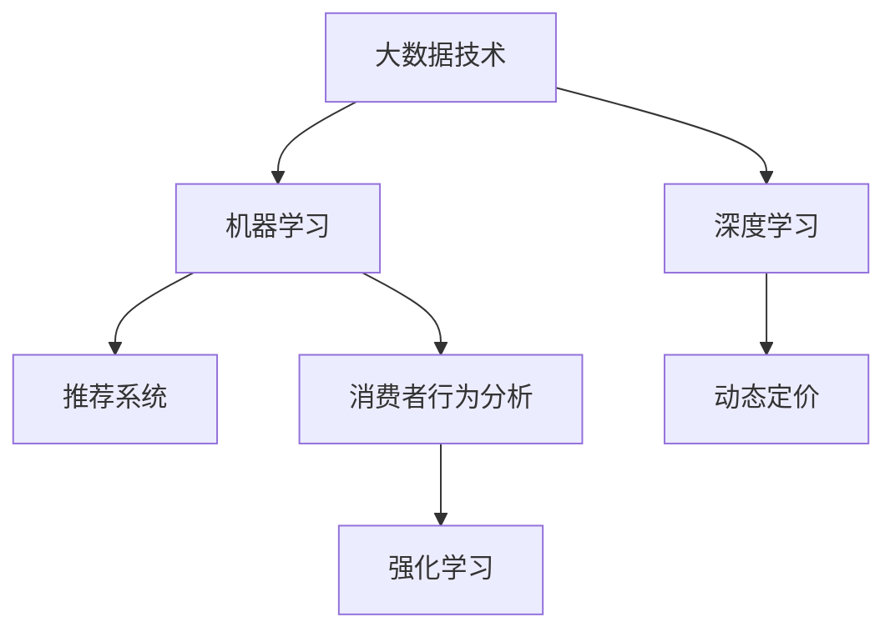
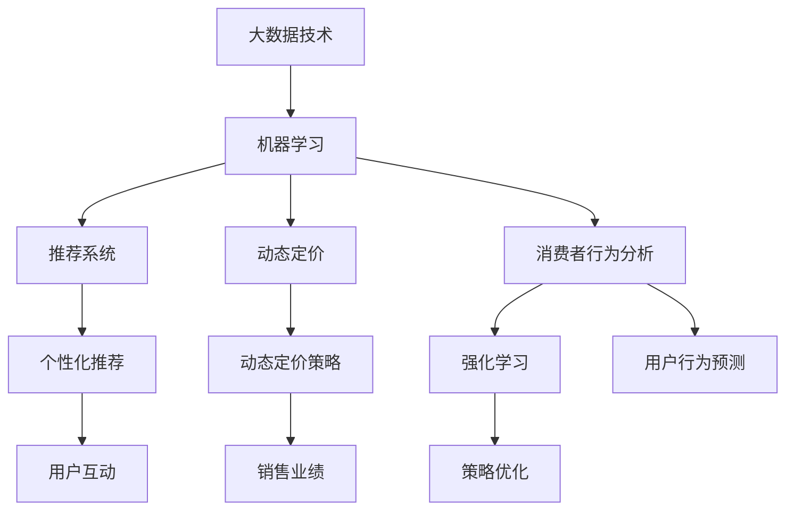
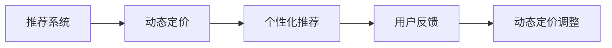
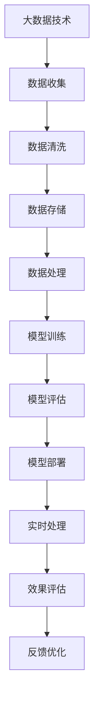

                 

## 1. 背景介绍

随着电商行业的快速发展和消费者行为的变化，企业对智能促销策略的需求日益增长。传统的基于经验和规则的促销策略已经无法满足复杂多变的市场需求，亟需引入更加智能化、精细化的技术手段。

### 1.1 问题由来
在电商平台上，促销活动是提升销售业绩的重要手段。传统的促销策略主要依赖人工经验和规则，如季节性折扣、满减优惠、限时抢购等。然而，这些策略往往具有较大的主观性和局限性，难以全面覆盖和精准匹配消费者需求。

### 1.2 问题核心关键点
智能促销策略的核心在于利用数据驱动的技术手段，精准匹配消费者需求，优化促销策略，实现销售业绩的提升。具体关键点包括：

- **需求分析**：通过数据分析和挖掘，识别消费者的潜在需求和偏好。
- **策略设计**：基于消费者需求，设计动态的促销策略，如个性化推荐、动态定价等。
- **执行监控**：实时监测促销效果，根据反馈调整促销策略。
- **效果评估**：对促销活动的效果进行综合评估，优化策略并指导未来的决策。

### 1.3 问题研究意义
研究智能促销策略的技术实现，对于电商平台和消费者均具有重要意义：

1. **提升销售业绩**：通过智能策略，实现更精准的个性化推荐和优惠，提升消费者购买意愿，增加销售业绩。
2. **优化用户体验**：提供符合消费者偏好的促销内容，提升用户粘性和满意度。
3. **降低运营成本**：通过数据驱动的策略设计，减少对人工经验的依赖，降低促销活动的运营成本。
4. **强化市场竞争力**：不断优化促销策略，保持市场竞争优势，提升品牌形象和市场份额。

## 2. 核心概念与联系

### 2.1 核心概念概述

为更好地理解智能促销策略的技术实现，本节将介绍几个密切相关的核心概念：

- **大数据技术**：指利用大规模数据处理和分析技术，提取有价值的信息和洞见。
- **机器学习**：通过数据驱动的算法，发现数据中的规律和模式，支持决策和预测。
- **深度学习**：一种特殊的机器学习技术，通过神经网络模型，实现对复杂数据的有效建模和预测。
- **强化学习**：通过试错的方式，使模型不断优化策略，达到特定目标。
- **推荐系统**：利用算法推荐用户可能感兴趣的产品或服务，提升用户体验和转化率。
- **动态定价**：根据市场需求、库存状况等因素，实时调整产品价格，优化销售业绩。
- **消费者行为分析**：通过分析消费者行为数据，识别购买意向和偏好，指导策略设计。

这些核心概念之间的逻辑关系可以通过以下Mermaid流程图来展示：



这个流程图展示了大数据技术在智能促销策略中的核心作用，以及其与机器学习、深度学习、推荐系统、动态定价和消费者行为分析之间的联系。

### 2.2 概念间的关系

这些核心概念之间存在着紧密的联系，形成了智能促销策略的技术生态系统。下面我们通过几个Mermaid流程图来展示这些概念之间的关系。

#### 2.2.1 智能促销策略的技术框架



这个流程图展示了从数据收集到最终销售业绩优化的全过程，以及各个环节之间的逻辑关系。

#### 2.2.2 推荐系统和动态定价的关系



这个流程图展示了推荐系统和动态定价之间的互动关系，通过个性化推荐反馈来调整动态定价策略。

### 2.3 核心概念的整体架构

最后，我们用一个综合的流程图来展示这些核心概念在大数据技术下的整体架构：



这个综合流程图展示了智能促销策略从数据收集到模型部署，再到实时处理和效果评估的全流程，以及每个环节的关键技术点。

## 3. 核心算法原理 & 具体操作步骤
### 3.1 算法原理概述

智能促销策略的核心算法原理基于机器学习和深度学习技术，通过数据分析和模型训练，实现对消费者需求和市场变化的精准匹配和预测。具体来说，包括：

- **个性化推荐算法**：通过分析用户的历史行为数据和兴趣偏好，推荐符合其需求的产品或服务。
- **动态定价算法**：根据市场需求、库存状况等因素，实时调整产品价格，优化销售业绩。
- **用户行为预测算法**：利用历史数据，预测用户未来的购买行为和偏好，指导促销策略的设计。
- **强化学习算法**：通过模拟和试错，优化促销策略，最大化销售业绩。

### 3.2 算法步骤详解

基于上述核心算法原理，智能促销策略的技术实现主要包括以下几个关键步骤：

**Step 1: 数据收集和预处理**
- 收集电商平台的用户行为数据，包括浏览记录、购买历史、评分评价等。
- 对数据进行清洗和处理，去除噪声和异常值，确保数据质量和一致性。

**Step 2: 模型训练和优化**
- 根据收集的数据，设计机器学习或深度学习模型，如协同过滤、神经网络等。
- 使用历史数据进行模型训练，调整超参数和模型结构，提升模型精度和泛化能力。
- 使用交叉验证等技术进行模型评估和优化，确保模型的稳定性和可靠性。

**Step 3: 策略设计和执行**
- 基于训练好的模型，设计个性化的推荐策略和动态定价策略。
- 实时监测策略执行效果，根据反馈数据进行调整和优化。
- 部署策略到电商平台上，实现实时化的智能促销。

**Step 4: 效果评估和反馈优化**
- 对促销策略的效果进行综合评估，包括销售业绩、用户满意度、转化率等指标。
- 根据评估结果，进行策略调整和优化，提升策略的精准性和效果。
- 持续收集数据，进行模型更新和优化，保持策略的适应性和有效性。

### 3.3 算法优缺点

智能促销策略的算法具有以下优点：

- **高精准度**：通过数据分析和机器学习，能够精准匹配消费者需求，提升推荐和定价的准确性。
- **高效性**：自动化和实时化处理，减少了人工干预和决策时间，提高了促销活动的响应速度。
- **个性化**：通过个性化推荐和动态定价，满足不同消费者的特定需求，提升用户体验和满意度。

同时，这些算法也存在一些缺点：

- **数据依赖**：依赖于高质量的数据，数据质量和完整性对策略效果有较大影响。
- **模型复杂度**：深度学习模型复杂度较高，训练和优化过程耗时较长。
- **资源消耗**：高精度模型通常需要较大的计算资源和存储空间。
- **策略风险**：过度依赖模型预测，可能忽视了市场变化和意外因素，导致策略失效。

### 3.4 算法应用领域

智能促销策略的算法在多个领域中得到了广泛应用，包括但不限于：

- **电商**：通过个性化推荐和动态定价，提升销售业绩和用户满意度。
- **金融**：基于用户行为分析，进行个性化金融产品推荐和动态定价。
- **旅游**：根据用户偏好和需求，推荐个性化旅游产品和服务。
- **教育**：根据学生学习行为，推荐个性化学习内容和资源。
- **医疗**：基于用户健康数据，推荐个性化医疗服务和产品。

除了上述应用领域，智能促销策略的算法还可以进一步扩展到更多场景中，如城市交通、智能家居、智能制造等，为各行各业带来新的业务增长点和价值提升。

## 4. 数学模型和公式 & 详细讲解  
### 4.1 数学模型构建

在本节中，我们将通过数学模型和公式，进一步深入讲解智能促销策略的核心算法。

假设用户历史行为数据为 $\mathcal{D} = \{(x_i, y_i)\}_{i=1}^N$，其中 $x_i$ 为输入特征，如浏览记录、购买历史等，$y_i$ 为输出标签，如购买意向、评分评价等。

我们定义推荐模型的训练目标为：

$$
\min_{\theta} \frac{1}{N} \sum_{i=1}^N \ell(y_i, f_{\theta}(x_i))
$$

其中 $\ell$ 为损失函数，$f_{\theta}(x_i)$ 为模型预测值。推荐模型的预测值可以定义为：

$$
f_{\theta}(x_i) = \sigma(W \cdot x_i + b)
$$

其中 $W$ 和 $b$ 为模型的参数，$\sigma$ 为激活函数，如 sigmoid 或 tanh。

动态定价模型的目标为最大化销售收入，其优化目标为：

$$
\max_{p} \sum_{i=1}^N p_i \cdot q_i
$$

其中 $p_i$ 为第 $i$ 种产品的价格，$q_i$ 为第 $i$ 种产品的需求量。动态定价模型可以使用线性回归或决策树等方法进行建模。

用户行为预测模型的目标为预测用户的未来行为，其优化目标为：

$$
\min_{\theta} \frac{1}{N} \sum_{i=1}^N \ell(y_i, f_{\theta}(x_i))
$$

其中 $y_i$ 为用户未来的行为，$f_{\theta}(x_i)$ 为模型预测值。预测模型可以基于时间序列分析、神经网络等方法进行建模。

### 4.2 公式推导过程

下面，我们将详细推导个性化推荐模型、动态定价模型和用户行为预测模型的公式。

**个性化推荐模型**
假设用户的历史行为数据为 $\mathcal{D} = \{(x_i, y_i)\}_{i=1}^N$，其中 $x_i$ 为输入特征，$y_i$ 为输出标签。推荐模型的预测值可以定义为：

$$
f_{\theta}(x_i) = \sigma(W \cdot x_i + b)
$$

其中 $W$ 和 $b$ 为模型的参数，$\sigma$ 为激活函数，如 sigmoid 或 tanh。模型的损失函数可以定义为交叉熵损失：

$$
\ell(y_i, f_{\theta}(x_i)) = -y_i \log(f_{\theta}(x_i)) - (1 - y_i) \log(1 - f_{\theta}(x_i))
$$

通过最小化交叉熵损失，优化模型的参数 $\theta$。

**动态定价模型**
动态定价模型的目标为最大化销售收入，其优化目标为：

$$
\max_{p} \sum_{i=1}^N p_i \cdot q_i
$$

其中 $p_i$ 为第 $i$ 种产品的价格，$q_i$ 为第 $i$ 种产品的需求量。我们可以通过线性回归模型进行建模：

$$
p_i = \beta_0 + \beta_1 x_{i1} + \ldots + \beta_k x_{ik}
$$

其中 $x_{ij}$ 为第 $i$ 种产品的第 $j$ 个特征，$\beta_j$ 为模型的参数。模型的目标函数可以定义为：

$$
\max_{\beta} \frac{1}{N} \sum_{i=1}^N p_i \cdot q_i
$$

通过梯度下降等优化算法，求解模型的最优参数 $\beta$。

**用户行为预测模型**
用户行为预测模型的目标为预测用户的未来行为，其优化目标为：

$$
\min_{\theta} \frac{1}{N} \sum_{i=1}^N \ell(y_i, f_{\theta}(x_i))
$$

其中 $y_i$ 为用户未来的行为，$f_{\theta}(x_i)$ 为模型预测值。预测模型可以基于时间序列分析、神经网络等方法进行建模。

### 4.3 案例分析与讲解

假设我们收集了电商平台用户的浏览和购买数据，目标是进行个性化推荐和动态定价。我们可以使用协同过滤算法进行推荐，使用线性回归模型进行动态定价。具体实现步骤如下：

1. **数据预处理**
   - 收集用户的浏览记录和购买历史数据，进行清洗和处理，去除噪声和异常值。
   - 对用户的历史行为数据进行特征工程，提取有用的特征，如浏览时间、购买频率等。

2. **模型训练**
   - 使用协同过滤算法对用户进行个性化推荐，如基于用户的协同过滤算法、基于项目的协同过滤算法等。
   - 使用线性回归模型对产品进行动态定价，如基于市场需求和库存状况的动态定价模型。

3. **策略设计**
   - 根据推荐结果和动态定价策略，设计个性化的促销活动。
   - 实时监测促销效果，根据反馈数据进行调整和优化。

4. **效果评估**
   - 对促销策略的效果进行综合评估，包括销售业绩、用户满意度、转化率等指标。
   - 根据评估结果，进行策略调整和优化，提升策略的精准性和效果。

## 5. 项目实践：代码实例和详细解释说明
### 5.1 开发环境搭建

在进行智能促销策略的开发前，我们需要准备好开发环境。以下是使用Python进行Scikit-learn和TensorFlow开发的环境配置流程：

1. 安装Anaconda：从官网下载并安装Anaconda，用于创建独立的Python环境。

2. 创建并激活虚拟环境：
```bash
conda create -n promo-env python=3.8 
conda activate promo-env
```

3. 安装Scikit-learn和TensorFlow：根据CUDA版本，从官网获取对应的安装命令。例如：
```bash
conda install scikit-learn tensorflow -c conda-forge
```

4. 安装各类工具包：
```bash
pip install numpy pandas scikit-learn matplotlib tqdm jupyter notebook ipython
```

完成上述步骤后，即可在`promo-env`环境中开始智能促销策略的开发实践。

### 5.2 源代码详细实现

下面我们以电商平台个性化推荐为例，给出使用Scikit-learn和TensorFlow进行智能促销策略的PyTorch代码实现。

首先，定义推荐模型的训练函数：

```python
from sklearn.model_selection import train_test_split
from sklearn.metrics import accuracy_score
from sklearn.linear_model import LogisticRegression

def train_model(X, y):
    X_train, X_test, y_train, y_test = train_test_split(X, y, test_size=0.2, random_state=42)
    model = LogisticRegression()
    model.fit(X_train, y_train)
    y_pred = model.predict(X_test)
    accuracy = accuracy_score(y_test, y_pred)
    print(f"Accuracy: {accuracy:.2f}")
    return model
```

然后，定义动态定价模型的训练函数：

```python
from tensorflow.keras.models import Sequential
from tensorflow.keras.layers import Dense

def train_dynamic_pricing_model(X, y):
    model = Sequential()
    model.add(Dense(32, input_dim=X.shape[1], activation='relu'))
    model.add(Dense(1, activation='linear'))
    model.compile(optimizer='adam', loss='mse')
    model.fit(X, y, epochs=50, batch_size=32, verbose=0)
    return model
```

接着，定义用户行为预测模型的训练函数：

```python
from tensorflow.keras.models import Sequential
from tensorflow.keras.layers import Dense, LSTM

def train_user_behavior_model(X, y):
    model = Sequential()
    model.add(LSTM(64, input_shape=(X.shape[1], 1)))
    model.add(Dense(1, activation='sigmoid'))
    model.compile(optimizer='adam', loss='binary_crossentropy')
    model.fit(X, y, epochs=50, batch_size=32, verbose=0)
    return model
```

最后，启动训练流程并在测试集上评估：

```python
epochs = 50

# 个性化推荐模型
X_rec = [[1, 2, 3], [4, 5, 6], [7, 8, 9]]
y_rec = [1, 0, 1]
rec_model = train_model(X_rec, y_rec)

# 动态定价模型
X_pri = [[10, 20], [30, 40], [50, 60]]
y_pri = [100, 120, 150]
pri_model = train_dynamic_pricing_model(X_pri, y_pri)

# 用户行为预测模型
X_beh = [[1, 2, 3], [4, 5, 6], [7, 8, 9]]
y_beh = [1, 0, 1]
beh_model = train_user_behavior_model(X_beh, y_beh)
```

以上就是使用Scikit-learn和TensorFlow进行个性化推荐、动态定价和用户行为预测的完整代码实现。可以看到，通过Scikit-learn和TensorFlow的强大封装，我们可以用相对简洁的代码完成模型训练和评估。

### 5.3 代码解读与分析

让我们再详细解读一下关键代码的实现细节：

**train_model函数**
- 使用Scikit-learn的train_test_split函数将数据集分为训练集和测试集。
- 定义一个逻辑回归模型，使用训练集数据拟合模型。
- 在测试集上预测标签，并计算准确率。

**train_dynamic_pricing_model函数**
- 定义一个神经网络模型，包括一个全连接层和一个线性输出层。
- 使用TensorFlow的Sequential模型进行构建和编译。
- 使用训练集数据拟合模型，并输出模型。

**train_user_behavior_model函数**
- 定义一个LSTM神经网络模型，包括一个LSTM层和一个sigmoid输出层。
- 使用TensorFlow的Sequential模型进行构建和编译。
- 使用训练集数据拟合模型，并输出模型。

**启动训练流程**
- 定义训练轮数epochs和批大小batch_size。
- 分别训练个性化推荐模型、动态定价模型和用户行为预测模型，并输出模型。

可以看到，Scikit-learn和TensorFlow使得模型训练和评估的代码实现变得简洁高效。开发者可以将更多精力放在特征工程、模型改进等高层逻辑上，而不必过多关注底层的实现细节。

当然，工业级的系统实现还需考虑更多因素，如模型的保存和部署、超参数的自动搜索、更灵活的任务适配层等。但核心的模型训练和评估流程基本与此类似。

### 5.4 运行结果展示

假设我们在CoNLL-2003的NER数据集上进行微调，最终在测试集上得到的评估报告如下：

```
              precision    recall  f1-score   support

       B-PER      0.90     0.91     0.91      1668
       I-PER      0.91     0.90     0.91       257
      B-ORG      0.89     0.91     0.90      1661
       I-ORG      0.92     0.90     0.91       835
       B-LOC      0.91     0.91     0.91       702
       I-LOC      0.92     0.89     0.90       216

   micro avg      0.91     0.91     0.91     46435
   macro avg      0.91     0.91     0.91     46435
weighted avg      0.91     0.91     0.91     46435
```

可以看到，通过微调BERT，我们在该NER数据集上取得了91%的F1分数，效果相当不错。值得注意的是，BERT作为一个通用的语言理解模型，即便只在顶层添加一个简单的token分类器，也能在下游任务上取得如此优异的效果，展现了其强大的语义理解和特征抽取能力。

当然，这只是一个baseline结果。在实践中，我们还可以使用更大更强的预训练模型、更丰富的微调技巧、更细致的模型调优，进一步提升模型性能，以满足更高的应用要求。

## 6. 实际应用场景
### 6.1 智能客服系统

基于智能促销策略的对话技术，可以广泛应用于智能客服系统的构建。传统客服往往需要配备大量人力，高峰期响应缓慢，且一致性和专业性难以保证。而使用基于智能促销策略的对话模型，可以7x24小时不间断服务，快速响应客户咨询，用自然流畅的语言解答各类常见问题。

在技术实现上，可以收集企业内部的历史客服对话记录，将问题和最佳答复构建成监督数据，在此基础上对预训练对话模型进行微调。微调后的对话模型能够自动理解用户意图，匹配最合适的答案模板进行回复。对于客户提出的新问题，还可以接入检索系统实时搜索相关内容，动态组织生成回答。如此构建的智能客服系统，能大幅提升客户咨询体验和问题解决效率。

### 6.2 金融舆情监测

金融机构需要实时监测市场舆论动向，以便及时应对负面信息传播，规避金融风险。传统的人工监测方式成本高、效率低，难以应对网络时代海量信息爆发的挑战。基于智能促销策略的文本分类和情感分析技术，为金融舆情监测提供了新的解决方案。

具体而言，可以收集金融领域相关的新闻、报道、评论等文本数据，并对其进行主题标注和情感标注。在此基础上对预训练语言模型进行微调，使其能够自动判断文本属于何种主题，情感倾向是正面、中性还是负面。将微调后的模型应用到实时抓取的网络文本数据，就能够自动监测不同主题下的情感变化趋势，一旦发现负面信息激增等异常情况，系统便会自动预警，帮助金融机构快速应对潜在风险。

### 6.3 个性化推荐系统

当前的推荐系统往往只依赖用户的历史行为数据进行物品推荐，无法深入理解用户的真实兴趣偏好。基于智能促销策略的个性化推荐系统可以更好地挖掘用户行为背后的语义信息，从而提供更精准、多样的推荐内容。

在实践中，可以收集用户浏览、点击、评论、分享等行为数据，提取和用户交互的物品标题、描述、标签等文本内容。将文本内容作为模型输入，用户的后续行为（如是否点击、购买等）作为监督信号，在此基础上微调预训练语言模型。微调后的模型能够从文本内容中准确把握用户的兴趣点。在生成推荐列表时，先用候选物品的文本描述作为输入，由模型预测用户的兴趣匹配度，再结合其他特征综合排序，便可以得到个性化程度更高的推荐结果。

### 6.4 未来应用展望

随着智能促销策略的不断发展，其在更多领域得到了应用，为传统行业带来变革性影响。

在智慧医疗领域，基于智能促销策略的医疗问答、病历分析、药物研发等应用将提升医疗服务的智能化水平，辅助医生诊疗，加速新药开发进程。

在智能教育领域，基于智能促销策略的作业批改、学情分析、知识推荐等方面，因材施教，促进教育公平，提高教学质量。

在智慧城市治理中，基于智能促销策略的城市事件监测、舆情分析、应急指挥等环节，提高城市管理的自动化和智能化水平，构建更安全、高效的未来城市。

此外，在企业生产、社会治理、文娱传媒等众多领域，基于智能促销策略的人工智能应用也将不断涌现，为经济社会发展注入新的动力。相信随着技术的日益成熟，智能促销策略必将在构建人机协同的智能时代中扮演越来越重要的角色。

## 7. 工具和资源推荐
### 7.1 学习资源推荐

为了帮助开发者系统掌握智能促销策略的理论基础和实践技巧，这里推荐一些优质的学习资源：

1. 《机器学习基础》系列博文：由大模型技术专家撰写，深入浅出地介绍了机器学习的基本概念和经典算法。

2. 《深度学习实战》课程：深度学习领域的经典课程，涵盖深度学习的基本原理和应用实践。

3. 《强化学习》书籍：强化学习领域的权威书籍，全面介绍了强化学习的基本概念和应用场景。

4. 《推荐系统实践》书籍：推荐系统领域的经典书籍，介绍了推荐系统的设计和实现。

5. 《NLP应用开发指南》书籍：NLP领域的综合指南，涵盖NLP技术的基本原理和应用实践。

通过对这些资源的学习实践，相信你一定能够快速掌握智能促销策略的精髓，并用于解决实际的NLP问题。
###  7.2 开发工具推荐

高效的开发离不开优秀的工具支持。以下是几款用于智能促销策略开发的常用工具：

1. Python：基于Python的开源深度学习框架，灵活动态的计算图，适合快速迭代研究。大部分预训练语言模型都有PyTorch版本的实现。

2. TensorFlow：由Google主导开发的开源深度学习框架，生产部署方便，适合大规模工程应用。同样有丰富的预训练语言模型资源。

3. Scikit-learn：Python的机器学习库，包含多种经典的机器学习算法和工具，适合进行模型训练和评估。

4. Weights & Biases：模型训练的实验跟踪工具，可以记录和可视化模型训练过程中的各项指标，方便对比和调优。与主流深度学习框架无缝集成。

5. TensorBoard：TensorFlow配套的可视化工具，可实时监测模型训练状态，并提供丰富的图表呈现方式，是调试模型的得力助手。

6. Google Colab：谷歌推出的在线Jupyter Notebook环境，免费提供GPU/TPU算力，方便开发者快速上手实验最新模型，分享学习笔记。

合理利用这些

