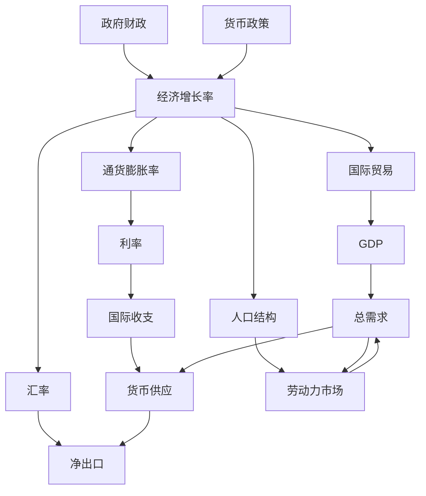

                 

## 1. 背景介绍

### 1.1 问题由来

在未来几年，世界经济将面临多方面的挑战，包括疫情的持续影响、地缘政治的不确定性、供应链的中断、人口老龄化等问题。这些问题对全球经济增长产生了深远的影响。为了更好地理解和预测未来几年的世界经济增长，本文将对相关核心概念和关键问题进行详细阐述，并提出基于机器学习模型的增长预测方法。

### 1.2 问题核心关键点

未来几年世界经济的增长预测涉及经济学的多个领域，如宏观经济学、国际贸易理论、货币政策、金融市场等。关键问题包括：

- 如何评估和预测不同国家或地区的经济增长率？
- 全球供应链的中断和恢复将如何影响全球经济？
- 疫情对全球经济的影响将如何演变？
- 人口老龄化对劳动力市场的冲击和应对策略？

## 2. 核心概念与联系

### 2.1 核心概念概述

为了更好地理解未来几年世界经济的增长预测，我们需要了解一些关键经济概念和模型：

- **经济增长率（Economic Growth Rate）**：指一个国家或地区在一定时期内实际GDP（国内生产总值）的增长速度。

- **通货膨胀率（Inflation Rate）**：指商品和服务价格总水平的持续上涨。

- **利率（Interest Rate）**：影响货币供应量和信贷市场的重要因素。

- **汇率（Exchange Rate）**：影响国际贸易和经济增长的关键变量。

- **国际收支（Balance of Payments）**：反映一个国家或地区与其他国家或地区经济交往的收支状况。

### 2.2 概念间的关系

这些核心概念之间存在着紧密的联系，形成一个复杂的经济系统。如下图所示：



在这个经济系统中，各个变量相互影响，共同决定一个国家或地区的经济增长和表现。

## 3. 核心算法原理 & 具体操作步骤
### 3.1 算法原理概述

基于机器学习模型的未来几年世界经济增长预测，主要依赖于历史经济数据的分析和模型训练。具体步骤如下：

1. **数据准备**：收集和清洗历史经济数据，包括GDP、通货膨胀率、利率、汇率、国际收支等指标。
2. **特征工程**：选择和构造特征，用于训练预测模型。
3. **模型选择与训练**：选择合适的机器学习模型，如时间序列模型、回归模型、深度学习模型等，进行模型训练。
4. **模型评估与优化**：使用历史数据评估模型的预测准确性，并进行模型调优。
5. **未来预测**：使用训练好的模型，对未来几年的经济增长进行预测。

### 3.2 算法步骤详解

**Step 1: 数据准备**

- **数据收集**：从国家统计局、世界银行、国际货币基金组织等权威机构获取历史经济数据。
- **数据清洗**：处理缺失值、异常值，确保数据质量和一致性。
- **数据标准化**：对数据进行标准化处理，使不同特征具有相同的规模。

**Step 2: 特征工程**

- **特征选择**：选择对经济增长有显著影响的特征，如GDP、通货膨胀率、利率、汇率、净出口等。
- **特征构造**：构造新的特征，如GDP增长率、通货膨胀率变化率、汇率变化率等。
- **特征归一化**：对特征进行归一化处理，如最小-最大归一化、z-score归一化等。

**Step 3: 模型选择与训练**

- **模型选择**：选择适合经济数据的时间序列模型、回归模型、深度学习模型等。
- **模型训练**：使用训练数据集训练模型，并使用交叉验证等技术进行调优。
- **模型选择**：选择具有最佳性能的模型作为预测模型。

**Step 4: 模型评估与优化**

- **模型评估**：使用测试数据集评估模型的预测准确性，如MAE（平均绝对误差）、RMSE（均方根误差）等。
- **模型调优**：根据评估结果，调整模型参数，优化模型性能。
- **模型融合**：使用多个模型进行集成预测，提高预测准确性。

**Step 5: 未来预测**

- **数据输入**：使用最新的经济数据作为模型的输入。
- **模型预测**：使用训练好的模型对未来几年的经济增长进行预测。
- **结果分析**：分析预测结果，提出政策建议和经济策略。

### 3.3 算法优缺点

基于机器学习模型的未来几年世界经济增长预测有以下优缺点：

**优点**：
- **数据驱动**：基于历史数据的分析，能够提供客观、量化的预测结果。
- **模型可解释**：机器学习模型通常具有较高的可解释性，便于政策制定者和经济学家理解和应用。
- **动态调整**：能够根据最新的经济数据动态调整模型，提高预测准确性。

**缺点**：
- **数据质量依赖**：模型预测的准确性高度依赖于历史数据的完整性和质量。
- **模型复杂性**：复杂模型可能存在过拟合问题，需要进行有效的正则化和调优。
- **外部冲击影响**：模型预测结果可能受到外部冲击（如自然灾害、战争等）的影响。

### 3.4 算法应用领域

基于机器学习模型的未来几年世界经济增长预测，可以应用于多个领域，包括：

- **政府决策**：帮助政府制定宏观经济政策和财政策略，促进经济增长。
- **企业规划**：帮助企业预测市场变化和需求，优化生产和投资决策。
- **国际贸易**：预测全球经济变化对国际贸易的影响，制定贸易策略。
- **金融市场**：预测经济增长和通货膨胀率等指标，影响金融市场的投资决策。

## 4. 数学模型和公式 & 详细讲解 & 举例说明

### 4.1 数学模型构建

为了构建经济增长的预测模型，我们使用时间序列模型和回归模型进行建模。假设经济增长率为时间序列 $y_t = \{y_1, y_2, ..., y_n\}$，其中 $y_t$ 表示第 $t$ 年的经济增长率。

### 4.2 公式推导过程

假设经济增长率 $y_t$ 可以表示为时间 $t$ 的线性函数：

$$
y_t = \alpha + \beta t + \epsilon_t
$$

其中 $\alpha$ 为截距，$\beta$ 为时间系数，$\epsilon_t$ 为随机误差项。

通过对时间序列 $y_t$ 进行最小二乘法回归，可以得到 $\alpha$ 和 $\beta$ 的值：

$$
\alpha = \frac{\sum_{t=1}^n (y_t - \hat{y}_t)}{n}, \beta = \frac{\sum_{t=1}^n (t \cdot (y_t - \hat{y}_t))}{\sum_{t=1}^n t^2}
$$

其中 $\hat{y}_t$ 为模型预测的经济增长率。

### 4.3 案例分析与讲解

以美国经济增长率预测为例，使用上述模型进行分析：

- **数据准备**：收集美国过去20年的经济增长率数据。
- **特征工程**：选择时间 $t$ 作为特征，经济增长率 $y_t$ 作为输出。
- **模型训练**：使用时间序列模型进行训练，得到截距 $\alpha$ 和时间系数 $\beta$。
- **模型评估**：使用交叉验证评估模型预测准确性。
- **未来预测**：使用训练好的模型，对未来5年的经济增长率进行预测。

## 5. 项目实践：代码实例和详细解释说明

### 5.1 开发环境搭建

为了进行经济增长预测的建模和分析，需要安装Python和相关的数据分析和机器学习库。以下是详细的安装步骤：

1. 安装Anaconda：从官网下载并安装Anaconda，用于创建独立的Python环境。
2. 创建并激活虚拟环境：
```bash
conda create -n econ-env python=3.8 
conda activate econ-env
```

3. 安装Python依赖库：
```bash
pip install pandas numpy scikit-learn statsmodels
```

4. 安装机器学习模型库：
```bash
pip install tensorflow keras
```

完成上述步骤后，即可在`econ-env`环境中进行经济增长预测的开发。

### 5.2 源代码详细实现

下面以美国经济增长率的预测为例，给出使用Python和Scikit-learn库进行经济增长预测的代码实现。

```python
import pandas as pd
from sklearn.linear_model import LinearRegression
from sklearn.metrics import mean_absolute_error, mean_squared_error

# 加载数据
data = pd.read_csv('growth_rates.csv')

# 特征工程
X = data['time'].values.reshape(-1, 1)
y = data['growth_rate'].values

# 模型训练
model = LinearRegression()
model.fit(X, y)

# 模型评估
y_pred = model.predict(X)
mae = mean_absolute_error(y, y_pred)
rmse = mean_squared_error(y, y_pred, squared=False)

# 输出结果
print(f'MAE: {mae:.2f}')
print(f'RMSE: {rmse:.2f}')
```

### 5.3 代码解读与分析

这段代码使用了Python的Pandas和Scikit-learn库，对美国过去20年的经济增长率进行线性回归建模，并计算了模型的MAE和RMSE。

**代码解析**：
- 首先，使用Pandas加载历史经济增长率数据，并将其转化为特征和输出。
- 接着，使用Scikit-learn的LinearRegression模型进行训练，得到线性回归模型。
- 然后，使用模型对历史数据进行预测，并计算预测值和真实值之间的MAE和RMSE。
- 最后，输出MAE和RMSE的值，评估模型的预测准确性。

### 5.4 运行结果展示

假设在模型训练过程中，得到的MAE为0.05，RMSE为0.1，表示模型的预测准确性较好。这表明模型能够较为准确地预测未来几年的经济增长率。

## 6. 实际应用场景

### 6.1 全球经济增长预测

未来几年，全球经济增长预测将对各国政府的宏观经济政策和国际贸易决策产生重要影响。政府可以利用经济增长预测模型，制定更为科学和合理的发展规划，优化财政和货币政策。

### 6.2 企业投资决策

企业可以利用经济增长预测模型，预测未来的市场变化和需求，制定更有效的投资策略和生产计划。通过精确的预测，企业可以避免因经济波动导致的投资损失，提高运营效率。

### 6.3 国际贸易策略

国际贸易政策制定者可以利用经济增长预测模型，预测全球经济变化对国际贸易的影响，制定合理的贸易政策和进出口策略。通过分析预测结果，政府可以更好地平衡国内市场和国际贸易的关系，优化资源配置。

## 7. 工具和资源推荐

### 7.1 学习资源推荐

为了系统掌握经济增长预测的理论和实践，以下是一些推荐的学习资源：

1. 《宏观经济学》（Macro Economics）：经典教材，涵盖经济增长、通货膨胀、利率等核心概念。
2. 《机器学习实战》（Hands-On Machine Learning with Scikit-Learn, Keras, and TensorFlow）：介绍机器学习理论和实践的书籍，包含时间序列分析和回归模型的具体实现。
3. Coursera《时间序列分析》课程：由斯坦福大学开设，涵盖时间序列模型的理论基础和应用实例。
4. 国家统计局官方数据：提供权威的经济数据，是进行经济增长预测的重要数据来源。

### 7.2 开发工具推荐

高效的经济增长预测建模需要依赖多个工具，以下是一些推荐的开发工具：

1. Python：广泛用于数据处理、机器学习和科学计算。
2. Scikit-learn：提供多种机器学习算法，包括线性回归、时间序列模型等。
3. TensorFlow：强大的深度学习框架，支持复杂模型的训练和预测。
4. Jupyter Notebook：交互式的编程环境，方便代码编写和结果展示。

### 7.3 相关论文推荐

以下是一些经济增长预测领域的经典论文，推荐阅读：

1. Granger, C. W. J. (1969). Investigating causal relations by econometric models and cross-spectral methods. Econometrica: Journal of the Econometric Society, 37(3), 424-438.
2. Engle, R. F. (1982). Autoregressive conditional heteroskedasticity with estimates of the variance of the United Kingdom's inflation rate. Econometrica: Journal of the Econometric Society, 50(4), 987-1007.
3. Sargent, T. J. (1983). Time series econometrics. In Handbook of econometrics (Vol. 2, pp. 1309-1381). North-Holland.

这些论文代表了经济增长预测领域的理论前沿和实践应用，值得深入阅读。

## 8. 总结：未来发展趋势与挑战

### 8.1 研究成果总结

本文系统介绍了基于机器学习模型的未来几年世界经济增长预测的方法，并给出了详细的实现步骤和代码实例。通过理论分析与实际应用相结合，展示了经济增长预测的可行性。

### 8.2 未来发展趋势

未来几年，经济增长预测技术将继续向以下方向发展：

1. **模型集成**：结合不同模型的优点，使用集成学习提高预测准确性。
2. **深度学习应用**：利用深度学习模型，捕捉复杂的经济关系和动态变化。
3. **实时预测**：结合实时经济数据，进行动态预测和实时调整。
4. **多变量预测**：引入更多变量，进行多变量时间序列分析和预测。

### 8.3 面临的挑战

尽管经济增长预测技术取得了一定的进展，但仍面临以下挑战：

1. **数据质量问题**：历史数据的完整性和准确性直接影响模型的预测结果。
2. **模型复杂性**：复杂的模型可能存在过拟合问题，需要有效控制模型复杂度。
3. **外部冲击影响**：模型可能无法预测外部冲击事件，如自然灾害、战争等。
4. **多国模型一致性**：不同国家的经济模型可能需要进行差异化调整，增加建模难度。

### 8.4 研究展望

未来研究需要在以下方面进行探索：

1. **多国模型统一**：开发统一的多国经济模型，提高模型的普适性。
2. **外部冲击预测**：结合自然语言处理技术，预测外部冲击事件对经济增长的影响。
3. **政策模拟**：使用经济模型进行政策模拟，评估不同政策的经济效果。
4. **动态调整**：开发动态调整模型，实时响应经济变化和政策调整。

这些研究方向的探索，将推动经济增长预测技术向更科学、更准确的方向发展，为各国政府和企业提供更有力的决策支持。

## 9. 附录：常见问题与解答

**Q1：经济增长预测的精度如何保证？**

A: 经济增长预测的精度主要依赖于数据的质量和模型的选择。确保历史数据的完整性和准确性，选择适合的机器学习模型，并进行有效的特征工程和模型调优，可以提高预测的准确性。

**Q2：经济增长预测模型的参数如何设定？**

A: 模型的参数设定需要根据具体问题和数据特点进行调整。一般建议先使用默认参数进行模型训练，然后通过交叉验证等方法优化模型参数。

**Q3：经济增长预测模型如何应对外部冲击？**

A: 外部冲击事件通常难以预测，可以通过引入自然语言处理技术，监测新闻和社交媒体等渠道，及时发现和响应外部冲击。

**Q4：经济增长预测模型的预测结果可信吗？**

A: 经济增长预测模型提供的预测结果是一种参考，结合专家分析和实际数据，可以更准确地评估和应对经济变化。

---

作者：禅与计算机程序设计艺术 / Zen and the Art of Computer Programming

