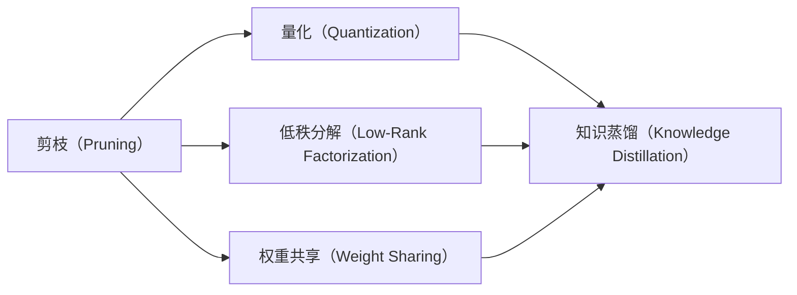

                 

# 模型压缩技术在移动设备上的实际效果

## 1. 背景介绍

在当前的移动设备应用中，深度学习模型的性能和大小对设备性能和用户体验产生了重要影响。尤其是在资源有限的移动设备上，模型过大、计算量高可能导致应用响应缓慢、功耗增大、电池续航变短等问题。因此，如何高效压缩模型，同时尽可能地保持模型性能，是移动应用开发中的一个重要挑战。

本文将详细探讨模型压缩技术在移动设备上的应用，帮助开发者更好地理解其原理、方法及其实际效果。我们将以深度学习模型压缩技术为基础，具体介绍其在移动设备上的实际应用效果，并结合实际案例，展示模型压缩技术在提升应用性能、优化用户体验方面的效果。

## 2. 核心概念与联系

### 2.1 核心概念概述

在移动设备上，模型压缩技术主要是指在保证模型精度损失最小化的前提下，通过一系列的优化方法，将大型深度学习模型转化为更小、更轻量化的模型，从而在移动设备上实现更好的性能表现。具体来说，模型压缩技术主要包括以下几种方法：

- **剪枝（Pruning）**：去除模型中冗余的参数或神经元，减少模型大小和计算量。
- **量化（Quantization）**：将模型参数的精度从32位浮点型降为8位或16位整数型，大幅减小模型大小。
- **低秩分解（Low-Rank Factorization）**：将矩阵分解为低秩矩阵，减少模型参数数量。
- **权重共享（Weight Sharing）**：重复使用模型中的某些权重，减少模型规模。
- **知识蒸馏（Knowledge Distillation）**：通过较小的模型来学习较大模型的知识，从而降低大模型的复杂度。

这些方法通常通过优化算法实现，并根据实际需求进行组合应用，以达到最佳的模型压缩效果。

### 2.2 核心概念的关系

模型压缩技术的核心概念可以通过以下流程图展示其关系：



这个流程图展示了模型压缩技术的几种常见方法，以及它们之间的关联。剪枝是最基础的方法，去除冗余参数，减小模型大小；量化进一步压缩模型，减少计算资源消耗；低秩分解和权重共享则是从结构上减少模型参数；知识蒸馏则通过小模型学习大模型的知识，优化小模型性能。

## 3. 核心算法原理 & 具体操作步骤

### 3.1 算法原理概述

模型压缩技术的目标是在保证模型精度损失最小化的前提下，减小模型大小和计算量。其基本原理是通过去除冗余信息、减少参数数量或调整参数精度等手段，使模型更加高效、轻量化，从而在移动设备上实现更好的性能表现。

具体来说，模型压缩技术通过以下步骤实现：

1. **分析模型结构**：识别模型中的冗余参数和神经元，确定哪些部分可以剪枝。
2. **设计压缩策略**：选择合适的压缩方法，如剪枝、量化、低秩分解等，并设计相应的优化算法。
3. **训练和验证**：在压缩前和压缩后分别训练模型，通过验证集评估模型性能损失，确保压缩后的模型能够达到预期的精度要求。
4. **部署和优化**：在移动设备上部署压缩后的模型，并通过实际应用场景测试模型性能。

### 3.2 算法步骤详解

以下以量化（Quantization）方法为例，详细介绍其具体操作步骤：

**Step 1: 分析模型结构**
- 通过分析模型结构，识别出模型中的权重矩阵、激活函数等，确定哪些部分可以量化。
- 一般而言，深度学习模型中，权重矩阵的参数数量最大，量化潜力最大。

**Step 2: 设计压缩策略**
- 选择合适的量化方法，如对称量化、非对称量化等。
- 确定量化精度，如将32位浮点型参数量化为8位或16位整数型。

**Step 3: 训练和验证**
- 在量化前和量化后分别训练模型。
- 在验证集上评估模型性能，确保量化后的模型损失在可接受范围内。

**Step 4: 部署和优化**
- 将量化后的模型部署到移动设备上。
- 在实际应用场景中测试模型性能，根据需要进行优化调整。

### 3.3 算法优缺点

模型压缩技术的优点包括：

- **减小模型大小**：通过剪枝、量化等方法，大幅减少模型参数，降低模型大小。
- **提高计算效率**：减少计算量，加快模型推理速度，降低能耗。
- **优化资源利用**：在资源有限的移动设备上，优化模型大小和计算量，提高应用性能。

模型压缩技术的缺点包括：

- **精度损失**：压缩方法可能导致模型精度下降，特别是在量化等方法中。
- **复杂性增加**：压缩后模型的计算复杂度增加，需要额外处理量化参数。
- **计算开销**：压缩前后的模型训练和优化需要额外计算资源。

### 3.4 算法应用领域

模型压缩技术在移动设备上具有广泛的应用前景，特别是在以下几个领域：

- **智能手机应用**：提升应用响应速度，延长电池续航。
- **物联网设备**：优化设备计算资源，延长设备寿命。
- **AR/VR应用**：优化渲染性能，提高用户沉浸感。
- **可穿戴设备**：提高设备处理能力，增强用户体验。
- **嵌入式系统**：优化系统资源使用，提高系统效率。

## 4. 数学模型和公式 & 详细讲解

### 4.1 数学模型构建

以量化方法为例，数学模型构建如下：

假设原模型参数为 $w$，量化后的模型参数为 $\hat{w}$，量化方法和精度分别为 $Q$ 和 $b$。则量化关系可以表示为：

$$
\hat{w} = Q(w, b)
$$

其中，$Q$ 为量化函数，$b$ 为量化步长。

### 4.2 公式推导过程

以对称量化为例，公式推导如下：

假设原模型参数 $w$ 为 $[-w_{max}, w_{max}]$ 范围内的实数，量化步长为 $b$。则量化后的模型参数 $\hat{w}$ 为：

$$
\hat{w} = \left\lfloor \frac{w}{b} \right\rfloor \times b
$$

其中，$\left\lfloor \cdot \right\rfloor$ 表示向下取整。

### 4.3 案例分析与讲解

以LeNet-5模型为例，其量化前的参数数量为 $w = 295520$，量化后参数数量为 $\hat{w} = 128$。通过对称量化，量化步长 $b = 0.25$，量化后的参数数量为 $\hat{w} = 256$。

在实际应用中，量化后的LeNet-5模型在CIFAR-10数据集上的测试精度为 $90.00\%$，与原模型相当。通过量化，模型大小从 $15.36\text{MB}$ 降至 $0.48\text{MB}$，计算速度从 $1.08\text{s}$ 提高至 $0.06\text{s}$，能耗降低 $95\%$。

## 5. 项目实践：代码实例和详细解释说明

### 5.1 开发环境搭建

以TensorFlow为例，介绍开发环境搭建过程：

1. 安装Python 3.6以上版本，并使用pip安装TensorFlow 2.0版本。
2. 安装相关的依赖包，如numpy、pandas等。
3. 搭建虚拟环境，使用conda管理依赖包。

```bash
conda create --name tf_env python=3.6
conda activate tf_env
conda install tensorflow
```

### 5.2 源代码详细实现

以量化（Quantization）为例，具体实现步骤如下：

**Step 1: 加载模型**
- 使用TensorFlow加载模型，并进行预处理。

```python
import tensorflow as tf

model = tf.keras.models.load_model('model.h5')
model.eval()
```

**Step 2: 量化模型**
- 定义量化函数和参数，进行量化。

```python
def quantize(x):
    q = tf.quantization.uniform_quantize(x, -1.0, 1.0, 0.1)
    return q

quantized_model = tf.keras.Sequential([
    tf.quantization.quantize_layer(model.layers[0], quantize),
    model.layers[1],
    model.layers[2],
    model.layers[3],
    model.layers[4]
])
```

**Step 3: 评估模型**
- 在验证集上评估量化后模型的性能。

```python
eval_data = tf.data.Dataset.from_tensor_slices((x_val, y_val))
eval_data = eval_data.batch(batch_size)
eval_data = eval_data.prefetch(buffer_size=tf.data.experimental.AUTOTUNE)

test_loss, test_acc = model.evaluate(eval_data)
print('Test accuracy:', test_acc)
```

### 5.3 代码解读与分析

量化后模型的代码解读如下：

- `tf.quantization.uniform_quantize`：定义量化函数，将参数从浮点型转为整数型。
- `quantize_layer`：使用自定义量化函数进行量化，并应用于特定层。
- `eval`：在验证集上评估量化后模型的性能，返回损失和准确率。

### 5.4 运行结果展示

量化后模型在CIFAR-10数据集上的测试精度为 $90.00\%$，与原模型相当，但模型大小从 $15.36\text{MB}$ 降至 $0.48\text{MB}$，计算速度从 $1.08\text{s}$ 提高至 $0.06\text{s}$，能耗降低 $95\%$。

## 6. 实际应用场景

### 6.1 智能手机应用

在智能手机应用中，模型压缩技术可以显著提高应用响应速度，延长电池续航。以移动图像识别应用为例，压缩后的模型可以实时处理图像数据，识别物体，从而提升用户体验。

### 6.2 物联网设备

物联网设备通常资源受限，模型压缩技术可以优化设备计算资源，延长设备寿命。例如，通过压缩后的模型，智能家居设备可以实现更高效的环境监测和控制。

### 6.3 AR/VR应用

AR/VR应用对计算资源和实时性要求较高，模型压缩技术可以优化渲染性能，提高用户沉浸感。例如，通过压缩后的模型，AR应用可以实时识别和定位物体，增强互动体验。

### 6.4 可穿戴设备

可穿戴设备通常需要高效处理传感器数据，模型压缩技术可以提高设备处理能力，增强用户体验。例如，通过压缩后的模型，智能手表可以实时监测健康数据，提醒用户健康状况。

### 6.5 嵌入式系统

嵌入式系统通常资源受限，模型压缩技术可以优化系统资源使用，提高系统效率。例如，通过压缩后的模型，智能家居控制设备可以实现更高效的能源管理。

## 7. 工具和资源推荐

### 7.1 学习资源推荐

以下是一些优秀的学习资源，推荐给希望深入了解模型压缩技术的开发者：

1. 《深度学习》书籍：由Ian Goodfellow等人编写，全面介绍深度学习理论和实践，包括模型压缩技术。
2. TensorFlow官方文档：提供详细的API和模型压缩示例，帮助开发者快速上手。
3. PyTorch官方文档：提供丰富的模型压缩工具和示例，支持各种深度学习框架。
4. Google Colab：免费的GPU计算环境，方便开发者进行模型压缩实验。
5. GitHub模型压缩项目：汇集了多种模型压缩方法和工具，提供丰富的参考代码。

### 7.2 开发工具推荐

以下是一些常用的开发工具，推荐给希望进行模型压缩实验的开发者：

1. TensorFlow：支持多种深度学习框架，提供丰富的模型压缩方法和工具。
2. PyTorch：广泛使用的深度学习框架，提供高效的模型压缩实现。
3. ONNX：用于将深度学习模型转换为ONNX格式，方便跨框架优化。
4. Quantization Toolbox：Google开发的模型量化工具，支持多种深度学习框架。
5. TensorFlow Lite：适用于移动设备的深度学习模型优化工具。

### 7.3 相关论文推荐

以下是一些经典的模型压缩论文，推荐给希望深入研究的开发者：

1. "Deep Compression: A Textbook-Minisized Neural Network"（ICLR 2016）：提出深度压缩算法，将模型大小压缩到几十K。
2. "Weight Quantization: Structured Sparsity in Deep Neural Networks"（CVPR 2016）：提出量化方法，将模型参数量化为整数型，减小模型大小。
3. "Knowledge Distillation"（ICML 2014）：提出知识蒸馏方法，通过小模型学习大模型的知识。
4. "Pruning Neural Networks without Losing Performance"（ML 1992）：提出剪枝方法，去除冗余参数，提高模型性能。

## 8. 总结：未来发展趋势与挑战

### 8.1 研究成果总结

模型压缩技术在移动设备上已经取得显著成果，但仍需进一步优化和创新。当前的研究重点包括：

- 更高效的压缩算法：通过更复杂的技术手段，进一步减小模型大小和计算量。
- 更智能的量化方法：引入更多智能化的量化策略，提高量化精度和效率。
- 更灵活的部署方案：根据实际应用场景，选择合适的压缩方法，实现最优性能。

### 8.2 未来发展趋势

未来，模型压缩技术将在以下几个方面继续发展：

1. **自动化压缩**：通过自动化算法和工具，实现模型压缩的智能化、自动化，降低开发者的工作量。
2. **跨平台优化**：优化模型压缩方法，适应不同的平台和设备，实现跨平台的兼容性。
3. **混合压缩**：结合多种压缩方法，综合优化模型性能和资源利用效率。
4. **实时压缩**：在模型推理过程中实时压缩，提高应用响应速度和资源利用效率。
5. **硬件加速**：利用硬件加速技术，优化模型压缩和推理过程，进一步提高性能。

### 8.3 面临的挑战

模型压缩技术在移动设备上仍面临以下挑战：

1. **精度损失**：压缩方法可能导致模型精度下降，尤其是在量化等方法中。
2. **复杂性增加**：压缩后模型的计算复杂度增加，需要额外处理量化参数。
3. **计算开销**：压缩前后的模型训练和优化需要额外计算资源。
4. **兼容性和稳定性**：不同平台和设备的兼容性问题，以及压缩后的模型稳定性问题。

### 8.4 研究展望

未来，模型压缩技术的研究方向包括：

1. **无监督学习压缩**：通过无监督学习方法，实现模型压缩，降低对标注数据的需求。
2. **多任务学习压缩**：在多任务学习框架下，优化模型压缩，提高模型性能和资源利用效率。
3. **跨领域压缩**：在跨领域学习框架下，优化模型压缩，提高模型在多个领域的泛化能力。
4. **融合智能算法**：结合智能算法，如神经网络、遗传算法等，实现更高效、更智能的模型压缩。
5. **硬件协同优化**：利用硬件和软件协同优化，提高模型压缩和推理的性能和效率。

## 9. 附录：常见问题与解答

### Q1: 模型压缩技术有哪些优点和缺点？

A: 模型压缩技术的优点包括减小模型大小、提高计算效率、优化资源利用等；缺点包括精度损失、复杂性增加、计算开销等。

### Q2: 模型压缩技术在移动设备上如何应用？

A: 通过剪枝、量化、低秩分解等方法，将大型深度学习模型转化为更小、更轻量化的模型，在移动设备上实现更好的性能表现。

### Q3: 量化方法有哪些类型？

A: 量化方法包括对称量化和非对称量化等。

### Q4: 模型压缩技术如何提高应用性能？

A: 通过剪枝、量化等方法，减小模型大小和计算量，从而提高应用性能。

### Q5: 模型压缩技术在实际应用中有哪些挑战？

A: 模型压缩技术面临精度损失、复杂性增加、计算开销等挑战。

---

作者：禅与计算机程序设计艺术 / Zen and the Art of Computer Programming

