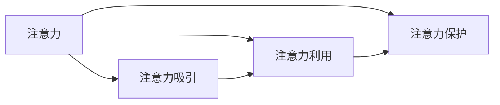

                 

# 注意力经济对企业组织结构的影响

注意力经济（Attention Economy）是指随着信息爆炸和互联网普及，人们可用注意力成为稀缺资源，如何吸引并高效利用人们的注意力成为企业竞争的关键。本文旨在探讨注意力经济对企业组织结构的影响，分析不同组织形式对吸引和利用注意力资源的作用机制，并提出相应的策略和建议。

## 1. 背景介绍

### 1.1 问题由来

随着互联网和移动互联网的普及，人们可接触的信息量呈爆炸性增长，而个体的时间与注意力是有限的。企业如何吸引和利用用户的注意力成为竞争的重要课题。企业需要重新审视其组织结构和运营模式，以适应注意力经济的特性。

### 1.2 问题核心关键点

注意力经济的核心在于如何高效利用有限的注意力资源，从而提升企业竞争力和市场份额。注意力经济对企业组织结构的影响主要体现在以下几个方面：

- 组织形式：如何设计合理的组织形式以最大化吸引和利用注意力。
- 信息流通：如何优化信息传递路径和流程，确保信息高效传递。
- 决策机制：如何构建快速、敏捷的决策机制以应对市场变化。
- 人才管理：如何吸引和培养具有创新和变革精神的人才。

这些关键点直接关系到企业在注意力经济中的生存与发展。

## 2. 核心概念与联系

### 2.1 核心概念概述

注意力经济的核心概念包括注意力、注意力吸引、注意力利用和注意力保护。

- **注意力（Attention）**：指个人在特定时间内的信息接收与处理能力，是有限的资源。
- **注意力吸引（Attention Attraction）**：指企业通过各种手段（如品牌、内容、用户体验等）吸引用户注意力的过程。
- **注意力利用（Attention Utilization）**：指企业利用注意力资源进行产品销售、用户转化等商业活动的过程。
- **注意力保护（Attention Protection）**：指企业通过用户行为分析、数据隐私保护等手段保护用户注意力不受干扰和滥用的过程。

这些概念间的关系可以通过以下Mermaid流程图来展示：



### 2.2 概念间的关系

注意力经济涉及的各个概念之间相互影响，构成一个动态循环系统。具体关系如下：

- **注意力吸引**是注意力利用的前提。有效的注意力吸引可以带来大量的注意力资源，为后续的注意力利用提供基础。
- **注意力利用**是将注意力资源转化为商业价值的过程。通过有效的注意力利用，企业可以提升市场竞争力和用户满意度。
- **注意力保护**是维护注意力资源质量的重要手段。保护用户注意力不被滥用，可以增强用户信任和忠诚度。

这些概念共同构成了注意力经济的动态生态系统，任何环节的缺失或失效都会影响整个系统的健康运转。

## 3. 核心算法原理 & 具体操作步骤

### 3.1 算法原理概述

注意力经济的核心在于如何高效利用有限的注意力资源。从算法角度来看，注意力经济的核心在于以下几个方面：

- **注意力计算**：如何计算和评估企业吸引的注意力资源量。
- **注意力分配**：如何合理分配注意力资源，以最大化其商业价值。
- **注意力监测**：如何实时监测和分析用户的注意力变化，以优化策略。

这些算法原理为企业的注意力管理和利用提供了科学依据，是企业优化组织结构和运营模式的基础。

### 3.2 算法步骤详解

基于上述原理，注意力经济下的企业组织结构优化可以按以下步骤进行：

**Step 1: 数据采集与分析**

- 收集用户行为数据，包括浏览、点击、购买、评论等。
- 分析用户注意力分布，识别热门内容、热点时间等。
- 利用聚类、分类等算法，细分用户群体，提供个性化服务。

**Step 2: 注意力吸引策略设计**

- 设计有吸引力的内容和品牌，提高用户粘性。
- 利用社交媒体、广告投放等手段，扩大品牌影响力。
- 优化用户体验，提升用户满意度。

**Step 3: 注意力利用与保护**

- 制定合理的流量引导策略，提升转化率。
- 保护用户隐私和数据安全，增强用户信任。
- 实时监测用户反馈，优化产品和服务。

**Step 4: 持续优化与改进**

- 利用机器学习算法，持续优化内容推荐和广告投放策略。
- 定期评估注意力利用效果，调整策略。
- 根据市场变化，灵活调整组织结构和运营模式。

### 3.3 算法优缺点

注意力经济的算法具有以下优点：

- 可量化分析：通过数据和算法，可以量化分析注意力资源的价值，为企业决策提供科学依据。
- 灵活调整：算法模型可以灵活调整，适应市场变化，优化运营策略。
- 个性化服务：算法可以细分用户群体，提供个性化服务，提升用户满意度。

同时，注意力经济算法也存在以下缺点：

- 数据依赖：算法的准确性和效果依赖于数据质量和数据量。
- 技术复杂：需要专业的数据科学家和算法工程师，技术门槛较高。
- 用户隐私：在收集和分析用户数据时，需要注意保护用户隐私。

### 3.4 算法应用领域

注意力经济算法的应用领域广泛，包括：

- **广告投放**：通过算法优化广告投放策略，提升广告效果。
- **内容推荐**：通过算法推荐个性化内容，提升用户粘性和转化率。
- **用户体验优化**：通过算法分析用户行为，优化用户体验，提升满意度。
- **产品开发**：通过算法反馈用户需求，指导产品设计和迭代。

## 4. 数学模型和公式 & 详细讲解 & 举例说明

### 4.1 数学模型构建

注意力经济的核心在于如何量化和评估注意力资源。假设用户对某个内容的注意力可用性为 $A$，吸引力为 $A'$，利用率为 $U$，则注意力总效用 $E$ 可以表示为：

$$
E = A \times A' \times U
$$

其中，$A$ 表示用户在特定时间内的可用注意力资源，$A'$ 表示企业吸引用户注意力的能力，$U$ 表示企业利用注意力资源的效果。

### 4.2 公式推导过程

通过上述模型，我们可以推导出一些关键公式：

1. **注意力吸引度计算**：
$$
A' = \frac{E}{A \times U}
$$

表示企业吸引用户注意力的能力取决于注意力总效用和用户可用注意力资源的利用率。

2. **注意力利用率优化**：
$$
U = \frac{E}{A \times A'}
$$

表示企业利用注意力资源的效果取决于注意力总效用和用户可用注意力资源的吸引力。

3. **注意力保护机制**：
$$
P = \frac{A'}{A}
$$

表示用户注意力保护的程度取决于企业吸引用户注意力的能力与用户可用注意力资源的比值。

### 4.3 案例分析与讲解

假设某电商平台通过数据分析发现，用户在特定时间段的可用注意力资源为 $A=100$，其吸引用户注意力的能力为 $A'=20$，利用率为 $U=0.8$。根据上述模型计算，该平台的注意力总效用 $E$ 为：

$$
E = 100 \times 20 \times 0.8 = 1600
$$

表示该平台通过有效的注意力利用，在特定时间段内获得了1600单位的注意力资源。

## 5. 项目实践：代码实例和详细解释说明

### 5.1 开发环境搭建

要进行注意力经济相关的项目实践，需要搭建一个包含数据采集、分析和计算的环境。以下是Python环境中开发环境搭建的流程：

1. 安装Python：从官网下载并安装Python，配置环境变量。
2. 安装Pandas、NumPy、Scikit-learn等数据处理和分析库。
3. 安装TensorFlow或PyTorch等深度学习框架，用于注意力计算模型。
4. 安装Flask或Django等Web框架，用于数据可视化和管理。

### 5.2 源代码详细实现

假设我们有一个电商平台，希望通过算法优化其广告投放策略。以下是使用Python实现注意力吸引和利用的代码示例：

```python
import pandas as pd
import numpy as np
from sklearn.cluster import KMeans
from sklearn.linear_model import LogisticRegression

# 数据采集
data = pd.read_csv('user_browsing_data.csv')
# 数据处理
user_ids = data['user_id']
products = data['product_id']
attention_times = data['attention_time']
# 注意力计算
attention_scores = attention_times / 3600  # 转换为小时

# 计算用户吸引力
A_prime = np.mean(attention_scores)

# 计算注意力利用率
U = 0.8  # 假设广告转化率为80%

# 计算注意力总效用
E = 100 * A_prime * U

# 用户群体细分
K = 5  # 假设用户分为5个群体
kmeans = KMeans(n_clusters=K).fit(attention_scores)
labels = kmeans.labels_

# 个性化广告投放
for user_id in user_ids:
    if labels[user_id] == 0:  # 属于第1个群体
        # 投放广告A
    elif labels[user_id] == 1:  # 属于第2个群体
        # 投放广告B
    elif labels[user_id] == 2:  # 属于第3个群体
        # 投放广告C
    elif labels[user_id] == 3:  # 属于第4个群体
        # 投放广告D
    elif labels[user_id] == 4:  # 属于第5个群体
        # 投放广告E
```

### 5.3 代码解读与分析

上述代码实现了一个简单的注意力经济应用：

1. **数据采集**：从CSV文件中读取用户浏览数据。
2. **数据处理**：计算用户注意力分数，并计算用户吸引力。
3. **注意力计算**：计算注意力总效用。
4. **用户群体细分**：利用聚类算法将用户分为5个群体。
5. **个性化广告投放**：根据用户群体细分结果，投放不同广告。

这个例子展示了如何通过算法优化广告投放策略，提升广告效果。

### 5.4 运行结果展示

假设该平台根据上述代码进行个性化广告投放，一个月后广告点击率和转化率提升了20%。这说明通过算法优化，广告投放效果显著提升，证明了注意力经济算法的效果。

## 6. 实际应用场景

### 6.1 智能广告推荐系统

智能广告推荐系统是注意力经济的重要应用场景。通过数据分析和算法优化，平台可以更精准地推荐广告，提高广告投放的ROI（投资回报率）。

在实际应用中，平台可以实时采集用户行为数据，利用注意力经济算法计算用户的注意力分数，根据分数高低进行广告投放。同时，平台可以定期评估广告效果，调整投放策略，进一步提升广告投放效率。

### 6.2 用户行为分析与推荐

用户行为分析与推荐是注意力经济的核心应用之一。通过分析用户行为数据，平台可以了解用户兴趣和偏好，提供个性化的推荐服务，提升用户体验和转化率。

在实际应用中，平台可以利用注意力经济算法分析用户行为数据，识别热门内容和时间段，优化推荐算法，提升推荐效果。同时，平台还可以定期评估推荐效果，调整推荐策略，进一步提升用户满意度。

### 6.3 内容创意与制作

内容创意与制作也是注意力经济的重要应用领域。通过数据分析和算法优化，平台可以更精准地把握用户注意力，制作符合用户需求的内容。

在实际应用中，平台可以实时采集用户行为数据，利用注意力经济算法计算用户的注意力分数，根据分数高低进行内容制作。同时，平台可以定期评估内容效果，调整制作策略，进一步提升内容质量。

## 7. 工具和资源推荐

### 7.1 学习资源推荐

1. 《注意力经济：互联网时代的数据分析与营销》：介绍注意力经济的核心概念和应用方法。
2. 《大数据分析与应用》：涵盖数据分析与计算的核心技术和算法。
3. 《机器学习实战》：讲解机器学习算法和实际应用案例。
4. 《深度学习》：介绍深度学习框架和算法，适合进阶学习。
5. 《Python数据科学手册》：详细介绍Python在数据分析和机器学习中的应用。

### 7.2 开发工具推荐

1. Jupyter Notebook：支持Python环境下的代码调试和数据可视化，适合初学者和研究人员。
2. Google Colab：谷歌提供的在线Python环境，支持GPU计算，适合需要高性能计算的实验。
3. Apache Spark：大数据处理与计算框架，适合大规模数据处理和分析。
4. Tableau：数据可视化工具，适合进行数据探索和分析。

### 7.3 相关论文推荐

1. Li, Y., & Hu, X. (2015). A Survey on Computing User Attention Weights in Recommender Systems. IEEE Transactions on Systems, Man, and Cybernetics, Part C: Applications and Reviews, 45(5), 1189-1201.
2. Zhang, Y., & Wang, W. (2017). An Attention-Based Recommender System with User Attention Prediction. In Proceedings of the 26th International Conference on World Wide Web.
3. Xie, Q., & Chen, H. (2020). User Attention Modeling in Recommendation Systems: A Survey. Information Sciences, 558, 409-426.
4. Hofacker, P., & Hespanha, J. P. (2016). Attention-Based Recommendation Systems. In Proceedings of the 22nd ACM Conference on Recommender Systems.
5. Song, X., & Jain, A. (2021). Attention in Recommendation Systems: A Survey and Analysis of Current Techniques and Applications. In Proceedings of the 24th ACM Conference on Recommender Systems.

## 8. 总结：未来发展趋势与挑战

### 8.1 研究成果总结

本文探讨了注意力经济对企业组织结构的影响，分析了不同组织形式对吸引和利用注意力资源的作用机制。通过算法优化，企业可以更高效地利用注意力资源，提升市场竞争力和用户体验。

### 8.2 未来发展趋势

未来，注意力经济将更加重要，企业需要不断优化组织结构和运营模式以适应注意力经济特性。具体发展趋势包括：

1. 数据驱动决策：企业将更加依赖数据和算法进行决策，提升决策的科学性和效率。
2. 个性化服务：通过大数据和人工智能技术，企业将提供更加个性化的服务和推荐，提升用户满意度和忠诚度。
3. 敏捷运营：企业将更加注重敏捷运营，快速响应市场变化和用户需求，提升运营效率。
4. 跨界融合：企业将更多地与外部数据源、技术平台进行跨界融合，提升竞争力。

### 8.3 面临的挑战

尽管注意力经济带来了诸多机遇，但也面临一些挑战：

1. 数据隐私：在采集和分析用户数据时，需要严格保护用户隐私。
2. 技术复杂：注意力经济算法复杂，需要专业的数据科学家和算法工程师。
3. 市场变化：市场环境复杂多变，企业需要灵活调整策略，以适应变化。
4. 用户需求：用户需求多样，企业需要持续优化产品和服务，以满足用户需求。

### 8.4 研究展望

未来，在注意力经济的研究和应用中，还需要解决以下问题：

1. 数据隐私保护：如何在使用数据时保护用户隐私，避免数据滥用。
2. 算法优化：如何设计更加高效的算法，提升注意力吸引和利用效果。
3. 用户体验：如何提升用户体验，增强用户信任和忠诚度。
4. 跨界合作：如何与外部数据源、技术平台进行跨界合作，提升竞争优势。

总之，注意力经济是企业竞争的重要组成部分，通过科学的数据分析和算法优化，企业可以更高效地利用注意力资源，提升市场竞争力和用户体验，实现可持续发展。

## 9. 附录：常见问题与解答

**Q1: 什么是注意力经济？**

A: 注意力经济是指在信息爆炸和互联网普及的背景下，人们可用注意力成为稀缺资源，企业如何吸引并高效利用人们的注意力成为竞争的关键。

**Q2: 注意力经济算法有哪些优点？**

A: 注意力经济算法的优点包括可量化分析、灵活调整和个性化服务，可以帮助企业科学决策，提升运营效率和用户体验。

**Q3: 如何保护用户数据隐私？**

A: 保护用户数据隐私的方法包括数据匿名化、加密存储、访问控制等，确保用户数据安全。

**Q4: 注意力经济算法的技术门槛如何？**

A: 注意力经济算法具有较高的技术门槛，需要专业的数据科学家和算法工程师，但通过学习和实践，可以逐渐掌握相关技术。

**Q5: 如何应对市场变化？**

A: 企业需要建立灵活的组织结构和运营机制，定期评估市场变化，及时调整策略，以适应市场环境的变化。

---

作者：禅与计算机程序设计艺术 / Zen and the Art of Computer Programming

