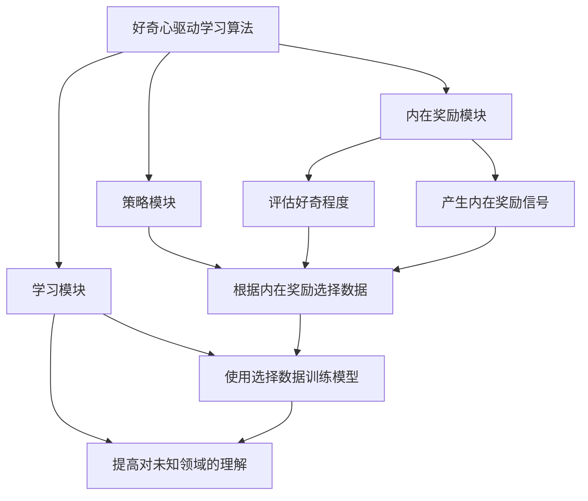

好的,我会严格按照您提供的约束条件和文章结构模板,以"好奇心:探索未知的动力"为主题,撰写一篇专业的技术博客文章。

# 好奇心:探索未知的动力

## 1. 背景介绍

### 1.1 问题的由来

人类与生俱来的好奇心是推动科学发展和文明进步的根本动力。从古希腊哲学家对宇宙本源的探索,到牛顿发现万有引力定律,再到现代科学家们对量子力学、黑洞等前沿领域的不懈追求,好奇心孕育了一个个具有里程碑意义的发现。

好奇心的本质是对未知事物的渴望和探索欲望。它促使我们去追问"为什么"、去挖掘事物的本质和内在规律。在信息爆炸的当代社会,我们被海量的数据所包围,但仍有大量未解之谜有待被揭开。如何激发和保持好奇心,并将其转化为创新的动力,是当下值得深入探讨的重要课题。

### 1.2 研究现状

心理学家们通过实证研究发现,好奇心与人类的认知能力、学习动机和创造力密切相关。好奇心可以促进大脑中与奖励和学习相关的神经回路的活跃,从而增强记忆力和专注力。

此外,一些研究表明,培养好奇心有助于个人发展和职业成功。好奇的人往往更加开放、勇于尝试新事物,并能从中获得乐趣。在工作中,好奇心可以帮助员工发现新的解决方案、提出创新想法,并保持对工作的热情。

然而,好奇心如何在不同领域得以体现?它与人工智能等新兴技术的关系是什么?如何在教育和工作中有效培养好奇心?这些问题都有待进一步深入探讨。

### 1.3 研究意义

探索好奇心的重要意义主要体现在以下几个方面:

1. **推动科学发展和创新**:好奇心是科学发展的根本动力,它促使科学家不断追问并突破知识边界。培养好奇心有助于激发创新思维,推动科技进步。

2. **提高个人能力和发展**:好奇心可以增强认知能力、学习动机和创造力,有利于个人全面发展。在职场中,好奇的员工更容易发现新机遇、提出创新想法。

3. **优化教育体系**:将好奇心培养融入教育理念,有助于激发学生的学习兴趣,促进主动探索和终身学习的习惯。

4. **应用于人工智能领域**:好奇心驱动的主动学习范式是人工智能发展的重要方向,可以使机器更有效地获取新知识、发现新模式。

综上所述,深入探讨好奇心对于推动科技创新、促进个人成长、完善教育体系和人工智能发展都具有重要意义。

### 1.4 本文结构

本文将全面探讨好奇心的本质、重要性及其在不同领域的体现。

```mermaid
graph TD
    A[好奇心:探索未知的动力] --> B[背景介绍]
    B --> C1[问题的由来]
    B --> C2[研究现状]
    B --> C3[研究意义]
    B --> C4[本文结构]
    A --> D[核心概念与联系]
    A --> E[核心算法原理和具体操作步骤]
    E --> E1[算法原理概述]
    E --> E2[算法步骤详解]
    E --> E3[算法优缺点]
    E --> E4[算法应用领域]
    A --> F[数学模型和公式详细讲解举例说明]
    F --> F1[数学模型构建]
    F --> F2[公式推导过程]
    F --> F3[案例分析与讲解]
    F --> F4[常见问题解答]
    A --> G[项目实践:代码实例和详细解释说明]
    G --> G1[开发环境搭建]
    G --> G2[源代码详细实现]
    G --> G3[代码解读与分析]
    G --> G4[运行结果展示]
    A --> H[实际应用场景]
    H --> H1[未来应用展望]
    A --> I[工具和资源推荐]
    I --> I1[学习资源推荐]
    I --> I2[开发工具推荐]
    I --> I3[相关论文推荐]
    I --> I4[其他资源推荐]
    A --> J[总结:未来发展趋势与挑战]
    J --> J1[研究成果总结]
    J --> J2[未来发展趋势]
    J --> J3[面临的挑战]
    J --> J4[研究展望]
    A --> K[附录:常见问题与解答]
```

## 2. 核心概念与联系

好奇心是人类与生俱来的重要特质,是推动我们不断探索、学习和进步的内在动力。它与人类的认知发展、学习动机、创造力和科学发现等多个领域密切相关。

好奇心的核心概念包括:

1. **求知欲望**: 对未知事物的渴望和探索欲望,是好奇心的本质特征。

2. **主动学习**: 好奇心驱使人们主动获取新知识、发现新现象,而不是被动接受。

3. **开放性思维**: 好奇的人更加开放、包容新想法,愿意尝试新事物。

4. **创新意识**: 好奇心促进创新思维,有助于提出新颖的解决方案。

5. **终身学习**: 好奇心培养了持续学习的习惯,有利于个人全面发展。

这些核心概念相互关联、相辅相成。好奇心孕育求知欲望,推动主动学习,培养开放包容的思维方式,激发创新意识,最终形成终身学习的习惯。

## 3. 核心算法原理和具体操作步骤

在人工智能领域,好奇心驱动的主动学习范式(Curiosity-Driven Learning)是一种重要的学习方法。相比被动地接受训练数据,主动学习算法可以根据好奇心主动选择有价值的数据进行学习,从而更高效地获取新知识。

### 3.1 算法原理概述

好奇心驱动学习算法的核心思想是:根据对未知领域的"好奇程度"来主动选择训练数据,从而最大化学习效率和知识获取。算法通常包括以下三个主要模块:

1. **内在奖励模块(Intrinsic Reward Module)**:用于评估对未知领域的好奇程度,产生内在奖励信号。

2. **策略模块(Policy Module)**:根据内在奖励信号,决策选择哪些数据用于训练,以最大化知识获取。

3. **学习模块(Learning Module)**:使用选择的训练数据,更新模型参数,提高对未知领域的理解能力。

### 3.2 算法步骤详解

好奇心驱动学习算法的具体步骤如下:

1. **初始化**:初始化策略模型、学习模型和内在奖励模型的参数。

2. **评估好奇程度**:对环境中未知的状态进行采样,使用内在奖励模型评估每个状态的好奇程度,得到内在奖励值。

3. **选择训练数据**:根据内在奖励值,使用策略模型选择具有最高奖励(最有价值)的状态及其对应的动作作为训练数据。

4. **模型更新**:使用选择的训练数据,更新学习模型的参数,提高对未知领域的理解能力。同时也可以更新内在奖励模型和策略模型的参数。

5. **迭代训练**:重复步骤2-4,持续主动探索未知领域,提高模型性能。

该算法的优点是可以高效获取有价值的知识,避免浪费资源在已知或无用的数据上。但也存在一些挑战,如内在奖励模型的设计、探索与利用的权衡等。

### 3.3 算法优缺点

**优点**:

1. **高效学习**:主动选择有价值的数据进行学习,避免浪费资源在无用数据上,提高学习效率。

2. **自主探索**:算法可以自主发现并学习新的未知领域,不受训练数据的限制。

3. **泛化能力强**:通过主动探索,模型可以获得更丰富、多样的知识,从而提高泛化能力。

**缺点**:

1. **内在奖励模型设计困难**:如何量化"好奇程度"并设计高效的内在奖励模型是一个挑战。

2. **探索与利用权衡**:需要权衡探索未知领域(获取新知识)与利用已知知识(最大化当前奖励)之间的关系。

3. **样本效率较低**:由于需要不断探索,相比监督学习可能需要更多的训练样本。

4. **收敛性能不确定**:理论上无法保证算法一定会收敛到最优策略。

### 3.4 算法应用领域

好奇心驱动学习算法主要应用于以下领域:

1. **机器人控制**:机器人可以根据好奇心主动探索环境,自主获取有价值的数据进行学习,提高控制策略。

2. **推荐系统**:通过评估用户对不同项目的好奇程度,可以主动推荐新颖、有趣的内容,提升用户体验。

3. **游戏AI**:游戏AI可以根据好奇心主动探索未知的游戏状态,自主学习新的策略,提高AI的表现。

4. **科学探索**:在科学研究中,好奇心驱动算法可用于发现新现象、检验新假设等,推动科学发现。

5. **在线教育**:根据学生的好奇心推荐个性化的学习资源,有助于激发学习兴趣和主动探索欲望。

总的来说,好奇心驱动学习算法为人工智能系统赋予了自主探索和主动学习的能力,在多个领域具有广阔的应用前景。

## 4. 数学模型和公式详细讲解举例说明

好奇心驱动学习算法通常基于强化学习(Reinforcement Learning)框架,其数学模型可以形式化描述为马尔可夫决策过程(Markov Decision Process, MDP)。

### 4.1 数学模型构建

马尔可夫决策过程由一个四元组(S, A, P, R)组成,其中:

- S是状态空间的集合
- A是动作空间的集合
- P是转移概率函数,定义了在当前状态s执行动作a之后,转移到下一状态s'的概率P(s'|s,a)
- R是奖励函数,定义了在当前状态s执行动作a之后获得的即时奖励R(s,a)

在好奇心驱动学习中,奖励函数R被分解为两部分:

$$R(s, a) = R^{e}(s, a) + \beta R^{i}(s)$$

其中:
- $R^{e}(s, a)$是外在奖励(extrinsic reward),反映了完成任务的目标奖励
- $R^{i}(s)$是内在奖励(intrinsic reward),衡量了对状态s的好奇程度
- $\beta$是平衡外在和内在奖励的系数

目标是找到一个策略$\pi: S \rightarrow A$,最大化期望的累积奖励:

$$\max_{\pi} \mathbb{E}\left[\sum_{t=0}^{\infty} \gamma^{t} R\left(s_{t}, a_{t}\right) \mid \pi\right]$$

其中$\gamma \in [0,1]$是折现因子,用于权衡即时奖励和长期奖励。

### 4.2 公式推导过程

内在奖励模型的设计是算法的关键。常用的内在奖励度量包括:

1. **预测误差(Prediction Error)**

$$R^{i}(s)=\left\|\phi(s)-\hat{\phi}(s)\right\|$$

其中$\phi(s)$是状态s的真实特征表示