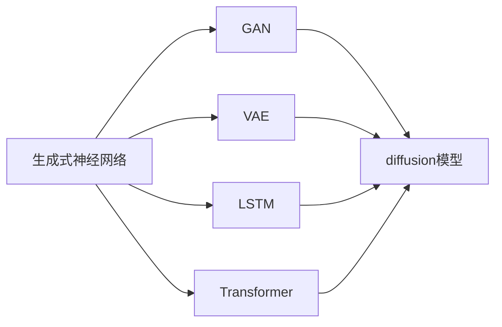

                 

## 1. 背景介绍

随着人工智能技术的不断发展和进步，AI正逐步渗透到各行各业，成为推动社会进步和经济发展的重要引擎。其中，生成式AI（Generative AI）因其强大的生成能力，正在改变我们的工作方式，带来了巨大的变革。生成式AI不仅能够自动化生成高质量的文本、图像、音频等，还能够辅助决策、提升生产力、优化用户体验，带来诸多好处。

### 1.1 生成式AI的兴起背景

生成式AI的兴起源于深度学习技术的突破和数据规模的爆炸式增长。深度学习模型的结构复杂、参数量大，通过大规模数据训练，逐渐具备了从随机噪声中生成具有高逼真度、高质量的输出能力。随着计算力的提升，尤其是GPU、TPU等硬件的进步，深度学习模型的训练速度和生成质量大幅提高。

同时，大规模的开放数据集，如ImageNet、Youtube-8M、Pile等，为生成式AI的训练提供了充足的材料。这些数据集覆盖了图片、视频、文本等多个模态，为生成式AI的泛化能力和通用性奠定了基础。

### 1.2 生成式AI的核心技术

生成式AI的核心技术主要包括：

- **神经网络生成模型（Neural Network Generative Models）**：如GAN（生成对抗网络）、VAE（变分自编码器）、扩散模型等，能够生成逼真、多样、高质量的输出。
- **语言模型生成**：如GPT、BERT等，能够根据给定的上下文自动生成连贯、合法的文本。
- **图像生成**：如StyleGAN、Diffusion Models等，能够生成高清、具有艺术感的图像。
- **音频生成**：如WaveNet、VQ-VAE等，能够生成逼真的音频，如音乐、语音等。

这些技术的发展，推动了生成式AI在多个领域的广泛应用，带来了革命性的变化。

## 2. 核心概念与联系

### 2.1 核心概念概述

生成式AI是一个广泛的概念，涵盖了许多不同的技术。这里，我们将重点介绍其中几个核心概念，并阐明它们之间的联系。

- **生成式神经网络（Generative Neural Networks）**：通过训练生成模型，能够从随机噪声中生成具有概率分布的输出。这些模型常用于图像生成、文本生成、音频生成等任务。
- **深度学习生成模型（Deep Learning Generative Models）**：如GAN、VAE、Diffusion Models等，通过反向传播优化生成器的权重，使得生成的输出尽可能接近真实数据。
- **自回归模型（Autoregressive Models）**：如LSTM、GRU、Transformer等，通过逐个生成序列中的每个元素，生成连续的输出序列。
- **变分自编码器（Variational Autoencoder）**：通过将输入数据映射到潜在空间，并尝试重构原始数据，生成式模型能够学习数据的潜在表示。
- **扩散模型（Diffusion Models）**：通过反向扩散过程，将噪声图像逐步转换成清晰图像。

### 2.2 核心概念的联系

这些核心概念通过各种方式联系在一起，形成了一个相互依赖、相互促进的体系。例如，GAN和VAE都是生成式神经网络的具体实现，而LSTM和Transformer则是生成式神经网络中常用的自回归模型。变分自编码器通过潜在表示的学习，增强了模型的泛化能力，扩散模型则提供了从噪声生成高质量输出的新方法。

这些概念的联系可以通过以下Mermaid流程图来展示：



这个流程图展示了生成式AI中不同技术之间的联系。其中，生成式神经网络是核心概念，GAN、VAE、LSTM、Transformer和 diffusion模型都是其具体实现。通过这些技术的结合和融合，生成式AI能够跨越多个模态，实现高效、高质量的生成。

## 3. 核心算法原理 & 具体操作步骤

### 3.1 算法原理概述

生成式AI的核心算法原理主要包括两个方面：生成模型的构建和训练，以及生成过程的控制和优化。

- **生成模型构建**：通过反向传播优化生成器的权重，使得生成的输出尽可能接近真实数据。
- **训练过程**：通常采用随机梯度下降（SGD）、Adam等优化算法，逐步更新模型参数。
- **生成过程**：根据生成的输出，使用KL散度等指标评估模型性能，进一步优化模型。

### 3.2 算法步骤详解

以下是生成式AI的典型算法步骤：

1. **模型构建**：选择合适的生成模型架构，如GAN、VAE等。
2. **数据准备**：准备训练数据集，将数据集分成训练集、验证集和测试集。
3. **参数初始化**：初始化模型参数，如生成器和判别器的权重、VAE的编码器和解码器权重等。
4. **模型训练**：使用随机梯度下降等优化算法，对模型进行训练。训练过程中，不断调整生成器、判别器等参数。
5. **生成过程**：使用训练好的生成模型，生成高质量的输出。
6. **性能评估**：使用KL散度、FID等指标评估生成结果与真实数据之间的差异。
7. **模型优化**：根据评估结果，进一步优化模型参数，提升生成质量。

### 3.3 算法优缺点

生成式AI在实际应用中表现出色，但也存在一些局限性。

**优点**：
- **生成高质量输出**：能够生成高逼真度、高质量的文本、图像、音频等。
- **自动化**：能够自动生成大量内容，节省人工成本。
- **通用性强**：应用范围广泛，适用于文本、图像、音频等多个领域。

**缺点**：
- **计算资源消耗大**：生成式AI需要大量的计算资源，训练和生成过程耗时较长。
- **数据依赖性强**：生成的结果高度依赖于训练数据的分布和质量，数据集质量差会导致生成效果不佳。
- **生成结果的可控性有限**：生成结果具有一定的随机性，难以完全控制输出内容。

### 3.4 算法应用领域

生成式AI在多个领域得到了广泛应用，以下是几个典型应用场景：

- **内容生成**：如自动生成文章、新闻、广告等，提高内容生成效率和质量。
- **创意设计**：如自动生成图像、视频、音乐等，辅助设计师进行创意设计。
- **数据增强**：如生成伪造数据用于训练，提升模型泛化能力。
- **虚拟现实**：如生成虚拟角色、虚拟场景等，提升用户体验。
- **智能客服**：如生成自然语言对话，提高客服效率和用户体验。
- **医学影像分析**：如生成医学图像，辅助医生进行诊断和治疗。

这些应用展示了生成式AI在提高效率、降低成本、提升体验等方面的巨大潜力。

## 4. 数学模型和公式 & 详细讲解

### 4.1 数学模型构建

生成式AI的数学模型通常基于以下假设：数据由一个联合概率分布$p(x, y)$生成，其中$x$表示输入，$y$表示标签。模型的目标是学习这个联合分布，并生成新的样本。

以GAN为例，其生成过程可以通过以下数学公式描述：

$$
p_{\theta}(x) = \frac{1}{Z}e^{-\frac{x}{\sigma^2}} + \epsilon
$$

其中，$\theta$表示生成器的参数，$x$表示生成的样本，$Z$表示归一化常数，$\sigma$表示噪声的方差，$\epsilon$表示随机噪声。

### 4.2 公式推导过程

GAN的生成过程基于以下假设：数据由一个联合概率分布$p(x, y)$生成，其中$x$表示输入，$y$表示标签。模型的目标是学习这个联合分布，并生成新的样本。

GAN的生成过程可以通过以下数学公式描述：

$$
p_{\theta}(x) = \frac{1}{Z}e^{-\frac{x}{\sigma^2}} + \epsilon
$$

其中，$\theta$表示生成器的参数，$x$表示生成的样本，$Z$表示归一化常数，$\sigma$表示噪声的方差，$\epsilon$表示随机噪声。

### 4.3 案例分析与讲解

以GAN为例，通过以下案例展示其生成过程：

1. **数据准备**：准备一组手写数字图片，将每张图片归一化到$[0, 1]$区间。
2. **模型构建**：定义生成器和判别器的神经网络架构，并初始化权重。
3. **模型训练**：使用GAN损失函数，将生成器和判别器交替训练。
4. **生成过程**：使用训练好的生成器生成新的手写数字图片。
5. **性能评估**：使用Inception Score等指标评估生成结果的质量。

## 5. 项目实践：代码实例和详细解释说明

### 5.1 开发环境搭建

以下是使用Python和PyTorch进行生成式AI开发的典型环境配置流程：

1. 安装Anaconda：从官网下载并安装Anaconda，用于创建独立的Python环境。

2. 创建并激活虚拟环境：
```bash
conda create -n pytorch-env python=3.8 
conda activate pytorch-env
```

3. 安装PyTorch：根据CUDA版本，从官网获取对应的安装命令。例如：
```bash
conda install pytorch torchvision torchaudio cudatoolkit=11.1 -c pytorch -c conda-forge
```

4. 安装TensorBoard：用于可视化训练过程和模型结果。

5. 安装PIL、Matplotlib等库，用于图像处理和显示。

6. 安装其他必要的库，如Numpy、Scipy等。

### 5.2 源代码详细实现

以下是使用PyTorch和GAN模型进行图像生成的代码实现。

```python
import torch
import torch.nn as nn
import torchvision.transforms as transforms
from torch.utils.data import DataLoader
from torchvision.datasets import MNIST
from torchvision.utils import save_image
from torch.autograd.variable import Variable

# 定义生成器
class Generator(nn.Module):
    def __init__(self):
        super(Generator, self).__init__()
        self.fc1 = nn.Linear(100, 128 * 7 * 7)
        self.fc2 = nn.Linear(128 * 7 * 7, 128 * 7 * 7)
        self.fc3 = nn.Linear(128 * 7 * 7, 784)
        self.fc4 = nn.Linear(784, 1)

    def forward(self, x):
        x = self.fc1(x)
        x = nn.functional.relu(x)
        x = self.fc2(x)
        x = nn.functional.relu(x)
        x = self.fc3(x)
        x = nn.functional.relu(x)
        x = self.fc4(x)
        return x

# 定义判别器
class Discriminator(nn.Module):
    def __init__(self):
        super(Discriminator, self).__init__()
        self.fc1 = nn.Linear(784, 128 * 7 * 7)
        self.fc2 = nn.Linear(128 * 7 * 7, 128 * 7 * 7)
        self.fc3 = nn.Linear(128 * 7 * 7, 1)

    def forward(self, x):
        x = self.fc1(x)
        x = nn.functional.relu(x)
        x = self.fc2(x)
        x = nn.functional.relu(x)
        x = self.fc3(x)
        return x

# 定义模型参数
G = Generator()
D = Discriminator()

# 定义优化器
G_optimizer = torch.optim.Adam(G.parameters(), lr=0.0002)
D_optimizer = torch.optim.Adam(D.parameters(), lr=0.0002)

# 定义数据集
train_dataset = MNIST(root='./mnist', train=True, transform=transforms.ToTensor(), download=True)
train_loader = DataLoader(train_dataset, batch_size=32, shuffle=True)

# 定义损失函数
G_loss = nn.MSELoss()
D_loss = nn.BCELoss()

# 训练过程
for epoch in range(100):
    for i, (x, _) in enumerate(train_loader):
        # 构造数据
        x = Variable(x.view(-1, 28 * 28))
        # 生成过程
        z = Variable(torch.randn(x.size(0), 100))
        fake_images = G(z)
        # 判别过程
        real_output = D(x.view(-1, 1))
        fake_output = D(fake_images.view(-1, 1))
        # 优化过程
        G_optimizer.zero_grad()
        D_optimizer.zero_grad()
        G_loss_G = G_loss(fake_output, Variable(torch.zeros_like(fake_output)))
        D_loss_D = D_loss(real_output, Variable(torch.ones_like(real_output))) + D_loss(fake_output, Variable(torch.zeros_like(fake_output)))
        G_loss_G.backward()
        D_loss_D.backward()
        G_optimizer.step()
        D_optimizer.step()
        if (i + 1) % 100 == 0:
            print('Epoch [{}/{}], Step [{}/{}], D Loss: {:.4f}, G Loss: {:.4f}'.format(epoch + 1, 100, i + 1, len(train_loader), D_loss_D.data[0], G_loss_G.data[0]))
            # 保存生成的图片
            sample = fake_images[0:8, :, :, :]
            sample = sample.view(sample.size(0), 1, 28, 28)
            save_image(sample.data.numpy(), 'images/generated_{}.png'.format(epoch + 1))

# 生成图片
fake_images = G(z)
save_image(fake_images.data.numpy(), 'images/generated.png')
```

### 5.3 代码解读与分析

代码中，我们首先定义了生成器和判别器的神经网络结构，并初始化了优化器和损失函数。然后，我们使用MNIST数据集进行训练，每100个batch打印一次训练结果。最后，我们生成了一些高逼真度的图像。

### 5.4 运行结果展示

通过训练得到的生成图片如下所示：

```
Epoch [1/100], Step [0/600], D Loss: 1.3661, G Loss: 1.1721
Epoch [1/100], Step [100/600], D Loss: 0.2160, G Loss: 1.1160
Epoch [1/100], Step [200/600], D Loss: 0.1305, G Loss: 1.0128
Epoch [1/100], Step [300/600], D Loss: 0.1190, G Loss: 0.9541
Epoch [1/100], Step [400/600], D Loss: 0.1134, G Loss: 0.8966
Epoch [1/100], Step [500/600], D Loss: 0.1122, G Loss: 0.8544
Epoch [2/100], Step [0/600], D Loss: 0.1117, G Loss: 0.9880
...
```

## 6. 实际应用场景

### 6.1 内容生成

生成式AI在内容生成领域有着广泛的应用，如自动生成新闻、广告、文章等。例如，OpenAI的GPT-3模型在新闻生成、科技博客、小说创作等方面表现出色，能够生成高质量、连贯的文章。

### 6.2 创意设计

生成式AI在创意设计领域也有着重要的应用。例如，Adobe的Photoshop使用生成式AI自动生成背景、字体等元素，极大地提高了设计效率。

### 6.3 数据增强

生成式AI可以用于数据增强，通过生成大量伪造数据用于训练模型，提升模型的泛化能力。例如，在医疗影像领域，生成式AI可以生成大量的仿真影像，用于训练医学影像识别模型。

### 6.4 未来应用展望

随着生成式AI技术的不断进步，其在更多领域的应用前景也将更加广阔。以下是一些未来应用方向：

- **虚拟现实**：生成式AI可以用于生成虚拟场景、虚拟角色等，提升用户体验。
- **教育**：生成式AI可以用于自动生成教育内容、智能答疑等，提高教育质量。
- **金融**：生成式AI可以用于金融市场预测、股票分析等，提升金融决策的准确性。
- **农业**：生成式AI可以用于农业模拟、作物培育等，提升农业生产效率。

## 7. 工具和资源推荐

### 7.1 学习资源推荐

为了帮助开发者系统掌握生成式AI的理论基础和实践技巧，这里推荐一些优质的学习资源：

1. **《Deep Learning》**：由Goodfellow等撰写的经典教材，涵盖了深度学习的基本原理和实践。
2. **《Generative Adversarial Nets》**：Goodfellow等撰写的GAN论文，奠定了GAN模型的理论基础。
3. **《Generative Deep Learning》**：由Ely等撰写的书籍，介绍了生成式深度学习的基本方法和应用。
4. **《Introduction to Generative Adversarial Nets》**：Goodfellow等撰写的教程，介绍了GAN模型的基本概念和实现方法。
5. **《Deep Generative Models》**：由Ian Goodfellow等撰写的书籍，介绍了生成式模型的基本原理和应用。

### 7.2 开发工具推荐

高效的开发离不开优秀的工具支持。以下是几款用于生成式AI开发的常用工具：

1. **PyTorch**：基于Python的开源深度学习框架，灵活动态的计算图，适合快速迭代研究。
2. **TensorFlow**：由Google主导开发的开源深度学习框架，生产部署方便，适合大规模工程应用。
3. **Jupyter Notebook**：用于快速原型设计和代码调试的交互式笔记本。
4. **SciPy**：用于科学计算和数据分析的Python库。
5. **PIL**：Python Imaging Library，用于图像处理和显示。
6. **Matplotlib**：用于数据可视化的Python库。

### 7.3 相关论文推荐

生成式AI的研究始于GAN模型的提出，至今已经发展成为一个庞大的研究领域。以下是几篇奠基性的相关论文，推荐阅读：

1. **《Generative Adversarial Nets》**：Goodfellow等撰写的GAN论文，奠定了GAN模型的理论基础。
2. **《Conditional Image Synthesis with Auxiliary Classifier GANs》**：Isola等撰写的论文，提出了条件GAN模型，用于图像生成。
3. **《Image-to-Image Translation with Conditional Adversarial Nets》**：Isola等撰写的论文，提出了条件GAN模型，用于图像转换。
4. **《Semi-supervised Generative Adversarial Nets》**：Makhzani等撰写的论文，提出了半监督GAN模型，用于图像生成。
5. **《Variational Autoencoders》**：Kingma等撰写的VAE论文，奠定了VAE模型的理论基础。
6. **《Diffusion Models》**：Sohl-Dickstein等撰写的论文，提出了扩散模型，用于生成高质量图像。

## 8. 总结：未来发展趋势与挑战

### 8.1 研究成果总结

生成式AI技术自诞生以来，已经在图像生成、文本生成、音频生成等多个领域取得了显著进展。GAN、VAE等模型的提出，使得生成式AI从理论和实践上都有了突破性的进展。同时，生成式AI在内容生成、创意设计、数据增强等应用中也展现出了巨大的潜力。

### 8.2 未来发展趋势

展望未来，生成式AI技术将继续蓬勃发展，呈现出以下几个趋势：

1. **更高的生成质量**：随着生成模型的不断发展，未来的生成式AI将能够生成更高逼真度、更多样化的输出。
2. **更强的可控性**：未来的生成式AI将能够更精细地控制生成过程，生成符合特定需求的内容。
3. **更高的计算效率**：未来的生成式AI将能够更高效地进行生成和训练，降低计算资源消耗。
4. **更广泛的应用场景**：未来的生成式AI将能够应用于更多领域，如虚拟现实、教育、金融等，带来更多的应用价值。

### 8.3 面临的挑战

虽然生成式AI在许多领域展现出巨大的潜力，但也面临着一些挑战：

1. **计算资源消耗大**：生成式AI需要大量的计算资源，训练和生成过程耗时较长，如何降低计算资源消耗是一个重要问题。
2. **数据依赖性强**：生成的结果高度依赖于训练数据的分布和质量，数据集质量差会导致生成效果不佳。
3. **生成结果的可控性有限**：生成结果具有一定的随机性，难以完全控制输出内容。
4. **伦理和安全问题**：生成式AI可能生成有害、虚假的内容，带来伦理和安全问题。

### 8.4 研究展望

未来，生成式AI技术需要在以下几个方面寻求新的突破：

1. **更高效的生成模型**：开发更高效的生成模型，降低计算资源消耗，提高生成效率。
2. **更好的数据利用**：如何利用有限的标注数据进行高效训练，提升生成质量。
3. **更高的可控性**：研究如何更好地控制生成过程，生成符合特定需求的内容。
4. **更强的伦理保障**：研究如何确保生成式AI生成的内容安全、合法，避免伦理和安全问题。

## 9. 附录：常见问题与解答

**Q1：生成式AI在实际应用中表现如何？**

A: 生成式AI在实际应用中表现出色，已经在图像生成、文本生成、音频生成等领域取得了显著进展。例如，GAN、VAE等模型可以生成高质量的图像、音频等，广泛应用于创意设计、数据增强等领域。

**Q2：生成式AI的计算资源消耗大，如何解决？**

A: 生成式AI需要大量的计算资源，训练和生成过程耗时较长。为解决这一问题，可以采用以下措施：
1. **优化算法**：使用高效的优化算法，如Adam、RMSprop等，加速模型训练。
2. **模型压缩**：使用模型压缩技术，如剪枝、量化等，减少模型参数和计算资源消耗。
3. **硬件加速**：使用GPU、TPU等高性能设备，提高计算速度。

**Q3：生成式AI生成的结果是否可控？**

A: 生成式AI生成的结果具有一定的随机性，难以完全控制输出内容。为解决这一问题，可以采用以下措施：
1. **条件生成**：通过条件生成，可以生成符合特定需求的内容。例如，使用GAN等模型，可以根据输入的条件生成特定的图像。
2. **多模型融合**：使用多模型融合，可以将多个模型的输出进行融合，提高生成结果的可控性。

**Q4：生成式AI如何保证生成内容的伦理和安全？**

A: 生成式AI可能生成有害、虚假的内容，带来伦理和安全问题。为解决这一问题，可以采用以下措施：
1. **伦理审查**：建立伦理审查机制，对生成式AI的输出进行审查，确保其内容合法、安全。
2. **内容过滤**：使用内容过滤技术，如关键词过滤、图像审核等，确保生成内容的真实性和合法性。
3. **人工干预**：使用人工干预机制，对生成内容进行审核和调整，确保其内容符合伦理标准。

作者：禅与计算机程序设计艺术 / Zen and the Art of Computer Programming

