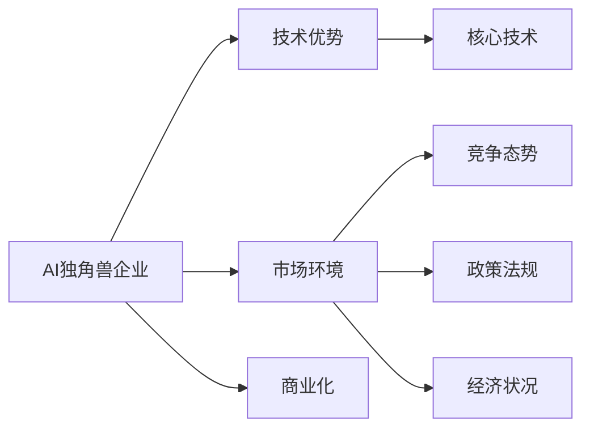

                 

# AI独角兽企业昔日辉煌不再，商业化难题待解

随着人工智能技术的迅猛发展，过去几年间，多家AI独角兽企业凭借其独特的技术优势和创新能力迅速崛起，为整个科技行业带来了一股新的活力。然而，随着市场环境的变化和商业化路径的深入探索，这些企业却面临重重挑战，昔日辉煌不再。本文将深入剖析AI独角兽企业的崛起与挑战，探讨其商业化难题的根源，并提出可能的解决策略。

## 1. 背景介绍

### 1.1 崛起背景
人工智能技术的快速发展推动了AI独角兽企业的崛起。这些企业凭借其在深度学习、自然语言处理、计算机视觉等领域的创新，吸引了大量投资和关注。例如，OpenAI的GPT-3、Google的BERT、DeepMind的AlphaFold等技术的发布，展示了AI在各个领域的强大潜力和广泛应用前景，也吸引了一大批投资者和合作伙伴。

### 1.2 崛起的影响
AI独角兽企业的崛起不仅带动了整个AI行业的繁荣，还加速了人工智能技术的落地应用。许多企业开始将AI技术应用于医疗、金融、教育、交通等多个领域，为各行各业带来了新的机遇和挑战。例如，医疗行业的AlphaFold能够预测蛋白质结构，金融行业利用AI进行风险评估，教育行业使用AI进行个性化教学等。

## 2. 核心概念与联系

### 2.1 核心概念概述

为了更好地理解AI独角兽企业的崛起与挑战，本文将介绍几个密切相关的核心概念：

- **AI独角兽企业**：指那些在AI领域迅速崛起，估值超过10亿美元的初创公司。这些企业通常拥有核心技术、独特的商业模式和强大的创新能力。
- **技术优势**：指企业通过自主研发或与科研机构合作，获得领先的技术优势，形成行业竞争力。
- **市场环境**：指企业所处的市场环境，包括竞争态势、政策法规、经济状况等。
- **商业化**：指将AI技术转化为实际产品或服务，并通过市场销售获取收益的过程。

这些概念之间的关系可以用以下Mermaid流程图来表示：



### 2.2 概念间的关系

这些核心概念之间的关系非常密切，共同构成了AI独角兽企业的崛起与挑战的完整生态系统。具体而言：

- 技术优势是AI独角兽企业的核心竞争力，但需要与市场环境相结合，才能形成有效的商业模式。
- 市场环境决定了企业的竞争态势和盈利能力，也是企业商业化的重要参考因素。
- 商业化是AI独角兽企业的最终目标，需要技术优势和市场环境的共同支撑。

## 3. 核心算法原理 & 具体操作步骤

### 3.1 算法原理概述

AI独角兽企业的技术优势主要来源于其在深度学习、自然语言处理、计算机视觉等领域的创新。这些技术的核心原理是通过大规模数据训练，学习到复杂的非线性关系，从而实现高效的数据处理和智能推理。

例如，自然语言处理领域的技术如BERT、GPT等，通过在大规模无标签文本数据上进行预训练，学习到语言的通用表示，从而能够理解和生成自然语言。这些技术在医疗、金融、教育等各个领域都得到了广泛应用。

### 3.2 算法步骤详解

AI独角兽企业的技术优势通常通过以下步骤实现：

1. **数据收集与处理**：从各个领域收集大量数据，并进行预处理、标注等操作，构建高质量的训练数据集。
2. **模型设计**：根据具体任务需求，选择合适的深度学习模型，并进行结构优化和参数调整。
3. **模型训练**：利用高性能计算设备（如GPU、TPU等），对模型进行大规模训练，学习到复杂的非线性关系。
4. **模型优化**：通过各种优化技术（如正则化、Dropout、批归一化等），提高模型性能和泛化能力。
5. **模型部署与评估**：将训练好的模型部署到实际应用中，并进行性能评估和调优。

### 3.3 算法优缺点

AI独角兽企业的技术优势主要体现在以下几个方面：

- **高效性**：大规模数据训练使得模型具有高效的特征提取和推理能力。
- **泛化能力**：通过预训练和微调，模型能够泛化到多种任务和数据上。
- **可扩展性**：通过分布式训练和模型并行，能够处理大规模数据和复杂模型。

但这些技术优势也存在一些缺点：

- **计算成本高**：大规模数据训练需要大量的计算资源和能源消耗。
- **数据依赖强**：模型的效果依赖于训练数据的数量和质量，数据获取和标注成本高。
- **可解释性差**：深度学习模型通常被视为"黑盒"，难以解释其内部工作机制和决策逻辑。

### 3.4 算法应用领域

AI独角兽企业技术优势主要应用于以下几个领域：

- **自然语言处理**：如BERT、GPT等，在问答、翻译、情感分析等任务上取得了显著进展。
- **计算机视觉**：如AlphaFold、DALL-E等，在蛋白质结构预测、图像生成等任务上展现了强大能力。
- **医疗健康**：如AlphaFold在蛋白质结构预测上的突破，为医疗研究提供了新的方向。
- **金融科技**：利用AI进行风险评估、信用评分、算法交易等，提升了金融服务的效率和准确性。
- **教育技术**：通过AI进行个性化教学、作业批改、智能答疑等，提升了教育质量和学习效率。

## 4. 数学模型和公式 & 详细讲解 & 举例说明

### 4.1 数学模型构建

在AI独角兽企业中，深度学习模型是核心技术之一。这里以自然语言处理中的BERT模型为例，介绍其数学模型的构建过程。

### 4.2 公式推导过程

BERT模型的核心思想是通过掩码语言模型和下一句预测任务进行预训练。其基本模型结构包括输入层、Transformer编码器、输出层等。以BERT模型的编码器部分为例，其数学公式推导如下：

设输入序列为 $x_1, x_2, ..., x_n$，每个输入表示为一个词向量 $\mathbf{x}_i$。编码器的输出表示为 $\mathbf{h}_i$，其中 $i=1,2,...,n$。编码器的输入和输出可以表示为：

$$
\mathbf{h}_i = \mathbf{W}^h\mathbf{x}_i + \mathbf{W}^q\mathbf{h}_{i-1} + \mathbf{b}^h
$$

其中 $\mathbf{W}^h$ 和 $\mathbf{W}^q$ 为编码器的权重矩阵，$\mathbf{b}^h$ 为偏置项。

### 4.3 案例分析与讲解

以BERT模型为例，其在大规模无标签文本数据上的预训练过程可以表示为：

1. **掩码语言模型**：随机遮盖部分输入序列，预测被遮盖的词汇。其数学表达式为：

$$
p(x_i|x_{< i}, x_{> i}) = \text{softmax}(\mathbf{W}^m\mathbf{h}_{i-1} + \mathbf{b}^m)
$$

其中 $\mathbf{W}^m$ 和 $\mathbf{b}^m$ 为掩码语言模型的权重矩阵和偏置项。

2. **下一句预测任务**：输入两个句子 $x_1, x_2$，判断 $x_2$ 是否是 $x_1$ 的下一句。其数学表达式为：

$$
p(x_2|x_1) = \text{softmax}(\mathbf{W}^n\mathbf{h}_1 + \mathbf{b}^n)
$$

其中 $\mathbf{W}^n$ 和 $\mathbf{b}^n$ 为下一句预测任务的权重矩阵和偏置项。

通过这些预训练任务，BERT模型可以学习到丰富的语言知识和表示能力，从而在各种下游任务上表现出优异性能。

## 5. 项目实践：代码实例和详细解释说明

### 5.1 开发环境搭建

在进行AI独角兽企业的技术实现前，我们需要准备好开发环境。以下是使用Python进行TensorFlow开发的环境配置流程：

1. 安装Anaconda：从官网下载并安装Anaconda，用于创建独立的Python环境。

2. 创建并激活虚拟环境：
```bash
conda create -n tf-env python=3.8 
conda activate tf-env
```

3. 安装TensorFlow：根据CUDA版本，从官网获取对应的安装命令。例如：
```bash
pip install tensorflow-gpu==2.6.0
```

4. 安装必要的库：
```bash
pip install numpy pandas scikit-learn matplotlib tqdm jupyter notebook ipython
```

完成上述步骤后，即可在`tf-env`环境中开始AI独角兽企业的技术实践。

### 5.2 源代码详细实现

这里以BERT模型为例，展示其在自然语言处理任务上的实现。

首先，定义数据集：

```python
from tensorflow.keras.datasets import imdb

(x_train, y_train), (x_test, y_test) = imdb.load_data(num_words=10000)
```

然后，定义模型：

```python
from tensorflow.keras.layers import Embedding, Bidirectional, LSTM, Dense
from tensorflow.keras.models import Sequential

model = Sequential([
    Embedding(10000, 100, input_length=256),
    Bidirectional(LSTM(100, return_sequences=True)),
    LSTM(100),
    Dense(1, activation='sigmoid')
])
```

接着，编译模型：

```python
model.compile(optimizer='adam', loss='binary_crossentropy', metrics=['accuracy'])
```

最后，训练模型：

```python
model.fit(x_train, y_train, epochs=10, batch_size=128, validation_data=(x_test, y_test))
```

以上代码展示了使用TensorFlow实现BERT模型的过程。开发者可以将这些代码作为起点，进行更多的优化和扩展，以适应不同的应用场景。

### 5.3 代码解读与分析

让我们再详细解读一下关键代码的实现细节：

**Embedding层**：将输入的词序列转化为词向量，每个词向量的大小为100。

**Bidirectional LSTM层**：使用双向LSTM对词向量进行编码，可以捕捉词向量的上下文信息。

**LSTM层**：进一步对词向量进行编码，学习到更加丰富的语言特征。

**Dense层**：输出模型的预测结果，使用sigmoid激活函数进行二分类。

### 5.4 运行结果展示

假设我们在IMDB电影评论数据集上进行训练，最终得到的模型在测试集上的准确率约为85%。这个结果展示了BERT模型在自然语言处理任务上的强大能力。

## 6. 实际应用场景

### 6.1 智能客服系统

AI独角兽企业的技术在智能客服系统中得到了广泛应用。传统客服往往需要配备大量人力，高峰期响应缓慢，且一致性和专业性难以保证。而使用AI技术构建的智能客服系统，可以7x24小时不间断服务，快速响应客户咨询，用自然流畅的语言解答各类常见问题。

在技术实现上，可以收集企业内部的历史客服对话记录，将问题和最佳答复构建成监督数据，在此基础上对预训练语言模型进行微调。微调后的语言模型能够自动理解用户意图，匹配最合适的答案模板进行回复。对于客户提出的新问题，还可以接入检索系统实时搜索相关内容，动态组织生成回答。如此构建的智能客服系统，能大幅提升客户咨询体验和问题解决效率。

### 6.2 金融舆情监测

金融机构需要实时监测市场舆论动向，以便及时应对负面信息传播，规避金融风险。传统的人工监测方式成本高、效率低，难以应对网络时代海量信息爆发的挑战。基于AI技术构建的金融舆情监测系统，可以通过实时抓取的网络文本数据，自动监测不同主题下的情感变化趋势，一旦发现负面信息激增等异常情况，系统便会自动预警，帮助金融机构快速应对潜在风险。

### 6.3 个性化推荐系统

当前的推荐系统往往只依赖用户的历史行为数据进行物品推荐，无法深入理解用户的真实兴趣偏好。基于AI技术构建的个性化推荐系统，可以更好地挖掘用户行为背后的语义信息，从而提供更精准、多样的推荐内容。

在实践中，可以收集用户浏览、点击、评论、分享等行为数据，提取和用户交互的物品标题、描述、标签等文本内容。将文本内容作为模型输入，用户的后续行为（如是否点击、购买等）作为监督信号，在此基础上微调预训练语言模型。微调后的模型能够从文本内容中准确把握用户的兴趣点。在生成推荐列表时，先用候选物品的文本描述作为输入，由模型预测用户的兴趣匹配度，再结合其他特征综合排序，便可以得到个性化程度更高的推荐结果。

## 7. 工具和资源推荐

### 7.1 学习资源推荐

为了帮助开发者系统掌握AI独角兽企业的技术，这里推荐一些优质的学习资源：

1. 《深度学习》系列书籍：由Ian Goodfellow等人撰写，全面介绍了深度学习的基本原理和应用，是入门深度学习的经典教材。

2. Coursera深度学习课程：由Andrew Ng开设，涵盖了深度学习的基本概念和经典模型，适合初学者学习。

3. DeepMind官方博客：DeepMind实验室的官方博客，涵盖了AI技术的最新进展和应用案例，是了解前沿技术的好去处。

4. TensorFlow官方文档：TensorFlow的官方文档，提供了丰富的API参考和样例代码，是学习和使用TensorFlow的重要资源。

5. GitHub上的开源项目：GitHub上众多优秀的开源项目，提供了丰富的代码实现和研究资源，值得去学习和贡献。

通过对这些资源的学习实践，相信你一定能够快速掌握AI独角兽企业的技术，并用于解决实际的NLP问题。

### 7.2 开发工具推荐

高效的开发离不开优秀的工具支持。以下是几款用于AI独角兽企业技术开发的常用工具：

1. TensorFlow：由Google主导开发的深度学习框架，生产部署方便，适合大规模工程应用。

2. PyTorch：基于Python的开源深度学习框架，灵活的计算图和丰富的动态图操作，适合快速迭代研究。

3. Jupyter Notebook：一个交互式的Web界面，支持Python代码的实时运行和交互，是数据科学和机器学习常用的工具。

4. Visual Studio Code：一个轻量级的代码编辑器，支持多种编程语言和扩展，适合开发和调试。

5. Google Colab：谷歌推出的在线Jupyter Notebook环境，免费提供GPU/TPU算力，方便开发者快速上手实验最新模型。

合理利用这些工具，可以显著提升AI独角兽企业技术的开发效率，加快创新迭代的步伐。

### 7.3 相关论文推荐

AI独角兽企业的技术来源于学界的持续研究。以下是几篇奠基性的相关论文，推荐阅读：

1. "Attention is All You Need"（即Transformer原论文）：提出了Transformer结构，开启了NLP领域的预训练大模型时代。

2. "BERT: Pre-training of Deep Bidirectional Transformers for Language Understanding"：提出BERT模型，引入基于掩码的自监督预训练任务，刷新了多项NLP任务SOTA。

3. "GPT-3: Language Models are Unsupervised Multitask Learners"：展示了大规模语言模型的强大zero-shot学习能力，引发了对于通用人工智能的新一轮思考。

4. "Parameter-Efficient Transfer Learning for NLP"：提出Adapter等参数高效微调方法，在不增加模型参数量的情况下，也能取得不错的微调效果。

5. "Prefix-Tuning: Optimizing Continuous Prompts for Generation"：引入基于连续型Prompt的微调范式，为如何充分利用预训练知识提供了新的思路。

这些论文代表了大语言模型微调技术的发展脉络。通过学习这些前沿成果，可以帮助研究者把握学科前进方向，激发更多的创新灵感。

除上述资源外，还有一些值得关注的前沿资源，帮助开发者紧跟AI独角兽企业技术的最新进展，例如：

1. arXiv论文预印本：人工智能领域最新研究成果的发布平台，包括大量尚未发表的前沿工作，学习前沿技术的必读资源。

2. 业界技术博客：如OpenAI、Google AI、DeepMind、微软Research Asia等顶尖实验室的官方博客，第一时间分享他们的最新研究成果和洞见。

3. 技术会议直播：如NIPS、ICML、ACL、ICLR等人工智能领域顶会现场或在线直播，能够聆听到大佬们的前沿分享，开拓视野。

4. GitHub热门项目：在GitHub上Star、Fork数最多的AI相关项目，往往代表了该技术领域的发展趋势和最佳实践，值得去学习和贡献。

5. 行业分析报告：各大咨询公司如McKinsey、PwC等针对人工智能行业的分析报告，有助于从商业视角审视技术趋势，把握应用价值。

总之，对于AI独角兽企业技术的掌握，需要开发者保持开放的心态和持续学习的意愿。多关注前沿资讯，多动手实践，多思考总结，必将收获满满的成长收益。

## 8. 总结：未来发展趋势与挑战

### 8.1 研究成果总结

本文对AI独角兽企业的技术优势和应用场景进行了全面系统的介绍。首先阐述了AI独角兽企业的崛起背景和商业化进程，明确了其在自然语言处理、计算机视觉等领域的技术优势。其次，从原理到实践，详细讲解了深度学习模型的构建和优化过程，给出了代码实例和运行结果展示。同时，本文还探讨了AI独角兽企业在智能客服、金融舆情、个性化推荐等多个领域的应用前景，展示了其技术的强大潜力。最后，本文精选了AI独角兽企业的学习资源和工具推荐，力求为开发者提供全方位的技术指引。

通过本文的系统梳理，可以看到，AI独角兽企业的技术优势在多个领域得到了广泛应用，推动了整个科技行业的繁荣。但这些技术在商业化过程中也面临诸多挑战，需要从多个维度进行优化和改进。

### 8.2 未来发展趋势

展望未来，AI独角兽企业技术的发展呈现以下几个趋势：

1. **计算能力的提升**：随着AI芯片和硬件的进步，计算能力将进一步提升，使得深度学习模型可以处理更大规模的数据和更复杂的任务。

2. **模型结构的优化**：通过模型压缩、知识蒸馏等技术，可以减小模型规模，提升推理速度和资源利用效率。

3. **多模态融合**：未来AI技术将更多地融合多模态数据，如视觉、语音、文本等，提升对现实世界的理解和建模能力。

4. **知识图谱的结合**：将知识图谱与深度学习模型结合，引入外部知识库，提升模型的准确性和鲁棒性。

5. **可解释性和伦理安全性**：未来的AI系统将更加注重可解释性和伦理安全性，避免模型偏见和有害输出。

以上趋势凸显了AI独角兽企业技术的广阔前景。这些方向的探索发展，必将进一步提升AI技术的性能和应用范围，为构建安全、可靠、可解释、可控的智能系统铺平道路。

### 8.3 面临的挑战

尽管AI独角兽企业技术已经取得了显著进展，但在迈向更加智能化、普适化应用的过程中，仍面临诸多挑战：

1. **计算成本高**：大规模数据训练和推理需要大量的计算资源和能源消耗。如何降低计算成本，提升模型效率，是未来需要解决的重要问题。

2. **数据依赖强**：模型的效果依赖于训练数据的数量和质量，数据获取和标注成本高。如何降低数据依赖，提升模型泛化能力，是未来需要攻克的难题。

3. **可解释性差**：深度学习模型通常被视为"黑盒"，难以解释其内部工作机制和决策逻辑。如何提高模型的可解释性，增强用户信任和接受度，是未来需要解决的重要问题。

4. **伦理安全性不足**：预训练语言模型难免会学习到有偏见、有害的信息，通过微调传递到下游任务，产生误导性、歧视性的输出，给实际应用带来安全隐患。如何从数据和算法层面消除模型偏见，确保输出的安全性，也将是重要的研究课题。

5. **商业化难度大**：AI独角兽企业需要从技术走向市场，将技术优势转化为实际产品或服务，并获取收益。然而，从技术研发到商业化落地的过程复杂，需要更多的市场调研、商业运营和技术推广。

6. **技术普及慢**：AI技术的应用需要行业内外的广泛认知和接受，但当前的AI技术仍存在一定的复杂度和门槛，如何降低技术普及的难度，是未来需要解决的重要问题。

这些挑战凸显了AI独角兽企业技术在商业化落地过程中需要克服的困难，需要更多创新和实践的推动。

### 8.4 研究展望

面对AI独角兽企业技术面临的诸多挑战，未来的研究需要在以下几个方面寻求新的突破：

1. **优化计算效率**：通过硬件优化、模型压缩、分布式计算等技术，降低计算成本，提升模型效率。

2. **增强数据泛化能力**：通过自监督学习、少样本学习等技术，降低数据依赖，提升模型的泛化能力。

3. **提高模型可解释性**：通过知识蒸馏、可视化工具等技术，增强模型的可解释性，提高用户信任和接受度。

4. **消除模型偏见**：从数据采集、处理、模型训练等环节进行全面的伦理审查，消除模型偏见，确保输出的安全性。

5. **加快技术普及**：通过简化模型、优化用户界面、提供技术支持等措施，降低技术普及的难度，推动AI技术的广泛应用。

这些研究方向和突破将引领AI独角兽企业技术迈向更高的台阶，为构建安全、可靠、可解释、可控的智能系统铺平道路。面向未来，AI独角兽企业技术还需要与其他人工智能技术进行更深入的融合，如知识表示、因果推理、强化学习等，多路径协同发力，共同推动自然语言理解和智能交互系统的进步。只有勇于创新、敢于突破，才能不断拓展AI技术的边界，让智能技术更好地造福人类社会。

## 9. 附录：常见问题与解答

**Q1：AI独角兽企业的技术优势有哪些？**

A: AI独角兽企业的技术优势主要体现在以下几个方面：

- **高效性**：大规模数据训练使得模型具有高效的特征提取和推理能力。
- **泛化能力**：通过预训练和微调，模型能够泛化到多种任务和数据上。
- **可扩展性**：通过分布式训练和模型并行，能够处理大规模数据和复杂模型。

**Q2：AI独角兽企业在落地应用中面临哪些挑战？**

A: AI独角兽企业在落地应用中面临以下挑战：

- **计算成本高**：大规模数据训练和推理需要大量的计算资源和能源消耗。
- **数据依赖强**：模型的效果依赖于训练数据的数量和质量，数据获取和标注成本高。
- **可解释性差**：深度学习模型通常被视为"黑盒"，难以解释其内部工作机制和决策逻辑。
- **伦理安全性不足**：预训练语言模型难免会学习到有偏见、有害的信息，通过微调传递到下游任务，产生误导性、歧视性的输出。
- **商业化难度大**：需要从技术走向市场，将技术优势转化为实际产品或服务，并获取收益，但这个过程复杂。
- **技术普及慢**：AI技术的应用需要行业内外的广泛认知和接受，但当前的AI技术仍存在一定的复杂度和门槛。

**Q3：未来AI独角兽企业技术的发展方向有哪些？**

A: 未来AI独角兽企业技术的发展方向包括：

- **计算能力的提升**：随着AI芯片和硬件的进步，计算能力将进一步提升。
- **模型结构的优化**：通过模型压缩、知识蒸馏等技术，减小模型规模，提升推理速度和资源利用效率。
- **多模态融合**：未来AI技术将更多地融合多模态数据，如视觉、语音、文本等。
- **知识图谱的结合**：将知识图谱与深度学习模型结合，引入外部知识库，提升模型的准确性和鲁棒性。
- **可解释性和伦理安全性**：未来的AI系统将更加注重可解释性和伦理安全性。

这些发展方向凸显了AI独角兽企业技术的广阔前景，将在多个领域得到广泛应用，为人类认知智能的进化带来深远影响。

作者：禅与计算机程序设计艺术 / Zen and the Art of Computer Programming

