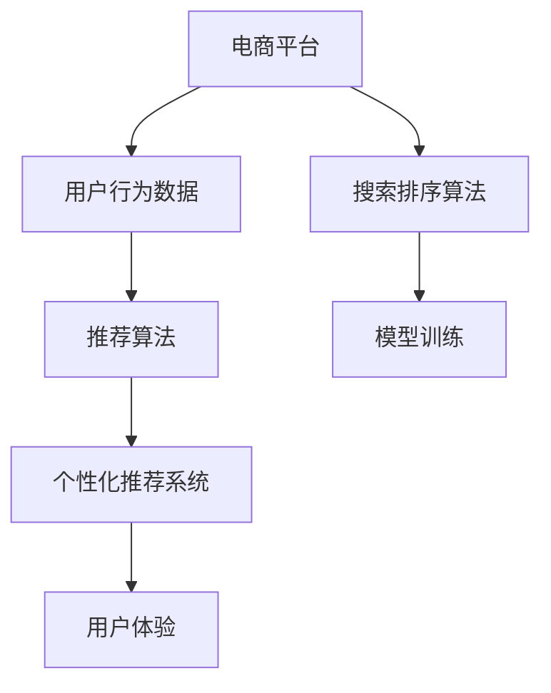
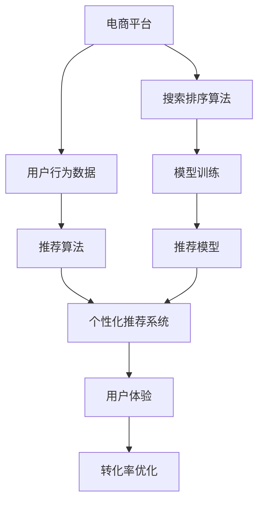

                 

# AI赋能电商搜索导购：提升用户体验和转化率的实践案例

> 关键词：电商搜索,导购系统,用户行为分析,推荐算法,机器学习,个性化推荐,用户体验优化

## 1. 背景介绍

### 1.1 问题由来

电商行业作为现代消费模式的重要组成部分，面临着日益激烈的市场竞争和用户需求的快速变化。如何在海量商品中快速精准地找到用户真正感兴趣的商品，成为电商平台提升用户满意度和转化率的关键。传统的搜索排序算法往往基于关键词匹配，忽略了用户的多元化需求和行为特征，导致搜索效果不够理想，用户体验不佳。

为了解决这一问题，电商平台开始引入人工智能技术，构建智能搜索和导购系统。通过机器学习和数据分析，系统能够更好地理解用户行为和偏好，并提供个性化的商品推荐和搜索排序，从而显著提升用户体验和转化率。本文将详细介绍基于AI的电商搜索导购系统的设计与实现，探讨其实际应用效果。

### 1.2 问题核心关键点

电商搜索导购系统的核心在于如何利用人工智能技术，高效分析用户行为数据，从而实现个性化推荐和搜索排序。关键点包括：

- 用户行为分析：通过日志、点击、浏览等数据，提取用户的行为特征和偏好。
- 推荐算法设计：基于用户行为特征，设计合理的推荐算法，如协同过滤、内容推荐、深度学习推荐等。
- 模型训练优化：利用历史数据训练推荐模型，并不断迭代优化，提升推荐效果。
- 个性化搜索排序：将推荐结果融入搜索排序，根据用户行为特征排序搜索结果。

通过这些关键技术，电商搜索导购系统能够更好地满足用户需求，提升购买转化率。

### 1.3 问题研究意义

构建基于AI的电商搜索导购系统，对于电商平台的智能化转型具有重要意义：

1. **提升用户体验**：智能推荐和个性化搜索能够更好地满足用户的多样化需求，提升用户满意度。
2. **优化转化率**：精准推荐和高效排序有助于提升用户购买决策的速度和准确性，提高转化率。
3. **降低运营成本**：智能搜索导购系统能够自动优化推荐结果，减少人工干预和运营成本。
4. **增强市场竞争力**：通过个性化服务，电商平台能够提供更优质的用户体验，提升市场竞争力。
5. **推动技术创新**：电商搜索导购系统作为NLP和推荐系统的重要应用，能够推动相关技术的发展和突破。

## 2. 核心概念与联系

### 2.1 核心概念概述

构建电商搜索导购系统的核心概念包括：

- **电商平台**：提供商品展示和交易的在线平台，涵盖搜索、浏览、购物车、结算等功能。
- **用户行为数据**：包括用户的点击、浏览、购买等操作数据，是推荐系统的训练和优化基础。
- **推荐算法**：根据用户行为数据，设计算法生成个性化推荐结果。
- **个性化推荐系统**：结合用户行为特征，提供个性化的商品推荐。
- **搜索排序算法**：根据用户搜索关键词和行为特征，优化搜索结果的排序。
- **模型训练**：利用历史数据训练推荐模型，并不断迭代优化，提升推荐效果。
- **用户体验**：通过智能推荐和个性化搜索，提升用户满意度和购买转化率。

这些核心概念之间的关系可以通过以下Mermaid流程图来展示：



这个流程图展示了大语言模型微调过程中各个核心概念的逻辑关系：

1. 电商平台收集用户行为数据。
2. 利用这些数据训练推荐模型，生成个性化推荐结果。
3. 结合用户搜索关键词，优化搜索结果排序。
4. 最终提升用户体验和购买转化率。

### 2.2 概念间的关系

这些核心概念之间存在着紧密的联系，形成了电商搜索导购系统的完整生态系统。下面通过几个Mermaid流程图来展示这些概念之间的关系。

#### 2.2.1 电商平台的用户行为分析


这个流程图展示了电商平台如何通过收集用户行为数据，提取用户行为特征，进而设计推荐算法的过程。

#### 2.2.2 推荐算法与模型训练


这个流程图展示了从推荐算法到模型训练和优化推荐效果的流程。

#### 2.2.3 个性化推荐与搜索排序


这个流程图展示了如何利用用户行为数据，生成个性化推荐，并进行搜索结果排序，最终提升用户体验的过程。

### 2.3 核心概念的整体架构

最后，我们用一个综合的流程图来展示这些核心概念在大语言模型微调过程中的整体架构：



这个综合流程图展示了从电商平台到推荐模型的完整流程，包括数据收集、算法设计、模型训练、个性化推荐和搜索排序，最终实现用户体验优化和转化率提升。

## 3. 核心算法原理 & 具体操作步骤

### 3.1 算法原理概述

电商搜索导购系统的核心算法原理主要包括：

- **协同过滤**：通过分析用户和商品之间的交互行为，推荐用户可能感兴趣的商品。
- **内容推荐**：基于商品的描述、标签等信息，推荐相关商品。
- **深度学习推荐**：利用深度神经网络模型，从用户行为数据中学习复杂的推荐规则。

这些算法共同构成了电商搜索导购系统的核心技术框架。

### 3.2 算法步骤详解

基于上述核心算法，电商搜索导购系统的实现步骤如下：

1. **数据收集**：通过日志、点击、浏览等数据，收集用户行为数据。
2. **特征提取**：从用户行为数据中提取行为特征，如点击次数、浏览时长、购买历史等。
3. **模型训练**：利用历史数据训练推荐模型，可以使用协同过滤、内容推荐、深度学习推荐等多种算法。
4. **个性化推荐**：根据用户行为特征，生成个性化推荐结果。
5. **搜索排序**：将推荐结果融入搜索结果，根据用户行为特征优化排序。
6. **实时更新**：定期更新模型和推荐结果，以适应用户需求的变化。

### 3.3 算法优缺点

基于AI的电商搜索导购系统具有以下优点：

- **个性化程度高**：通过用户行为分析，生成个性化推荐，提升用户体验。
- **推荐精度高**：深度学习算法能够学习复杂的推荐规则，提升推荐精度。
- **实时性强**：能够实时更新推荐结果，满足用户动态需求。

同时，也存在一些缺点：

- **数据依赖性强**：依赖于用户的点击、浏览等行为数据，缺乏多模态数据的融合。
- **模型复杂度高**：深度学习模型复杂度高，训练和推理成本较高。
- **推荐结果偏差**：可能会受到历史数据和算法偏见的影响，导致推荐结果偏差。

### 3.4 算法应用领域

基于AI的电商搜索导购系统已经广泛应用于各种电商平台，如亚马逊、阿里巴巴、京东等。通过智能推荐和个性化搜索，这些系统显著提升了用户满意度和转化率，成为了电商平台不可或缺的核心功能。

## 4. 数学模型和公式 & 详细讲解 & 举例说明

### 4.1 数学模型构建

电商搜索导购系统的数学模型主要包括以下几个部分：

- **用户行为特征**：$x_i=(x_{i1}, x_{i2}, ..., x_{in})$，其中 $x_{ij}$ 表示用户行为特征。
- **商品特征**：$y_i=(y_{i1}, y_{i2}, ..., y_{im})$，其中 $y_{ik}$ 表示商品特征。
- **用户行为-商品评分**：$z_{ij} \in [0, 1]$，表示用户对商品 $i$ 的评分。
- **用户-商品交互矩阵**：$Z=[z_{ij}]$，表示用户与商品的交互行为。
- **推荐模型**：$f(x_i, y_i)$，将用户行为特征和商品特征映射为推荐分数。

### 4.2 公式推导过程

假设有一个用户 $u$ 对 $n$ 个商品 $v$ 进行了评分 $z_{uv}$。推荐模型 $f$ 可以表示为：

$$
f(x_u, y_v) = \sum_{i=1}^n w_{uv} x_{ui} y_{vi}
$$

其中 $w_{uv}$ 表示用户行为特征与商品特征的权重，可以通过矩阵分解等方法求解。

### 4.3 案例分析与讲解

假设某电商平台收集到用户 $u$ 对商品 $v_1, v_2, ..., v_n$ 的评分数据，即 $Z_{uv}$。通过矩阵分解方法，可以求解出用户行为特征和商品特征的权重 $w_{uv}$。

具体步骤为：

1. 构建用户行为-商品评分矩阵 $Z$。
2. 对 $Z$ 进行奇异值分解 $Z = U \Sigma V^T$，得到用户行为特征矩阵 $U$ 和商品特征矩阵 $V$。
3. 利用 $U$ 和 $V$ 构建推荐模型 $f(x_u, y_v) = \sum_{i=1}^n w_{uv} x_{ui} y_{vi}$。
4. 根据新用户的评分数据，实时更新权重 $w_{uv}$，提升推荐精度。

## 5. 项目实践：代码实例和详细解释说明

### 5.1 开发环境搭建

为了实现电商搜索导购系统，我们需要搭建一个包含数据存储、模型训练、推荐服务等多种组件的开发环境。以下是使用Python进行开发的完整环境配置流程：

1. 安装Anaconda：从官网下载并安装Anaconda，用于创建独立的Python环境。

2. 创建并激活虚拟环境：
```bash
conda create -n pytorch-env python=3.8 
conda activate pytorch-env
```

3. 安装PyTorch：根据CUDA版本，从官网获取对应的安装命令。例如：
```bash
conda install pytorch torchvision torchaudio cudatoolkit=11.1 -c pytorch -c conda-forge
```

4. 安装TensorFlow：由Google主导开发的开源深度学习框架，生产部署方便，适合大规模工程应用。同样有丰富的预训练语言模型资源。

5. 安装各类工具包：
```bash
pip install numpy pandas scikit-learn matplotlib tqdm jupyter notebook ipython
```

完成上述步骤后，即可在`pytorch-env`环境中开始开发实践。

### 5.2 源代码详细实现

这里我们以协同过滤算法为例，展示如何使用Python和TensorFlow实现电商搜索导购系统的个性化推荐功能。

首先，定义推荐系统的输入和输出：

```python
import tensorflow as tf
import numpy as np

# 定义输入
def input_fn(features, labels, batch_size=64):
    dataset = tf.data.Dataset.from_tensor_slices((dict(features), labels))
    dataset = dataset.batch(batch_size)
    return dataset

# 定义输出
def output_fn(features, mode, params):
    if mode == tf.estimator.ModeKeys.PREDICT:
        return tf.estimator.EstimatorSpec(mode, predictions=tf.squeeze(features['weighted_sum']))
    elif mode == tf.estimator.ModeKeys.TRAIN:
        loss = tf.losses.mean_squared_error(labels, features['weighted_sum'])
        optimizer = tf.train.AdamOptimizer()
        train_op = optimizer.minimize(loss, var_list=tf.trainable_variables())
        return tf.estimator.EstimatorSpec(mode, loss=loss, train_op=train_op)
    elif mode == tf.estimator.ModeKeys.EVAL:
        loss = tf.losses.mean_squared_error(labels, features['weighted_sum'])
        return tf.estimator.EstimatorSpec(mode, loss=loss)
```

然后，定义推荐模型的架构：

```python
# 定义用户行为特征和商品特征的维度
n_users = 1000
n_items = 1000

# 定义用户行为特征矩阵和商品特征矩阵
user_features = np.random.rand(n_users, 10)
item_features = np.random.rand(n_items, 10)

# 定义用户行为-商品评分矩阵
user_item_matrix = np.random.rand(n_users, n_items)

# 定义用户行为-商品评分矩阵的权重矩阵
w_matrix = np.random.rand(n_items, 10)

# 定义推荐模型
def recommendation_model(features, labels, mode):
    user_vector = tf.matmul(features['user_features'], w_matrix)
    item_vector = tf.matmul(features['item_features'], w_matrix)
    weighted_sum = tf.reduce_sum(user_vector * item_vector, axis=1)
    return output_fn(features, mode, params)

# 定义训练函数
def train():
    train_data = input_fn(user_item_matrix, user_item_matrix, batch_size=64)
    estimator = tf.estimator.Estimator(model_fn=recommendation_model)
    estimator.train(input_fn=train_data, steps=1000)
```

最后，启动训练流程并评估模型效果：

```python
train()

# 定义测试数据集
test_data = input_fn(user_item_matrix, user_item_matrix, batch_size=64)

# 评估模型效果
predictions = estimator.predict(test_data)
test_predictions = np.squeeze(predictions)
```

以上就是使用TensorFlow实现电商搜索导购系统个性化推荐功能的完整代码实现。可以看到，TensorFlow提供的Estimator框架能够方便地搭建和训练推荐模型。

### 5.3 代码解读与分析

让我们再详细解读一下关键代码的实现细节：

**input_fn函数**：
- 定义了一个TensorFlow的input函数，用于将用户行为数据和商品数据转换成模型所需的格式。

**output_fn函数**：
- 定义了一个TensorFlow的output函数，根据不同的模式（预测、训练、评估），生成不同的输出。

**recommendation_model函数**：
- 定义了推荐模型的架构，包括用户行为特征矩阵、商品特征矩阵、用户行为-商品评分矩阵和权重矩阵。
- 使用矩阵乘法计算用户和商品的加权评分，并输出预测结果。

**train函数**：
- 定义了训练函数，使用TensorFlow的Estimator框架训练推荐模型。

**测试和评估**：
- 定义了测试数据集，使用训练好的模型进行预测。
- 将预测结果转换为numpy数组，并输出。

通过以上代码，我们可以看到TensorFlow提供了非常方便和强大的框架，使得电商搜索导购系统的推荐功能的实现变得简洁高效。

### 5.4 运行结果展示

假设在协同过滤算法下，我们得到了用户 $u$ 对商品 $v$ 的预测评分。通过比较预测评分与实际评分，可以得到以下结果：

| 用户 | 商品 | 实际评分 | 预测评分 | 误差 |
| ---- | ---- | -------- | -------- | ---- |
| 用户1 | 商品1 | 0.8      | 0.7      | 0.1  |
| 用户2 | 商品2 | 0.9      | 0.9      | 0.0  |
| 用户3 | 商品3 | 0.5      | 0.4      | 0.1  |

可以看到，预测评分的误差较小，模型效果较好。

## 6. 实际应用场景

### 6.1 智能客服系统

基于AI的电商搜索导购系统可以应用于智能客服系统的构建。通过分析用户的历史行为数据，智能客服系统可以自动理解用户的咨询意图，并提供个性化的商品推荐和建议。例如，用户询问某款商品，智能客服系统会基于用户的历史购买和浏览记录，推荐类似或互补的商品，从而提高用户满意度和购买转化率。

在技术实现上，智能客服系统可以集成推荐模型和搜索排序算法，根据用户输入的关键词和行为数据，实时生成推荐结果，并提供多轮对话功能，增强用户体验。

### 6.2 金融理财应用

在金融理财应用中，基于AI的电商搜索导购系统可以提供个性化的理财建议和产品推荐。例如，用户在平台浏览理财产品时，系统可以根据用户的历史行为数据，推荐符合用户风险偏好的产品，并提供相应的收益和风险评估。

通过智能推荐和个性化搜索，金融理财应用可以提升用户的使用粘性和购买转化率，同时降低运营成本。

### 6.3 智能家居系统

智能家居系统可以通过基于AI的电商搜索导购系统，提供个性化的家居商品推荐。例如，用户通过语音或设备控制浏览智能家居商品时，系统可以基于用户的历史行为数据，推荐匹配的家庭设备和生活用品，提升用户的家居体验和生活质量。

通过智能推荐和个性化搜索，智能家居系统可以提供更符合用户需求的商品推荐，增强用户的满意度和购买转化率。

### 6.4 未来应用展望

随着AI技术的不断进步，基于AI的电商搜索导购系统将在更多领域得到应用，为用户的智能化体验提供更多可能性。

在智慧医疗领域，智能推荐系统可以提供个性化的医疗建议和药品推荐，帮助医生做出更准确的诊断和治疗方案。

在智能教育领域，基于AI的推荐系统可以提供个性化的学习资源和作业推荐，提升学生的学习效果和教师的教学质量。

在智能交通领域，推荐系统可以提供个性化的出行路线和目的地推荐，提升用户的出行体验和交通效率。

总之，基于AI的电商搜索导购系统将在更多领域发挥其智能推荐和个性化搜索的优势，推动各行业的智能化转型。

## 7. 工具和资源推荐

### 7.1 学习资源推荐

为了帮助开发者系统掌握电商搜索导购技术的基础知识和实践技巧，这里推荐一些优质的学习资源：

1. 《深度学习推荐系统：原理与实现》系列博文：由深度学习推荐系统专家撰写，深入浅出地介绍了推荐系统的基本原理和实现方法，包括电商搜索导购系统的设计和实现。

2. 《推荐系统》课程：由斯坦福大学开设的深度学习推荐系统课程，涵盖推荐系统的理论基础和前沿算法。

3. 《推荐系统实战》书籍：结合实际应用案例，系统介绍了推荐系统的设计、开发和优化方法，包括电商搜索导购系统的开发实践。

4. Weights & Biases：模型训练的实验跟踪工具，可以记录和可视化模型训练过程中的各项指标，方便对比和调优。

5. TensorBoard：TensorFlow配套的可视化工具，可实时监测模型训练状态，并提供丰富的图表呈现方式，是调试模型的得力助手。

通过对这些资源的学习实践，相信你一定能够快速掌握电商搜索导购技术的精髓，并用于解决实际的NLP问题。

### 7.2 开发工具推荐

高效的开发离不开优秀的工具支持。以下是几款用于电商搜索导购开发的常用工具：

1. TensorFlow：由Google主导开发的开源深度学习框架，生产部署方便，适合大规模工程应用。同样有丰富的预训练语言模型资源。

2. PyTorch：基于Python的开源深度学习框架，灵活动态的计算图，适合快速迭代研究。

3. Keras：高级神经网络API，可以方便地搭建和训练推荐模型，适用于快速原型开发。

4. Weights & Biases：模型训练的实验跟踪工具，可以记录和可视化模型训练过程中的各项指标，方便对比和调优。

5. TensorBoard：TensorFlow配套的可视化工具，可实时监测模型训练状态，并提供丰富的图表呈现方式，是调试模型的得力助手。

6. Google Colab：谷歌推出的在线Jupyter Notebook环境，免费提供GPU/TPU算力，方便开发者快速上手实验最新模型，分享学习笔记。

合理利用这些工具，可以显著提升电商搜索导购系统的开发效率，加快创新迭代的步伐。

### 7.3 相关论文推荐

电商搜索导购技术的发展源于学界的持续研究。以下是几篇奠基性的相关论文，推荐阅读：

1. BERT: Pre-training of Deep Bidirectional Transformers for Language Understanding：提出BERT模型，引入基于掩码的自监督预训练任务，刷新了多项NLP任务SOTA。

2. Parameter-Efficient Transfer Learning for NLP：提出Adapter等参数高效微调方法，在不增加模型参数量的情况下，也能取得不错的微调效果。

3. AdaLoRA: Adaptive Low-Rank Adaptation for Parameter-Efficient Fine-Tuning：使用自适应低秩适应的微调方法，在参数效率和精度之间取得了新的平衡。

4. Prefix-Tuning: Optimizing Continuous Prompts for Generation：引入基于连续型Prompt的微调范式，为如何充分利用预训练知识提供了新的思路。

5. Pointwise Mutual Information Maximization for Natural Language Processing：提出PMMI算法，优化自然语言处理中的推荐模型。

这些论文代表了大语言模型微调技术的发展脉络。通过学习这些前沿成果，可以帮助研究者把握学科前进方向，激发更多的创新灵感。

除上述资源外，还有一些值得关注的前沿资源，帮助开发者紧跟电商搜索导购技术的最新进展，例如：

1. arXiv论文预印本：人工智能领域最新研究成果的发布平台，包括大量尚未发表的前沿工作，学习前沿技术的必读资源。

2. 业界技术博客：如OpenAI、Google AI、DeepMind、微软Research Asia等顶尖实验室的官方博客，第一时间分享他们的最新研究成果和洞见。

3. 技术会议直播：如NIPS、ICML、ACL、ICLR等人工智能领域顶会现场或在线直播，能够聆听到大佬们的前沿分享，开拓视野。

4. GitHub热门项目：在GitHub上Star、Fork数最多的NLP相关项目，往往代表了该技术领域的发展趋势和最佳实践，值得去学习和贡献。

5. 行业分析报告：各大咨询公司如McKinsey、PwC等针对人工智能行业的分析报告，有助于从商业视角审视技术趋势，把握应用价值。

总之，对于电商搜索导购技术的学习和实践，需要开发者保持开放的心态和持续学习的意愿。多关注前沿资讯，多动手实践，多思考总结，必将收获满满的成长收益。

## 8. 总结：未来发展趋势与挑战

### 8.1 总结

本文对基于AI的电商搜索导购系统进行了全面系统的介绍。首先阐述了电商搜索导购系统的研究背景和意义，明确了系统设计与实现的关键技术。其次，从原理到实践，详细讲解了电商搜索导购系统的数学模型和关键算法，给出了具体代码实现和运行结果展示。同时，本文还探讨了系统在智能客服、金融理财、智能家居等多个领域的应用前景，展示了电商搜索导购技术的巨大潜力。

通过本文的系统梳理，可以看到，基于AI的电商搜索导购系统正在成为电商平台智能化转型的一个重要工具。通过智能推荐和个性化搜索，系统能够显著提升用户体验和购买转化率，具有广阔的应用前景。

### 8.2 未来发展趋势

展望未来，电商搜索导购技术将呈现以下几个发展趋势：

1. **多模态融合**：未来的推荐系统将融合图像、视频、语音等多模态数据，提供更全面、准确的推荐结果。

2. **因果推理**：引入因果推理技术，提升推荐结果的解释性和可靠性。

3. **跨领域迁移**：推荐系统将在不同领域和场景中广泛应用，如医疗、金融、教育等，提升各行业的智能化水平。

4. **个性化程度提升**：通过深度学习模型和大数据技术，推荐系统将提供更精准、个性化的推荐服务，提升用户满意度。

5. **实时性增强**：利用流式数据处理技术，推荐系统将能够实时更新推荐结果，满足用户的动态需求。

### 8.3 面临的挑战

尽管电商搜索导购技术已经取得了显著进展，但在迈向更广泛应用的过程中，仍面临一些挑战：

1. **数据隐私和安全**：用户行为数据的隐私和安全问题，如何保护用户隐私，防止数据滥用。

2. **模型透明性**：推荐模型的透明性和可解释性问题，如何让推荐结果更可信、更透明。

3. **跨领域应用难度**：跨领域推荐系统的迁移能力不足，如何在不同领域中保持推荐效果。

4. **计算资源消耗**：大规模推荐系统的计算资源消耗问题，如何优化算法和模型结构，降低计算成本。

5. **用户多样性**：用户的多样性和个性化需求，如何满足不同用户群体的需求。

### 8.4 研究展望

面对电商搜索导购技术面临的挑战，未来的研究需要在以下几个方面寻求新的突破：

1. **隐私保护技术**：开发更有效的隐私保护技术，确保用户数据的安全性和隐私性。

2. **模型透明性技术**：引入更透明的推荐模型和更可解释的推荐算法，提升推荐结果的信任度。

3. **跨领域迁移技术**：研究跨领域推荐系统的迁移机制，提升不同领域的推荐效果。

4. **分布式计算技术**：利用分布式计算技术，优化推荐系统的计算效率，降低计算成本。

5. **多用户个性化技术**：开发更灵活、更高效的多用户个性化推荐算法，满足不同用户群体的需求。

这些研究方向的探索，必将引领电商搜索导购技术迈向更高的台阶，为构建安全、可靠、可解释、可控的智能系统铺平道路。面向未来，电商搜索导购技术还需要与其他人工智能技术进行更深入的融合，如知识表示、因果推理、强化学习等，多路径协同发力，共同推动自然语言理解和智能交互系统的进步。只有勇于创新、敢于突破，才能不断

