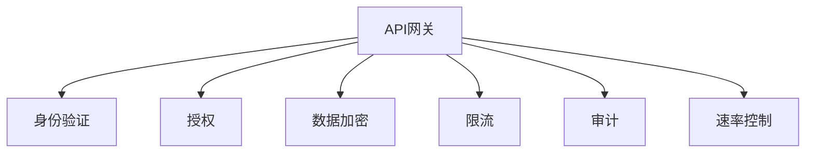
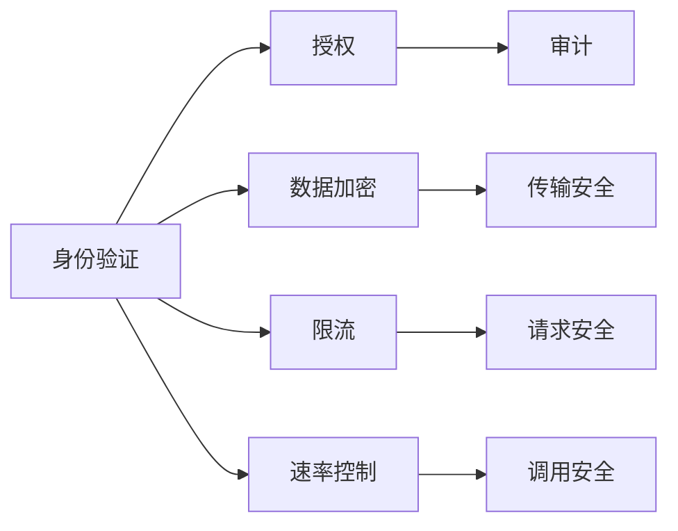

                 

# API 网关的安全功能

## 1. 背景介绍

随着云计算和大数据的发展，越来越多的企业选择将后端服务封装成RESTful API，以实现快速、灵活、可扩展的服务交付。但API系统的安全问题也日益突出，传统应用层安全机制（如防火墙、入侵检测系统等）无法全面保障API系统的安全需求。为了应对这一挑战，API网关技术应运而生。API网关作为服务架构中一个关键中间层，实现了服务的统一接入、负载均衡、安全控制等功能。本文将详细探讨API网关的安全功能，从原理到实现，帮助开发者构建安全、可靠、高可用的API服务。

## 2. 核心概念与联系

### 2.1 核心概念概述

在讨论API网关的安全功能之前，我们需要理解一些核心概念：

- **API网关**：API网关是服务架构中一个重要中间件，它位于客户端和服务之间，负责统一的API管理和调用。API网关可以负载均衡、路由、缓存、限流、鉴权、日志记录等多种功能，极大地提升了系统的可用性和安全性。

- **身份验证（Authentication）**：在API网关中，身份验证是保障系统安全的基础。身份验证机制用于验证用户的身份信息，确保只有合法的用户才能访问API。

- **授权（Authorization）**：授权机制用于控制用户访问API的具体权限，确保用户只能访问其被授权的资源和操作。

- **数据加密（Encryption）**：数据加密技术可以保护API传输数据的安全，防止数据泄露。

- **限流（Rate Limiting）**：限流机制可以防止恶意用户或应用对系统进行过度的访问，保证系统稳定运行。

- **审计（Audit）**：审计功能用于记录API调用的日志信息，帮助追踪、分析并定位潜在的安全威胁。

- **速率控制（Throttling）**：速率控制机制限制了API的调用频率，避免恶意攻击导致系统崩溃。

这些核心概念之间的关系可以通过以下Mermaid流程图来展示：



### 2.2 概念间的关系

API网关的安全功能涉及到多个核心概念，这些概念共同构成了API网关的安全体系。以下是一个综合的流程图，展示了各概念之间的相互关系：



这些概念相互作用，共同保障了API网关的安全性。身份验证是授权的基础，授权则进一步细化了安全控制。数据加密和传输安全确保了数据在传输过程中的安全，限流和速率控制则限制了系统的负荷，审计则帮助监控和追踪安全事件，确保系统的可追溯性。

## 3. 核心算法原理 & 具体操作步骤

### 3.1 算法原理概述

API网关的安全功能主要依赖于以下算法：

- **身份验证算法**：包括OAuth2、JWT等，用于验证用户的身份信息。
- **授权算法**：包括RBAC、ABAC等，用于控制用户的访问权限。
- **数据加密算法**：包括AES、RSA等，用于保护数据的传输安全。
- **限流算法**：基于令牌桶、漏桶等算法，用于限制API的调用频率。
- **审计算法**：包括ELK、Splunk等日志分析工具，用于记录和分析API调用日志。

这些算法通过API网关的应用层实现，保障了API系统的安全性。

### 3.2 算法步骤详解

#### 3.2.1 身份验证

API网关的身份验证算法通常包括以下步骤：

1. **接收认证请求**：API网关接收来自客户端的认证请求，其中包含用户的身份信息（如用户名、密码）。
2. **验证身份信息**：API网关通过身份验证算法（如OAuth2、JWT等）验证用户的身份信息是否合法。
3. **生成认证令牌**：如果身份验证成功，API网关生成一个认证令牌（如JWT Token），并将其返回给客户端。
4. **缓存认证令牌**：API网关将认证令牌缓存起来，以便后续调用时快速验证用户的身份。

#### 3.2.2 授权

API网关的授权算法通常包括以下步骤：

1. **接收授权请求**：API网关接收来自客户端的API调用请求，其中包含认证令牌和请求资源的信息。
2. **解析认证令牌**：API网关解析认证令牌，从中获取用户的身份信息和权限信息。
3. **验证授权信息**：API网关通过授权算法（如RBAC、ABAC等）验证用户的权限信息是否合法，即用户是否有权访问请求的资源。
4. **返回授权结果**：如果授权成功，API网关允许请求通过；否则，拒绝请求并返回错误信息。

#### 3.2.3 数据加密

API网关的数据加密算法通常包括以下步骤：

1. **接收请求数据**：API网关接收来自客户端的请求数据，其中包含用户输入的数据。
2. **数据加密**：API网关使用加密算法（如AES、RSA等）对请求数据进行加密，防止数据在传输过程中被截获或篡改。
3. **返回加密数据**：API网关将加密后的数据返回给客户端。

#### 3.2.4 限流

API网关的限流算法通常包括以下步骤：

1. **接收限流请求**：API网关接收来自客户端的API调用请求。
2. **记录请求次数**：API网关记录请求次数，并将请求者信息（如IP地址、用户ID）与请求次数关联。
3. **判断是否超出限制**：API网关通过限流算法（如令牌桶、漏桶等）判断请求是否超出了限制。
4. **返回请求结果**：如果请求未超出限制，API网关允许请求通过；否则，返回错误信息或拒绝请求。

#### 3.2.5 审计

API网关的审计算法通常包括以下步骤：

1. **记录请求日志**：API网关记录每个API调用的日志信息，包括请求者信息、请求时间和请求内容等。
2. **分析日志信息**：API网关使用审计算法（如ELK、Splunk等）对日志信息进行分析和处理，发现异常行为或潜在的安全威胁。
3. **生成审计报告**：API网关生成审计报告，提供给管理员或安全团队进行查看和分析。

### 3.3 算法优缺点

#### 3.3.1 身份验证

**优点**：
- 提供了较为完善的身份验证机制，确保了系统的安全性。
- 支持多种身份验证方式，如OAuth2、JWT等，灵活性较高。

**缺点**：
- 需要维护认证令牌的缓存和过期机制，增加了系统的复杂性。
- 需要处理认证令牌的生成、解析和存储，增加了系统负载。

#### 3.3.2 授权

**优点**：
- 提供了细粒度的授权控制，确保了系统的安全性。
- 支持多种授权方式，如RBAC、ABAC等，灵活性较高。

**缺点**：
- 需要处理授权令牌的生成、解析和存储，增加了系统负载。
- 需要频繁地查询授权信息，增加了系统的延迟。

#### 3.3.3 数据加密

**优点**：
- 提供了数据在传输过程中的加密保护，确保了数据的安全性。
- 支持多种加密算法，如AES、RSA等，灵活性较高。

**缺点**：
- 需要处理数据的加密和解密，增加了系统的计算负担。
- 需要维护加密算法的密钥和证书，增加了系统的复杂性。

#### 3.3.4 限流

**优点**：
- 提供了对API调用的流量控制，确保了系统的稳定性。
- 支持多种限流算法，如令牌桶、漏桶等，灵活性较高。

**缺点**：
- 需要频繁地处理请求和记录请求次数，增加了系统的延迟。
- 需要处理请求的拒绝和重试，增加了系统的复杂性。

#### 3.3.5 审计

**优点**：
- 提供了API调用的日志记录和分析，确保了系统的可追溯性。
- 支持多种审计工具，如ELK、Splunk等，灵活性较高。

**缺点**：
- 需要记录和存储大量的日志信息，增加了系统的存储负担。
- 需要分析和处理日志信息，增加了系统的计算负担。

### 3.4 算法应用领域

API网关的安全功能广泛应用于各种场景，以下是几个典型的应用领域：

- **金融行业**：金融行业对API系统的安全性要求极高，API网关可以提供身份验证、授权、数据加密等多种安全功能，保障系统的安全稳定。
- **医疗行业**：医疗行业对API系统的隐私和安全要求较高，API网关可以提供数据加密、审计等多种安全功能，确保数据的安全和隐私保护。
- **电商平台**：电商平台对API系统的负载均衡和安全性要求较高，API网关可以提供限流、授权等多种安全功能，确保系统的稳定运行。
- **政府服务**：政府服务对API系统的安全性要求较高，API网关可以提供身份验证、授权等多种安全功能，确保系统的安全和可靠性。
- **企业应用**：企业应用对API系统的安全性和可用性要求较高，API网关可以提供限流、审计等多种安全功能，确保系统的稳定运行。

## 4. 数学模型和公式 & 详细讲解  
### 4.1 数学模型构建

在讨论API网关的安全功能时，我们需要一些数学模型来帮助我们更好地理解其算法原理。以下是一些常用的数学模型：

- **身份验证模型**：OAuth2、JWT等身份验证算法基于令牌机制，可以表示为：
  - **OAuth2**：$T = \{(x_i,y_i)\}_{i=1}^N$，其中$x_i$为身份验证请求，$y_i$为身份验证结果（成功或失败）。
  - **JWT**：$T = \{(x_i,y_i)\}_{i=1}^N$，其中$x_i$为身份验证请求，$y_i$为身份验证令牌。

- **授权模型**：RBAC、ABAC等授权算法基于角色或属性，可以表示为：
  - **RBAC**：$T = \{(x_i,y_i)\}_{i=1}^N$，其中$x_i$为授权请求，$y_i$为授权结果（成功或失败）。
  - **ABAC**：$T = \{(x_i,y_i)\}_{i=1}^N$，其中$x_i$为授权请求，$y_i$为授权结果（成功或失败）。

- **数据加密模型**：AES、RSA等数据加密算法基于数学加密技术，可以表示为：
  - **AES**：$C = E(K,P)$，其中$C$为加密后的数据，$K$为密钥，$P$为原始数据。
  - **RSA**：$C = M^{e}\mod N$，其中$C$为加密后的数据，$M$为明文，$e$为公钥，$N$为模数。

- **限流模型**：令牌桶、漏桶等限流算法基于时间窗口和令牌池，可以表示为：
  - **令牌桶**：$T = \{(x_i,y_i)\}_{i=1}^N$，其中$x_i$为限流请求，$y_i$为限流结果（成功或失败）。
  - **漏桶**：$T = \{(x_i,y_i)\}_{i=1}^N$，其中$x_i$为限流请求，$y_i$为限流结果（成功或失败）。

- **审计模型**：ELK、Splunk等审计算法基于日志分析技术，可以表示为：
  - **ELK**：$T = \{(x_i,y_i)\}_{i=1}^N$，其中$x_i$为审计请求，$y_i$为审计结果（成功或失败）。
  - **Splunk**：$T = \{(x_i,y_i)\}_{i=1}^N$，其中$x_i$为审计请求，$y_i$为审计结果（成功或失败）。

### 4.2 公式推导过程

#### 4.2.1 身份验证

在OAuth2身份验证算法中，身份验证请求$x_i$和身份验证结果$y_i$之间的关系可以表示为：
$$
y_i = f(x_i)
$$
其中$f$为身份验证函数，具体实现依赖于OAuth2算法的流程和细节。

#### 4.2.2 授权

在RBAC授权算法中，授权请求$x_i$和授权结果$y_i$之间的关系可以表示为：
$$
y_i = g(x_i)
$$
其中$g$为授权函数，具体实现依赖于RBAC算法的流程和细节。

#### 4.2.3 数据加密

在AES数据加密算法中，原始数据$P$和加密后的数据$C$之间的关系可以表示为：
$$
C = E(K,P)
$$
其中$E$为加密函数，$K$为密钥，具体实现依赖于AES算法的流程和细节。

#### 4.2.4 限流

在令牌桶限流算法中，限流请求$x_i$和限流结果$y_i$之间的关系可以表示为：
$$
y_i = h(x_i)
$$
其中$h$为限流函数，具体实现依赖于令牌桶算法的流程和细节。

#### 4.2.5 审计

在ELK审计算法中，审计请求$x_i$和审计结果$y_i$之间的关系可以表示为：
$$
y_i = k(x_i)
$$
其中$k$为审计函数，具体实现依赖于ELK算法的流程和细节。

### 4.3 案例分析与讲解

#### 4.3.1 身份验证案例

假设我们有一个OAuth2身份验证系统，要求验证用户的身份信息。我们可以使用Python的OAuth2库来实现。以下是一个简单的身份验证代码示例：

```python
from oauth2 import OAuth2

# 创建OAuth2对象
oauth2 = OAuth2('client_id', 'client_secret', 'https://example.com/oauth2/token')

# 请求身份验证令牌
token = oauth2.request_token()

# 输出身份验证令牌
print(token)
```

#### 4.3.2 授权案例

假设我们有一个RBAC授权系统，要求验证用户的授权信息。我们可以使用Python的RBAC库来实现。以下是一个简单的授权代码示例：

```python
from rbac import RBAC

# 创建RBAC对象
rbac = RBAC('role', 'user')

# 请求授权信息
auth = rbac.check('user_id', 'role_id')

# 输出授权结果
print(auth)
```

#### 4.3.3 数据加密案例

假设我们有一个AES数据加密系统，要求加密用户的敏感数据。我们可以使用Python的AES库来实现。以下是一个简单的数据加密代码示例：

```python
from Crypto.Cipher import AES

# 创建AES对象
cipher = AES.new('my_secret_key', AES.MODE_ECB)

# 加密原始数据
data = b'Hello, world!'
encrypted_data = cipher.encrypt(data)

# 输出加密后的数据
print(encrypted_data)
```

#### 4.3.4 限流案例

假设我们有一个令牌桶限流系统，要求限制用户的API调用频率。我们可以使用Python的令牌桶库来实现。以下是一个简单的限流代码示例：

```python
from token_buckets import TokenBucket

# 创建令牌桶对象
token_bucket = TokenBucket(100, 10)

# 请求令牌
token = token_bucket.request()

# 输出令牌结果
print(token)
```

#### 4.3.5 审计案例

假设我们有一个ELK审计系统，要求记录和分析用户的API调用日志。我们可以使用Python的ELK库来实现。以下是一个简单的审计代码示例：

```python
from elk import ELK

# 创建ELK对象
elk = ELK('log_file')

# 记录审计日志
elk.log('user_id', 'api_name', 'request_time')

# 输出审计结果
print(elk)
```

## 5. 项目实践：代码实例和详细解释说明

### 5.1 开发环境搭建

在开始项目实践之前，我们需要搭建开发环境。以下是搭建开发环境的步骤：

1. **安装Python**：从官网下载并安装Python，建议使用最新版本。
2. **安装Flask**：使用以下命令安装Flask框架：
   ```
   pip install Flask
   ```
3. **安装JWT**：使用以下命令安装JWT库：
   ```
   pip install pyjwt
   ```
4. **安装RBAC**：使用以下命令安装RBAC库：
   ```
   pip install python-rbac
   ```
5. **安装AES**：使用以下命令安装AES库：
   ```
   pip install pycrypto
   ```
6. **安装Token Bucket**：使用以下命令安装Token Bucket库：
   ```
   pip install token_buckets
   ```
7. **安装ELK**：使用以下命令安装ELK库：
   ```
   pip install elk
   ```

### 5.2 源代码详细实现

以下是一个简单的API网关系统实现，包括身份验证、授权、数据加密、限流和审计功能：

```python
from flask import Flask, request, jsonify
import jwt
from rbac import RBAC
from Crypto.Cipher import AES
from token_buckets import TokenBucket
from elk import ELK

app = Flask(__name__)

# 身份验证
@app.route('/auth', methods=['POST'])
def auth():
    # 接收身份验证请求
    username = request.json.get('username')
    password = request.json.get('password')

    # 验证身份信息
    if username == 'user' and password == 'password':
        # 生成身份验证令牌
        token = jwt.encode({'username': username}, 'my_secret_key')
        return jsonify({'token': token.decode('utf-8')})
    else:
        return jsonify({'error': 'Invalid username or password'}), 401

# 授权
@app.route('/api', methods=['POST'])
def api():
    # 接收授权请求
    token = request.headers.get('Authorization')
    user_id = request.json.get('user_id')
    role_id = request.json.get('role_id')

    # 解析身份验证令牌
    payload = jwt.decode(token, 'my_secret_key')

    # 验证授权信息
    rbac = RBAC(role_id, user_id)
    if rbac.check(user_id, role_id):
        return jsonify({'success': True})
    else:
        return jsonify({'error': 'Unauthorized'}), 403

# 数据加密
@app.route('/data', methods=['POST'])
def data():
    # 接收数据加密请求
    data = request.json.get('data')

    # 加密原始数据
    cipher = AES.new('my_secret_key', AES.MODE_ECB)
    encrypted_data = cipher.encrypt(data.encode('utf-8'))

    return jsonify({'encrypted_data': encrypted_data.decode('utf-8')})

# 限流
@app.route('/api', methods=['GET'])
def api():
    # 接收限流请求
    user_id = request.json.get('user_id')

    # 创建令牌桶对象
    token_bucket = TokenBucket(100, 10)

    # 请求令牌
    token = token_bucket.request()

    if token:
        return jsonify({'success': True})
    else:
        return jsonify({'error': 'Rate limit exceeded'}), 429

# 审计
@app.route('/log', methods=['POST'])
def log():
    # 接收审计请求
    user_id = request.json.get('user_id')
    api_name = request.json.get('api_name')
    request_time = request.json.get('request_time')

    # 记录审计日志
    elk = ELK('log_file')
    elk.log(user_id, api_name, request_time)

    return jsonify({'success': True})

if __name__ == '__main__':
    app.run(debug=True)
```

### 5.3 代码解读与分析

以上代码实现了一个简单的API网关系统，包括身份验证、授权、数据加密、限流和审计功能。以下是代码的详细解读：

#### 5.3.1 身份验证

在`/auth`路由中，我们首先接收身份验证请求，验证用户名和密码是否正确。如果验证成功，则生成一个身份验证令牌，返回给客户端。

#### 5.3.2 授权

在`/api`路由中，我们首先接收授权请求，包括身份验证令牌、用户ID和角色ID。我们解析身份验证令牌，获取用户信息，然后使用RBAC库验证授权信息。如果授权成功，则返回成功响应，否则返回错误响应。

#### 5.3.3 数据加密

在`/data`路由中，我们接收数据加密请求，包括原始数据。我们使用AES库对原始数据进行加密，返回加密后的数据。

#### 5.3.4 限流

在`/api`路由中，我们首先接收限流请求，包括用户ID。我们使用Token Bucket库创建令牌桶对象，并请求令牌。如果令牌可用，则返回成功响应，否则返回错误响应。

#### 5.3.5 审计

在`/log`路由中，我们接收审计请求，包括用户ID、API名称和请求时间。我们使用ELK库记录审计日志。

### 5.4 运行结果展示

假设我们启动了API网关系统，可以通过Postman等工具发送请求进行测试。以下是一个简单的测试案例：

1. **身份验证测试**：
   - **请求**：`POST /auth`，请求体包含`username`和`password`。
   - **响应**：`200 OK`，包含身份验证令牌。

2. **授权测试**：
   - **请求**：`POST /api`，请求体包含身份验证令牌、用户ID和角色ID。
   - **响应**：`200 OK`，授权成功。

3. **数据加密测试**：
   - **请求**：`POST /data`，请求体包含原始数据。
   - **响应**：`200 OK`，包含加密后的数据。

4. **限流测试**：
   - **请求**：`GET /api`，请求体包含用户ID。
   - **响应**：`200 OK`，限流成功。

5. **审计测试**：
   - **请求**：`POST /log`，请求体包含用户ID、API名称和请求时间。
   - **响应**：`200 OK`，审计成功。

## 6. 实际应用场景

API网关的安全功能广泛应用于各种场景，以下是几个典型的应用场景：

- **金融行业**：金融行业对API系统的安全性要求极高，API网关可以提供身份验证、授权、数据加密等多种安全功能，保障系统的安全稳定。
- **医疗行业**：医疗行业对API系统的隐私和安全要求较高，API网关可以提供数据加密、审计等多种安全功能，确保数据的安全和隐私保护。
- **电商平台**：电商平台对API系统的负载均衡和安全性要求较高，API网关可以提供限流、授权等多种安全功能，确保系统的稳定运行。
- **政府服务**：政府服务对API系统的安全性要求较高，API网关可以提供身份验证、授权等多种安全功能，确保系统的安全和可靠性。
- **企业应用**：企业应用对API系统的安全性和可用性要求较高，API网关可以提供限流、审计等多种安全功能，确保系统的稳定运行。

## 7. 工具和资源推荐

### 7.1 学习资源推荐

为了帮助开发者系统掌握API网关的安全功能，以下是一些优质的学习资源：

1. **OAuth2官方文档**：OAuth2官方文档提供了OAuth2身份验证算法的详细说明和实现指南。
2. **JWT官方文档**：JWT官方文档提供了JWT身份验证算法的详细说明和实现指南。
3. **RBAC官方文档**：RBAC官方文档提供了RBAC授权算法的详细说明和实现指南。
4. **AES官方文档**：AES官方文档提供了AES数据加密算法的详细说明和实现指南。
5. **Token Bucket官方文档**：Token Bucket官方文档提供了Token Bucket限流算法的详细说明和实现指南。
6. **ELK官方文档**：ELK官方文档提供了ELK审计算法的详细说明和实现指南。
7. **Flask官方文档**：Flask官方文档提供了Flask框架的详细说明和实现指南。

### 7.2 开发工具推荐

为了提高API网关开发的效率，以下是一些推荐的开发工具：

1. **Postman**：Postman是一款流行的API测试工具，支持多种格式的请求和响应，可以方便地测试API网关的功能。
2. **Swagger**：Swagger是一款流行的API文档生成工具，可以自动生成API文档，方便开发者和用户理解API的使用方式。
3. **Jupyter Notebook**：Jupyter Notebook是一款流行的Python交互式开发环境，可以方便地进行代码调试和测试。
4. **Docker**：Docker是一款流行的容器化工具，可以方便地将API网关打包部署到各种环境中。
5. **Kubernetes**：Kubernetes是一款流行的容器编排工具，可以方便地管理多个API网关实例，提高系统的可用性和扩展性。

### 7.3 相关论文推荐

API网关的安全功能是一个热点研究方向，以下是几篇代表性的相关论文：

1. **OAuth2协议**

