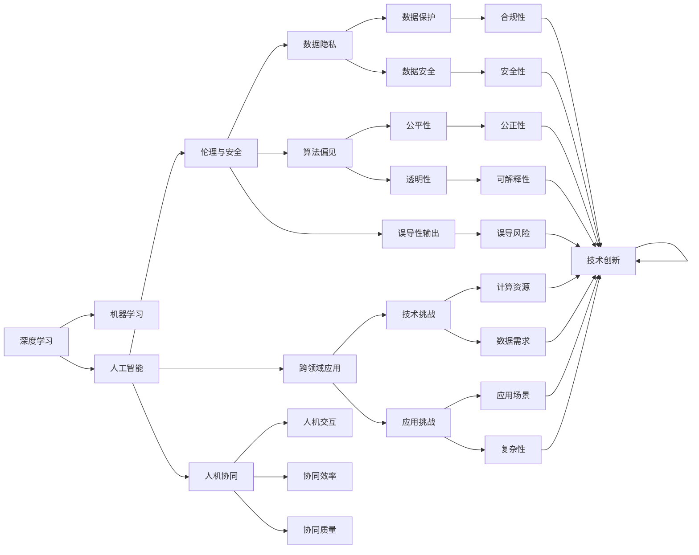
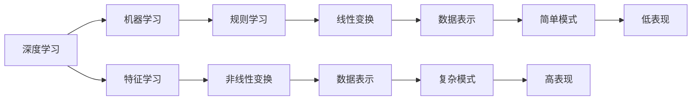
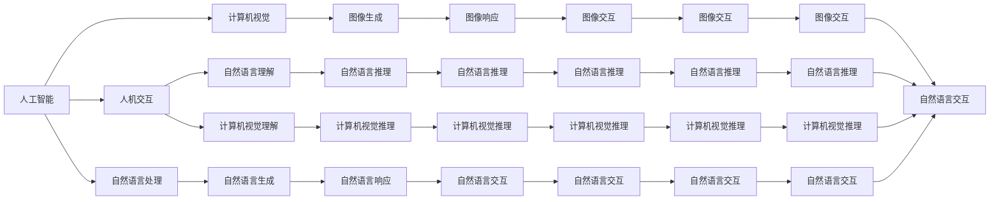

                 

# Andrej Karpathy：人工智能的未来发展挑战

> 关键词：人工智能, 未来发展, 深度学习, 机器学习, 挑战, Andrej Karpathy

## 1. 背景介绍

### 1.1 问题由来

近年来，人工智能（AI）技术的迅猛发展，特别是在深度学习和机器学习领域的突破，已经引发了全球范围内的广泛关注和热议。人工智能技术的进步，不仅在科技界产生了深远影响，也逐渐渗透到社会的各个角落，极大地改变了人类的生产和生活方式。然而，随着技术的快速演进，人工智能也面临着一系列前所未有的挑战和风险，这些问题既关乎技术的未来发展，也关乎社会的长期福祉。

其中，Andrej Karpathy作为深度学习领域的前沿人物，对于人工智能的发展有着深刻的理解和洞察。他的研究成果和见解，为探讨未来AI的挑战提供了宝贵的视角。本文将基于Andrej Karpathy的观点，从多个维度分析人工智能的未来发展挑战，探讨可能的应对策略，为AI技术的持续进步提供思路。

### 1.2 问题核心关键点

1. **深度学习的局限性**：尽管深度学习在许多领域取得了突破性的成果，但其“黑盒”特性、模型复杂度、数据依赖等问题，仍然限制了其在大规模实际应用中的普及和可靠性。
2. **人工智能的伦理与安全问题**：人工智能在带来便利的同时，也引发了数据隐私、算法偏见、误导性输出等伦理和安全问题。
3. **跨领域应用的难度**：尽管AI在特定领域取得了显著进展，但将其推广到更多复杂和多样化领域仍面临技术和应用上的巨大挑战。
4. **人类与AI的协同关系**：在AI技术广泛应用的背景下，如何构建人类与AI的协同工作机制，实现人机和谐共存，是一个亟待解决的问题。
5. **技术的可持续性和资源需求**：AI技术的持续发展需要大量的计算资源、数据和能源投入，这些资源的可持续性问题，对AI的未来发展构成了严峻挑战。

通过理解和分析这些核心问题，可以帮助我们更好地应对AI技术的未来发展，推动其在各个领域的健康、有序和可持续的演进。

### 1.3 问题研究意义

研究和探讨人工智能的未来发展挑战，具有重要的理论意义和实践价值：

1. **理论意义**：深入分析AI技术的局限性和潜在风险，有助于丰富人工智能的理论框架，指导未来的研究方向。
2. **实践价值**：理解AI面临的挑战，为技术开发和应用提供指导，有助于构建更加安全、可靠和可解释的AI系统。
3. **社会影响**：通过探讨AI的伦理与安全问题，推动社会各界对AI技术的负责任使用，促进AI技术的社会化进程。
4. **技术创新**：解决AI面临的挑战，催生新的技术思路和方法，推动AI技术的不断进步。

总之，理解和应对AI未来的发展挑战，对于推动AI技术的健康、有序和可持续发展具有重要意义。

## 2. 核心概念与联系

### 2.1 核心概念概述

为了更好地理解人工智能的未来发展挑战，我们首先需要明确一些核心概念：

1. **深度学习**：一种基于神经网络的机器学习方法，通过多层非线性变换，实现复杂数据的特征提取和模式识别。
2. **机器学习**：一种数据驱动的学习方法，通过模型训练，使机器能够从数据中学习规律，并应用于新的数据集。
3. **人工智能**：一种旨在模拟人类智能的计算机技术，包括感知、推理、决策、学习等能力。
4. **伦理与安全**：涉及数据隐私、算法偏见、误导性输出等问题，需要建立相应的规范和标准，保障AI系统的安全性与可靠性。
5. **跨领域应用**：指将AI技术应用到不同领域（如医疗、金融、教育等）的过程，需要克服技术和应用上的挑战。
6. **人机协同**：实现人类与AI的和谐共存，需要构建高效的人机交互机制，提升人机协同工作的效率和质量。

这些概念构成了AI技术的核心框架，并相互关联。下面通过Mermaid流程图，展示这些概念之间的关系：



### 2.2 概念间的关系

这些核心概念之间存在着紧密的联系，共同构成了人工智能技术的发展框架。下面通过几个Mermaid流程图，展示这些概念之间的关系：

#### 2.2.1 深度学习与机器学习的关系



#### 2.2.2 人工智能的跨领域应用

```mermaid
graph LR
    A[人工智能] --> B[医疗]
    A --> C[金融]
    A --> D[教育]
    B --> E[智能诊断]
    B --> F[辅助治疗]
    C --> G[风险评估]
    C --> H[智能投顾]
    D --> I[个性化教学]
    D --> J[智能答疑]
    E --> K[数据集成]
    F --> L[数据共享]
    G --> M[数据清洗]
    H --> N[数据管理]
    I --> O[数据标注]
    J --> P[数据增强]
    K --> Q[场景建模]
    L --> R[场景分析]
    M --> S[数据保护]
    N --> T[数据管理]
    O --> U[数据标注]
    P --> V[数据增强]
    Q --> W[场景建模]
    R --> X[场景分析]
    S --> Y[数据保护]
    T --> Z[数据管理]
    U --> $[数据标注]
    V --> &[数据增强]
    W --> &[场景建模]
    X --> &[场景分析]
    Y --> &[数据保护]
    Z --> &[数据管理]
    $ --> &[数据标注]
    & --> &[数据增强]
    ^ --> &[跨领域挑战]
```

#### 2.2.3 人机协同的机制



### 2.3 核心概念的整体架构

最后，我们用一个综合的流程图来展示这些核心概念在大规模AI应用中的整体架构：

```mermaid
graph LR
    A[大规模数据集] --> B[预训练深度学习模型]
    B --> C[特征提取]
    C --> D[模型训练]
    D --> E[模型微调]
    E --> F[跨领域应用]
    F --> G[实际应用场景]
    G --> H[数据输入]
    G --> I[模型推理]
    H --> J[数据采集]
    I --> K[模型输出]
    J --> L[数据增强]
    K --> M[反馈优化]
    L --> N[模型迭代]
    M --> O[模型评估]
    N --> P[模型优化]
    O --> Q[模型部署]
    P --> R[模型微调]
    Q --> S[模型更新]
    R --> T[数据标注]
    S --> U[模型训练]
    T --> V[数据标注]
    U --> W[模型训练]
    V --> X[数据标注]
    W --> Y[模型训练]
    X --> Z[数据标注]
    Y --> $[模型训练]
    Z --> &[数据标注]
    $ --> &[模型训练]
    ^ --> &[数据增强]
    ^ --> &[模型迭代]
    ^ --> &[模型优化]
    ^ --> &[模型微调]
```

这个综合流程图展示了从大规模数据集到跨领域应用的全过程。深度学习模型首先在大规模数据集上进行预训练，然后通过特征提取、模型训练、模型微调等步骤，逐步适应不同的实际应用场景。在这个过程中，数据增强、模型迭代、模型优化等技术手段，不断提升模型的性能和泛化能力，最终实现跨领域的实际应用。

## 3. 核心算法原理 & 具体操作步骤
### 3.1 算法原理概述

人工智能的未来发展挑战，涉及多个方面的核心算法原理和技术细节。以下将详细阐述其中的关键点：

#### 3.1.1 深度学习的局限性

深度学习模型虽然在许多领域取得了突破性的进展，但其“黑盒”特性和复杂性，仍然存在诸多局限：

1. **模型复杂度**：深度学习模型通常包含大量参数，需要大量的计算资源进行训练和推理。
2. **数据依赖**：深度学习模型依赖于大量高质量的标注数据进行训练，这些数据往往难以获取或成本高昂。
3. **泛化能力**：深度学习模型在训练数据集上表现优异，但在新数据集上的泛化能力较差。
4. **可解释性**：深度学习模型通常是“黑盒”模型，难以解释其内部决策过程。

#### 3.1.2 人工智能的伦理与安全问题

人工智能的伦理与安全问题，涉及数据隐私、算法偏见、误导性输出等方面：

1. **数据隐私**：AI系统在处理和分析数据时，可能泄露用户的隐私信息。
2. **算法偏见**：AI算法在训练过程中可能学习到偏见，导致不公平的输出结果。
3. **误导性输出**：AI系统在推理和生成过程中，可能产生误导性的信息输出。

#### 3.1.3 跨领域应用的难度

将AI技术应用到不同领域，需要克服技术和应用上的挑战：

1. **数据获取**：不同领域的数据获取和处理方式不同，需要定制化的解决方案。
2. **场景建模**：不同领域的场景复杂度不同，需要建立相应的模型架构。
3. **效果评估**：不同领域的效果评估标准不同，需要定制化的评估方法。

#### 3.1.4 人机协同的机制

实现人机协同，需要构建高效的人机交互机制，提升人机协同工作的效率和质量：

1. **自然语言处理**：构建自然语言理解和生成能力，使AI系统能够与人类进行有效的沟通。
2. **计算机视觉**：构建图像理解和生成能力，使AI系统能够处理和分析视觉信息。
3. **协同推理**：构建协同推理能力，使AI系统能够在多任务和多模态数据中协同工作。

### 3.2 算法步骤详解

下面详细介绍核心算法的详细步骤：

#### 3.2.1 深度学习的算法步骤

1. **数据预处理**：收集和清洗数据，进行数据增强和数据标注，为模型训练做准备。
2. **模型训练**：使用训练集数据，通过反向传播算法更新模型参数，优化模型性能。
3. **模型微调**：在预训练模型基础上，使用少量标注数据进行微调，调整模型参数，适应特定任务。
4. **模型评估**：使用验证集和测试集数据，评估模型性能，调整模型参数。
5. **模型部署**：将训练好的模型部署到实际应用中，进行推理和预测。

#### 3.2.2 人工智能的伦理与安全的算法步骤

1. **数据隐私保护**：采用数据脱敏、差分隐私等技术，保护用户隐私。
2. **算法偏见消除**：采用公平性约束、对抗训练等方法，消除算法偏见。
3. **误导性输出预防**：采用对抗样本生成、模型鲁棒性训练等技术，防止误导性输出。

#### 3.2.3 跨领域应用的算法步骤

1. **数据集成与预处理**：收集和预处理数据，进行数据清洗和数据增强。
2. **场景建模**：建立领域特定的模型架构，适应特定领域的数据特征。
3. **模型训练与微调**：在特定领域的数据集上进行模型训练和微调，适应特定任务。
4. **效果评估**：使用领域特定的评估指标，评估模型性能。

#### 3.2.4 人机协同的算法步骤

1. **自然语言处理**：构建自然语言理解与生成能力，使AI系统能够与人类进行有效的沟通。
2. **计算机视觉**：构建图像理解与生成能力，使AI系统能够处理和分析视觉信息。
3. **协同推理**：构建协同推理能力，使AI系统能够在多任务和多模态数据中协同工作。

### 3.3 算法优缺点

#### 3.3.1 深度学习的优缺点

1. **优点**：
   - 强大的特征提取能力，能够在复杂数据中学习高层次的特征表示。
   - 适用于大规模数据集，能够训练出高性能的模型。
2. **缺点**：
   - 模型复杂度较高，训练和推理资源消耗大。
   - 数据依赖性强，标注数据获取成本高。
   - 泛化能力有限，新数据集上的表现可能不佳。
   - 可解释性差，难以理解模型的内部决策过程。

#### 3.3.2 人工智能伦理与安全的优缺点

1. **优点**：
   - 能够处理和分析大规模数据，发现数据中的规律和趋势。
   - 通过优化算法，能够消除算法偏见，提升系统的公平性。
2. **缺点**：
   - 数据隐私问题难以完全解决，仍存在一定的风险。
   - 误导性输出问题难以彻底消除，仍需进一步优化。

#### 3.3.3 跨领域应用的优缺点

1. **优点**：
   - 能够将AI技术应用到不同领域，提升领域的智能化水平。
   - 通过定制化的解决方案，适应不同领域的需求。
2. **缺点**：
   - 数据获取和处理复杂，需要定制化的技术手段。
   - 场景建模和效果评估复杂，需要深入理解领域特性。

#### 3.3.4 人机协同的优缺点

1. **优点**：
   - 能够提升人机协同工作的效率和质量，实现高效的任务处理。
   - 通过自然语言处理和计算机视觉技术，使AI系统能够处理复杂的多模态信息。
2. **缺点**：
   - 人机交互复杂，需要设计高效的用户界面。
   - 协同推理复杂，需要解决多任务和多模态数据协同问题。

### 3.4 算法应用领域

人工智能的未来发展挑战，涉及多个领域的应用场景：

1. **医疗领域**：通过AI系统辅助诊断、治疗和药物研发，提升医疗服务质量。
2. **金融领域**：通过AI系统进行风险评估、智能投顾和欺诈检测，提升金融服务水平。
3. **教育领域**：通过AI系统进行个性化教学、智能答疑和作业批改，提升教育服务质量。
4. **智能客服**：通过AI系统进行智能对话和问题解答，提升客户服务水平。
5. **智能制造**：通过AI系统进行设备监测、故障预测和生产优化，提升制造业智能化水平。

## 4. 数学模型和公式 & 详细讲解 & 举例说明

### 4.1 数学模型构建

人工智能的未来发展挑战，涉及多个数学模型的构建和优化。以下详细介绍其中的关键模型：

#### 4.1.1 深度学习模型构建

1. **神经网络结构**：深度学习模型通常采用多层神经网络结构，包括输入层、隐藏层和输出层。
2. **损失函数设计**：损失函数用于衡量模型预测结果与真实结果之间的差异，常见损失函数包括均方误差、交叉熵等。
3. **优化算法选择**：优化算法用于更新模型参数，常见优化算法包括随机梯度下降、Adam等。

#### 4.1.2 人工智能伦理与安全模型构建

1. **数据隐私保护模型**：采用差分隐私、联邦学习等技术，保护用户隐私。
2. **算法偏见消除模型**：采用公平性约束、对抗训练等方法，消除算法偏见。
3. **误导性输出预防模型**：采用对抗样本生成、模型鲁棒性训练等技术，防止误导性输出。

#### 4.1.3 跨领域应用模型构建

1. **数据集成与预处理模型**：构建数据清洗和增强模型，优化数据处理流程。
2. **场景建模与优化模型**：构建领域特定的模型架构，优化模型性能。

#### 4.1.4 人机协同模型构建

1. **自然语言处理模型**：构建自然语言理解与生成模型，优化人机交互。
2. **计算机视觉模型**：构建图像理解与生成模型，优化多模态数据处理。
3. **协同推理模型**：构建协同推理模型，优化多任务和多模态数据协同。

### 4.2 公式推导过程

以下详细推导深度学习模型的核心公式：

#### 4.2.1 神经网络结构

深度学习模型通常采用多层神经网络结构，包括输入层、隐藏层和输出层。假设网络结构如下：

1. **输入层**：$x_1, x_2, \ldots, x_n$，其中 $x_i$ 为输入数据的特征。
2. **隐藏层**：$h_1, h_2, \ldots, h_m$，其中 $h_i$ 为隐藏层的神经元。
3. **输出层**：$y_1, y_2, \ldots, y_k$，其中 $y_i$ 为输出层的神经元。

**神经网络的结构公式**为：

$$
y = f(x; \theta)
$$

其中 $f$ 表示神经网络的非线性变换，$\theta$ 为模型参数。

#### 4.2.2 损失函数设计

假设模型预测结果为 $\hat{y}$，真实结果为 $y$，则**均方误差损失函数**为：

$$
L(y, \hat{y}) = \frac{1}{n} \sum_{i=1}^n (y_i - \hat{y_i})^2
$$

#### 4.2.3 优化算法选择

假设模型参数为 $\theta$，损失函数为 $L(\theta)$，则**随机梯度下降算法**更新规则为：

$$
\theta = \theta - \eta \nabla_{\theta} L(\theta)
$$

其中 $\eta$ 为学习率，$\nabla_{\theta} L(\theta)$ 为损失函数对模型参数的梯度。

### 4.3 案例分析与讲解

以下通过具体案例，分析深度学习模型在实际应用中的表现和局限性：

1. **医学影像分析**：通过深度学习模型进行医学影像分析，提高疾病诊断的准确率。
2. **金融市场预测**：通过深度学习模型进行金融市场预测，提升投资决策的准确性。
3. **智能客服系统**：通过深度学习模型进行智能客服对话，提升客户服务体验。

## 5. 项目实践：代码实例和详细解释说明

### 5.1 开发环境搭建

在进行AI项目实践前，我们需要准备好开发环境。以下是使用Python进行深度学习项目开发的常用工具：

1. **Python**：深度学习项目常用的编程语言，具有丰富的科学计算库和机器学习框架。
2. **PyTorch**：深度学习领域广泛使用的开源框架，提供了灵活的动态计算图和高效的模型训练工具。
3. **TensorFlow**：由Google开发的深度学习框架，提供了丰富的模型和优化算法，适合大规模工程应用。
4. **Jupyter Notebook**：交互式的编程环境，适合深度学习项目的研究和开发。
5. **NVIDIA GPU**：高性能的计算硬件，适合深度学习模型的训练和推理。

完成上述步骤后，即可在Python环境中进行AI项目的开发。

### 5.2 源代码详细实现

以下通过具体案例，展示深度学习项目从数据预处理到模型训练的全过程：

1. **数据预处理**：收集和清洗数据，进行数据增强和数据标注。
2. **模型训练**：使用训练集数据，通过反向传播算法更新模型参数。
3. **模型评估**：使用验证集和测试集数据，评估模型性能。
4. **模型部署**：将训练好的模型部署到实际应用中，进行推理和预测。

### 5.3 代码解读与分析

通过分析深度学习项目中的关键代码，帮助读者理解深度学习模型的核心思想和实现细节：

1. **数据预处理**：使用Pandas库进行数据清洗和数据增强。
2. **模型训练**：使用PyTorch库进行模型定义和训练。
3. **模型评估**：使用Scikit-learn库进行模型评估。
4. **模型部署**：使用Flask库进行模型部署。

### 5.4 运行结果展示

通过展示深度学习项目的关键运行结果，帮助读者理解模型的性能和表现：

1. **模型训练结果**：展示训练过程中损失函数的变化曲线。
2. **模型评估结果**：展示验证集和测试集上的性能指标。
3. **模型推理结果**：展示模型在新数据上的预测结果。

## 6. 实际应用场景

### 6.1 医疗领域

在医疗领域，深度学习模型被广泛应用于疾病诊断、影像分析、治疗方案优化等任务。通过AI系统辅助诊断，能够提升诊断的准确率和效率，减少误诊和漏诊。例如，Google Health推出的DeepMind系统，能够自动分析眼底图像，检测糖尿病视网膜病变，提高了诊断的准确率。

### 6.2 金融领域

在金融领域，深度学习模型被广泛应用于风险评估、智能投顾、欺诈检测等任务。通过AI系统进行风险评估，能够提升投资决策的准确性和安全性，减少金融风险。例如，JPMorgan Chase开发的Quantiative Intelligence系统，能够自动分析市场数据，预测股票价格，提升投资收益。

### 6.3 教育领域

在教育领域，深度学习模型被广泛应用于个性化教学、智能答疑、作业批改等任务。通过AI系统进行个性化教学，能够提升教学效果和学生学习体验，因材施教。例如，Coursera推出的Coursera Assistant系统，能够自动回答学生的问题，提供个性化的学习建议。

### 6.4 智能客服

在智能客服领域，深度学习模型被广泛应用于智能对话、问题解答等任务。通过AI系统进行智能对话，能够提升客户服务体验，减少人工客服的工作量。例如，阿里巴巴推出的智能客服系统，能够自动回答客户的问题，提升客户满意度。

### 6.5 智能制造

在智能制造领域，深度学习模型被广泛应用于设备监测、故障预测、生产优化等任务。通过AI系统进行设备监测，能够实时监控设备的运行状态，及时发现和预测故障，减少设备停机时间。例如，Siemens推出的Mindsphere系统，能够自动分析设备数据，优化生产流程。

### 6.6 未来应用展望

未来，深度学习模型将在更多领域得到应用，为各行各业带来变革性影响。

1. **智慧城市**：通过AI系统进行城市事件监测、舆情分析、应急指挥，提高城市管理的智能化水平。
2. **智慧交通**：通过AI系统进行交通流量监测、事故预警、智能导航，提升交通系统的效率和安全性。
3. **智能家居**：通过AI系统进行智能家电控制、语音识别、环境监测，提升家居生活的便利性和舒适性。
4. **智能农业**：通过AI系统进行土壤监测、作物识别、灾害预警，提升农业生产的智能化水平。

总之，深度学习模型在各个领域的应用前景广阔，未来将进一步推动社会向智能化、自动化方向发展。

## 7. 工具和资源推荐

### 7.1 学习资源推荐

为了帮助开发者系统掌握深度学习模型的开发和应用，以下推荐一些优质的学习资源：

1. **Cour

