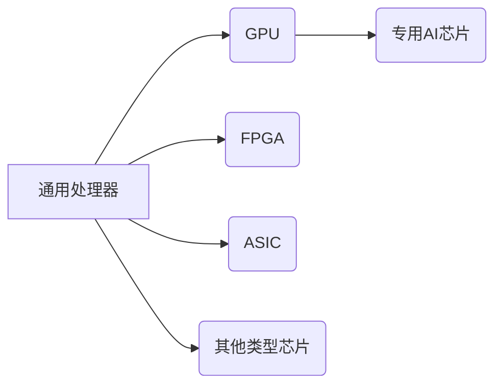

> 关键词：芯片技术，人工智能，AI创新，神经网络，深度学习，计算能力，计算架构，GPU，FPGA，AI芯片

# 芯片技术在AI创新中的突破

在人工智能（AI）的快速发展中，芯片技术发挥着至关重要的作用。从最早的CPU到GPU，再到如今的专用AI芯片，每一次芯片技术的突破都推动了AI领域的创新和应用。本文将深入探讨芯片技术在AI创新中的突破，分析其核心概念、算法原理、实际应用，并展望未来发展趋势与挑战。

## 1. 背景介绍

### 1.1 问题的由来

随着深度学习的兴起，AI技术取得了前所未有的进展。然而，深度学习模型通常需要大量的计算资源，这给传统的CPU和GPU带来了巨大的压力。为了满足AI计算的需求，芯片技术经历了从通用处理器到专用AI芯片的变革。

### 1.2 研究现状

目前，AI芯片技术已经取得了显著的突破，包括GPU、FPGA、ASIC、TPU等多种类型的芯片。这些芯片在性能、功耗、可扩展性等方面都有所不同，适用于不同的AI应用场景。

### 1.3 研究意义

芯片技术在AI创新中的突破，不仅提高了AI模型的计算效率，还降低了计算成本，推动了AI技术的发展和应用。同时，它也促进了芯片产业的创新，为整个IT行业带来了新的机遇。

### 1.4 本文结构

本文将首先介绍芯片技术在AI创新中的核心概念和联系，然后详细阐述核心算法原理和具体操作步骤，接着分析数学模型和公式，并给出项目实践案例。最后，我们将探讨实际应用场景、未来应用展望、工具和资源推荐、未来发展趋势与挑战，以及常见问题与解答。

## 2. 核心概念与联系

### 2.1 芯片技术概述

芯片技术是制造集成电路的技术，通过将成千上万的电子元件集成在一个很小的半导体晶圆上。芯片按功能可以分为CPU、GPU、FPGA、ASIC等类型。

### 2.2 Mermaid 流程图



### 2.3 核心概念联系

- 通用处理器：适用于多种计算任务，如CPU。
- GPU：适用于图形渲染和并行计算，如NVIDIA的CUDA架构。
- 专用AI芯片：专为AI计算设计，如Google的TPU。
- FPGA：可编程逻辑门阵列，适用于定制化计算。
- ASIC：应用特定集成电路，为特定应用量身定制。
- 其他类型芯片：如神经网络处理器（NPU）、边缘AI芯片等。

## 3. 核心算法原理 & 具体操作步骤

### 3.1 算法原理概述

AI芯片的核心算法原理是针对深度学习模型进行优化，提高计算效率和降低功耗。这包括以下关键点：

- 硬件加速：通过专用硬件加速深度学习运算，如矩阵乘法、卷积等。
- 模型优化：针对特定芯片架构优化深度学习模型，提高并行计算能力。
- 能耗管理：优化芯片设计，降低功耗，提高能效比。

### 3.2 算法步骤详解

1. **硬件加速**：设计专用硬件模块，如矩阵运算单元、卷积运算单元等，加速深度学习运算。
2. **模型优化**：针对特定芯片架构优化深度学习模型，包括模型压缩、量化、剪枝等。
3. **能耗管理**：优化芯片设计，降低功耗，提高能效比。

### 3.3 算法优缺点

**优点**：

- 提高计算效率，降低功耗。
- 适应不同应用场景，满足多样化的需求。
- 推动AI技术的发展和应用。

**缺点**：

- 设计复杂，开发周期长。
- 通用性较差，需要针对特定应用进行优化。

### 3.4 算法应用领域

AI芯片技术广泛应用于以下领域：

- 语音识别
- 图像识别
- 自然语言处理
- 医疗影像分析
- 自动驾驶
- 工业自动化
- 机器人

## 4. 数学模型和公式 & 详细讲解 & 举例说明

### 4.1 数学模型构建

深度学习模型通常基于神经网络，其数学模型可以表示为：

$$
\hat{y} = f(W \cdot x + b)
$$

其中，$W$ 为权重矩阵，$b$ 为偏置向量，$x$ 为输入数据，$\hat{y}$ 为预测输出，$f$ 为激活函数。

### 4.2 公式推导过程

神经网络模型的推导过程涉及微积分、线性代数等数学知识，具体推导过程在此不展开。

### 4.3 案例分析与讲解

以下以卷积神经网络（CNN）为例，说明如何将深度学习模型映射到AI芯片上。

1. **模型定义**：定义CNN模型，包括卷积层、激活函数、池化层、全连接层等。
2. **硬件加速**：设计卷积运算单元，实现快速矩阵乘法。
3. **模型优化**：针对AI芯片架构优化CNN模型，提高并行计算能力。
4. **能耗管理**：优化芯片设计，降低功耗，提高能效比。

## 5. 项目实践：代码实例和详细解释说明

### 5.1 开发环境搭建

1. 安装Python环境。
2. 安装深度学习框架，如TensorFlow或PyTorch。
3. 安装AI芯片驱动和工具链。

### 5.2 源代码详细实现

以下使用PyTorch框架实现一个简单的CNN模型，并在GPU上运行：

```python
import torch
import torch.nn as nn

class SimpleCNN(nn.Module):
    def __init__(self):
        super(SimpleCNN, self).__init__()
        self.conv1 = nn.Conv2d(1, 10, kernel_size=5)
        self.conv2 = nn.Conv2d(10, 20, kernel_size=5)
        self.fc1 = nn.Linear(320, 50)
        self.fc2 = nn.Linear(50, 10)

    def forward(self, x):
        x = torch.relu(self.conv1(x))
        x = nn.MaxPool2d(2, 2)(x)
        x = torch.relu(self.conv2(x))
        x = nn.MaxPool2d(2, 2)(x)
        x = x.view(-1, 320)
        x = torch.relu(self.fc1(x))
        x = self.fc2(x)
        return x

model = SimpleCNN().to('cuda')
```

### 5.3 代码解读与分析

以上代码定义了一个简单的CNN模型，包括两个卷积层、两个池化层、两个全连接层。通过调用`.to('cuda')`，将模型移动到GPU上运行，利用GPU的并行计算能力加速模型推理。

### 5.4 运行结果展示

运行以下代码，可以训练和测试该模型：

```python
import torch.optim as optim
import torchvision.transforms as transforms
from torchvision import datasets, transforms

transform = transforms.Compose([
    transforms.ToTensor(),
])

train_dataset = datasets.MNIST(root='./data', train=True, download=True, transform=transform)
train_loader = torch.utils.data.DataLoader(train_dataset, batch_size=64, shuffle=True)

criterion = nn.CrossEntropyLoss()
optimizer = optim.SGD(model.parameters(), lr=0.01, momentum=0.9)

for epoch in range(2):  
    running_loss = 0.0
    for i, data in enumerate(train_loader, 0):
        inputs, labels = data
        inputs, labels = inputs.to('cuda'), labels.to('cuda')
        
        optimizer.zero_grad()
        outputs = model(inputs)
        loss = criterion(outputs, labels)
        loss.backward()
        optimizer.step()
        
        running_loss += loss.item()
        if i % 2000 == 1999:    
            print('[%d, %5d] loss: %.3f' % 
                  (epoch + 1, i + 1, running_loss / 2000))
            running_loss = 0.0

print('Finished Training')
```

运行结果展示了模型的训练过程和损失值，可以观察到损失值逐渐减小，表明模型性能在不断提升。

## 6. 实际应用场景

### 6.1 语音识别

AI芯片在语音识别领域发挥着重要作用，例如：

- **技术**：深度神经网络、语音特征提取、端到端训练。
- **应用**：智能助手、语音翻译、语音助手等。

### 6.2 图像识别

AI芯片在图像识别领域也取得了显著成果，例如：

- **技术**：卷积神经网络、目标检测、图像分类。
- **应用**：自动驾驶、人脸识别、安防监控等。

### 6.3 自然语言处理

AI芯片在自然语言处理领域也有广泛应用，例如：

- **技术**：循环神经网络、 Transformer、语言模型。
- **应用**：机器翻译、文本分类、情感分析等。

## 7. 工具和资源推荐

### 7.1 学习资源推荐

- 《深度学习》
- 《神经网络与深度学习》
- 《TensorFlow实战》
- 《PyTorch深度学习》

### 7.2 开发工具推荐

- TensorFlow
- PyTorch
- CUDA
- cuDNN
- OpenCL

### 7.3 相关论文推荐

- “AlexNet: Image Classification with Deep Convolutional Neural Networks”
- “VGGNet: Very Deep Convolutional Networks for Large-Scale Image Recognition”
- “GoogLeNet: Going Deeper with Convolutions”
- “Inception-v3: Inception-v3”
- “ResNet: Deep残差学习”
- “DenseNet: Densely Connected Convolutional Networks”

## 8. 总结：未来发展趋势与挑战

### 8.1 研究成果总结

本文深入探讨了芯片技术在AI创新中的突破，分析了其核心概念、算法原理、实际应用，并展望了未来发展趋势与挑战。

### 8.2 未来发展趋势

- **异构计算**：结合CPU、GPU、FPGA、ASIC等多种芯片，构建异构计算平台，满足不同应用场景的需求。
- **边缘计算**：将AI计算能力部署在边缘设备，实现实时、低延迟的AI应用。
- **量子计算**：利用量子计算的优势，实现更高效、更强大的AI计算。

### 8.3 面临的挑战

- **计算能力**：随着AI模型规模的不断扩大，对计算能力提出了更高的要求。
- **能耗**：AI计算需要大量电能，如何降低能耗是一个重要挑战。
- **可解释性**：AI模型的可解释性不足，难以解释其决策过程。

### 8.4 研究展望

未来，芯片技术在AI创新中将继续发挥重要作用。通过技术创新、算法优化、产业合作，我们有信心克服挑战，推动AI技术的发展和应用。

## 9. 附录：常见问题与解答

**Q1：什么是AI芯片？**

A：AI芯片是专为AI计算设计的芯片，具有高性能、低功耗的特点，适用于深度学习、机器学习等AI应用。

**Q2：AI芯片与传统CPU、GPU的区别是什么？**

A：AI芯片与传统CPU、GPU相比，具有以下特点：

- **性能**：AI芯片针对深度学习运算进行优化，性能更高。
- **功耗**：AI芯片功耗更低，更节能。
- **可扩展性**：AI芯片可扩展性更强，适用于大规模AI应用。

**Q3：AI芯片的应用领域有哪些？**

A：AI芯片广泛应用于语音识别、图像识别、自然语言处理、自动驾驶、工业自动化等领域。

**Q4：未来AI芯片技术发展趋势是什么？**

A：未来AI芯片技术发展趋势包括异构计算、边缘计算、量子计算等。

**Q5：如何选择合适的AI芯片？**

A：选择合适的AI芯片需要根据应用场景、性能需求、功耗要求等因素进行综合考虑。

作者：禅与计算机程序设计艺术 / Zen and the Art of Computer Programming