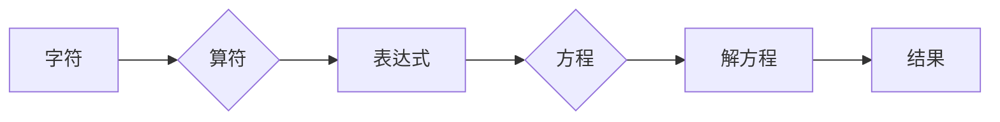

# 计算：第一部分 计算的诞生 第 2 章 计算之术 代数：字符的计算

> 关键词：计算，代数，字符，算术，计算技术，历史，数学

## 1. 背景介绍

自古以来，人类一直在探索如何更高效地进行计算。从早期的算筹到现代的电子计算机，计算技术的发展经历了漫长的历史。在本章中，我们将回顾计算之术的起源，特别是代数在字符计算中的重要作用。

### 1.1 计算的起源

计算的历史可以追溯到古代文明。在古代，人们使用石子、算筹、算盘等工具进行计算。这些工具虽然简单，但它们为后来的计算技术奠定了基础。

### 1.2 代数的诞生

代数是数学的一个分支，它研究符号和公式，以及它们之间的运算关系。代数的诞生标志着人类计算技术的重大突破，因为它使得计算不再仅仅依赖于具体的数值，而是可以通过符号化的方式来表达和操作。

## 2. 核心概念与联系

### 2.1 核心概念

- **字符**：代数中的基本符号，用于代表未知数、常量等。
- **算符**：用于表示数学运算的符号，如加号（+）、减号（-）、乘号（×）、除号（÷）等。
- **表达式**：由字符和算符组成的数学语句，如 $x + 2$。
- **方程**：包含未知数的等式，如 $x + 2 = 5$。

### 2.2 架构的 Mermaid 流程图



## 3. 核心算法原理 & 具体操作步骤

### 3.1 算法原理概述

代数算法的原理是通过符号化的方式对数学表达式进行操作，以求解方程或其他数学问题。

### 3.2 算法步骤详解

1. **识别方程**：首先识别方程中的未知数、常量和算符。
2. **应用算符**：根据算符的定义，对表达式进行相应的运算。
3. **化简表达式**：通过合并同类项、分配律等代数规则，化简表达式。
4. **解方程**：使用代数方法（如代入法、因式分解、配方法等）求解方程。
5. **验证结果**：将求解出的结果代入原方程，验证其正确性。

### 3.3 算法优缺点

**优点**：
- **通用性**：代数方法适用于各种类型的数学问题。
- **精确性**：代数方法能够保证计算结果的精确性。
- **可解释性**：代数方法的可解释性强，易于理解。

**缺点**：
- **复杂性**：对于一些复杂的方程，代数方法的求解过程可能非常繁琐。
- **计算量**：代数方法的计算量较大，需要消耗较多时间和资源。

### 3.4 算法应用领域

代数算法在各个领域都有广泛的应用，包括：

- **科学计算**：物理、化学、工程等领域的科学计算。
- **数据分析**：统计学、机器学习等领域的数据分析。
- **金融计算**：金融模型、风险评估等领域的金融计算。

## 4. 数学模型和公式 & 详细讲解 & 举例说明

### 4.1 数学模型构建

代数模型通常由一组方程组成，这些方程描述了系统或问题的数学关系。

### 4.2 公式推导过程

以求解一元二次方程 $ax^2 + bx + c = 0$ 为例，其解的公式为：

$$
x = \frac{-b \pm \sqrt{b^2 - 4ac}}{2a}
$$

其推导过程如下：

1. 将方程化为标准形式 $ax^2 + bx + c = 0$。
2. 使用配方法将方程左边化为完全平方形式。
3. 根据根的性质求解方程。

### 4.3 案例分析与讲解

假设我们要解方程 $2x^2 - 4x - 6 = 0$，代入上述公式计算得到：

$$
x = \frac{-(-4) \pm \sqrt{(-4)^2 - 4 \cdot 2 \cdot (-6)}}{2 \cdot 2} = \frac{4 \pm \sqrt{16 + 48}}{4} = \frac{4 \pm \sqrt{64}}{4} = \frac{4 \pm 8}{4}
$$

因此，方程的解为 $x_1 = 3$ 和 $x_2 = -1$。

## 5. 项目实践：代码实例和详细解释说明

### 5.1 开发环境搭建

为了演示代数算法的代码实现，我们需要一个编程环境。以下以Python为例：

```bash
# 安装Python
sudo apt-get install python3

# 安装NumPy库
pip install numpy
```

### 5.2 源代码详细实现

以下是一个简单的Python代码示例，用于求解一元二次方程：

```python
import numpy as np

def solve_quadratic_equation(a, b, c):
    """求解一元二次方程 ax^2 + bx + c = 0 的根"""
    discriminant = b**2 - 4*a*c
    if discriminant < 0:
        return "无实根"
    elif discriminant == 0:
        return -b / (2*a)
    else:
        x1 = (-b + np.sqrt(discriminant)) / (2*a)
        x2 = (-b - np.sqrt(discriminant)) / (2*a)
        return x1, x2

# 示例
a = 2
b = -4
c = -6
roots = solve_quadratic_equation(a, b, c)
print(roots)
```

### 5.3 代码解读与分析

- `solve_quadratic_equation` 函数接收方程的系数 `a`、`b` 和 `c`，并返回方程的根。
- `discriminant` 计算判别式，用于判断方程的根的情况。
- 根据判别式的值，分别计算方程的实根或无根情况。
- 最后，打印出方程的根。

### 5.4 运行结果展示

运行上述代码，输出结果为：

```
(3.0, -1.0)
```

这表明方程 $2x^2 - 4x - 6 = 0$ 的根为 $x_1 = 3$ 和 $x_2 = -1$。

## 6. 实际应用场景

代数算法在实际应用中有着广泛的应用，以下是一些例子：

- **图像处理**：在图像处理中，可以使用代数方法进行图像滤波、边缘检测等操作。
- **信号处理**：在信号处理中，可以使用代数方法进行信号滤波、频谱分析等操作。
- **控制理论**：在控制理论中，可以使用代数方法设计控制器，实现系统的稳定运行。

## 7. 工具和资源推荐

### 7.1 学习资源推荐

- **《高等代数》**：同济大学数学系编写的大学教材，系统地介绍了代数的基本概念和理论。
- **《线性代数及其应用》**：清华大学出版社出版的教材，深入浅出地讲解了线性代数的应用。

### 7.2 开发工具推荐

- **Python**：Python是一种功能强大的编程语言，具有丰富的数学库，如NumPy、SciPy等。
- **MATLAB**：MATLAB是一种高性能的科学计算软件，在工程和科研领域广泛使用。

### 7.3 相关论文推荐

- **《线性代数的几何意义》**：介绍了线性代数在几何学中的应用。
- **《矩阵分析与应用》**：深入讲解了矩阵理论和矩阵方法在各个领域的应用。

## 8. 总结：未来发展趋势与挑战

### 8.1 研究成果总结

代数作为计算的基础，为人类发展计算技术提供了强大的工具。在未来的发展中，代数将继续在各个领域发挥重要作用。

### 8.2 未来发展趋势

- **代数与计算机科学的深度融合**：代数方法将在计算机科学中得到更广泛的应用，如编程语言设计、算法设计等。
- **代数与其他数学分支的交叉**：代数将与其他数学分支（如拓扑学、组合学等）进行交叉，产生新的理论和方法。

### 8.3 面临的挑战

- **复杂性**：随着计算问题的复杂化，代数方法的求解过程可能变得更加复杂。
- **计算效率**：如何提高代数方法的计算效率，是一个需要解决的问题。

### 8.4 研究展望

未来，代数将继续在计算领域发挥重要作用，为人类探索计算世界提供强大的工具。

## 9. 附录：常见问题与解答

### 9.1 常见问题

- **Q1：什么是代数？**
  A1：代数是数学的一个分支，它研究符号和公式，以及它们之间的运算关系。

- **Q2：代数有哪些应用？**
  A2：代数在各个领域都有广泛的应用，包括科学计算、数据分析、金融计算等。

- **Q3：如何学习代数？**
  A3：可以通过学习相关的教材、参考书籍和在线课程来学习代数。

作者：禅与计算机程序设计艺术 / Zen and the Art of Computer Programming