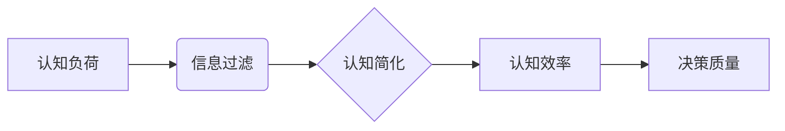

# 认知发展中的浅薄简单阶段

> 关键词：认知发展，浅薄简单，复杂系统，信息过滤，认知负荷，认知简化

## 1. 背景介绍

在计算机科学和人工智能领域，随着技术的飞速发展，我们见证了从复杂系统到简单化的转变。这种转变不仅体现在技术本身，也体现在我们的认知过程中。本文将探讨认知发展中的浅薄简单阶段，分析其背后的原理、挑战和机遇。

### 1.1 认知发展的必要性

人类认知的发展是为了更好地理解和应对复杂的世界。然而，随着信息量的爆炸式增长，人类的认知资源变得有限，因此，如何有效地过滤、处理和利用信息成为了认知发展的重要课题。

### 1.2 浅薄简单的兴起

在互联网和移动设备的普及下，我们逐渐进入了一个信息过载的时代。为了应对这种挑战，人们开始追求认知的浅薄简单。这种趋势体现在以下几个方面：

- 简化界面：为了降低用户的学习成本，软件和网站的设计越来越注重界面简洁，减少用户操作步骤。
- 快速响应：在即时通讯和社交媒体的推动下，人们追求即时满足，对信息的处理速度要求越来越高。
- 简单化决策：在信息爆炸的环境下，人们倾向于做出简单直观的决策，以减少认知负荷。

### 1.3 研究意义

探讨认知发展中的浅薄简单阶段，有助于我们：

- 理解人类认知的局限性。
- 设计更加人性化的软件和系统。
- 优化信息传播和接收方式。
- 推动人工智能技术的发展。

## 2. 核心概念与联系

### 2.1 核心概念原理

认知发展中的浅薄简单阶段涉及以下核心概念：

- **认知负荷**：指大脑在处理信息时所承受的心理负担。
- **信息过滤**：指大脑对信息进行筛选和选择的过程。
- **认知简化**：指将复杂信息简化为易于理解的形式。

### 2.2 核心概念架构

以下使用Mermaid流程图展示这些概念之间的联系：



### 2.3 核心概念应用

- **认知负荷**：在复杂系统中，过多的信息和操作步骤会导致用户认知负荷增加，从而影响决策质量。
- **信息过滤**：为了减轻认知负荷，大脑会自动过滤掉不重要的信息。
- **认知简化**：通过简化信息和界面设计，可以提高认知效率，从而提升决策质量。

## 3. 核心算法原理 & 具体操作步骤

### 3.1 算法原理概述

浅薄简单阶段的算法原理主要涉及以下几个方面：

- **简化界面设计**：通过减少用户操作步骤，降低认知负荷。
- **信息过滤算法**：利用机器学习等技术，自动筛选和推荐重要信息。
- **认知负荷管理**：通过优化算法和数据结构，减少用户在处理信息时的认知负荷。

### 3.2 算法步骤详解

#### 3.2.1 简化界面设计

1. **用户研究**：了解用户需求，收集用户反馈。
2. **简化流程**：分析现有流程，去除不必要的步骤。
3. **可视化设计**：使用图形、图标等元素，提高界面直观性。

#### 3.2.2 信息过滤算法

1. **数据收集**：收集用户行为数据，了解用户偏好。
2. **特征工程**：提取与用户偏好相关的特征。
3. **模型训练**：使用机器学习算法训练模型。
4. **信息推荐**：根据模型预测结果，推荐用户感兴趣的信息。

#### 3.2.3 认知负荷管理

1. **任务分解**：将复杂任务分解为多个子任务。
2. **进度提示**：在用户执行任务时，提供实时进度提示。
3. **反馈机制**：在用户完成任务后，提供反馈和鼓励。

### 3.3 算法优缺点

#### 3.3.1 优点

- 降低认知负荷，提高用户满意度。
- 提升信息过滤效率，帮助用户快速获取所需信息。
- 优化用户体验，提高系统可用性。

#### 3.3.2 缺点

- 可能忽略部分重要信息。
- 可能导致用户过度依赖系统。
- 算法设计复杂，需要大量数据支持。

### 3.4 算法应用领域

浅薄简单阶段的算法可以应用于以下领域：

- 软件和系统设计
- 信息推荐系统
- 教育和培训
- 医疗健康

## 4. 数学模型和公式 & 详细讲解 & 举例说明

### 4.1 数学模型构建

以下使用数学模型描述认知负荷、信息过滤和认知简化的关系：

$$
\text{认知负荷} = f(\text{信息量}, \text{信息复杂度}, \text{认知资源})
$$

其中，$f$ 为函数，表示认知负荷与信息量、信息复杂度和认知资源之间的关系。

### 4.2 公式推导过程

认知负荷的推导过程如下：

1. **信息量**：表示用户接收到的信息数量。
2. **信息复杂度**：表示信息的结构复杂程度。
3. **认知资源**：表示用户可用于处理信息的心理资源，如注意力、记忆等。

认知负荷与信息量和信息复杂度呈正相关，与认知资源呈负相关。

### 4.3 案例分析与讲解

#### 4.3.1 案例一：简化界面设计

以智能手机应用为例，通过以下步骤简化界面设计：

1. **用户研究**：通过问卷调查和访谈，了解用户对现有应用的满意度。
2. **简化流程**：删除不必要的操作步骤，如取消登录界面。
3. **可视化设计**：使用图形、图标等元素，提高界面直观性。

通过以上步骤，应用界面变得更加简洁，用户满意度得到提升。

#### 4.3.2 案例二：信息过滤算法

以新闻推荐系统为例，通过以下步骤实现信息过滤：

1. **数据收集**：收集用户阅读新闻的行为数据。
2. **特征工程**：提取与用户阅读偏好相关的特征，如新闻类型、关键词等。
3. **模型训练**：使用机器学习算法训练模型。
4. **信息推荐**：根据模型预测结果，推荐用户感兴趣的新闻。

通过以上步骤，系统能够为用户提供个性化的新闻推荐，提高用户满意度。

## 5. 项目实践：代码实例和详细解释说明

### 5.1 开发环境搭建

以下是使用Python进行信息过滤算法项目实践的步骤：

1. **安装Python环境**：Python 3.x版本，推荐使用Anaconda。
2. **安装相关库**：NumPy、Pandas、Scikit-learn等。
3. **数据准备**：收集用户阅读新闻的行为数据，包括用户ID、新闻类型、阅读时间等。

### 5.2 源代码详细实现

以下是一个简单的信息过滤算法实现示例：

```python
import pandas as pd
from sklearn.feature_extraction.text import TfidfVectorizer
from sklearn.svm import SVC
from sklearn.pipeline import Pipeline

# 读取数据
data = pd.read_csv('news_data.csv')

# 特征提取
vectorizer = TfidfVectorizer()
X = vectorizer.fit_transform(data['content'])

# 模型训练
clf = SVC()
clf.fit(X, data['label'])

# 模型保存
from joblib import dump
dump(clf, 'news_filter_model.joblib')
```

### 5.3 代码解读与分析

上述代码首先使用TfidfVectorizer提取新闻文本的特征，然后使用SVM模型进行分类，最后将模型保存到文件中。

### 5.4 运行结果展示

通过运行上述代码，可以得到一个能够根据用户阅读偏好推荐新闻的模型。在实际应用中，可以通过以下步骤进行测试：

1. 加载模型。
2. 将用户阅读的新闻内容进行特征提取。
3. 使用模型进行预测，得到推荐结果。

## 6. 实际应用场景

浅薄简单阶段的算法在以下场景中具有广泛应用：

- **电子商务**：根据用户浏览和购买历史，推荐个性化的商品。
- **社交媒体**：根据用户兴趣，推荐关注的人和内容。
- **在线教育**：根据学生学习情况，推荐适合的学习资源。
- **医疗健康**：根据患者病史和检查结果，推荐治疗方案。

### 6.4 未来应用展望

随着人工智能技术的不断发展，认知发展中的浅薄简单阶段将在以下方面得到进一步应用：

- **智能助手**：提供更加智能、个性化的服务。
- **智慧城市**：优化城市管理，提高居民生活质量。
- **智能制造**：提高生产效率，降低生产成本。
- **智能医疗**：辅助医生诊断，提高医疗水平。

## 7. 工具和资源推荐

### 7.1 学习资源推荐

- 《认知心理学导论》
- 《人机交互设计》
- 《Python数据科学手册》

### 7.2 开发工具推荐

- **数据分析**：NumPy、Pandas
- **机器学习**：Scikit-learn、TensorFlow、PyTorch
- **信息可视化**：Matplotlib、Seaborn

### 7.3 相关论文推荐

- 《The Attention Is All You Need》
- 《BERT: Pre-training of Deep Bidirectional Transformers for Language Understanding》
- 《Deep Learning for Information Filtering and Retrieval》

## 8. 总结：未来发展趋势与挑战

### 8.1 研究成果总结

本文探讨了认知发展中的浅薄简单阶段，分析了其背后的原理、挑战和机遇。通过简化界面设计、信息过滤和认知负荷管理，我们可以降低用户的认知负荷，提高系统可用性和用户体验。

### 8.2 未来发展趋势

随着人工智能技术的不断发展，认知发展中的浅薄简单阶段将在以下方面得到进一步发展：

- **更加智能的算法**：通过机器学习等技术，提高信息过滤的准确性和个性化程度。
- **更加直观的界面设计**：利用虚拟现实、增强现实等技术，提供更加沉浸式的用户体验。
- **更加高效的信息处理**：通过优化算法和数据结构，提高信息处理速度和效率。

### 8.3 面临的挑战

认知发展中的浅薄简单阶段在以下方面面临挑战：

- **信息过载**：随着信息量的增加，如何有效地过滤和筛选信息成为一个难题。
- **数据隐私**：在提供个性化服务的同时，如何保护用户隐私成为一个重要问题。
- **算法偏见**：算法模型可能会存在偏见，导致不公平的结果。

### 8.4 研究展望

为了应对挑战，未来的研究需要：

- **开发更加智能的算法**：提高信息过滤的准确性和个性化程度。
- **加强数据隐私保护**：在提供个性化服务的同时，保护用户隐私。
- **消除算法偏见**：避免算法模型存在偏见，确保公平公正。

通过不断努力，相信认知发展中的浅薄简单阶段将在人工智能领域发挥越来越重要的作用，为人类社会带来更多便利和福祉。

## 9. 附录：常见问题与解答

**Q1：什么是认知负荷？**

A：认知负荷是指大脑在处理信息时所承受的心理负担。当认知负荷过高时，会影响人的注意力和判断力，从而降低工作效率。

**Q2：如何降低认知负荷？**

A：可以通过简化界面设计、优化信息结构、提供进度提示等方式降低认知负荷。

**Q3：什么是信息过滤？**

A：信息过滤是指从大量信息中筛选和选择出与用户需求相关的信息。

**Q4：如何进行信息过滤？**

A：可以使用机器学习等技术，根据用户偏好和特征进行信息过滤。

**Q5：认知发展中的浅薄简单阶段有哪些应用场景？**

A：认知发展中的浅薄简单阶段可以应用于电子商务、社交媒体、在线教育、医疗健康等领域。

作者：禅与计算机程序设计艺术 / Zen and the Art of Computer Programming