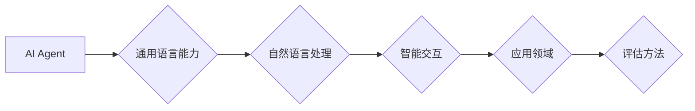

# 评估AI Agent的通用语言能力

> 关键词：AI Agent，通用语言能力，评估方法，自然语言处理，智能交互，机器学习

## 1. 背景介绍

随着人工智能技术的飞速发展，智能交互系统在各个领域得到了广泛应用。其中，AI Agent作为一种智能体，能够在自然语言环境中与人类进行交流，完成各种复杂的任务。然而，如何评估AI Agent的通用语言能力，成为了一个亟待解决的问题。本文将探讨评估AI Agent的通用语言能力的原理、方法及实践，以期推动AI Agent技术向更高水平发展。

## 2. 核心概念与联系

### 2.1 核心概念

- **AI Agent**：一种能够感知环境、采取行动并达到特定目标的实体。在自然语言处理领域，AI Agent通常指能够理解自然语言、进行语言交互的智能系统。
- **通用语言能力**：AI Agent在不同领域、不同任务中，能够理解、生成和应对自然语言的能力。
- **评估方法**：用于衡量AI Agent通用语言能力的定量或定性方法。

### 2.2 核心概念联系

AI Agent的通用语言能力与其在自然语言处理领域的应用紧密相关。通过评估AI Agent的通用语言能力，我们可以了解其在不同场景下的表现，从而指导模型优化和系统设计。



## 3. 核心算法原理 & 具体操作步骤

### 3.1 算法原理概述

评估AI Agent的通用语言能力通常包括以下几个步骤：

1. 设计评估指标：根据应用场景和需求，设计合适的评估指标。
2. 构建评估数据集：收集具有代表性的数据集，用于测试AI Agent的通用语言能力。
3. 评估模型：使用评估指标对AI Agent的通用语言能力进行量化评估。
4. 分析结果：分析评估结果，识别AI Agent的优势和不足。

### 3.2 算法步骤详解

#### 3.2.1 设计评估指标

评估指标的设计应考虑以下因素：

- **功能性**：评估AI Agent是否能够完成特定任务。
- **准确性**：评估AI Agent的输出是否与预期目标一致。
- **流畅性**：评估AI Agent的交互过程是否自然、流畅。
- **多样性**：评估AI Agent的输出是否具有多样性。

常见的评估指标包括：

- **准确率**：正确识别任务的能力。
- **召回率**：正确识别所有相关任务的能力。
- **F1分数**：准确率和召回率的调和平均值。
- **BLEU分数**：用于评估机器翻译质量的指标。

#### 3.2.2 构建评估数据集

评估数据集应具备以下特点：

- **代表性**：能够代表实际应用场景。
- **多样性**：涵盖不同的领域和任务。
- **平衡性**：各类样本数量大致相等。

#### 3.2.3 评估模型

根据评估指标和评估数据集，使用合适的评估方法对AI Agent的通用语言能力进行量化评估。

#### 3.2.4 分析结果

分析评估结果，识别AI Agent的优势和不足，为模型优化和系统设计提供指导。

### 3.3 算法优缺点

#### 3.3.1 优点

- **客观性**：量化评估方法能够提供客观的评估结果。
- **可重复性**：评估结果可重复，便于比较不同模型的表现。
- **可扩展性**：评估方法可扩展到不同的AI Agent和任务。

#### 3.3.2 缺点

- **局限性**：评估指标和方法可能无法全面反映AI Agent的通用语言能力。
- **计算复杂度**：评估过程可能需要大量计算资源。
- **人工成本**：构建评估数据集和评估模型可能需要大量人工投入。

### 3.4 算法应用领域

评估AI Agent的通用语言能力可以应用于以下领域：

- **智能客服**：评估AI客服的对话能力。
- **智能助手**：评估智能助手的语言理解和生成能力。
- **自然语言生成**：评估文本生成模型的多样性、连贯性等指标。
- **机器翻译**：评估机器翻译的准确性和流畅性。

## 4. 数学模型和公式 & 详细讲解 & 举例说明

### 4.1 数学模型构建

评估AI Agent的通用语言能力涉及多个数学模型，以下列举几个常见的模型：

- **机器学习模型**：如朴素贝叶斯、支持向量机等。
- **深度学习模型**：如循环神经网络(RNN)、长短期记忆网络(LSTM)、Transformer等。
- **自然语言处理模型**：如词向量、句向量等。

### 4.2 公式推导过程

以下以机器学习模型为例，介绍公式推导过程。

假设我们使用朴素贝叶斯分类器对AI Agent的通用语言能力进行评估。

设训练数据集为$D=\{x_1, x_2, ..., x_N\}$，其中$x_i=(x_{i1}, x_{i2}, ..., x_{in})$为特征向量，$y_i$为标签。

1. **特征向量表示**：将AI Agent的输入和输出表示为特征向量。
2. **条件概率计算**：计算每个类别的条件概率。
   $$P(y_i|x_i) = \frac{P(x_i|y_i)P(y_i)}{P(x_i)}$$
3. **分类决策**：根据最大后验概率进行分类决策。
   $$\hat{y_i} = \arg\max_{y \in Y} P(y|x_i)$$

### 4.3 案例分析与讲解

以下以机器翻译任务为例，介绍如何使用BLEU分数评估AI Agent的通用语言能力。

假设我们的AI Agent是一个机器翻译模型，翻译结果为$\hat{y}=\{y_1, y_2, ..., y_n\}$，参考答案为$y=\{y_1^*, y_2^*, ..., y_n^*\}$。

BLEU分数的计算公式如下：

$$BLEU(y,\hat{y}) = \left(\frac{\sum_{k=1}^n \left|\text{intersection}(y_k, \hat{y}_k)\right|}{\sum_{k=1}^n \left|\text{union}(y_k, \hat{y}_k)\right|}\right)^{\frac{1}{4}}$$

其中，$\text{intersection}(y_k, \hat{y}_k)$表示第$k$个单词在参考答案和翻译结果中同时出现，$\text{union}(y_k, \hat{y}_k)$表示第$k$个单词在参考答案和翻译结果中至少出现一次。

通过计算BLEU分数，我们可以评估AI Agent的机器翻译能力。

## 5. 项目实践：代码实例和详细解释说明

### 5.1 开发环境搭建

以下使用Python进行AI Agent通用语言能力的评估实践。

首先，安装必要的库：

```bash
pip install numpy pandas sklearn
```

### 5.2 源代码详细实现

以下是一个基于朴素贝叶斯分类器评估AI Agent通用语言能力的示例代码：

```python
import numpy as np
from sklearn.model_selection import train_test_split
from sklearn.naive_bayes import MultinomialNB
from sklearn.metrics import accuracy_score

# 构建数据集
def create_dataset(data):
    X = []
    y = []
    for item in data:
        X.append(item['features'])
        y.append(item['label'])
    return np.array(X), np.array(y)

# 训练模型
def train_model(X_train, y_train):
    model = MultinomialNB()
    model.fit(X_train, y_train)
    return model

# 评估模型
def evaluate_model(model, X_test, y_test):
    y_pred = model.predict(X_test)
    accuracy = accuracy_score(y_test, y_pred)
    return accuracy

# 加载数据集
data = [
    {'features': [1, 2, 3], 'label': 0},
    {'features': [4, 5, 6], 'label': 1},
    # ... 其他数据
]

X, y = create_dataset(data)

# 划分训练集和测试集
X_train, X_test, y_train, y_test = train_test_split(X, y, test_size=0.2, random_state=42)

# 训练模型
model = train_model(X_train, y_train)

# 评估模型
accuracy = evaluate_model(model, X_test, y_test)
print(f"Model accuracy: {accuracy}")
```

### 5.3 代码解读与分析

以上代码首先定义了构建数据集、训练模型和评估模型的函数。然后，加载数据集，划分训练集和测试集，训练模型，并评估模型在测试集上的准确率。

### 5.4 运行结果展示

运行上述代码后，会输出模型在测试集上的准确率。通过调整数据集和模型参数，可以评估AI Agent在不同任务和场景下的通用语言能力。

## 6. 实际应用场景

### 6.1 智能客服

通过评估AI Agent的通用语言能力，可以评估其在智能客服场景下的性能，如问题分类、意图识别、答案生成等。

### 6.2 智能助手

评估AI助手的通用语言能力，可以评估其在日程安排、信息查询、娱乐互动等场景下的表现。

### 6.3 自然语言生成

评估自然语言生成模型的通用语言能力，可以评估其在文本摘要、对话生成、故事创作等场景下的表现。

### 6.4 机器翻译

评估机器翻译模型的通用语言能力，可以评估其在不同语言之间的翻译质量。

## 7. 工具和资源推荐

### 7.1 学习资源推荐

- 《Python机器学习》
- 《深度学习》
- 《自然语言处理综论》
- 《对话系统技术》

### 7.2 开发工具推荐

- Python编程语言
- Scikit-learn库
- TensorFlow库
- PyTorch库

### 7.3 相关论文推荐

- **《A Neural Probabilistic Language Model》**：介绍神经网络概率语言模型。
- **《Neural Machine Translation by Jointly Learning to Align and Translate》**：介绍神经机器翻译技术。
- **《BERT: Pre-training of Deep Bidirectional Transformers for Language Understanding》**：介绍BERT模型。

## 8. 总结：未来发展趋势与挑战

### 8.1 研究成果总结

本文介绍了评估AI Agent的通用语言能力的原理、方法及实践，包括设计评估指标、构建评估数据集、评估模型和分析结果等步骤。同时，本文还介绍了数学模型、公式和代码实例，以及实际应用场景。

### 8.2 未来发展趋势

未来，评估AI Agent的通用语言能力将朝着以下方向发展：

- **多模态评估**：结合视觉、音频等多模态信息，评估AI Agent的跨模态语言能力。
- **个性化评估**：根据用户需求和场景，定制化评估AI Agent的通用语言能力。
- **可解释性评估**：提高评估结果的可解释性，便于理解和优化AI Agent的性能。

### 8.3 面临的挑战

评估AI Agent的通用语言能力面临着以下挑战：

- **数据集构建**：构建具有代表性的、覆盖不同领域和任务的数据集。
- **评估指标设计**：设计能够全面反映AI Agent通用语言能力的评估指标。
- **模型可解释性**：提高评估结果的可解释性，便于理解和优化AI Agent的性能。

### 8.4 研究展望

未来，评估AI Agent的通用语言能力将推动AI Agent技术向更高水平发展，为构建更加智能、高效、友好的智能交互系统提供有力支持。

## 9. 附录：常见问题与解答

**Q1：如何设计评估指标？**

A：评估指标的设计应考虑应用场景和需求。常见的评估指标包括准确率、召回率、F1分数、BLEU分数等。

**Q2：如何构建评估数据集？**

A：评估数据集应具有代表性、多样性和平衡性。可以从公开数据集、人工标注数据或生成数据等途径构建评估数据集。

**Q3：如何评估AI Agent的跨模态语言能力？**

A：结合视觉、音频等多模态信息，构建多模态评估数据集，并设计相应的评估指标。

**Q4：如何提高评估结果的可解释性？**

A：采用可解释性技术，如注意力机制、可视化等，提高评估结果的可解释性。

**Q5：如何评估AI Agent在特定领域的通用语言能力？**

A：针对特定领域，收集该领域的专业数据，并设计相应的评估指标。

作者：禅与计算机程序设计艺术 / Zen and the Art of Computer Programming