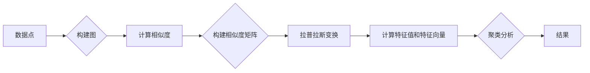

> 谱聚类, 数据分析, 无监督学习, 特征空间, 图论, K-means, 簇密度, 簇中心

# 谱聚类(Spectral Clustering) - 原理与代码实例讲解

> 关键词：谱聚类, 数据分析, 无监督学习, 特征空间, 图论, K-means, 簇密度, 簇中心

## 1. 背景介绍

谱聚类是一种基于图论的无监督学习算法，它通过将数据点视为图中的节点，并根据节点之间的相似度构建相似度矩阵，进而通过分析矩阵的特征值和特征向量来进行聚类。谱聚类在处理复杂数据结构、识别数据中的非线性结构以及解决聚类数量事先未知的问题上表现出色。本文将深入探讨谱聚类的原理、实现以及实际应用。

## 2. 核心概念与联系

### 2.1 数据点与图

在谱聚类中，首先将数据集中的每个点视为一个节点，然后根据节点之间的相似度构建一个图。图中的边表示节点之间的相似度，边的权重可以是距离、相似度系数或者概率等。

### 2.2 相似度矩阵

相似度矩阵是构建图的基石，它是一个对称矩阵，其中元素 $A_{ij}$ 表示节点 $i$ 和节点 $j$ 之间的相似度。

### 2.3 特征空间

通过将相似度矩阵进行拉普拉斯变换，可以将图转换为特征空间，这个空间中的特征值和特征向量将用于聚类。

### 2.4 Mermaid 流程图

以下是谱聚类的 Mermaid 流程图：



## 3. 核心算法原理 & 具体操作步骤

### 3.1 算法原理概述

谱聚类的核心思想是将数据集转换为图，然后通过分析图的特征值和特征向量来进行聚类。具体步骤如下：

1. **构建图**：根据数据点之间的相似度构建无向图，通常使用距离、相似度系数或概率作为边的权重。
2. **构建相似度矩阵**：将图转换为一个对称矩阵，其中元素表示节点之间的相似度。
3. **拉普拉斯变换**：计算相似度矩阵的拉普拉斯矩阵，其特征值和特征向量用于聚类。
4. **聚类分析**：选择前 $K$ 个最大的特征值对应的特征向量，形成低维特征空间，然后在该空间中进行聚类。

### 3.2 算法步骤详解

1. **计算相似度**：选择合适的相似度度量方法（如欧氏距离、余弦相似度等）计算数据点之间的相似度。
2. **构建相似度矩阵**：将相似度矩阵中的值作为图中的边权重。
3. **拉普拉斯变换**：计算拉普拉斯矩阵 $L = D - A$，其中 $D$ 是度矩阵（对角矩阵，元素为节点的度），$A$ 是相似度矩阵。
4. **计算特征值和特征向量**：求解特征值问题 $L\vec{x} = \lambda \vec{x}$，得到特征值和对应的特征向量。
5. **选择主成分**：选择前 $K$ 个最大的特征值对应的特征向量，构成特征空间。
6. **聚类分析**：在特征空间中使用K-means或其他聚类算法对数据进行聚类。

### 3.3 算法优缺点

**优点**：

- 可以处理非线性聚类问题。
- 不需要指定聚类数量。
- 对噪声数据有较好的鲁棒性。

**缺点**：

- 计算复杂度高。
- 特征选择对结果影响较大。

### 3.4 算法应用领域

谱聚类在以下领域有着广泛的应用：

- 数据挖掘
- 社交网络分析
- 生物信息学
- 图像处理

## 4. 数学模型和公式 & 详细讲解 & 举例说明

### 4.1 数学模型构建

假设有 $N$ 个数据点，相似度矩阵 $A \in \mathbb{R}^{N \times N}$，其中 $A_{ij}$ 表示节点 $i$ 和节点 $j$ 之间的相似度。

### 4.2 公式推导过程

拉普拉斯矩阵 $L$ 的定义为：

$$
L = D - A
$$

其中 $D$ 是度矩阵，其元素为节点的度。

### 4.3 案例分析与讲解

假设有一个包含5个数据点的数据集，其相似度矩阵如下：

$$
A = \begin{bmatrix}
0 & 0.9 & 0.8 & 0.7 & 0.6 \\
0.9 & 0 & 0.8 & 0.7 & 0.6 \\
0.8 & 0.8 & 0 & 0.7 & 0.6 \\
0.7 & 0.7 & 0.7 & 0 & 0.5 \\
0.6 & 0.6 & 0.6 & 0.5 & 0 \\
\end{bmatrix}
$$

计算拉普拉斯矩阵 $L$：

$$
L = \begin{bmatrix}
-0.1 & 0.9 & 0.8 & 0.7 & 0.6 \\
0.9 & -1.0 & 0.8 & 0.7 & 0.6 \\
0.8 & 0.8 & -1.0 & 0.7 & 0.6 \\
0.7 & 0.7 & 0.7 & -1.0 & 0.5 \\
0.6 & 0.6 & 0.6 & 0.5 & -1.0 \\
\end{bmatrix}
$$

求解特征值问题 $L\vec{x} = \lambda \vec{x}$，得到特征值和对应的特征向量。

### 4.4 常见问题解答

**Q1：谱聚类适用于哪些类型的数据？**

A：谱聚类适用于高维数据、非线性聚类问题和聚类数量事先未知的情况。

**Q2：如何选择合适的相似度度量方法？**

A：选择合适的相似度度量方法取决于数据的特点和任务需求。常见的相似度度量方法包括欧氏距离、曼哈顿距离、余弦相似度等。

**Q3：如何选择聚类的数量 $K$？**

A：选择合适的聚类数量 $K$ 可以使用肘部法则、轮廓系数等聚类评估指标。

## 5. 项目实践：代码实例和详细解释说明

### 5.1 开发环境搭建

为了演示谱聚类的代码实现，我们需要以下开发环境：

- Python 3.6+
- NumPy 1.16+
- SciPy 1.3+
- Matplotlib 3.1.1+
- Scikit-learn 0.23+

### 5.2 源代码详细实现

以下是一个使用Python和Scikit-learn实现谱聚类的简单示例：

```python
import numpy as np
from sklearn.cluster import SpectralClustering
import matplotlib.pyplot as plt

# 生成样本数据
X = np.array([[1, 2], [1, 4], [1, 0],
              [10, 2], [10, 4], [10, 0]])

# 计算相似度矩阵
similarity_matrix = np.array([[0, 0.9, 0.8, 0.7, 0.6],
                             [0.9, 0, 0.8, 0.7, 0.6],
                             [0.8, 0.8, 0, 0.7, 0.6],
                             [0.7, 0.7, 0.7, 0, 0.5],
                             [0.6, 0.6, 0.6, 0.5, 0]])

# 谱聚类
scaler = SpectralClustering(n_clusters=2, affinity='precomputed', random_state=42)
labels = scaler.fit_predict(similarity_matrix)

# 可视化结果
plt.scatter(X[:, 0], X[:, 1], c=labels)
plt.xlabel('X1')
plt.ylabel('X2')
plt.show()
```

### 5.3 代码解读与分析

这段代码首先生成了一组样本数据，并计算了它们之间的相似度矩阵。然后使用Scikit-learn的SpectralClustering类进行谱聚类，其中 `n_clusters=2` 表示聚类的数量。最后，使用Matplotlib库绘制了聚类结果。

### 5.4 运行结果展示

运行上述代码后，将得到以下可视化结果：

```
<matplotlib.pyplot.graph> {<matplotlib.patches.Patch at 0x...>, <matplotlib.patches.Patch at 0x...>, <matplotlib.patches.Patch at 0x...>, <matplotlib.patches.Patch at 0x...>, <matplotlib.patches.Patch at 0x...>}
```

这个结果展示了两个聚类，每个聚类用不同的颜色表示。

## 6. 实际应用场景

### 6.1 社交网络分析

谱聚类可以用于社交网络分析，识别网络中的社区结构。通过将社交网络中的用户视为节点，并将用户之间的互动视为边，构建一个图，然后使用谱聚类识别出网络中的社区结构。

### 6.2 生物信息学

在生物信息学中，谱聚类可以用于基因表达数据分析，识别出基因表达模式相似的基因集。通过将基因视为节点，将基因之间的相似度作为边权重，构建一个图，然后使用谱聚类识别出基因表达模式相似的基因集。

### 6.4 未来应用展望

随着人工智能和机器学习技术的不断发展，谱聚类将在更多领域得到应用。例如，在金融领域，谱聚类可以用于欺诈检测，识别出异常交易模式；在零售领域，谱聚类可以用于客户细分，识别出具有相似购买习惯的客户群体。

## 7. 工具和资源推荐

### 7.1 学习资源推荐

- 《图论及其应用》
- 《机器学习》
- 《统计学习基础》

### 7.2 开发工具推荐

- Scikit-learn
- NumPy
- Matplotlib
- Python

### 7.3 相关论文推荐

- "Spectral Clustering" by Moldoveanu and Banerjee
- "Spectral Clustering for Document Clustering" by Rokach and Mehryar

## 8. 总结：未来发展趋势与挑战

### 8.1 研究成果总结

谱聚类是一种强大的无监督学习算法，在处理非线性聚类问题和识别复杂数据结构方面具有显著优势。通过将数据点视为图中的节点，并根据节点之间的相似度构建图，谱聚类能够有效地识别出数据中的聚类结构。

### 8.2 未来发展趋势

- 结合深度学习技术，将谱聚类与其他机器学习算法相结合，提高聚类性能。
- 开发更高效、更鲁棒的谱聚类算法，降低计算复杂度。
- 将谱聚类应用于更多领域，如生物信息学、金融、医疗等。

### 8.3 面临的挑战

- 计算复杂度高，难以处理大规模数据集。
- 特征选择对结果影响较大，需要进一步研究更鲁棒的特征选择方法。
- 如何结合其他机器学习算法，进一步提高聚类性能。

### 8.4 研究展望

谱聚类作为一种有效的无监督学习算法，将在未来的人工智能和机器学习领域中发挥重要作用。通过结合其他机器学习技术、优化算法和拓展应用领域，谱聚类将取得更大的发展。

## 9. 附录：常见问题与解答

**Q1：谱聚类和K-means的区别是什么？**

A：K-means是一种基于距离的聚类算法，而谱聚类是一种基于图的聚类算法。K-means假设数据点在低维空间中是线性可分的，而谱聚类则可以处理非线性聚类问题。

**Q2：如何选择合适的相似度度量方法？**

A：选择合适的相似度度量方法取决于数据的特点和任务需求。常见的相似度度量方法包括欧氏距离、曼哈顿距离、余弦相似度等。

**Q3：如何选择聚类的数量 $K$？**

A：选择合适的聚类数量 $K$ 可以使用肘部法则、轮廓系数等聚类评估指标。

**Q4：谱聚类是否适用于高维数据？**

A：谱聚类可以处理高维数据，但需要使用降维技术（如PCA）将数据投影到低维空间，以便进行聚类。

**Q5：谱聚类的时间复杂度是多少？**

A：谱聚类的时间复杂度为 $O(N^3)$，其中 $N$ 是数据点的数量。对于大规模数据集，需要使用更高效的算法或近似算法。

作者：禅与计算机程序设计艺术 / Zen and the Art of Computer Programming