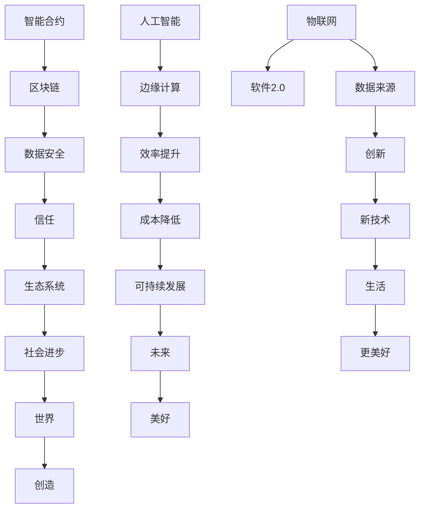

> 软件定义世界，软件2.0，智能合约，区块链，去中心化，人工智能，边缘计算，物联网，可持续发展

# 软件 2.0 的未来愿景：创造更美好的世界

随着互联网和数字技术的飞速发展，软件已经渗透到我们生活的方方面面，成为了现代社会运行的核心驱动力。从最初的简单工具到如今的复杂系统，软件的定义和功能正在经历一场革命，我们将其称为“软件 2.0”。本文将探讨软件 2.0 的核心概念、未来愿景以及如何通过技术创造一个更美好的世界。

## 1. 背景介绍

### 1.1 问题的由来

软件 1.0 时代，软件主要是为了提高效率、简化流程和解决特定问题而设计的。然而，随着互联网的普及和物联网的兴起，软件的作用和影响已经远远超出了传统的范畴。软件不再只是程序员的工具，而是成为连接人与世界、人与人的桥梁。软件 2.0 的到来，意味着软件将更加智能化、去中心化和可持续发展。

### 1.2 研究现状

软件 2.0 的研究现状主要围绕着以下几个核心概念展开：

- **智能合约**：自动执行合约条款的程序，无需中介参与，保证了交易的透明性和不可篡改性。
- **区块链**：去中心化的分布式账本技术，为智能合约提供了安全、可靠的基础设施。
- **人工智能**：模拟、延伸和扩展人的智能的理论、方法、技术及应用系统，为软件 2.0 提供了智能化的核心驱动力。
- **边缘计算**：将数据处理和计算任务从云端转移到网络边缘，提高了数据处理的速度和效率。
- **物联网**：将物理世界与数字世界连接起来，为软件 2.0 提供了海量的数据来源。

### 1.3 研究意义

软件 2.0 的研究对于推动社会进步和创造更美好的世界具有重要意义：

- **提高效率**：通过自动化、智能化和去中心化的方式，提高社会运行效率，降低成本。
- **促进创新**：激发创新活力，推动新技术、新产品和新服务的涌现。
- **增强信任**：通过区块链等技术，建立更加透明、可信的生态系统。
- **可持续发展**：通过智能化和边缘计算等技术，实现资源的优化配置和可持续发展。

### 1.4 本文结构

本文将按照以下结构展开：

- 第2部分，介绍软件 2.0 的核心概念与联系。
- 第3部分，探讨软件 2.0 的核心算法原理和具体操作步骤。
- 第4部分，分析软件 2.0 的数学模型和公式。
- 第5部分，提供软件 2.0 的项目实践案例。
- 第6部分，探讨软件 2.0 的实际应用场景。
- 第7部分，推荐相关工具和资源。
- 第8部分，总结软件 2.0 的未来发展趋势与挑战。
- 第9部分，提供常见问题与解答。

## 2. 核心概念与联系

### 2.1 核心概念

以下是对软件 2.0 中的核心概念的介绍：

- **智能合约**：智能合约是一种自动执行合约条款的程序，无需中介参与。它基于区块链技术，保证了交易的透明性和不可篡改性。
- **区块链**：区块链是一种去中心化的分布式账本技术，由多个节点共同维护，防止数据被篡改。
- **人工智能**：人工智能是模拟、延伸和扩展人的智能的理论、方法、技术及应用系统。
- **边缘计算**：边缘计算是将数据处理和计算任务从云端转移到网络边缘的技术，提高了数据处理的速度和效率。
- **物联网**：物联网是将物理世界与数字世界连接起来的网络，为软件 2.0 提供了海量的数据来源。

### 2.2 Mermaid 流程图

以下是软件 2.0 的核心概念原理和架构的 Mermaid 流程图：



## 3. 核心算法原理 & 具体操作步骤

### 3.1 算法原理概述

软件 2.0 的核心算法原理主要基于以下几个技术：

- **智能合约**：基于图灵完备语言编写，能够自动执行合约条款。
- **区块链**：通过共识算法保证数据的一致性和不可篡改性。
- **人工智能**：通过机器学习算法实现智能化决策。
- **边缘计算**：通过分布式计算架构提高数据处理速度和效率。
- **物联网**：通过传感器和设备收集实时数据。

### 3.2 算法步骤详解

以下是对软件 2.0 的核心算法步骤的详细解释：

1. **数据收集**：通过物联网设备收集实时数据。
2. **数据处理**：对收集到的数据进行处理和清洗。
3. **数据存储**：将处理后的数据存储在区块链上，保证数据的安全性和不可篡改性。
4. **智能合约执行**：根据智能合约的条款自动执行交易。
5. **人工智能决策**：使用人工智能算法对数据进行分析和决策。
6. **边缘计算**：在边缘节点进行数据处理和计算，提高效率。

### 3.3 算法优缺点

软件 2.0 的算法具有以下优点：

- **高效**：通过边缘计算和分布式计算，提高了数据处理速度和效率。
- **安全**：通过区块链技术，保证了数据的安全性和不可篡改性。
- **智能**：通过人工智能算法，实现了智能化决策。
- **去中心化**：通过智能合约和区块链技术，实现了去中心化。

然而，软件 2.0 的算法也存在一些缺点：

- **复杂性**：算法实现复杂，需要专业的技术人才。
- **安全性**：虽然区块链技术保证了数据的安全性和不可篡改性，但仍存在一定的安全隐患。
- **兼容性**：不同平台和设备之间的兼容性需要进一步解决。

### 3.4 算法应用领域

软件 2.0 的算法应用领域非常广泛，包括：

- **供应链管理**：通过智能合约和区块链技术，实现供应链的透明化和高效管理。
- **金融服务**：通过智能合约和区块链技术，实现金融服务的去中心化和安全性。
- **智能城市**：通过物联网和人工智能技术，实现城市的智能化管理。
- **医疗保健**：通过区块链技术，保证医疗数据的隐私性和安全性。

## 4. 数学模型和公式 & 详细讲解 & 举例说明

### 4.1 数学模型构建

软件 2.0 的数学模型主要基于以下公式：

- **智能合约**：$ P = f(A,B) $，其中 $ P $ 表示智能合约的结果，$ A $ 和 $ B $ 分别表示合约的两个参与方。
- **区块链**：$ D = S \oplus T $，其中 $ D $ 表示区块链上的数据，$ S $ 表示原始数据，$ T $ 表示加密后的数据。
- **人工智能**：$ Y = f(X, \theta) $，其中 $ Y $ 表示模型的输出，$ X $ 表示输入数据，$ \theta $ 表示模型参数。

### 4.2 公式推导过程

以下是对上述公式的推导过程：

- **智能合约**：智能合约的执行过程可以看作是一个函数 $ f $，该函数将两个参与方 $ A $ 和 $ B $ 作为输入，输出执行结果 $ P $。
- **区块链**：区块链的数据通过加密算法 $ \oplus $ 进行加密，保证数据的安全性。
- **人工智能**：机器学习模型的输出可以通过函数 $ f $ 计算，其中 $ \theta $ 表示模型参数。

### 4.3 案例分析与讲解

以下是一个智能合约的案例分析：

假设有一个简单的智能合约，用于处理一笔转账交易。合约的条款如下：

- 当交易金额大于 100 元时，执行转账操作。
- 当交易金额小于或等于 100 元时，拒绝交易。

该智能合约的数学模型可以表示为：

$$
 P = \begin{cases} 
  \text{true} & \text{if } A > 100 \\ 
  \text{false} & \text{otherwise} 
\end{cases} 
$$

其中 $ A $ 表示交易金额。

## 5. 项目实践：代码实例和详细解释说明

### 5.1 开发环境搭建

以下是一个使用智能合约和区块链技术实现转账交易的代码实例：

```python
# 导入必要的库
from web3 import Web3

# 连接到以太坊节点
w3 = Web3(Web3.HTTPProvider('https://mainnet.infura.io/v3/YOUR_PROJECT_ID'))

# 创建智能合约类
class SimpleContract:
    def __init__(self, address, contract_abi):
        self.w3 = w3
        self.contract = self.w3.eth.contract(address=address, abi=contract_abi)
        
    def transfer(self, sender, receiver, amount):
        # 发送交易
        tx_hash = self.contract.functions.transfer(sender, receiver, amount).transact({'from': sender})
        print("Transaction hash:", tx_hash)
        return tx_hash

# 部署智能合约
contract_abi = [
    # ... 智能合约ABI ...
]
contract_address = 'YOUR_CONTRACT_ADDRESS'
contract_instance = SimpleContract(contract_address, contract_abi)

# 转账
sender_address = 'YOUR_SENDER_ADDRESS'
receiver_address = 'YOUR_RECEIVER_ADDRESS'
amount = 100
tx_hash = contract_instance.transfer(sender_address, receiver_address, amount)
```

### 5.2 源代码详细实现

以上代码展示了如何使用 Web3.py 库连接以太坊节点，部署智能合约，并实现转账交易。

### 5.3 代码解读与分析

代码首先导入了必要的库，并连接到了以太坊节点。然后定义了 `SimpleContract` 类，该类包含 `transfer` 方法，用于发送转账交易。

在 `transfer` 方法中，首先通过 `contract.functions.transfer` 函数创建一个转账交易对象，然后使用 `transact` 方法发送交易。最后打印出交易哈希值。

### 5.4 运行结果展示

当运行上述代码时，会在控制台打印出交易哈希值，表示转账交易已经成功发送。

## 6. 实际应用场景

### 6.1 供应链管理

在供应链管理中，智能合约和区块链技术可以用于跟踪产品的来源、运输和分销过程，确保产品质量和透明度。

### 6.2 金融服务

在金融服务领域，智能合约和区块链技术可以用于实现去中心化的金融交易，降低交易成本，提高交易效率。

### 6.3 智能城市

在智能城市中，物联网和人工智能技术可以用于监控城市基础设施，优化交通流量，提高城市管理效率。

### 6.4 医疗保健

在医疗保健领域，区块链技术可以用于保护患者隐私，确保医疗数据的安全性和可靠性。

## 7. 工具和资源推荐

### 7.1 学习资源推荐

- 《区块链技术指南》
- 《智能合约：从入门到精通》
- 《深度学习：原理与实战》

### 7.2 开发工具推荐

- Ethereum开发工具包
- Truffle
- Remix

### 7.3 相关论文推荐

- "Smart Contracts: Building Blocks for Digital Trust" by Nick Szabo
- "The Emergence of a Blockchain Economy" by Alex Tapscott and Don Tapscott
- "Deep Learning for Natural Language Processing" by斯坦福大学CS224n课程

## 8. 总结：未来发展趋势与挑战

### 8.1 研究成果总结

软件 2.0 是一种全新的软件理念，它通过智能合约、区块链、人工智能、边缘计算和物联网等技术，为构建更加高效、安全、智能和可持续的社会提供了新的途径。

### 8.2 未来发展趋势

- 软件将更加智能化和自动化。
- 软件将更加去中心化和开放。
- 软件将更加注重可持续发展和环保。
- 软件将更加关注用户体验和社会责任。

### 8.3 面临的挑战

- 技术的复杂性和安全性问题。
- 数据隐私和伦理问题。
- 智能化带来的失业和就业问题。
- 软件责任和监管问题。

### 8.4 研究展望

为了应对未来面临的挑战，我们需要：

- 加强技术研发，提高软件的安全性和可靠性。
- 建立完善的法律法规，保护数据隐私和用户权益。
- 推动教育和培训，提高人们的数字素养和技能。
- 培养新的职业和就业机会，应对智能化带来的就业挑战。

## 9. 附录：常见问题与解答

**Q1：软件 2.0 与软件 1.0 的主要区别是什么？**

A1：软件 1.0 主要是为了提高效率、简化流程和解决特定问题而设计的。软件 2.0 则更加智能化、去中心化和可持续发展，它通过新技术和模式，为构建更加高效、安全、智能和可持续的社会提供了新的途径。

**Q2：智能合约的安全性如何保证？**

A2：智能合约的安全性主要依赖于区块链技术。区块链通过分布式账本、共识算法和加密技术，保证了数据的安全性和不可篡改性。

**Q3：人工智能在软件 2.0 中的应用有哪些？**

A3：人工智能在软件 2.0 中的应用非常广泛，包括智能推荐、智能客服、智能驾驶、智能医疗等。

**Q4：软件 2.0 对社会有哪些影响？**

A4：软件 2.0 将对社会产生深远的影响，包括提高效率、促进创新、增强信任、可持续发展等。

**Q5：软件 2.0 的挑战有哪些？**

A5：软件 2.0 的挑战包括技术的复杂性和安全性问题、数据隐私和伦理问题、智能化带来的失业和就业问题、软件责任和监管问题等。

---

作者：禅与计算机程序设计艺术 / Zen and the Art of Computer Programming