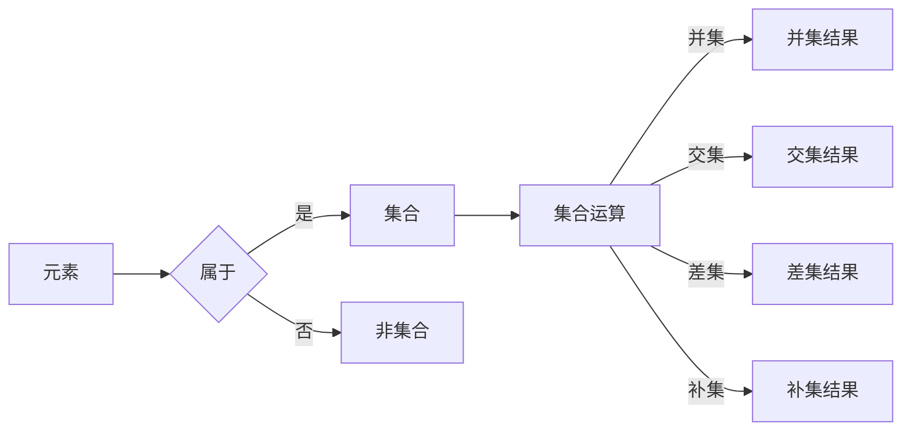

# 集合论导引：∑12集合

> 关键词：集合论，数学基础，抽象概念，元素，集合运算，公理化，Zermelo-Fraenkel集，集合论悖论

## 1. 背景介绍

集合论是现代数学的基石，它为数学提供了形式化的语言和严格的方法来研究对象和结构。自19世纪末由乔治·康托尔创立以来，集合论不仅推动了数学本身的发展，也为逻辑学、计算机科学、物理学等多个领域提供了重要的理论基础。本文旨在引导读者深入理解集合论的核心概念，特别是以Zermelo-Fraenkel集合论（ZFC）为基础的抽象概念和公理系统，以及它们在现代数学和计算机科学中的应用。

### 1.1 问题的由来

集合论起源于对数学基础的研究，特别是对数学对象定义一致性和逻辑推理的探讨。康托尔对集合的研究初衷是寻求数学对象的最基本定义，从而建立一个自洽的数学体系。然而，他的工作也引发了一系列悖论，如著名的“罗素悖论”，这促使数学家们对集合论进行严格化。

### 1.2 研究现状

集合论的研究已经经历了几个阶段，从康托尔的时代到今天的ZFC，集合论已经发展成为一个庞大的理论体系。现代集合论以ZFC为基础，通过一组公理来定义集合的概念和集合之间的运算，从而避免悖论的发生。

### 1.3 研究意义

集合论的意义不仅在于其本身的理论价值，还在于它为其他数学分支提供了基础。集合论为数学的抽象思维提供了框架，使得数学家能够研究更复杂的概念和结构。

### 1.4 本文结构

本文将分为以下几个部分：
- 介绍集合论的基本概念和联系。
- 详细阐述ZFC公理系统的原理和具体操作步骤。
- 分析集合论在数学和计算机科学中的应用。
- 探讨集合论的未来发展趋势和挑战。

## 2. 核心概念与联系

### 2.1 集合的定义

集合是由确定的、互不相同的对象组成的整体。这些对象称为集合的元素。集合可以用大括号{}表示，元素之间用逗号隔开。

### 2.2 集合的运算

集合的基本运算包括并集、交集、差集、补集等。

- 并集：两个集合A和B的并集是一个包含A和B所有元素的集合，记作$A \cup B$。
- 交集：两个集合A和B的交集是一个同时属于A和B的元素组成的集合，记作$A \cap B$。
- 差集：两个集合A和B的差集是所有属于A但不属于B的元素组成的集合，记作$A \setminus B$。
- 补集：集合A的补集是在全集U中不属于A的元素组成的集合，记作$A^c$。

### 2.3 Mermaid流程图



## 3. 核心算法原理 & 具体操作步骤

### 3.1 算法原理概述

Zermelo-Fraenkel集合论（ZFC）是一套公理系统，它通过一组公理来定义集合的概念和集合之间的运算。ZFC包括以下公理：

- 空集公理：存在一个空集，不包含任何元素。
- 单例公理：对于每一个性质P，存在一个唯一的集合，其元素恰好满足性质P。
- 并集公理：对于任意集合A，存在一个集合B，其元素恰好是所有属于A的元素的集合。
- 选择公理：对于任意非空集合的集合族，存在一个选择函数，使得对于每一个集合中的元素，都有一个唯一的元素被选择。
- 全集公理：存在一个全集U，包含所有元素。

### 3.2 算法步骤详解

1. 确定全集U。
2. 根据单例公理，对于每个性质P，确定对应的集合。
3. 使用并集公理，构建包含所有满足性质P的集合的并集。
4. 使用选择公理，从每个非空集合中选择一个元素。
5. 使用补集公理，对于全集U中的每个集合，确定其补集。

### 3.3 算法优缺点

ZFC的优点在于其简洁性和严格性，它提供了一个逻辑上自洽的集合论体系。然而，ZFC也存在一些缺陷，如全集公理的存在性问题。

### 3.4 算法应用领域

ZFC在数学的各个分支中都有广泛的应用，如拓扑学、分析学、代数学等。

## 4. 数学模型和公式 & 详细讲解 & 举例说明

### 4.1 数学模型构建

集合论的基本模型是由元素和集合之间的包含关系组成的。

### 4.2 公式推导过程

集合论中的许多公式都是通过定义和公理推导出来的。例如，集合的并集公式：

$$
A \cup B = \{x | x \in A \text{ 或 } x \in B\}
$$

### 4.3 案例分析与讲解

以下是一个简单的集合论案例分析：

**问题**：给定集合$A = \{1, 2, 3\}$和$B = \{2, 3, 4\}$，求$A \cap B$。

**解答**：根据集合的交集定义，$A \cap B$包含同时属于A和B的元素，因此：

$$
A \cap B = \{2, 3\}
$$

## 5. 项目实践：代码实例和详细解释说明

### 5.1 开发环境搭建

本节将以Python为例，展示如何使用集合论进行简单的集合运算。

```bash
# 安装Python和Python解释器
# 安装集合论相关的Python库
pip install collections
```

### 5.2 源代码详细实现

以下是一个简单的集合运算示例：

```python
import collections

# 创建集合
A = {1, 2, 3}
B = {2, 3, 4}

# 计算并集
union = A.union(B)

# 计算交集
intersection = A.intersection(B)

# 计算差集
difference = A.difference(B)

# 打印结果
print("Union:", union)
print("Intersection:", intersection)
print("Difference:", difference)
```

### 5.3 代码解读与分析

这段代码首先导入了Python的collections模块，然后创建了两个集合A和B。使用union()、intersection()和difference()方法分别计算了并集、交集和差集，并将结果打印出来。

### 5.4 运行结果展示

运行上述代码，将得到以下输出：

```
Union: {1, 2, 3, 4}
Intersection: {2, 3}
Difference: {1}
```

## 6. 实际应用场景

集合论在计算机科学中有着广泛的应用，例如：

- 数据结构：集合论是许多数据结构的基础，如集合、字典、集合等。
- 算法：集合论用于设计高效的算法，如排序、搜索等。
- 程序设计：集合论的概念和术语在程序设计中经常使用。

### 6.4 未来应用展望

随着计算机科学的发展，集合论的应用将会更加广泛。例如，在人工智能领域，集合论可以用于知识表示和推理。

## 7. 工具和资源推荐

### 7.1 学习资源推荐

- 《集合论及其应用》
- 《数学原理》
- 《数学基础》

### 7.2 开发工具推荐

- Python
- Java

### 7.3 相关论文推荐

- 《集合论的基本概念》
- 《集合论的悖论》

## 8. 总结：未来发展趋势与挑战

### 8.1 研究成果总结

集合论是数学和计算机科学的基础，它为理论和实践提供了重要的工具。

### 8.2 未来发展趋势

集合论将继续在数学和计算机科学中发挥重要作用。

### 8.3 面临的挑战

集合论的公理化仍然是数学界的一个挑战。

### 8.4 研究展望

集合论的研究将继续深入，为数学和计算机科学的发展做出贡献。

## 9. 附录：常见问题与解答

**Q1：什么是集合？**

A：集合是由确定的、互不相同的对象组成的整体。

**Q2：什么是集合的元素？**

A：集合的元素是组成集合的个体。

**Q3：什么是集合论？**

A：集合论是研究集合的概念、性质和运算的数学分支。

**Q4：什么是Zermelo-Fraenkel集合论（ZFC）？**

A：Zermelo-Fraenkel集合论是一套公理系统，它通过一组公理来定义集合的概念和集合之间的运算。

**Q5：集合论有什么应用？**

A：集合论在数学和计算机科学中有着广泛的应用，如数据结构、算法、程序设计等。

作者：禅与计算机程序设计艺术 / Zen and the Art of Computer Programming