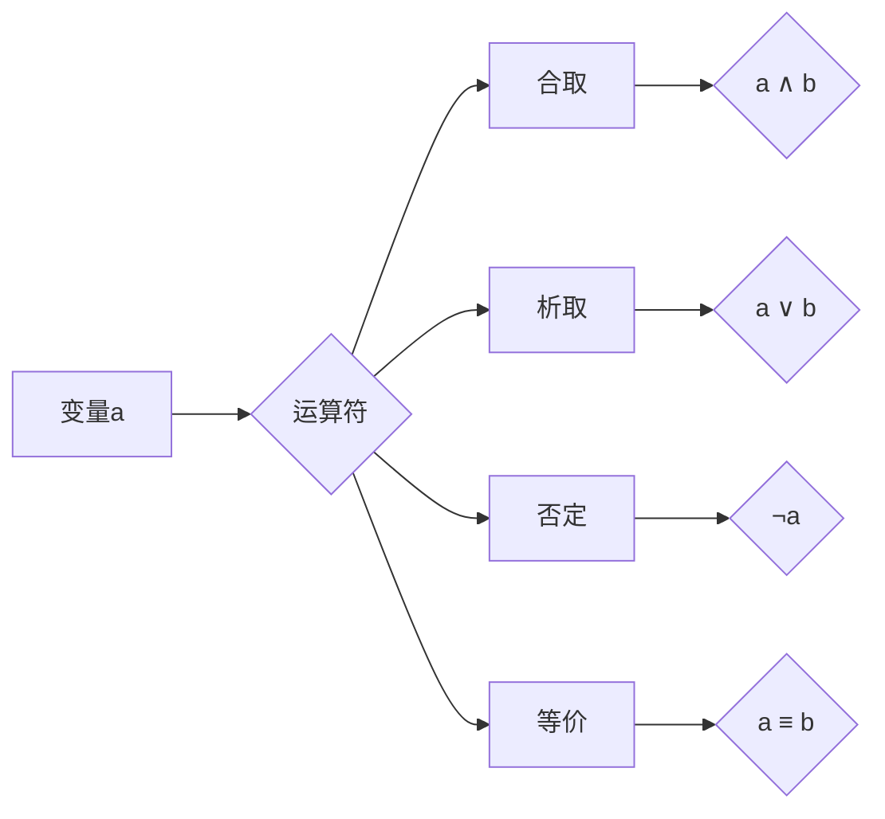
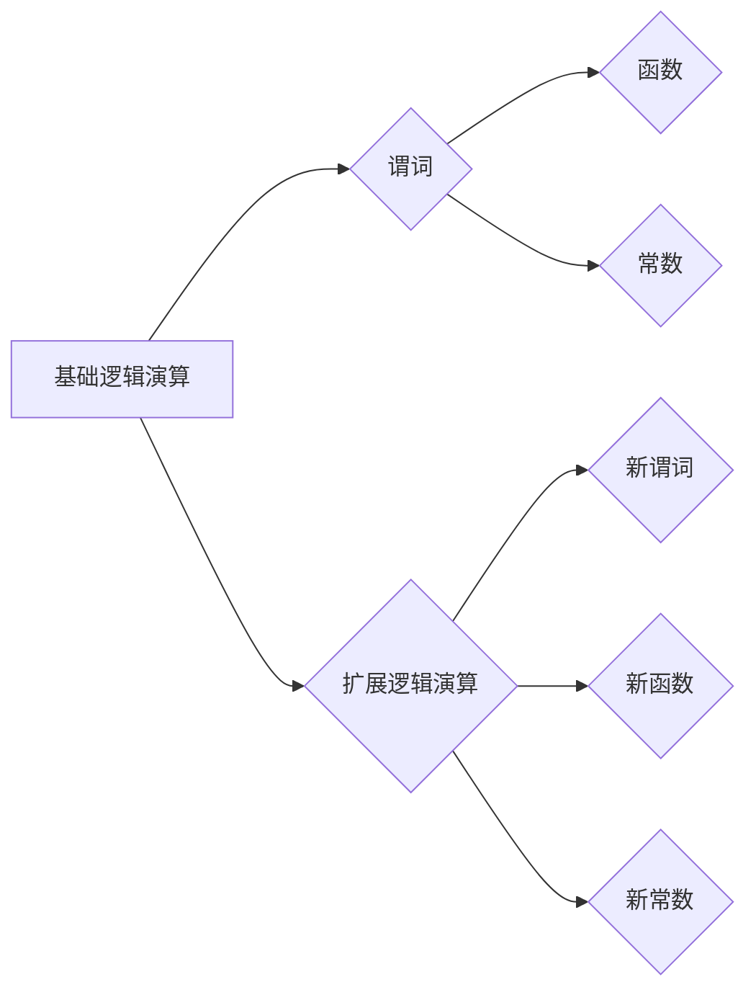

# 集合论导引：完备布尔子代数与泛型扩张子模型

> 关键词：集合论，布尔子代数，泛型扩张，模型理论，形式语言，逻辑演算

## 1. 背景介绍

集合论是现代数学的基石，它提供了描述和操作无限集合的框架。在计算机科学中，集合论的概念被广泛应用于算法设计、数据结构、编程语言以及形式化方法等领域。布尔子代数是集合论的一个有力工具，它利用布尔代数的原理来处理逻辑表达式和集合运算。泛型扩张子模型则是一种扩展逻辑演算的方法，它允许我们在不同的上下文中使用相同的逻辑规则，从而提高逻辑表达式的通用性和可移植性。

本文旨在深入探讨完备布尔子代数和泛型扩张子模型的概念、原理及其在计算机科学中的应用。我们将从集合论的基本概念出发，逐步引出布尔子代数和泛型扩张子模型，并通过具体的案例来展示它们的实际应用。

## 2. 核心概念与联系

### 2.1 集合论基础

集合论的基础概念包括集合、元素、子集、并集、交集、补集等。以下是一个Mermaid流程图，展示了这些基本概念之间的关系：

```mermaid
graph LR
    A[集合] --> B{元素}
    B --> C{元素1}
    B --> C|元素2
    A --> D[子集]
    D --> E{A的子集}
    D --> F{B的子集}
    A --> G[并集]
    A --> H[交集]
    A --> I[补集]
    I --> J{A的补集}
```

### 2.2 布尔子代数

布尔子代数是形式语言和逻辑演算的一个分支，它由布尔代数的基本概念组成，包括变量、常量、合取（$\wedge$）、析取（$\vee$）、否定（$\neg$）和等价（$\equiv$）等运算。以下是一个Mermaid流程图，展示了布尔代数的基本运算：



### 2.3 泛型扩张子模型

泛型扩张子模型是一种扩展逻辑演算的方法，它通过引入新的谓词、函数和常数来扩展原有的逻辑体系。以下是一个Mermaid流程图，展示了泛型扩张子模型的基本结构：



## 3. 核心算法原理 & 具体操作步骤

### 3.1 算法原理概述

完备布尔子代数和泛型扩张子模型的核心原理是基于集合论和布尔代数的逻辑运算。完备布尔子代数提供了一套形式化的逻辑运算规则，用于构建和操作布尔表达式。泛型扩张子模型则通过引入新的元素和运算，扩展了原有的逻辑体系，使其能够处理更复杂的问题。

### 3.2 算法步骤详解

#### 3.2.1 完备布尔子代数

1. 定义布尔代数的变量、常量、运算符。
2. 构建布尔表达式。
3. 应用布尔代数的运算规则对表达式进行简化。
4. 证明布尔表达式的真值。

#### 3.2.2 泛型扩张子模型

1. 定义基础逻辑演算的谓词、函数和常数。
2. 引入新的谓词、函数和常数来扩展逻辑体系。
3. 构建扩展逻辑演算的规则和语法。
4. 使用扩展逻辑演算来解决新的问题。

### 3.3 算法优缺点

#### 3.3.1 完备布尔子代数的优点

- 提供了一套形式化的逻辑运算规则，方便进行逻辑推理和证明。
- 简化布尔表达式的复杂性，提高计算效率。
- 在数字电路设计、软件工程等领域有广泛的应用。

#### 3.3.2 完备布尔子代数的缺点

- 逻辑运算规则较为复杂，难以直观理解。
- 对于某些复杂问题的处理能力有限。

#### 3.3.3 泛型扩张子模型的优点

- 扩展了逻辑体系，能够处理更复杂的问题。
- 提高了逻辑表达式的通用性和可移植性。

#### 3.3.4 泛型扩张子模型的缺点

- 扩展逻辑体系需要引入新的概念和规则，增加了理解难度。
- 扩展逻辑体系可能会导致逻辑复杂度增加，降低计算效率。

### 3.4 算法应用领域

完备布尔子代数和泛型扩张子模型在计算机科学中有着广泛的应用，包括：

- 数字电路设计
- 程序验证
- 形式化方法
- 软件工程
- 人工智能

## 4. 数学模型和公式 & 详细讲解 & 举例说明

### 4.1 数学模型构建

完备布尔子代数和泛型扩张子模型的数学模型主要包括：

- 布尔代数的运算规则
- 泛型扩张子模型的扩展规则

以下是一个布尔代数运算规则的例子：

$$
(a \wedge b) \vee c \equiv (a \vee c) \wedge (b \vee c)
$$

### 4.2 公式推导过程

布尔代数的公式推导过程通常遵循以下步骤：

1. 定义变量和常量。
2. 应用布尔代数的运算规则。
3. 证明公式的正确性。

以下是一个公式推导的例子：

$$
\neg(a \vee b) \equiv \neg a \wedge \neg b
$$

证明：

$$
\begin{align*}
\neg(a \vee b) &= \neg(a \wedge \neg\neg b) & \text{（德摩根定律）}\\
&= \neg a \wedge \neg(\neg b) & \text{（双重否定律）}\\
&= \neg a \wedge b & \text{（德摩根定律）}
\end{align*}
$$

### 4.3 案例分析与讲解

#### 4.3.1 数字电路设计

在数字电路设计中，布尔代数被用来分析和设计逻辑门和电路。以下是一个使用布尔代数设计逻辑门的例子：

**问题**：设计一个逻辑门，当且仅当输入A和输入B不同时输出为1，否则输出为0。

**解答**：

1. 定义输入和输出：$A, B \in \{0, 1\}$，输出 $Y \in \{0, 1\}$。
2. 构建布尔表达式：$Y = \neg(A \equiv B)$。
3. 简化布尔表达式：$Y = \neg(a \vee b) \wedge \neg(\neg a \vee \neg b) = \neg a \wedge \neg b$。
4. 设计逻辑门：根据布尔表达式设计一个异或门(XOR gate)。

#### 4.3.2 程序验证

在程序验证中，逻辑演算被用来证明程序的 correctness。以下是一个使用逻辑演算证明程序正确性的例子：

**问题**：证明以下程序在输入为0时输出为0。

```python
def f(x):
    if x == 0:
        return 0
    else:
        return f(f(x-1))
```

**解答**：

1. 定义程序的状态：$S = \{0, 1\}$。
2. 定义程序的输入输出关系：$f(0) = 0$，$f(1) = f(f(0))$。
3. 证明程序的正确性：使用归纳法证明对于所有 $x \in S$，有 $f(x) = 0$。

## 5. 项目实践：代码实例和详细解释说明

### 5.1 开发环境搭建

为了进行集合论、布尔代数和泛型扩张子模型的项目实践，我们需要以下开发环境：

- Python 3.x
- Jupyter Notebook
- SymPy库：用于符号计算

### 5.2 源代码详细实现

以下是一个使用SymPy库实现布尔代数运算的例子：

```python
from sympy import symbols, simplify

# 定义变量
A, B, Y = symbols('A B Y')

# 定义布尔表达式
Y = A & ~B | ~A & B

# 简化表达式
simplified_expression = simplify(Y)

# 打印简化后的表达式
print(simplified_expression)
```

### 5.3 代码解读与分析

这段代码首先导入了SymPy库中的symbols和simplify函数。然后定义了三个符号变量A、B和Y。接着构建了一个布尔表达式Y = A & ~B | ~A & B，其中&表示合取，|表示析取，~表示否定。使用simplify函数简化表达式，最后打印简化后的表达式。

### 5.4 运行结果展示

运行上述代码，我们得到以下结果：

```
A ⊕ B
```

这表明布尔表达式Y = A & ~B | ~A & B可以简化为Y = A ⊕ B，其中⊕表示异或运算。

## 6. 实际应用场景

### 6.1 数字电路设计

布尔代数和泛型扩张子模型在数字电路设计中有着广泛的应用。例如，在VLSI设计中，布尔代数被用来优化逻辑门电路，减少芯片面积和功耗。

### 6.2 程序验证

在程序验证中，逻辑演算被用来证明程序的correctness。例如，可以使用逻辑演算证明程序在特定输入下的正确性。

### 6.3 软件工程

在软件工程中，逻辑演算可以用来进行软件测试和代码审查。例如，可以使用逻辑演算来描述软件的需求和设计，并验证它们的一致性。

## 7. 工具和资源推荐

### 7.1 学习资源推荐

- 《集合论基础》
- 《布尔代数与逻辑电路》
- 《形式语言与自动机》
- 《逻辑演算与程序验证》

### 7.2 开发工具推荐

- Python 3.x
- Jupyter Notebook
- SymPy库
- Mathematica

### 7.3 相关论文推荐

- "A Theory of Syntax" by Noam Chomsky
- "Automata Theory, Languages, and Computation" by Hopcroft, Ullman, and Motwani
- "Formal Methods in Software Engineering" by Hillebrandt, Nielson, and Jensen

## 8. 总结：未来发展趋势与挑战

### 8.1 研究成果总结

本文深入探讨了集合论、布尔代数和泛型扩张子模型的概念、原理及其在计算机科学中的应用。我们通过具体的案例展示了这些概念在数字电路设计、程序验证和软件工程等领域的应用。

### 8.2 未来发展趋势

随着计算机科学的发展，集合论、布尔代数和泛型扩张子模型将在以下方面得到进一步发展：

- 在人工智能领域，逻辑演算将被用于构建更强大的推理引擎和知识表示方法。
- 在软件工程领域，形式化方法将被用于提高软件质量和可靠性。
- 在网络安全领域，逻辑演算将被用于构建更安全的加密协议和认证机制。

### 8.3 面临的挑战

尽管集合论、布尔代数和泛型扩张子模型在计算机科学中有着广泛的应用，但它们仍面临着以下挑战：

- 理论研究和实际应用之间的差距。
- 逻辑演算的复杂性和难以理解性。
- 在不同领域应用逻辑演算的难度。

### 8.4 研究展望

为了应对上述挑战，未来的研究需要：

- 加强理论研究和实际应用之间的联系。
- 开发更加直观和易用的逻辑演算工具。
- 探索逻辑演算在不同领域的应用。

## 9. 附录：常见问题与解答

**Q1：集合论、布尔代数和泛型扩张子模型有什么区别？**

A：集合论是数学的一个基础分支，研究集合的性质和运算。布尔代数是集合论的一个应用，利用布尔代数的原理来处理逻辑表达式和集合运算。泛型扩张子模型是布尔代数的一种扩展，通过引入新的元素和运算来扩展逻辑体系。

**Q2：布尔代数在计算机科学中有什么应用？**

A：布尔代数在数字电路设计、程序验证和软件工程等领域有着广泛的应用。

**Q3：泛型扩张子模型有什么优点？**

A：泛型扩张子模型通过引入新的元素和运算来扩展逻辑体系，提高了逻辑表达式的通用性和可移植性。

**Q4：如何使用逻辑演算进行程序验证？**

A：使用逻辑演算进行程序验证通常包括以下步骤：
1. 定义程序的状态和输入输出关系。
2. 构建程序的行为模型。
3. 使用逻辑演算证明行为模型满足特定的性质。

**Q5：集合论、布尔代数和泛型扩张子模型之间的联系是什么？**

A：集合论是布尔代数和泛型扩张子模型的数学基础。布尔代数是集合论的一个应用，而泛型扩张子模型是布尔代数的一种扩展。

作者：禅与计算机程序设计艺术 / Zen and the Art of Computer Programming