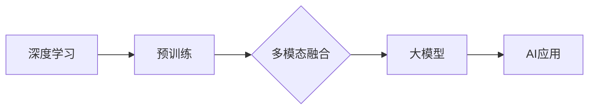

# 驱动当下AI大模型发展的三驾马车

> 关键词：AI大模型，深度学习，预训练，多模态，可解释性，可扩展性，伦理安全

## 1. 背景介绍

随着计算能力的提升和海量数据的积累，人工智能（AI）领域取得了惊人的进步。特别是近年来，大模型（Large Models）的出现，为AI技术的发展带来了新的机遇和挑战。大模型通常包含数十亿甚至数千亿参数，能够在多种任务上展现出超越人类的能力。本文将探讨驱动当下AI大模型发展的三驾马车：深度学习、预训练和多模态融合。

## 2. 核心概念与联系

### 2.1 深度学习

深度学习是一种利用多层神经网络对数据进行学习的算法。它通过模拟人脑的神经网络结构，实现了对复杂数据的自动特征提取和模式识别。深度学习是驱动AI大模型发展的核心技术之一。

### 2.2 预训练

预训练是指在大量无标注数据上进行的训练过程，旨在学习通用的数据表征和知识。预训练模型通常在自然语言处理（NLP）、计算机视觉（CV）等领域取得了显著成果，为大模型的发展奠定了基础。

### 2.3 多模态融合

多模态融合是指将不同类型的数据（如图像、文本、音频等）进行整合，以获得更全面的信息。多模态融合是提升AI大模型理解和处理能力的重要途径。

以下是大模型发展的Mermaid流程图：



## 3. 核心算法原理 & 具体操作步骤

### 3.1 算法原理概述

#### 3.1.1 深度学习

深度学习的基本单元是神经网络，它由输入层、隐藏层和输出层组成。每层由多个神经元组成，神经元之间通过权重进行连接。神经网络通过反向传播算法学习输入数据到输出数据的映射关系。

#### 3.1.2 预训练

预训练通常使用自监督学习或无监督学习算法，在大量无标注数据上进行。常见的预训练任务包括词嵌入、语言模型、视觉特征提取等。

#### 3.1.3 多模态融合

多模态融合方法包括直接融合、特征融合和决策融合等。直接融合将不同模态的数据直接输入到同一模型中；特征融合将不同模态的数据转换成特征向量，再进行融合；决策融合则是在多个模型分别处理不同模态数据后，进行最终的决策。

### 3.2 算法步骤详解

#### 3.2.1 深度学习

1. 设计神经网络结构，包括输入层、隐藏层和输出层。
2. 初始化模型参数。
3. 定义损失函数，如交叉熵损失、均方误差等。
4. 使用反向传播算法计算参数梯度。
5. 更新模型参数。
6. 评估模型性能。

#### 3.2.2 预训练

1. 收集无标注数据。
2. 定义预训练任务，如词嵌入、语言模型等。
3. 训练预训练模型，优化模型参数。
4. 保存预训练模型。

#### 3.2.3 多模态融合

1. 收集不同模态的数据。
2. 对不同模态的数据进行预处理。
3. 选择合适的融合方法。
4. 融合不同模态的数据。
5. 训练融合后的模型。

### 3.3 算法优缺点

#### 3.3.1 深度学习

**优点**：能够处理复杂数据，具有强大的特征提取和模式识别能力。

**缺点**：计算复杂度高，需要大量计算资源；模型可解释性差。

#### 3.3.2 预训练

**优点**：能够学习通用的数据表征和知识，提高模型泛化能力。

**缺点**：需要大量无标注数据，且预训练模型可能存在偏差。

#### 3.3.3 多模态融合

**优点**：能够整合不同模态的数据，提高模型性能。

**缺点**：融合方法复杂，需要针对不同任务进行设计。

### 3.4 算法应用领域

深度学习、预训练和多模态融合在以下领域得到广泛应用：

- 自然语言处理（NLP）
- 计算机视觉（CV）
- 语音识别
- 机器翻译
- 推荐系统
- 自动驾驶

## 4. 数学模型和公式 & 详细讲解 & 举例说明

### 4.1 数学模型构建

#### 4.1.1 深度学习

深度学习中的神经网络可以表示为以下公式：

$$
y = f(W \cdot x + b)
$$

其中，$y$ 为输出，$x$ 为输入，$W$ 为权重，$b$ 为偏置，$f$ 为激活函数。

#### 4.1.2 预训练

预训练模型中的语言模型可以表示为以下公式：

$$
P(w_t | w_{t-1}, ..., w_1) = \frac{\exp(f(w_{t-1}, ..., w_1, w_t))}{\sum_{w' \in V} \exp(f(w_{t-1}, ..., w_1, w'))}
$$

其中，$w_t$ 为当前单词，$w_{t-1}, ..., w_1$ 为前缀单词，$V$ 为单词集合。

#### 4.1.3 多模态融合

多模态融合可以使用以下公式表示：

$$
F(x, y) = g(f(x) \otimes h(y))
$$

其中，$x$ 和 $y$ 分别代表不同模态的数据，$f$ 和 $h$ 分别代表不同模态的特征提取函数，$\otimes$ 为特征融合操作。

### 4.2 公式推导过程

#### 4.2.1 深度学习

深度学习中的反向传播算法可以通过以下步骤进行推导：

1. 计算损失函数对输入的梯度。
2. 根据链式法则，计算损失函数对权重的梯度。
3. 使用梯度下降算法更新权重。

#### 4.2.2 预训练

预训练模型中的语言模型可以通过以下步骤进行推导：

1. 使用最大似然估计定义损失函数。
2. 对损失函数进行优化。
3. 保存优化后的模型。

#### 4.2.3 多模态融合

多模态融合的推导过程取决于具体的融合方法。常见的融合方法包括：

- 直接融合：将不同模态的数据直接拼接。
- 特征融合：将不同模态的数据转换成特征向量，再进行拼接或加权平均。
- 决策融合：将不同模态的数据分别处理，再进行最终的决策。

### 4.3 案例分析与讲解

#### 4.3.1 深度学习：卷积神经网络（CNN）

CNN是一种广泛应用于图像识别的深度学习模型。它通过卷积层提取图像特征，并通过池化层降低特征空间维度。以下是CNN的简化公式：

$$
h(x) = \sigma(W_c \cdot f(x) + b_c)
$$

其中，$h(x)$ 为卷积层的输出，$f(x)$ 为输入图像，$W_c$ 为卷积核，$b_c$ 为偏置，$\sigma$ 为激活函数。

#### 4.3.2 预训练：BERT

BERT是一种基于Transformer的预训练模型，它在NLP领域取得了显著成果。BERT通过掩码语言模型（Masked Language Model）和下一句预测任务进行预训练。以下是BERT的简化公式：

$$
\text{MLM}(x) = \frac{\exp(f(x))}{\sum_{w' \in V} \exp(f(w'))}
$$

$$
\text{NSP}(x, y) = P(y|x)
$$

其中，$\text{MLM}(x)$ 为掩码语言模型，$x$ 为输入文本，$f(x)$ 为Transformer的输出，$V$ 为单词集合；$\text{NSP}(x, y)$ 为下一句预测任务，$y$ 为下一个句子。

#### 4.3.3 多模态融合：多任务学习

多任务学习是一种多模态融合方法，它同时训练多个任务，以提升模型性能。以下是多任务学习的简化公式：

$$
L = \sum_{i=1}^N L_i
$$

其中，$L$ 为总损失，$L_i$ 为第$i$ 个任务的损失。

## 5. 项目实践：代码实例和详细解释说明

### 5.1 开发环境搭建

以下是使用Python进行深度学习项目开发的环境配置流程：

1. 安装Anaconda：从官网下载并安装Anaconda，用于创建独立的Python环境。
2. 创建并激活虚拟环境：
```bash
conda create -n deep-learning-env python=3.8
conda activate deep-learning-env
```
3. 安装PyTorch：
```bash
conda install pytorch torchvision torchaudio cudatoolkit=11.1 -c pytorch -c conda-forge
```
4. 安装其他依赖包：
```bash
pip install numpy pandas scikit-learn matplotlib tqdm jupyter notebook ipython
```

### 5.2 源代码详细实现

以下是一个简单的CNN模型实现：

```python
import torch
import torch.nn as nn

class CNN(nn.Module):
    def __init__(self, input_channels, num_classes):
        super(CNN, self).__init__()
        self.conv1 = nn.Conv2d(input_channels, 32, kernel_size=3, padding=1)
        self.relu = nn.ReLU()
        self.conv2 = nn.Conv2d(32, 64, kernel_size=3, padding=1)
        self.fc = nn.Linear(64 * 7 * 7, num_classes)

    def forward(self, x):
        x = self.relu(self.conv1(x))
        x = self.relu(self.conv2(x))
        x = x.view(x.size(0), -1)
        x = self.fc(x)
        return x

# 实例化模型
model = CNN(input_channels=1, num_classes=10)
```

### 5.3 代码解读与分析

以上代码实现了一个简单的CNN模型，包括两个卷积层和一个全连接层。模型输入为单通道图像，输出为10个类别的概率分布。

- `CNN` 类继承自 `nn.Module` 类，表示这是一个PyTorch模型。
- `__init__` 方法初始化模型结构，包括两个卷积层和一个全连接层。
- `forward` 方法定义了数据在模型中的传播过程。

### 5.4 运行结果展示

在完成模型定义后，可以使用PyTorch进行模型训练和测试。以下是一个简单的训练和测试示例：

```python
# 训练模型
criterion = nn.CrossEntropyLoss()
optimizer = torch.optim.Adam(model.parameters(), lr=0.001)

for epoch in range(10):
    for data, target in train_loader:
        optimizer.zero_grad()
        output = model(data)
        loss = criterion(output, target)
        loss.backward()
        optimizer.step()
    print(f"Epoch {epoch+1}, Loss: {loss.item()}")

# 测试模型
correct = 0
total = 0
with torch.no_grad():
    for data, target in test_loader:
        output = model(data)
        _, predicted = torch.max(output.data, 1)
        total += target.size(0)
        correct += (predicted == target).sum().item()

print(f"Accuracy of the model on the test images: {100 * correct / total}%")
```

## 6. 实际应用场景

### 6.1 自然语言处理

深度学习、预训练和多模态融合在自然语言处理领域得到了广泛应用。以下是一些示例：

- 文本分类：使用BERT等预训练模型进行情感分析、主题分类等任务。
- 机器翻译：使用Transformer等模型进行机器翻译。
- 对话系统：使用RNN或Transformer等模型构建对话系统。

### 6.2 计算机视觉

深度学习、预训练和多模态融合在计算机视觉领域也得到了广泛应用。以下是一些示例：

- 图像分类：使用CNN等模型对图像进行分类。
- 目标检测：使用Faster R-CNN等模型检测图像中的目标。
- 脸部识别：使用深度学习模型进行人脸识别。

### 6.3 语音识别

深度学习、预训练和多模态融合在语音识别领域也得到了广泛应用。以下是一些示例：

- 语音识别：使用RNN或Transformer等模型进行语音识别。
- 语音合成：使用GPT-3等模型进行语音合成。

## 7. 工具和资源推荐

### 7.1 学习资源推荐

- 《深度学习》系列书籍：由Ian Goodfellow、Yoshua Bengio和Aaron Courville合著，是深度学习的经典教材。
- 《神经网络与深度学习》系列课程：由吴恩达教授主讲，适合初学者入门深度学习。
- Hugging Face官方文档：提供了丰富的预训练模型和工具，是进行AI开发的必备资源。

### 7.2 开发工具推荐

- PyTorch：基于Python的开源深度学习框架，适合快速开发和实验。
- TensorFlow：由Google开发的开源深度学习框架，适合大规模生产和部署。
- Keras：基于Theano和TensorFlow的开源深度学习库，适合快速搭建模型。

### 7.3 相关论文推荐

- "AlexNet: Image Classification with Deep Convolutional Neural Networks"：提出AlexNet模型，是深度学习在图像分类领域的突破。
- "VGGNet: Very Deep Convolutional Networks for Large-Scale Image Recognition"：提出VGGNet模型，进一步提升了图像分类的精度。
- "Inception: GoogLeNet"：提出Inception模型，通过多尺度卷积和池化操作，提高了模型的性能和效率。
- "ResNet: Deep Residual Learning for Image Recognition"：提出ResNet模型，解决了深度神经网络训练过程中的梯度消失问题。

## 8. 总结：未来发展趋势与挑战

### 8.1 研究成果总结

本文探讨了驱动当下AI大模型发展的三驾马车：深度学习、预训练和多模态融合。这些技术为AI大模型的发展提供了强大的动力，推动了AI技术在各个领域的应用。

### 8.2 未来发展趋势

未来，AI大模型将朝着以下方向发展：

- 更大的模型：随着计算能力的提升，AI大模型的规模将不断增大，以更好地处理复杂数据。
- 更多的模态：AI大模型将融合更多模态的数据，以获得更全面的信息。
- 更好的可解释性：AI大模型的可解释性将得到提升，使得模型更容易被理解和使用。
- 更高的可扩展性：AI大模型的开发和应用将更加容易，以降低AI技术的门槛。

### 8.3 面临的挑战

AI大模型发展面临着以下挑战：

- 计算能力：AI大模型需要更多的计算资源，以支持大规模训练和推理。
- 数据质量：AI大模型需要高质量的数据，以避免过拟合和偏差。
- 伦理安全：AI大模型的应用需要遵守伦理和安全规范，以避免滥用和负面影响。

### 8.4 研究展望

未来，AI大模型的研究将关注以下方向：

- 新的深度学习架构：设计更高效、更鲁棒的深度学习架构。
- 新的预训练任务：设计新的预训练任务，以更好地学习通用知识和表征。
- 新的多模态融合方法：设计新的多模态融合方法，以更好地整合不同模态的数据。
- 新的可解释性和可扩展性技术：开发新的技术，以提升AI大模型的可解释性和可扩展性。

通过不断探索和创新，AI大模型有望在未来取得更大的突破，为人类社会带来更多福祉。

## 9. 附录：常见问题与解答

**Q1：什么是AI大模型？**

A：AI大模型是指包含数十亿甚至数千亿参数的深度学习模型，能够在多种任务上展现出超越人类的能力。

**Q2：深度学习、预训练和多模态融合分别是什么？**

A：深度学习是一种利用多层神经网络对数据进行学习的算法。预训练是指在大量无标注数据上进行的训练过程，旨在学习通用的数据表征和知识。多模态融合是指将不同类型的数据进行整合，以获得更全面的信息。

**Q3：AI大模型有哪些应用场景？**

A：AI大模型在自然语言处理、计算机视觉、语音识别、推荐系统、自动驾驶等领域得到广泛应用。

**Q4：AI大模型发展面临着哪些挑战？**

A：AI大模型发展面临着计算能力、数据质量、伦理安全等挑战。

**Q5：如何解决AI大模型的挑战？**

A：通过技术创新、政策法规、伦理道德等方面的努力，可以解决AI大模型的挑战。

---

作者：禅与计算机程序设计艺术 / Zen and the Art of Computer Programming